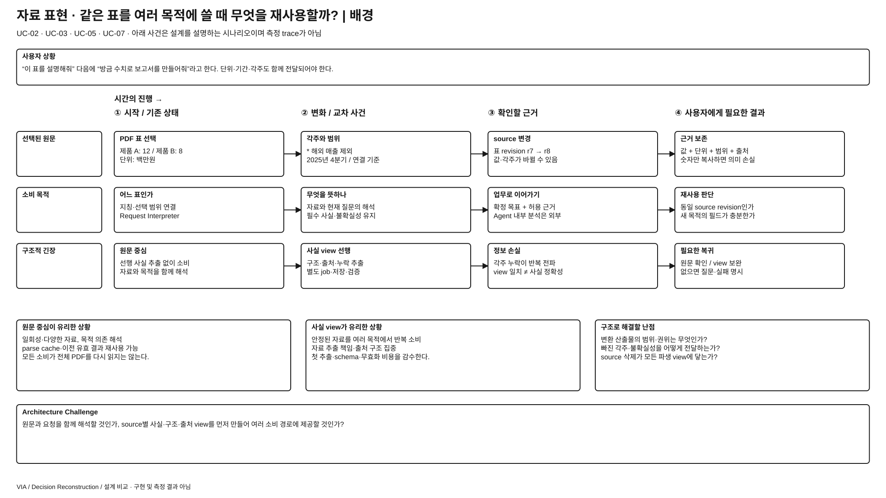
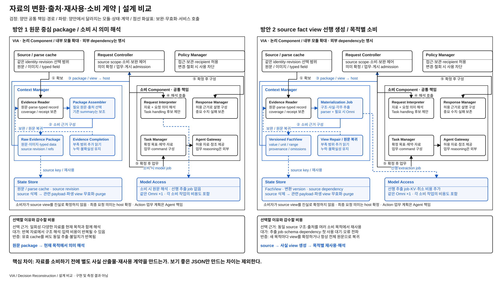

# 자료 원문을 직접 이해할 것인가, 재사용할 구조화 근거를 먼저 만들 것인가

> **상세 검토 후보 / 사용자 선정 전 / 기존 표현 아이디어를 target에 맞춰 재구성** · [목록](./README.md)
> 현재 target은 원문·이미지·typed record·출처를 보존하는 Evidence Package를 선택했다. 모든 자료의 최종 의미를 공통 변환기가 확정하는 설계로 해석하지 않는다.

## 발표용 2페이지

**배경 — 이 과제에서 왜 어려운가**

[배경 SVG 크게 보기](./diagrams/context-representation-pipeline-background.svg) · [배경 draw.io 편집 원본](./diagrams/context-representation-pipeline-background.drawio)

**설계 비교 — 같은 완료 조건을 만드는 두 실행 구조**

[비교 SVG 크게 보기](./diagrams/context-representation-pipeline-comparison.svg) · [비교 draw.io 편집 원본](./diagrams/context-representation-pipeline-comparison.drawio)

검정은 양안 공통, 파랑은 **양안 각각에서 달라지는 모듈·상태·계약**이다. 큰 테두리는 논리 책임 묶음이며 모든 상자가 별도 process라는 뜻이 아니다. 같은 Component를 여러 위치에 확대 표기해도 instance·모델 가중치를 복제하지 않는다. 그림의 내부 모듈과 아래 계약은 대안을 검토하기 위한 구체 설계이며 target 기준선 변경·구현·측정 결과가 아니다.

## ASR·추가 QA 관점의 장단점과 예상 차이

아래는 **동일 기능·완료 조건에서의 구조적 예상**이며 측정 결과나 승자 선정이 아니다. `PRIMARY`는 차이를 직접 검토할 축, `REGRESSION_ONLY`는 개선을 주장하기보다 기능 유지를 확인할 축이라는 **적용 제안**이다. 정식 모집단·수치·역할은 아직 동결하지 않았다. [현재 ASR 정의](../../08-quality-attributes/core-asr-contract.md)와 [상세 QA 의미](../../08-quality-attributes/README.md)를 유지한다.

**직관적인 핵심:** 1안은 원문을 필요한 목적과 함께 읽고, 2안은 원문에서 출처가 붙은 사실 카드를 먼저 만든 뒤 여러 곳에서 쓴다. 잘 만든 카드는 반복 해석을 줄이지만 카드에 빠진 각주나 잘못 옮긴 단위가 모든 소비자에게 퍼질 수 있다.

| 관점 · 적용 제안 | 방안 1의 장단점 | 방안 2의 장단점 | 차이가 나는 조건·주의점 |
| --- | --- | --- | --- |
| QA-19 의미·내용 정확성 · PRIMARY | **장점:** 현재 질문과 원문의 풍부한 관계를 함께 해석한다. **단점:** 같은 자료를 여러 번 읽을 때 값·단위·범위 해석이 서로 달라질 수 있다. | **장점:** 출처가 같은 fact를 여러 소비 경로에서 공유한다. **단점:** 선행 추출의 누락·오류가 일관되게 전파되며 새 목적에 중요한 정보가 없을 수 있다. | 일관성과 정확성은 다르다. 견적 금액 “100”에 통화·세금·기간·각주가 보존되는지, 없으면 원문 복귀하는지로 비교한다. |
| QA-09 응답성 · PRIMARY | **장점:** 일회성 자료는 별도 extraction을 기다리지 않는다. **단점:** 같은 source의 구조 해석·큰 입력 비용이 반복된다. | **장점:** 유효 FactView 재사용이면 후속 소비의 입력·해석 부담을 줄인다. **단점:** 첫 사용·변경 source는 추출→검사→소비의 대기를 추가한다. | 첫 사용과 반복 사용을 모두 포함한다. warm view만 골라 비교하면 구조의 초기 비용을 숨긴다. |
| QA-29 변경 용이성 · PRIMARY | **장점:** 새 문서 형태·소비 목적을 원문과 소비 계약에서 처리할 수 있다. **단점:** 소비자마다 같은 구조 대응이 중복될 수 있다. | **장점:** 안정된 사실 schema가 여러 소비자를 source format 변경에서 보호한다. **단점:** 새로운 의미 field가 schema·extractor·migration·소비자 전반에 퍼질 수 있다. | 새 파일 형식과 새로운 업무 의미를 구별한다. 모든 자료를 하나의 만능 schema에 강제하는 대안으로 만들지 않는다. |
| QA-39 신뢰성·복구 · PRIMARY | **장점:** 별도 materializer 장애 경로가 적고 원문에서 다시 읽을 수 있다. **단점:** 원문 해석 실패가 소비 때마다 반복될 수 있다. | **장점:** 유효 view로 반복 source 처리를 줄이고 view 손실은 원문에서 재구성한다. **단점:** 추출 실패·손상 view·source 삭제의 dependency 조정이 새 실패 지점이다. | 오류 view가 발견되면 무효화·원문 복귀·재생성이 가능해야 한다. 같은 오류를 여러 Task에 배포한 뒤 재구성됐다고 피해까지 사라지는 것은 아니다. |
| QA-41 메모리 · 추가 진단 | 큰 원문 prompt·이미지·parse buffer가 소비 중 필요할 수 있다. | 원문 외에 fact·provenance·dependency·추출 KV가 추가되지만 반복 소비 prompt를 줄일 여지가 있다. | 원문을 삭제해도 되는 것으로 비용을 낮추지 않는다. 최초 추출 peak와 재사용 peak를 구별한다. |
| QA-51 노출 최소화 / QA-61 출처 추적 · 추가 qualification | 원문 범위를 제한해 전달하며 소비 결과와 source revision 연결을 남겨야 한다. | 목적에 필요한 field만 전달할 여지는 있으나 서로 다른 문맥의 민감정보를 한 view에 모을 위험도 있다. | 구조화만으로 최소 노출·완전 추적이 보장되지는 않는다. 실제 recipient·purpose·원문 참조·누락을 확인한다. |

추가 QA는 기존 지위 그대로 진단·회귀·qualification으로 다룬다. 더 빠른 응답으로 잘못된 대상 실행·중복 실행·권한 위반을 상쇄하지 않는다. 메모리의 core ASR 승격이나 새 QA 정의는 이번 정성 비교에서 확정하지 않는다.

## 그림을 따라 설명할 실행 계약

왼쪽 **Context Manager** 안의 선행 변환·저장 산출물이 비교 대상이다. 오른쪽의 Request Interpreter·Response Manager·Task Manager·Agent Gateway는 공통 소비 책임을 유지한다. Context Manager가 직접 업무나 응답을 승인하지 않으며 package/view는 Request Controller로 반환되어 허용된 소비에 전달된다.

| 경계 / 상태 | 방안 1의 구체 동작 | 방안 2의 구체 동작 |
| --- | --- | --- |
| 기본 입력 | 원문·이미지·parse cache·typed field·출처를 묶은 Evidence Package | 같은 source revision을 고정해 Materialization Job 시작 |
| 선행 산출물 | 별도 사실 산출물은 필수가 아님; 목적별 semantic 작업이 자료를 해석 | `FactView(view_id, source_id, source_revision, scope, transform_version, facts[], omissions[], uncertainty, provenance)` |
| fact 항목 | 소비 시 필요한 의미와 근거를 연결 | 값·단위·범위·각주·원문 span/region을 연결; 자료 사실을 추출하며 사용자 목표·업무 계획은 만들지 않음 |
| 재사용 key | source revision·scope에 결합한 원문/parse cache | source revision·허용 scope·변환 schema/build·dependency key가 같은 view만 재사용 |
| 실패 / 보완 | 필요한 원문 범위를 추가 읽고 동일 해석 계약으로 처리 | 누락·확신 부족·새 목적의 미지원 field는 원문 한정 복귀 또는 view 확장 job; 불완전한 view를 완전한 사실로 승격하지 않음 |
| 최종 승인 | Request Controller가 사용 evidence와 요청 의미·권한 검사 | 동일; view의 내용 자체가 Semantic Commit이나 외부 Action 허용이 아님 |

**표의 예:** 견적서의 “100”을 추출했다면 통화·세금 포함 여부·견적 적용 기간·각주가 함께 있어야 한다. 1안은 현재 질문과 원문을 함께 보며 이 관계를 해석한다. 2안은 출처가 연결된 사실 view를 먼저 만들고 요약·비교·Agent 전달에 재사용한다. 같은 추출 오류가 여러 소비 경로로 퍼질 수 있으므로 중요한 field의 원문 참조와 누락 표시는 선택 사항이 아니다.

**변경·삭제와 수명:** source revision이 달라지면 이전 view를 DIRTY로 만들고 새 view를 완성한 뒤 expected revision으로 교체한다. 취소·stale 추출 결과는 publish하지 않는다. 원문이 삭제·접근 철회되면 payload·파생 view를 use fence로 차단하고 purge한다. Unused view는 유한 cache budget에서 회수한다. 최초 변환의 모델 입력·KV·추출 시간과 이후 재사용 비용을 분리해 설명한다.

**심사 질문 — “그냥 JSON 형태만 다른 것 아닌가?”** 별도 추출 job과 versioned 사실 산출물이 소비 전에 존재하고 여러 목적의 실행 의존을 바꾼다. 실제로는 매번 전체 원문을 다시 읽거나 목적마다 모든 사실을 재추출해야 한다면 재사용 경계가 없으며 대안의 비용만 남는다.

## 1. 배경 — 같은 자료를 가리키고 설명하고 업무에 넘길 때 무엇을 재사용할까?

사용자가 PDF 표를 선택해 “이 표를 설명해줘”라고 묻고, 이어 “방금 설명한 수치로 보고서를 만들어줘”라고 한다. 표의 열 제목·단위·각주·선택 범위가 빠지면 숫자가 맞아도 뜻이 달라진다. VIA는 어떤 표인지 찾는 근거, 설명할 내용, Agent에 제공할 자료를 연결해야 한다. 그러나 최종 보고서 분석·작성은 Agent 책임이다.

현재 설계는 필요한 원문·이미지·구조화 기록을 출처와 함께 전달하고 실제 의미 해석에서 사용한다. 대안은 선택된 source 범위에서 **재사용 가능한 구조화 사실 view를 먼저 만든 뒤** 요청 해석·답변·위임 준비가 그 view를 소비하게 한다. 재해석을 줄이는 대신 추출·검증·캐시 수명이라는 새 단계가 생긴다. 한 번 잘못 추출하면 여러 소비 경로가 같은 오류를 공유할 수도 있다.

현재 근거는 [기억 계약 §2~3](../target-architecture/memory-and-context-lifecycle.md#2-context-획득과-지칭의-정확성), [전체 구조 §7·9](../target-architecture/architecture.md#9-contextcachestale-처리)의 원문·시각 근거·query receipt·파생 요약 정책이다. [UC-02](../../05-representative-use-cases.md#uc-02), [UC-03](../../05-representative-use-cases.md#uc-03), [UC-05](../../05-representative-use-cases.md#uc-05), [UC-07](../../05-representative-use-cases.md#uc-07)의 자료 설명과 후속 업무가 배경이다.

## 2. 무엇을 바꾸는가

같은 source identity·revision·허용 구간을 확보한 **뒤의 변환·소비 경로**만 비교한다. 어떤 문서를 찾는지, 언제 조회하는지, Task를 고르는지, 모델 가중치는 공통이다. 단순 PDF parser 교체나 prompt 문구 차이를 독립 후보로 만들지 않는다.

앞서 언급한 ‘공통 표현 대 소비자별 표현’을 그대로 target의 양안으로 놓으면 문제가 있다. Target은 source의 의미를 공통 schema로 완전히 닫지 않으며, 원문과 목적에 맞는 근거도 제공한다. 따라서 **방안 1은 현재의 원문 중심 package**, **방안 2는 명시적인 materialization 단계와 재사용 계약을 가진 사실 view**로 정교화한다. 소비자는 양쪽 모두 목적별 prompt·projection을 쓸 수 있다.

## 3. 두 가지 구현 방식

### 방안 1 — 원문 중심 Evidence Package + 소비 시 의미 해석

1. Context Manager가 같은 source를 읽어 identity·revision·구간·원문/이미지·typed field·receipt를 묶는다. 기존 parser·cache와 파생 summary는 사용할 수 있다.
2. Request Interpreter가 요청·Task 후보와 이 근거를 함께 보고 지칭·목표·처리 방향을 제안한다. 자료 자체의 구조와 요청의 의미를 같은 작업에서 연결할 수 있다.
3. 직접 설명은 semantic 초안 또는 Response Manager의 구성 경로에서 허용 근거를 사용한다. Task Manager와 Agent Gateway는 확정된 요청·허용된 원자료/참조를 위임 계약에 연결한다.
4. 부족한 구간이나 필수 각주가 드러나면 host가 한정된 추가 읽기·재해석을 제어한다. 요약이 원문의 수치·부정·대상·권한을 대신하지 않는다.

같은 요청에서 해석 초안과 답변을 재사용할 수 있으며 모든 소비자에게 전체 PDF를 다시 해석하도록 강제하지 않는다. 차이는 공통 사실 view의 완성을 기다려야만 소비하는 별도 정상 단계가 없다는 점이다.

### 방안 2 — 구조화 사실 view materialization + 여러 소비 경로의 재사용

1. 같은 source 범위에 대해 Context Manager가 materialization job을 관리한다. 공통 parser로 얻은 구조를 사용하고, 의미 추출이 필요한 부분은 Model Access를 통해 같은 Omni의 별도 job으로 처리한다.
2. View에는 표의 제목·행/열·단위·각주·범위, 사실별 원문 위치, source revision, 변환 schema/build, 누락·불확실성을 담는다. 아래 설명용 필드는 새 코드 schema나 확정된 target 계약이 아니다.
3. Request Interpreter와 Response Manager는 해당 view의 필요한 projection과 원문 참조를 받는다. 수치·부정·조건 같은 필수 사실에는 대응 원문/typed evidence를 함께 붙이고, 누락·모호함은 한정 재조회·view 보완·원문 복귀로 처리한다.
4. 같은 source revision·범위·policy·변환 version이면 view를 재사용한다. 변경·삭제·권한 철회 시 의존 view와 소비 결과를 무효화한다. 새로운 목적에 필요한 필드가 없으면 구간·version이 명시된 view 확장 또는 원문 경로가 필요하다.

예를 들어 `value=12`만 저장하지 않고 값이 어느 표·행·열에서 나왔고 단위·기간·각주가 무엇인지 연결한다. 각주 해석이 모호하면 ‘확인된 수치’로 확정하지 않는다. Source view는 업무 목표·Task·routing·Action 승인을 결정하지 않으며, 구조화됐다는 이유로 사실이 참이라고 보장하지 않는다. Host의 schema 검사는 의미 검증을 대신하지 않는다.

대안은 원문 접근을 금지하지 않는다. 모든 정상 소비가 결국 원문으로 돌아가 동일한 전체 추론을 반복한다면 materialization 이점이 없어졌다는 반증이다. View가 완성될 때까지 무한 대기하지 않고 같은 deadline 아래 필요한 범위부터 만들거나 실패·원문 복귀를 명시한다. 임의의 새 OCR·embedding 모델이나 외부 조사 단계는 추가하지 않는다.

## 4. 같은 상황을 따라가 보면

| 사건 | 원문 중심 package | 구조화 사실 view |
| --- | --- | --- |
| 처음 보는 표를 한 번 설명 | 확보한 구간으로 바로 해석·답변 가능 | 자료 추출·view 검증 후 해석; 첫 사용의 추가 경계 |
| 같은 표를 다시 지칭·설명·위임 준비 | 같은 raw/parse cache·이전 유효 답변을 재사용, 필요한 의미 재해석 | 유효한 구조·출처 view를 여러 목적에 재사용; 목적별 요청 판단은 별도 |
| 원문 각주가 단위를 바꿈 | 요청 해석 때 각주를 함께 읽어 관계 판단 | view에 각주 관계가 없으면 잘못된 값이 여러 경로로 전파; 원문 검토·보완 필요 |
| 표 내용 revision 변경 | 관련 read set·cache 무효화 후 필요한 부분 읽기 | source→view→소비 결과의 dependency로 연쇄 무효화; 옛 view로 새 내용을 설명하지 않음 |
| 추출 오류·timeout | 별도 추출 단계 없음; 실제 해석 오류·timeout은 공통 위험 | view를 INVALID/미완료로 남기고 원문 복귀 또는 실패; 이미 든 추출 비용도 남음 |

한 번의 추출과 재사용은 정확성을 자동 향상시키지 않는다. 오류를 여러 소비자가 일관되게 반복할 수도 있다. 방안 1에도 원문을 놓치는 오류가 있고, 방안 2에도 source별 변환을 집중 검토할 이점이 있다. 같은 정답을 대안의 view에 미리 넣어 주는 비교는 하지 않는다.

## 5. Component·계약·비용의 실제 변화

| 위치 | 방안 1 | 방안 2 |
| --- | --- | --- |
| Context Manager | source 조회·근거 package·raw/typed cache | materialization job·view schema/version·dependency index·재생성 추가 |
| Request Interpreter | 원문·시각 근거와 요청을 결합해 해석 | view 소비·필수 근거 검사·보완 요청 계약; 최종 요청 해석 책임은 유지 |
| Response Manager / Agent Gateway | 허용된 내용·출처·원자료 연결 | view projection·원문 provenance 전달, 생략 범위 보존; Agent 내부 reasoning은 그대로 외부 |
| Model Access | 실제 요청 해석·필요 응답 구성 | 선행 추출 job·취소·재사용 비용; 같은 weights이나 추가 KV·workspace 발생 가능 |
| State Store | 원본 참조·receipt·파생 cache | view payload·source dependency·변환 version·삭제 상태 |

**현재 방식이 설득력 있는 조건:** 일회성·다양한 자료가 많고 요청의 의미를 알아야 필요한 표현도 정해지며, 충분한 원문이 모델 입력에 들어가는 경우다. 선행 추출과 schema 유지 없이 자료와 요청을 함께 해석할 수 있다.

**왜 대안을 선택할 수 있는가:** 같은 자료를 여러 차례 쓰고 구조가 안정적이며, 반복 추출의 비용·소비자별 해석 불일치가 큰 경우다. source 변환 책임을 집중시키고 작은 view로 반복 입력을 줄일 수 있으나, 전체 source를 미리 변환하지 않는 bounded·lazy 설계를 허용해야 한다.

**현재 선택을 다시 볼 조건:** 같은 source 구조를 반복해서 해석하느라 비용·오류가 커지고, 출처·누락을 보존하는 view가 실제 필요한 정보를 안정적으로 재사용하게 하는 경우다. 반대로 첫 사용 추출비가 크거나 새 목적마다 schema·view를 다시 만들고 원문으로 돌아가면 대안의 실익이 작다. 가독성 좋은 JSON을 만들었다는 사실만으로 구조적 가치가 입증되지는 않는다.

## 6. 다른 후보와 구분하는 범위

[Context 획득](./context-acquisition-strategy.md)은 source를 읽기 시작하는 시점, [기억 유지](./conversation-context-maintenance.md)는 owner 기록의 변경을 working view에 반영하는 시점이다. 이 후보는 **이미 확보한 자료를 어떤 변환 산출물로 소비하는가**다. 여기의 source view는 활성 대화 전체의 working view와 다르며, 한쪽에서 쓴 parser·raw cache·현재성 검사는 반대쪽에도 허용한다.

[요청 해석](./request-interpretation-topology.md)의 통합/단계별 의미 판단은 고정한다. 자료에서 표 구조·출처를 추출하는 선행 작업이 Task association이나 Agent planning을 대신하지 않는다. 영향받는 target 계약은 Evidence Package·Model Call Envelope·view lifecycle·source read set·삭제 dependency다. 별도 추출 호출은 현재 해석 2회 예산 밖의 공짜 작업이 아니다. 대안을 채택할 때 호출 종류·공통 자원 한도를 다시 정해야 하며 이번에는 수치·기준선을 바꾸지 않는다.

## 7. 발표 페이지의 핵심

**배경 1장:** 각주·단위가 있는 표 하나에서 ‘어느 표인가 → 설명해줘 → 이 내용으로 업무해줘’의 세 사용 목적을 펼친다. 재사용할 수 있는 자료 구조와 요청마다 달라지는 의미를 구분하고 각주 누락의 전파를 보여준다. 질문은 **“같은 자료를 매번 요청과 함께 이해할 것인가, 재사용할 근거 표현을 먼저 만들 것인가?”**다.

**비교 1장:** source·원문 cache·권한·최종 확정은 검정. 1안의 원문 package→소비 시 해석과 2안의 materialization→versioned fact view→목적별 소비를 양쪽 파랑. 추가 모델 job·원문 복귀·변경 무효화 선, 첫 사용/반복 사용 경로를 표시한다. View를 정답 DB처럼 그리지 않는다. 편집 가능한 `.drawio`/`.svg`는 후보 검토 후 제작한다.

## 8. 바로 사용할 발표 요약

**배경 5줄**

1. 같은 문서·표가 VIA의 지칭·직접 설명·후속 업무 연결에서 반복 사용된다.
2. 열 제목·단위·각주를 잃으면 같은 숫자도 잘못된 의미로 전달될 수 있다.
3. 원문과 요청을 함께 해석하면 목적에 맞게 이해할 수 있지만 자료 구조를 반복해서 읽을 수 있다.
4. 구조화 근거를 먼저 만들면 재사용할 수 있지만 선행 추출·schema·오류 전파 책임이 생긴다.
5. 핵심은 자료 처리 코드의 위치가 아니라 소비자가 원문과 재사용 view 중 무엇을 입력으로 받는가다.

**설계 비교 8줄**

1. 방안 1은 원문·이미지·typed record를 출처와 묶어 실제 요청 해석에 제공한다.
2. 방안 2는 source의 구조·사실·출처·누락을 별도 view로 만든 뒤 여러 소비 경로에 제공한다.
3. 두 안 모두 같은 원문 접근과 parser·cache를 허용하고 최종 요청 의미는 VIA가 검증한다.
4. 대안에는 추출 job·view schema·version·dependency·원문 복귀 경로가 추가된다.
5. 일회성·다양한 자료에는 원문 중심이, 안정된 자료를 반복 사용할 때는 view 재사용이 합리적이다.
6. 잘못 추출한 사실이 여러 소비자로 퍼지는 위험과 첫 사용의 추가 비용을 함께 감수한다.
7. 구조화됐다는 이유로 정확성을 보장하거나 원문 확인 비용을 생략하지 않는다.
8. 반복 사용에도 계속 원문을 재해석하거나 view가 단순 포맷 변경이면 독립 후보의 가치가 약해진다.
