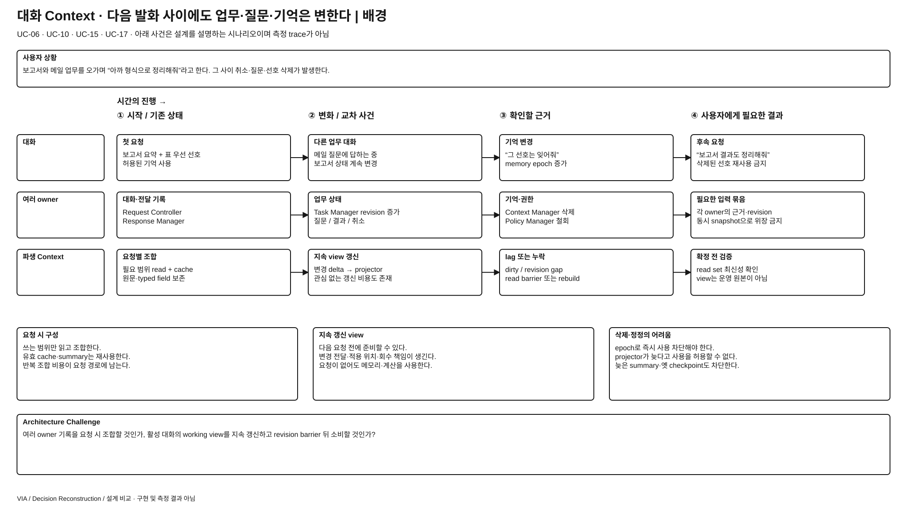
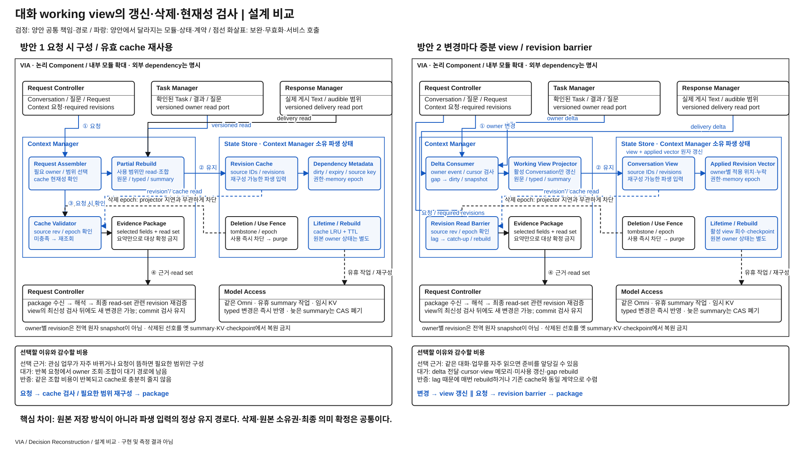

# 대화·업무 Context를 요청할 때 구성할 것인가, 계속 갱신해 둘 것인가

> **상세 검토 후보 / 사용자 선정 전** · [목록](./README.md)
> 원본 기억 저장이나 cache 유무가 아니라, 여러 owner의 기록을 모델 입력용 working view로 유지하는 정상 경로를 비교한다. 구현·성능 측정 없음.

## 발표용 2페이지

**배경 — 이 과제에서 왜 어려운가**

[배경 SVG 크게 보기](./diagrams/conversation-context-maintenance-background.svg) · [배경 draw.io 편집 원본](./diagrams/conversation-context-maintenance-background.drawio)

**설계 비교 — 같은 완료 조건을 만드는 두 실행 구조**

[비교 SVG 크게 보기](./diagrams/conversation-context-maintenance-comparison.svg) · [비교 draw.io 편집 원본](./diagrams/conversation-context-maintenance-comparison.drawio)

검정은 양안 공통, 파랑은 **양안 각각에서 달라지는 모듈·상태·계약**이다. 큰 테두리는 논리 책임 묶음이며 모든 상자가 별도 process라는 뜻이 아니다. 같은 Component를 여러 위치에 확대 표기해도 instance·모델 가중치를 복제하지 않는다. 그림의 내부 모듈과 아래 계약은 대안을 검토하기 위한 구체 설계이며 target 기준선 변경·구현·측정 결과가 아니다.

## ASR·추가 QA 관점의 장단점과 예상 차이

아래는 **동일 기능·완료 조건에서의 구조적 예상**이며 측정 결과나 승자 선정이 아니다. `PRIMARY`는 차이를 직접 검토할 축, `REGRESSION_ONLY`는 개선을 주장하기보다 기능 유지를 확인할 축이라는 **적용 제안**이다. 정식 모집단·수치·역할은 아직 동결하지 않았다. [현재 ASR 정의](../../08-quality-attributes/core-asr-contract.md)와 [상세 QA 의미](../../08-quality-attributes/README.md)를 유지한다.

**직관적인 핵심:** 1안은 질문이 들어오면 필요한 기록을 확인해 묶고, 2안은 자주 볼 요약 장부를 계속 갱신한다. 반복 질문은 빨라질 수 있지만 아무도 읽지 않는 동안의 갱신·메모리와 장부가 뒤처졌을 때의 복구 비용이 생긴다.

| 관점 · 적용 제안 | 방안 1의 장단점 | 방안 2의 장단점 | 차이가 나는 조건·주의점 |
| --- | --- | --- | --- |
| QA-19 의미 정확성 · PRIMARY | **장점:** 요청 시 원본 owner revision을 확인해 필요한 정보를 구성한다. **단점:** 여러 owner를 읽는 사이 변경되어 서로 다른 시점의 근거가 섞일 수 있다. | **장점:** 일관된 view 계약과 적용 위치를 검사하고 누락을 드러낸다. **단점:** projector lag·누락·오래된 summary가 새 상태를 가릴 수 있다. | 2안의 barrier도 전역 원자 snapshot은 아니다. “방금 취소한 업무를 계속 진행 중이라 말하는가”로 차이를 설명하고 최종 read-set 검사는 양안 유지한다. |
| QA-09 응답성 · PRIMARY | **장점:** 요청이 뜸하면 백그라운드 준비를 거의 하지 않는다. **단점:** 같은 owner 조합을 반복 조회·구성할 수 있다. | **장점:** view가 따라잡았으면 요청 시 조합 대기를 줄인다. **단점:** lag가 있으면 barrier 대기·catch-up·rebuild가 오히려 추가된다. | 읽기 빈도가 변경 빈도보다 높고 view가 제때 따라갈 때 2안이 설득력 있다. 매 요청이 다른 대화라면 유지 비용만 남을 수 있다. |
| QA-29 변경 용이성 · PRIMARY | **장점:** 새 field가 read port와 assembler에 머물 수 있다. **단점:** 여러 요청별 구성 로직에 같은 조합이 반복되면 수정 범위가 커진다. | **장점:** 소비자가 안정된 view schema를 공유한다. **단점:** 새 owner field에 delta schema·projector·revision vector·checkpoint·rebuild를 함께 바꿀 수 있다. | owner schema 변화와 단순 소비 목적 추가를 같은 변경으로 뭉뚱그리지 않는다. 공통 view가 모든 미래 요구를 흡수한다고 가정하지 않는다. |
| QA-39 신뢰성·복구 · PRIMARY | **장점:** cache를 잃어도 원본에서 필요 범위 재구성한다. **단점:** 재시작 후 여러 요청이 몰리면 cold read 부하가 생긴다. | **장점:** 유효 checkpoint가 있으면 갱신 위치부터 따라잡을 수 있다. **단점:** delta gap·stale checkpoint·삭제 epoch를 잘못 처리하면 오래된 정보가 부활한다. | view 손실·gap 후 요청 기능을 언제 정확히 재개하는지 본다. projector process 재시작만으로 복구 완료가 아니다. |
| QA-41 메모리 · 추가 진단 | 요청 package·유효 cache 중심이지만 burst 중 중복 조합이 peak를 키울 수 있다. | 활성 view·cursor·delta queue·checkpoint buffer가 상시 남는 대신 반복 임시 복사를 줄일 여지가 있다. | 활성 Conversation 수·변경 burst·cache 중복에 따라 peak가 달라진다. “상시 유지”와 “항상 더 큰 peak”는 같은 말이 아니다. |
| QA-15 연속성 / QA-51 노출 최소화 · 추가 회귀·qualification | 전환 뒤 필요한 과거 대상·Task를 원본에서 정확히 다시 연결해야 한다. | 옛 대화의 view를 새 대화에 잘못 재사용하거나 삭제된 선호를 부활시키지 않아야 한다. | 기억 삭제·권한 철회는 우위로 교환할 기능이 아니다. 로컬 파생 사본 증가는 관리 부담이며 실제 외부 과다 노출은 별도로 확인한다. |

추가 QA는 기존 지위 그대로 진단·회귀·qualification으로 다룬다. 더 빠른 응답으로 잘못된 대상 실행·중복 실행·권한 위반을 상쇄하지 않는다. 메모리의 core ASR 승격이나 새 QA 정의는 이번 정성 비교에서 확정하지 않는다.

## 그림을 따라 설명할 실행 계약

상단 세 owner는 대화·Task·실제 전달 기록의 원본을 계속 소유한다. 왼쪽 **Context Manager**의 일시 조합·검사, 오른쪽 **State Store**의 파생 view·dependency를 구분한다. 오른쪽에 원본 writer를 옮긴 것이 아니다. 1안은 요청이, 2안은 owner 변경이 정상 갱신을 유발한다.

| 경계 / 상태 | 방안 1의 구체 동작 | 방안 2의 구체 동작 |
| --- | --- | --- |
| 구성 시작 | 요청의 selected scope에 필요한 owner read를 수행하고 유효 cache를 재사용 | 활성 Conversation의 owner delta를 받아 typed working view를 갱신 |
| 변경 계약 | source revision으로 dirty를 확인하고 필요한 범위만 재구성 | `OwnerDelta(owner, entity, from_revision, to_revision, changed_fields, refs, deletion_epoch)`; 중복 무시·gap 검출 |
| 파생 상태 | cache key·dependency·expiry; 소비 전 원본 revision 확인 | view payload와 `applied_revision_vector`를 한 transaction으로 갱신; owner별 적용 위치 유지 |
| 소비 계약 | read receipt의 revision·coverage·현재 epoch 검사 | `ReadContext(required_revision_vector, scope, deadline)`; 요청의 요구 위치에 도달한 view만 반환 |
| lag / gap | stale cache 부분 재구성 | gap source를 dirty로 표시하고 한정 catch-up 또는 owner snapshot으로 rebuild; deadline 뒤 stale 성공 반환 금지 |
| 삭제 | 현재 deletion epoch가 cache·summary·KV 사용을 즉시 차단 | 같은 use fence를 projector와 별도로 검사; 과거 delta·checkpoint가 삭제값을 부활시키지 못함 |

**증분 view도 전역 snapshot은 아니다.** Task r8과 전달 r21을 결합해도 그 뒤 Task r9가 올 수 있다. Request Controller의 최종 semantic read-set 검사를 유지하며, 의미에 관련된 변경이면 확정 전 재검증한다. Barrier를 통과했다는 사실을 사용자의 의도가 정확하다는 증거로 삼지 않는다.

**수명과 backpressure:** 활성 view만 메모리에 유지하고 비활성 대화는 회수한다. Rebuild에 필요한 owner 원본·opaque cursor와 현재 deletion fence만 계약에 따라 남긴다. Delta backlog가 상한을 넘으면 무한 적재 대신 해당 source를 dirty로 바꿔 snapshot 재구성한다. Typed 상태 변경은 모델 summary를 기다리지 않으며 늦은 summary는 생성 당시 dependency·epoch가 같을 때만 채택한다.

**심사 질문 — “cache를 미리 갱신하자는 설정 아닌가?”** 2안은 요청이 없어도 owner 변경의 적용 위치와 gap 복구를 책임지고, 소비자가 required revision barrier를 요구한다. 기존 cache에 이 계약을 모두 부여하면 두 안은 수렴한다. 그런 경우 이름만 다른 독립 DP로 유지할 이유가 없다.

## 1. 배경 — 대화는 이어지지만 그 사이 업무와 기억은 계속 바뀐다

사용자는 보고서와 메일 업무를 번갈아 다루고 “아까 말한 형식으로 이 결과도 정리해줘”라고 한다. 그 사이 Agent의 진행 상태, 실제로 보여준 결과, 대기 질문, 사용자가 수정한 선호가 바뀐다. VIA가 오래된 요약을 쓰면 취소한 업무나 삭제한 선호를 현재 맥락으로 적용할 수 있다. 모든 이력을 매번 읽는 것도 적절하지 않다.

현재 설계는 필요한 owner 기록을 조회하고 revision이 유효한 cache·summary를 재사용한다. 다른 설계자는 활성 대화의 입력용 working view를 지속 갱신해 다음 요청 전에 준비할 수 있다. **요청 경로의 읽기·조합 비용과, 요청이 없어도 유지해야 하는 갱신·메모리·동기화 비용 중 어디에 부담을 둘 것인가**가 질문이다.

근거는 [기억 구조 §1~3](../target-architecture/memory-and-context-lifecycle.md#1-선택한-기억-구조), [삭제 계약 §5](../target-architecture/memory-and-context-lifecycle.md#5-기억-변경삭제와-권한-철회), [Context owner read port](../target-architecture/architecture.md#9-contextcachestale-처리)다. [UC-06](../../05-representative-use-cases.md#uc-06), [UC-10](../../05-representative-use-cases.md#uc-10), [UC-15](../../05-representative-use-cases.md#uc-15), [UC-17](../../05-representative-use-cases.md#uc-17)의 연속성과 사용자 기억 제어가 배경이다.

## 2. 비교 범위를 좁힌다

대상은 **활성 Conversation과 관련 Task·실제 전달 기록·허용된 선호의 모델 입력용 파생 working view**다. 원본 Conversation·Task·User Memory의 의미 소유권은 바꾸지 않는다. 외부 메일·파일을 계속 미리 읽는 안도 아니고, 모델 KV를 업무 원본으로 삼는 안도 아니다.

양쪽에 같은 후보 선택·요약 규칙, 관련 원문과 typed field 보존, revision cache, 유휴 summary 생성, 같은 유한 메모리 예산을 허용한다. Target에는 이미 중기 summary와 index가 있으므로 현재 안을 ‘항상 전체 이력 재구성’으로 설명하지 않는다. 차이는 **요청별 검증·구성으로 충분한가, 지속 갱신 중인 view의 적용 위치가 정상 소비 계약인가**다.

## 3. 두 가지 구현 방식

### 방안 1 — 요청 시 owner 조회·조합 + 유효 cache 재사용

1. Request Controller가 입력 중 기본 준비 또는 추가 근거를 요청한다. Context Manager는 source identity·revision·권한·recipient에 맞는 cache를 확인한다.
2. 필요한 대화·Task·전달 기록은 각 owner의 read port로 읽는다. 변경된 범위만 다시 구성할 수 있고, 관련 원문·typed record·유효 summary를 함께 묶는다.
3. Source 변경은 cache를 DIRTY로 만들 수 있지만 즉시 모든 view를 재구성할 의무는 없다. 사용 시 검증·재조회하고 필요한 범위의 source revision vector를 남긴다.
4. Summary가 늦어도 필수 typed record와 원문 window로 진행한다. 확정 전에 실제 의존한 read set의 현재성을 다시 검사한다.

### 방안 2 — 활성 대화의 증분 working view + read barrier

1. Context Manager가 활성 Conversation별 유한 working view를 유지한다. Request Controller, Task Manager, Response Manager의 versioned 변경 알림과 자기 기억 변경을 받아 관련 view를 갱신한다.
2. 각 owner의 commit 뒤 변경 identity·revision을 전달하고, 누락 시 해당 owner의 read port에서 snapshot을 다시 읽는다. durable 변경 전달 또는 gap 감지·재조회 계약이 필요하며 다른 owner의 DB schema를 직접 읽지 않는다.
3. 요청 시 필요한 owner revision과 policy/memory epoch를 확인한다. View의 적용 위치가 이를 포함해야 사용하며, lag가 있으면 해당 delta 반영을 기다리거나 그 scope를 rebuild한다. 단순히 최근 시각이라는 이유로 읽지 않는다.
4. View가 유효하면 그 안에서 동일한 선택 규칙으로 요청별 package를 구성한다. 요청별 포장과 최종 read-set 검증은 여전히 필요하다. 요약 생성은 유휴 예산이고 typed 변경 적용을 늦추지 않는다.

View는 owner별 applied revision vector·source dependency·누락·삭제 epoch를 갖는다. 서로 다른 owner revision을 하나의 전역 시각이나 원자 snapshot으로 위장하지 않는다. Read barrier 뒤 새 변경이 생길 수 있으므로 Request Controller의 확정 시점 검증은 공통으로 유지한다. 활성 범위가 바뀌면 view를 생성·축소·회수하며 모든 과거 대화나 Task마다 상주 view를 만들지 않는다.

## 4. 같은 상황을 따라가 보면

| 사건 | 요청 시 구성 | 증분 view |
| --- | --- | --- |
| 같은 업무를 연속해서 질문 | 변경 없는 cache를 재사용, 필요한 owner만 검증 | 적용 위치가 충족된 working view에서 입력 선택 |
| 사용자가 말하지 않는 동안 progress가 많음 | 원본 업무 상태는 갱신하되 안 쓰는 Context는 무효화로 끝낼 수 있음 | 활성 범위의 typed view 갱신; 중간 delta를 합쳐도 필수 질문·terminal·삭제를 누락하면 안 됨 |
| “그 선호는 잊어줘”와 summary 완료가 교차 | tombstone·epoch로 기존 cache와 늦은 결과 차단 | epoch로 즉시 사용 차단 후 view·summary 정리; projector가 따라올 때까지 삭제 사용을 허용하지 않음 |
| 변경 알림 유실·순서 공백 | 사용 시 owner revision 확인·재조회 | 해당 view를 DIRTY로 바꾸고 owner snapshot부터 rebuild; stale view로 빠르게 답하지 않음 |
| Voice 재연결·Core 재시작 | 원본에서 필요한 Context 재구성 | view checkpoint의 source·epoch를 검증하고 따라잡기 또는 rebuild; 옛 KV를 원본으로 쓰지 않음 |

사용자가 안 보는 동안 view를 갱신하는 비용도 VIA 비용이다. 반대로 방안 1의 준비는 발화 중 겹칠 수 있으므로 모든 조회 비용을 발화 종료 뒤 지연으로 더하지 않는다. 양쪽 모두 동일한 내용·완료 조건을 유지하며 재사용 여부가 답의 정확성을 보장하지는 않는다.

## 5. 실제 구조 차이와 대가

| 변경 위치 | 방안 1 | 방안 2 |
| --- | --- | --- |
| Context Manager | request-triggered 구성·무효화·cache 검증 | 장수명 projector·view registry·delta 적용·read barrier·rebuild |
| 원본 owner의 port | 현재 versioned read와 무효화 알림 | consumer 적용 위치·변경 gap을 다룰 수 있는 전달/재조회 계약 추가 |
| State Store | 원본·기억·cache metadata | 파생 view checkpoint·cursor·source dependency 보존 가능; 원본 권위는 그대로 |
| Request Controller | package와 실제 read set 검증 | required revision 전달·view 준비 대기/실패 처리 추가; semantic 최종 확정은 공통 |
| 메모리·작업 | 최근 사용된 cache, 요청 때 조합 | 활성 view·delta queue·추가 index, 요청이 없어도 갱신; 둘 다 유한 회수 |

**현재 방식이 설득력 있는 조건:** 요청이 뜸하거나 관심 Task가 자주 바뀌고, owner 조회가 가벼우며, 기존 cache만으로 반복 읽기를 줄일 수 있는 경우다. 여러 지속 view의 동기화 계약을 유지하지 않아도 된다.

**왜 대안을 선택할 수 있는가:** 같은 대화·Task를 자주 참조하고 입력 조합이 반복되며, 변경 이벤트가 명확하고 갱신을 요청 이전에 수행할 여유가 있는 경우다. 여러 owner를 매번 조합하는 준비 경로를 짧게 할 수 있는 대신 view의 일관성·삭제·rebuild를 책임진다.

**현재 선택을 다시 볼 조건:** 같은 자료의 조합·검증이 반복돼 유효 응답 대기를 지배하고, 필요한 revision까지 갱신한 view로 같은 근거를 더 작은 요청 경로 비용에 제공할 수 있는 경우다. 반대로 lag 때문에 매번 rebuild하거나 쓰지 않는 view의 갱신·메모리가 커지면 대안의 이점이 사라진다. 두 안이 동일한 maintained-view 계약으로 수렴하면 독립 후보를 접고 하나의 tactic으로 합친다.

## 6. 다른 후보와의 관계 및 변경할 계약

[Context 획득 후보](./context-acquisition-strategy.md)는 입력 중 사전 준비와 계획 후 읽기를 비교한다. 이 후보는 같은 시점에 Context를 요청했을 때 **내부 owner 기록을 조합할 것인지 이미 유지 중인 view를 읽을 것인지**를 비교한다. 기존 후보의 읽기 trigger는 공통으로 고정한다.

[Agent 상태 후보](./agent-state-observation.md)가 공급한 같은 Task 상태를 사용한다. 여기서는 외부 Agent의 progress 원본을 새로 만드는 것이 아니라 대화용 파생 view를 유지한다. [자료 표현 후보](./context-representation-pipeline.md)의 추출 방식과 [복구 원본 후보](./recovery-state-source.md)의 저장 체계도 고정한다. Working view에 들어가는 업무 정보의 의미는 Task Manager에 남는다.

영향받는 target 계약은 owner read/invalidation port, Context cache lifecycle, view revision vector, source 삭제·권한 철회 전파와 rebuild다. User Memory의 명시적 저장·삭제, 원본 보관 정책, 단일 Omni·KV 격리는 바꾸지 않는다. 메모리 비용은 논의하되 QA-41 지위·수치·ASR 적용 분류는 아직 변경하지 않는다.

## 7. 발표 페이지의 핵심

**배경 1장:** 위쪽에 여러 사용자 발화, 아래에 그 사이 변하는 Task·질문·전달 범위·기억을 시간축으로 놓는다. 오래된 view를 사용한 잘못된 후속 응답과 매번 여러 owner를 읽는 대기를 나란히 보여준다. 질문은 **“다음 대화에 필요한 맥락을 언제 구성하고 무엇으로 최신성을 보장할 것인가?”**다.

**비교 1장:** owner 원본·read port·Policy Manager·최종 검증은 검정. 1안의 요청별 구성·cache 검증과 2안의 delta 입력·projector·revision barrier·rebuild는 양쪽 파랑. 실선 요청 경로와 별도의 변경 경로, 지속 view·일시 package·원본 DB를 구분하고 삭제 epoch가 양쪽으로 전달되는 선을 넣는다. 위 배경·비교 그림과 편집 원본에 갱신·검사·삭제 경로를 반영했다.

## 8. 바로 사용할 발표 요약

**배경 5줄**

1. VIA의 후속 대화는 이전 응답뿐 아니라 계속 바뀌는 Task·질문·사용자 기억을 함께 참조한다.
2. 오래된 근거는 이미 취소한 업무나 삭제한 선호를 다시 사용하게 만들 수 있다.
3. 요청 때 구성하면 필요한 범위만 읽지만 반복 조회·조합이 대기 경로에 남는다.
4. 미리 갱신하면 준비를 앞당길 수 있지만 지속 상태·메모리·동기화 책임이 추가된다.
5. 이 선택은 cache 유무가 아니라 정상 입력이 요청별 구성과 지속 view 중 무엇에 의존하는가다.

**설계 비교 8줄**

1. 방안 1은 요청 시 owner 기록을 읽고 유효한 cache·summary를 조합한다.
2. 방안 2는 활성 대화의 working view를 변경 사건마다 갱신하고 필요한 revision 이후만 읽는다.
3. 양쪽 모두 원본·typed field·동일 선택 규칙·최종 현재성 검사를 유지한다.
4. 방안 2에는 projector·delta 전달·적용 위치·rebuild 계약이 추가된다.
5. 삭제는 양쪽 모두 epoch로 즉시 사용을 막으며 늦은 summary가 기억을 되살릴 수 없다.
6. 같은 Context 재사용이 잦으면 증분안이, 요청이 뜸하고 관심 범위가 바뀌면 요청별 구성이 합리적이다.
7. 기존 cache의 효과와 사용하지 않은 view의 갱신·메모리 비용까지 함께 비교한다.
8. 매번 rebuild해야 하거나 두 안이 같은 갱신 계약으로 수렴하면 별도 후보의 의미가 약해진다.
