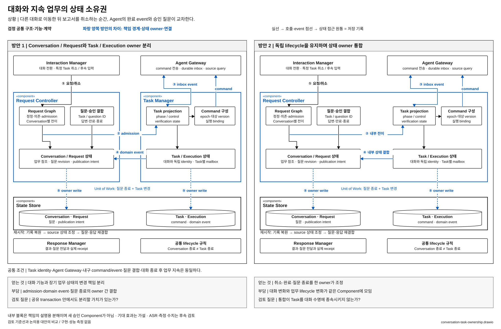

# 대화 상태와 업무 상태의 소유자를 나눌 것인가

> 상태: **우선 검토 후보 / 사용자 선정 전** · [목록](./README.md)

**질문:** 사용자의 대화·요청과 오래가는 업무를 별도 Component가 관리할 것인가, 한 Component가 서로 다른 lifecycle로 관리할 것인가?

> **발표 구성:** 배경 1장 → 설계 비교 1장. 아래 배경 문구와 도식 구성은 슬라이드 제작용 원고이며 새 배경 그림이나 발표 파일을 생성한 것은 아니다. 사례는 고정 UC를 설명하기 위한 예시이고, 발생 빈도·수치·대안의 우위를 측정한 결과가 아니다.

## 1. 배경 페이지 — 왜 중요한 Architecture 문제인가

### 문제가 드러나는 사용자 상황

보고서 작성 중 사용자가 새 대화를 시작하고, 이후 다른 대화에서 “그 보고서 어디까지 됐어?”라고 묻는다. Agent 질문·완료와 사용자의 취소가 교차할 수도 있다. VIA는 대화가 바뀌어도 업무 identity와 상태를 유지하고, 질문·결과를 올바른 곳에 연결해야 한다.

대화와 업무의 수명이 다르다는 제품 요구는 고정이다. **수명이 다르므로 상태 소유 Component도 반드시 달라야 하는지**가 구조적 질문이다.

### 이 과제에서 왜 중요한가

VIA의 사용자는 Agent의 thread나 실행 ID를 관리하지 않고 “아까 하던 보고서”를 조회·수정·취소한다. 음성을 끄거나 다른 대화로 이동해도 그 업무와 확인할 질문은 남아야 한다. **대화가 바뀌어도 사용자 업무의 정체성을 유지하는 것**이 VIA가 Agent별 대화창을 단순히 모은 도구와 구별되는 요구다.

동시에 업무는 대화와 완전히 따로 움직일 수 없다. Agent가 보낸 질문을 올바른 대화에 제시하고, 사용자의 답을 해당 실행에 적용하며, 취소와 완료가 교차하면 확인된 결과를 설명해야 한다. 수명이 다르다는 이유로 무조건 owner를 나누는 것도, 연결이 많다는 이유로 상태를 모두 합치는 것도 충분한 설계 근거가 되지 않는다.

### Architecture적으로 어려운 이유

| 동시에 만족해야 할 요구 | 구조적으로 부딪히는 지점 | 단순 처리로 남는 문제 |
| --- | --- | --- |
| 대화는 전환·종료된다 / Task는 장시간 지속되고 여러 대화에서 참조된다 | Conversation identity와 Task·Execution identity의 수명 분리 | 대화 session에 업무를 종속시키면 종료·삭제 뒤 조회·제어가 끊김 |
| 사용자는 대화로 제어한다 / Agent 상태는 독립적인 시점에 변한다 | 사용자 Request와 비동기 Task event가 같은 질문·실행 상태를 건드림 | 이미 완료된 실행에 늦은 승인·취소를 적용하거나 잘못 완료 안내 |
| 질문 답변·Task 변경·사용자 안내가 함께 맞아야 한다 / 각 상태는 독립적으로 발전한다 | owner 간 인계 계약과 원자적 변경 범위 | 상태만 바꾸고 질문 종료나 안내 intent를 놓치면 사용자에게 서로 다른 사실을 제시 |
| 대화 기능과 업무 lifecycle은 따로 바뀐다 / 두 영역의 관계 처리는 자주 함께 바뀐다 | 변경 책임을 가르는 경계와 조정의 복잡성 사이의 긴장 | 과도한 분리는 인계를 늘리고, 과도한 통합은 작은 변경을 전체로 퍼뜨림 |

DB transaction이 있다는 사실만으로 이 문제가 풀리지는 않는다. Transaction은 기록을 함께 확정할 수 있게 하지만, 어떤 상태가 유효하고 누가 전이를 허용하는지는 owner의 계약이다. 반대로 owner를 나눴다고 별도 DB나 process가 필요한 것도 아니다. 이 후보는 **같은 저장·실행 환경에서 상태의 의미와 변경 권한을 나누는 선택**이다.

### 배경 슬라이드 1장에 사용할 내용

**제목:** 대화와 업무의 수명은 다르지만, 제어와 결과는 계속 연결되어야 한다.

| 배치 | 슬라이드에 남길 핵심 문구 | 함께 보여줄 도식 |
| --- | --- | --- |
| 왼쪽 — 과제 환경 | 음성 연결·대화·업무·Agent 실행은 서로 다른 수명을 가진다 | Voice 종료와 Conversation 전환 뒤에도 이어지는 Task 막대를 별도 lane으로 표시 |
| 가운데 — 교차 사건 | 다른 대화의 취소 입력과 Agent 완료·질문이 교차한다 | Conversation A의 업무 시작 → Conversation B의 조회·취소, 같은 Task로 돌아오는 Agent event |
| 오른쪽 — 유지할 관계 | 독립 Task identity와 질문·답변·완료 상태의 일관성이 모두 필요하다 | Request·Task·Execution·질문 ID의 연결과 늦은 답변을 적용할 수 없는 경계 |

**하단 Challenge:** 독립적인 대화·업무 수명을 유지하면서 교차 상태 변경을 일관되게 처리하려면, 상태 소유권을 분리할 것인가 통합할 것인가?

**발표자 설명:** “업무를 계속 유지해야 한다는 요구만으로 별도 Task Manager가 정답이 되지는 않습니다. 한 Component 안에서도 독립 Task 수명은 구현할 수 있습니다. 어려운 부분은 대화에서 들어오는 제어와 Agent에서 오는 상태 변화가 같은 질문과 실행을 동시에 바꾼다는 점입니다. 다음 페이지에서는 이 의미 상태의 owner를 나누는 이점과 조정 비용을 비교합니다.”

**배경 근거:** [UC-10 기존 업무](../../05-representative-use-cases.md#uc-10), [UC-12 취소](../../05-representative-use-cases.md#uc-12), [UC-14 동시 업무](../../05-representative-use-cases.md#uc-14), [UC-15 채널 전환](../../05-representative-use-cases.md#uc-15), [제어 계약 §4~5](../target-architecture/control-and-lifecycle.md#4-request질문task의-상태-전이).

## 2. 설계 비교 페이지 — 독립 lifecycle을 유지하면서 상태 owner를 나누거나 합친다

**배경에서 이어받는 질문:** 문서 첫머리의 구조적 질문을 같은 사용자 목표·조건에서 비교한다. 먼저 책임 경계, 다음 상태와 계약, 마지막 이점·비용의 순서로 설명한다.

### 두 방안

**방안 1 — 대화와 업무의 owner 분리.** Request Controller가 Conversation·Request·대기 질문을, Task Manager가 Task·Execution·확인된 업무 상태를 소유한다. 확정 요청은 Task Manager로 넘어가고, Agent event로 갱신한 업무 상태는 Request Controller를 통해 대화·알림에 연결된다. 원자적 변경이 필요하면 두 owner가 State Store의 Unit of Work에 참여한다.

**방안 2 — 상태 owner 통합.** Task Manager의 책임을 Request Controller에 통합한다. Conversation별 요청 처리와 Task별 실행 상태는 별도 typed aggregate와 mailbox로 관리하지만 상태 의미와 transaction 조정은 한 Component가 소유한다. Task는 대화의 자식 수명에 묶지 않으며 여러 Conversation에서 참조할 수 있다. Agent Gateway와 Response Manager는 유지한다.

[draw.io 편집 원본](./diagrams/conversation-task-ownership.drawio) · [표기 규칙](./diagrams/README.md)

### 그림에서 확인할 흐름과 구조 차이

① 취소/후속 입력, ② admission, ③ Agent event, ④ 대화와 업무의 결합, ⑤ 내구 기록을 따라간다. Conversation·Request와 Task·Execution의 상태 종류는 양쪽에 남는다. 파랑은 그 상태를 변경하는 owner 경계와 command/event 계약의 변화다. State Store의 원통 두 개는 논리 기록 구분이며 별도 DB나 분산 transaction을 뜻하지 않는다. 질문 종료와 Task 변경의 원자성 요구는 공통이다.

| 구조 차이 | 방안 1 | 방안 2 |
| --- | --- | --- |
| Component | Request Controller + Task Manager | 업무 관리 책임까지 가진 Request Controller |
| 상태 권위 | Conversation/Request와 Task/Execution의 owner 분리 | 한 owner 아래 독립 aggregate·identity·lifecycle 유지 |
| 상태 인계 | dispatch admission, command, 확인된 업무 변경의 owner 간 계약 | 동일 Component 내부 상태 전이와 module API |
| 변경 책임 | 업무 상태와 대화 흐름의 변경을 port로 제한 | 질문·취소·업무 상태가 얽힌 변경을 한 단위로 관리 |

### 어느 쪽이 설득력 있는가

방안 1은 장기 업무 관리가 대화 흐름에 종속되지 않게 경계를 드러낸다. 대신 결과 저장·질문 종료·응답 intent 사이의 owner 간 정합성을 설계해야 한다. 기준선의 두 Component는 같은 Core process에 있으므로 이 분리가 process crash 격리까지 제공한다고 설명하지 않는다.

방안 2는 취소와 완료, Agent 질문과 사용자 답변처럼 대화·업무를 함께 바꾸는 사건을 한 owner가 다루기 좋다. 같은 local transaction과 내구 기록으로 복구할 수 있고, Task별 비동기 처리로 긴 업무가 대화를 막지 않게 할 수 있다. 대신 대화 기능 변경과 Agent 업무 lifecycle 변화가 같은 Component에 모인다.

### 설계 비교 페이지 발표 설명

**그림에서 짚을 순서:** 두 그림에 Conversation·Request와 Task·Execution 상태가 모두 남아 있음을 먼저 확인한다. 그다음 Task Manager 경계와 owner 간 admission·domain event가 방안 2에서 내부 전이로 바뀌는 부분을 짚는다.

**발표자 설명:** “두 방안 모두 대화가 끝나도 업무가 남습니다. 차이는 상태 종류가 아니라 상태를 변경하는 owner입니다. 분리하면 업무와 대화의 변경 책임을 독립시킬 수 있지만 교차 전이를 조정해야 하고, 통합하면 그 조정이 내부화되는 대신 변경 책임이 한곳에 모입니다. 같은 State Store를 사용하므로 DB 분산 비용의 비교로 바꾸지 않습니다.”

## 3. 자체 검토와 남은 질문

- Agent별 thread에 VIA Task identity를 맡기거나 대화 삭제 시 업무를 함께 지우는 대안은 제외한다.
- 통합해도 Conversation·Request·Task·Execution 개념은 합치지 않는다. 긴 외부 호출 중 전역 lock을 잡는 구조도 강요하지 않는다.
- 비교에서는 같은 State Store와 내구 전송·수신 보장을 유지한다. shared DB 대 owner별 journal까지 동시에 바꾸지 않는다.
- **후보로 남길 이유:** 사용자 interaction과 지속 업무의 상태 권위 및 Component 간 인계가 달라진다.
- 통합 구조가 독립 lifecycle과 변경 경계를 간결하게 유지한다면 별도 Task Manager의 필요성이 약해진다. 통합 후 업무 상태 변화가 대화 전반에 퍼진다면 분리 이유가 강해진다. 양쪽 모두 검토 가설이다.
- [해석 경계 후보](./request-resolution-boundary.md)와는 독립 선택이다. 여기서는 Request Interpreter의 책임을 그대로 둔다.

기준선 근거: [전체 구조 §5·11·12·14](../target-architecture/architecture.md), [제어 계약 §4·5·7](../target-architecture/control-and-lifecycle.md). 주요 사용자 상황: UC-06~10·12~16·18.
