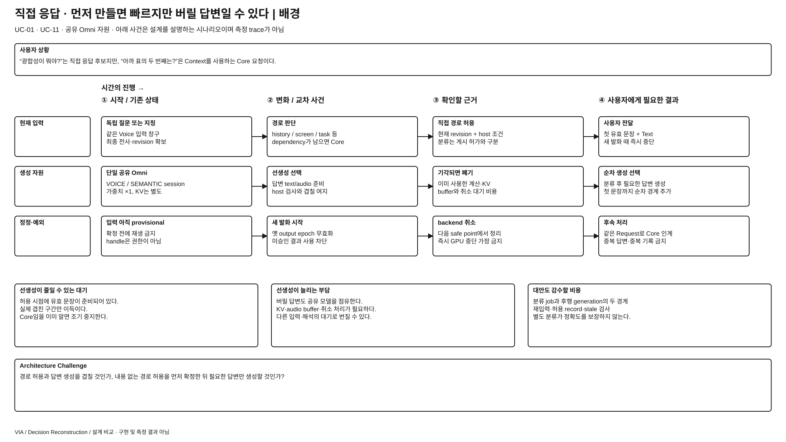
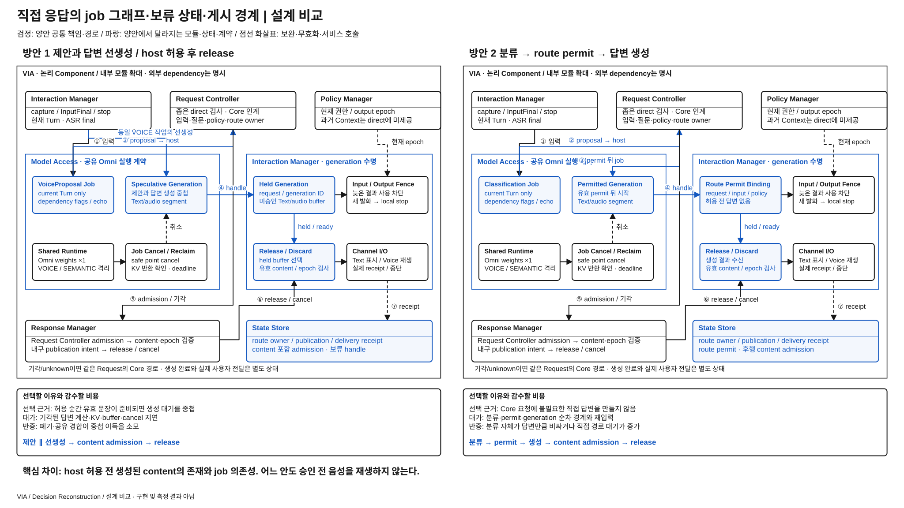

# S2S 직접 응답을 먼저 생성해 둘 것인가, 경로를 정한 뒤 생성할 것인가

> **추가 검토 후보 / 사용자 선정 전 / 적용 범위·모델 계약 확인 필요** · [목록](./README.md)
> 좁은 S2S 직접 응답 범위는 유지한다. 현재 허용된 speculative 생성 경로의 rationale를 검토하며 모든 입력에서 선생성을 강제한 기준선으로 해석하지 않는다.

## 발표용 2페이지

**배경 — 이 과제에서 왜 어려운가**

[배경 SVG 크게 보기](./diagrams/direct-response-generation-background.svg) · [배경 draw.io 편집 원본](./diagrams/direct-response-generation-background.drawio)

**설계 비교 — 같은 완료 조건을 만드는 두 실행 구조**

[비교 SVG 크게 보기](./diagrams/direct-response-generation-comparison.svg) · [비교 draw.io 편집 원본](./diagrams/direct-response-generation-comparison.drawio)

검정은 양안 공통, 파랑은 **양안 각각에서 달라지는 모듈·상태·계약**이다. 큰 테두리는 논리 책임 묶음이며 모든 상자가 별도 process라는 뜻이 아니다. 같은 Component를 여러 위치에 확대 표기해도 instance·모델 가중치를 복제하지 않는다. 그림의 내부 모듈과 아래 계약은 대안을 검토하기 위한 구체 설계이며 target 기준선 변경·구현·측정 결과가 아니다.

## ASR·추가 QA 관점의 장단점과 예상 차이

아래는 **동일 기능·완료 조건에서의 구조적 예상**이며 측정 결과나 승자 선정이 아니다. `PRIMARY`는 차이를 직접 검토할 축, `REGRESSION_ONLY`는 개선을 주장하기보다 기능 유지를 확인할 축이라는 **적용 제안**이다. 정식 모집단·수치·역할은 아직 동결하지 않았다. [현재 ASR 정의](../../08-quality-attributes/core-asr-contract.md)와 [상세 QA 의미](../../08-quality-attributes/README.md)를 유지한다.

**직관적인 핵심:** 1안은 “내가 답해도 되는가”를 확인하는 동안 답변도 준비한다. 2안은 허용을 받은 다음 답변을 만든다. 직접 답할 때는 중첩이 도움이 될 수 있고, Core로 넘기는 요청이 많으면 버릴 생성 작업을 피하는 쪽이 이로울 수 있다.

| 관점 · 적용 제안 | 방안 1의 장단점 | 방안 2의 장단점 | 차이가 나는 조건·주의점 |
| --- | --- | --- | --- |
| QA-19 의미·처리 정확성 · REGRESSION_ONLY | **장점:** 같은 VOICE 작업의 제안과 답변이 현재 입력에 함께 결합된다. **단점:** 이미 만든 답변을 근거로 부적절한 direct를 허용하면 잘못된 경로가 된다. | **장점:** 분류 결과와 생성 결과를 따로 검사할 수 있다. **단점:** 분류 오류·permit 이후 revision 변경·두 결과의 binding 오류가 가능하다. | 정확도 개선은 기본 주장이 아니다. 양안 모두 독립 질문만 direct로 허용하고 input echo·dependency·현재성을 검사한다. 분류-only 모델 계약이 더 정확하다는 가정도 하지 않는다. |
| QA-09 응답성 · PRIMARY | **장점:** admission 때 유효 답변이 준비됐으면 의미 있는 첫 음성이 빠를 수 있다. **단점:** 버릴 생성이 Core semantic을 기다리게 만들 수 있다. | **장점:** Core로 갈 요청에는 answer 생성 자원을 쓰지 않는다. **단점:** direct 요청에는 분류→permit→generation의 대기가 추가된다. | 직접 응답과 Core 전환을 함께 봐야 한다. generic ack·earcon·아직 재생하지 않은 audio packet을 응답 완료로 세지 않는다. |
| QA-29 변경 용이성 · PRIMARY | **장점:** proposal·generation handle의 통합 runtime 계약을 유지한다. **단점:** provider가 held generation·취소를 지원하지 않으면 adapter 변경이 커진다. | **장점:** 분류와 generation의 입출력을 독립적으로 바꿀 수 있다. **단점:** RoutePermit·expiry·후행 content admission·trace가 새 변경 대상이다. | runtime 교체가 classification-only를 지원하는지, speculative handle을 지원하는지에 따라 파급이 바뀐다. |
| QA-39 신뢰성·복구 · REGRESSION_ONLY | **장점:** 한 작업에 결합된 결과를 일괄 폐기할 수 있다. **단점:** held handle·audio·KV 회수 누락이 남을 수 있다. | **장점:** 허용 전 answer 자원은 없다. **단점:** permit만 남거나 generation 중 crash하는 부분 상태가 늘어난다. | 두 안 모두 옛 incarnation의 handle·permit을 거절한다. 선생성을 없앴다고 공유 Omni 장애가 격리되는 것은 아니다. |
| QA-41 메모리 · 추가 진단 | 허용 전부터 생성 KV와 held Text/audio가 peak를 키울 수 있다. | 허용 전 비용을 줄이지만 classification KV·permit은 남고 실제 direct 생성 중에는 answer KV도 필요하다. | 전체 workload의 동시 세션·기각 비율이 중요하다. 두 안 모두 같은 Omni weights 한 벌이다. |
| QA-04 음성 중단 / QA-15 연속성 · 추가 회귀 | 이미 쌓인 audio buffer의 stale epoch 차단과 취소·회수가 중요하다. | 후행 generation 결과가 새 발화 뒤 늦게 돌아오는 경우를 차단해야 한다. | local stop은 공통이며 QA-04를 QA-09 평균에 포함하지 않는다. 직접 응답 뒤 follow-up에는 실제 전달한 내용만 남겨야 한다. |

추가 QA는 기존 지위 그대로 진단·회귀·qualification으로 다룬다. 더 빠른 응답으로 잘못된 대상 실행·중복 실행·권한 위반을 상쇄하지 않는다. 메모리의 core ASR 승격이나 새 QA 정의는 이번 정성 비교에서 확정하지 않는다.

## 그림을 따라 설명할 실행 계약

왼쪽 **Model Access** 영역은 같은 Omni에서 수행하는 작업 의존, 오른쪽 **Interaction Manager** 영역은 보류 content와 실제 I/O의 수명을 나타낸다. 하나의 Component를 두 instance로 배치했다는 뜻이 아니며 capture와 generation의 책임 부분을 확대했다. 하단 **Response Manager**가 승인된 publication을 내구 기록하고 release한다.

| 경계 / 상태 | 방안 1의 구체 동작 | 방안 2의 구체 동작 |
| --- | --- | --- |
| 최초 작업 | 현재 Turn만 받는 VOICE 작업에서 VoiceProposal과 답변 segment 선생성 | 답변 segment 없는 Classification Job에서 dependency flags·input echo 제안 |
| 미승인 상태 | `generation_id, request_id, input_revision, runtime_incarnation, output_epoch`에 결합한 held handle·Text/audio buffer | 동일 revision의 route 후보만 존재; 답변 buffer·generation KV는 아직 없음 |
| 첫 host 결정 | SEALED 입력·현재 scope·질문 binding·독립 질문 조건·content 조건을 확인한 Direct Admission | 내용 없는 `RoutePermit(permit_id, request_id, input_revision, policy_revision, output_epoch, expiry)` 발행 |
| 생성 시작 | 이미 진행 중; Core가 분명해지면 조기 cancel | 유효 permit을 소비한 뒤 별도 Generation Job 시작; current Turn 이외 Context를 추가하지 않음 |
| 게시 경계 | 유효 admission·content handle로 publication intent 작성 후 release | 생성 뒤 content 검사를 통과한 별도 publication admission이 있어야 release; permit만으로 재생 불가 |
| 중단·재시작 | local output fence가 즉시 stale 세대 사용 차단; runtime cancel은 safe point에서 회수 | 동일; 재시작 전 permit/handle로 generation·재생 재개 금지 |

**상태 진행:** 방안 1은 `GENERATING_HELD → READY_HELD → ADMITTED → RELEASED`이며 어느 보류 상태에서도 `DISCARDED`로 끝날 수 있다. 방안 2는 `CLASSIFYING → PERMITTED → GENERATING_HELD → CONTENT_ADMITTED → RELEASED`다. Permit 이후에도 새 발화·권한 변경·전사 정정이 발생하면 생성 결과를 버린다.

**메모리·취소 수명:** held segment는 유한 byte/duration budget으로 관리하며 초과 시 generation을 멈추거나 폐기하고 같은 Request의 Core 처리로 인계한다. Backend 취소 요청과 실제 KV 회수 완료를 구별한다. Response Manager에는 실제 게시 Text·audible receipt만 전달 기록으로 남긴다. 미승인 답변이나 단순 생성 완료를 대화 기억에 넣지 않는다.

**심사 질문 — “별도 분류만 늘려 느린 대안을 만든 것 아닌가?”** Core 비율이 높고 선생성이 semantic 작업을 밀어내면 필요 없는 answer job을 시작하지 않는 구조가 합리적이다. 반대로 직접 응답 비율이 높고 분류도 비싸면 추가 직렬 경계가 손해다. 작은 classifier 모델을 몰래 추가하지 않으며 분류-only native 계약의 실제 제공 여부는 별도 확인 대상이다.

## 1. 배경 — 빨리 말하려면 미리 일해야 하지만 버릴 작업일 수 있다

VIA는 “광합성이 뭐야?” 같은 명백한 자체 지식 질문에는 S2S로 직접 답하고, “아까 표를 설명해줘”처럼 근거가 필요한 요청에는 Core 처리를 거쳐야 한다. 경로를 확정한 뒤에만 답변을 만들면 그 생성 시간이 이후 대기에 놓인다. 먼저 만들면 유효한 직접 응답을 빨리 준비할 수 있지만 Core로 갈 요청에도 모델 계산과 음성 buffer를 쓸 수 있다.

공유 Omni는 입력·의미 해석·응답 생성이 같은 자원을 사용한다. 버릴 답변을 만드는 일이 다음 해석을 지연시킬 수도 있다. **답변 생성과 경로 허용을 겹칠 것인가, 경로 결정 뒤에 생성하도록 순차화할 것인가**가 선택이다. 직접 응답 범위를 넓히거나 승인 전 음성을 들려주는 대안은 아니다.

현재 근거는 [전체 구조 §8](../target-architecture/architecture.md#8-s2s와-직접-응답), [제어 계약 §2](../target-architecture/control-and-lifecycle.md#2-최소-s2s-직접-응답-계약), [공유 Omni §3~4](../target-architecture/shared-omni-runtime.md#3-발화를-받는-경로를-의미-해석과-분리한다)다. 주요 기능은 [UC-01](../../05-representative-use-cases.md#uc-01), [UC-11](../../05-representative-use-cases.md#uc-11)이고, Core 요청이 함께 들어오는 자원 경합도 관련된다.

## 2. 두 가지 구현 방식

### 방안 1 — 같은 Voice 호출에서 직접 후보와 답변 선생성

1. Model Access의 Omni VOICE session이 현재 입력을 처리하며 제한된 VoiceProposal과 speculative 답변을 만들 수 있다.
2. Interaction Manager는 generation handle·입력 revision을 연결하고 audio를 보류한다. 아직 사용자에게 재생하지 않는다.
3. Request Controller가 최종 입력·의존성·질문/정정 상태·현재 revision과 Text/audio 대응을 검사한다.
4. 직접 응답 허용이면 Response Manager가 유효 generation을 release한다. Core 인계이면 선생성을 취소·폐기하고 같은 Request와 evidence를 Core에 연결한다.

현재 설계는 이미 host가 직접 응답 불가를 아는 요청에서도 끝까지 무조건 답변을 생성하는 구조가 아니다. 일찍 인계가 확정되면 불필요한 생성을 중지한다. 비교에서는 실제로 선생성이 발생하는 경로와 그 비용을 다룬다.

### 방안 2 — 분류와 답변 생성을 별도 작업으로 직렬화

1. 동일 입력 경로에서 Omni가 현재 질문의 직접/Core 후보와 의존성을 짧은 구조화 결과로 반환한다. 이 단계에서는 답변 Text/audio를 생성하지 않는다.
2. Request Controller가 좁은 직접 응답 조건과 현재 revision으로 경로를 허용한다. Core라면 같은 Request를 바로 Core 처리로 연결한다.
3. 직접 응답이면 허용된 질문·언어·출력 조건으로 별도 VOICE generation을 요청한다. 같은 Omni의 가중치를 사용한다.
4. 생성된 첫 문장의 Text/audio 대응·revision·출력 세대를 검사한 뒤 Response Manager가 게시한다. 경로 허용은 생성 내용 자체의 게시 승인을 대신하지 않는다.

현재 Direct Admission은 유효 generation handle·첫 게시 단위를 포함한다. 대안에서는 **내용 없는 경로 허용과 실제 내용 게시 승인을 구분하는 중간 상태**가 필요하다. 두 단계 사이 정정·취소가 오면 아직 시작하지 않은 생성을 취소하거나 결과 사용을 막는다. 대안이라고 최종 검증과 출력 세대 검사를 없애지 않는다.

## 3. 같은 상황을 따라가 보면

| 사건 | 선생성 | 경로 허용 후 생성 |
| --- | --- | --- |
| 유효한 단순 지식 질문 | 허용 시 이미 준비된 문장·audio를 사용할 여지 | 분류·허용 뒤 실제 답변 생성 시작 |
| 화면/대화 근거가 필요한 것으로 판명 | 생성한 부분을 폐기하고 Core 인계; 낭비량은 조기 판명 여부에 따름 | 분류 뒤 바로 Core 인계; 직접 답변 낭비는 없지만 분류 비용은 존재 |
| 입력 final이 수정되거나 새 발화 시작 | 미승인/기존 generation·buffer 무효화, backend 취소는 safe point까지 비용 | 분류·경로 허용·진행 중 생성 중 해당 revision을 무효화 |
| 긴 생성이 입력·semantic과 경합 | speculation까지 공유 scheduler·메모리를 사용 | 직접 경로 확정 전 답변 부하는 줄지만 별도 분류 job이 필요 |

## 4. 실제 구조 차이와 선택의 대가

| 항목 | 선생성 | 경로 허용 후 생성 |
| --- | --- | --- |
| 모델 작업 그래프 | Voice 후보와 답변 생성, host 검사와 중첩 가능 | 후보 분류 → 경로 허용 → 답변 생성 |
| 미승인 데이터 | speculative Text/audio·generation handle·보류 buffer | 분류 결과·경로 허용 상태; 답변은 이후 생성 |
| 폐기 경로 | 경로 기각·정정 시 이미 계산한 답변과 KV 정리 | 생성 전 기각은 답변 계산 없음; 생성 후 정정 취소는 공통 |
| 직접 응답의 대기 | 유효한 선생성 결과의 재사용 가능 | 분류/허용과 답변 생성 사이 순차 경계 추가 |

**현재 방식이 설득력 있는 조건:** 직접 응답으로 허용될 질문이 충분히 있고, 허용 시점까지 유효한 audio가 준비되며, 폐기·buffer·공유 모델 경합 비용보다 대기 감소가 의미 있는 경우다.

**왜 대안을 선택할 수 있는가:** Core로 가는 요청이 많거나 PC의 추론·메모리 여유가 작으면, 사용할 경로부터 정하고 답변을 만드는 방식이 합리적이다. 짧은 분류 작업의 비용과 이어지는 생성 재시작 비용을 모두 감수한다. 별도 분류가 같은 모델의 정확성을 자동으로 높인다고 주장하지 않는다.

**현재 선택을 다시 볼 조건:** 선생성이 대부분 폐기되거나 유효 첫 문장을 미리 만들지 못하고, 오히려 Core 처리·입력 service를 밀어내는 경우다. 반대로 분류를 먼저 끝내려면 답변 생성과 비슷한 비용이 들거나 두 호출의 재입력 비용이 크면 대안의 실익이 약하다.

## 5. 왜 추가 검토인가

좁은 fast path만 다루므로 전체 VIA에서의 중요성을 아직 확정할 수 없다. 현재 문서의 “선생성 가능”과 모든 요청에서 실제 선생성한다는 구현을 혼동하지 않는다. 어떤 입력에서 언제 시작·중지하는지와 공통 workload를 정하기 전에는 효과를 일반화할 수 없다.

대안은 새로운 모델을 추가하지 않지만, 동일 Omni가 답변을 만들지 않는 제한된 경로 제안과 이후 generation을 별도 job으로 제공할 수 있어야 한다. 역할별 호출 구조로 설계할 수 있는 요구이나 실제 build 적합성은 미확인이다. 현재 방식 역시 VoiceProposal·Text/audio 대응·취소 지원의 통합 적합성이 미확인이다. 어느 한쪽의 API가 이미 확보되었다고 가정하지 않는다.

S2S 직접 허용 범위, 입력 ASR, 전체 가중치, capture/local stop, Context 조회 방식은 공통이다. speculative token 상한만 바꾸고 작업 그래프가 같다면 별도 DP로 남기지 않는다.

**게시 권한 위임은 다른 결정이다.** 방안 2를 Voice의 자율 게시나 재사용 가능한 승인 lease로 만들지 않는다. 양쪽 모두 Request Controller의 요청별 조건 검사와 Response Manager의 게시 계약을 유지한다. 방안 1의 host 검사는 매번 별도 LLM을 호출하는 것으로 가정하지 않으며, 생성과 검사 준비가 겹치는 강한 형태를 허용한다. 이 구분은 [선행 자료 검토](./reference-idea-review.md)의 응답 권한·evidence 확정 순서에서 얻은 반론이다.

### Component와 계약에 실제로 생기는 변경

| 위치 | 방안 1 | 방안 2에서 필요한 변경 |
| --- | --- | --- |
| Model Access | 후보·답변을 만드는 VOICE job과 취소 | classification-only job → 허용된 generation job의 의존·연결·취소 계약 |
| Interaction Manager | speculative generation handle·보류 audio | 경로 허용 전 답변 buffer는 없음; 생성 후 playback buffer·local stop은 유지 |
| Request Controller | content·generation을 포함한 Direct Admission 검사 | 내용 없는 route permit 상태와 생성 후 content 검사 구분; revision 변경 시 둘 다 fence |
| Response Manager | 유효 generation release·게시 기록 | 최종 content 검증 뒤 동일 게시·실제 전달 기록; 생성 전에 게시 완료로 쓰지 않음 |

영향받는 기준선은 VoiceProposal, Direct Admission, generation 취소와 KV·buffer 회수다. 별도 분류가 별도 가중치를 뜻하지 않으며, 같은 모델의 두 단계가 정확성을 독립 검증해 주지도 않는다. 생성 순서 변경이 입력 인식의 독립성까지 바꾸는 것으로 설명하지 않는다.

## 6. 발표 페이지의 핵심

**배경 1장:** 직접 답변 가능한 질문과 Core로 갈 질문을 같은 입력 창구에 놓고, 확정 전에 만들어 두면 빠르지만 버릴 수 있는 답변이라는 상황을 보여준다. 하단 질문은 **“허용 판단을 기다리는 동안 답변을 준비할 것인가, 필요한 경로에만 생성 자원을 쓸 것인가?”**다.

**비교 1장:** 입력 확정·host 조건·최종 출력 검사를 공통 검정으로 둔다. 1안의 speculative generation·보류 buffer·release/cancel과 2안의 분류 job·경로 허용 record·후행 generation을 파랑으로 그린다. 시간축과 단일 공유 Omni queue를 함께 보여 주어 겹치는 시간과 버린 계산을 구분한다. 승인 전 재생 화살표는 두지 않는다.

## 7. 바로 사용할 발표 요약

**배경 5줄**

1. VIA의 음성 입력에는 바로 답할 질문과 화면·대화·업무 근거가 필요한 요청이 섞인다.
2. 경로가 정해지기 전에 답변을 만들면 허용 순간 이미 준비된 음성을 사용할 수 있다.
3. 그러나 Core로 갈 요청이었다면 계산·KV·audio buffer를 쓰고도 답변을 버려야 한다.
4. 같은 Omni가 입력·해석·출력을 공유하므로 이 낭비가 다른 작업의 대기로 이어질 수 있다.
5. 선택할 것은 승인 담당의 위치가 아니라 불확실한 경로에서 생성을 먼저 실행할 것인가다.

**설계 비교 8줄**

1. 방안 1은 VoiceProposal과 답변을 선생성하되 host가 허용하기 전에는 재생하지 않는다.
2. 방안 2는 짧은 경로 제안 → host 허용 → 답변 생성의 순서로 실행한다.
3. 직접 응답 범위·입력 근거·최종 게시 검사·공유 Omni는 두 안에서 동일하다.
4. 방안 1은 보류 buffer·취소 경로가, 방안 2는 별도 분류 job·route permit 상태가 필요하다.
5. 유효한 직접 응답이 많고 중첩 효과가 크면 선생성을 선택할 이유가 있다.
6. Core 요청이 많고 공유 자원 여유가 작으면 분류 후 생성이 합리적일 수 있다.
7. 분류 비용·재입력·두 작업 사이 대기를 빠뜨리면 방안 2의 이점을 과장하게 된다.
8. 실제 fast path 비중과 모델의 분리 호출 계약이 미확인이라 현재는 추가 검토 후보로 둔다.
