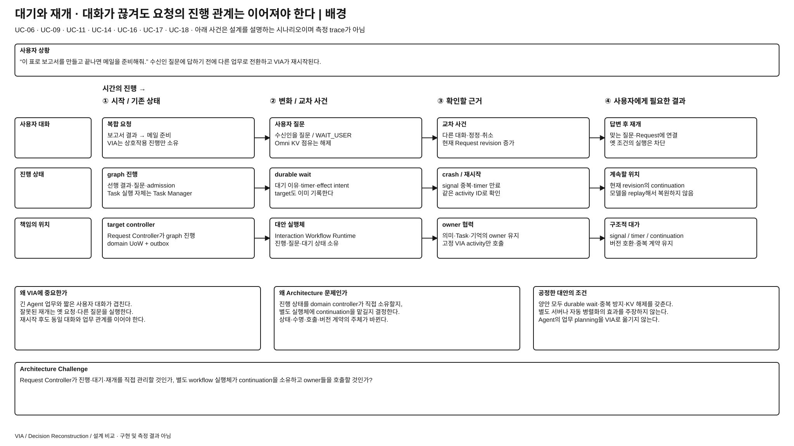
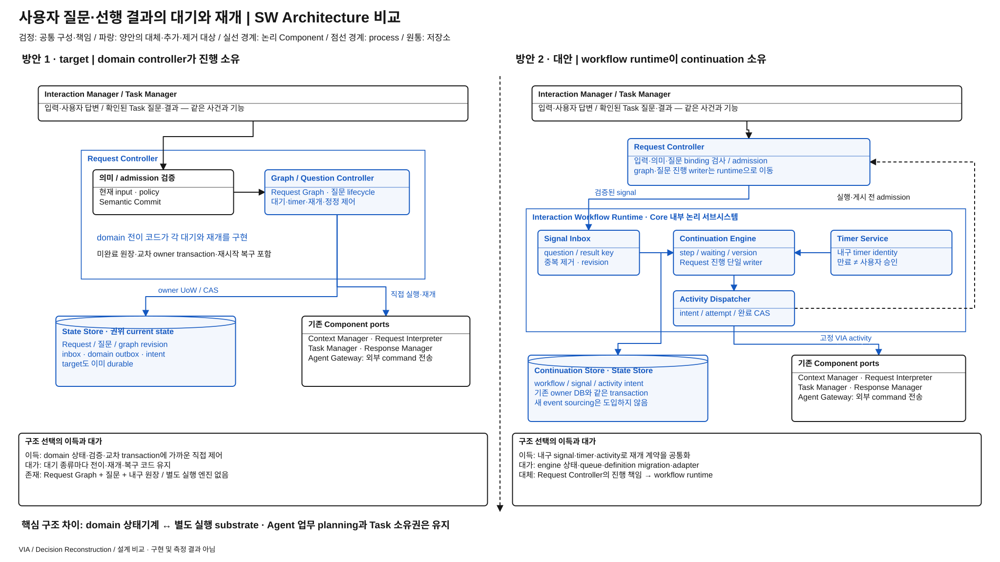

# 요청 대기·재개의 실행 구조 — domain controller와 workflow runtime

> 상세 설계 비교안 / 방안 1 = REVIEWED_BASELINE / 방안 2 = 미채택 steelman / 구현·측정 없음
> [전체 안내](./README.md) · [작업 계획](./WORKPLAN.md)

**문제:** 사용자의 답변·선행 결과·자료 조회를 기다리던 요청을, 정정·Agent 질문·재시작이 교차해도 올바른 지점에서 이어야 한다. **선택:** Request Controller가 domain 상태와 재개 코드를 직접 소유할 것인가, 별도 Interaction Workflow Runtime이 내구 continuation과 활동 실행을 소유할 것인가?

## 발표용 배경 1장

[크게 보기](./diagrams/durable-request-orchestration-background.svg) · [draw.io 원본](./diagrams/durable-request-orchestration-background.drawio)

1. VIA 요청은 한 번의 함수 호출로 끝나지 않고 자료·답변·선행 결과를 기다린다.
2. 기다리는 동안 사용자가 대상을 바꾸거나 다른 Task의 질문이 도착할 수 있다.
3. VIA가 재시작해도 어떤 질문·입력·결과 version을 기다렸는지 보존해야 한다.
4. Target은 이미 durable graph·질문·outbox로 이를 해결하지만, 재개 종류가 늘면 domain 제어 코드도 늘어난다.
5. 핵심은 **재개를 각 domain 전이 코드로 운영할지, 내구 실행 엔진과 활동 계약으로 운영할지**다.

**배경 페이지 설명:** UC-06·09·11·14·16·17·18에서 “네”가 어느 질문의 답인지, 새 정정 뒤 옛 결과를 적용해도 되는지, 재시도할 일이 외부에 이미 전달됐는지를 구별해야 한다. 이 대안은 사용자 명시 의존 관계와 VIA 내부 interaction만 다룬다. 한 업무의 조사→문서 작성→메일 발송 같은 domain planning과 도구 실행은 계속 Agent가 담당한다.

## 발표용 설계 비교 1장

[크게 보기](./diagrams/durable-request-orchestration-comparison.svg) · [draw.io 원본](./diagrams/durable-request-orchestration-comparison.drawio)

**그림에서 볼 것:** 1안은 Request Controller 내부의 graph·질문·재개 제어와 shared State Store가 중심이다. 2안은 Request Controller의 의미/admission 경계 아래에 **Interaction Workflow Runtime·Signal Inbox·Timer Service·Activity Dispatcher·Continuation Store**가 놓이고, 활동 adapter가 기존 Component를 호출한다. Runtime은 local Core에 내장하는 논리 서브시스템이며 별도 서버나 cloud 제품을 가정하지 않는다. 추가 process의 장애 격리 이득을 이번 비교에 얹지 않는다.

### 방안 1 — target의 domain 상태기계와 직접 재개

근거는 [전체 구조 §5·12](../target-architecture/architecture.md), [제어 §3~5·7](../target-architecture/control-and-lifecycle.md)다. Request Controller가 Conversation·Request Graph·Pending User Interaction과 재개 전이를 소유한다. State Store에 현재 상태·domain outbox·publication intent를 기록하며 Task Manager의 전이와 필요한 변경을 같은 Unit of Work로 commit한다. 단순 callback·RAM-only·crash 시 처음부터 시작하는 구조가 아니다.

### 방안 2 — Interaction Workflow Runtime이 continuation 소유

Request Controller는 입력 수락, 자연어 답변의 질문 binding 제안 검증, Semantic Commit 및 dispatch/publication admission을 유지한다. **Request의 진행 위치·대기 조건·timer·activity attempt·질문 lifecycle의 권위 상태**는 Interaction Workflow Runtime으로 옮긴다. Request Controller가 같은 graph를 별도 writer로 계속 소유하지 않는다. Conversation identity와 대화 기록은 Request Controller에 남고 workflow read port가 진행 상태를 제공한다.

| 구성·책임 | 방안 1 | 방안 2 |
| --- | --- | --- |
| Request Controller | 의미 확정 + graph·질문 lifecycle·대기·재개·복구 | 의미·권한·현재 입력 검증·admission. graph 진행·질문 lifecycle의 writer 역할 제거 |
| Interaction Workflow Runtime | 없음 | `workflow_id, definition_version, graph_revision, current_step, waiting_for, dependency_versions`의 단일 writer |
| Signal Inbox / Timer Service | domain event·deadline 처리 내부 로직 | request/question/result identity로 내구 signal 수신·중복 제거, timeout signal 생성; 새 Component 계약 |
| Activity Dispatcher | Request Controller가 각 port 호출 | 사전 정의한 VIA 활동의 실행·완료·실패를 activity ID/attempt로 제어 |
| Continuation Store | 기존 Request·질문 row 및 원장 | workflow continuation·signal cursor·activity intent·정의 version을 저장. State Store의 같은 embedded transaction에 둠 |
| Task Manager·Agent Gateway | Task/Execution 상태·command 전달 | 동일. Workflow는 Agent의 tool·내부 단계·checkpoint를 소유하지 않음 |
| Context Manager·Request Interpreter·Response Manager | 조회·의미 제안·게시 | 기존 책임 유지; workflow activity adapter로 호출하되 admission은 Request Controller에서 받음 |

### 정상·정정·재시작 실행 계약

활동 종류는 `ReadContext`, `Interpret`, `AwaitUser`, `SubmitTaskCommand`, `PublishResponse`, `ApplyUserMemoryChange`로 제한한다. Workflow definition은 VIA 개발자가 version 관리하는 상태 전이이며 모델이 범용 업무 코드를 생성하지 않는다. Target과 같은 사용자 기능을 다른 실행 substrate로 구현한다.

| 사건 | 방안 2의 정확한 처리 |
| --- | --- |
| 입력 수락 | Request Controller가 Request·Conversation·input revision을 기록하고 시작 signal을 같은 transaction에 넣음. Runtime은 signal ID로 한 번만 continuation 생성 |
| 활동 실행 | continuation step + activity intent를 원자 commit한 뒤 실행. `workflow_revision, activity_id, attempt, input_revision`이 일치하는 완료만 CAS 적용 |
| 모델·source 호출 | 기존 Component의 job/read 계약 사용. 같은 Request의 전체 deadline·호출 예산을 공유; retry마다 예산을 초기화하지 않음 |
| 사용자 답변 | Request Controller가 실제 제시된 질문·대상·policy·action digest를 검증. Runtime의 질문 revision과 Task Manager의 Execution revision을 같은 Unit of Work에서 검사한 뒤 answer signal을 소비·질문 종료 |
| 새 정정 | input hold를 먼저 기록. Runtime은 영향 continuation/activity revision을 무효화하고 새 입력을 반영. 늦은 job 완료는 실행 권한을 얻지 못함 |
| 기억 변경 | ApplyUserMemoryChange는 Context Manager에 typed 내부 변경을 요청. 동일 change ID·expected memory revision·admission·현재 data/policy epoch를 검사하고 기억 변경 또는 tombstone·invalidation outbox를 원자 적용. 재시도는 같은 ID의 적용 여부를 확인하며 원본 owner는 Context Manager 유지 |
| 위임 | Runtime은 허용된 SubmitTaskCommand를 Task Manager에 요청. Agent 접수 ACK 시 위임 Request 처리 완료. Agent 업무 완료까지 그 Request를 RUNNING으로 유지하지 않음 |
| 접수 불명 | activity transport timeout을 새 start로 재시도하지 않음. 같은 command key로 Agent Gateway가 조회하며 UNKNOWN 유지. Activity retry와 외부 업무 retry를 구분 |
| 이후 Task 질문·결과 | Task Manager의 내구 event를 별도 알림/질문 continuation으로 연결. 기존 Request/Task/Conversation 참조를 유지하고 publication ID로 한 번 게시 |
| 재시작 | 새 incarnation으로 만료 lease 차단 → continuation·intent·signal 복원 → 미완료 활동 reconcile → owner별 현재 revision 확인 후 재개. 외부 효과는 단순 activity 재실행 금지 |
| 업데이트 | 실행 중 definition version을 pin. 구 reader/활동 adapter를 지원하거나 명시 migration·drain 후 교체. 코드 변경만으로 과거 workflow를 새 step에 연결하지 않음 |
| 삭제·포화 | 삭제된 payload는 continuation에 복제하지 않고 ID·허용 참조 사용. 현재 epoch 먼저 검사. 유한 signal/timer/activity queue와 store 상한; 새 내구 admission 제한 |

**같은 상황:** 보고서 Task가 질문을 보냄 → VIA가 질문을 게시 → 사용자가 답하는 순간 Agent가 terminal event를 보냄. 1안은 Request Controller와 Task Manager의 owner 전이를 한 transaction에 결합한다. 2안은 Runtime의 질문/continuation 변경과 동일 Task owner 전이를 같은 transaction에 결합한다. Terminal이 먼저면 늦은 answer activity를 실행하지 않는다. 엔진의 “성공한 activity” 상태만으로 사용자의 승인이 유효해지지 않는다.

## ASR·추가 QA 장단점 비교

### 공통 5가지 항목 — ISO 품질속성과 기호

**(+) 유리 / (-) 불리 / (0) 해당 조건에서 구조상 동등.** 아래는 측정 결과가 아닌 **조건별 설계 예상**이다. 한 행의 기호를 QA 전체 점수나 최종 승자로 확대하지 않는다. 조건이 바뀌면 유불리도 달라질 수 있으며, 모르는 것을 (0)으로 표시하지 않는다. QA-41 메모리는 아직 진단 지표다. 분류는 [ISO/IEC 25010:2023 대응 근거](../../08-quality-attributes/iso-25010-quality-basis.md)를 따른다. 아래 한국어는 설명용이며 정확한 영문 특성·부특성은 대응표에 병기했다.

| ISO 품질 특성 → 부특성 | 항목·판단 조건 | 1안: Request Controller 직접 제어 | 2안: Workflow Runtime | 쉽고 구체적인 이유 |
| --- | --- | --- | --- | --- |
| 기능 적합성 → 기능 정확성 | QA-19 정확성 — 같은 입력·Context로 자연어 목표를 해석하는 단계 | **(0)** 같은 의미 모델·검증 | **(0)** 같은 의미 모델·검증 | Workflow 엔진을 넣는다고 “이 보고서”를 더 잘 이해하는 것은 아니다. 질문과 답변·재개 결과의 연결 정확성은 구조가 바뀌는 별도 비교 범위이며 이 행의 (0)에 포함하지 않는다. |
| 성능 효율성 → 시간 특성 | QA-09 응답성 — 기다림 없는 짧은 요청 | **(+)** 바로 다음 기능 호출 | **(-)** 활동 기록·queue·adapter 경유 | 간단한 요청에는 실행 단계를 기록하고 다음 활동을 배정하는 일이 추가 비용이 된다. 대기가 많을 때 재개 대상을 찾는 효과까지 같은 방향이라고 단정하지 않는다. |
| 유지보수성 → 변경 용이성·모듈성 | QA-29 변경 용이성 — 새 대기 조합이 1안의 진행 State·재개 Interface 변경을 요구하지만, 2안은 기존 활동을 그대로 쓰고 정의만 바꾸는 경우 | **(-)** 진행 상태·연결 계약까지 변경 | **(+)** workflow 정의 변경에 한정 | 예를 들어 이미 지원하는 자료 대기와 사용자 질문을 새로운 조합으로 연결한다. 2안의 엔진·활동 adapter를 그대로 쓸 수 있어야 이점이 성립한다. 1안도 graph 데이터만 바꾸면 된다면 이 차이는 없다. 같은 기능에 대해 Component·Interface·State·Runtime 중 실제 바뀌는 수를 비교하며 코드 재사용량으로 (+)를 정하지 않는다. |
| 신뢰성 → 결함 허용성·복구성 | QA-39 복구성 — 정상 저장된 사용자 대기를 process 재시작 뒤 이어가기 | **(0)** 이미 내구 상태·outbox 보유 | **(0)** 내구 continuation 보유 | “재시작하면 기다리던 질문을 잊지 않는다”는 능력은 둘 다 갖춘다. 엔진 도입 자체를 복구 성공률 개선으로 보지 않는다. 활동 중 crash·중복 완료·버전 불일치의 차이는 아래 상세 fault 조건에서 별도로 비교한다. |
| 성능 효율성 → 자원 활용성 | 메모리 QA-41 — 같은 대기 수·queue 상한에서 실행 기반의 추가 상태 | **(+)** 기존 상태·cache 중심 | **(-)** engine·signal·timer·활동 queue 추가 | 질문을 기다리는 동안 양안 모두 Omni KV를 풀어준다. 2안은 그 위에 공통 실행체의 관리 정보를 더 유지한다. 기존 상태를 대체한 만큼은 빼고 실제 전체 peak를 확인해야 한다. |

### 추가 비교 — ISO 부특성에서 도출한 VIA 품질 질문

| ISO 품질 특성 → 부특성 | VIA 품질 질문·판단 조건 | 1안 | 2안 | 구조 차이에서 이어지는 이유·확인할 것 |
| --- | --- | --- | --- | --- |
| 유지보수성 → 분석 용이성 | 멈춘 요청의 대기 원인을 얼마나 쉽게 찾나? 1안의 원인이 여러 domain 기록에 나뉘고 2안은 동일 ID의 continuation·activity 조회를 제공하는 경우 | **(-)** 여러 owner 기록을 연결 | **(+)** 공통 대기·활동 상태에서 확인 | 1안에도 Request Graph·질문 ID·trace·outbox가 있다. 차이는 로그 존재 여부가 아니라 “사용자 답변/자료/Agent 접수 중 무엇을 기다리나”를 연결하는 단계다. 정확한 원인 식별과 조사 시간을 본다. 1안에도 같은 통합 조회가 있으면 이점은 줄거나 사라진다. |
| 유지보수성 → 시험 용이성 | 답변·timeout·중복 완료 순서 시험을 새 interaction에도 적용하기 쉬운가? 같은 signal 규약·활동 계약을 재사용하는 경우 | **(-)** domain별 재개 지점 제어 | **(+)** 공통 signal·activity 경계 제어 | 답변 직후 timeout이 오는 순서를 Signal Inbox·Timer Service에서 고정할 수 있다. 공통 시험으로 잡히는 결함 범위와 새 fixture 준비 수고를 본다. 1안도 공통 시험 도구를 가질 수 있고, 2안의 definition·활동 adapter·실제 사용자 흐름 시험은 별도로 남는다. |
| 성능 효율성 → 자원 활용성 | 같은 요청·대기 수에서 저장 쓰기 부담은 얼마인가? 2안에서 domain 기록을 대체하고도 signal·activity intent·완료 기록이 추가되는 경우 | **(+)** domain 상태·원장 중심 | **(-)** 실행 단계 기록 추가 | 대기 요청의 KV는 두 안 모두 해제한다. 비교할 추가 비용은 디스크의 기록 byte·쓰기 횟수·보관량이다. 2안에서 없어진 기존 graph 기록은 빼고 계산한다. 쓰기 증가가 실제 응답 지연으로 이어지는지는 QA-09에서 별도로 확인한다. |

**업데이트 시 대기 상태 보존**은 별도 “업데이트 호환성”이라는 ISO 부특성으로 만들지 않는다. 정의·reader 변경 범위는 유지보수성/변경 용이성(QA-29), 업데이트 실패 뒤 올바른 재개는 신뢰성/복구성(QA-39)으로 다룬다. 표준의 Compatibility는 제품 간 공존·상호운용 관점이므로 이 이름을 빌려 쓰지 않는다. 현재 질문·승인 검증은 양안 필수이며, 같은 요구를 둔 것만으로 실제 잘못된 실행 비율이 같다고 판정하지 않는다.

추가 행은 정성 비교 후보이며 새 QA ID·ASR·측정 점수를 확정하지 않는다. 확인할 항목은 향후 시나리오 구체화를 위한 제안이고 실행 결과가 아니다. 동일 부특성의 자원 종류나 기존 ASR의 상세 관점을 독립 점수로 중복 합산하지 않는다.

### 상세 인과·적용 범위와 검증 조건

P=`PRIMARY`, R=`REGRESSION_ONLY`; [공통 품질 규칙](./quality-comparison-contract.md). 정성적 예상이며 엔진 도입을 성능 개선으로 전제하지 않는다.

| 관점·적용 | 방안 1 장점 / 비용 | 방안 2 장점 / 비용 | 비교 조건 |
| --- | --- | --- | --- |
| QA-19 · P(처리 결과·association) | domain 상태와 의미/admission이 가까움 / 재개 branch별 binding 누락 위험 | signal·activity의 명시 identity / 잘못된 definition·revision·adapter binding이 공통 엔진에서 전파 가능 | 의미 모델은 동일; 목표 해석 자체 향상 주장 없음. QA-11의 재개·처리 field만 직접 비교, QA-13~15 진단 중복 합산 금지 |
| QA-09 · P | 짧은 경로의 직접 호출·적은 실행 원장 / 복잡한 resume scan·분기 대기 | 내구 ready signal·timer registry로 재개 대상 탐색을 공통화할 여지 / activity commit·queue·adapter 경유 추가 | 사용자 대기·Agent 작업시간을 VIA 지연으로 계산하지 않음. signal 처리 및 유효 response/control 끝점까지 비교 |
| QA-29 · P | 기존 domain schema 안의 단순 변화는 국소적 / 새 대기 종류마다 전이·재개 코드 변경 | 공통 continuation 계약으로 반복 처리 / definition migration·활동 adapter·engine schema 유지 | 새 질문 종류·선행 결과 변경·adapter 교체를 양안 같은 기능으로 수용. generic engine이 모든 변화를 흡수한다고 가정하지 않음 |
| QA-39 · P | 이미 내구 상태·outbox로 복구 가능 / domain별 미완료 탐색·race 복구 필요 | 내구 signal·timer·activity registry로 미완료 위치 식별 / lease·중복 완료·engine version이라는 새 실패 | dispatch 직전/직후·answer/terminal·resume 중 crash. 실제 외부 중복 없음과 deadline까지 확인 |
| QA-41 · 추가 진단 | domain row cache·미완료 스캔 buffer | engine heap·timer wheel·signal cache·activity queue·adapter 상태 추가 | WAIT_USER 동안 양안 모두 KV·source 연결 해제. Task 수와 workflow 수를 동일하다고 가정하지 않음 |
| QA-51·61·62 · qualification | owner별 provenance와 정책 fence 필요 | workflow trace가 연결을 돕지만 payload 사본·내구 log 노출 관리 필요 | engine trace가 semantic 근거·실제 Voice receipt·평가 재현을 대신하지 않음 |

**대안이 유리한 조건:** 대기·재개 패턴이 반복되고 기능 변화가 빈번하며 versioned runtime 유지 비용을 여러 interaction에서 회수할 수 있을 때. **Target을 유지할 조건:** VIA 내부 전이가 제한적이고 domain UoW와 가까운 제어가 중요하며 범용 실행체가 대부분 adapter·중복 원장을 추가할 때.

**반증:** target의 같은 종류 재개·race 수정이 여러 곳으로 반복 확산되고 runtime이 전체 비용 안에서 줄이면 현재 구조의 유지보수 근거가 약해진다. 2안이 Request Controller의 기존 진행 상태를 그대로 복제하거나, 정상 경로 대부분에서 engine을 우회하면 독립 Architecture 대안으로 성립하지 않는다.

**다른 후보와 고정할 조건:** 이번 runtime은 현재 continuation row+intent 방식이며 전체 domain event sourcing을 도입하지 않는다. 복구 원본 후보는 runtime 도입을 고정하지 않고 기존 domain owner를 유지한다. 엔진 도입과 event sourcing의 효과를 한 번에 주장하지 않는다.

## 발표용 설계 비교 8줄

1. Target은 Request Controller의 domain 상태기계가 대기·재개를 책임진다.
2. 기존 구조도 durable Request Graph·질문·outbox를 보존한다.
3. 대안은 continuation 실행을 Interaction Workflow Runtime으로 옮긴다.
4. Signal Inbox·Timer Service·Activity Dispatcher·Continuation Store가 필요해진다.
5. Request Controller에는 의미·현재성 검증과 admission 책임이 남는다.
6. Task Manager의 장기 업무 상태와 Agent의 내부 planning은 이동하지 않는다.
7. 공통 재개 계약의 변경·복구 이점과 새 실행체·queue·version 유지 비용을 비교한다.
8. Runtime을 도입하고도 기존 진행 제어를 복제하면 이 대안의 가치가 사라진다.
