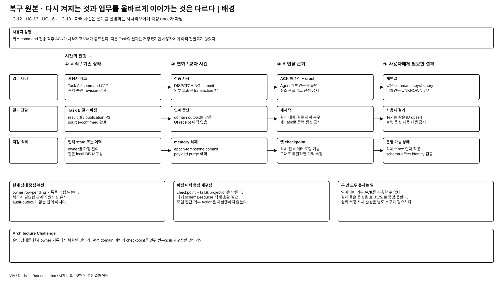
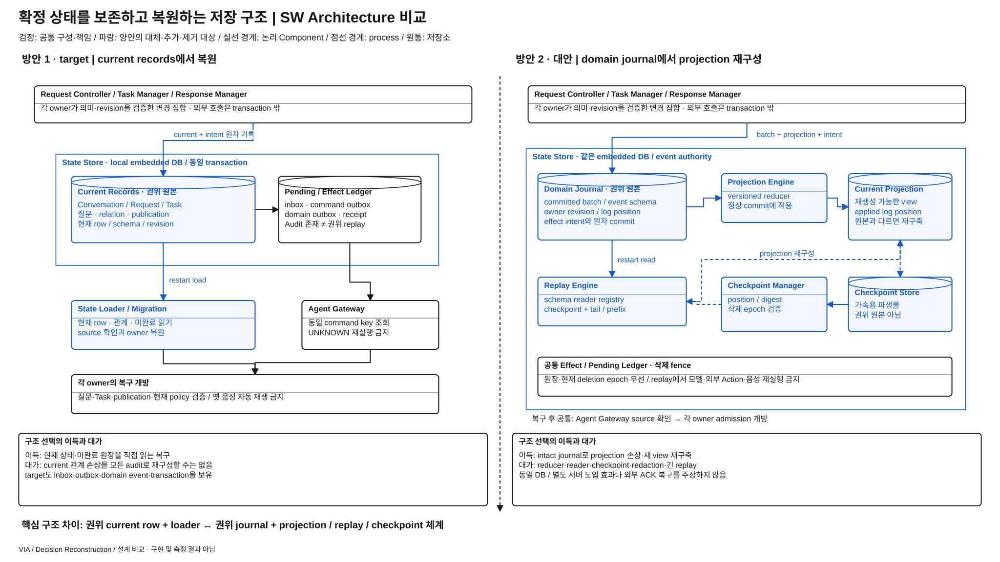

# 업무·대화의 복구 저장 구조 — 현재 상태와 권위 이벤트 이력

> 상세 설계 비교안 / 방안 1 = REVIEWED_BASELINE / 방안 2 = 미채택 steelman / 구현·측정 없음
> [전체 안내](./README.md) · [작업 계획](./WORKPLAN.md)

**문제:** 재시작 뒤 실행·질문·결과·사용자 전달 관계를 올바르게 복원하고, 이미 전달했을지 모르는 업무를 중복 실행하지 않아야 한다. **선택:** 현재 owner 기록을 원본으로 복구할 것인가, 확정된 domain 이력에서 현재 상태를 재구성하는 저장 서브시스템을 둘 것인가?

## 발표용 배경 1장

[크게 보기](./diagrams/recovery-state-source-background.svg) · [draw.io 원본](./diagrams/recovery-state-source-background.drawio)

1. 업무를 보낸 직후 VIA가 종료되면 접수 여부와 사용자 전달 여부가 서로 다를 수 있다.
2. 다른 Task의 결과·대기 질문·삭제된 기억도 재시작 시 각 owner 관계에 맞게 복원해야 한다.
3. Target은 현재 상태와 내구 inbox·outbox·publication 원장을 이미 보존한다.
4. 현재 projection이 손상되거나 새 schema로 재구성할 때, 확정 이력을 별도 원본으로 유지하는 방식도 가능하다.
5. 핵심은 **원본 저장물과 그것을 운영 상태로 만드는 SW 체계의 선택**이다.

**배경 페이지 설명:** UC-10·12·13·14·16·17·18은 단순 재시작 화면보다 정확한 업무·질문·결과의 재연결을 요구한다. “로그를 더 남긴다”만으로 해결되지 않는다. 어느 기록이 권위 원본인지, 재생 중 삭제 데이터와 외부 효과를 어떻게 처리하는지, 지원하던 옛 전이를 새 코드가 해석할 수 있는지가 Architecture 문제다.

## 발표용 설계 비교 1장

[크게 보기](./diagrams/recovery-state-source-comparison.svg) · [draw.io 원본](./diagrams/recovery-state-source-comparison.drawio)

**그림에서 볼 것:** 1안은 **권위 Current Records·미완료 원장 → State Loader → owner 복원**이다. 2안은 **Domain Journal → Projection Engine → Current Projection**, 그리고 **Checkpoint Manager·Replay Engine → 재구성**이라는 저장 서브시스템이다. 정상 기록 경로와 재시작 경로를 분리한다. 두 안 모두 같은 local embedded DB의 transaction이며 별도 DB server를 추가했다고 그리지 않는다.

### 방안 1 — target의 current state + 미완료 원장

[전체 구조 §4·12·15](../target-architecture/architecture.md), [제어 §5·7](../target-architecture/control-and-lifecycle.md), [기억 §5~6](../target-architecture/memory-and-context-lifecycle.md)가 근거다. 각 owner의 검증된 변경을 State Store의 한 transaction으로 묶고 command·inbox·domain outbox·publication intent를 함께 보존한다. 재시작 시 row/schema·관계·미완료 원장을 확인하고 필요한 Agent query를 수행한다. Audit·event가 있어도 모든 current 상태를 임의 replay로 재구성하는 권위 이력은 아니다.

### 방안 2 — Event-sourced State 서브시스템

Domain Journal을 운영 상태의 권위 원본으로 둔다. Owner는 의미를 검증한 `DomainBatch`를 제출하고, Projection Engine이 versioned reducer로 현재 조회 상태를 갱신한다. Current Projection은 원본에서 다시 만들 수 있다. Checkpoint Manager는 검증된 log position의 파생 snapshot을 만들며 Replay Engine은 checkpoint와 committed tail 또는 필요한 prefix로 복구한다. Owner의 의미 판단을 저장소가 대신하지 않는다.

| 구성·권위 | 방안 1 | 방안 2의 대체·추가 |
| --- | --- | --- |
| 권위 저장 | owner Current Records + 필요한 미완료 원장 | Domain Journal의 committed batch와 공통 효과 원장. Current Records는 파생 projection으로 지위 변경 |
| 정상 write | owner UoW가 현재 row·intent 갱신 | Journal Append + versioned Projection Engine + intent를 같은 DB transaction으로 commit |
| 재시작 | State Loader·schema migration·관계 확인 | Replay Engine·event reader registry·Checkpoint Manager가 projection을 재구성 |
| 기존 owner | 의미 검증·현재 상태 전이 소유 | 의미 검증·event 생성 유지. reducer는 검증된 전이를 적용하며 재추론하지 않음 |
| Agent Gateway·Response Manager | 외부 상태 확인·실제 게시 기록 | 동일. Replay가 command·음성 게시를 직접 호출하지 않음 |
| 배치 | local embedded State Store | 같은 local embedded State Store 내부에 journal/projection/checkpoint 논리 저장. 새 논리 모듈은 필요하나 원격 DB/추가 프로세스는 강제하지 않음 |

### 정상·복구·삭제의 실행 계약

| 사건 | 구체 동작 |
| --- | --- |
| batch commit | `batch_id, schema_version, expected_owner_revisions, events[], effect_intents[]`를 검증하고 append·projection·적용 위치·outbox를 원자 commit. 외부 호출은 transaction 밖 |
| 정상 읽기 | owner는 current projection의 적용 위치·revision을 확인. projection이 권위 batch와 다르면 해당 scope admission 차단 후 재구성 |
| checkpoint | log position·schema/reducer build·checksum·deletion epoch에 결합한 파생물. 맞지 않으면 버리고 사용 가능한 이전 위치에서 재구성 |
| replay | committed 상태 전이만 적용. 모델 재추론·Agent start·메일 재전송·음성 재생 금지. 부분 batch를 확정 상태로 만들지 않음 |
| 외부 ACK 불명 | 양안 모두 같은 command key로 Agent Gateway가 source 조회. Source 확인·중복 방지 capability가 없으면 UNKNOWN 유지. 기록이 많아도 외부의 잃어버린 ACK를 알 수 없음 |
| 복구 개방 | owner 관계·pending question·Task/Execution·publication·현재 policy를 검증한 scope만 개방. replay 완료나 프로세스 ready를 전체 복구 성공으로 보지 않음 |
| 삭제 | 현재 deletion ledger·tombstone을 먼저 적용. event metadata와 삭제 가능한 payload 분리, payload redaction 후에도 동작하는 reader 유지. 삭제 전 checkpoint는 무효화하거나 현재 epoch로 변환·검증 |
| 보관 | checkpoint만 믿고 필요한 이력 prefix를 제거하지 않음. 복구 scope와 비민감 전이 metadata의 보관 계약을 유지. 저장 상한은 새 admission 제한으로 처리. 권위 base compaction은 이번 대안에 포함하지 않음 |
| schema 진화 | 지원 중인 event version reader와 projection migration/rebuild 유지. 호환 reader가 없으면 scope 복구 실패를 명시. 옛 schema를 조용히 새 의미로 해석하지 않음 |
| 원본 손상 | Current Records 또는 Domain Journal 자체 손상은 양안 각각의 권위 원본 장애. 이 대안이 독립 backup·복제를 추가한 것은 아니므로 자동 복구를 보장하지 않음 |

**결정적 반례:** 같은 논리 상태·업무 이력·DB 내구성·외부 capability에서 “정상 commit 이후 현재 조회 row의 Task–질문 관계가 손상됨”이 발견됐다. 1안에서는 권위 current record, 2안에서는 파생 projection의 손상이다. 실제 저장량과 write amplification은 비용 차이로 남긴다. 1안은 현재 row·원장·source 확인으로 가능한 범위를 복구하며 audit로 임의 덮지 않는다. 2안은 intact committed domain batch에서 projection을 다시 만든다. 처음부터 잘못된 domain 의미 판단이나 reducer 버그는 같은 이력을 replay하는 것만으로 고쳐지지 않는다. Journal 자체가 손상돼도 projection rebuild 구조만으로 해결할 수 없다.

## ASR·추가 QA 장단점 비교

P=`PRIMARY`, R=`REGRESSION_ONLY`; [공통 품질 규칙](./quality-comparison-contract.md). 같은 DB 내구성·같은 외부 capability를 비교한다.

| 관점·적용 | 방안 1 장점 / 비용 | 방안 2 장점 / 비용 | 조건·주의 |
| --- | --- | --- | --- |
| QA-19 · R | 정상 의미 추론 유지; 잘못 복원된 관계는 후속 요청에도 영향 | replay가 확정 관계를 복원하지만 과거 판단 오류를 고치지는 않음 | 정상 해석 정확도 향상 주장이 아님. 복구 결과는 QA-39 및 해당 association 회귀로 확인 |
| QA-09 · P | 현재 row·원장 중심 write / 관계·index 갱신 비용 | append 패턴 사용 / journal·projection·effect intent 동시 write와 reducer 비용 | 정상 commit이 들어가는 사용자 경로만. 순수 append 벤치마크로 전체 응답성 우위 주장 금지 |
| QA-29 · P | current schema/migration 중심 / 손상 관계 repair 복잡성 | 새 projection 재구성 가능 / 과거 schema·reader·reducer·checkpoint·redaction 유지 | 현재 view 추가와 event 의미 변경은 다른 change. 저장소 제품 변경만 비교하지 않음 |
| QA-39 · P | row와 미완료 원장을 바로 읽음 / 모든 현재 상태를 이력에서 복원할 수는 없음 | projection 손상은 intact journal로 재구축 / 긴 replay·reader 실패·권위 이력 손상 부담 | projection 손상과 권위 원본 손상을 모두 공개. ACK·실제 청취 불명은 공통 한계 |
| QA-31·32 · 진단 | row load·migration·source reconcile | checkpoint 검증·tail replay·source reconcile | QA-39 판정 입력이며 독립 점수로 중복 가중하지 않음 |
| QA-41 · 추가 진단 | current/index cache·migration·pending scan buffer | replay window·projection·checkpoint·reader peak | event log 디스크 증가와 RAM 구분. 두 안의 공통 Omni·ASR 메모리도 포함 |
| QA-51·61·62 · qualification | audit·provenance·삭제 원장 필요 | event 이력의 사본·redaction·trace 연계 비용 | 운영 replay는 평가 재현이 아님. 삭제 payload가 옛 checkpoint에서 되살아나면 실패 |

**대안 선택 조건:** 장기 지원할 상태 전이 이력이 안정적이고 projection 재구축·새 view 생성이 실제로 중요한 경우. **Target 유지 조건:** current row·미완료 원장으로 복구가 충분하고, 이력의 schema·삭제·저장 비용이 얻는 능력보다 큰 경우.

**반증:** target에서 현재 관계 손상을 복구하지 못하는 중요한 사건이 반복되고 journal 재구성이 같은 비용 조건에서 해결하면 현재 선택의 근거가 약해진다. 2안의 tail·reader·삭제 처리 때문에 복구 deadline을 지키지 못하거나 보관 자체가 부담이면 도입 근거가 약해진다.

**다른 후보와 구분:** Request Controller의 domain 진행 제어는 그대로 두고 저장 권위와 복구 구현을 비교한다. Workflow runtime 도입, DB 분산·복제, source event의 push/poll 방식을 동시에 바꾸지 않는다.

## 발표용 설계 비교 8줄

1. Target은 owner의 현재 기록과 미완료 송수신·전달 원장으로 복구한다.
2. 기존 구조에도 내구 event·outbox·transaction이 있다.
3. 대안은 committed domain journal을 운영 상태의 권위 원본으로 둔다.
4. Projection Engine·Replay Engine·Checkpoint Manager가 새 저장 체계를 구성한다.
5. 현재 projection은 손상 시 원본 이력에서 다시 만들 수 있다.
6. 대신 과거 schema·reader·삭제 변환·replay 비용을 계속 유지한다.
7. 외부 ACK나 실제 음성 청취 여부는 두 안 모두 source/receipt 확인이 필요하다.
8. 복구할 수 있는 손상의 범위와 전체 유지 비용이 선택의 핵심이다.
