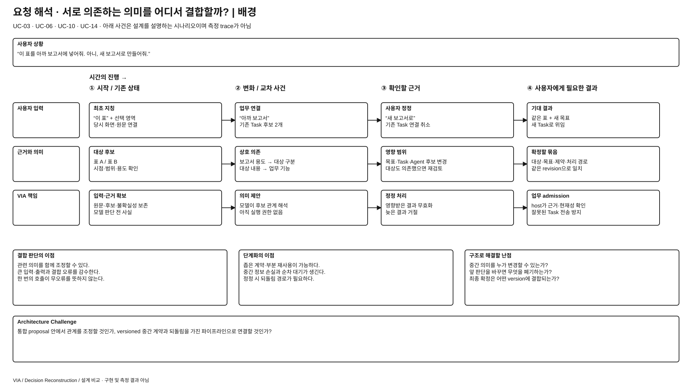
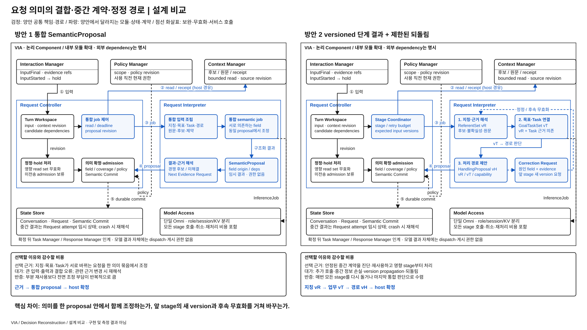

# 요청 의미를 통합 판단할 것인가, 단계별 파이프라인으로 해석할 것인가

> **우선 검토 후보 / 사용자 선정 전** · [목록](./README.md)
> 현재 방식은 target에 명시되어 있고, 대안은 이번에 재구성했다. 양쪽 우열은 미검증이다.

## 발표용 2페이지

**배경 — 이 과제에서 왜 어려운가**

[배경 SVG 크게 보기](./diagrams/request-interpretation-topology-background.svg) · [배경 draw.io 편집 원본](./diagrams/request-interpretation-topology-background.drawio)

**설계 비교 — 같은 완료 조건을 만드는 두 실행 구조**

[비교 SVG 크게 보기](./diagrams/request-interpretation-topology-comparison.svg) · [비교 draw.io 편집 원본](./diagrams/request-interpretation-topology-comparison.drawio)

검정은 양안 공통, 파랑은 **양안 각각에서 달라지는 모듈·상태·계약**이다. 큰 테두리는 논리 책임 묶음이며 모든 상자가 별도 process라는 뜻이 아니다. 같은 Component를 여러 위치에 확대 표기해도 instance·모델 가중치를 복제하지 않는다. 그림의 내부 모듈과 아래 계약은 대안을 검토하기 위한 구체 설계이며 target 기준선 변경·구현·측정 결과가 아니다.

## ASR·추가 QA 관점의 장단점과 예상 차이

아래는 **동일 기능·완료 조건에서의 구조적 예상**이며 측정 결과나 승자 선정이 아니다. `PRIMARY`는 차이를 직접 검토할 축, `REGRESSION_ONLY`는 개선을 주장하기보다 기능 유지를 확인할 축이라는 **적용 제안**이다. 정식 모집단·수치·역할은 아직 동결하지 않았다. [현재 ASR 정의](../../08-quality-attributes/core-asr-contract.md)와 [상세 QA 의미](../../08-quality-attributes/README.md)를 유지한다.

**직관적인 핵심:** 통합안은 서로 관련된 뜻을 한 자리에서 조정하고, 단계안은 잘 끝난 판단을 보관해 필요한 부분만 다시 한다. 의미가 서로 자주 바뀌면 통합의 이점이, 안정된 부분이 반복 재사용되면 단계화의 이점이 커진다.

| 관점 · 적용 제안 | 방안 1의 장단점 | 방안 2의 장단점 | 차이가 나는 조건·주의점 |
| --- | --- | --- | --- |
| QA-19 의미 정확성 · PRIMARY | **장점:** 표·보고서·기존 Task의 관계를 함께 보아 앞뒤 모순을 조정할 수 있다. **단점:** 큰 입력과 복합 schema에서 일부 제약을 빠뜨리거나 잘못된 관계를 한꺼번에 확정할 수 있다. | **장점:** 좁은 field 계약·후보·단계별 근거로 누락 위치를 드러낸다. **단점:** 앞 단계가 버린 후보·원문 관계는 뒤 단계가 복구하기 어렵고 오류가 전파된다. | 대상과 업무가 강하게 얽히면 1안에, 독립적인 중간 의미가 안정적이면 2안에 유리할 여지. 단계 수 자체는 정확도 보장이 아니다. |
| QA-09 응답성 · PRIMARY | **장점:** 여러 판단의 순차 왕복을 줄인다. **단점:** 큰 통합 입력·출력과 반복 재해석이 길어질 수 있다. | **장점:** 관련 stage만 다시 실행할 수 있다. **단점:** 최초 요청은 지칭→업무→경로를 기다리고 correction은 추가 왕복을 만든다. | 처음부터 새로 이해하는 요청과 일부만 정정하는 요청을 나눠 본다. 호출 수뿐 아니라 입력량·공유 queue·실제 의미 있는 응답까지의 전체 대기를 본다. |
| QA-29 변경 용이성 · PRIMARY | **장점:** 관계 변경을 통합 schema·해석 계약에서 함께 수정한다. **단점:** 새로운 의미 field가 통합 prompt·검증·dependency에 퍼질 수 있다. | **장점:** 대상 추출만 바뀌고 중간 계약이 유지되면 해당 stage에 집중된다. **단점:** vR schema가 바뀌면 vT·vH·coordinator·trace reader까지 수정한다. | 예: 새 지칭 근거 추가와 기존/새 Task 관계 변경은 파급이 다르다. 박스·함수 수가 아닌 변경된 Component·Interface·State·Runtime을 센다. |
| QA-39 신뢰성·복구 · REGRESSION_ONLY | **장점:** 미완료 semantic 작업의 진행 상태가 비교적 단순하다. **단점:** 실패한 큰 작업을 다시 실행해야 할 수 있다. | **장점:** 같은 attempt에서 성공한 stage를 재사용할 여지가 있다. **단점:** stale stage·retry cycle·부분 실패의 조정 지점이 늘어난다. | 이번 대안은 stage를 RAM에 두므로 crash 뒤 단계 이어하기 우위는 주장하지 않는다. 양안 모두 미확정 결과로 dispatch하지 않아야 한다. |
| QA-41 메모리 · 추가 진단 | 큰 통합 prompt/KV peak가 생기지만 stage 산출물 여러 벌은 필요 없다. | 작은 stage별 KV를 순차 회수할 수 있지만 중간 후보·원문 참조·재시도 상태가 남는다. | 같은 Omni weights는 공통이다. 3단계라고 모델 메모리가 3배가 되는 것도, 반드시 감소하는 것도 아니다. |
| QA-61 실행 추적 · 추가 qualification | field별 근거와 재해석 revision을 남겨야 실패 원인을 재구성할 수 있다. | stage ID·upstream version·correction 이유가 진단을 돕지만 관계 누락 가능성도 늘어난다. | 로그량이 아니라 입력→정정→결과의 연결 완전성이다. 중간 상태가 있다는 이유만으로 높은 점수를 보장하지 않는다. |

추가 QA는 기존 지위 그대로 진단·회귀·qualification으로 다룬다. 더 빠른 응답으로 잘못된 대상 실행·중복 실행·권한 위반을 상쇄하지 않는다. 메모리의 core ASR 승격이나 새 QA 정의는 이번 정성 비교에서 확정하지 않는다.

## 그림을 따라 설명할 실행 계약

그림의 상단은 양안의 동일 입력·권한·조회 창구다. 가운데 왼쪽은 **Request Controller의 진행·확정 책임**, 오른쪽은 **Request Interpreter의 실제 추론 작업**이다. 내부 모듈 이름은 이 후보의 구체화이며 승인된 최상위 Component를 새로 만든 것이 아니다. 1안의 통합 입력→job→proposal과 2안의 세 단계·정정선을 비교해서 설명한다.

| 경계 / 상태 | 방안 1의 구체 동작 | 방안 2의 구체 동작 |
| --- | --- | --- |
| 작업 입력 | `request_id, input_revision, attempt_id, evidence_refs, read_set, policy_revision`을 한 통합 작업에 결합 | 같은 envelope에 `stage_id, upstream_versions` 추가; 원문·미해결 후보를 각 단계가 참조 가능 |
| 중간 결과 | `SemanticProposal`의 각 field에 근거·dependency·불확실성 유지 | `ReferentSet vR → GoalTaskSet vT → HandlingProposal vH`; 각 결과에 소비한 앞 version과 source revision 기록 |
| 수정 권한 | 통합 작업이 관계를 함께 다시 제안 | 뒤 단계는 앞 결과를 덮지 않고 `CorrectionRequest(stage, fields, evidence, expected_version)` 반환 |
| 확정 | Request Controller가 입력·field·coverage·권한의 현재성을 검사한 뒤 Semantic Commit | 세 결과의 version 연결이 모두 유효할 때 동일 확정; 마지막에 전체 의미를 다시 판단하는 모델은 추가하지 않음 |
| 임시 상태 수명 | attempt의 proposal·job handle·KV는 취소·종료 시 회수 | 단계 산출물은 attempt 범위 RAM에 보관; 별도 durable workflow engine은 도입하지 않음 |
| crash / 늦은 결과 | durable 입력·확정 기록에서 새 attempt 시작; 이전 job 결과 거절 | 미확정 중간 stage는 재사용하지 않고 재해석; 확정 결과만 기존 복구 계약 적용 |

**정정의 실제 효과:** `vR=4`가 보고서 용도에도 의존했다면 “새 보고서로” 정정 때 vR부터 무효화한다. 표 자체만으로 확정한 대상이고 dependency가 변하지 않았을 때만 vR을 유지하고 vT·vH를 다시 만든다. 이 차이를 기록하지 않으면 단계화의 재사용 주장은 성립하지 않는다.

**처리 종료:** 모든 job에 부모 attempt·deadline을 결합한다. 정정 cycle은 원인 field와 새 evidence revision으로 구별하고, 새로운 근거 없이 같은 cycle을 반복하면 clarification으로 끝낸다. 호출·재처리 한도의 숫자는 후속 계약에서 고정하되 무한 반복을 허용하는 설계로 남기지 않는다.

**심사 질문 — “결국 함수 세 개 아닌가?”** 세 단계는 versioned 의미 결과를 발행하는 별도 모델 작업이고, 후속 결과의 유효성이 앞 결과에 종속된다. 통합안에는 없는 순차 대기·중간 정보 손실·정정 전파·부분 재사용 계약이 실제로 생긴다. 단순 함수 분할로 구현했다면 이 대안에 해당하지 않는다.

## 1. 배경 — 하나의 요청 안에서 판단들이 서로 영향을 준다

“이걸 아까 보고서에 넣어줘”에는 화면 대상, 어느 보고서인지, 기존 업무의 수정인지, 어느 실행에 전달할지가 함께 들어 있다. 보고서의 용도를 알면 화면의 어떤 대상을 뜻하는지 좁힐 수 있고, 대상을 확인하면 필요한 업무 기능이 달라질 수 있다. 잘못 연결한 요청을 Agent가 정확히 실행해도 사용자 목표는 실패한다.

**설계할 때의 질문은 이 판단들을 한 작업에서 함께 풀 것인지, 중간 결과를 만들어 순서대로 풀 것인지다.** 통합하면 관계를 함께 보지만 입력과 판단 부담이 커진다. 단계화하면 각 작업을 좁힐 수 있지만 중간 표현에 빠진 정보와 앞 단계의 오해가 뒤로 전달된다. 단순히 담당 class를 나누는 문제가 아니다.

현재 선택의 근거는 [전체 구조 §6~7](../target-architecture/architecture.md#7-semantic-llm-계약과-호출-예산)의 “목표·대상·Task 관계·routing을 통합 해석”이다. [UC-03](../../05-representative-use-cases.md#uc-03), [UC-06](../../05-representative-use-cases.md#uc-06), [UC-10](../../05-representative-use-cases.md#uc-10), [UC-14](../../05-representative-use-cases.md#uc-14)의 연결 정확성을 다룬다.

## 2. 두 가지 구현 방식

### 방안 1 — 통합 semantic 작업

1. Request Controller가 확정 입력과 Context Manager의 대상·대화·Task 후보를 묶는다.
2. Request Interpreter가 같은 Omni 호출에서 목표·지칭·Task 관계·처리 경로를 함께 제안한다. 후보와 field별 근거·불확실성도 반환한다.
3. 부족한 근거가 있으면 Request Controller가 제한된 읽기를 허용하고, 보강된 근거로 다시 통합 해석한다.
4. Request Controller가 현재 revision·권한·근거를 검사해 전체 요청을 확정한다. 해석은 제안이며 실행 권한이 아니다.

기준선은 모든 field를 매번 버리고 다시 찾는 구조가 아니다. 관련 field와 근거를 유지·무효화할 수 있다. 여기서의 특징은 **서로 영향을 주는 의미를 하나의 proposal 안에서 함께 조정할 수 있다는 것**이다. 보조 조회·cache·내부 단계를 허용하므로 ‘모든 작업이 반드시 한 번의 호출’이라는 정의로 약화하지 않는다.

### 방안 2 — 중간 계약을 가진 해석 파이프라인

1. 근거·지칭 단계가 원문과 시점별 evidence를 받아 대상 후보·정정 관계·미해결 범위를 반환한다.
2. 목표·업무 연결 단계가 원문, 후보, 관련 Task 근거를 받아 목표·제약·기존/새 업무 관계를 만든다.
3. 처리 경로 단계가 앞 결과와 capability·scope 정보를 받아 직접 응답·위임과 Agent 후보를 제안한다.
4. Request Controller가 최종 요청을 검증한다. 중간 결과는 아직 외부 실행을 허용하지 않는다.

단계별 입력·출력 schema와 오류·재처리 계약을 가진 처리 단위를 두고 Request Controller가 진행 상태·중간 결과·의존 revision을 관리한다. 현재 Request Interpreter의 통합 계약은 단계별 호출 계약으로 바뀐다. 단계는 같은 Omni를 Model Access로 호출하며 모델 가중치를 복제하지 않는다. 이 후보에서 새 최상위 Component 명칭이나 process 분리는 확정하지 않는다.

대안은 첫 단계가 대상을 무조건 하나로 고르는 방식이 아니다. 후보 집합·불확실성·원문 참조를 다음 단계에 보존한다. 뒤 단계에서 앞 결과와 충돌하면 원인 field·근거를 지정해 관련 단계부터 제한적으로 재처리한다. 전체 deadline과 유한 재처리 예산을 두고, 해결되지 않으면 추가 근거 또는 사용자 확인으로 끝낸다. 매 단계가 전체 Context로 모든 판단을 다시 하면 이 후보의 좁은 처리 단위라는 이점이 사라진다.

**구조를 구별하는 결정적 규칙:** 대안에서는 후속 단계가 이미 발행된 앞 단계의 의미 결과를 몰래 덮어쓰지 않는다. 해당 단계의 정정 계약으로 새 version을 만들고, 의존한 후속 결과를 무효화한다. 후보 집합을 처음 전달받아 자기 업무 범위에서 연결하는 것과 앞 단계의 근거 해석 자체를 바꾸는 것도 구별한다. 마지막에 모든 의미를 다시 판단하는 통합 모델을 붙이면 방안 1로 수렴한다. Request Controller의 공통 schema·권한·현재성 검사는 이런 전체 의미 재판단과 다르다. 어느 방안에서도 모델 단계가 외부 실행을 직접 승인하지 않는다.

## 3. 같은 상황을 따라가 보면

| 사건 | 통합 해석 | 단계별 해석 |
| --- | --- | --- |
| “이 표를 아까 보고서에 넣어줘”; 보고서 후보가 둘 | 표·용도·최근 업무 근거를 함께 보고 대상과 Task 관계를 제안 | 표 후보를 유지한 채 업무 연결 단계에서 두 보고서를 비교; 부족하면 질문 |
| 업무 후보를 본 뒤 앞의 “이 표” 해석도 바뀜 | 동일 판단 안에서 후보 관계를 조정할 수 있음 | 뒤 단계가 앞 단계로 정정 요청을 보내고 관련 결과를 다시 구성 |
| 해석 중 “새 보고서로 만들어줘”로 정정 | 관련 field를 무효화하고 새 revision으로 통합 재해석 | 근거가 그대로인 대상 결과는 검증 후 재사용 가능; 목표·업무와 이후 단계는 재처리 |
| 모델 schema 오류·timeout | 통합 proposal이 완성되지 않아 확정 보류 | 성공한 중간 결과를 보관할 수 있지만 최종 단계 미완료이면 동일하게 확정 보류 |

재사용은 단계가 있다는 사실만으로 얻어지지 않는다. 대상 판단이 보고서 Context에도 의존했다면 보고서 변경 때 앞 단계도 무효화해야 한다. 의존성을 기록하지 않고 앞 결과를 유지하는 것은 빠른 대안이 아니라 잘못된 대안이다.

## 4. 실제 구조 차이와 대가

| 항목 | 통합 해석 | 단계별 해석 |
| --- | --- | --- |
| 추론의 의존 그래프 | 한 작업에서 결합 판단, 필요 근거 후 재해석 | 중간 결과를 기다리는 단계와 되돌림 경로 |
| 모델 입력 | 함께 판단할 관련 근거와 의미 계약 | 단계별로 좁힌 근거 + 원문/후보/앞 결과 참조 |
| 요청 작업 상태 | 통합 proposal·field 근거·revision | 단계별 결과·상태·의존 목록·재처리 시작점 추가 |
| 오류 양상 | 여러 판단의 결합 오류, 큰 출력의 일관성 문제 | 중간 후보 누락·정보 손실·오류 전파·되돌림 비용 |
| 호출·공유 자원 | 순차 추론 경계를 줄일 여지, 큰 입력·출력 | 더 많은 순차 경계, 작은 입력·출력과 재사용 여지 |

**현재 방식이 설득력 있는 조건:** 지칭·목표·Task가 강하게 얽힌 대화가 많고, 통합 schema를 모델이 안정적으로 처리하며, 단계별 왕복·중복 입력 비용이 큰 경우다.

**왜 대안을 선택할 수 있는가:** 각 판단의 필요한 자료와 변경 주기가 다르고, 중간 후보 계약이 정보 손실 없이 안정적이며, 반복 요청에서 특정 단계만 자주 바뀐다면 단계별 처리와 오류 진단·재사용이 유리할 수 있다. 단계 수가 많다는 이유만으로 더 정확하다고 하지는 않는다.

**현재 선택을 다시 볼 조건:** 통합 출력의 복합 관계 오류나 전면 재처리 부담이 반복되고, 강한 파이프라인이 같은 목표·근거를 유지하면서 이를 줄이는 경우다. 반대로 중간 계약이 결국 전체 근거·전체 판단을 복제하거나 되돌림이 빈번하면 대안의 설득력이 약해진다. 아직 어느 쪽의 실험 결과도 없다.

## 5. 다른 선택과 섞지 않는 범위

- 초기 evidence와 Context 확보 전략, 최종 권한·revision 검증, 모델/build, 입력 인식은 공통으로 둔다. [Context 획득 후보](./context-acquisition-strategy.md)의 차이를 동시에 적용하지 않는다.
- 현재의 “semantic 총 2회”는 기준선의 자원 정책이다. 이를 여러 필수 단계의 대안에 그대로 씌워 미완료로 만들지 않는다. 후속 비교에서는 공통 외부 조건·자원 상한·실패 처리를 정하고 모든 실제 호출 비용을 드러내야 한다. 지금 예산이나 QA 계약을 바꾸지는 않는다.
- 단지 Request Interpreter를 Request Controller 안으로 옮기는 선택과 다르다. 독립된 모델 작업·중간 정보 계약·재처리 의존이 없다면 이 후보도 제외한다.

### Component와 계약에 실제로 생기는 변경

| 위치 | 방안 1 | 방안 2에서 필요한 변경 |
| --- | --- | --- |
| Request Interpreter | 통합 SemanticProposal 생성 | 단계별 입력·결과·정정 port와 versioned 중간 의미 계약 |
| Request Controller | proposal·field dependency 검사 및 확정 | 단계 진행·정정 요청·후속 무효화·재개 위치 관리 추가; 외부 확정 권한은 유지 |
| Model Access | 통합 semantic job의 identity·취소·자원 관리 | 단계 job과 부모 Request·중간 version의 연결; 가중치·scheduler 계약은 공통 |
| State Store | 기존 요청과 해석 근거 기록 | 확정 기록은 유지; 미확정 stage는 attempt 임시 상태로 두고 crash 시 재해석 |

영향받는 기준선은 SemanticProposal, field dependency, 재해석 예산·요청 진행 상태다. 이 표는 대안을 채택한다면 바꿀 계약을 설명하며 target 본문을 변경한 것이 아니다. [선행 아이디어 검토](./reference-idea-review.md)의 의미 정정 계약을 참고했으며 ADR-004의 deferred 상태는 유지한다.

## 6. 발표 페이지의 핵심

**배경 1장:** 왼쪽에 “이 표를 아까 보고서에 넣어줘”, 가운데에 표·보고서·기존 Task 후보의 교차 관계, 오른쪽에 정정 시 영향을 받는 판단을 놓는다. 하단 질문은 **“서로 의존하는 의미를 함께 판단할 것인가, 중간 계약으로 나눠 판단할 것인가?”**다.

**비교 1장:** 공통 Input/Evidence와 최종 Request Controller 검증은 검정으로 둔다. 1안은 통합 추론 작업·proposal, 2안은 단계별 작업·중간 저장·되돌림 연결을 양쪽 파랑으로 표시한다. Model Access와 단일 Omni를 공통으로 그려 단계마다 모델을 적재하는 것으로 보이지 않게 한다. 단계별 성공·보류·무효화와 Request revision을 함께 표시한다.

발표에서는 박스 개수가 아니라 **앞 판단의 결과가 다음 판단을 어떻게 제한하고, 정정 때 무엇을 다시 해야 하는지**를 설명한다. 위 비교 그림의 단계·정정 경로로 이를 설명한다.

## 7. 바로 사용할 발표 요약

**배경 5줄**

1. VIA는 “이걸 아까 보고서에 넣어줘”에서 대상·목표·기존 업무·처리 경로를 함께 찾아야 한다.
2. 잘못된 Task에 연결하면 Agent가 작업 자체를 잘 수행해도 사용자 목표는 실패한다.
3. 각 판단은 독립적이지 않아, 뒤에서 찾은 업무 정보가 앞의 지칭 해석을 바꿀 수 있다.
4. 통합 판단은 관계를 함께 볼 수 있지만, 단계화는 좁은 계약과 부분 변경·진단에 유리할 수 있다.
5. 따라서 핵심은 판단을 나누는 개수가 아니라 중간 의미를 누가, 어떤 근거와 정정 절차로 바꾸는가다.

**설계 비교 8줄**

1. 방안 1은 관련 근거를 모아 하나의 의미 묶음으로 제안하고 모순된 항목을 함께 조정한다.
2. 방안 2는 근거·대상, 목표·업무, 처리 경로를 versioned 중간 결과로 연결한다.
3. 두 안 모두 원문·불확실성·후보를 보존하고 같은 Omni 가중치를 공유한다.
4. 방안 2에서 앞 판단을 바꾸려면 해당 단계의 정정과 후속 결과 무효화가 필요하다.
5. 방안 1도 부분 cache와 field별 무효화를 허용하므로 매번 전부 다시 처리한다고 가정하지 않는다.
6. 판단들이 자주 서로를 바꾸면 통합이, 안정된 중간 계약을 자주 재사용하면 단계화가 설득력 있다.
7. 대안의 대가는 순차 호출·중간 기록·되돌림이며, 단계가 많다고 정확성이 보장되지는 않는다.
8. 마지막 전체 재판단으로 차이가 사라지거나 재사용 이득보다 정정 비용이 크면 대안의 근거가 약해진다.
