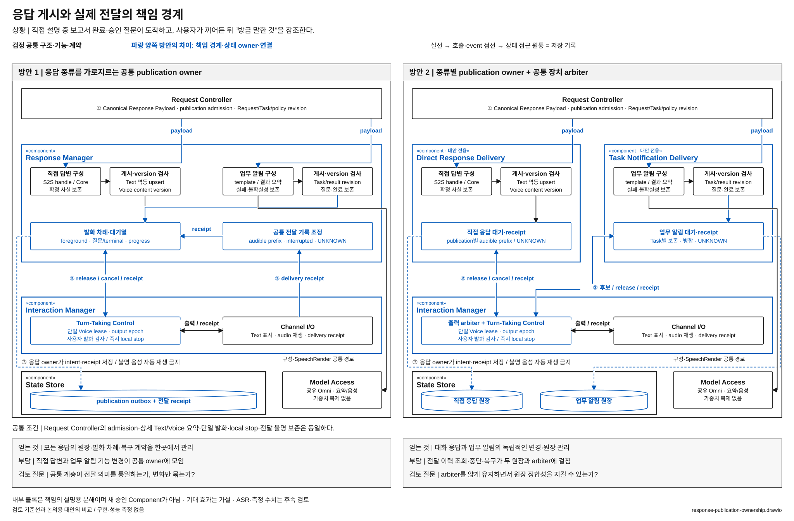

# 직접 답변과 업무 알림의 전달을 한곳에서 관리할 것인가

> 상태: **우선 검토 후보 / 사용자 선정 전** · [목록](./README.md)

**질문:** 서로 다른 경로에서 만들어진 답변의 Text·Voice·알림 전달을 공통 Component가 관리할 것인가, 응답 종류별 Component로 나눌 것인가?

## 해결할 문제

VIA가 화면의 표를 설명하는 중에 보고서 완료와 다른 업무의 승인 질문이 도착한다. 사용자가 끼어들면 음성은 즉시 멈춰야 하고, 결과와 질문은 화면에 남아야 한다. 이후 “방금 말한 것”이 생성만 된 문장을 가리키는 것으로 처리되어서도 안 된다.

문제는 어떤 알림을 먼저 읽을지의 순서만이 아니다. **응답 구성·게시·실제 전달 상태를 누가 소유하고, 여러 응답 경로가 어떻게 하나의 출력 장치를 공유하는가**가 핵심이다.

## 두 방안

**방안 1 — 공통 Response Manager.** Request Controller가 admission한 직접 답변·질문·업무 결과를 Response Manager가 공통 publication·채널별 전달 상태로 관리한다. Interaction Manager는 표시·재생·local stop과 receipt를 제공한다.

**방안 2 — 응답 종류별 Component.** 대안 전용 Direct Response Delivery는 직접 답변·VIA clarification을, Task Notification Delivery는 Agent 진행·결과·질문을 구성·게시한다. 각각 publication 원장을 소유한다. Interaction Manager의 공통 출력 계약을 확장해 하나의 Voice lease·output epoch와 응답 간 arbitration을 관리한다. Request Controller의 게시 admission은 두 경로 모두 유지한다.

[draw.io 편집 원본](./diagrams/response-publication-ownership.drawio) · [표기 규칙](./diagrams/README.md)

### 그림에서 확인할 흐름과 구조 차이

① 허용된 응답이 종류별 구성·게시 검사를 거쳐 ② 발화 후보와 release/cancel로 이어지고, 실제 I/O의 receipt가 원장에 돌아온다. 방안 1은 Response Manager 안에서 공통 대기열과 전달 기록을 조정한다. 방안 2는 두 publication owner의 후보를 Interaction Manager의 확대된 arbiter가 조정한다. 파란 원장은 이 소유권 분리를 보여준다. 장치 입출력은 검정 공통 부분이며, 실제 receipt를 만든다는 이유로 publication 원장의 owner가 되지는 않는다.

| 구조 차이 | 방안 1 | 방안 2 |
| --- | --- | --- |
| Component | 하나의 Response Manager | 두 대안 전용 전달 Component로 분리 |
| publication 원장 | 공통 owner | 응답 종류별 owner; 공통 ID·version·receipt 계약 |
| 출력 차례 조정 | Response Manager의 대기열 + Interaction Manager의 현장 검사 | Interaction Manager의 공통 arbiter + 종류별 내구 대기열 |
| 전달 이력 조회 | Response Manager의 read port | 두 read port를 요청/응답 identity로 결합 |

## 어느 쪽이 설득력 있는가

방안 1은 실제 게시·중단·전달 불명을 한 계약으로 관리하고 응답 간 차례를 조정하기 좋다. 대신 직접 응답과 업무 알림의 요구가 한 Component의 변경으로 모인다. 공통 관리가 모든 응답을 한 직렬 처리로 막는 구조일 필요는 없다.

방안 2는 대화형 설명과 업무 알림의 표현·전달 기능이 서로 다르게 발전할 때 유리할 수 있다. shared library로 publication ID·receipt 처리를 재사용하고 공통 arbiter로 음성 중첩을 막을 수 있다. 대신 원장과 복구 흐름이 분산되고, “이미 들려준 내용”을 확인할 조회·조정 계약이 늘어난다.

## 자체 검토와 남은 질문

- 사용자 발화 중 알림 금지, Text 상세/Voice 요약, 좁은 S2S 직접 응답, 실제 전달 기록은 양쪽 모두 유지한다.
- local barge-in은 두 방안 모두 Interaction Manager에서 즉시 수행한다. 응답 Component의 승인 응답을 기다리지 않는다.
- 대안의 두 Component가 같은 공유 Omni를 사용한다. 모델을 각각 적재하거나 새 TTS를 추가하지 않는다.
- **후보로 남길 이유:** 공통 Component의 분리와 publication 상태 소유권 이동, Interaction Manager의 계약 확대가 그림에 드러난다. 알림 우선순위만 바꾸는 후보와 구분된다.
- 공통 arbiter·shared library를 허용한 대안에서도 원장·복구 중복이 큰지, 공통 Response Manager가 서로 다른 기능의 변경을 과도하게 묶는지가 논점이다. 결과는 아직 없다.

기준선 근거: [전체 구조 §8·13](../target-architecture/architecture.md), [제어 계약 §6·7](../target-architecture/control-and-lifecycle.md). 주요 사용자 상황: UC-01·07·11·13~15.
