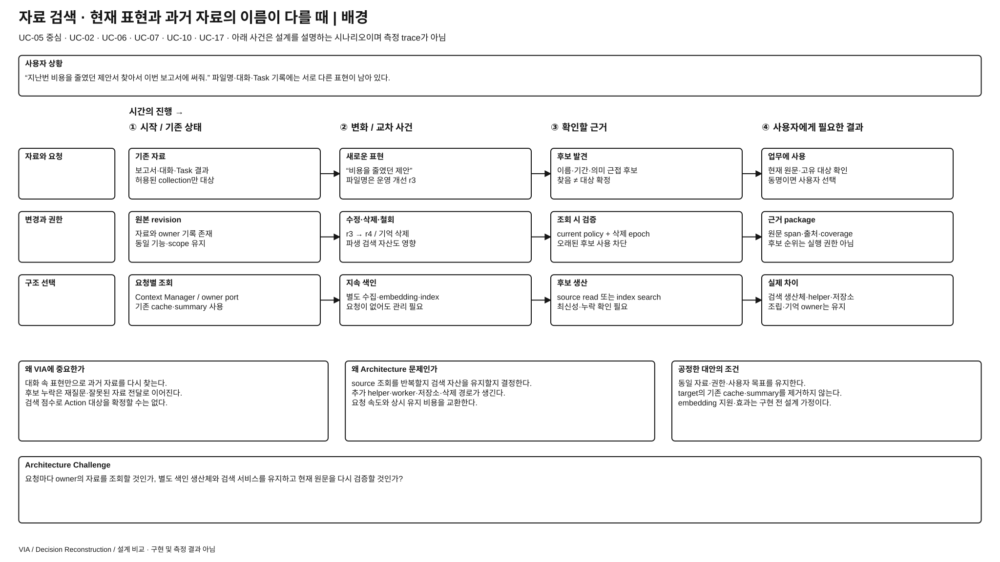
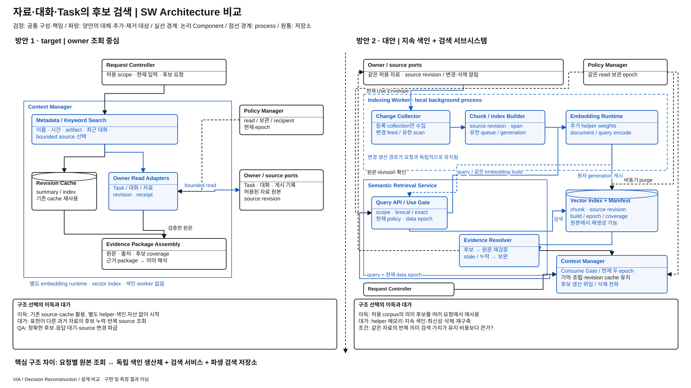

# 과거 자료·대화·업무를 찾는 구조 — 직접 조회와 의미 검색 서브시스템

> 상세 설계 비교안 / 방안 1 = REVIEWED_BASELINE / 방안 2 = 미채택 steelman / 구현·측정 없음
> [전체 안내](./README.md) · [작업 계획](./WORKPLAN.md) · [선발 기록](./discovery-and-selection.md)

**문제:** 사용자가 정확한 파일명 대신 “지난번 배터리 얘기한 자료”라고 말해도, 허용된 자료·대화·Task에서 후보를 찾아 올바른 대상에 연결해야 한다. **선택:** 원본 owner에 필요한 조회를 보내는 구조를 유지할 것인가, 자료 변경을 받아 검색 자산을 계속 생산하는 별도 서브시스템을 둘 것인가?

## 발표용 배경 1장

[크게 보기](./diagrams/semantic-retrieval-subsystem-background.svg) · [draw.io 원본](./diagrams/semantic-retrieval-subsystem-background.drawio)

1. 사용자는 파일명·Task ID보다 주제·상황·이전 대화로 대상을 기억한다.
2. VIA는 후보를 잘못 찾으면 이후 해석과 Agent 실행이 정확해도 다른 자료로 업무를 수행한다.
3. 자료는 여러 owner에 있고, 이름·내용·권한·삭제 상태가 서로 다른 시점에 바뀐다.
4. 검색을 미리 준비하면 요청 시 범위를 넓힐 수 있지만, 별도 모델·색인·최신성·삭제 수명을 책임져야 한다.
5. 핵심은 검색 점수 설정이 아니라 **원본 조회형 구조와 지속 색인 생산형 구조 중 어떤 시스템을 운영할 것인가**다.

**배경 페이지 설명:** UC-05를 중심으로 UC-02·06·07·10·17의 지칭·자료 설명·업무 연결을 묶는 문제다. “배터리 보고서”라는 단어가 없는 자료에도 관련 내용이 있을 수 있지만, 유사한 문서 두 개가 검색됐다고 정답 하나를 고를 수는 없다. 접근 가능한 자료 전부를 상시 수집한다는 권한도 없다. 정확한 후보 탐색, 요청 대기, 색인 비용, 사용자가 철회한 자료의 사용 차단을 동시에 설계해야 한다.

## 발표용 설계 비교 1장

[크게 보기](./diagrams/semantic-retrieval-subsystem-comparison.svg) · [draw.io 원본](./diagrams/semantic-retrieval-subsystem-comparison.drawio)

**그림에서 볼 것:** 1안은 Context Manager를 중심으로 owner/source 조회가 펼쳐진다. 2안은 위쪽에 **변경 수집 → 색인 worker → embedding runtime → 검색 저장소**라는 지속 생산 구조가 새로 생기고, 아래 요청 경로가 이 검색 자산을 소비한다. Embedding Runtime은 새 helper dependency이며 Omni 복제본이 아니다. 점선 경계는 별도 worker process, 실선 큰 경계는 논리 Component/서브시스템이다.

### 방안 1 — target의 원본 조회 중심 Context Manager

근거는 [기억 구조 §1~3](../target-architecture/memory-and-context-lifecycle.md), [전체 구조 §4·9](../target-architecture/architecture.md)다. Context Manager의 metadata/keyword index·owner read port·revision cache·summary를 모두 유지한다. Stable ID가 있으면 바로 읽고, 이름·시간·artifact·최근 대화로 후보를 좁힌다. Request Interpreter는 같은 Omni로 후보와 현재 요청의 관계를 해석하며 부족하면 host를 통해 bounded read를 보완한다. 매번 전체 자료를 다시 읽거나 cache가 없는 안으로 약화하지 않는다.

### 방안 2 — Semantic Retrieval Service와 지속 색인 생산

Context Manager의 기억 관리·근거 package 조립은 유지하고 **검색 후보 생산 책임**을 별도 Semantic Retrieval Service로 옮긴다. Indexing Worker는 사용자에게 허용된 유한 collection만 대상으로, source revision을 가진 문서/대화 chunk와 vector를 만든다. Request 시 Query Encoder가 같은 embedding build로 query를 변환하고 Vector Search가 lexical/exact-ID 결과와 함께 후보를 제공한다. 원문·권한 검증 뒤에만 Context Manager가 근거로 채택한다. 검색 결과는 의미 확정이나 완전 탐색의 증거가 아니다.

| 구성·책임 | 방안 1 | 방안 2에서의 실질 변화 |
| --- | --- | --- |
| Context Manager | 검색·read·cache·memory·근거 package | memory·read·package 유지; semantic 후보 생산은 검색 서비스에 위임 |
| Semantic Retrieval Service | 없음 | 별도 Query API·collection registry·검색 결과 계약을 소유하는 새 Component |
| Indexing Worker | 별도 의미 색인 생산체 없음; 기존 index/cache 유지 | source 변경 수집, chunking, 유한 작업 queue, index generation 게시·재생성 담당 |
| Embedding Runtime | 없음 | query/document vector 생산 helper. 모델·tokenizer·weights·workspace·queue 전체 비용 공개 |
| Vector Index + Source Manifest | 없음; metadata/keyword index는 있음 | vector와 source/chunk revision·policy epoch·coverage·embedding build를 함께 관리하는 파생 저장소 |
| 원본 owner·Request Interpreter·Request Controller | 원본 제공·의미 제안·확정 | 그대로. Vector Search가 Task·권한·정답을 확정하지 않음 |

### 정상·변경·삭제·장애 계약

| 경계 | 구체 계약 |
| --- | --- |
| 수집 권한 | collection의 source·범위·read 및 index 보관 권한을 등록. 허용되지 않은 본문을 검색 준비 명목으로 수집하지 않음. 자동 User Memory 승격 금지 |
| 색인 게시 | `source_id, revision, chunk_span, policy_epoch, embedding_build, generation`에 결합. 새 generation이 완성된 뒤 manifest pointer와 함께 원자 게시. 부분 생성은 검색 불가 |
| source 변경 | change feed가 있으면 수신, 없으면 유한 revision scan. 발견 전 lag는 숨기지 않음. 반환 후보는 소비 직전 원본 revision을 재검증; 불일치면 최신 원문 조회·재색인·보류 |
| 검색 결과 | 후보 ID·span·source revision·score·indexed scope·lag·omission 제공. 유사도·top-k는 COMPLETE coverage가 아님. Stable ID 조회와 lexical 경로를 유지해 exact 대상 손실을 막음 |
| 단일 후보와 Action | top-1 한 건의 원문 revision이 맞아도 대상 유일성·coverage가 증명된 것은 아님. Exact identity·허용 범위 owner 조회·사용자 선택으로 target과 coverage가 충분해질 때까지 외부 Action admission 보류 |
| 후보 부재 | “자료가 없음”으로 단정하지 않음. 동일 bounded scope에서 owner 조회로 보완하거나 범위를 사용자에게 확인. 무한 corpus 확장 금지 |
| 삭제·철회 | Policy Manager의 현재 policy revision·Use Envelope(source, recipient, purpose, scope, expiry)와 Context Manager의 data/deletion epoch를 검색 gate·소비 gate에서 각각 검사해 즉시 사용 차단. 검색 서비스는 이 계약을 강제하며 독립 권한 엔진을 만들지 않음. vector·chunk·cache purge를 추적하고 늦은 index job을 CAS로 거절. epoch 동기화가 불명하면 해당 scope 검색을 닫음 |
| 장애 | index 손실은 원본에서 rebuild. helper 장애 때 원본 조회로 저하 운용하되 latency·검색 실패는 기록. 원본 단절 때 stale index만 믿고 Action 대상을 확정하지 않음 |
| 배치·자원 | local Indexing Worker와 local Embedding Runtime을 추가. 서로 별도 Component이나 하나의 worker process에서 실행 가능. 별도 DB 서버를 강제하지 않고 vector file/embedded index와 manifest 사용. 낮은 우선순위·유한 queue·삭제 우선, Omni/ASR의 지원 부하 예산 침범 금지 |

**같은 상황의 추적:** “지난번 배터리 얘기한 자료로 이어서 만들어줘” → 1안은 최근 대화·Task·metadata 후보와 bounded 원문을 조합한다. 2안은 이미 색인된 의미 후보를 받아 같은 원문 검증을 한다. 두 자료가 동등 후보면 둘 다 질문한다. 색인 중 문서가 수정되면 2안은 old chunk를 채택하지 않고 새 revision을 읽는다. 1안도 read 이후 source 변경 race를 재검증한다. 2안은 미래·미허용 자료를 미리 아는 것이 아니다.

## ASR·추가 QA 장단점 비교

정성적 인과 가설이며 수치·승자가 아니다. P=`PRIMARY`, R=`REGRESSION_ONLY`; 전체 공통 의미는 [품질 비교 규칙](./quality-comparison-contract.md)을 따른다.

| 관점·적용 | 방안 1 장점 / 비용 | 방안 2 장점 / 비용 | 차이를 확인할 조건 |
| --- | --- | --- | --- |
| QA-19 · P | 명시 identity·최신 원문 연결이 단순 / 이름과 주제가 다르면 후보 누락 가능 | 표현이 다른 관련 자료를 후보로 제공할 여지 / 잘못된 유사 후보·chunk 문맥 손실·미색인 범위 존재 | 같은 허용 corpus에서 이름 불명·동명이자료·수정·삭제를 포함. 검색 recall 자체를 QA-19 점수로 대체하지 않고 최종 referent·Task·handling field 확인 |
| QA-09 · P | 색인 준비 없이 즉시 조회, warm cache 사용 / 분산 source의 반복 검색 대기 | 준비된 index에서 후보 조회 / query encoding·원본 재검증·cold indexing·CPU 경합 비용 | 최초/반복 요청, index lag와 helper 포화 포함. 사전 생산 시간을 사용자 대기 0과 전체 비용 0으로 혼동하지 않음 |
| QA-29 · P | source adapter·기존 검색 계약 중심 / source별 검색 의미를 흡수 | 검색 API로 소비자 격리 / 새 source에 변경 feed·parser·ACL mapping·reindex, embedding 교체 시 generation migration | 동일 source 추가·source schema·모델 build 교체 시 실제 Component/Interface/State/Runtime 변화 |
| QA-39 · P | 재구성할 파생 자산이 적음 / 원본 source 장애에 직접 의존 | index만의 손상은 rebuild·원본 fallback / index와 manifest 불일치·삭제 지연·worker backlog라는 추가 실패 | 기존 source 장애와 새 서브시스템 장애를 모두 공개. fallback이 deadline을 넘으면 성공 아님 |
| QA-41 · 추가 진단 | 기존 cache·summary·원문 buffer / 요청 burst peak | embedding weights·index resident pages·chunk queue·rebuild peak 추가 / 선택 원문량 감소 여지 | 공유 Omni·ASR 공통 비용 포함; vector 디스크 용량과 RAM 구분. 추가 helper가 항상 메모리를 줄인다고 주장하지 않음 |
| QA-51·61·62 · qualification | bounded read provenance·삭제 추적 필요 | 검색 복제본·collection 권한·index build·후보 provenance 관리 확대 | 검색 DB가 있다고 승인 범위가 넓어지지 않음. 운영 index와 평가 oracle 분리 |

**방안 2가 합리적인 조건:** 허용 corpus가 충분히 크고 같은 자료를 다양한 표현으로 반복 찾으며, source 변경과 삭제를 추적할 수 있고 추가 helper의 자원을 감당한다. **방안 1을 유지할 이유:** 최근 대화·명시 자료가 주로 사용되고 source 변화가 잦거나 색인 권한·자원이 제한되면 관리할 자산이 적은 구조가 유리할 수 있다.

**반증 조건:** 1안의 bounded 후보 누락 때문에 후속 해석만으로 정확성을 확보하지 못하고 2안이 전체 비용 안에서 이를 해결하면 현재 선택의 근거가 약해진다. 반대로 2안이 매번 전체 원본 검색으로 복귀하거나 stale 후보·색인 유지 비용이 이점을 소모하면 별도 서브시스템 도입 근거가 약해진다.

## 발표용 설계 비교 8줄

1. 현재 target은 Context Manager가 원본 owner를 조회하고 기존 index·cache를 재사용한다.
2. 대안은 후보 검색을 별도 Semantic Retrieval Service에 맡긴다.
3. 이를 위해 Indexing Worker·Embedding Runtime·Vector Index가 새로 필요하다.
4. 2안의 위쪽 생산 경로는 사용자 요청이 없어도 허용 collection 변경을 처리한다.
5. 아래 요청 경로는 검색 결과의 원문·권한·revision을 다시 확인한다.
6. 의미 검색은 후보 확보를 돕지만 유사도만으로 대상을 확정하지 않는다.
7. 정확성·반복 조회 이득과 추가 모델·색인·삭제·재생성 비용을 함께 비교한다.
8. 반복되는 의미 검색 수요가 실제로 충분한지가 서브시스템 도입 판단의 핵심이다.
