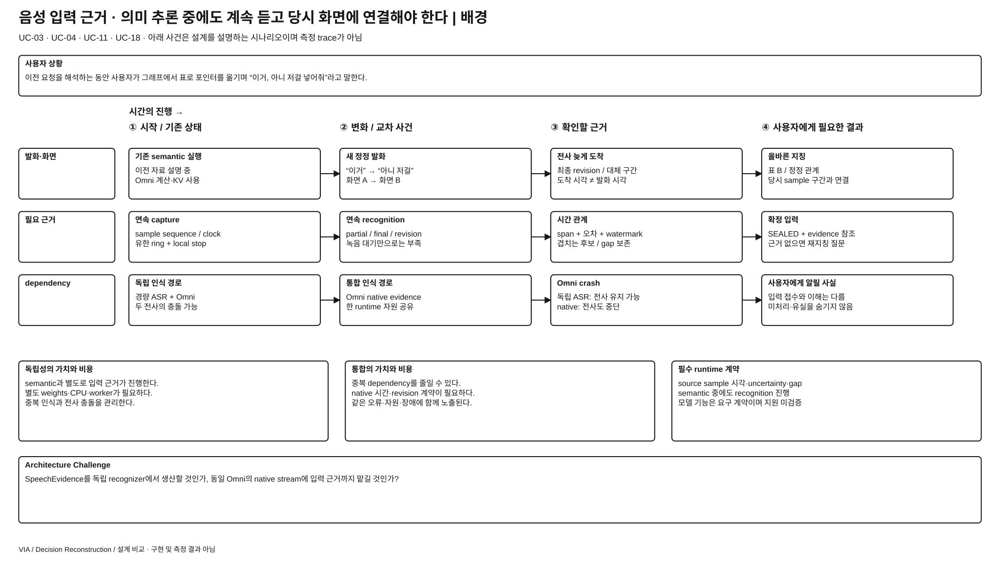
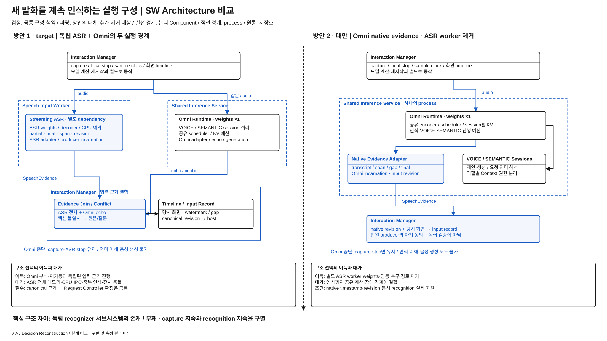

# 음성 입력의 실행 구성 — 독립 인식 worker와 Omni native evidence

> 상세 설계 비교안 / 방안 1 = REVIEWED_BASELINE / 방안 2 = 미채택 steelman / 구현·측정 없음
> [전체 안내](./README.md) · [작업 계획](./WORKPLAN.md)

**문제:** VIA가 화면을 이해하거나 길게 설명하는 동안에도 새 발화·정정을 인식하고, 그 말이 가리킨 당시 화면과 연결해야 한다. **선택:** 입력 근거를 독립 인식 실행체에서 생산할 것인가, 같은 Omni runtime의 native 입력 기능에 맡길 것인가?

## 발표용 배경 1장

[크게 보기](./diagrams/speech-evidence-source-background.svg) · [draw.io 원본](./diagrams/speech-evidence-source-background.drawio)

1. 사용자는 VIA가 계산하거나 말하는 중에도 “아니, 옆 표로”라고 정정한다.
2. 인식을 미루면 입력 확정·의미 처리가 늦고 유한 buffer가 넘칠 수 있다. 당시 timeline이 보존되면 늦은 인식도 정렬할 수 있지만, 현재 화면으로 대체하면 지칭을 잘못 연결한다.
3. Target은 별도 Streaming ASR worker로 인식을 진행하고 Omni의 입력 해석과 불일치를 처리한다.
4. 별도 recognizer는 가중치·CPU·queue·연동·오류 조정이라는 실제 시스템 비용을 만든다.
5. 동일 runtime의 native 경로로 이 기능을 제공할 수 있다면 **독립 실행체 하나를 제거하는 Architecture**가 가능하다.

**배경 페이지 설명:** UC-01·03·04·11·15·18의 연속 발화·화면 지칭·중단·재연결 문제다. 빠른 local stop, 지속 capture, transcript 생산, semantic 이해, 음성 출력은 서로 다른 기능이다. Omni가 실패한 뒤 capture만 남았다고 인식이 계속된다고 설명해서는 안 된다. 한편 독립 ASR도 같은 PC의 CPU·메모리·전원에 의존하므로 모든 장애를 격리하지 않는다.

## 발표용 설계 비교 1장

[크게 보기](./diagrams/speech-evidence-source-comparison.svg) · [draw.io 원본](./diagrams/speech-evidence-source-comparison.drawio)

**그림에서 볼 것:** 1안의 audio fan-out 아래에는 **Speech Input Worker와 Shared Inference Service라는 두 실행 경계**가 있다. 2안에는 독립 ASR worker·모델이 없고, 하나의 Shared Inference Service 안에 Native Evidence Adapter와 VOICE/SEMANTIC session이 들어간다. 양쪽 Omni 가중치는 한 벌이다. 공통 capture·local stop·host 확정은 검정이며, 달라지는 실행체·adapter·근거 생산은 양쪽 파랑이다.

### 방안 1 — target의 독립 Streaming ASR

[공유 Omni §3~5](../target-architecture/shared-omni-runtime.md), [전체 구조 §4·8·14](../target-architecture/architecture.md)가 근거다. Interaction Manager의 capture에서 같은 sample clock의 audio를 독립 Speech Input Worker와 Omni 경로에 제공한다. Model Access의 ASR adapter가 canonical SpeechEvidence를 제공하고 Interaction Manager가 당시 화면 timeline과 결합한다. Omni echo와 중요한 불일치는 원음 재확인 또는 clarification으로 다룬다. 같은 발화를 둘 다 듣는 비용을 공개한다.

### 방안 2 — native evidence로 recognizer 서브시스템 대체

Omni runtime은 audio를 받는 동안 transcript revision·span time·gap·final을 별도 stream으로 내보낸다. Model Access의 Native Evidence Adapter가 이를 같은 host 입력 계약으로 변환한다. 전용 Speech Input Worker·Streaming ASR weights·ASR IPC/재시작 경로는 제거한다. 독립 전사와 echo의 비교를 하던 부분은 단일 producer의 입력 revision·response binding 검증으로 대체한다. 별도 recognizer를 몰래 native 뒤에 붙인다면 이 대안의 자원 inventory와 의미를 다시 작성해야 한다.

| 책임·구성 | 방안 1 | 방안 2 |
| --- | --- | --- |
| 입력 장치·local stop | Interaction Manager의 모델 밖 실시간 경로 | 동일 |
| 전사·시각 근거 생산 | 독립 Speech Input Worker + Streaming ASR dependency | Shared Inference Service 내부 native evidence producer |
| Model Access 입력 adapter | ASR adapter와 Omni adapter, 서로 다른 incarnation | Native Evidence Adapter와 Omni session 계약 결합 |
| 입력 근거 정합성 | 두 producer의 transcript·echo 불일치 보존·재확인 | 단일 producer revision·gap·input echo binding; 자기 동의를 독립 검증으로 보지 않음 |
| scheduler | ASR CPU 예산 + 공유 Omni VOICE/SEMANTIC 예약 | 공유 runtime의 입력 encode/evidence 진행도 예약·상한 필요 |
| 장애 경계 | Omni만 실패하면 ASR 인식 가능; 이해·음성 생성 불가 | Omni 실패 시 인식·이해·음성 생성 함께 불가; capture·local stop 유지 |

### 인터페이스·자원·예외 계약

| 경계 | 양안 공통 요구 및 방안 2의 비용 |
| --- | --- |
| SpeechEvidence | stream/Turn·sample range·transcript revision·partial/final·대체 span·timestamp 오차/방법·gap·producer build/incarnation. 정확한 단어 경계를 보장하지 않으며 불확실 구간과 겹치는 화면 후보 유지 |
| 입력 확정 | Interaction Manager는 producer watermark/gap과 화면 timeline을 묶음. Request Controller가 canonical input revision과 현재 admission을 확정. 늦은 수정은 이전 proposal·generation·미전송 command를 무효화 |
| native 동시 진행 | semantic job 종료를 기다리지 않고 evidence를 생성할 runtime capability 필수. API 동시 호출만으로 충족했다고 하지 않음. 유한 backlog·서비스 기한·cancel safe point를 제공해야 함 |
| 화면 연결 | 같은 capture clock·screen/pointer revision 사용. 처리 시점의 현재 화면으로 과거 지칭 근거를 대체하지 않음. Source-time 제공 불가면 해당 화면 지칭 지원 실패 |
| 포화 | background 중단·신규 긴 job 제한·유한 buffer. 원음 수집 overflow는 gap, 늦게 인식한 결과는 지연/실패로 남김. Native input의 예약이 semantic을 영구 굶기지 않음 |
| 재시작 | 입력 producer incarnation을 바꾸고 미완료 구간을 gap 처리. 옛 final·audio handle의 늦은 완료를 적용하지 않음. 새 인식이 준비될 때까지 입력 접수와 이해 완료를 구별 |
| 삭제 | pin된 원음·transcript·KV도 현재 deletion/policy epoch를 검사. Raw는 승인된 입력 수명에서만 유지. 재시작 뒤 옛 입력을 자동 dispatch하지 않음 |

**필수 capability의 지위:** native timed evidence와 semantic 중 지속 recognition은 이 대안이 요구하는 기능이며 현재 reference build가 모두 지원한다고 확인한 사실이 아니다. 특정 제품·모델 구현이나 학습 방법을 여기서 선택하지 않는다. 미지원이면 같은 VIA 기능을 제공하는 대안으로 실현할 수 없고, 확인될 때까지 비용·효과도 가설이다.

**같은 사건:** 긴 문서 semantic job 중 “옆 표만” 입력 → 양안 capture·local stop → 1안은 독립 ASR, 2안은 native 경로가 해당 sample 구간의 evidence 생산 → 같은 host가 화면 후보·입력 revision 확정. 이때 Omni process가 죽으면 1안에는 새 전사가 남을 수 있고 2안에는 미처리 audio/gap만 남는다. 두 안 모두 자연어 업무를 이해·위임했다고 보고할 수 없다.

## ASR·추가 QA 장단점 비교

### 공통 5가지 항목 — ISO 품질속성과 기호

**(+) 유리 / (-) 불리 / (0) 해당 조건에서 구조상 동등.** 아래는 측정 결과가 아닌 **조건별 설계 예상**이다. 한 행의 기호를 QA 전체 점수나 최종 승자로 확대하지 않는다. 조건이 바뀌면 유불리도 달라질 수 있으며, 모르는 것을 (0)으로 표시하지 않는다. QA-41 메모리는 아직 진단 지표다. 분류는 [ISO/IEC 25010:2023 대응 근거](../../08-quality-attributes/iso-25010-quality-basis.md)를 따른다. 아래 한국어는 설명용이며 정확한 영문 특성·부특성은 대응표에 병기했다.

| ISO 품질 특성 → 부특성 | 항목·판단 조건 | 1안: 독립 ASR + Omni | 2안: Omni native | 쉽고 구체적인 이유 |
| --- | --- | --- | --- | --- |
| 기능 적합성 → 기능 정확성 | QA-19 정확성 — 독립 전사는 맞고 Omni 해석에 중요한 불일치가 생긴 경우 | **(+)** 불일치 발견·재확인 기회 | **(-)** 독립 전사로 교차 확인 불가 | “보내지 마”를 잘못 이해했다면 별도 입력 근거와 대조할 수 있다. 반대로 ASR이 틀리면 불필요한 충돌을 만들 수 있으므로 이 한 조건을 전체 정확도 우위로 확대하지 않는다. |
| 성능 효율성 → 시간 특성 | QA-09 응답성 — native 입력 근거 지연이 최종 응답의 병목이며, ASR의 독립 인식 이득이 추가 IPC·충돌 확인 비용보다 큰 경우 | **(+)** 별도 경로에서 인식 진행 | **(-)** 입력 인식도 공유 계산과 경합 | 2안도 예약된 계산 예산으로 동시 인식을 지원해야 한다. 그 예약 아래에서도 InputFinal이 늦어지고 이후 의미 응답까지 늦추는 상황에만 이 기호를 적용한다. 양안 모두 같은 semantic/generation queue를 기다려 차이가 가려지면 이득이 없다. 인식 완료 시각을 QA-09의 최종 응답 끝점으로 바꾸지 않는다. |
| 유지보수성 → 변경 용이성·모듈성 | QA-29 변경 용이성 — 동일 인식 요구 변경이 1안은 ASR adapter에 국소화되지만 2안은 native port와 공유 Runtime 배치 계약까지 수정하게 하는 경우 | **(+)** 독립 ASR adapter 중심 | **(-)** Omni native 계약까지 결합 | 예를 들어 새 시각·revision 요구를 1안의 기존 host 계약 안에서 adapter가 흡수하지만, 2안은 native evidence port와 공유 runtime의 세션·자원 계약도 바꿔야 하는 경우다. 단순 모델 파일 교체·회귀 확인만 하면 변경 요소가 늘지 않는다. 양안 모두 adapter 안에서 해결하거나 전체 모델 교체가 필요하면 별도 판정한다. |
| 신뢰성 → 결함 허용성 | QA-39 장애 영향·입력 지속 — Omni process만 장애, 입력 capture는 정상인 경우 | **(+)** 새 전사를 계속 확보할 수 있음 | **(-)** 인식도 함께 중단 | 두 안 모두 이때 의미 이해·음성 생성은 못 한다. 차이는 재시작 중 사용자의 새 발화를 전사로 남길 수 있는지다. 전체 PC 장애나 ASR 자체 장애는 다른 조건으로 포함해야 한다. |
| 성능 효율성 → 자원 활용성 | 메모리 QA-41 — native의 추가 상태가 제거한 ASR 전체 비용보다 작은 경우 | **(-)** ASR weights·worker 유지 | **(+)** 독립 recognizer 비용 제거 | helper weights·decoder·worker는 사라지지만 native 입력 처리의 KV·buffer가 늘 수 있다. 이 행의 조건이 충족되는지 아직 확인하지 않았으며 모델 수가 적다는 이유만으로 전체 peak 감소를 확정하지 않는다. |

### 추가 비교 — ISO 부특성에서 도출한 VIA 품질 질문

| ISO 품질 특성 → 부특성 | VIA 품질 질문·판단 조건 | 1안 | 2안 | 구조 차이에서 이어지는 이유·확인할 것 |
| --- | --- | --- | --- | --- |
| 성능 효율성 → 자원 활용성 | 장시간 음성 사용의 계산·에너지를 줄일 수 있나? native가 이미 처리한 audio를 재사용하고 별도 재인식이 필요 없는 경우 | **(-)** ASR 계산도 유지 | **(+)** 추가 recognizer 계산 제거 | 같은 입력을 별도 Streaming ASR에도 보내는 계산이 사라진다. 전체 CPU/가속기 시간·에너지를 비교하며 native의 추가 처리도 포함한다. 같은 기능·정확성 조건을 먼저 만족해야 하고 모델 수만으로 배터리 시간을 예측하지 않는다. |
| 유연성 → 설치 용이성 | 같은 PC에서 설치·제거를 성공시키는 절차가 단순한가? native가 동일 Omni 패키지에 포함되고 추가 helper가 없는 경우 | **(-)** ASR runtime·weights도 설치·제거 | **(+)** 별도 recognizer 패키지 없음 | 1안은 추가 의존성의 배치·버전 확인·실패 시 정리와 제거 후 잔존 파일까지 처리한다. 설치/제거 성공과 소요 단계·시간을 비교한다. 파일 크기는 원인 중 하나일 뿐 설치 용이성 그 자체가 아니다. 공통 Omni 갱신이 더 어려워지는 경우의 이점은 별도 확인한다. |
| 유지보수성 → 분석 용이성 | 잘못 연결된 발화의 시각·revision을 얼마나 쉽게 추적하나? native가 같은 시각·gap·revision 관측 정보를 제공하는 경우 | **(-)** 두 producer 이력을 대조 | **(+)** 한 producer 이력으로 연결 | ASR 전사와 Omni 입력의 시각·재시작 번호가 맞는지 대조하는 단계가 줄 수 있다. 원인을 맞게 찾는 데 필요한 연결 단계와 시간을 본다. Native 내부가 보이지 않으면 오히려 2안이 불리할 수 있으며 전체 QA-61 trace 완전성의 우위를 뜻하지 않는다. |

**성능 효율성 → 시간 특성의 별도 회귀: QA-04 말 끊기.** 모델 밖 capture/playback local stop이 같은 경로이고 정상인 범위에서는 양안 `(0)`으로 본다. 실제 자원 경합까지 동등하다는 보장은 아니며 acoustic onset부터 마지막 audible sample까지 확인한다. QA-09에 합산하지 않는다. Native 기능은 지원이 확인된 사실이 아니라 **대안이 충족해야 할 조건**이다.

추가 행은 정성 비교 후보이며 새 QA ID·ASR·측정 점수를 확정하지 않는다. 확인할 항목은 향후 시나리오 구체화를 위한 제안이고 실행 결과가 아니다. 동일 부특성의 자원 종류나 기존 ASR의 상세 관점을 독립 점수로 중복 합산하지 않는다.

### 상세 인과·적용 범위와 검증 조건

P=`PRIMARY`, R=`REGRESSION_ONLY`; [품질 규칙](./quality-comparison-contract.md). 장애시 필요한 dependency 범위 자체가 다름을 공개한다.

| 관점·적용 | 방안 1 장점 / 비용 | 방안 2 장점 / 비용 | 유불리 조건 |
| --- | --- | --- | --- |
| QA-19 · P | canonical 전사와 Omni echo의 오류 차이를 발견할 여지 / recognizer 오류·시각 오차·충돌 해소 부담 | 동일 audio 입력과 native 의미 경로의 연결 / 같은 producer 오류를 독립 전사가 발견해 주지 못함 | 정정·부정·수신자·숫자·화면 지칭 field. 전사 WER만으로 VIA 정확성 판정하지 않음 |
| QA-09 · P | semantic과 독립 인식 진행 / 추가 IPC·final 결합·불일치 재확인 | 중복 인식·경로 비용 축소 여지 / 입력도 shared 계산과 queue에 결합 | 같은 semantic/Voice 부하·발화·화면 사건. actual 의미 있는 응답 끝점; audio packet 도착을 완료로 보지 않음 |
| QA-29 · P | 인식 모델 교체가 ASR adapter에 집중 / 두 모델 계약과 충돌 정책 유지 | 입력 공급자를 일원화 / Omni provider 교체에 timed-evidence·동시인식 계약도 함께 종속 | 같은 ASR/native build 교체와 timestamp contract 변화; worker 삭제를 변경량 0으로 계산하지 않음 |
| QA-39 · P | Omni runtime 장애 중 인식 지속 가능 / ASR 자체 장애·IPC·producer clock이라는 추가 실패 | 독립 worker 복구 경로 제거 / Omni 장애에 인식까지 함께 중단 | 실제 기능 손실과 QA-32 necessary closure 밖 초과 손실을 구분. 더 큰 필요 closure를 이유로 인식 손실을 숨기지 않음 |
| QA-41 · 추가 진단 | ASR weights·decoder·worker·이중 audio queue 상주 | ASR 비용 제거 / native encoder·evidence session·KV·backlog가 남거나 증가 | 동일 Omni 한 벌 및 모든 helper 비용. 모델 수 감소만으로 전체 peak 감소 확정 금지 |
| QA-04 · R / QA-61 · qualification | 모델 밖 local stop과 source-time trace 필요 | 동일 stop과 trace 요구; native 출처·gap 확인 필요 | local stop을 recognition 지속과 혼동하거나 QA-09 평균에 합산하지 않음 |
| QA-51·62 · qualification | 독립 transcript·원음 사본의 삭제·provenance 관리 | 공유 KV·native evidence의 삭제·revision/build 재현 관리 | 공통 권한·삭제 계약 유지. 같은 producer trace만으로 의미 정답을 증명하지 않음 |

**선택 조건:** 의미 처리 부하와 모델 재기동 중에도 입력 근거를 독립적으로 보존해야 할 가치가 크면 target이 설득력 있다. Native runtime이 같은 정상 기능·기한을 제공하고 독립 recognizer의 자원·충돌 비용이 크면 2안이 합리적이다. 어느 안도 전체 PC crash·무한 발화를 견디는 구조는 아니다.

**반증:** native가 semantic 뒤에서만 전사하거나 timing/revision을 제공하지 못하면 기능 부적합이다. 반대로 native가 전체 정상 계약을 충족하고 이중 인식이 정확성·입력 지속성에서 유의미한 가치를 못 주면 별도 ASR 유지 근거가 약해진다. 현재 수치·검증 결과는 없다.

## 발표용 설계 비교 8줄

1. Target에는 독립 Speech Input Worker와 Omni runtime이 함께 있다.
2. 같은 입력을 두 경로로 보내 ASR 근거와 Omni 해석을 연결한다.
3. 대안에는 별도 recognizer·가중치·ASR IPC가 없다.
4. Omni native evidence producer가 전사·시각·revision을 제공한다.
5. 양안 capture·local stop·최종 host 확정 책임은 같다.
6. 1안은 추가 자원과 전사 충돌을, 2안은 인식의 공유 자원·장애 결합을 부담한다.
7. Native의 동시 인식·시각 근거는 확보 사실이 아닌 필수 계약이다.
8. 독립 입력 근거가 주는 가치와 recognizer 전체 비용을 함께 판단한다.
