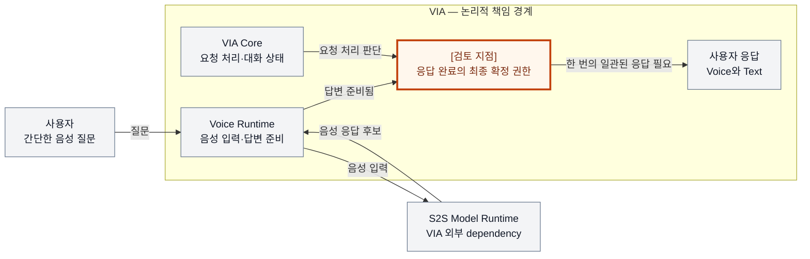
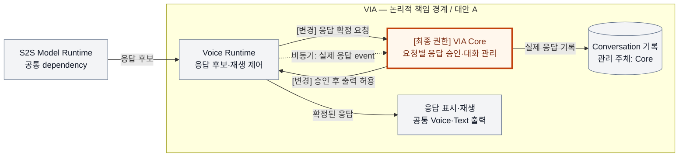
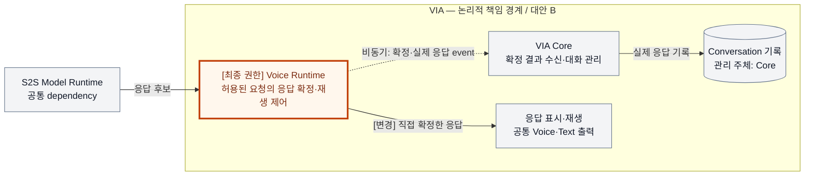

# DP 배경과 A/B 구조 그림 작성 기준

> 각 DP 상세 문서의 필수 산출물: 배경 인트로 1페이지, Mermaid 배경 그림, 같은 범위를 그린 A/B Mermaid 구조 그림, 구조 차이 요약.
>
> 이 문서의 예시는 그림 표현 방식을 보여주기 위한 축약 예시다. 특정 DP의 최종 A/B, 상호 배타성·steelman 검토 결과나 측정 결과를 확정하지 않는다. 검토 순서는 [DP 공통 검토 절차](./dp-review-protocol.md)를 따른다.

> 아래 교육용 예시의 A/B 문자는 해당 예시 안에서만 유효하다. 재구성한 [DP-04 실제 보고서](./via-dp-04-response-authority.md)는 제한적 Voice 위임을 A, 요청별 Core 승인을 B로 정의한다. 발표에 사용할 때는 해당 보고서의 최신 그림·대안 이름을 사용한다.

## 1. 독자가 이해할 순서

각 DP의 설명은 **사용자 상황 → 왜 어려운가 → 무엇을 결정해야 하는가 → A/B 구조 차이 → QA trade-off** 순서로 구성한다. 상세 대안 이름과 내부 설계를 소개하기 전에 배경 인트로를 둔다.

문서에는 검토 과정과 상세 근거도 보존한다. 발표용 설명에서는 검토를 통과한 대안을 보여주되, 아직 검토 중이라면 제목 옆에 초안임을 표시한다.

## 2. 배경 인트로 1페이지

이 내용은 발표자료에서 해당 DP와 A/B를 상세 설명하기 직전의 한 페이지로 사용할 수 있어야 한다.

| 배치 | 반드시 담을 내용 |
| --- | --- |
| 위 | DP ID·이름과, 이 문제가 필요한 이유를 드러내는 한 문장 제목 |
| 시작 설명 | 대표 사용자 상황 하나. 전문용어 없이 사용자가 무엇을 원하고 무엇을 겪을 수 있는지 설명 |
| 중앙 그림 | VIA 전체 또는 관련 영역에서 문제가 생기는 위치와 관련 주체·정보 흐름 |
| 그림 옆 설명 | 함께 만족해야 할 두 요구와 그 사이의 구조적 고민. 왜 자동으로 양립하지 않는지 설명 |
| 아래 | 설계하지 않으면 생기는 사용자 영향과, 이번 DP에서 답할 한 문장 질문 |

그림만 보아도 대상이 VIA 내부인지, Downstream Agent 또는 Model Runtime과의 경계인지 알 수 있어야 한다. 문제가 발생하는 지점에는 `[검토 지점]`을 붙인다. 아직 결정하지 않은 권한 위치를 그림에서 이미 고정하지 않는다.

배경은 특정 대안에 유리하게 작성하지 않는다. “중앙화가 필요하다”처럼 결론을 제목으로 삼지 않고, 어떤 요구가 어떤 상황에서 충돌하는지를 보여준다. QA는 관련 지표의 이름으로 짧게 연결하며, 19개 전체 표는 후속 페이지에 둔다.

### 배경 그림 예시 — 음성 응답 확정 권한

**설명용 제목:** 빠른 음성 답변과 한 번의 일관된 요청 처리를 어떻게 함께 보장할까?

사용자는 간단한 질문을 하고 즉시 답을 듣기를 기대한다. S2S가 답변을 준비하는 동안 VIA Core도 같은 요청을 처리할 수 있다. 두 영역의 완료 판단이 조율되지 않으면 중복 응답이나 대화 상태 불일치가 생길 수 있다.

이 그림의 `[검토 지점]`은 미정인 설계 질문이며 추가 Component가 아니다. 실선은 이름을 붙인 입력·정보·응답 흐름이다. Model Runtime은 VIA의 외부 책임이며 PC 내부 또는 외부에 배치할 수 있다. Downstream Agent가 참여하지 않는 직접 응답 상황만 표시했다.

**중요한 이유:** 응답을 기다리게 하면 직접 Voice 응답시간이 늘 수 있고, 조율 없이 내보내면 같은 요청의 중복 처리와 대화 기록 불일치가 생길 수 있다.

**이번에 답할 질문:** 같은 직접 응답 요청의 최종 확정 권한을 Core와 Voice Runtime 중 어디에 둘 것인가?

## 3. A/B 구조 비교 그림

각 DP에 A와 B 그림을 각각 하나 이상 둔다. 작은 그림은 좌우로 비교하고, 내용이 많으면 A·B를 별도 페이지에 동일한 틀로 배치한다. 글자를 줄여 복잡한 그림 두 개를 한 페이지에 억지로 넣지 않는다.

### 같은 틀에서 비교할 것

1. **같은 시야:** 양쪽 모두 같은 VIA 전체 또는 같은 확대 영역을 그린다. 확대 그림에는 VIA 내 위치, 입력·출력과 연결되는 공통 영역을 표시한다.
2. **같은 요소는 같은 이름:** 공통 Component·외부 dependency·상태·계약은 이름과 표현 수준을 맞춘다. 동일 책임을 A에서는 거대 박스 하나, B에서는 여러 세부 박스로 그리지 않는다.
3. **같은 배치 의도:** 같은 흐름 방향과 선언 순서를 사용한다. Mermaid의 자동 배치가 달라도 공통 요소를 이름으로 바로 대응시킬 수 있어야 한다.
4. **변경은 명시적으로:** 추가·제거·분리·통합·책임 이동·연결 변경 중 무엇이 일어났는지 표시한다. 색상만 바꾸지 않는다.
5. **최종 권한과 상태 소유자:** 누가 응답·상태 변경을 확정하는지, 무엇이 기준 기록인지 노드 또는 연결에 직접 적는다. 읽기용 복사본과 기준 상태를 구분한다.
6. **경계의 정확성:** VIA 책임 경계, Component 경계, OS Process 경계, PC·원격 경계는 각각 이름을 붙인다. `subgraph` 박스 자체가 Process 격리를 의미하지 않는다.
7. **연결의 의미:** 화살표에 요청·승인·상태 갱신·비동기 event·조회 등의 의미를 적는다. 흐름 그림과 코드 의존 방향을 한 화살표로 혼용하지 않는다.
8. **공통 비용도 보이기:** 두 안이 사용하는 공통 서비스와 저장소를 한쪽에서만 생략하지 않는다. 생략할 때에는 양쪽에 같은 축약 박스와 생략 범위를 둔다.

### 공통 시각 규칙

| 표현 | 의미 |
| --- | --- |
| 회색 노드 + 같은 이름 | 양쪽의 공통 책임 또는 dependency |
| 주황색 강조 + `[변경]` 또는 `[최종 권한]` | 그 DP가 바꾸는 책임·상태·연결 지점. A/B 모두 동일한 강조색 사용 |
| 경계 이름이 있는 묶음 | 표시한 논리·Process·실행 위치 범위. 경계 종류를 생략하지 않음 |
| 실선 화살표 + 이름 | 요청·승인·읽기·쓰기 등 표시한 기능 흐름. 동기 여부가 중요하면 별도 표기 |
| 점선 화살표 + `비동기` 표기 | 비동기 event 전달. 코드 의존성이나 불확실성을 뜻하는 데 재사용하지 않음 |

그림마다 짧은 범례와 생략 범위를 붙인다. 색상을 볼 수 없어도 텍스트·경계·연결만으로 차이를 알 수 있어야 한다. A는 녹색, B는 빨간색처럼 우열을 암시하는 표현은 사용하지 않는다.

### 구조 그림 예시 A — Core가 응답을 최종 확정

아래 두 그림은 같은 허용된 직접 응답 요청을 설명하는 축약 예시다. 실제 배포 Process와 저장 기술은 정하지 않았다. 정정·취소·장애 흐름은 생략했으며, 상세 후보에서는 별도 수명·sequence 설명으로 보충해야 한다.

회색은 공통 책임, 주황색은 최종 확정 권한이다. 실선은 이름을 붙인 기능 흐름, 점선은 비동기 event다. VIA 박스는 논리 경계이며 한 Process를 뜻하지 않는다. 입력·정책 상세와 Agent 경로는 양쪽에서 동일하게 생략했다.

### 구조 그림 예시 B — Voice Runtime이 응답을 최종 확정

회색은 공통 책임, 주황색은 최종 확정 권한이다. 실선은 이름을 붙인 기능 흐름, 점선은 비동기 event다. VIA 박스는 논리 경계다. A의 요청별 Core 승인 왕복이 없어지고 확정 결과 전달 계약이 바뀐다. 입력·정책 상세와 Agent 경로는 A와 동일하게 생략했다. 두 그림에서 공유하는 이름은 같은 책임 영역을 뜻하며, 그 내부의 변경 책임은 노드 설명과 아래 표로 구분한다.

### 그림 직후의 구조 차이 요약

그림을 본 뒤 독자가 차이를 추측하지 않도록 짧은 비교표를 붙인다.

| 비교 항목 | A | B |
| --- | --- | --- |
| 공통 부분 | S2S, Voice Runtime, VIA Core, Voice·Text 출력, Conversation 기록 | 동일한 책임 영역 유지 |
| 최종 확정 권한 | Core | 허용된 요청에 대해 Voice Runtime |
| 출력 전 필수 경로 | Voice → Core 승인 → Voice 출력 | Voice가 직접 확정 → 출력 |
| Core에 전달하는 계약 | 승인 요청과 실제 응답 event | 확정 결과와 실제 응답 event |
| 유지되는 상태 책임 | Core가 Conversation 기록 관리 | 동일 |

이 예시는 권한과 필수 경로가 달라지는 모습을 보여준다. 이 차이가 실제 QA에 얼마나 영향을 주는지는 양쪽의 검증·상태 연결·실패 처리까지 설계한 뒤 사고실험 표에서 설명한다. 짧은 화살표만으로 빠름·정확함을 확정하지 않는다.

## 4. DP 성격에 맞는 추가 그림

모든 DP에 배경 그림과 A/B 구조 그림은 필요하다. 차이가 시간·상태·복구에서 나타나는 DP는 다음 중 필요한 것을 추가한다.

| 드러내야 할 차이 | 적합한 Mermaid 그림 |
| --- | --- |
| 책임 배치·계약·의존 연결·Process 경계 | `flowchart`와 경계별 `subgraph` |
| 승인·비동기 결과·취소·늦은 event의 처리 순서 | `sequenceDiagram`. A/B에 같은 사건 순서·참여자 이름 사용 |
| 상태의 확정·정정·취소·재시작 전이 | `stateDiagram-v2`. 전이를 발생시키는 사건과 확정 주체 표시 |

하나의 구조 그림에 모든 정상·오류·복구 화살표를 겹치지 않는다. 정상 경로와 구조를 먼저 보여주고, 결정의 핵심인 비동기 또는 장애 상황은 별도 그림으로 펼친다. Sequence만으로 Component 소유·Process 배치 차이 설명을 대신하지 않는다.

## 5. 그림 검토 완료 기준

1. 배경 한 페이지를 보고 “왜 이 결정을 고민하는가”와 사용자 영향을 설명할 수 있다.
2. VIA 전체에서의 위치와 확대 범위, 내부·외부 책임이 구분된다.
3. A/B 공통 부분이 이름과 표현 수준으로 대응하며 달라지는 구조가 직접 표시된다.
4. 핵심 권한·상태 소유·계약·실행 경계가 상세 문서와 일치한다.
5. 그림에서 보이는 결정 규칙으로 두 대안의 상호 배타성을 설명할 수 있다.
6. 같은 영역의 내부 책임이 달라지면 영역 이름이 같아도 그 변경을 숨기지 않는다. 색상만으로 의미를 전달하지 않는다.
7. QA 표의 원인 설명을 그림의 특정 노드·경계·연결과 이어 설명할 수 있다.
8. 실제 사용할 Markdown/Mermaid 또는 발표 렌더링에서 글자 겹침·잘림·과도한 화살표 교차·축소 가독성을 확인한다. 소스·링크 검사와 시각 검증을 구분해 기록한다.

Mermaid 원문을 문서에 보존한다. 발표용으로 이미지로 내보낼 때에도 DP와 후보 version을 맞추고, 문서·그림·QA 표가 서로 다른 대안을 설명하지 않도록 함께 갱신한다.

전체 적용에서 넓은 단일 행 때문에 축소되던 그림은 세로 흐름으로 바꾸고, `subgraph`의 의도한 방향도 명시했다. 비동기 순서 그림에서는 양쪽의 병렬 준비 기회를 보존한다. 정상적인 병렬 승인을 본문에서 허용하면서 그림만 직렬로 그리는 식으로 상대안을 약화하지 않는다.

## 6. 현행 보고서의 구현 상세 수준

위 축약 예시는 표현 교육용이며 완료된 DP 그림을 대체하지 않는다. 현재 VIA-DP의 A/B는 Component·Process·message 수준으로 그린다. 변경은 색상 대신 [변경] 텍스트만으로 표시해도 된다. 같은 이름은 같은 공통 책임을 뜻한다.

- 메모리 inbox·bounded queue·audio buffer와 디스크 상태·outbox를 별도 노드로 구분한다. queue 수락을 commit으로 읽히게 하지 않는다.
- 메시지에는 command/revision, snapshot/ref, event/ACK 등 실제 계약 의미를 표시하고 반환·확정 순서를 본문 번호와 대응한다.
- Process 경계와 논리 책임을 구분한다. Process 배치가 해당 DP의 선택이 아니면 양쪽 동일한 비교용 가정으로 표시한다. 외부 Agent Runtime과 VIA Client worker는 다른 주체다.
- S2S 1개와 semantic LLM 1개의 공유 dependency를 표시한다. 반복 호출/세션을 모델 복제처럼 그리지 않는다. 경로상 모델이 참여하지 않으면 공통 생략이라고 설명한다.
- bus·broker·queue가 설계상 실제 필요할 때만 그린다. message bus 제품 선택과 authority 선택을 묶지 않는다. 정상 흐름과 늦은 결과·재연결·취소·장애를 본문에서 완결한다.
