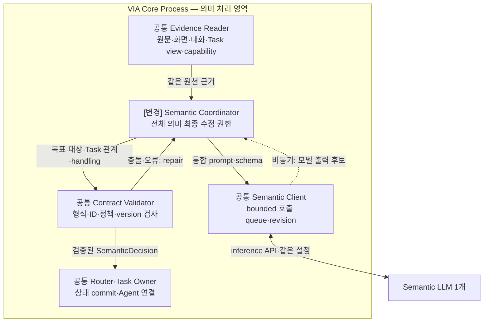
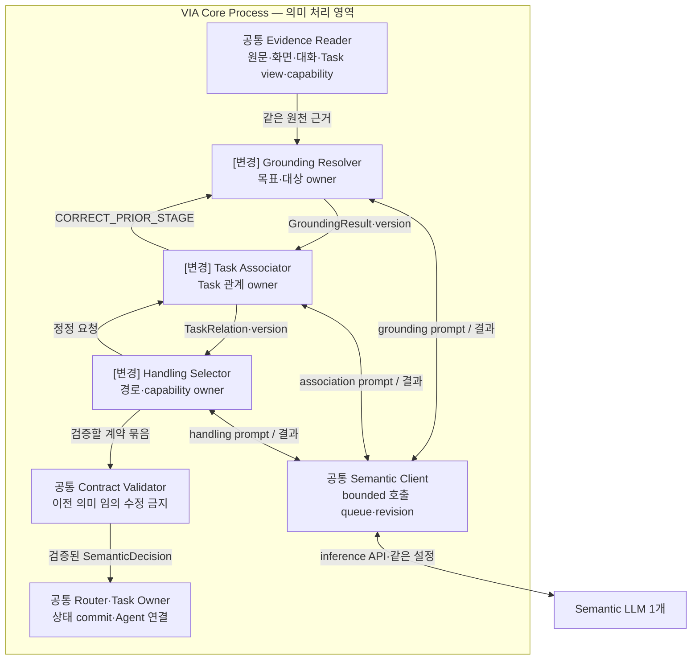
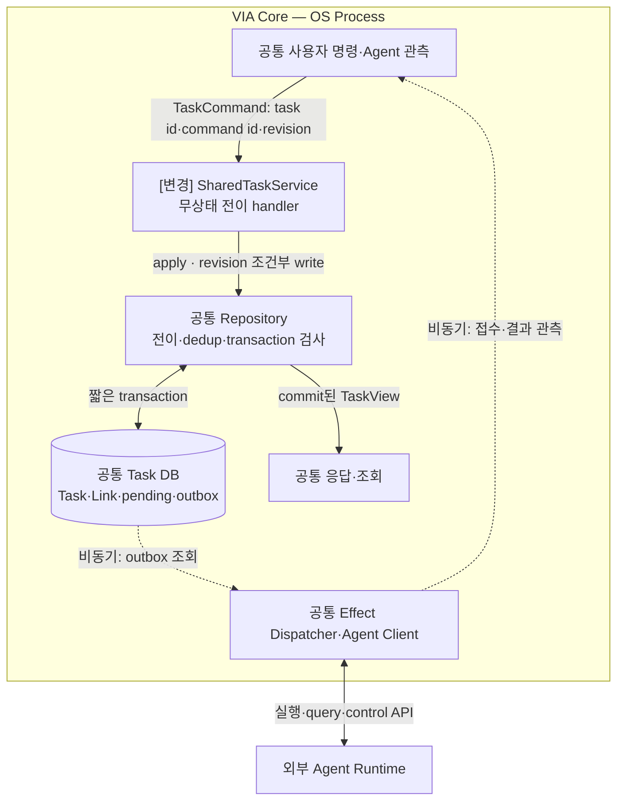
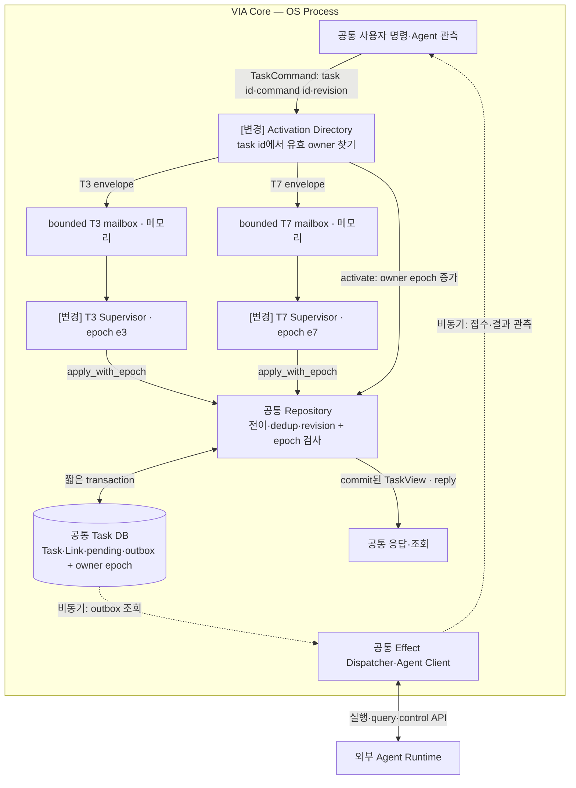
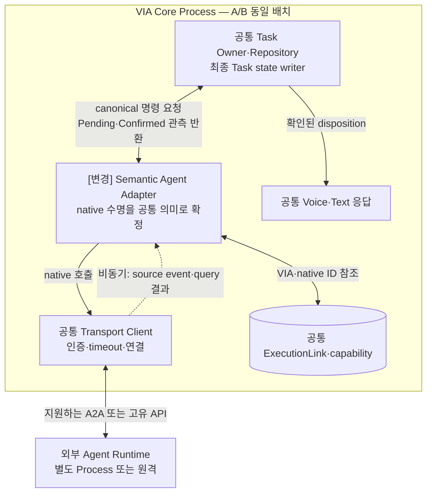
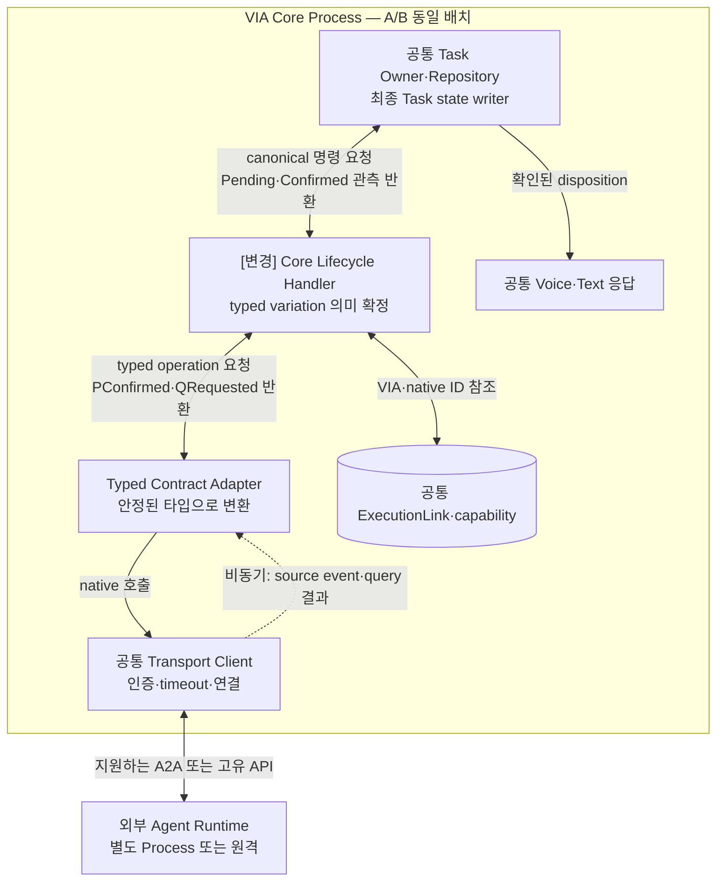
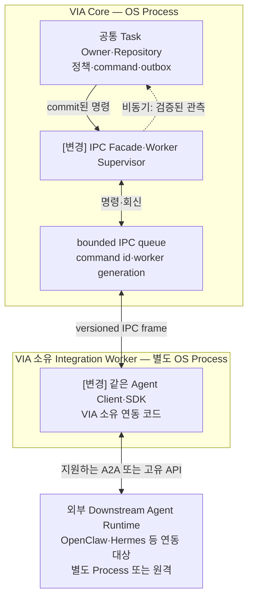
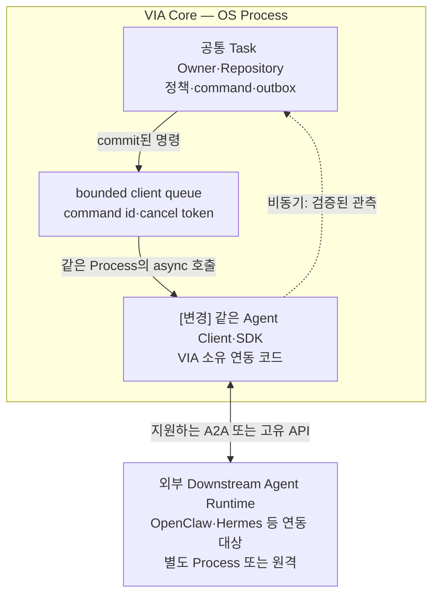

# VIA Architecture Decision — 전체 후보 요약 보고서

> 2026-09-26 · 전수 정리·구현 구조 명세·DP–QA 지도 · 최종 선정/실측 아님

## 1. 결론부터

**현재 관리 대상은 VIA-DP-01~18, 총 18개다.** 기존 13개를 상세화하고 Task writer를 14로 편입했다. 이전 계열 대조에서 빠졌던 관측 확정·모델 입력 이력·Source 변환·사용 권한 질문을 15~18로 보완했다. 모두 심화 검토할 수 있게 보존하며 최종 발표용 순위·DP 4~5개·ASR 4~6개는 아직 선정하지 않는다.

보고서를 읽으면 어떤 Component가 어떤 요청을 받고, 어느 상태를 소유하며, 어떤 queue·buffer·저장·Process 경계를 통과하는지 알 수 있어야 한다. 아래 네 영역은 전체 시스템을 설명하는 **읽기 순서**이며 추천 순위가 아니다. 나머지 14개도 독립 보고서로 같은 수준의 A/B 구현도·전체 QA 표를 제공한다.

DP와 QA의 연결은 [관련성 지도](#dp-qa-coverage), A/B 비교에 사용할 차이 가설은 [차이 가능성 지도](#ab-qa-difference)에서 확인한다.

## 2. 바뀌지 않는 시스템 경계

VIA가 Voice/Text/화면 interaction·요청 의미·Conversation/Task·위임과 결과 연결을 소유한다. Downstream Agent가 도메인 계획·Tool 실행을 한다. OpenClaw·Hermes 같은 외부 Runtime은 VIA Client와 다른 Process 또는 원격 서비스다.

**VIA 모델은 S2S 1개와 semantic LLM 1개다.** 단계·Component·Task가 늘어도 모델을 추가 적재하지 않는다. 각 역할은 다른 prompt·schema·세션을 사용할 수 있지만 같은 모델 용량을 공유한다. 모델 수와 호출 수·프로세스 수를 혼동하지 않는다.

그림의 Core Process는 각 DP를 비교하기 위한 공통 참조 배치이며 최종 전역 배치 승인이 아니다. VIA-DP-11만 지정된 Client 코드의 Process 경계를 바꾼다. queue는 메모리 대기, 원통은 영속 기록이다. 별도 메시지 버스 제품은 가정하지 않는다.

## 3. 전체 질문 한눈에 보기

| 독립 보고서 | 대안 A | 대안 B |
| --- | --- | --- |
| [VIA-DP-01 범위가 정해진 정보 처리의 책임 경계](./via-dp-01-direct-handling.md) | 선택적 직접 처리 + Agent 위임 | 정보 처리 실행의 Agent 일원화 |
| [VIA-DP-02 대화와 Task 관계의 확정 경계](./via-dp-02-state-consistency.md) | 분리된 처리 책임 + 공동 원자 커밋 | 독립 상태 확정 + 관계 조정 |
| [VIA-DP-03 음성 입력 근거의 최종 기준](./via-dp-03-voice-evidence.md) | VIA 입력 계약 + 비모델 정렬·정규화 | S2S 입력 계약을 기준으로 사용 |
| [VIA-DP-04 S2S 직접 응답의 게시 권한](./via-dp-04-response-authority.md) | 한정 권한 위임 + 범위 밖 Core 승인 | 모든 직접 응답에 Core 요청별 승인 |
| [VIA-DP-05 요청 Context의 읽기 집합 확정 계약](./via-dp-05-context-contract.md) | 불변 입력 명세 + 필요한 값만 지연 적재 | 범위 제한 조회 권한 + 처리 중 입력 확장 |
| [VIA-DP-06 요청 의미의 최종 확정 권한](./via-dp-06-semantic-authority.md) | 단계별 보조 처리 + 통합 최종 확정 | 단계별 의미 권한 + 명시적 정정 계약 |
| [VIA-DP-07 복합 요청 관계의 실행 책임](./via-dp-07-compound-orchestration.md) | VIA 관계 조정 + 가능한 부분의 묶음 위임 | 복합 업무 전체의 Agent 조정 |
| [VIA-DP-08 재시작 후 상태의 기준 기록](./via-dp-08-recovery-source.md) | 상태 변경 이력 + 검증된 checkpoint | 현재 상태 + 미완료 동작 + 감사 이력 |
| [VIA-DP-09 Agent 수명 계약의 의미 해석 위치](./via-dp-09-agent-semantics.md) | 공통 의미 정규화 + 손실 없는 확장 | 공통 전송·타입 계약 + Core 유형별 의미 확정 |
| [VIA-DP-10 Model 세션·연결 수명의 관리 권한](./via-dp-10-model-session-authority.md) | 공통 세션 관리자 + 역할별 직접 stream | 역할별 세션 소유 + 공통 adapter library |
| [VIA-DP-11 외부 연동 코드의 Process 장애 경계](./via-dp-11-process-isolation.md) | 위험 연동 격리 + 얇은 Core 연결부 | 같은 Process + 제한된 queue·실패 처리 |
| [VIA-DP-12 응답 게시와 실행 근거의 영속 확정 순서](./via-dp-12-evidence-commit.md) | 최소 근거 선확정 + 상세 자료 비동기 수집 | 게시와 영속 기록의 비동기 분리 |
| [VIA-DP-13 사용자 제어를 위한 실행 자원을 예약할 것인가](./via-dp-13-control-reservation.md) | 제어 여력 예약 + 회수 가능한 유휴 자원 공유 | 전체 자원 공유 + 우선순위 기반 제어 우대 |
| [VIA-DP-14 Task 상태 전이의 소유권](./via-dp-14-task-state-authority.md) | 공유 transactional Task 서비스 | Task별 단일 writer supervisor |
| [VIA-DP-15 Agent 상태를 확정하는 관측 경로](./via-dp-15-agent-observation-authority.md) | 유효 event 확정 + query 복구 | Event 알림 + query 확인 후 확정 |
| [VIA-DP-16 모델 입력 이력의 구성·유지 책임](./via-dp-16-model-context-state.md) | 요청별 재구성 + version 검증 cache | 증분 working context + 필요 시 재구성 |
| [VIA-DP-17 Source를 소비 가능한 Context로 만드는 책임](./via-dp-17-context-materialization-authority.md) | 공통 materializer + 소비자별 projection | 공통 접근 handle + 소비자 소유 변환 |
| [VIA-DP-18 보호정보·Action 사용 시 권한을 확인하는 위치](./via-dp-18-authorization-enforcement.md) | 사용마다 중앙 승인 + 사전 준비 cache | 철회 가능한 capability + 로컬 use gate |

## 4. 네 중심 영역의 실제 동작

아래는 상세 보고서의 A/B 구현 설명을 같은 의미로 옮긴 것이다. 차이가 없는 비용도 양쪽에 보이며 LLM 출력은 상태 변경 권한이 아니다. 제품 구현·QA 측정이 완료된 그림은 아니다.

### 4.1 VIA-DP-06 — 요청 의미 이해

같은 사용자의 대상·Task·처리 경로가 서로 영향을 줄 때 전체를 한 owner가 고칠지 단계별 owner가 고칠지 결정한다. 정확도는 QA-12와 통합 QA-11, 실제 호출 graph는 QA-01/02/05, 변경 계약은 QA-22로 확인한다. 통합이 항상 정확하거나 분리가 항상 수정하기 쉽다고 단정하지 않는다.

#### 대안 A — 단계별 보조 처리 + 통합 최종 확정

필요한 grounding·Task 검색·capability 조회를 모듈이나 보조 단계로 나눌 수 있지만 하나의 semantic authority가 최종 의미 묶음을 일관되게 확정한다. 부분 cache·병렬 조회·특정 항목 재계산도 허용한다. 모듈성과 공동 판단을 결합한 hybrid다.

최종 확정자는 서로 모순된 보조 결과를 조정하고 clarification을 선택한다. 강점은 관련 의미를 함께 볼 수 있다는 것이며, 약점은 최종 schema·검증·판단 규칙의 결합이다. 단일 호출·단일 거대 prompt를 필수 조건으로 삼지 않는다.

**실제 호출·상태·실패 처리 순서**

1. Evidence Reader가 원문과 관측 가능한 화면·Task 후보·capability를 준비한다. Coordinator가 통합 프롬프트로 공유 semantic LLM에 요청한다. 평가 정답인 문서·Task ID를 입력에 넣어 주지는 않는다.
2. 모델은 ‘대상 D7, 기존 Task T3, 위임, doc_edit 필요’ 같은 묶음을 제안한다. Coordinator는 서로 모순된 항목을 함께 재판단할 권한이 있다. Validator는 schema·ID·정책·현재 revision을 검사하며 업무 의미를 대신 지어내지 않는다.
3. READY만 Task Owner에 전달한다. NEED_CONTEXT는 근거 보완, CLARIFY는 사용자 질문, 오류는 제한된 repair다. 모델은 Task DB에 쓰지 않는다. 보조 호출을 나눠도 전체 의미 수정 권한은 Coordinator에 남는다.

보조 단계 수가 아니라 최종 의미 묶음을 누가 수정·확정하는지가 A의 식별 규칙이다.

#### 대안 B — 단계별 의미 권한 + 명시적 정정 계약

grounding/refinement, Task association, handling/capability 선택이 각자의 의미 계약을 확정한다. 후속 단계는 앞 결과가 틀리거나 부족하면 정정 요청을 보내 해당 권한자가 새 version을 만들게 한다. 최종 validator는 계약 조합의 유효성을 검사하지만 임의로 앞 의미를 다시 결정하지 않는다.

각 단계는 필요한 근거에 집중하고 독립 교체·부분 재실행할 수 있다. 공통 모델·prompt fragment·검증 library를 공유할 수 있다. 그러나 후속 정보로 앞 판단을 바꿀 때 version 연결과 재개 규칙이 필요하며, schema를 통과한 의미 오류가 자동으로 사라지지는 않는다.

**실제 호출·상태·실패 처리 순서**

1. Grounding은 목표·대상, Association은 기존/신규 Task 관계, Handling은 처리 경로를 정한다. 세 Component는 각기 다른 프롬프트로 **같은 LLM**을 호출한다. Reader의 원천 근거는 필요한 각 단계에 제공하며 앞 단계 요약만으로 정보 손실을 강제하지 않는다.
2. 후속 단계가 ‘D7과 T3가 맞지 않음’을 발견하면 앞 결과를 덮지 않고 원 owner에 CORRECT_PRIOR_STAGE를 보낸다. 새 version이 오면 영향받은 후속 단계만 재개한다. 모델 응답은 call ID·request revision으로 원 호출자에 반환한다.
3. Validator가 조합을 검사한 뒤 공통 Router에 전달한다. 최소 예시는 A 1회·B 3회 호출일 수 있지만 고정 정의는 아니다. 양쪽 fast path·cache·부분 repair를 허용하고 실제 공유 모델 대기를 포함한다.

그림은 의존관계를 드러내는 대표 경로다. 독립 조회의 병렬화와 필요 없는 단계 생략을 금지하지 않는다.

### 4.2 VIA-DP-14 — Task 상태 관리

같은 Task의 취소와 완료가 교차할 때 write를 조정하는 책임이다. QA-01/03/05의 queue·충돌 비용, QA-13/14의 정확성, QA-22와 QA-31을 확인한다. 같은 DB mutex가 양쪽에 있으므로 B가 자동 병렬·복구 우세인 것은 아니다.

#### 대안 A — 공유 transactional Task 서비스

TaskService의 무상태 handler가 명령마다 저장소 revision을 확인하고 전이를 수행한다. Task별 준비·분할 queue·짧은 transaction을 허용하므로 전역 직렬 서비스가 아니다. 소유자 활성화 없이 호출할 수 있지만 동시 갱신 충돌의 재시도 책임이 남는다.

**실제 호출·상태·실패 처리 순서**

1. 같은 TaskCommand를 SharedTaskService.apply에 보낸다. Repository가 command 중복·expected revision·허용 전이를 검사하고 상태와 효과를 commit한다. 중복 명령은 보존한 결과를 반환한다.
2. 충돌한 handler는 최신 상태를 읽고 같은 사용자 의도에 맞게 재검토한다. 이미 완료됐으면 취소 완료라고 덮지 않는다. Task별 준비는 병렬일 수 있지만 실제 DB write 제약은 그대로다.
3. Dispatcher는 commit 뒤 외부 호출하고 결과를 새 관측 command로 돌려보낸다. 재시작 시 기존 명령·Link·outbox로 복구한다. Agent나 LLM 응답을 transaction 안에서 기다리지 않는다.

#### 대안 B — Task별 단일 writer supervisor

각 Task에 활성 owner 하나와 메모리 mailbox를 둔다. 같은 Task의 command는 그 owner가 순서대로 처리하고 Repository가 epoch를 검사한다. 공통 전이 library·저장소·지연 활성화를 허용한다. Task별 순서와 수명 경계가 명시적이지만 registry·mailbox·fencing 계약이 추가된다.

**실제 호출·상태·실패 처리 순서**

1. Directory가 Task ID의 sender를 찾는다. 없거나 종료됐으면 Repository.activate로 새 epoch를 저장하고 supervisor와 bounded mailbox를 만든다. 현재 구조 코드의 mailbox 용량 64는 구현값이지 제품 요구가 아니다.
2. Supervisor가 한 envelope씩 apply_with_epoch를 수행하고 commit 뒤 caller의 reply 채널로 결과를 반환한다. **mailbox 자체는 영속 queue가 아니다.** caller는 응답 소실 시 같은 command ID로 재시도하고 Repository가 중복 효과를 막는다.
3. 재활성화 이전 epoch의 늦은 writer는 거부한다. 외부 응답은 mailbox에서 기다리지 않고 Dispatcher의 후속 command로 받는다. T3와 T7은 같은 코드의 인스턴스이며 모델도 DB도 Task별로 복제하지 않는다.

### 4.3 VIA-DP-09 — 이기종 Agent 통합

외부 Agent의 취소 접수와 실제 종료를 어디에서 공통 의미로 바꾸는가다. QA-21 변경 영향이 직접적인 질문이다. QA-01/03/05 및 QA-11/13/14는 같은 의미·검사·배치라면 비슷할 수 있다. 관련성이 있다는 이유로 반대 방향 우세를 만들지 않는다.

#### 대안 A — 공통 의미 정규화 + 손실 없는 확장

연동 경계의 의미 adapter가 provider별 수명을 공통 operation·observation으로 바꾼다. unsupported·pending·source-confirmed·artifact 조회 참조를 명시하며, 필요한 확장 정보와 native provenance를 함께 보존한다. Core는 이 공통 의미를 소비한다.

최선의 A는 최소 공통분모로 기능을 깎지 않는다. 새 개념이 공통 계약으로 표현되지 않으면 version을 확장하고 소비자를 함께 검토한다. Adapter가 Task state를 직접 쓰거나 source revision을 만들어내지는 않는다. 강점은 provider 차이의 경계 집중이며 약점은 의미 adapter의 계약 유지 책임이다.

**실제 호출·상태·실패 처리 순서**

1. Task Owner의 cancel을 Adapter가 외부 호출로 변환한다. Client는 인증·연결·timeout을 처리한다. event가 있으면 수신하고 필요한 경우 지원되는 query로 확인한다.
2. 예시 P의 종료 확인은 CancelConfirmed, Q의 취소 접수는 CancelPending으로 Adapter가 해석한다. P/Q는 설명용 fixture이며 특정 제품의 API 지원 주장이 아니다. 필요한 확장·원천 근거를 보존한다.
3. Task를 쓰는 것은 Owner다. 늦은 completion도 사실대로 반영한다. 별도 message bus·추가 LLM 없이 결정적 변환 코드로 구현할 수 있다.

공통 형식은 기능을 지우는 형식이 아니다. 사실·미지원·확장 의미를 보존해야 같은 기능 비교가 된다.

#### 대안 B — 공통 전송·타입 계약 + Core 유형별 의미 확정

연동 경계는 인증·전송·wire 형식을 변환하고 provider-neutral typed variation을 전달한다. Core의 제한된 capability handler가 follow-up·cancel·status mode를 해석한다. 다른 Core 모듈에는 provider SDK를 노출하지 않는다.

공통 handler library와 공통 Task invariant를 허용한다. 새 capability 의미를 Core가 명시적으로 다루기 쉽다는 채택 이유가 있지만, 이것이 A에서는 표현 불가능하다는 뜻은 아니다. Typed contract와 그 소비 handler의 변경 책임이 남는다.

**실제 호출·상태·실패 처리 순서**

1. 같은 Client를 쓴다. Typed Adapter는 wire를 타입으로 바꾸지만 취소 완료 여부의 최종 의미는 Core Handler가 정한다.
2. 제한된 Handler가 PConfirmed/QRequested를 Task 의미로 바꾸어 Owner에 전달한다. provider SDK를 UI·대화·Task 모듈 전체에 노출하는 구조가 아니다.
3. 명령·재연결에도 같은 경계를 쓴다. 공통 library·extension·provenance는 양쪽에 허용한다. 위치 차이만으로 속도·정확도 우세를 만들지 않고 QA-21의 실제 변경 전파를 비교한다.

B의 차이는 Core 전체에 native 데이터를 흩뿌리는 것이 아니라 제한된 handler가 수명 의미를 소유한다는 것이다.

### 4.4 VIA-DP-11 — VIA Client 실행 경계

격리 대상은 VIA가 작성하거나 탑재하는 Client·SDK다. 외부 Agent는 A/B 모두 밖에서 실행한다. VIA Client의 실제 fatal 위험이 확인될 때 QA-32와 정상 전달 시간의 비교가 성립한다. 외부 Agent crash나 가정한 모델 복제를 이점으로 쓰지 않는다.

#### 대안 A — 위험 연동 격리 + 얇은 Core 연결부

외부 연동 실행 코드를 supervised worker Process에 두고 Core에는 검증·연결용 얇은 facade와 상태 authority를 남긴다. 모든 VIA를 무조건 여러 Process로 쪼개지 않는 hybrid다. 공유 메모리·batch·작은 제어 message·warm worker를 허용한다.

Worker generation·in-flight 명령·source identity를 관리하고, worker가 죽으면 새 generation을 만들고 외부 실행 사실을 확인한다. 장점은 대상 연동의 fatal failure가 Core의 메모리·음성 제어를 직접 파괴하지 않는다는 것이다. 약점은 IPC 계약·추가 Runtime·끊긴 전달의 불확실성이다.

**실제 호출·상태·실패 처리 순서**

1. Core가 명령을 영속 저장하고 Facade가 command ID·worker generation을 붙여 IPC로 보낸다. bounded IPC queue는 전달 대기 공간이며 durable outbox를 대체하지 않는다.
2. **Worker는 VIA의 Agent Client/SDK를 실행하며 외부 Agent 자체를 실행하지 않는다.** Client가 외부 Runtime의 지원 API에 접속한다. A2A 지원 여부는 실제 profile로 확인한다.
3. Worker 종료 시 재시작하고 in-flight 명령은 외부 ID로 확인한다. 외부 Agent 자체의 crash는 B에서도 외부 경계의 문제다. 차이를 만드는 fault는 VIA Client의 잡을 수 없는 fatal failure다.

이 그림의 두 경계는 실제 OS Process다. Worker를 나눴다는 이유로 외부 Action이 exactly-once가 되지는 않는다.

#### 대안 B — 같은 Process + 제한된 queue·실패 처리

동일 연동 코드를 Core와 같은 OS Process에서 실행한다. 별도 task·thread, bounded queue, timeout·cancellation, 안전한 메모리 접근과 잡을 수 있는 예외 처리로 논리적으로 격리한다. Core 잠금을 잡고 외부 API를 기다리지 않는다.

같은 주소 공간의 직접 호출·buffer 공유로 IPC와 별도 worker 수명을 피하는 강한 안이다. 정상 예외를 모두 Core crash로 만드는 비교는 하지 않는다. 다만 Process abort나 잡을 수 없는 fatal failure가 실제로 발생하면 논리 queue가 Core를 살려주지는 못한다.

**실제 호출·상태·실패 처리 순서**

1. 같은 Client·명령·outbox를 Core Process의 async queue로 연결한다. 별도 IPC frame·Worker Supervisor가 없다. 외부 응답을 기다리며 DB transaction을 잡지 않는다.
2. ‘같은 Process’는 VIA Client의 배치다. OpenClaw·Hermes Runtime을 VIA 안에 embed한다는 뜻이 아니다. timeout·일반 오류는 해당 호출의 실패로 처리한다.
3. 잡을 수 없는 Client fatal은 Core까지 종료시킬 수 있다. 그러나 해당 코드·fault가 제품에 실제로 필요한지 미확인이라면 QA-32의 큰 이점이나 핵심 DP 지위를 단정하지 않는다.

Thread·mailbox 격리는 정상 정지·예외를 제한할 수 있지만 주소 공간이 같은 fatal 종료 경계는 유지된다.

## 5. 전체 책임 지도와 DP 사이의 경계

Context는 05(읽기 집합)·16(이력 유지)·17(값 변환)로, 비동기 상태는 02(교차 commit)·08(복구 원본)·15(관측 확정)로 읽는다. Voice는 03(입력 근거)·04(게시)·10(세션)·13(자원), 실행 범위는 01·07, 실행 근거는 12, protected use는 18에서 다룬다. 이 배치는 관심사 지도이지 작은 DP는 중요하지 않다는 판단이 아니다.

| 책임 영역 | 질문과 담당 VIA-DP |
| --- | --- |
| 입력·화면 근거 | 03 입력 revision의 의미 계약 |
| Context | 05 읽기 집합의 확장 권한, 17 source 값 변환 owner, 16 모델 입력 이력 유지 |
| 요청 이해·실행 범위 | 06 의미 확정, 01 bounded 직접 실행, 07 명시된 복합 관계 실행 |
| 대화·Task 상태 | 02 교차 관계 commit, 14 Task writer, 08 복구 원본 |
| 외부 Agent | 09 수명 의미 해석, 15 상태 확정 근거 |
| 모델·사용자 응답 | 10 세션 수명, 04 게시 승인 |
| 권한·실행 경계 | 18 protected use 승인, 11 VIA Client Process, 13 제어 여력 |
| 연구 기록 | 12 게시 전 실행 근거의 영속 확인 |

### 겹쳐 보이지만 다른 결정

- **02 vs 14:** 여러 상태의 관계를 함께 commit하는가 vs 한 Task에 누가 쓰는가.
- **05 vs 17 vs 16:** 어떤 source를 읽을 수 있는가 vs 값을 누가 만드는가 vs 대화 이력을 어떻게 유지하는가.
- **09 vs 15:** Agent 사건의 의미를 어디서 해석하는가 vs event 자체로 상태를 확정할 수 있는가.
- **04 vs 18:** 응답 게시 권한 vs 보호정보·Action의 사용 권한.
- **10 vs 11 vs 13:** 모델 세션 권한 vs VIA Client의 Process 경계 vs 일반 작업의 제어 자원 점유 권한.
- **08 vs 12:** 운영 상태 복구의 원본 vs 사용자 응답 전 연구 근거의 기록 완료 의무.

이 독립 축들은 같은 제품에서 조합할 수 있다. 한 DP의 A/B를 같은 조건의 최종 권한으로 동시에 채택할 수 있다는 뜻은 아니다.

## 6. QA와 최종 선정은 분리한다

현재 19개 single-metric QA를 모든 보고서에서 검토했다. 최종 보고서에는 Responsiveness·Accuracy·Modifiability를 포함하되 각 계열 최대 2개라는 사용자 방향을 유지한다. 아직 구체 ASR 묶음을 고정하지 않는다. QA-11과 QA-12~15를 독립 성공 점수처럼 합산하지 않는다.

QA-41은 삭제하지 않지만 메모리 상한 요구와 중요한 구조 차이가 미확인이라 핵심 ASR 우선 추천에서 제외한다. QA-32는 VIA Client fatal 위험, QA-61은 실제 기록 유실 구간처럼 구체 인과를 확인해야 한다. QA-51은 기존 metric과 권한 gate를 유지하며 범위를 확대하지 않는다.

### 6.1 DP–QA 관련성 지도 — 무엇을 함께 검토해야 하는가?

**관련성이 있다는 것과 A/B의 품질 차이가 있다는 것은 다르다.** 첫 지도는 설계 검토 대상을, [두 번째 지도](#ab-qa-difference)는 현재 사고실험에서 차이를 예상할 근거가 있는 대상을 보여준다. 여기서 ‘성능’은 속도만이 아니라 정확도·변경 범위·복구·기록 등 각 QA의 단일 metric 결과를 뜻한다.

기준은 2026-09-26의 VIA-DP-01~18 각 §6 사고실험과 §7 전체 QA 표다. 아래 DP 이름은 §3의 정식 제목을 줄인 것이며, 행 이름을 누르면 해당 보고서로 이동한다. 각 지도는 **DP 18개 행 × QA 19개 열의 단일 표**다. 두 표의 행·열 순서는 동일하며, 가로로 스크롤하면 모든 QA를 이어서 볼 수 있다. 측정 결과는 모두 **NOT_RUN**이다.

열 이름은 [현행 QA의 단일 metric](../08-quality-attributes/quality-model.md#3-active-draft-qa-catalog)을 줄인 것이다. QA-01은 Agent 실행시간을 제외한다. QA-21~23은 해당 변화 한 건당 변경 설계 요소의 평균 수이며, QA-32는 필수 의존 범위를 넘어 불필요하게 중단된 기능·Task 수다. QA-51은 총 전달량이 아니라 필요 이상의 보호정보 노출, QA-62는 모델 답 재생성이 아니라 저장 근거로 평가 결과를 다시 만드는 능력이다.

- **● 구조 관련:** 이 DP가 바꾸는 경로·책임·계약에 연결되어 효과, 기능 적합성 또는 필수 정확성·보존 조건을 직접 확인할 QA다. 차이가 없을 수도 있고, 비교 조건부터 정해야 할 수도 있다.
- **· 공통 확인:** 고정된 다른 책임의 회귀 항목이거나 해당 경로에 이 DP가 참여하지 않는다. 미검토·중요하지 않다는 뜻이 아니다. 비참여 경로를 독립 A/B 표본으로 복제하지 않는다.

예를 들어 DP-14의 QA-14는 Task 상태 소유자를 바꿔도 올바르게 수렴하는지 확인하므로 ●다. 하지만 양쪽에 같은 version·중복 제거·terminal 규칙을 적용하면, 어느 쪽이 더 정확하다는 근거는 아직 없다. 따라서 두 번째 지도에서는 차이 항목으로 체크하지 않는다.

| VIA-DP · 질문 요약 | QA-01 위임 처리 | QA-02 직접 응답 | QA-03 상태 전달 | QA-04 음성 중단 | QA-05 Task 제어 | QA-11 전체 처리 | QA-12 의미 해석 | QA-13 Task 연결 | QA-14 상태 수렴 | QA-15 연속성 | QA-21 Agent 변경 | QA-22 Model·Context ·State 변경 | QA-23 실험·로그 변경 | QA-31 Task 복구 | QA-32 장애 전파 | QA-41 PC 메모리 | QA-51 초과 노출 | QA-61 trace 완전성 | QA-62 평가 재현 |
| --- | :---: | :---: | :---: | :---: | :---: | :---: | :---: | :---: | :---: | :---: | :---: | :---: | :---: | :---: | :---: | :---: | :---: | :---: | :---: |
| [01 직접 처리 범위](./via-dp-01-direct-handling.md) | ● | ● | · | · | ● | ● | · | ● | ● | ● | · | ● | ● | ● | · | ● | ● | · | · |
| [02 대화–Task 확정](./via-dp-02-state-consistency.md) | ● | ● | ● | · | ● | ● | · | ● | ● | ● | · | ● | ● | ● | · | ● | · | · | · |
| [03 음성 입력 근거](./via-dp-03-voice-evidence.md) | ● | ● | · | · | ● | ● | ● | · | · | ● | · | ● | ● | ● | · | ● | ● | ● | · |
| [04 직접 응답 승인](./via-dp-04-response-authority.md) | · | ● | · | · | · | ● | ● | ● | · | ● | · | ● | ● | · | · | ● | · | ● | · |
| [05 Context 읽기 집합](./via-dp-05-context-contract.md) | ● | ● | ● | · | ● | ● | ● | · | · | ● | · | ● | ● | ● | · | ● | ● | ● | ● |
| [06 의미 확정 권한](./via-dp-06-semantic-authority.md) | ● | ● | ● | · | ● | ● | ● | · | · | · | ● | ● | ● | ● | · | ● | · | · | · |
| [07 복합 요청 실행](./via-dp-07-compound-orchestration.md) | ● | · | ● | · | ● | ● | · | ● | ● | ● | ● | ● | ● | ● | · | ● | · | ● | · |
| [08 복구 기준 기록](./via-dp-08-recovery-source.md) | ● | ● | ● | · | ● | ● | · | ● | ● | ● | · | ● | · | ● | · | ● | · | · | · |
| [09 Agent 의미 해석](./via-dp-09-agent-semantics.md) | ● | · | ● | · | ● | ● | · | ● | ● | ● | ● | · | ● | · | · | · | · | ● | · |
| [10 모델 세션 수명](./via-dp-10-model-session-authority.md) | ● | ● | · | · | ● | ● | · | ● | · | ● | · | ● | ● | ● | ● | ● | · | ● | · |
| [11 Process 격리](./via-dp-11-process-isolation.md) | ● | · | ● | ● | ● | ● | · | ● | ● | · | ● | ● | ● | ● | ● | ● | · | ● | · |
| [12 응답–기록 순서](./via-dp-12-evidence-commit.md) | ● | ● | ● | · | ● | ● | ● | ● | ● | ● | · | ● | ● | ● | ● | ● | · | ● | ● |
| [13 제어 자원 예약](./via-dp-13-control-reservation.md) | ● | ● | ● | ● | ● | ● | · | · | ● | ● | · | ● | ● | ● | · | ● | · | · | · |
| [14 Task 상태 소유](./via-dp-14-task-state-authority.md) | ● | · | ● | · | ● | ● | · | ● | ● | ● | · | ● | ● | ● | · | ● | · | ● | · |
| [15 Agent 상태 관측](./via-dp-15-agent-observation-authority.md) | ● | · | ● | · | ● | ● | · | ● | ● | ● | ● | · | ● | ● | · | ● | · | ● | · |
| [16 모델 입력 이력](./via-dp-16-model-context-state.md) | ● | ● | · | · | ● | ● | ● | ● | · | ● | · | ● | ● | ● | · | ● | ● | ● | ● |
| [17 Context 값 변환](./via-dp-17-context-materialization-authority.md) | ● | ● | · | · | ● | ● | ● | · | · | ● | · | ● | ● | ● | · | ● | ● | ● | · |
| [18 사용 권한 검사](./via-dp-18-authorization-enforcement.md) | ● | ● | · | · | ● | ● | · | ● | · | ● | ● | ● | ● | ● | · | ● | ● | ● | · |

### 6.2 A/B 차이 가능성 지도 — 어디에서 얼마나 확실하게 차이를 예상하는가?

기존의 동일한 ✓ 표시를 **높음·중간·낮음**으로 나눴다. 등급은 **차이를 예상하는 근거의 확실성**이지 차이의 크기나 QA 중요도가 아니다. ‘높음’도 명시한 사고실험 조건에서의 판단이며, 전체 QA 대표값의 실측 차이를 뜻하지 않는다. 현재 측정은 모두 NOT_RUN이다.

| 표시 | 읽는 방법 |
| --- | --- |
| **높음·A** / **높음·B** | **차이의 구조적 원인과 방향이 가장 뚜렷하다.** 명시한 사건에서 Process 경계 등 고정된 구조·계약으로 효과를 직접 설명할 수 있다. |
| 중간·A / 중간·B / 중간·↔ | 구체적인 차이 경로는 있으나 실제 대기·부하·장애 시점 등에 좌우된다. 조건을 확인하면 우열 비교에 쓸 수 있다. |
| 낮음 | 가능한 차이 경로는 찾았지만 실제 모델 결과·계약 변경 내역·복원 경로 등에 크게 의존한다. 아직 확실한 차이로 내세우지 않는다. |
| ? | 차이 자체를 판단할 근거가 부족하다. 동점도 차이도 확정하지 않는다. |
| — | 현재 조건에서 비슷할 것으로 보거나 해당 경로에 이 DP가 참여하지 않는다. 실측 동점은 아니다. |
| × | 대상 시나리오의 경로·endpoint·분모가 달라 직접 비교할 수 없다. 공통 경로의 회귀는 별도다. |

**A/B는 유리할 것으로 예상되는 대안**, **↔는 조건에 따라 A/B 우세가 뒤집히는 경우**다. 방향을 뒷받침하지 못하면 등급만 적는다. 낮음에도 제한적인 방향 근거가 있으면 ‘낮음·A/B/↔’로 표시한다. 시간·변경 수처럼 작을수록 좋은 metric도 A/B는 값의 크기가 아닌 품질상의 우세를 뜻한다.

등급은 각 상세 보고서 §6의 사고실험과 §7의 ‘확실성’을 대조했으며, 원문의 확실성보다 높이지 않았다. ‘비슷하지만 특정 경로에서는 조건부’라는 보조 가설, 근거 누락이 정확성 판정에 미치는 간접 효과, 실제 동시 수명이 미정인 buffer 차이는 낮음으로 보수적으로 분류했다. ‘비슷’의 확실성이 높다고 높은 차이 등급으로 바꾸지 않는다. ‘판단 근거 부족’은 그대로 ?다. DP-04×QA-12, DP-07×QA-03, DP-12×QA-31/32처럼 추가 확인이 먼저인 항목도 ?를 유지했다.

| VIA-DP · 질문 요약 | QA-01 위임 처리 | QA-02 직접 응답 | QA-03 상태 전달 | QA-04 음성 중단 | QA-05 Task 제어 | QA-11 전체 처리 | QA-12 의미 해석 | QA-13 Task 연결 | QA-14 상태 수렴 | QA-15 연속성 | QA-21 Agent 변경 | QA-22 Model·Context ·State 변경 | QA-23 실험·로그 변경 | QA-31 Task 복구 | QA-32 장애 전파 | QA-41 PC 메모리 | QA-51 초과 노출 | QA-61 trace 완전성 | QA-62 평가 재현 |
| --- | :---: | :---: | :---: | :---: | :---: | :---: | :---: | :---: | :---: | :---: | :---: | :---: | :---: | :---: | :---: | :---: | :---: | :---: | :---: |
| [01 직접 처리 범위](./via-dp-01-direct-handling.md) | × | × | — | — | × | ? | — | ? | × | — | — | ? | ? | × | — | 낮음 | — | — | — |
| [02 대화–Task 확정](./via-dp-02-state-consistency.md) | 중간·↔ | 낮음 | 낮음 | — | 중간·↔ | ? | — | ? | — | — | — | 낮음 | ? | 중간·↔ | — | ? | — | — | — |
| [03 음성 입력 근거](./via-dp-03-voice-evidence.md) | 낮음·↔ | 낮음 | — | — | 낮음 | ? | ? | — | — | — | — | 낮음 | ? | ? | — | ? | — | — | — |
| [04 직접 응답 승인](./via-dp-04-response-authority.md) | — | 중간·A | — | — | — | ? | ? | — | — | — | — | ? | ? | — | — | 낮음 | — | — | — |
| [05 Context 읽기 집합](./via-dp-05-context-contract.md) | 중간·↔ | 중간·↔ | 낮음 | — | 낮음 | ? | — | — | — | — | — | ? | ? | 낮음 | — | 낮음 | — | — | — |
| [06 의미 확정 권한](./via-dp-06-semantic-authority.md) | 중간·↔ | 중간·↔ | 낮음 | — | 중간·↔ | ? | 낮음 | — | — | — | 낮음 | 낮음 | ? | ? | — | 낮음 | — | — | — |
| [07 복합 요청 실행](./via-dp-07-compound-orchestration.md) | × | — | ? | — | 중간·A | ? | — | — | — | — | 낮음 | ? | ? | 낮음 | — | 낮음 | — | — | — |
| [08 복구 기준 기록](./via-dp-08-recovery-source.md) | 낮음 | 낮음 | 낮음 | — | 낮음 | — | — | — | — | — | — | 낮음 | — | 중간·↔ | — | 낮음 | — | — | — |
| [09 Agent 의미 해석](./via-dp-09-agent-semantics.md) | — | — | — | — | — | — | — | — | — | — | 중간·↔ | — | ? | — | — | — | — | — | — |
| [10 모델 세션 수명](./via-dp-10-model-session-authority.md) | 낮음 | 낮음 | — | — | 낮음 | — | — | — | — | — | — | 낮음 | ? | 낮음 | — | ? | — | — | — |
| [11 Process 격리](./via-dp-11-process-isolation.md) | 중간·B | — | 중간·B | 낮음·A | 중간·B | ? | — | — | — | — | 낮음 | 낮음 | 낮음·B | 중간·A | **높음·A** | 중간·B | — | — | — |
| [12 응답–기록 순서](./via-dp-12-evidence-commit.md) | 중간·B | 중간·B | 중간·B | — | 중간·B | 낮음† | 낮음† | 낮음† | 낮음† | 낮음† | — | 낮음 | 낮음·B | ? | ? | 낮음 | — | 중간·A | 낮음 |
| [13 제어 자원 예약](./via-dp-13-control-reservation.md) | 중간·B | 중간·B | ? | 중간·A | 중간·A | ? | — | — | ? | — | — | 낮음·B | ? | ? | — | ? | — | — | — |
| [14 Task 상태 소유](./via-dp-14-task-state-authority.md) | 낮음 | — | 낮음 | — | 낮음 | — | — | — | — | — | — | 낮음 | ? | 낮음 | — | ? | — | — | — |
| [15 Agent 상태 관측](./via-dp-15-agent-observation-authority.md) | 낮음·A | — | 중간·A | — | 낮음·A | ? | — | — | — | — | 낮음 | — | ? | 낮음 | — | ? | — | — | — |
| [16 모델 입력 이력](./via-dp-16-model-context-state.md) | 낮음 | 낮음 | — | — | 낮음 | ? | — | — | — | — | — | 낮음 | ? | 낮음 | — | ? | — | — | — |
| [17 Context 값 변환](./via-dp-17-context-materialization-authority.md) | 낮음 | 낮음 | — | — | 낮음 | ? | — | — | — | — | — | 낮음 | ? | 낮음 | — | ? | — | — | — |
| [18 사용 권한 검사](./via-dp-18-authorization-enforcement.md) | 낮음·B | 낮음·B | — | — | 낮음 | ? | — | — | — | — | 낮음 | 낮음 | ? | 낮음 | — | ? | — | — | — |

**† DP-12의 정확성 등급은 근거 누락에 따른 판정 차이를 포함한다.** 실제 의미 해석이나 Task 동작이 더 정확해진다는 주장이 아니다. 해당 QA 판정에 필요한 trace가 사라지는 경우에만 실패 처리 차이가 생긴다. 독립 관측자가 그 근거를 보존하면 이 차이는 사라질 수 있다. QA-61과 중복 성공 점수로 합산하지 않는다.

#### 가장 뚜렷한 항목과 아직 조건부인 항목

| DP × QA | 등급·방향 | 이 수준으로 표시한 이유와 한계 |
| --- | --- | --- |
| [DP-11 × QA-32 장애 영향](./via-dp-11-process-isolation.md#t2) | **높음·A** | 같은 연동 코드의 fatal fault가 A에서는 worker에, B에서는 Core와 같은 Process에 발생한다. 무관한 기능의 동반 종료 차이를 구조로 설명할 수 있다. 단, Core 자체·PC 전체 장애까지 격리하는 것은 아니며 전체 fault pack의 최댓값은 미측정이다. |
| [DP-12 × QA-61 trace 완전성](./via-dp-12-evidence-commit.md#t2) | 중간·A | 게시 직후 flush 전 crash에서 A가 사전 근거를 더 보존한다. 그러나 후발 출력 event를 양쪽 모두 잃으면 전체 trace는 모두 불완전해질 수 있어 높음으로 올리지 않았다. |
| [DP-13 × QA-05 Task 제어](./via-dp-13-control-reservation.md#t3) | 중간·A | 포화 자원의 예약 여력이 내부 제어 대기를 줄인다. 실제 제어 경로의 lock·공유 모델까지 이점이 이어져야 하므로 단순 worker 예약만으로 확정하지 않는다. |
| [DP-13 × QA-01/02 일반 요청](./via-dp-13-control-reservation.md#t1) | 중간·B | 같은 포화 조건에서 A가 제어용으로 남긴 여력을 B는 일반 요청에 사용한다. 저부하·안전한 자원 차용에서는 차이가 줄어든다. 위 제어 이점의 반대 비용이다. |
| [DP-06 × QA-12 의미 해석](./via-dp-06-semantic-authority.md#t1) | 낮음·방향 미정 | 공동 맥락 판단과 단계별 집중·정정은 다른 구조지만 어느 쪽이 더 정확한지는 같은 모델·corpus 검증 없이는 알 수 없다. 중요한 QA라는 이유만으로 높음에 넣지 않았다. |

현재 상세 보고서 근거로 **높음인 차이는 DP-11×QA-32 한 항목**이다. 이것이 유일하게 중요한 DP라는 뜻은 아니다. DP-12·13처럼 반대 방향의 QA 효과가 구체적인 경우에도 조건 미확인과 전체 대표값의 불확실성은 그대로 남긴다.

### 6.3 차이 등급의 조건과 근거

아래 조건은 위 지도의 일부다. 조건을 빼고 등급·A/B 방향만 최종 발표에 옮기지 않는다. ‘비교 근거’ 링크는 각 보고서의 사고실험이며 실측 evidence가 아니다. 한 case의 차이를 최악 case p95·전체 성공률·전체 변경 평균의 차이로 바로 확대하지 않는다.

| DP · 비교 근거 | 차이 가능성의 핵심 조건과 남은 확인 |
| --- | --- |
| [01 직접 처리 범위](./via-dp-01-direct-handling.md#t1) | QA-01/02는 같은 정보 요청이 직접/위임 경로로 갈려 ×다. QA-05/14/31도 Task 유무에 따른 적용성을 먼저 맞춰야 한다. QA-41은 두 모델을 그대로 공유한 상태에서 직접 buffer와 위임 buffer의 동시 수명만 비교한다. |
| [02 대화–Task 확정](./via-dp-02-state-consistency.md#t1) | QA-01/02/03/05는 대화–Task 교차 확정에 참여할 때만 공동 commit 대 조정 왕복·경합 차이가 난다. QA-31은 복원량·미완료 조정, QA-22는 실제 상태 계약 변경에 달린다. |
| [03 음성 입력 근거](./via-dp-03-voice-evidence.md#t2) | 같은 필수 음성 근거를 두 안 모두 제공할 수 있어야 한다. 정렬·정규화가 critical path에 남는 경우 QA-01/02/05, 제공자 변화가 경계를 넘는 경우 QA-22를 비교한다. 기능 부재를 낮은 정확도 점수로 바꾸지 않는다. |
| [04 직접 응답 승인](./via-dp-04-response-authority.md#t1) | Core 승인이 음성 준비보다 늦으면 QA-02에서 A가 유리할 수 있다. 사전 승인으로 겹치면 차이가 작다. QA-41은 lease·사본 대 승인 대기 buffer이며 크기는 미정이다. |
| [05 Context 읽기 집합](./via-dp-05-context-contract.md#t2) | 처리 중 새 자료가 필요할 때 A의 입력 세대 재확정과 B의 추가 조회가 갈린다. QA-03/05도 실제 Context 보완에 참여해야 한다. 재시작의 조회 복원과 값의 동시 수명이 QA-31/41에 연결된다. |
| [06 의미 확정 권한](./via-dp-06-semantic-authority.md#t1) | QA-12는 공동 맥락 판단과 단계별 집중·정정의 차이를 실제 모델 corpus로 확인해야 한다. 지연은 같은 semantic LLM의 실제 호출 의존 관계로, QA-21/22는 의미 계약이 전파되는 변경 내역으로 비교한다. QA-11 통합 우열은 아직 ?다. |
| [07 복합 요청 실행](./via-dp-07-compound-orchestration.md#t1) | B가 동등한 node 제어·질문·복구 기능을 제공해야 한다. QA-05는 후행 위임 전 억제, QA-21은 복합 계약 변경, QA-31/41은 관계 복원·상태 수명의 차이다. QA-01은 공통 복합 집계 미정으로 ×, QA-03은 동일 source 정의 전까지 ?다. |
| [08 복구 기준 기록](./via-dp-08-recovery-source.md#t2) | QA-31은 checkpoint와 남은 이력 재생 대 현재 상태 로딩·미완료 동작 복원이다. 정상 지연은 실제 durable 쓰기가 경로에 있을 때만, QA-22/41은 reader 이행·복원 buffer에 따라 달라진다. |
| [09 Agent 의미 해석](./via-dp-09-agent-semantics.md#t2) | QA-21은 공통 의미로 흡수되는 변화에서는 A, 새 수명 의미로 공통 계약까지 바뀌면 B가 유리할 수 있다. 전체 9건 변경 평균은 미정이며 정확성의 반대 방향 우세를 자동 부여하지 않는다. |
| [10 모델 세션 수명](./via-dp-10-model-session-authority.md#t1) | 준비된 stream은 양쪽 직접 전달이 가능하다. QA-01/02/05 차이는 세션 생성·복원에 실제 참여할 때만 본다. QA-22는 manager 대 공유 library 변경, QA-31은 영향 Task까지의 회복 경로다. |
| [11 Process 격리](./via-dp-11-process-isolation.md#t2) | 정상 QA-01/03/05는 실제 IPC 비용 때문에 B가 유리할 수 있고, 연동 코드 fatal fault에서는 A의 QA-31/32가 유리할 수 있다. QA-04 체크도 정상 중단 속도 개선이 아니라 crash 중 기능 지속 조건이다. 변경·메모리 비용은 실제 IPC/worker 참여분만 센다. |
| [12 응답–기록 순서](./via-dp-12-evidence-commit.md#t2) | 게시 전 durable 대기가 남으면 B의 응답성이, flush 전 crash가 판정 근거를 잃게 하면 A의 QA-61이 유리할 수 있다. QA-62는 불완전 trace 자체가 아니라 기존 보고값 재계산에 필요한 근거 손실일 때만 갈린다. Task 복구 backlog·장애 의존 범위는 아직 ?다. |
| [13 제어 자원 예약](./via-dp-13-control-reservation.md#t1) | 같은 자원에서 회수 불가능한 일반 작업이 포화 슬롯을 점유할 때 A의 QA-04/05와 B의 QA-01/02가 갈릴 수 있다. 음성 경로가 이미 독립돼 있거나 저부하이면 차이가 작다. QA-22는 예약 계약까지 실제 변경될 때다. |
| [14 Task 상태 소유](./via-dp-14-task-state-authority.md#t1) | 공유 서비스의 충돌 재처리 대 Task별 mailbox·activation 비용을 비교한다. 같은 DB 직렬화는 유지한다. QA-31은 올바른 전체 Task 복원까지, QA-22는 상태·activation 계약의 변경 범위다. |
| [15 Agent 상태 관측](./via-dp-15-agent-observation-authority.md#t1) | 추가 query 왕복이 음성 준비와 겹치지 않을 때 A의 QA-01/03/05가 유리할 수 있다. 반대 비용은 event/cursor 검증 대 query 계약의 변경·복원 경로에서 확인한다. 상태 정확성은 두 안 모두 의무다. |
| [16 모델 입력 이력](./via-dp-16-model-context-state.md#t1) | A의 요청별 조합·revision cache 대 B의 미리 갱신된 working set·watermark 대기를 비교한다. cache로 차이가 사라질 수 있다. QA-31은 cold 입력 복원 대 view 재구성, QA-22는 builder 대 projector 변경이다. |
| [17 Context 값 변환](./via-dp-17-context-materialization-authority.md#t1) | 공통 변환 서비스와 소비자별 변환의 호출·검사 경로가 실제 남아야 지연 차이가 난다. 양쪽 shared library·cache를 허용한다. QA-22는 공통 값 schema 대 소비자 reader 변경, QA-31은 영향 Task에 필요한 Context 복원에 한정한다. |
| [18 사용 권한 검사](./via-dp-18-authorization-enforcement.md#t1) | 중앙 use별 호출 대 capability 발급·로컬 검증·철회 barrier의 비용을 비교한다. QA-21/22는 정책·validator·epoch 계약 변경, QA-31은 영향 Task의 권한 복원이다. QA-51 위반을 허용해 빠른 B를 만들지 않는다. |

### 6.4 이 지도에서 읽을 수 있는 것과 없는 것

- **관련성은 넓고, 차이 근거는 그보다 좁다.** DP-14×QA-14와 DP-18×QA-51처럼 중요한 필수 검증이어도 우열을 만드는 지표는 아닐 수 있다.
- **정확성은 아직 검증 공백이 크다.** DP-06×QA-12는 모델 검증이 필요한 차이 가설이다. DP-12×QA-11~15는 근거 보존 효과이므로 이를 의미·상태 알고리즘 정확도 개선의 대체 근거로 쓰지 않는다.
- **차이 표시의 수로 핵심 DP·ASR을 선정하지 않는다.** 실제 대표값 차이, 제품에서의 중요성, A에 유리한 QA와 B에 유리한 QA가 모두 있는지를 다음 단계에서 확인한다. QA-41의 차이 등급도 메모리 상한이나 중요한 차이가 확인됐다는 뜻이 아니다.
- **차이가 없어도 의무는 남는다.** QA-51 안전 조건, 정확한 Task 연결·수렴·연속성, trace·평가 재현 계약은 어느 대안을 택해도 지켜야 한다. QA-11과 원인 QA-12~15도 독립 점수로 중복 합산하지 않는다.

갱신할 때는 개별 DP의 사고실험·19개 QA 표를 먼저 수정하고 두 지도를 함께 대조한다. 첫 지도의 ● 없이 두 번째 지도에 차이 등급을 추가하지 않으며, ?·×를 해결했다는 이유만으로 실측 우열을 선언하지 않는다.

## 7. 무엇이 완료됐고 무엇이 남았는가

완료 범위는 18개 후보 문서·구현 수준 그림·전체 QA 사고실험·이전 계열 매핑이다. 현재 QA 결과는 모두 NOT_RUN이다. 부분 코드·prompt는 존재하지만 실제 두 모델·Windows·제3자 Runtime을 연결한 제품 검증은 아니다. 기존 ADR의 승인·유예와 재검증 조건은 각 대응 VIA-DP에 보존했다.

### 구현 근거와 남은 확인

- 06: 역할별 prompt/schema가 있으나 실제 모델 정확도·지연은 미측정.
- 09: native fixture 변환 구조가 있으나 외부 제품 capability 검증과 전체 9건 ledger는 미완료.
- 11: bridge·worker fixture는 있으나 OpenClaw·Hermes Client의 제품 fault 근거가 아님.
- 14: SharedTaskService·PerTaskSupervisors·공통 SQLite Repository가 있으나 현행 Voice·복구 QA 검증이 아님.
- 15~18: 이번에 추가한 문서 후보. 제품 A/B 구현·measurement freeze·실행은 하지 않음.

모든 후보에 S2S 1개·semantic LLM 1개를 적용한다. Task supervisor·prompt·session·worker 수와 모델 수를 혼동하지 않는다. 모델 queue·cache·취소 지원은 실제 profile 확인 전이다.

최종 DP/ASR 선정, 실제 Windows·모델·Agent 연결, 전체 변경 ledger, 목표·점수·fixture 동결과 A/B 측정은 남아 있다. 18개 후보를 모두 설명했다는 사실이 18개 모두에서 강한 양방향 trade-off를 입증했다는 뜻은 아니다. 현재 가설·표는 결과에 맞춰 덮어쓰지 않고 version으로 보존한다.

이전 작업의 문서 검증 기록은 docs/archive/dp-document-consolidation-2026-09-25/dp-review-synthesis.md에 당시 이력으로 보존했다. 현재 제품 QA 결과를 뜻하지 않는다.

## 부록. 이전 DP 번호와 누락 점검

이 부록은 이전 후보를 정답으로 삼지 않고 **질문이 사라졌는지 확인하는 원장**이다. 기존 후보 문서·ADR과 historical catalog를 구분해 대조했다. 이력의 분류·QA 번호·점수는 현행 요구나 측정 근거로 승계하지 않는다. 파일 이름·A/B 문자만으로 대응시키지 않는다.

### 1. 기존 9개 계열 질문

| 이전 ID·질문 | 현행 담당 | 정확한 관계·A/B 대응 | 처리 |
| --- | --- | --- | --- |
| INT-DP01 Turn routing·fast path | VIA-DP-04 중심, 01·06 연결 | 직접 응답 route release는 04 A의 제한 위임 vs B의 요청별 승인. bounded 실행 범위는 01, 요청 의미·handling 판별은 06. 외부 Action을 Voice가 독립 승인한다는 뜻 아님 | 기존 넓은 질문을 책임별 분리; 별도 중복 ID 없음 |
| IR-DP01 semantic authority | VIA-DP-06 | A 통합·B 단계 권한 유지. 같은 LLM 1개 고정 | 상세 구현도·prompt 근거 보완 |
| TASK-DP01 Task writer | VIA-DP-14 | A 공유 transaction service·B Task별 supervisor 유지 | 새 보고서 추가; B accepted caveat 내장 |
| TASK-DP02 상태 synchronization | VIA-DP-15 | 과거 B의 event 확정+query 보완은 현행 A, 과거 A의 query 확정은 현행 B. 단순 push/poll 대비 폐기 | event+query 공통 tactic과 별개인 확정 권한만 복원 |
| AGENT-DP01 의미 경계 | VIA-DP-09 | A edge 의미 확정·B Core typed handler 유지. 손실 없는 extension은 양쪽 허용 | 기능 손실 대 정확성이라는 가짜 대립 제거 |
| EXEC-DP01 Process 경계 | VIA-DP-11 | 과거 A 같은 Process → 현행 B, 과거 B 격리 → 현행 A | 대상은 VIA Client·SDK. 외부 Runtime embed 아님 |
| CTX-DP01 materialization owner | VIA-DP-17 | 과거 A 중앙 변환·B consumer 변환을 재구성. snapshot/handle만으로 배타성 주장 안 함 | 05의 read-set 질문과 달라 별도 추가 |
| CTX-DP02 model-facing history | VIA-DP-16 | A 요청별 재구성·B 증분 working state, cache/rebuild 양쪽 허용 | 10의 session과 달라 별도 추가 |
| SEC-DP01 protected-use 권한 | VIA-DP-18 | A use별 중앙 승인·B 철회 가능한 local capability 검증 | 기존 privacy 요구만 보존; 새 QA·범위 확대 없음 |

사용자가 지칭한 EXE 계열은 저장소에서 **EXEC-DP01**로 확인했다. EXE-DP라는 별도 정의는 발견하지 못했으며 같은 항목으로 연결한다. 옛 INT/TASK tactic의 ‘항상 고정’ 문구는 현재 전수 검토를 제한하지 않는다.

### 2. 별도 이름이 있었으나 중복·공통 조건이었던 질문

| 이전 이름 | 현행 처리 | 누락이 아닌 이유 |
| --- | --- | --- |
| MODEL-DP01 배치 | 공통 FA-10 및 M-04~06 변화 조건 | local/remote는 명시하지만 동일 DP 비교에서 고정. S2S 1개·semantic LLM 1개라는 현재 범위를 바꾸는 후보는 추가하지 않음 |
| STATE-DP01 journal/snapshot | VIA-DP-08 | 저장 기술 자체가 아니라 복구의 최종 기준 기록으로 재정의 |
| ORCH-DP01 bounded 실행 배치 | VIA-DP-01 | 전역 Core/Agent 양자택일을 버리고 선택적 직접 처리 hybrid 대 직접 기능 미소유로 범위 명확화 |
| FP-INT01 | VIA-DP-04 A의 한정 fast path | 구현 가능한 참조 경로이며 모든 VIA-DP를 미리 결정하는 규범 아님 |
| TASK-T01 | VIA-DP-15 A의 event+query 보완 | 두 transport 병용 자체는 tactic; event 확정 권한은 별도 검토 |

과거 DP-00/13~16의 범용 Agent·로컬 실행·제어·복구·장애 경계는 다른 세대 번호다. VIA-DP-13~16과 숫자만으로 대응하지 않는다. Agent-neutral 책임 경계는 유지하고 복합 조정은 07, Task writer는 14, 복구는 08, VIA Client 배치는 11에서 다룬다. 외부 domain planning을 VIA 내부로 가져오는 과거 범위는 재개하지 않는다.

### 3. 원래 25개 주제의 전수 귀속

| 원래 주제 | 현행 귀속 | 처리 이유 |
| --- | --- | --- |
| S01 Agent-neutral 경계 | 공통 System Mission | 외부 업무 책임은 비교로 바꾸지 않음 |
| S02 S2S/Core 중계 | 04·06 | 게시와 의미 권한 분리 |
| S03 barge-in·audio buffer | 04·13 | 필수 물리 제어·자원 계약, buffer 크기는 tuning |
| S04 model adapter·helper | 03·06·10 | 두 모델 고정; 추가 helper 모델은 범위 밖 |
| S05 시각·선택·trajectory | 03·05·06 | 관측 근거·전달·해석 구분 |
| S06 Source 값 변환 | 17 | 누락 owner 질문 복원 |
| S07 대화·Task 모델 입력 | 16 | working state 책임 복원 |
| S08 refinement·association | 06 | 의미 권한 |
| S09 Agent 선택 | 06·09 | capability 판단과 외부 의미 계약 |
| S10 bounded 직접 처리 | 01 | 지원 기능의 실행 책임 |
| S11 VIA-local tracked path | 01·14 | 직접 기능의 추적은 VIA Task 계약; 제3자 Runtime embed 아님 |
| S12 복합 관계 | 06·07·02 | 관계 이해·실행·교차 확정 |
| S13 Task state writer | 14 | 새 번호로 독립 설명 |
| S14 persistence·outbox | 08·02·14 | 복구 원본과 원자성·writer 분리; 멱등은 공통 |
| S15 Agent 계약 | 09 | 수명 의미 경계 |
| S16 push/poll·feedback | 15·04 | source 확정과 사용자 게시 |
| S17 동의·승인·egress | 18·09 | use-time 권한과 외부 승인 의미 |
| S18 Process·queue·scheduler | 11·13 | crash 경계와 정상 자원 점유 분리 |
| S19 User Memory | 05·16·17·18 | 저장·삭제·조회 요구는 필수, 독립 점수용 DP 아님 |
| S20 재시작 재연결 | 08·10·14·15 | 상태·모델 세션·owner·외부 관측 복원 |
| S21 응답·알림 | 04·12·13 | 게시·기록 순서·실행 자원 |
| S22 telemetry | 12 및 모든 DP trace | QA-23/61/62 전수 점검 |
| S23 OS/framework/DB 제품 | 해당 DP 구현 조건 | 계약·배치 변화 없으면 제품 선택만으로 DP 추가 안 함 |
| S24 domain planning·Tool 실행 | Downstream Agent | VIA 범위 밖 |
| S25 Mobile/TV/Robot | 현 PC 범위 밖 | 제품 범위 확대 안 함 |

이 표는 질문 귀속 확인이지 모든 UC의 구현·시험 통과 주장이 아니다. 아직 발견하지 못한 미래의 모든 DP까지 완전하다는 뜻도 아니다. 새로운 독립 권한·상태·계약 질문이 나오면 기존 항목에 억지로 접지 말고 같은 protocol로 추가 검토한다.

### 4. provenance와 상태

대조 대상은 기존 candidates의 IR/TASK/AGENT/EXEC 정의, ADR-001~004, docs/archive/w12-g1/12-01-dp-master-catalog.md의 9개 질문과 12-01a-scope-and-coverage-ledger.md의 25개 주제다. archive는 **historical provenance only**이며 현재 요구·QA·결정의 normative source가 아니다. 현재 번호·정의는 [개별 보고서 목록](./README.md), QA는 [현행 catalog](../08-quality-attributes/quality-model.md)를 따른다.

기존 승인 이력은 06 Deferred/A interim, 09 A accepted, 11의 A 방향에 대응하는 기존 격리 B accepted, 14 B accepted로 유지한다. 새 15~18은 검토 초안이고 승자·ASR 확정은 없다.
