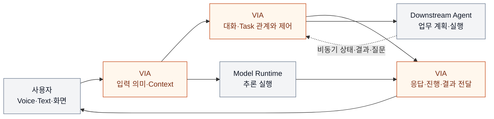

# VIA Architecture Decision 검토 — 최종 요약 보고서

> **후속 검토 안내:** 시스템 중심성과 QA 다양성에 대한 사용자 리뷰를 반영한 [핵심 Architecture·ASR 재선정 요약](./core-architecture-reassessment.md)이 있다. 아래 내용은 2026-09-24 최초 검토의 이력으로 보존하며, 최신 선정 제안은 후속 문서를 따른다. 어느 문서도 ASR 확정이나 A/B 승자 선정을 의미하지 않는다.

> **상세 DP 보고서를 읽기 전에 보는 문서 · 2026-09-24**
>
> 이번 문서·사고실험 검토의 최종 요약이다. Architecture 최종 승인이나 A/B 승자 선정 보고서는 아니다. 모든 후보의 실제 QA 측정은 `NOT_RUN`이며, 기존 ADR과 QA 정의는 변경하지 않았다.

## 1. 결론부터 — 중요한 결정과 좋은 비교 문제는 같지 않다

VIA의 구조 문제를 초기 12개 후보에서 다시 검토했다. 양쪽에 합리적인 보완책을 넣고, 혼합 설계로 차이를 없앨 수 있는지 확인한 뒤 **새 후보 1개를 포함한 13개 독립 보고서**로 정리했다.

결론은 “13개를 모두 같은 무게의 핵심 DP로 평가하자”가 아니다.

| 분류 | 후보 | 이번 판단 |
| --- | --- | --- |
| **우선 검증할 핵심 DP: 3개** | 11 장애 격리, 12 실행 근거 확정, 13 제어 자원 예약 | 같은 기능을 유지해도 서로 맞서는 비용·효과를 구조로 설명할 수 있다. 실제 크기와 목표 충족은 검증 전이다. |
| **조건부 핵심 후보: 4개** | 02 상태 확정, 04 응답 권한, 05 Context 계약, 06 의미 권한 | 중요한 책임·계약 차이는 남지만, 실제 경로·부하·변경 집합에서 충분한 양방향 QA 차이가 남는지 추가 명세가 필요하다. |
| **선행 범위·기능 적합성 결정: 3개** | 01 직접 처리, 03 음성 근거, 07 복합 요청 | 먼저 VIA와 외부 dependency가 어떤 기능을 실제로 제공하는지 정해야 한다. 현재 QA 숫자로 성급히 승패를 비교하면 왜곡된다. |
| **보조 설계 결정: 3개** | 08 복구 기준 기록, 09 Agent 의미 경계, 10 Model 세션 관리 | 구조 결정으로는 유효하다. 그러나 강한 양쪽 설계를 비교하면 충분한 반대 방향 QA 이점이 아직 설명되지 않는다. 핵심 평가표를 채우기 위해 유지하지 않는다. |

이 분류 자체도 사용자 검토 제안이다. **문서 작성 완료, 구조적 대안의 성립, 충분한 QA trade-off, 실제 성능 입증은 서로 다른 상태**다.

## 2. VIA는 무엇을 해결하는 시스템인가

사용자는 화면의 대상을 가리키며 질문하고, 답변을 듣다가 정정하고, 실제 업무를 맡기고, 다른 대화를 하면서 그 업무의 진행과 결과를 다시 받는다. 여러 업무 중 하나만 취소하거나 PC의 VIA가 재시작되어도 같은 대화와 업무 관계가 이어져야 한다.

VIA는 이 interaction과 업무 연결을 소유한다. Downstream Agent는 업무 계획·Tool 선택·실행을, Model Runtime은 S2S와 의미 판단의 추론 실행을 담당한다. VIA가 외부 업무를 직접 실행하는 범용 Agent로 바뀌는 것은 이 검토의 목표가 아니다.

그림의 주황색은 VIA가 책임지는 논리 영역이다. 고정된 Component 수나 Process 배치를 뜻하지 않는다. Model 출력도 VIA의 게시·권한 검사를 생략하지 않는다.

여기서 어려운 점은 단순 호출 연결이 아니다.

- **의미가 계속 바뀐다.** “이것”의 화면 시점, 늦은 음성 정정, 기존 Task 지칭을 함께 맞춰야 한다.
- **시간이 서로 다르다.** 말은 즉시 끊어야 하지만 외부 업무의 취소·완료는 나중에 확인된다.
- **하나의 대화가 여러 실행과 이어진다.** 늦거나 중복된 결과를 다른 Task에 붙이거나 취소한 일을 되살려서는 안 된다.
- **PC 자원과 장애가 공유된다.** 한 연동의 crash나 많은 일반 작업이 대화와 제어까지 멈추게 할 수 있다.
- **연구 결과를 설명할 수 있어야 한다.** 무엇을 보고 어떤 판단·상태·출력을 만들었는지 남기되, 기록 때문에 사용자 응답이 막히는 비용도 다뤄야 한다.

## 3. 먼저 검증할 세 결정

### DP-11 — 연동 코드의 치명적 장애를 어디까지 전파시킬 것인가

**A:** 위험한 연동 실행을 별도 Process에 두고 Core에는 얇은 연결 계층을 둔다.

**B:** 같은 Process 안에서 queue·책임을 나누고 직접 연결한다.

A는 연동 Process의 치명적 종료가 Core와 무관한 Task까지 죽이는 것을 줄일 수 있다. B는 Process 간 전달과 추가 buffer·worker 비용을 줄일 수 있다. 양쪽 모두 일반 오류 처리, 재시도, 상태 보존을 갖춘다.

**주요 맞교환:** 불필요한 장애 영향·올바른 복구(QA-32/31) ↔ 정상 경로 응답시간·PC 메모리(QA-01~03/41, 실제 참여 경로에 한정).

반드시 확인할 것은 같은 연동 코드·같은 fault를 비교하는지와, IPC 비용이 실제 최악 응답시간을 움직이는지다. 기존 EXEC ADR의 격리 결정은 유지하며, 이 문서는 현재 QA로 재검토할 후보를 명확히 한 것이다.

[DP-11 상세 보고서](./via-dp-11-process-isolation.md)

### DP-12 — 사용자에게 응답하기 전에 실행 근거를 저장해야 하는가

**A:** 지금까지 관측한 최소 실행 근거의 영속 저장을 확인한 뒤 응답을 게시한다. 상세 기록·export는 비동기로 처리한다.

**B:** 같은 기록을 bounded queue에 넣되 영속 저장 완료를 기다리지 않고 응답을 게시한다.

A는 게시 전 근거의 유실 창을 줄인다. B는 저장 지연을 사용자 응답 경로에서 분리할 수 있다. B가 로그를 안 남기는 비교가 아니며, 업무 상태·승인 기록의 공통 영속 의무는 양쪽 모두 지킨다.

**주요 맞교환:** 실행 trace 완전성(QA-61, crash 조건부) ↔ 응답시간과 저장 장애 중 기능 진행.

실제 음성이 나간 시각은 나가기 전에 기록할 수 없다. 따라서 A도 완전한 trace를 무조건 보장하지 않는다. 불완전한 실행의 FAIL 판정을 그대로 재계산할 수 있으므로 QA-62 평가 재현성이 자동으로 A 우세인 것도 아니다.

[DP-12 상세 보고서](./via-dp-12-evidence-commit.md)

### DP-13 — 바쁜 순간에도 사용자 제어가 쓸 자원을 남겨둘 것인가

**A:** 제어에 필요한 최소 실행 여력을 예약하고, 즉시 회수 가능한 일반 작업에만 유휴분을 빌려준다.

**B:** 전체 자원을 공유하며 제어를 우선 처리하지만, 일반 작업의 전체 자원 점유를 허용한다.

B의 우선순위가 높아도 이미 실행 중인 작업을 안전하게 중단할 수 없다면 제어는 기다린다. A는 그 대기를 줄이는 대신 일부 일반 작업의 시작을 늦출 수 있다. 같은 총 자원 한도로 비교한다.

**주요 맞교환:** 음성 중단·Task 제어 응답(QA-04/05) ↔ 일반 요청 응답(QA-01/02, 포화 경로 한정).

기존 12개에서 빠져 있던 정상 과부하의 자원 점유 권한이다. Process 장애 격리와 다른 결정이므로 새 DP로 추가했다. 외부 Model이 병목이면 VIA 내부 예약만으로 해결되지 않는다.

[DP-13 상세 보고서](./via-dp-13-control-reservation.md)

## 4. 나머지 결정은 어떻게 다룰 것인가

### 조건을 구체화한 뒤 핵심 여부를 판단할 네 후보

| DP | 선택의 본질 | 핵심 평가로 올리기 전에 확인할 것 |
| --- | --- | --- |
| [02 대화·Task 확정 경계](./via-dp-02-state-consistency.md) | 공동 원자 확정 ↔ 독립 owner 확정과 조정 | 교차 관계 갱신의 실제 경로, 정합성 유지 비용과 지연·복구 차이. 소유자 분리만으로 장애 격리를 주장하지 않는다. |
| [04 직접 응답 게시 권한](./via-dp-04-response-authority.md) | 제한적으로 Voice에 위임 ↔ 요청마다 Core 승인 | 병렬 승인·사전 계산 후에도 왕복이 임계 경로에 남는지, 권한 회수 비용이 무엇인지 |
| [05 Context 읽기 계약](./via-dp-05-context-contract.md) | 세대별 입력 집합 확정 ↔ 같은 세대에서 허용 조회 확장 | 추가 자료가 필요한 경우의 세대 갱신 비용과 변경·재구성 비용. lazy loading은 양쪽 모두 허용한다. |
| [06 의미 확정 권한](./via-dp-06-semantic-authority.md) | 최종 확정자가 의미를 함께 조정 ↔ 단계별 owner가 자기 의미만 정정 | 부분 재사용·cache 후에도 남는 정정 경로와 전체 변경 집합의 영향. 모델 호출 수를 억지로 다르게 하지 않는다. |

이 네 개를 지금 “강한 핵심 DP 확정”이라고 부르지 않는다. 조건을 구체화해도 trade-off가 약하면 보조 결정으로 낮춘다.

### 먼저 범위와 capability를 정할 세 결정

DP-01은 제한된 정보 처리를 VIA가 직접 할지 Agent가 전담할지다. 직접 경로와 위임 경로는 QA 측정 구간이 달라 속도 숫자를 그대로 비교할 수 없다.

DP-03은 음성 입력의 최종 근거를 VIA가 정규화·보완할지 S2S 원천 계약에 둘지다. 화면 지칭·정정에 필요한 정보를 제공하지 못하는 후보는 낮은 점수를 받는 정상 대안이 아니라 기능 적합성 문제다.

DP-07은 복합 요청의 상위 실행 관계를 VIA가 조정할지 Agent가 전부 소유할지다. 부분 취소·node별 조회·기존 Task 연결 기능이 없는 Agent를 있다고 가정해서는 안 된다.

상세: [01 직접 처리](./via-dp-01-direct-handling.md) · [03 음성 근거](./via-dp-03-voice-evidence.md) · [07 복합 요청](./via-dp-07-compound-orchestration.md)

### 구조적으로 필요하지만 점수 대결을 강제하지 않을 세 결정

DP-08은 재시작 시 확정 이력과 현재 상태 중 무엇이 최종 기준인지다. 두 안 모두 checkpoint·감사 이력·미완료 명령을 가질 수 있다.

DP-09는 Agent 고유 사건의 업무 의미를 경계에서 정규화할지 Core에서 해석할지다. 손실 없는 확장을 허용하면 “정규화는 정확성을 희생한다”는 단순 대립이 사라진다.

DP-10은 Model 세션의 생성·회복 권한을 공통 관리자가 가질지 역할별 owner가 가질지다. 양쪽 모두 공통 library, 직접 데이터 stream, Model 가중치 공유가 가능하다.

이들을 버리는 것이 아니다. **전체 구조의 명시적 설계·변경 계약으로 남기되, 반대 방향 QA 이점을 발명하지 않는다.**

상세: [08 복구 기록](./via-dp-08-recovery-source.md) · [09 Agent 의미](./via-dp-09-agent-semantics.md) · [10 Model 세션](./via-dp-10-model-session-authority.md)

## 5. 추천하는 진행 순서와 완료 범위

먼저 DP-01/03/07의 범위·기능 조건을 정리해 모든 후보가 같은 제품을 만들도록 한다. 그다음 **DP-11 → DP-13 → DP-12** 순서로 검증 준비를 권한다. 각각 장애, 정상 과부하, 기록 비용이라는 구별되는 사건으로 가설을 반증하기 쉽다. 이는 A를 순서대로 채택하자는 뜻이 아니다.

DP-02/04/05/06은 의존 경로·정정·세대 계약을 더 구체화한 후 승격 여부를 판단한다. DP-08/09/10은 각 비교에서 고정할 공통 구조로 명시한다. 개별 DP의 유리한 선택을 조합했을 때 충돌하지 않는지도 제한적으로 확인한다. 전체 조합에서 하나의 총점 우승 구성을 고르는 방식은 사용하지 않는다.

이번에 완료한 것은 다음이다.

- 모든 13개 후보의 독립 보고서, 배경·A/B 구조 그림, 상호 배타성·hybrid·steelman 검토.
- 각 보고서의 **전체 19개 QA** 예상표와 근거·반례·미확인 조건.
- UC-01~18, 전체 변경 집합과 QA의 coverage 점검, DP 간 의존·중복 검토.
- 전체 적용 경험을 반영한 공통 review protocol 보완과 문서 검증.

**하지 않은 일:** 후보 구현, QA 측정·점수화, 실제 모델 기능 입증, A/B 최종 선택, ASR 확정, 기존 ADR 변경.

처음에는 이 문서만 읽고 “세 우선 후보와 네 조건부 후보의 분류가 적절한가”를 판단하면 된다. 이후 관심 DP의 독립 보고서로 내려가면 된다. 전체 후보 변경 이력·coverage·검증 기록은 [전체 검토 종합](./dp-review-synthesis.md), 공통 판정 규칙은 [DP 공통 검토 절차](./dp-review-protocol.md)에 있다.
