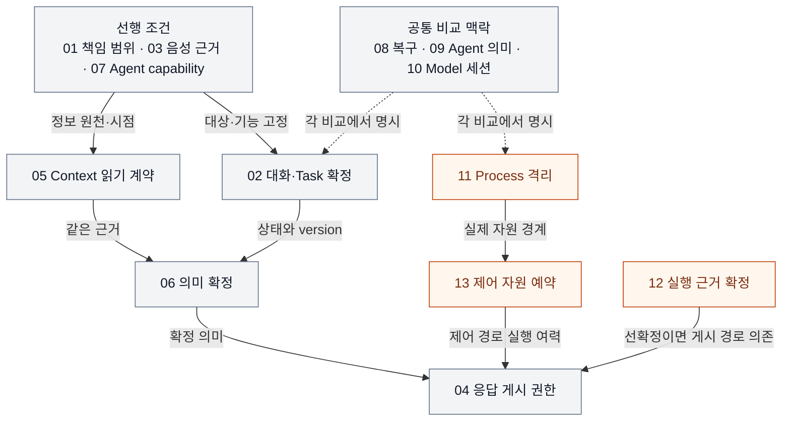

# VIA DP 전체 검토 종합

> **문서·사고실험 검토 완료 보고 · 2026-09-24 · 사용자 승인 전**
>
> 먼저 읽는 문서: [최종 요약 보고서](./dp-executive-summary.md). 이 문서는 후보별 판정, 누락·중복 점검, 전체 적용에서 바꾼 규칙과 검증 기록을 남긴다. 후보 구현·QA 측정·승자 결정은 하지 않았다.

## 1. 검토 범위와 결과를 읽는 법

초기 VIA-DP-01~12 전부를 [공통 검토 절차 v2](./dp-review-protocol.md)로 다시 검토하고, 정상 과부하의 제어 자원 권한을 DP-13으로 추가했다. 시스템·QA에서 출발했으며 기존 네 ADR을 정답으로 전제하지 않았다.

각 보고서는 같은 질문을 답한다. 왜 필요한가 → 같은 제품 기능을 제공하는 A/B는 무엇인가 → hybrid로 회피할 수 있는가 → 어떤 권한·상태·계약이 배타적인가 → 같은 사건에서 무엇이 달라지는가 → 전체 QA의 방향·크기·확실성은 무엇인가 → 무엇을 확인하면 판단을 바꿀 것인가.

**총 13개 보고서 작성 완료**를 **13개 핵심 DP의 적합성·효과 입증**으로 읽지 않는다. 현재 권고는 우선 핵심 검증 3개, 조건부 핵심 4개, 선행 범위·기능 결정 3개, 보조 설계 3개다. 현재 QA는 19개 사용자 검토 초안이며 이 작업으로 승인·ASR 확정하지 않았다.

## 2. 전체 후보와 최종 분류 제안

ID는 지속적인 식별자이며 우선순위가 아니다. 아래 A/B는 해당 독립 보고서 v1의 정의이고, 과거 후보나 ADR의 A/B 문자와 섞지 않는다.

| DP · 상세 보고서 | A / B의 배타적 결정 | 분류와 이유 |
| --- | --- | --- |
| [01 범위가 정해진 정보 처리](./via-dp-01-direct-handling.md) | VIA 선택적 직접 처리 + 위임 / 대상 실행 전부 Agent 책임 | **선행 범위.** QA-01/02 경로 이동과 외부 비용 이전을 그대로 속도 개선으로 평가할 수 없음 |
| [02 대화·Task 확정](./via-dp-02-state-consistency.md) | 교차 관계 공동 원자 확정 / 독립 소유자 확정과 조정 | **조건부 핵심.** 조정 왕복·공동 경합·복구량의 실제 조건에서 양방향 효과 확인 필요 |
| [03 음성 입력 근거](./via-dp-03-voice-evidence.md) | VIA가 최종 입력 근거 중재 / S2S-native 의미 계약이 최종 기준 | **선행 기능.** native 정보와 정정 capability가 전체 UC를 만족하는지 먼저 확인 |
| [04 직접 응답 게시](./via-dp-04-response-authority.md) | 범위·세대가 제한된 Voice 권한 위임 / 매 요청 Core 승인 | **조건부 핵심.** 사전 계산·병렬 승인을 적용하고도 남는 지연과 권한 회수 비용 확인 필요 |
| [05 Context 읽기 집합](./via-dp-05-context-contract.md) | 입력 세대의 읽기 집합을 닫음 / 허용 범위 안에서 같은 세대의 집합 확장 | **조건부 핵심.** lazy loading·cache 후에도 추가 근거 획득과 재구성 계약의 차이가 남는지 확인 |
| [06 의미 확정](./via-dp-06-semantic-authority.md) | 최종 권한자가 의미를 함께 조정 / 단계 owner만 자기 의미를 정정 | **조건부 핵심.** 추론 호출 수 대신 실제 정정 경로·중간 계약 변경을 비교해야 함 |
| [07 복합 요청](./via-dp-07-compound-orchestration.md) | VIA가 상위 실행 관계 소유 + 묶음 위임 / Agent가 대상 전체 관계 소유 | **선행 기능.** 부분 제어·조회·복구와 기존 Task 혼합을 보존할 Agent capability 필요 |
| [08 복구 기준 기록](./via-dp-08-recovery-source.md) | 확정 이력 + checkpoint / 현재 상태 + 미완료 명령 + 감사 이력 | **보조 설계.** 기준 기록은 배타적이지만 복구·관측 우열을 저장 종류만으로 결정할 수 없음 |
| [09 Agent 의미 경계](./via-dp-09-agent-semantics.md) | 경계에서 의미 정규화 + 손실 없는 확장 / Core가 typed variation 해석 | **보조 설계.** 변경 국소화 가능성은 남지만 B의 정확성·속도 이점을 자동 주장할 수 없음 |
| [10 Model 세션 관리](./via-dp-10-model-session-authority.md) | 공통 관리자가 생성·회복 승인 / 역할 owner가 독립 승인 | **보조 설계.** 직접 stream·공통 library·Runtime 공유를 허용하면 기존 성능·메모리 대립이 약해짐 |
| [11 Process 격리](./via-dp-11-process-isolation.md) | 위험 연동 실행 별도 Process / 같은 Process의 강한 논리 분리 | **우선 핵심.** 치명적 장애 전파와 정상 IPC·자원 비용의 맞교환 |
| [12 실행 근거 확정](./via-dp-12-evidence-commit.md) | 관측된 최소 근거 영속 확인 후 게시 / 정상 기록을 유지하되 게시와 분리 | **우선 핵심.** 저장 지연과 게시 전 evidence 유실 창의 맞교환 |
| [13 제어 자원 예약](./via-dp-13-control-reservation.md) | 최소 여력 예약 + 회수 가능한 차용 / 전체 공유 + 우선순위 우대 | **우선 핵심·신규.** 제어 시작 대기와 일반 요청의 사용 가능 capacity 맞교환 |

우선 핵심의 ‘강함’도 구조적 가설의 강함이다. 실제 target PC·대표 workload·최악 p95에서 효과가 충분하다는 검증은 아직 없다. 반례가 맞으면 이 분류를 낮춘다.

## 3. 왜 초기 A/B를 그대로 유지하지 않았는가

| 발견한 문제 | 적용한 수정 |
| --- | --- |
| 역할 통합 vs 분리에 모듈성·트랜잭션·Process가 섞임 | DP-02를 교차 관계의 최종 확정 경계로 좁히고, 분리 모듈 + 공동 commit을 A에 포함 |
| 보조 음성 기술 유무가 여러 독립 선택의 묶음임 | DP-03을 최종 입력 근거의 권한으로 재정의. 보조 처리를 특정 알고리즘으로 확정하지 않음 |
| 무조건 직렬 Core 승인이라는 약한 상대 | DP-04 B에 사전 계산·병렬 준비 허용; 제한적 Voice 위임 hybrid를 A로 구성 |
| snapshot과 handle을 함께 쓸 수 있음 | DP-05 양쪽에 lazy handle 허용, 같은 세대의 읽기 집합을 확장할 권한으로 배타성 확보 |
| 통합 Model 1회 vs 단계별 Model 여러 회라는 결론 유도 | DP-06에 보조 추론·cache 허용, 최종 의미를 수정할 권한으로 구분 |
| 복합 요청을 전부 VIA 또는 전부 Agent로만 구분 | DP-07 A에 하위 묶음 위임 포함. B에는 실재해야 할 node 제어 계약 요구 |
| 이벤트 이력과 현재 상태가 함께 존재함 | DP-08 양쪽 보완책을 허용하고 충돌 시 기준 기록으로 구분 |
| canonical 계약이면 고유 capability가 반드시 손실됨 | DP-09 A에 손실 없는 확장, B에 제한된 typed handler 허용 |
| 공통 Model 관리가 모든 데이터 중계·중복 모델 메모리를 뜻함 | DP-10에서 control/data 경로·Runtime 공유·Process 격리를 분리 |
| 전부 격리 vs 전부 같은 Process라는 과도한 비교 | DP-11 A에 위험 코드만 격리하는 hybrid 포함, 대상 코드 집합은 동일하게 고정 |
| 중앙 로그와 producer별 로그를 배타적이라고 봄 | DP-12 공통 수집 + producer spool을 양쪽 기반으로 두고 영속 확정 순서로 재정의 |
| 정상 과부하의 사용자 제어 권한이 미명시 | DP-13 추가. 높은 우선순위만으로 이미 실행 중인 비선점 작업을 밀어낼 수 없는 문제를 분리 |

### ID·A/B 이력과 기존 ADR

초기 발견 목록은 Git의 `ce4a7234a7f4ef9cf4ac13a9d8b604ea96c03ae9`에 남아 있다. 독립 보고서의 v1은 그 초기 표를 그대로 세부화한 것이 아니라 위 재구성을 적용한 최초 상세 정의다. DP-01 v1 본문의 예상은 유지했다.

특히 **DP-04·08·10·11은 초기 발견 표에서 B였던 방향이 새 A의 기반이 되었다. DP-11의 새 A(격리)는 기존 EXEC-DP01의 B에 해당한다.** 다만 hybrid·범위 재정의를 포함하므로 단순 문자 치환도 아니다. DP-03/05/12는 질문 자체도 좁히거나 재정의했다. 어느 경우에도 이전 예상이나 수치를 자동으로 이전하지 않는다.

기존 [AGENT ADR-001](../../adr/ADR-001-agent-integration-contract-boundary.md), [TASK ADR-002](../../adr/ADR-002-task-state-authority.md), [EXEC ADR-003](../../adr/ADR-003-runtime-fault-isolation-boundary.md)의 accepted 상태와 caveat, [IR ADR-004](../../adr/ADR-004-semantic-decision-ownership.md)의 deferred 상태는 바꾸지 않았다. 새 보고서 분류가 이전 승인을 취소하거나 유예안을 승인하는 것은 아니다.

## 4. 관계와 권장 순서

먼저 DP-01/03/07의 **범위·외부 기능 조건**을 정리한다. 기능이 성립하지 않는 대안을 높은 latency나 낮은 accuracy로 비교하지 않는다.

그다음 검증 준비 우선순위는 **11 → 13 → 12**다. 서로 다른 원인인 치명적 Process fault, 정상 과부하, evidence 저장 지연을 구별해 시험할 수 있다. 조건부 후보는 **02 → 05 → 06 → 04** 순서로 계약을 구체화하면 상태·근거·의미·게시 권한이 자연스럽게 이어진다. 이 순서는 문서 이해와 검증 준비의 권고이며 전체 구조의 채택 순서가 아니다.

화살표는 어느 안이 정답이라는 뜻이 아니라 **비교 시 고정하거나 확인할 계약의 의존**이다. 주황색은 우선 검증 후보다. 이 그림은 runtime 호출 graph가 아니다.

### 개별 비교 결과를 그대로 합치면 안 되는 사례

| 조합 | 반드시 같이 확인할 문제 |
| --- | --- |
| DP-04의 A Voice 위임 + DP-12의 A 근거 선확정 | Core 승인을 생략해도 evidence 영속 확인이 게시 경로에 남는다. 같은 시간 절감을 두 번 계산하지 않는다. |
| DP-11의 A 별도 Process + DP-13의 A 예약 | Process가 나뉘어도 CPU·Model·lock을 공유할 수 있다. 장애 격리가 제어 capacity 보장은 아니다. |
| DP-10의 A 공통 세션 + DP-13의 A 예약 | VIA worker만 예약하고 실제 Model queue가 막히면 end-to-end 제어는 느릴 수 있다. |
| DP-02의 B 독립 확정 + DP-08의 A 이력 복구 | 각 소유자의 확정·관계 조정 순서와 미완료 기록을 복원해야 한다. 이력 replay만으로 외부 Agent 사실이 정해지지 않는다. |
| DP-03의 B native 의미 + DP-05의 시점 고정 | 같은 음성·화면 원천의 시각과 revision이 연결되어야 한다. 테스트가 없는 과거 자료를 만들어 주면 안 된다. |
| DP-07의 B Agent 전체 조정 + VIA 후속 제어 | VIA가 node 준비 순서를 대신 결정하는 숨은 planner가 되면 DP-07의 A로 바뀐다. 부분 제어 capability가 없는 B를 그런 보완으로 통과시키지 않는다. |

전체 조합의 점수 합산이나 기존 16개 full-factorial 결과를 새 13개 후보의 검증으로 사용하지 않는다. 의존이 실제 결론을 뒤집을 수 있는 조합만 후속 제한 교차 비교 대상으로 동결한다.

## 5. 사용자 기능 누락 점검

출처는 [대표 Use Cases](../05-representative-use-cases.md)다. ‘연결됨’은 설계 책임과 사고실험 위치가 있다는 뜻이며 구현 검증 완료가 아니다.

| UC | 지켜야 할 사용자 의미 | 연결한 결정·검토 |
| --- | --- | --- |
| 01 일반 대화 | S2S 응답, 같은 대화 유지 | 03 입력 근거, 04 게시, 10 세션 |
| 02 Context 정보 요청 | 허용된 자료로 제한된 정보 처리 | 01 직접 책임, 05 읽기 계약, 06 의미 |
| 03 Select then Speak | 선택한 대상과 발화를 연결 | 03 시각 근거, 05 자료 버전, 06 지칭 |
| 04 Speak while Pointing | 발화 중 여러 지칭·정정 | 03 revision, 05 과거 화면, 06 공동/단계 판단 |
| 05 Background·과거 참조 | 지금 화면과 과거 근거를 혼동하지 않음 | 05 시점·보존 조건, 06 의미 |
| 06 확인 질문 | 답변을 맞는 질문·업무에 연결 | 02 관계 확정, 06 의미, 09 Agent 질문 계약 |
| 07 정보 처리에서 업무로 전환 | 직접 응답과 업무 실행 책임을 구별 | 01 책임 범위, 02 Task 관계, 09 위임 |
| 08 Agent 업무 | 정확한 요청을 맡기고 상태·결과 연결 | 09 의미 계약, 11 연동 장애, 02 관계 |
| 09 복합 요청 | 순차·병렬·전달·부분 제어·기존 Task 혼합 | 07 전체 5유형의 capability, 02 관계 |
| 10 기존 Task 후속 지시 | 새 요청이 기존 실행과 이어짐 | 02 identity, 06 지칭, 09 실행 ID |
| 11 음성 중단·정정 | 재생 중단과 의미 정정을 구별 | 03 정정, 04 게시 세대, 13 제어 여력 |
| 12 Task 취소 | 실제 제어 상태를 정직하게 전달 | 02 교차 상태, 07 부분 취소, 09 상태 의미, 13 |
| 13 비동기 상태·결과·질문 | 늦은 결과를 같은 Task에 연결 | 02/09, 04 게시, 12 source·출력 기록 |
| 14 여러 Task | 서로 다른 업무·질문·제어가 섞이지 않음 | 02/07, 11 장애 영향, 13 과부하 |
| 15 채널 전환·재연결 | Voice/Text와 외부 session에 관계가 종속되지 않음 | 02 identity, 03 input revision, 10 세션, 08 복원 |
| 16 접근 동의·행동 승인 | 대상·scope·현재 승인 확인 | 전체 공통 필수 조건, 04 권한 회수, 05 접근, 09 질문 |
| 17 User Memory | 확인·수정·삭제 결과 유지 | 05 조회와 현재 권한, 08 기준 기록·삭제, 02 관계, 12 관측정보 최소화 |
| 18 장애·재시작 | 저장된 관계와 실제 외부 실행 재연결 | 08 복원, 02 조정, 09/10 재연결, 11 격리, 12 누락 감지 |

## 6. 전체 QA coverage와 판단 한계

모든 보고서에 아래 19개 행이 있다. 연결된 DP가 많다고 그 QA의 차이가 크거나 입증되었다는 뜻은 아니다.

| QA · 단일 대표 metric | 주요 검토 위치와 역할 |
| --- | --- |
| 01 위임 경로 VIA 시간 | 11 IPC, 13 admission, 12 기록, 02 관계. 01/07의 경로 이동은 직접 비교 제한 |
| 02 직접 Voice 응답시간 | 04 게시, 05 자료, 06 의미, 12 기록, 13 일반 capacity |
| 03 Agent 상태 Voice 전달시간 | 02 관계, 09 의미, 11 IPC, 12 기록. source 이전 Agent 시간은 제외 |
| 04 음성 중단시간 | 03/04의 실제 중단 경로, 13 공유 자원. Task 취소 시간과 구별 |
| 05 Task 제어 응답시간 | 02 관계, 07 부분 제어, 09 의미, 12 기록, 13 예약. pending과 실제 완료를 구별 |
| 11 전체 요청 정확도 | 전체 필수 회귀. case별 strict 성공률 평균이며 12~15와 중복 가중하지 않음 |
| 12 의미 해석 정확도 | 03 입력, 05 근거, 06 의미 권한. 모델이 좋아진다는 가정은 제외 |
| 13 Task·Interaction 연결 정확도 | 02/06/07/09의 대상 연결과 기존 Task 관계 |
| 14 비동기 상태 수렴 | 02 조정, 07 복합 결과, 08 복원, 09 native event. 양쪽 모두 올바른 수렴 의무 |
| 15 대화·Task 연속성 | 02/03/08/10, 채널과 Model session 교체의 identity 분리 |
| 21 Agent 변화당 변경 요소 평균 | 09 중심, 01/07 책임 이동 영향. 전체 A-01~09 ledger 필요 |
| 22 Model·Context·State 변화당 변경 요소 평균 | 03/05/06/08/10 중심, 02/04/11/13 결합. 전체 M/C 15개 필요 |
| 23 실험·로그 변화당 변경 요소 평균 | 12 중심, 각 DP의 관측·복구 경계. 전체 E 5개 필요 |
| 31 올바른 Task 복구시간 | 08/11, 02/07/09/10. 모든 영향 Task의 올바른 사용 가능 시점까지 |
| 32 불필요한 장애 영향 수 | 11 중심. 필수 의존 closure와 공유 배치가 만든 초과 전파를 구별 |
| 41 PC peak 메모리 | 11 IPC, 05 자료 수명, 08 복구 상태, 12 buffer, 13 queue. 10 공유 모델 중복을 가정하지 않음 |
| 51 초과 보호정보 노출 수 | 전체 필수 회귀, 특히 01/05/12. 총 byte·recipient 수를 초과 노출로 대체하지 않음 |
| 61 완전한 실행 trace run 비율 | 12 중심, 모든 책임·경로의 source·출력·인과 연결. 독립 관측 필요 |
| 62 동일 평가 재계산 비율 | 08/12와 공통 raw evidence·manifest·analyzer. Model 재실행률이 아님 |

현재 QA에서 새로운 번호나 metric을 만들지 않았다. 특히 Privacy는 기존 QA-51만 유지했다. 목표·score band·fixture·machine contract가 동결되지 않았으므로 예상 우열을 수치 점수로 바꾸지 않았다.

### 변경 대응 coverage

| 전체 평가 집합 | 주로 확인할 구조 | 이번 검토에서 하지 않은 일 |
| --- | --- | --- |
| A-01~09: Agent 추가·교체·protocol·상태·ID·capability·인증·질문·결과 | 09 의미 경계, 07 관계 실행, 01 책임, 02 identity | 변경 요소 수 산출·평균 점수화 |
| M-01~09: 제공자·profile·배치·이벤트·stream·이력 | 03 입력, 06 의미, 10 세션, 04 게시, 11/13 실행 경계 | 실제 제공자 기능 확인·가중치 중복량 가정 |
| C-01~06: 정보원·형식·화면·Memory·복수 원천·기록 이행 | 05 읽기 계약, 02 관계, 08 복구, 06 지칭 | 특정 한 변경을 전체 15개 평균으로 대표 |
| E-01~05: 시간·연결 ID·schema·export·실험 배정 | 12 evidence, 모든 경계의 공통 관측 계약 | 중앙 logger 하나만 바뀐다고 선결정 |

M/A/C의 총 24개와 E의 5개를 누적하지 않고 각 후보의 같은 출발점에서 하나씩 적용해야 한다. 이 문서는 coverage를 확인했으며 아직 후보별 완전한 Architecture Element ledger는 작성·측정하지 않았다.

## 7. 다른 신규 후보도 검토했는가

| 추가로 확인한 질문 | 처리와 이유 |
| --- | --- |
| 제어와 일반 작업의 자원 점유 | **DP-13 추가.** 현재 요구에서 나왔고 Process·세션 관리와 별개의 권한 계약이며 정상적인 양방향 QA 가설 존재 |
| 화면·음성 시간축과 과거 자료 보존 | 03/05의 필수 기능·정보 원천 계약으로 연결. 현재 자료로 과거 의미를 대신하는 불가능한 대안을 만들지 않음 |
| 동의·승인의 중앙/분산 검증 | 02/04/05/09의 공통 필수 불변조건과 authority 계약으로 연결. 무검증 저지연을 정상 B로 만들지 않음. 별도 강한 trade-off 미확인 |
| User Memory 저장·삭제 lifecycle | 05/08/12에 현재 권한·삭제 효과·증거 최소화 계약 포함. Memory 기능 자체는 이미 필수이며 새 기능 DP가 아님 |
| 외부 업무 exactly-once | 02/07/08/09의 ID·pending·재조회·멱등 조건. 외부 Agent의 미지원 보장을 VIA가 임의로 만들어낼 수 없음 |
| Agent push vs polling | 외부 계약 변화 A-04 및 09의 연동 처리. VIA가 외부 제공 기능을 자유롭게 선택할 수 있다고 가정하지 않음 |
| Model local vs remote | 현재는 M-05/06 변화와 공통 dependency profile. 단순 제품·배치 선택을 새 독립 핵심 DP로 승격하지 않음 |
| queue 수·batch 크기·cache 크기 | 동일 후보 안의 최적화. 권한·계약이 바뀌지 않으면 별도 Architecture DP로 번호를 만들지 않음 |

이는 앞으로 새 DP가 절대 없다는 주장이 아니다. 외부 capability나 target PC 조건이 밝혀져 **기존 보고서 어디에도 소유자가 없는 새로운 구조적 충돌**이 생기면 같은 기준으로 추가한다. 이번 검토 범위에서는 기존 요구의 주요 책임 공백을 위 연결로 다뤘다.

## 8. 공통 review protocol에 반영한 개선

v2에 기능 적합성 선심사, control/data/Process/resource 축 분리, 동일 도착열과 구조가 만든 대기의 구분, fault 논리 원점, 미래 출력의 사전 기록 금지, trace 완전성과 평가 재현의 분리, 핵심/조건부/선행/보조 분류를 추가했다.

모든 보고서에 다시 적용했다. 그 결과 02~10을 무조건 핵심으로 선언하지 않았고, 11~13도 조건부 예측과 반례를 명시했다. 상태·비동기 순서가 핵심인 보고서에는 A/B 동일 사건의 sequence 그림을 더했다. 그림의 상자 수를 변경 요소·메모리 비용으로 세지 않는다.

자체 읽기 검토는 배경 → 범위 → A/B → 배타성 → 사건 추적 → QA → 판단 순서로 수행했다. 전문용어와 조건을 앞에서 설명하고 각 QA의 예상은 사고실험 anchor로 연결했다. 이는 독립 외부 심사관의 검토를 받았다는 뜻은 아니다.

## 9. 검증 기록과 미완료 범위

| 검증 | 결과·범위 |
| --- | --- |
| active Markdown 링크 | `check_active_markdown_links.py` PASS — 83개 active Markdown의 로컬 대상 확인 |
| active 용어 | `check_active_terminology.py` PASS — 퇴역 용어의 현재 요구 혼입 없음 |
| QA registry | `check_qa_catalog.py` PASS — active 19개 유지; 이번 QA 정의 변경 없음 |
| 보고서 전수 정적 검사 | 13개 보고서 각각 19개 QA, 총 247행의 ID·순서·중복 없음, 사고실험 anchor·미측정 표시·대안 원칙 확인 |
| 문서 간 절 링크 | 이번 decisions 최상위 문서의 cross-document fragment 5개 확인 |
| Mermaid 렌더링 | 55개 PASS — 보고서 50개, 요약·종합 각 1개, 기존 그림 가이드 3개. 로컬 Chrome + Mermaid 10.9.3 사용 |
| 그림 가독성 | 렌더링 이미지 자체 검토; 넓은 단일 행을 세로 배치로 수정, 공통 요소·권한·병렬 준비·후발 기록을 본문과 대조. SVG 경계 잘림 및 HTML label overflow 검사 통과 |
| diff·범위 | `git diff --check` 및 실제 변경 내용 검토. QA 정의·기존 ADR·후보 코드·실제 측정 결과 변경 없음 |

Mermaid 원문은 각 문서에 보존했다. 렌더링 PNG/SVG와 일회성 검사 도구는 임시 산출물이며 source·측정 결과 디렉터리에 넣지 않았다. 로컬 렌더링 확인을 GitHub UI의 실제 렌더링 검사나 제품 실행으로 부르지 않는다.

- 측정 상태: 모든 DP의 실제 QA 결과 `NOT_RUN`.
- 구현 상태: 후보 구현·harness·machine contract 변경 없음.
- 승인 상태: 신규 DP 목록·분류는 사용자 검토 제안, 기존 ADR 상태 유지.

## 10. 이 검토를 어디까지 닫을 수 있는가

**DP 발굴·재구성·독립 보고서 작성 단계는 이번 문서 묶음으로 닫을 수 있다.** 초기 후보 수를 유지하기 위한 약한 대안을 남기지 않았고, 부족한 구조 축은 13으로 보충했으며, 어떤 후보를 우선 평가하고 무엇을 먼저 확인해야 하는지 구분했다.

다음 단계는 이 보고서를 반복 작성하는 것이 아니라 선택된 후보의 capability·Architecture Element·fixture·endpoint·실패 처리·target·평가 경계를 구체화해 Measurement Contract를 동결하는 일이다. 그 전에는 “최종 최적 Architecture”, “QA 성능 입증” 또는 “13개 강한 핵심 DP 확정”이라고 결론내릴 수 없다.
