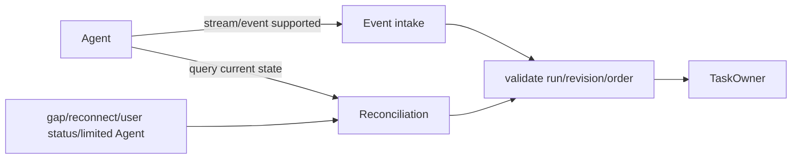

# TASK-T01 — Agent State Update Delivery Strategy

> **Gate 2 자체 리뷰에서 TASK-DP02를 독립 DP에서 내리고 공통 Task/Agent integration tactic으로 전환하는 제안.** 사용자 승인 전.
> W12-G2: 새 W-03은 Agent status source event부터 audible Voice feedback까지 측정한다. 아래 기존 feedback 가설은 [11-E](../../08-quality-attributes/voice-responsiveness.md)에 맞춰 구현 전에 재동결한다.

## 결론

VIA는 **Event-first + Query Reconciliation**을 기본 전략으로 두는 것이 자연스럽다.

- streaming/event 지원 Agent: 진행·질문·결과를 low-latency path로 받는다.
- query: reconnect, gap, current-state verification, 사용자 explicit status 요청, streaming 미지원 Agent의 fallback에 사용한다.
- event를 받았다는 이유만으로 source revision/완전성을 생성하지 않는다.
- query와 event가 충돌하면 provider가 실제 제공하는 revision/timestamp/terminal-state semantics와 reconciliation rule로 해결한다.
- canonical VIA Task state의 writer는 TASK-DP01 선택 구조다.

A2A는 polling, streaming, push를 보완적인 update mechanism으로 설명하고 Get Task를 stream/push 이후 current-state 조회에도 사용한다. 따라서 이들을 억지로 상호배타적 Architecture family로 만들지 않는다.

## 관련 Working ASR

- **W-03 Agent Progress Voice Feedback Responsiveness** — source status event가 실제 audible Voice feedback으로 얼마나 빨리 전달되는가.
- **W-04 Concurrent Task Performance Isolation** — event fan-in/query workload가 foreground에 주는 영향.
- **W-07 Agent Ecosystem Interoperability & Substitutability** — 지원 mechanism 차이를 integration layer가 얼마나 국소화하는가.
- **W-09 Recovery Timeliness & Recoverability** — reconnect 후 query/reconciliation으로 current state를 얼마나 빨리 회복하는가.

이 값들은 AGENT-DP01/TASK-DP01/EXEC-DP01 candidate의 실제 구조와 함께 관찰하며, TASK-T01 자체의 A/B winner를 만들지 않는다.
