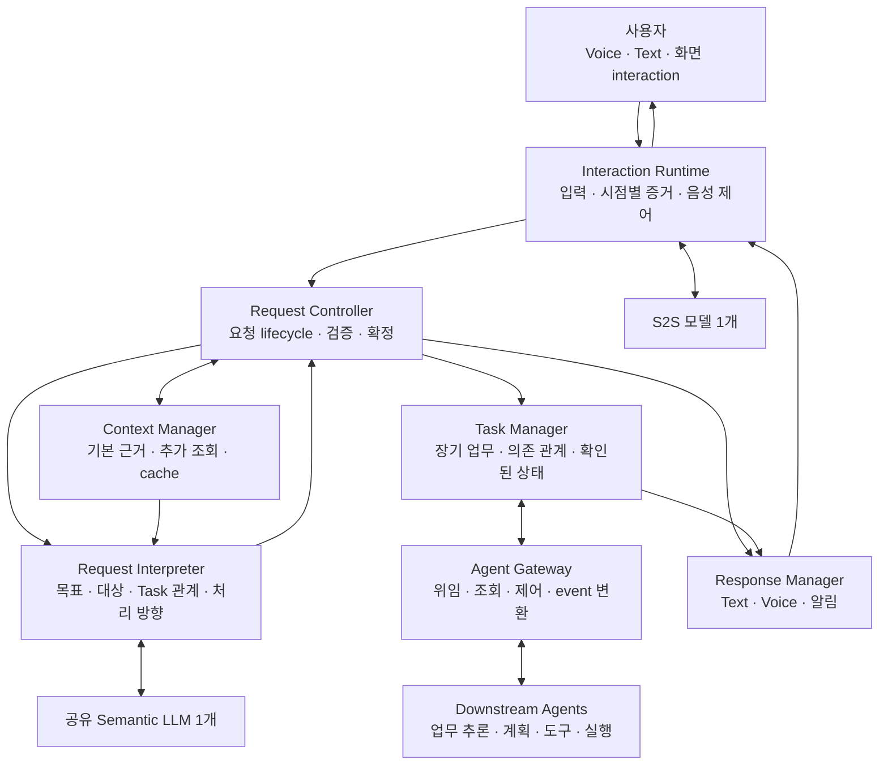

# VIA 목표 SW Architecture

> 상태: **PROPOSED / 사용자 검토 중 / 구현·측정 없음**
> 작성일: 2026-09-29
> [설계 개요](./README.md) · [합의 상태와 검토 기록](./review-log.md)

## 1. 한 문장 정의

**VIA는 시간에 맞춰 수집한 근거로 사용자의 목표·대상·Task를 먼저 정확히 확정하고, 그 확정 경계를 지키면서 직접 응답과 장기 Agent 업무를 빠르게 이어 주는 PC interaction·orchestration 소프트웨어다.**

세 부분은 동시에 움직이되 사용자에게 무엇을 답하고 어떤 업무를 시작할지는 검증된 요청과 확인된 상태를 기준으로 결정한다. 이하의 구조는 주 설계안이며, 성능상 이점은 아직 검증되지 않은 가설이다.

이 Architecture는 다음 순서를 invariant로 둔다.

1. 잘못된 대상·Task·승인·Agent command를 확정하거나 게시하지 않는다.
2. 필요한 근거가 없거나 후보가 충분히 탐색되지 않았으면 추가 조회, clarification 또는 확인 불가로 끝낸다.
3. 위 정확성 경계를 낮추지 않고 사전 준비·병렬 조회·speculative 생성·선택적 재검증으로 latency를 줄인다.

## 2. 사용자 관점의 전체 흐름

사용자가 그래프를 가리키며 “이거 지난번 발표자료에 넣어줘. 보고서 만드는 건 계속하고”라고 말한다.

1. 말하는 동안 그래프를 지정한 시점과 화면 근거를 확보한다.
2. 그래프와 이전 발표자료를 식별하고, 유지할 보고서 Task를 구분한다.
3. 후보가 둘이면 구분에 필요한 질문을 한다. 대상을 확정할 수 있으면 목표·완료 조건·제약을 Agent에 전달한다.
4. Agent 실행 중에도 사용자는 다른 질문을 한다.
5. 진행·질문·결과는 원래 Task와 Conversation으로 돌아온다.
6. 사용자가 VIA 음성 중 끼어들면 재생은 즉시 중단하고, 업무 취소 여부는 새 발화의 의미를 확인해 결정한다.

| 처리 흐름 | 계속 처리하는 일 | 기다리지 않는 것 |
| --- | --- | --- |
| 실시간 interaction | 입력, 화면 증거, 음성 재생·중단 | semantic 해석, Agent 업무 실행 |
| 요청 이해와 확정 | 목표·대상·Task 관계·처리 방향 | 무관한 Task의 진행·완료 |
| 장기 업무 관리 | 위임, 진행, 질문, 제어, 결과·복구 | 사용자의 다음 발화 |

## 3. 전체 구조



화살표는 논리적 호출·데이터 관계다. Context 추가 읽기는 Interpreter가 요청하고 Controller가 Policy 확인 후 Context Manager에 실행시킨다. 모델 호출은 공통 Model Access를 거친다. 그림에서 생략한 Policy Manager와 State Store는 각각 권한과 영속 기록을 제공한다. 각 상자가 별도 프로세스라는 뜻은 아니다.

## 4. Component와 상태 소유권

| Component | 책임 | 소유 상태 |
| --- | --- | --- |
| Interaction Runtime | Voice/Text 입력, 화면·포인터·선택 수집, S2S 연결, 재생·중단 | Voice 연결, 입력 stream, 짧은 증거 buffer, 재생 상태 |
| Request Controller | Turn 수신, Request Graph, 의미 확정, 정정, 모든 사용자 질문·승인의 결합, 게시·dispatch admission | Conversation, Turn, Request Graph, semantic revision·commit, Pending User Interaction |
| Context Manager | 후보 탐색, bounded read, 근거 package·coverage, cache, 허용된 User Memory | Context cache, query receipt, 관측한 source revision, 기억과 삭제 상태 |
| Request Interpreter | 목표·대상·복합 관계·Task 관계·처리 방향의 후보와 field별 근거 제안 | 호출 중 임시 상태; `READY`·업무 상태·게시 권한의 권위는 없음 |
| Task Manager | 지속 업무와 Agent Execution projection, 진행·제어·복구 | Task, Execution 연결, source-confirmed 업무 상태 |
| Agent Gateway | Agent별 계약 변환, capability 확인, command 전송·event 수신·조회 | 연결 상태, capability profile, outbox 전송 상태, inbox cursor |
| Response Manager | 하나의 확정 payload를 Text·Voice·알림으로 게시하고 실제 전달 범위를 기록 | publication outbox, 출력 소유권, 채널별 전달 상태 |
| Policy Manager | Context 접근·제공·기억 사용 통제 | 현재 권한, consent 범위·revision |
| State Store | transaction, 송수신 기록, 근거 참조, 복구 저장 | 영속 데이터; 상태의 의미는 각 소유 Component가 결정 |
| Model Access | 공유 모델 연결, 호출 우선순위, timeout·취소·예산 | 모델별 queue, session·cache 관리 정보 |

Turn Workspace는 Controller 내부의 요청별 작업 데이터다. Decision Validator는 Controller의 확정 절차에 포함한다. 별도 서비스로 분리해 매 요청에 추가 왕복을 강제하지 않는다.

State Store에 저장한다고 상태 소유권이 Store로 넘어가지 않는다. Aggregate별 단일 writer를 유지한다. Controller는 Task 변경을 Task Manager에 요청하고, Task Manager는 Gateway의 durable inbox event를 검증한 뒤 projection을 바꾼다. 여러 상태를 함께 확정해야 할 때는 owner가 State Store transaction을 요청한다.

## 5. Conversation·Turn·Request·Task·Execution

```text
Conversation
 ├─ Turn: “이 그래프 설명해줘”
 │   └─ Request → 직접 응답
 ├─ Turn: “그 설명을 발표자료에 넣어줘”
 │   └─ Request → Task A → Agent Execution A1
 └─ Turn: “발표자료는 계속하고, 보고서는 취소해”
     ├─ Request → Task A 유지
     └─ Request → Task B 취소 요청
```

복합 Turn은 Controller가 소유하는 durable `Request Graph`가 된다. 각 node는 독립 Request ID·handling·상태·입력과 결과 version을 가지며, edge는 `independent`, `sequential`, `data-dependent`, `conditional`과 source result version을 기록한다. Task Manager는 node가 Task에 연결된 뒤의 Task lifecycle만 소유한다.

- Conversation은 대화와 참조 관계를 유지한다. Voice 연결 종료나 새 대화 시작을 Task 종료로 취급하지 않는다.
- Turn은 한 번의 사용자 입력이며, 여러 Request를 포함할 수 있다. 대상이 여럿이라는 이유만으로 Request를 나누지는 않는다.
- Request는 현재 처리할 논리적 요청이다. 직접 응답에는 Task가 없어도 입력·답변·근거·대상은 남는다.
- Clarification 답변은 새 Turn이지만 원래 Request의 부족한 정보를 채운다. 이미 확정된 대상과 제약은 유지한다.
- 같은 목표·결과물의 수정은 기존 Task, 이전 결과를 참고한 별도 목표는 새 Task로 연결한다.
- Task는 사용자 업무 identity, Execution은 실제 Agent 실행이다. 동일 Task에 후속 Execution을 연결할 수 있다.

Task 상태는 업무 단계(준비·실행·입력 대기·완료·실패·취소), 제어 요청(수정·취소 요청 중), 확인 상태(확인됨·재조회 중·확인 불가)를 구분한다. 취소 접수와 취소 완료, 연결 단절과 업무 실패를 혼동하지 않는다.

VIA clarification, Agent 질문, Context consent와 Action approval은 모두 `Pending User Interaction`으로 등록한다. 이 기록은 interaction ID, Conversation·Turn·Request, 선택적 Task·Execution·question, 허용 답변, 생성 revision, policy revision과 만료 조건을 가진다. 짧은 답변을 어느 질문에 적용할지는 Controller 한 곳이 결정하며, 유일하게 결합할 수 없으면 다시 묻는다.

## 6. 요청 이해와 처리 확정

```text
입력·시점별 증거 수집 + bounded 후보 탐색
    → semantic 후보와 field별 근거 제안
    → host readiness 계산
        → 추가 근거 필요: 제한된 추가 조회 → 재해석
        → 사용자 결정 필요: Pending User Interaction 등록 → clarification
        → 근거 불충분·기능 미지원: 안전한 실패
        → 모든 필수 field 확정: semantic commit
            → 직접 응답
            → VIA 자체 상태·기억 관리
            → Task 연결 → Agent 위임·조회·제어
```

입력 중에는 근거 수집과 값싼 Context 준비를 겹쳐 수행한다. 주 semantic 해석은 확정된 입력 revision을 사용한다. 모든 partial마다 모델을 호출하지 않는다. 발화 종료 시점의 화면 하나로 전체 발화의 지칭을 처리하지 않고, 표현별 시점의 증거를 사용한다.

Interpreter는 목표·대상·Task 관계·처리 방향과 경쟁 후보를 함께 제안한다. 업무 수행 순서나 tool 계획을 새로 만들지 않는다. `READY` 여부는 모델이 선언하지 않고 Controller가 field별 상태와 다음 조건으로 계산한다.

1. 최신 입력·정정 revision인가?
2. 대상·Task가 실제 근거에 연결되고 필수 정보·명시된 제약이 보존됐는가?
3. 후보 탐색 범위·truncation·실패 source가 기록됐고, Action 대상의 coverage가 충분하며 동등 후보가 남지 않았는가?
4. Context 읽기·외부 제공 권한이 유효한가?
5. 해석이 의존한 Conversation·Task 후보·자료·policy revision이 바뀌었는가?
6. 요청한 Agent capability와 실행 전제조건을 사용할 수 있는가?

`Semantic Commit`만 응답 게시나 dispatch의 입력이 될 수 있다. Host 검증은 사용자의 진짜 의도를 증명하지 못하므로, 필수 field가 `RESOLVED`이고 admissible evidence가 있으며 충돌·미해결·coverage 불완전·stale dependency가 없을 때만 commit한다. 특히 외부 Action은 불완전한 후보 집합에서 기본값을 선택하지 않는다.

## 7. Semantic LLM 계약과 호출 예산

공유 semantic LLM 1개가 목표·대상·Task 관계·routing을 통합 해석한다. 각 판단마다 필수 별도 모델 호출을 두지 않는다.

| 입력 | 내용 |
| --- | --- |
| 사용자 입력 | 원문, 확정 revision, 필요한 발화 시각 |
| 기본 근거 | 선택·화면·자료 식별 정보, 원문 또는 시각 근거, 출처 |
| 대화·Task | 관련 원문·확정 대상·대기 질문·업무 후보·확인된 상태 |
| 기능 범위 | 직접 처리 범위, Agent capability |
| 제한 | 허용 source, 조회·시간·출력 예산 |

| 출력 | 필수 의미 |
| --- | --- |
| Semantic Proposal | subrequest·관계, 목표·완료 조건·제약, referent·Task·handling 후보, 경쟁 후보와 배제 근거 |
| Field Resolution | field별 `RESOLVED / AMBIGUOUS / MISSING / N/A`, 값의 origin, evidence ID, freshness 요구, 충돌·미해결 사항 |
| Next Evidence Request | 부족한 field와 허용 source에서 읽어야 할 대상·범위; 실행 여부는 host가 결정 |
| Clarification Proposal | 이미 확정된 내용과 사용자만 구분할 수 있는 최소 차이; 실제 질문 등록은 host가 결정 |

**초기 운영 가설은 확정된 입력 revision당 semantic 호출 최대 2회**다. 첫 해석 후 필요한 bounded read를 한 묶음 수행하고 재해석한다. 두 번째에도 필수 field가 해결되지 않으면 clarification 또는 근거 확보 실패로 끝내며 추측해 commit하지 않는다. 이 횟수는 Architecture invariant가 아니라 accuracy·불필요한 clarification·latency를 함께 측정해 바꿀 수 있는 resource policy다. Constrained output 또는 형식 오류 처리는 semantic refinement와 구분하되 전체 deadline 안에서 제한한다.

직접 답변은 확정 전 speculative하게 생성할 수 있지만, decision envelope와 필수 proposition이 semantic commit에 일치한다고 확인한 뒤 게시한다. 긴 답변이 구조화 판단의 확정을 막거나 interactive 요청 queue를 점유하지 않도록 응답 생성 예산을 분리한다. Agent의 긴 결과 요약에는 별도 응답 생성 호출 1회를 허용하며 이를 해석 비용에 숨기지 않는다. 상태 template으로 충분한 progress·completion 안내에는 semantic LLM을 호출하지 않는다.

LLM이 요청하는 도구는 bounded read-only Context 도구뿐이다. Host가 허용·실행하며 LLM은 권한, Task 상태, 외부 실행 도구를 직접 변경하지 않는다. 일반적인 자유 실행 ReAct loop로 확장하지 않는다.

## 8. S2S와 직접 응답

| 경로 | 대상 | Semantic LLM |
| --- | --- | --- |
| S2S 직접 응답 | 외부·개인·화면·과거 대화·Task·Action·최신성·복합 관계가 필요 없는 self-contained Voice 질문 | admission 판정 방식에 따라 생략 가능 |
| Core 처리 후 음성 전달 | 화면·자료·Task 판단, clarification, 위임, 진행·결과 | 필요한 해석·구성에 사용 |

S2S는 응답을 speculative buffer에서 생성할 수 있지만 스스로 게시 권한을 갖지 않는다. Controller는 모든 입력에 Request identity를 만들고 `Direct Admission Record`를 확정한 뒤 한 경로에만 응답 소유권을 부여한다. 외부 근거·개인 자료·화면 지칭·과거 대화·Task 관계·Action/control·최신성·복합 관계의 가능성이 하나라도 남으면 Core로 보낸다. admission 전 audio는 재생하지 않고, 기각한 generation은 폐기한다.

허용된 S2S 응답도 Text·audio generation과 사용한 근거를 같은 Response Record에 남긴다. 동일 Request에 S2S와 Core가 중복 응답하지 않으며 기록을 위해 재실행하지 않는다. Text 일반 질문에는 S2S 경유를 강제하지 않는다. 이 gate가 정확도를 지키면서 실제 latency 이점을 남기는지는 아직 검증되지 않았다.

### 확보해야 하는 모델 기능

- S2S: 입력 기록, 지칭 시각 근거, host 출력 제어, barge-in, 지정한 응답 의미를 보존하는 음성 생성.
- 공유 semantic LLM: 구조화된 요청 해석. UI 구조 정보가 없는 이미지 화면까지 이해하려면 시각 근거 처리 기능.
- Core의 응답도 같은 S2S로 음성화한다. 독립 ASR·OCR·TTS/helper 모델을 몰래 추가하지 않는다.

이 기능이 실제 dependency에 확보되었다는 주장이 아니다. 시각 입력이나 시간 근거를 제공하지 않는 모델로 전 기능이 가능한 것처럼 설명하지 않는다. 제품 모델 선정·연결 전 capability 확인이 필요하다.

## 9. Context·cache·stale 처리

| 범위 | 기본 준비 | 필요 시 조회 |
| --- | --- | --- |
| 화면·선택 | foreground, 문서 identity, 선택, pointer·focus 시점 | 관련 영역, UI 구조, 원문 |
| 대화 | 최근 원문, 확정 대상, 대기 질문 | 더 오래된 관련 대화 |
| Task | active·최근·현재 표현과 관련된 Task 요약·결과물 참조 | 상세 상태, 과거 업무 검색, 최신 Agent 상태 |
| 파일·메일·일정 | 이미 연결된 자료 metadata | 한정된 검색·본문 |
| 기억 | 허용된 관련 선호 | 특정 기억 상세 |
| Agent | capability·연결 상태 | 실행별 상세 상태 |

기본 준비도 현재 권한 안에서 수행한다. Context는 자료 identity, 필요한 원문·이미지와 출처·revision을 묶는다. 요약 하나가 원문과 후보의 충돌을 모두 대체하지 않는다.

- cache key는 자료 identity·revision·접근 범위를 포함한다.
- 변경 알림으로 무효화하고 알림 없는 source에는 유효 기간·재조회 조건을 둔다.
- 후보 탐색은 query, source 집합, 범위, 전체·반환 후보 수, truncation, 실패 source, 제외 후보와 이유를 `Evidence Query Receipt`에 남긴다.
- Action 대상의 bounded completeness가 불명확하거나 필수 source가 실패했으면 `Semantic Commit`을 금지한다. read-only 답변도 누락·staleness가 결론에 영향을 주면 한계를 표시하거나 clarification한다.
- Interpreter가 실제 의존한 receipt ID의 `Context Read Set`만 dispatch 전에 재검증하여 무관한 source 변화로 전체 요청을 다시 해석하지 않는다.
- 권한 철회·기억 삭제 시 관련 cache와 모델 session 재사용을 중단한다. 지속 기억은 명시적 허용과 확인·수정·삭제를 지원한다.
- 짧은 화면 buffer를 유지하고 현재 요청이 참조한 구간을 필요한 수명 동안 보존한다. 전체 화면·음성을 영구 보관하지 않는다.
- 증거 유실·buffer 초과는 공백으로 표시한다. 현재 화면으로 과거를 복원한 것처럼 채우지 않는다.

발화 중 지칭은 `Interaction Evidence Timeline`으로 연결한다. 각 evidence event는 producer, monotonic sequence, clock domain, capture·receive time, clock mapping uncertainty와 gap을 가진다. Referential utterance span은 final transcript revision, acoustic interval, display·window·document·viewport identity, screen/UI revision, pointer·selection interval과 candidate referent set을 가리킨다. Partial transcript가 바뀌거나 event watermark 전후로 늦은 evidence가 들어오면 영향을 받은 span과 field만 무효화한다.

**당시 무엇을 가리켰는가**와 **지금 그 대상에 적용 가능한가**를 나눈다. Scroll만 바뀌면 과거 지칭을 유지하고, 대상의 내용·identity가 변경·삭제되면 관련 해석을 재검증한다. 무관한 화면 revision 변화로 전체 요청을 재해석하지 않는다.

## 10. 주요 데이터 계약

아래는 필수 의미를 정의한 논리 계약이다. Machine-readable schema는 아직 작성하지 않았다.

| 계약 | 핵심 내용 |
| --- | --- |
| Input Record | Conversation·Turn ID, 원문·modality, 입력 revision, producer sequence, 사건·수신 시각과 clock domain |
| Interaction Evidence Timeline | utterance span, transcript revision, acoustic interval·오차, display/window/document, screen/UI revision, pointer·selection interval, capture gap |
| Evidence Query Receipt | query와 source 범위, 관측 revision·유효 구간, 전체·반환 후보, truncation·실패, 제외 후보·이유, cache provenance |
| Resolution Record | subrequest graph, 목표·완료 조건, hard/soft 제약, referent·Task·handling 후보, field별 상태·origin·evidence·freshness·충돌·미해결 |
| Semantic Commit | immutable 확정 해석, 입력·Conversation·Task 후보·evidence·policy revision vector, dependency read set, supersession 관계 |
| Pending User Interaction | 질문·승인 유형, 결합할 Request·Task·Execution, unresolved field·후보, 허용 답변, revision·만료·응답 Turn |
| Agent Command | Request·Task·command ID와 type, 목표·완료 조건·제약·대상, Execution·artifact version, approval·policy revision, precondition, epoch·중복 방지 key |
| Agent Event | Agent·Execution·event ID, command correlation, source sequence/revision, emitted·received 시각, 상태·질문·artifact version·실패·확실성 |
| Canonical Response Payload | 확정 proposition, Request·Task·result identity, source·staleness, notification disposition |
| Response Record | payload·publication ID, Text 게시 내용, Voice generation과 실제 audible prefix/range, 표시·재생·중단·ack 상태 |

외부 문서·Agent 내용은 데이터이며 VIA 정책을 바꾸는 지시가 아니다. 현재 권한은 과거 대화의 동의 문장이 아니라 Policy State에서 확인한다. Agent Action Approval은 VIA가 해당 실행에 중계하고 실제 Action의 권한 강제는 Agent가 담당한다.

```text
목표: 발표자료에 선택한 그래프 추가
완료 조건: 수정된 발표자료의 참조 제공
대상: 발표자료 ID와 확인한 version
입력 자료: 그래프 원본 또는 확인 가능한 참조
제약: 기존 내용 유지, 사용자 지정 위치 반영
관련 업무: Task A
```

위 계약은 실제 편집 단계·도구 선택을 지정하지 않는다. 대상 version이 중요하면 Agent가 실행 시점에도 확인해야 한다. VIA의 사전 검증만으로 외부 변경과의 경쟁까지 해결되지는 않는다.

## 11. 동시성·정정·취소·전송

Controller는 Conversation별, Task Manager는 Task별 짧은 상태 전이를 직렬 처리한다. 모델·네트워크 대기 중 lock을 잡지 않는다. 비동기 응답은 시작 당시 revision과 현재 revision을 비교해 적용한다. 늦게 도착한 이전 해석은 최신 요청을 덮어쓰지 않는다.

Voice 수신과 기본 Context 준비, 독립 source 조회, 여러 Agent event 수신, 장기 업무와 새 사용자 질문은 겹쳐 수행할 수 있다. Semantic LLM은 공유 자원이므로 병렬 제출을 무료 병렬 추론으로 간주하지 않는다.

Model Access는 현재 입력·clarification을 우선하고, 무효 호출을 취소하거나 결과를 버린다. 백그라운드 요약은 길이를 제한하고 오래 대기한 작업의 우선순위를 올린다. 실행 중 선점·동시 추론은 실제 모델 capability에 종속된다.

```text
Semantic Commit
 → Request·Task 연결 + immutable command + outbox를 한 transaction으로 저장
 → command epoch·dependency revision·취소·권한을 확인하며 DISPATCHING으로 전이
 → 이 전이를 dispatch admission의 선형화 지점으로 기록
 → Agent ingress가 idempotency key·epoch·target version precondition 확인
 → ACCEPTED / REJECTED / UNKNOWN과 Execution 연결 기록
```

| 정정·취소 도착 시점 | 처리 |
| --- | --- |
| 전송 시작 전 | 관련 미전달 요청을 보류하고 최신 입력 반영 |
| 전송 시작 후·접수 불명 | 실행 여부 확인 후 수정·취소 연결 |
| 실행 중 | 지원되는 수정·취소 명령 전달 |
| 이미 완료 | 완료 사실과 가능한 후속 수정 안내 |

새 Voice 입력 시작은 현재 Conversation의 아직 보내지 않은 요청을 잠시 보류할 수 있다. 기존 모든 Task를 자동 중단하지 않는다. 선형화 지점 전에 들어온 정정·취소는 기존 command를 보내지 않고 새 semantic revision과 `supersedes_command_id`로 표현한다. 그 뒤에는 이미 막았다고 주장하지 않고 `UNKNOWN`, `CANCEL_REQUESTED`, `CORRECTION_PENDING` 중 실제 확인 상태를 기록한다.

Outbox는 재시작 후 의도를 복구하지만 외부 exactly-once 실행을 단독 보장하지 않는다. Agent가 중복 방지 key·epoch precondition을 지원하면 같은 key로 재전송한다. 미지원이고 전송 결과가 불명이면 조회 없이 재실행하지 않는다. 취소 전송도 취소 완료나 외부 변경의 rollback을 뜻하지 않는다. 필요한 precondition이나 상태 조회가 없는 Agent에는 정정·취소 정확성이 필요한 Action을 맡기지 않거나 보장 수준을 사용자에게 낮춰 표시한다.

## 12. 장기 업무·복합 요청·Agent event

Gateway는 Agent event를 durable inbox에 먼저 기록한다. `inbox dedupe + source cursor + Task projection`을 한 transaction으로 반영하며, terminal event가 적용될 때 오래된 pending question도 같은 전이에서 닫는다. Task Manager는 이 유효한 projection으로 사용자용 상태를 유지한다. 정상 progress마다 무조건 query하지 않고 다음 경우 재조회한다.

- event 순서 공백 또는 상태 모순
- 연결 복구, VIA 재시작
- 최신 상태를 요구하는 사용자 요청

중복 event를 제거하고 오래된 progress가 terminal state를 되돌리지 못하게 한다. Source 순서·revision을 제공하지 않는 Agent는 event를 변경 hint로 사용하고 조회로 확정한다. 조회도 불가능하면 확인 불가를 보존한다.

“자료를 요약한 다음 김대리에게 보내고, 발표자료는 계속 만들어”에서는 실제 요약 결과 version을 발송의 입력으로 연결한다. VIA는 사용자가 명시한 의존 관계의 후속 요청을 해제하고 독립 업무는 계속 진행한다. 요약·발송 자체의 계획과 도구는 Agent 책임이다. 앞 요청 실패 시 의존한 뒤 요청을 실행하지 않고 부분 완료를 구분한다.

Agent 질문·승인은 공통 Pending User Interaction에 Task + Execution + question ID + 요청 version으로 등록한다. 여러 질문 중 답변 대상을 특정하지 못하면 “응”을 임의 승인으로 사용하지 않는다.

## 13. 응답 전달

Response Manager는 하나의 Canonical Response Payload를 확정한 뒤 publication outbox에 기록하고 Text·Voice·알림을 렌더링한다. Text와 Voice는 같은 proposition·Task/result identity·staleness를 보존해야 한다.

- 모든 사용자 응답은 Text와 Conversation에 남고, Voice 활성 시 핵심을 짧게 전달한다.
- 사용자가 말하는 동안 일반 progress 음성이 끼어들지 않는다. 여러 결과를 동시에 재생하지 않는다.
- 반복 progress는 묶되 실패·완료·입력 필요 event는 보존한다.
- 중단한 출력 세대의 늦은 audio packet을 버리고 자동으로 이어 재생하지 않는다.
- Text 표시와 실제 Voice 전달을 별도로 기록한다. 화면에 전체 Text가 있어도 음성을 전부 들려준 것으로 기록하지 않는다.
- Conversation은 실제 게시된 Text와 사용자가 들을 수 있었던 audible prefix를 참조한다. 중단된 뒤의 후속 지칭에 생성만 되고 전달되지 않은 내용을 사용하지 않는다.
- OS 알림은 해당 Task와 상세 결과로 연결한다. 사용자를 별도 Agent 대화창으로 보내지 않는다.

## 14. 프로세스 배치·fault boundary

```text
사용자 PC
 ├─ UI Process: Chat · Task 화면 · 알림
 ├─ Voice Process: audio 입출력 · S2S 연결 · barge-in · 재생
 ├─ Core Process: Request / Context / Task / Response / Policy / Model Access / Store
 └─ Connector Workers: source·Agent 연동의 blocking·장애 위험 격리
```

Core Component는 같은 프로세스의 모듈로 시작한다. Connector Worker는 실제 연동의 장애·접근 경계에 따라 나누며 Task별로 만들지 않는다. 이 배치도 제안이지 기존 배치 결정의 자동 변경이 아니다.

모델 local 배치 시 모델별 runtime 하나, remote 배치 시 연결 adapter를 사용한다. 배치별 지연·메모리·네트워크 비용은 다르며 실제 주 배치는 아직 정하지 않았다.

| 장애 | 동작 |
| --- | --- |
| Voice Process·S2S 단절 | 음성 복구; Text·Task 추적 유지 |
| 특정 Context source 실패 | 해당 근거가 필요한 요청만 보류·실패 |
| Semantic LLM·전체 deadline timeout | partial inference나 불완전 Context를 commit하지 않고 clarification·확인 불가·안전한 실패로 종료; 확인된 상태와 명시적 UI 제어 유지 |
| Agent 단절 | 실행 실패로 단정하지 않고 상태 재조회·재연결 |
| Core 재시작 | 영속 기록과 Agent 상태로 업무 연결 복원 |
| Store 쓰기 실패 | 복구 근거가 필요한 새 위임·수정·취소 전송 중단 |

모든 외부 호출에 deadline을 두고 요청 전체 deadline을 우선한다. 조회 재시도는 남은 예산 안에서 수행하며 반복 실패 connector의 새 호출을 잠시 제한한다. 수치형 deadline·보관·메모리·queue 예산은 아직 미확정이다. 무한 대기·무한 refinement·무조건 재전송은 허용하지 않는다.

재시작 시 command outbox, event inbox·cursor·Task projection, response publication outbox·delivery receipt를 각각 복원한다. 전송 대기·전송 불명·실행 중, event 반영 전·후, Text 게시·Voice 부분 전달을 구분해 상태를 확인한다. 결과·질문·허용 제어와 사용자가 실제 접한 응답이 다시 연결되어야 복구다. 프로세스가 재기동됐다는 이유만으로 복구 완료라고 하지 않는다.

## 15. 주요 runtime 시나리오

| 상황 | 동작 |
| --- | --- |
| “이거 지난번 자료에 넣어줘” | 당시 지칭 근거와 과거 자료 후보를 연결하고 목적 자료·Task 관계 확정 후 위임 |
| 후보가 둘 이상 | 값싼 추가 근거로 구분하거나 사용자 선택이 필요한 차이를 질문 |
| 해석 중 화면 변경 | 당시 근거 유지; 대상 내용·identity 변경 시 관련 해석만 무효화 |
| Agent 장기 실행 | 새 대화 계속; 마지막 확인 상태·시각 유지; 진행률 추측 금지 |
| Agent 실패·부분 완료 | 완료·실패 부분 분리; 외부 변경 확인 없이 전체 재실행 금지 |
| Voice barge-in | 재생 중단·출력 세대 폐기 먼저, 새 요청 해석은 이후 |
| 실행 직전 정정·취소 | 미전달 요청 보류; 전송 시작 뒤면 외부 실행 상태 확인 |
| 여러 업무의 확인 질문 | 질문별 identity 유지; 모호한 답변을 임의 승인으로 사용하지 않음 |
| Voice/Text 전환 | 동일 Conversation·대상·Task 유지; 음성 연결 수명과 분리 |
| Memory 삭제·권한 철회 | 지속 상태와 관련 cache·session 사용 중단을 함께 반영 |

## 16. Accuracy·latency critical path

이 Architecture의 선택 순서는 **semantic accuracy 우선, responsiveness 차순**이다. 의미·대상·Task·처리 방향·위임 내용과 사용자 결과가 동결된 정확성·qualification 조건을 통과한 경로 사이에서만 latency를 비교한다. 두 품질을 하나의 가중 점수로 합치지 않으며, 잘못된 결과를 빨리 낸 경로는 responsiveness 이점으로 인정하지 않는다.

```text
Core 직접 응답:
입력 종료 → 입력 확정 → 근거 확보 → semantic 해석 → 검증
→ 응답·음성 생성 → 실제 표시·재생

업무 위임:
입력 종료 → 의미·대상 확정 → 검증·영속 기록 → 변환·전송 → Agent ingress

진행·결과 전달:
Agent source에 상태 준비 → 수신/조회 → Task 연결·검증 → 응답 구성 → 실제 표시·재생

음성 중단:
사용자 음성 시작 → 감지 → 재생 중단·buffer 폐기 → 마지막 기존 음성 sample
```

Context, queue, Store, IPC, network, speech generation, playback buffer 비용도 경로에 포함된다. 입력 종료 전에 겹쳐 수행한 작업을 종료 후 비용에 다시 더하지 않는다. Agent 내부 업무 시간은 분리하되 전체 사용자 대기 시간은 유지한다. Filler·접수 인사를 유효 결과의 도착으로 취급하지 않는다. 이는 [event boundary 의미](../../11-measurement/event-boundary-contract.md)를 보존한 설계 설명이며 새 측정 계약은 아니다.

Accuracy 경로는 입력·시점 → 당시 근거 → 대상·목표 → Task·처리 방향 → 최신 요청 확정 → Agent 계약 → 진행·결과 연결이다.

| 영향 지점 | Responsiveness 인과 | Accuracy 인과 |
| --- | --- | --- |
| 기본 근거·Context Receipt | 조회 횟수·prompt 크기·재해석 | 지칭·자료·시점 혼동 방지 |
| 통합 요청 해석 | 호출 수·출력 길이 | 목표·대상·Task·routing 일관성 |
| revision 기반 확정 | 검증·저장 비용, 재시작 범위 | 정정 누락·늦은 결과·잘못된 위임 방지 |
| Task·Agent event 계약 | 재조회·알림 지연 | 업무 연결·완료 상태·중복 실행 통제 |

위 표는 구조적 가설이다. 실제 지연·정확도 수치나 다른 구조보다 우수하다는 측정 결과는 없다.

## 17. 비용·약점·재검토 조건

1. **틀린 근거의 일관된 해석:** 지칭 시각 오류나 source 후보 누락은 schema 검사를 통과할 수 있다. 근거 연결은 의미 정확성의 충분조건이 아니다.
2. **refinement 예산 초과:** 일반 요청조차 두 번 안에 안정되지 않고 clarification이 반복되면 기본 Context와 해석 책임을 재검토해야 한다.
3. **공유 모델 병목:** 긴 요약이 새 사용자 요청을 막을 수 있다. 지원되지 않는 선점을 scheduling만으로 해결할 수 없다.
4. **필수 dependency 기능 미확보:** 시간 근거·시각 이해·음성 통제·Agent 조회/중복 방지가 없으면 adapter만으로 필수 행동을 충족하지 못할 수 있다.
5. **지속적으로 바뀌는 자료:** 관련 근거가 계속 바뀌면 재검증으로 진행이 멈출 수 있다. 과거 대상으로 할 수 있는 요청과 현재 version이 필요한 Action을 구분해야 한다.
6. **구현 비용:** 증거·revision·outbox·event 정합성·출력 전달 상태가 추가된다. IPC·저장·cache 비용을 성능 이점에서 빼놓지 않는다.

반증 가능한 약점은 지금 보존하되 강한 대안, Decision Package, 구체 실험은 전체 구조 합의 이후에 설계한다. 다음 검토 항목은 [검토 기록](./review-log.md)에 있다.
