# VIA 참조 SW Architecture

> 상태: **REVIEWED_REFERENCE_ARCHITECTURE / 검토 완료 참조 구조 / 구현과 측정 없음**
> 2026-10-03: 사용자는 이 설계를 기능 전반을 지원하는 reference architecture로 명확히 했다. 아래 구조와 상세 계약은 보존하되, 새 비교의 어느 방안도 이 설계에 고정하지 않는다. 후속 목표 구조는 아직 선택하지 않았다.
> 작성일·검토 확정일: 2026-09-29
> [읽기 안내와 합의 상태](./README.md) · [설계 완결성 점검](./design-completeness.md)

## 1. 한 문장 정의

**VIA는 시간에 맞춰 수집한 근거로 사용자의 목표·대상·Task를 먼저 정확히 확정하고, 그 확정 경계를 지키면서 직접 응답과 장기 Agent 업무를 빠르게 이어 주는 PC interaction·orchestration 소프트웨어다.**

세 부분은 동시에 움직이되 사용자에게 무엇을 답하고 어떤 업무를 시작할지는 검증된 요청과 확인된 상태를 기준으로 결정한다. 필수 기능의 정상·예외 경로와 주요 구조 선택을 사용자 리뷰에 따라 정리하고 후속 Decision Reconstruction의 목표 설계 기준선으로 확정했다. 구현·성능 측정은 이번 완료 기준에 포함하지 않는다. 성능상 이점은 아직 검증되지 않은 가설이며, 기준선 확정은 대안 비교의 승자 판정이나 구조 변경 금지를 뜻하지 않는다.

주요 계약은 [판단·제어·대화](./control-and-lifecycle.md), [Context·기억 수명](./memory-and-context-lifecycle.md), [공유 Omni 실행](./shared-omni-runtime.md)에 구체화했다. [완결성 점검](./design-completeness.md)은 UC 18개와 필수 변형의 반영 위치, 선택한 정책, 후속 구현 항목을 구분한다.

설계 우선순위는 **QA-19 semantic accuracy → QA-09 responsiveness → QA-29 modifiability → QA-39 reliability/recoverability**다. 낮은 순위도 선택 사항은 아니며, 상위 품질을 이유로 구조적 변경 파급이나 복구 실패를 숨기지 않는다.

### 설계 목표와 현재 선택한 원칙

**품질 목표와 그 목표를 달성하기 위해 선택한 구조를 구분한다.** 아래 처리 정책·구조는 현재 목표 Architecture의 설계 선택이며, 여기에 적었다는 이유로 변경 불가능한 제약이나 이후 Decision Point 도출의 제외 항목이 되지 않는다. 제품 경계·권한 요구·사용자 명시 합의는 각각의 근거를 따르며, 이를 실현하는 구조와 동일시하지 않는다.

| 품질 목표 | 현재 선택한 처리 정책·구조 |
| --- | --- |
| QA-19: 목표·대상·Task·승인 연결과 위임 내용의 오류를 최소화한다. | 필수 근거·후보 탐색 범위·권한·revision을 host가 검사한다. 필요한 검증 조건이 충족되지 않으면 해당 실행·게시를 허용하지 않고, 추가 조회·clarification·확인 불가 경로로 처리한다. |
| QA-09: 의미 있는 응답·위임·진행 전달까지의 VIA 지연을 줄인다. 중단 반응은 별도 QA-04 regression으로 유지한다. | 현재 선택한 검증 절차를 유지하면서 사전 준비·병렬 조회·speculative 생성·선택적 재검증으로 대기와 중복 작업을 줄인다. |
| QA-29: Model·Agent·Context source 변경이 무관한 책임·상태로 번지는 범위를 줄인다. | versioned canonical contract와 adapter로 의존성별 차이를 분리한다. |
| QA-39: 장애 영향을 제한하고 실행·상태·전달을 중복·오연결 없이 복구한다. | process 경계와 durable intent·inbox·projection·publication 기록을 사용하며, 확인되지 않은 결과는 성공으로 복원하지 않는다. |

**보장 범위:** 검증 절차를 통과했다는 사실이 의미상 정답임을 보장하지는 않는다. 근거 자체의 오류, 탐색에서 누락된 후보, 모델의 잘못된 해석은 검증을 통과할 수 있다. 이 설계는 그런 오류를 줄이고 발견 시 정정·복구하도록 구성한 것이며, “잘못된 대상·Task·승인·command가 절대 확정되지 않는다”는 무오류 보장이 아니다.

이 문서에서 `invariant`가 필요한 경우에는 “유효한 host admission 없이 command를 전송하지 않는다”처럼 **현재 설계 안에서 유지해야 할 구체적인 상태·제어 규칙**을 뜻한다. 그 규칙의 책임 위치·검증 방식·보장 수단까지 모든 대안에서 고정한다는 뜻은 아니다. 설계를 변경하면 영향받는 규칙과 보장 범위도 함께 재검토한다.

**이후 Decision Point 도출:** 위 처리 정책과 구조도 중요한 품질 차이를 만드는 경우 도출 대상이다. 대안에 현재 구조의 adapter·내구 기록·검증 순서를 그대로 요구하지 않는다. 공통 제품 요구와 사용자 합의를 유지하면서 다른 보장 수단과 비용을 비교한다. 현재의 accuracy 우선순위는 설계 방향이며, 이후 비교에서 accuracy가 낮은 후보의 responsiveness 측정을 생략하는 필터가 아니다. **현재의 네 ASR은 목표 설계를 위한 작업 기준이며, 이후 비교의 ASR 목록·개수·정의를 고정하지 않는다.** 다음 단계에서 Decision Point와 steelman 후보를 구체화하면서 ASR의 추가·변경 여부, 의미·우선순위·적용 범위·평가 기준을 함께 정의한다. 메모리 사용량은 사용자 리뷰에서 중요 후보로 제기했으며 QA-41의 핵심 ASR 승격 여부와 정의는 그 과정에서 검토한다. 이번 기준선 확정으로 기존 QA-41의 diagnostic 지위나 QA 정의를 바꾸지 않는다. 그렇게 정한 ASR 전체의 적용 여부와 applicable 축의 trade-off를 드러내며, 실제 측정 전에 비교 계약을 동결한다.

## 2. 사용자 관점의 전체 흐름

사용자가 그래프를 가리키며 “이거 지난번 발표자료에 넣어줘. 보고서 만드는 건 계속하고”라고 말한다.

1. 말하는 동안 그래프를 지정한 시점과 화면 근거를 확보한다.
2. 그래프와 이전 발표자료를 식별하고, 유지할 보고서 Task를 구분한다.
3. 후보가 둘이면 구분에 필요한 질문을 한다. 대상을 확정할 수 있으면 목표·완료 조건·제약을 Agent에 전달한다.
4. Agent 실행 중에도 사용자는 다른 질문을 한다.
5. 진행·질문·결과는 원래 Task와 Conversation으로 돌아온다.
6. 사용자가 VIA 음성 중 끼어들면 재생은 즉시 중단하고, 업무 취소 여부는 새 발화의 의미를 확인해 결정한다.

아래 표의 오른쪽 항목은 그 작업이 끝날 때까지 가운데 처리를 중단하거나 block하지 않는다는 뜻이다. 서로 독립적인 흐름은 함께 멈추지 않는다. 다만 같은 Request에 필요한 근거·사용자 clarification·명시적 선행 결과는 해당 Request만 보류할 수 있으며, 다른 입력이나 무관한 Task까지 멈추게 하지 않는다.

| 처리 흐름 | 계속 처리하는 일 | 이 흐름을 block하지 않는 작업 |
| --- | --- | --- |
| 실시간 interaction | 입력, 화면 증거, 음성 재생·중단 | semantic 해석, Agent 업무 실행 |
| 요청 이해와 확정 | 목표·대상·Task 관계·처리 방향 | 무관한 Task의 진행·완료 |
| 장기 업무 관리 | 위임, 진행, 질문, 제어, 결과·복구 | 사용자의 다음 발화 |

## 3. 전체 구조

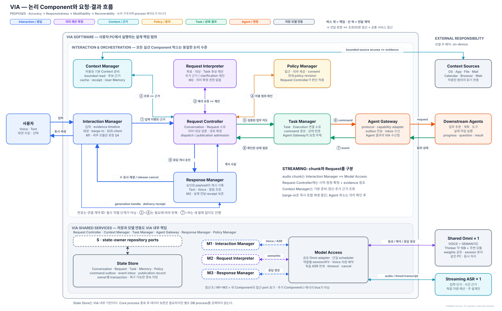

[draw.io 편집 원본](./diagrams/01-system-overview.drawio)

그림은 **VIA 소속, 논리적 책임, 외부 의존성**을 구분한다. 큰 VIA 경계 안의 실선 박스는 같은 수준의 논리 Component다. 위쪽은 interaction·orchestration, 아래쪽은 공통 저장·모델 연동 서비스다. 외부의 모델·Agent·Context source는 VIA가 내부 동작을 설계하지 않는 의존성이다. 외부 책임이라는 표시는 원격 배치를 뜻하지 않으며, 프로세스 배치는 §14에서 따로 다룬다.

핵심은 Request Controller가 입력과 근거를 결합하고 처리 권한을 확정하는 것이다. Request Interpreter는 의미를 제안하고, Context Manager는 근거를 제공하며, Policy Manager는 허용 범위를 판단한다. Request Controller가 그 결과를 적용한다. Policy Manager가 Response Manager를 직접 지휘하거나 Request Interpreter가 Agent를 호출하지 않는다.

| 그림의 연결 | 전달하는 계약과 책임 |
| --- | --- |
| ① Interaction Manager → Request Controller | 입력 시작·revision·확정·중단 이벤트와 시점별 evidence 참조; raw audio chunk 전달 경로가 아님 |
| ② Request Controller ↔ Context Manager | 허용된 기본 준비·추가 조회 요청과 후보·근거·조회 receipt |
| ③ Request Controller ↔ Request Interpreter | 확정 입력·근거를 사용한 해석 요청과 semantic proposal; 추가 읽기는 제안으로 반환 |
| ④ Request Controller ↔ Policy Manager | Context 접근·외부 제공·consent의 현재 허용 범위 확인; Request Controller가 읽기·처리 경로에 적용 |
| ⑤ Request Controller → Task Manager | 검증한 목표·대상·제약·Task 관계와 dispatch admission |
| ⑥ Task Manager → Agent Gateway | 생성·기록한 Agent Command; Agent Gateway가 capability·revision 조건을 확인하고 Agent로 전송 |
| ⑦ Agent Gateway → Task Manager | Agent에서 수신·기록한 event; Task Manager가 순서·중복·correlation을 검증해 업무 상태 반영 |
| ⑧ Task Manager → Request Controller | 확인된 진행·결과·실패·질문; Request Controller가 원래 Conversation·Request와 결합 |
| ⑨ Request Controller → Response Manager | 게시를 허용한 payload·출처·출력 소유권; Response Manager는 실제 게시 사실을 반환 |
| ⑩ Response Manager ↔ Interaction Manager | 표시·재생·release/cancel 명령과 generation handle·실제 전달 receipt |

번호는 연결을 설명하기 위한 ID이며 항상 순서대로 실행하는 단계가 아니다. ②~④는 입력 준비·추가 근거 확보·확정 시점에 사용하고, 이미 실행 중인 Agent의 결과는 새 사용자 발화 없이 ⑦~⑩로 돌아온다. Request Controller의 결합·검증은 모든 Agent progress에 semantic LLM을 다시 호출한다는 뜻이 아니다.

**State Store는 VIA 내부의 공유 저장 서비스다.** Conversation·Task뿐 아니라 Context memory·policy·송수신·응답 기록을 함께 지원하므로 semantic Control Plane에만 속하게 두지 않는다. 저장 대기가 dispatch·publication의 latency 경로에 포함될 수 있다. 영속 데이터는 Core process 종료 후에도 남아야 하지만, 별도 DB process를 강제하는 것은 아니다. 각 상태 소유자가 repository·transaction port를 통해 자기 상태를 기록한다.

점선 `S`와 `M1~M3`는 위 Component들의 공통 서비스 접근 관계를 펼쳐 놓은 표기다. 추가 Component, 모델 복제본 또는 메시지 bus가 아니다. S는 명시된 상태 소유자들의 State Store 접근이며, M1은 Interaction Manager의 S2S stream, M2는 Request Interpreter의 semantic 해석, M3는 Response Manager의 필요한 요약·음성 생성이다. M1~M3는 Model Access를 통해 하나의 on-device Omni를 공유한다. 음성·semantic은 역할이며 별도 가중치가 아니다. M1의 Streaming ASR 경로는 발화 인식·시간 근거를 위한 별도 경량 dependency다.

박스 색은 책임, 선 색은 전달 계약의 영역을 뜻한다. 파랑은 interaction·publication, 보라는 의미 제안·확정, 청록은 evidence·Context, 노랑은 policy·consent, 초록은 Task 상태·결과, 주황은 Agent command, 회색은 저장·모델 연동이다. 초록 event도 수신 즉시 확정 사실이 되는 것은 아니다. `→`는 전달 방향, `↔`는 조회·반환처럼 양쪽 메시지가 있는 protocol, 점선은 공통 서비스 접근 표기다. 양방향은 공동 상태 소유를 뜻하지 않는다. 선 두께에는 추가적인 권한·우선순위 의미가 없다.

## 4. Component와 상태 소유권

아래 표의 Component 열이 정식 명칭의 기준이다. 본문·표·상세 계약·그림에서는 대소문자와 단어를 동일하게 사용하며 축약명·별칭을 사용하지 않는다. 공간이 부족한 그림은 배치나 줄바꿈을 조정한다. `Task`, `Context`, `Response`처럼 데이터·개념을 뜻하는 용어는 Component 이름과 구분한다.

| Component | 책임 | 소유 상태 |
| --- | --- | --- |
| Interaction Manager | Channel I/O, 화면 evidence capture, 입력·근거 timeline과 speculative generation handle 관리; Model Access의 S2S client | 사용자·device session, 입력 stream, 짧은 evidence buffer, clock mapping, playback·barge-in·generation handle 상태 |
| Request Controller | Turn 수신, Request Graph, 의미 확정, 정정, 모든 사용자 질문·승인의 결합, 게시·dispatch admission | Conversation, Turn, Request Graph, semantic revision·commit, Pending User Interaction |
| Context Manager | 후보 탐색, bounded read, 근거 package·coverage, cache, 허용된 User Memory | Context cache, query receipt, 관측한 source revision, 기억과 삭제 상태 |
| Request Interpreter | 목표·대상·복합 관계·Task 관계·처리 방향의 후보와 field별 근거 제안 | 호출 중 임시 상태; `READY`·업무 상태·게시 권한의 권위는 없음 |
| Task Manager | 지속 업무와 Agent Execution projection, 진행·제어·복구 | Task, Execution 연결, source-confirmed 업무 상태 |
| Agent Gateway | Agent별 계약 변환, capability 확인, command 전송·event 수신·조회 | 연결 상태, capability profile, outbox 전송 상태, inbox cursor |
| Response Manager | 확정 사실에서 상세 Text·짧은 Voice를 구성하고 게시·발화 차례·실제 전달 범위를 관리 | publication outbox, 출력 소유권, 채널별 전달 상태 |
| Policy Manager | Context 접근·제공·기억 사용 통제 | 현재 권한, consent 범위·revision |
| State Store | transaction, 송수신 기록, 근거 참조, 복구 저장 | 영속 데이터; 상태의 의미는 각 소유 Component가 결정 |
| Model Access | 공유 Omni의 두 역할·ASR 연계, 단일 추론 scheduler·가중치 owner, 자원 admission·timeout·취소 | 역할별 session·KV, job queue·예산·runtime incarnation |

Turn Workspace는 Request Controller 내부의 요청별 작업 데이터다. 판단 검증은 Request Controller의 확정 절차에 포함하며 별도 Component 이름을 붙이지 않는다. 별도 서비스로 분리해 매 요청에 추가 왕복을 강제하지 않는다.

Interaction Manager는 여러 내부 모듈로 구현하지만 전체 그림에서는 다른 Component와 같은 논리 수준으로 표시한다. Request Interpreter의 prompt·schema 처리나 Agent Gateway의 provider adapter를 전체 그림에서 펼치지 않는 것과 같은 원칙이다.

| 내부 모듈 | 책임 | 금지되는 권한 |
| --- | --- | --- |
| Channel I/O | Voice·Text·UI 입출력, microphone·playback, barge-in, 실제 표시·재생 | 응답 내용·routing·Task 확정 |
| Evidence Capture | 화면·window·focus·pointer·selection revision 수집 | 지칭 대상의 의미 확정 |
| Timeline & Buffer | 입력 revision과 evidence 시각 결합, gap·clock mapping, ASR 전사·Omni 입력 해석·generation handle 연결 | speculative 응답의 게시 허용 |
| Turn-Taking Control | 사용자 발화·일시 멈춤·종료 후보와 현재 재생 상태, 발화 차례 검사·로컬 stop | 요청 의미·Task 확정, 임의의 출력 admission |

S2S provider 연결 자체는 Model Access가 소유한다. Interaction Manager는 Model Access client로 audio·control stream을 주고 transcript·generation handle을 받는다. 이 구분으로 device·OS adapter 변화와 model provider 변화가 같은 모듈에 섞이지 않게 한다. Model Access는 논리적인 연동·자원 관리 책임이다. Client는 Voice/Core에, Omni adapter·scheduler·가중치 owner는 Shared Inference Service에, ASR adapter는 독립 Speech Input Worker에 둔다. 별도 process의 client가 가중치를 복제하지 않는다.

State Store에 저장한다고 상태 소유권이 State Store로 넘어가지 않는다. Aggregate별 단일 writer를 유지한다. Request Controller는 Task 변경을 Task Manager에 요청하고, Task Manager는 Agent Gateway의 durable inbox event를 검증한 뒤 projection을 바꾼다. 여러 상태를 함께 확정해야 할 때는 owner가 State Store transaction을 요청한다.

Component 경계는 배포 단위가 아니라 변화와 상태 권한을 가두는 논리적 port다. S2S·semantic model provider 차이는 Model Access, Context source 차이는 Context Manager의 source adapter, Agent protocol 차이는 Agent Gateway adapter에서 canonical contract로 변환한다. Canonical schema와 persisted state는 version·migration 규칙을 가지며, provider 교체가 Request·Task·Response 의미 계약까지 직접 바꾸지 않게 한다. 공통 contract 자체가 바뀌면 영향받는 Architecture Element를 숨기지 않고 migration과 compatibility 범위를 명시한다.

## 5. Conversation·Turn·Request·Task·Execution

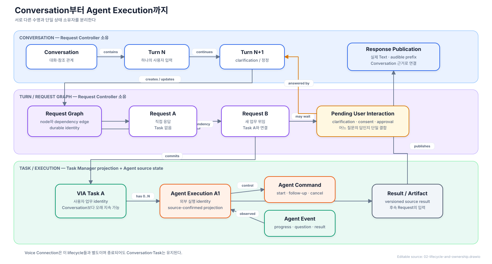

[draw.io 편집 원본](./diagrams/02-lifecycle-and-ownership.drawio)

복합 Turn의 독립 사용자 목표와 목표 사이 관계는 Request Controller가 소유하는 durable `Request Graph`가 된다. 한 업무의 내부 수행 단계를 동사별 node로 분해하지 않는다. 각 node는 독립 Request ID·handling·상태·입력과 결과 version을 가지며, edge는 `independent`, `sequential`, `data-dependent`, `conditional`과 source result version을 기록한다. Task Manager는 node가 Task에 연결된 뒤의 Task lifecycle만 소유한다.

- Conversation은 대화와 참조 관계를 유지한다. Voice 연결 종료나 새 대화 시작을 Task 종료로 취급하지 않는다.
- Turn은 한 번의 사용자 입력이며, 여러 Request를 포함할 수 있다. 대상이 여럿이라는 이유만으로 Request를 나누지는 않는다.
- Request는 현재 처리할 논리적 요청이다. 직접 응답에는 Task가 없어도 입력·답변·근거·대상은 남는다.
- Clarification 답변은 새 Turn이지만 원래 Request의 부족한 정보를 채운다. 이미 확정된 대상과 제약은 유지한다.
- 같은 목표·결과물의 수정은 기존 Task, 이전 결과를 참고한 별도 목표는 새 Task로 연결한다.
- Task는 사용자 업무 identity, Execution은 실제 Agent 실행이다. 동일 Task에 후속 Execution을 연결할 수 있다.

어느 Task에 연결할지의 의미 판단은 Request Interpreter가 제안하고, Request Controller가 근거·권한·관련 revision을 검증해 요청과 Task의 연결을 확정한다. Task Manager는 Task 상태와 Execution 관계를 관리한다. Context Manager는 Task Manager의 조회 인터페이스에서 활성·최근·명시 대상·자료 참조와 관련된 후보를 가져오며, 부족하면 제한된 추가 조회를 수행한다. 후보의 의미상 적합성은 Request Interpreter가 판단한다. Request Interpreter가 State Store를 직접 읽거나 전체 Task 이력을 매번 모델 입력에 넣는 구조가 아니다.

Task 상태는 업무 단계(준비·실행·입력 대기·완료·실패·취소), 제어 요청(수정·취소 요청 중), 확인 상태(확인됨·재조회 중·확인 불가)를 구분한다. 취소 접수와 취소 완료, 연결 단절과 업무 실패를 혼동하지 않는다.

VIA clarification, Agent 질문, Context consent와 Action approval은 모두 `Pending User Interaction`으로 등록한다. 이 기록은 interaction ID, Conversation·Turn·Request, 선택적 Task·Execution·question, 허용 답변, 생성 revision, policy revision과 만료 조건을 가진다. 짧은 답변을 어느 질문에 적용할지는 Request Controller 한 곳이 결정하며, 유일하게 결합할 수 없으면 다시 묻는다.

Request는 `RESOLVING`, `WAIT_CONTEXT`, `WAIT_USER`, `WAIT_DEPENDENCY`, `READY`, `HANDLING`, `COMPLETED / FAILED / CANCELLED / SUPERSEDED`를 구분한다. Direct Response와 내부 기억 변경은 Request만으로 처리하며 이를 위해 별도의 VIA-local 장기 Execution을 만들지 않는다. Agent 위임 시에는 지속 추적할 Task를 연결한다. Request의 접수·위임 완료와 사용자 업무의 Task 완료를 같은 상태로 표현하지 않는다.

새 Conversation을 열어도 기존 Task를 취소하거나 새 대화에 자동 이관하지 않는다. Agent 알림은 원래 Conversation과 Task view로 연결하고, 새 대화에서 기존 Task를 지칭하면 명시적인 참조 관계를 추가한다. Voice 재연결은 현재 Conversation을 다시 연결할 뿐 Request·Task를 재실행하지 않는다.

## 6. 요청 이해와 처리 확정

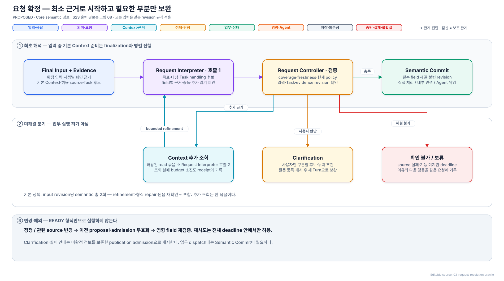

[draw.io 편집 원본](./diagrams/03-request-resolution.drawio)

입력 중에는 근거 수집과 값싼 Context 준비를 겹쳐 수행한다. 주 semantic 해석은 확정된 입력 revision을 사용한다. 모든 partial마다 모델을 호출하지 않는다. 발화 종료 시점의 화면 하나로 전체 발화의 지칭을 처리하지 않고, 표현별 시점의 증거를 사용한다.

최초 해석의 호출 경로는 **Interaction Manager → Request Controller → Request Interpreter**다. Interaction Manager는 최종 입력과 발화·화면·선택의 시점별 근거 참조를 Request Controller에 전달한다. Request Controller는 Context Manager에 기본 Context 준비를 요청하고 반환된 대화·Task 후보·자료 근거를 입력 revision·허용 범위·호출 예산과 결합해 Request Interpreter를 호출한다. 기본 Context 준비는 입력 중 시작할 수 있으므로 그림의 논리적 전달 순서가 발화 종료 후 모든 조회를 직렬로 시작한다는 뜻은 아니다.

추가 조회도 **Request Interpreter → Request Controller → Context Manager → Request Controller → Request Interpreter** 경로다. Request Controller는 추가 읽기 제안의 권한·범위·예산을 확인하고, 조회 결과를 받은 뒤 현재 revision과 남은 예산을 확인해 재해석을 요청한다. Interaction Manager나 Context Manager가 Request Interpreter를 직접 호출하지 않는다. 그림에 반복 등장하는 Request Controller는 같은 Component의 서로 다른 처리 단계이며, 해석 전 호출 제어와 해석 후 검증을 모두 소유한다.

Request Controller의 호출·예산·권한·revision 제어와 Context Manager의 조회·cache·receipt 구성은 일반 코드로 수행한다. 기존 identity·metadata·keyword 규칙으로 후보를 찾는 것과 자연어의 목표·지칭·Task 관계를 판단하는 것은 구분한다. 후자는 Request Interpreter가 공유 Omni의 semantic 역할로 수행하며, host 검증을 두 번째 의미 판단 모델로 구현하지 않는다. 파생 요약의 생성·수명은 별도 기억 계약을 따른다.

### 음성 stream과 요청 이벤트의 경계

| 입력·이벤트 | 실제 경로와 동작 |
| --- | --- |
| Audio chunk | Interaction Manager가 독립 Streaming ASR과 공유 Omni의 VOICE session에 Model Access 계약으로 전달한다. Capture는 추론 완료를 기다리지 않으며 Request Controller·Context Manager로 매 chunk를 중계하지 않는다. |
| InputStarted | Request Controller가 provisional Turn과 입력 revision을 만들고 현재 권한 안에서 값싼 기본 Context 준비를 요청한다. |
| 화면·선택·transcript revision | Interaction Manager가 timeline과 buffer에 기록한다. Request Controller에는 변경·gap·revision 참조를 전달하며 중간 알림은 묶을 수 있다. 원본 시점 근거는 합쳐 없애지 않는다. 관련 identity·선택·source가 바뀐 경우에만 기본 Context를 갱신한다. |
| InputFinal | 최종 입력 revision과 해당 구간 evidence 참조를 고정해 Request Controller에 전달한다. Request Interpreter는 이 revision으로 해석한다. 아직 partial transcript라면 확정 입력으로 취급하지 않는다. |
| 추가 근거 필요 | Request Interpreter가 부족한 field와 bounded read를 제안한다. Request Controller가 권한·예산을 확인해 Context Manager에 요청하고 제한된 재해석으로 돌아온다. |
| Barge-in / 새 입력 | Interaction Manager가 현재 재생을 즉시 멈추고 출력 세대를 무효화한다. Request Controller에는 새 입력·보류 신호, Response Manager에는 중단 receipt를 비동기로 전달한다. 재생 중단은 semantic 해석이나 게시 취소 승인을 기다리지 않는다. |

예를 들어 “이 그래프를… 아니, 저 표를 넣어줘”에서는 두 지칭 시점의 근거를 보존하지만 audio packet마다 자료를 검색하지 않는다. 최종 발화에서 정정한 대상을 해석하고 확정 전에는 위임하지 않는다. 수정 발화가 기존 command의 전송과 경쟁하면 §11의 dispatch 경계를 적용한다. 정규 입력 기록은 Streaming ASR의 revision·시간 근거를 사용한다. Omni가 다르게 해석하면 원음을 참조한 불일치 proposal로 남기고 Request Controller가 관련 revision을 보완한다. 시간 근거 부재를 현재 화면으로 채우지 않는다.

Request Interpreter는 목표·대상·Task 관계·처리 방향과 경쟁 후보를 함께 제안한다. 업무 수행 순서나 tool 계획을 새로 만들지 않는다. `READY` 여부는 모델이 선언하지 않고 Request Controller가 field별 상태와 다음 조건으로 계산한다.

1. 최신 입력·정정 revision인가?
2. 대상·Task가 실제 근거에 연결되고 필수 정보·명시된 제약이 보존됐는가?
3. 후보 탐색 범위·truncation·실패 source가 기록됐고, Action 대상의 coverage가 충분하며 동등 후보가 남지 않았는가?
4. Context 읽기·외부 제공 권한이 유효한가?
5. 해석이 의존한 Conversation·Task 후보·자료·policy revision이 바뀌었는가?
6. 요청한 Agent capability와 실행 전제조건을 사용할 수 있는가?

사용자 업무의 dispatch에는 `Semantic Commit`이 필요하다. Host 검증은 사용자의 진짜 의도를 증명하지 못하므로, 필수 field가 `RESOLVED`이고 admissible evidence가 있으며 충돌·미해결·coverage 불완전·stale dependency가 없을 때만 commit한다. 특히 외부 Action은 불완전한 후보 집합에서 기본값을 선택하지 않는다. 제한된 추가 조회 후에도 동등한 대상 후보가 둘 이상이면 사용자에게 차이를 질문한다는 원칙은 사용자와 합의했다. 후보가 하나만 남았어도 근거·coverage가 부족하면 확정하지 않는다.

응답 게시는 Request Controller의 publication admission을 요구한다. 그 근거는 확정 해석, §8의 Direct Admission, 또는 Task Manager가 확인한 Agent 상태·질문일 수 있다. Clarification·근거 확보 실패 안내는 미확정 field를 그대로 보존해 게시하며, 질문하려고 업무 의도를 억지로 commit하지 않는다. 이미 위임한 업무의 progress를 알릴 때에도 새 Semantic Commit을 만들지 않는다.

## 7. Semantic LLM 계약과 호출 예산

공유 Omni의 semantic 역할이 목표·대상·Task 관계·routing을 통합 해석한다. 이하 semantic LLM은 이 논리 역할을 뜻하며 별도 모델 적재가 아니다. 각 판단마다 필수 별도 모델 호출을 두지 않는다.

| 입력 | 내용 |
| --- | --- |
| 사용자 입력 | 원문, 확정 revision, 필요한 발화 시각 |
| 기본 근거 | 선택·화면·자료 식별 정보, 원문 또는 시각 근거, 출처 |
| 대화·Task | 관련 원문·확정 대상·대기 질문·업무 후보·확인된 상태 |
| 기능 범위 | 직접 처리 범위, Agent capability |
| 제한 | 허용 source, 조회·시간·출력 예산 |

| 출력 | 필수 의미 |
| --- | --- |
| Semantic Proposal | subrequest·관계, 목표·완료 조건·제약, referent·Task·handling 후보, 경쟁 후보와 배제 근거 |
| Field Resolution | field별 `RESOLVED / AMBIGUOUS / MISSING / N/A`, 값의 origin, evidence ID, freshness 요구, 충돌·미해결 사항 |
| Next Evidence Request | 부족한 field와 허용 source에서 읽어야 할 대상·범위; 실행 여부는 host가 결정 |
| Clarification Proposal | 이미 확정된 내용과 사용자만 구분할 수 있는 최소 차이; 실제 질문 등록은 host가 결정 |

**주 설계의 기본 운영 정책은 확정된 입력 revision당 semantic 호출 총 2회**다. 첫 해석 후 필요한 bounded read를 한 묶음 수행하고 재해석한다. 두 번째에도 필수 field가 해결되지 않으면 clarification 또는 근거 확보 실패로 끝내며 추측해 commit하지 않는다. 이 횟수는 후속 검증에서 바꿀 수 있는 resource policy다. Refinement·형식 repair·원음 재확인·stale 재해석에 쓰는 모든 semantic generation을 합계에 포함한다. 사용자 새 입력 없이 revision을 늘려 예산을 초기화하지 않는다. 세부 종료·응답 구성 계약은 [호출 예산](./control-and-lifecycle.md#3-core-해석읽기응답-예산)을 따른다.

직접 답변은 확정 전 speculative하게 생성할 수 있지만, decision envelope와 필수 proposition이 semantic commit에 일치한다고 확인한 뒤 게시한다. 긴 답변이 구조화 판단의 확정을 막거나 interactive 요청 queue를 점유하지 않도록 응답 생성 예산을 분리한다. Agent의 긴 결과 요약에는 별도 응답 생성 호출 1회를 허용하며 이를 해석 비용에 숨기지 않는다. 상태 template으로 충분한 progress·completion 안내에는 semantic LLM을 호출하지 않는다.

Core 직접 답변도 짧고 근거가 충분하면 첫 semantic 출력에 답변 초안을 함께 포함하고, 추가 구성·긴 요약이 필요하면 Response Manager가 **별도의 생성 호출 최대 1회**를 사용한다. 이는 해석 최대 2회와 별도 비용이며 같은 전체 deadline·공유 모델 queue를 사용한다. 형식 repair·stale 재검증을 새 호출 종류로 이름만 바꿔 무한 재시도하지 않는다. 재생 전 새 정정 revision이 연속 도착하면 이전 호출을 취소·폐기하고 최신 입력에 합친다.

LLM이 요청하는 도구는 bounded read-only Context 도구뿐이다. Host가 허용·실행하며 LLM은 권한, Task 상태, 외부 실행 도구를 직접 변경하지 않는다. 일반적인 자유 실행 ReAct loop로 확장하지 않는다.

## 8. S2S와 직접 응답

| 경로 | 대상 | Semantic LLM |
| --- | --- | --- |
| S2S 직접 응답 | 외부·개인·화면·과거 대화·Task·Action·최신성·복합 관계가 필요 없는 self-contained Voice 질문 | 같은 VoiceProposal + host gate로 생략 |
| Core 처리 후 음성 전달 | 화면·자료·Task 판단, clarification, 위임, 진행·결과 | 필요한 해석·구성에 사용 |

S2S는 Model Access를 통해 speculative 응답 생성을 수행할 수 있지만 스스로 게시 권한을 갖지 않는다. Channel I/O가 audio stream을 Model Access에 보내면 Model Access는 ASR transcript revision, Omni의 입력 해석과 speculative generation handle을 출처별로 Timeline & Buffer에 돌려준다. Handle은 입력 revision·session·출력 세대에 결합하며 audio는 Interaction Manager의 buffer에 보류한다. Interaction Manager는 이 handle을 Input + Evidence Record와 함께 Request Controller에 전달할 수 있지만 승인 전에는 재생하지 않는다.

Request Controller는 모든 입력에 Request identity를 만들고 직접 경로의 허용 여부를 `Direct Admission Record`로 기록한 뒤 한 경로에만 응답 소유권을 부여한다. 허용한 경우 generation handle과 확정 proposition을 Canonical Response Payload에 묶어 Response Manager에 보낸다. Response Manager가 handle·Request·input revision·출력 세대를 확인해 Interaction Manager에 release 또는 cancel을 명령하고, Interaction Manager는 실제 표시·재생·중단 receipt를 돌려준다. 따라서 직접 S2S 응답도 `Model Access ↔ Interaction Manager ↔ Response Manager` 전달 protocol과 `Request Controller → Response Manager` admission을 모두 지난다. 외부 근거·개인 자료·화면 지칭·과거 대화·Task 관계·Action/control·최신성·복합 관계의 가능성이 하나라도 남으면 Core로 보낸다. admission 전 audio는 재생하지 않고, 기각한 generation은 폐기한다.

허용된 S2S 응답도 Text·audio generation과 사용한 근거를 같은 Response Record에 남긴다. 동일 Request에 S2S와 Core가 중복 응답하지 않으며 기록을 위해 재실행하지 않는다. Text 일반 질문에는 S2S 경유를 강제하지 않는다. 이 gate가 정확도를 지키면서 실제 latency 이점을 남기는지는 아직 검증되지 않았다.

S2S 직접 응답은 **자체 지식으로 답할 수 있는 명백한 독립 질문에 최소한으로 허용한다는 사용자 지정 방향**으로 정한다. “광합성이 뭐야?” 같은 첫 질문은 직접 경로가 될 수 있다. “두 번째 것을 설명해줘”처럼 이전 대화의 지칭이 필요하면 Core로 보낸다. 질문 순서가 아니라 맥락 해석의 필요 여부가 기준이다. S2S 쪽에 자료·Task·기억 해석이나 read/tool/planning loop를 붙이지 않으며, 앞선 대화 view 기반 후속 대화 fast path 제안은 채택하지 않는다.

최소 admission은 **현재 질문만 받는 Omni VoiceProposal + Request Controller의 좁은 host gate**로 선택했다. 허용 분류는 일반 개념 정의·안정된 일반 설명이며, 전사 일치·dependency flags·질문/정정 상태·현재 revision·Text/audio 대응을 검사한다. Direct 역할에는 과거 대화·Task·화면을 주지 않는다. 조건 미충족·unknown·형식 오류는 같은 Request의 Core 경로로 인계하고 speculative audio를 폐기한다. [구체 계약과 그림](./control-and-lifecycle.md#2-최소-s2s-직접-응답-계약)에 허용 조건·실패 경로·입력 예시를 정의했다. 단어 규칙·confidence나 같은 모델의 자기 판단만으로 숨은 맥락 의존성을 완벽히 판별한다고 가정하지 않는다. 실제 지원 근거는 [모델 기능 확인](./model-capability-review.md)을 참고한다. 자체 지식의 사실 정확성을 admission만으로 보장하는 것은 아니다.


[draw.io 편집 원본](./diagrams/12-admission-and-control.drawio)

### 확보해야 하는 모델 기능

- Speech Input: Streaming ASR의 입력 기록·revision·지칭 시각 근거. Omni 음성 역할: 제한된 직접/Core 제안과 지정 응답의 의미 보존 음성 생성. Host: 출력 제어와 local barge-in.
- 공유 semantic LLM: 구조화된 요청 해석. UI 구조 정보가 없는 이미지 화면까지 이해하려면 시각 근거 처리 기능.
- Core의 응답도 같은 Omni의 음성 역할로 음성화한다. 입력 근거용 경량 Streaming ASR은 명시된 별도 dependency다. 추가 VAD·aligner·OCR·TTS 등이 필요하면 모델 inventory·비용을 드러내며 자동으로 포함하지 않는다.

이 기능이 실제 dependency에 확보되었다는 주장이 아니다. 시각 입력이나 시간 근거를 제공하지 않는 모델로 전 기능이 가능한 것처럼 설명하지 않는다. 모델팀에 요구할 계약도 이 설계에서 정의한다. Reference와 개발 방향, 공개 기능의 근거 및 통합 확인이 필요한 부분은 [모델 확인 원장](./model-capability-review.md)에 있다.

## 9. Context·cache·stale 처리

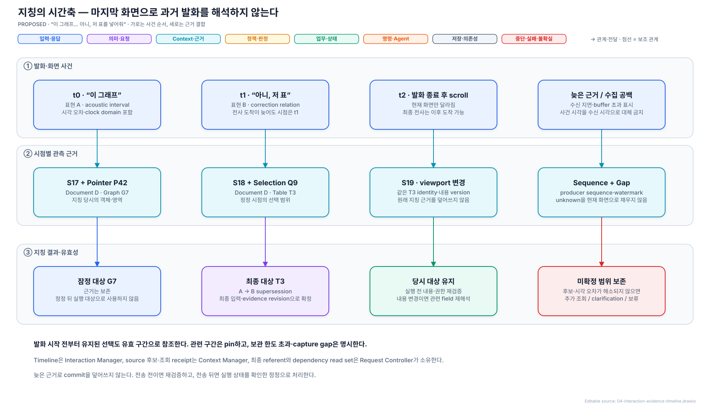

[draw.io 편집 원본](./diagrams/04-interaction-evidence-timeline.drawio)

### 관측 근거의 수집과 Context 조회를 분리한다

Interaction Manager는 발화 당시의 화면·포인터·선택·활성 앱·창·문서 식별 정보를 확보한다. Context Manager는 이를 포함해 요청 해석에 필요한 내부·외부 근거를 구성하고, 필요한 문서 본문·대화·Task 상세를 허용된 조회로 가져온다. 활성 창과 포인터는 관측 사실이며 사용자의 시선·의도를 확정한 사실이 아니다.

**수집 trigger는 streamed text의 각 조각이 아니라 OS/UI 사건과 유한한 capture 예산이다.** 권한이 있고 interaction 입력이 활성화된 동안 현재 관측 상태와 짧은 pre-roll을 RAM에 유지한다. 발화가 시작되면 해당 구간과 직전 상태를 보존하고, 확정 전사 시각에 맞춰 실제 지칭 후보를 해석한다. 수집 여부를 매번 LLM에 묻거나 “이거”가 전사될 때까지 기다리지 않는다.

| 관측 정보·사건 | Interaction Manager의 수집 규칙 | 비용·누락 처리 |
| --- | --- | --- |
| 앱·창·문서 identity | focus·창 전환·문서 전환 사건에서 시각·revision과 새 상태 기록 | 허용된 adapter가 제공한 metadata만 사용; 식별 불가는 unknown이며 모든 실행 앱의 내용을 읽지 않음 |
| 선택·caret·클릭 | 변경 사건과 좌표계·대상·유효 구간 기록; 발화 전부터 유지된 선택도 연결 | 선택 전환을 최신 값 하나로 덮지 않음; 사건 유실·queue 초과는 gap |
| 포인터 이동·drag 경로 | 유한 sampling 주기로 위치·시각 기록, 클릭·선택 전환 사건은 별도 보존 | 고빈도 raw move를 전부 전송하지 않음; sampling 간격·시각 오차 때문에 후보가 겹치면 모호함 유지 |
| 화면 이미지 | 허용된 화면/창에서 변경 신호를 받아 최대 capture 빈도 안에서 snapshot 생성; 변경 신호가 없으면 제한된 주기 sampling; 동일 화면은 참조 재사용 | 연속 animation·scroll도 byte·frame·처리량 상한 적용; 관측되지 않은 중간 화면을 복원했다고 하지 않음 |
| InputStarted / InputFinal | 시작 시 직전 관측 상태와 발화 구간 pin, 종료 시 producer watermark 또는 gap과 입력 revision 결합 | capture 완료를 무한 대기하지 않음; pin 상한·보존 기한 초과 시 근거 부족을 표시하고 재지칭/clarification |
| 입력 비활성·OS lock·권한 철회 | 수집 중지와 해당 raw buffer 해제 | 해제된 근거를 다른 cache나 현재 화면으로 대체하지 않음 |

Resource Profile은 pointer sampling 간격, 화면 최대 capture 빈도·fallback 주기, pre-roll 길이, RAM ring/pin byte 상한, producer queue 한도·watermark 대기 시간을 유한 값으로 가진다. 기본 capture는 일반 코드와 OS/UI adapter로 수행하며 전체 화면의 의미 분석이나 문서 본문 읽기를 매 frame에 붙이지 않는다. 값은 후속 기기 binding이며 여기서 임의의 Hz·MB 또는 무손실 보장을 선언하지 않는다. 상한 때문에 필요한 근거가 빠지면 그 범위를 명시하고 잘못된 대상에 자동 실행하지 않는다.

Request Controller는 InputStarted에 기본 Context 준비를 요청하고 관련 문서·선택·source 변경에만 갱신한다. 중간 변경 알림을 묶어도 원본의 사건 시각·revision·gap을 없애지 않는다. Partial transcript 도착만으로 화면 capture·자료 검색·semantic 호출을 새로 시작하지 않는다. Context Manager의 추가 읽기는 Request Interpreter의 제안을 Request Controller가 허용한 뒤 수행한다.

### 미리 준비할 근거와 필요한 경우의 추가 조회

| 범위 | 기본 준비 | 필요 시 조회 |
| --- | --- | --- |
| 화면·선택 | foreground, 문서 identity, 선택, pointer·focus 시점 | 관련 영역, UI 구조, 원문 |
| 대화 | 최근 원문, 확정 대상, 대기 질문 | 더 오래된 관련 대화 |
| Task | active·최근·현재 표현과 관련된 Task 요약·결과물 참조 | 상세 상태, 과거 업무 검색, 최신 Agent 상태 |
| 파일·메일·일정 | 이미 연결된 자료 metadata | 한정된 검색·본문 |
| 기억 | 허용된 관련 선호 | 특정 기억 상세 |
| Agent | capability·연결 상태 | 실행별 상세 상태 |

기본 준비도 현재 권한 안에서 수행한다. Context는 자료 identity, 필요한 원문·이미지와 출처·revision을 묶는다. 요약 하나가 원문과 후보의 충돌을 모두 대체하지 않는다.

- cache key는 자료 identity·revision·접근 범위를 포함한다.
- 변경 알림으로 무효화하고 알림 없는 source에는 유효 기간·재조회 조건을 둔다.
- 후보 탐색은 query, source 집합, 범위, 전체·반환 후보 수, truncation, 실패 source, 제외 후보와 이유를 `Evidence Query Receipt`에 남긴다.
- Action 대상의 bounded completeness가 불명확하거나 필수 source가 실패했으면 `Semantic Commit`을 금지한다. read-only 답변도 누락·staleness가 결론에 영향을 주면 한계를 표시하거나 clarification한다.
- Request Interpreter가 실제 의존한 receipt ID의 `Context Read Set`만 dispatch 전에 재검증하여 무관한 source 변화로 전체 요청을 다시 해석하지 않는다.
- 권한 철회·기억 삭제 시 관련 cache와 모델 session 재사용을 중단한다. 지속 기억은 명시적 허용과 확인·수정·삭제를 지원한다.
- 짧은 화면 buffer를 유지하고 현재 요청이 참조한 구간을 필요한 수명 동안 보존한다. 전체 화면·음성을 영구 보관하지 않는다.
- 증거 유실·buffer 초과는 공백으로 표시한다. 현재 화면으로 과거를 복원한 것처럼 채우지 않는다.

발화 중 지칭은 `Interaction Evidence Timeline`으로 연결한다. 각 evidence event는 producer, monotonic sequence, clock domain, capture·receive time, clock mapping uncertainty와 gap을 가진다. Referential utterance span은 final transcript revision, acoustic interval, display·window·document·viewport identity, screen/UI revision, pointer·selection interval과 candidate referent set을 가리킨다. Partial transcript가 바뀌거나 event watermark 전후로 늦은 evidence가 들어오면 영향을 받은 span과 field만 무효화한다.

**당시 무엇을 가리켰는가**와 **지금 그 대상에 적용 가능한가**를 나눈다. Scroll만 바뀌면 과거 지칭을 유지하고, 대상의 내용·identity가 변경·삭제되면 관련 해석을 재검증한다. 무관한 화면 revision 변화로 전체 요청을 재해석하지 않는다.

### Context 사용 권한과 기억의 수명

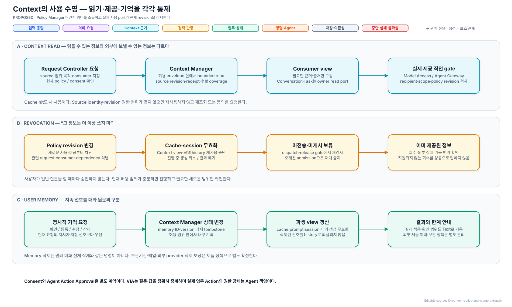

[draw.io 편집 원본](./diagrams/10-context-policy-and-memory.drawio)

Context Manager는 Conversation·Task·capability를 임의로 소유하거나 변경하지 않는다. Interaction Manager의 시점별 입력 근거, Request Controller의 대화·요청, Task Manager의 업무, Response Manager의 실제 게시·전달 기록, Agent Gateway의 capability를 각각의 versioned read port로 조회해 Evidence Package를 만든다. snapshot마다 source revision을 남기며 여러 owner를 읽은 결과를 하나의 동시 snapshot이라고 가정하지 않는다. 관련 revision의 일관성은 commit에서 확인한다. State Store에 접근할 수 있다는 이유로 다른 owner의 내부 schema에 직접 의존하지 않는다.

Policy Manager는 `source / recipient / purpose / scope / policy revision / expiry`로 허용 범위를 정의한다. Request Controller가 승인한 envelope를 Context Manager, Model Access, Agent Gateway, Response Manager가 **실제 읽기·제공·게시 직전**에 검사한다. 이는 각 Component에 별도 정책 엔진을 복제하는 것이 아니라 같은 versioned 정책 계약을 강제하는 것이다. 현재 revision을 확인할 수 없으면 보호정보를 새로 사용하지 않는다. 일반 질문마다 사용자 승인을 추가하지는 않는다.

권한 철회는 새로운 사용을 차단하고 관련 cache·prompt view·model session을 무효화하며 진행 중 생성의 게시를 막는다. 이미 외부에 제공한 정보나 수행된 Action이 소급 회수되지는 않는다. 외부 provider의 삭제 지원 여부와 실제 확인 범위를 구분해 안내한다.

User Memory 등록·수정·삭제는 Request Controller가 의미를 확정하고 Context Manager가 자기 aggregate를 변경한다. 삭제 tombstone·memory revision을 파생 view와 재시작 시에도 적용하여 과거 대화나 이전 model session에서 삭제된 선호를 자동 복원하지 않는다. 삭제 사실을 기록하는 audit에는 삭제한 원문을 복제하지 않는다. Memory 삭제와 원래 Conversation 삭제는 별도 요청이다. [보관·삭제 계약](./memory-and-context-lifecycle.md#4-보관-기본값)은 raw 상시 저장 없음, 최소 evidence의 24시간 cache, 대화/Task의 명시 삭제, 논리 삭제와 실제 정리 상태, 외부 backup 한계를 정한다.

단기 작업 Context, 중기 Conversation·Task 작업집합, 장기 허용 User Memory의 세 수명을 분리한다. Local embedded DB가 원본·revision·tombstone을 관리하고 큰 evidence는 manifest로 연결한 파일에 둔다. 활성 Task·미전달 질문·command는 cache가 아니라 내구 원본이다. 요약은 파생 view이며 대상·수치·부정·조건·권한·상태의 원본을 대체하지 않는다. 자동 장기 기억 승격은 하지 않는다.

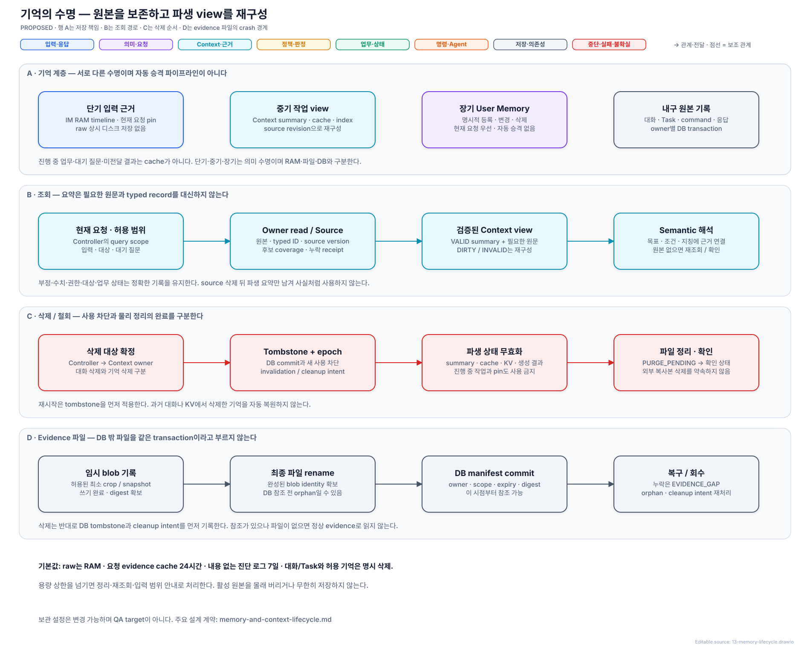

[draw.io 편집 원본](./diagrams/13-memory-lifecycle.drawio)

[기억·Context 수명](./memory-and-context-lifecycle.md)은 선택/포인터/복수 영역/이미지/숨은 자료의 후보 coverage, 원본 재조회, cache 무효화, raw 보관, 삭제 전파, DB와 evidence 파일의 crash 일관성을 정의한다.

## 10. 주요 데이터 계약

아래는 필수 의미를 정의한 논리 계약이다. 상태 전이·검사·실패 의미는 [판단·제어 계약](./control-and-lifecycle.md)에 정했다. 코드용 직렬화 schema는 후속 구현 항목이다.

| 계약 | 핵심 내용 |
| --- | --- |
| Input Record | Conversation·Turn ID, 원문·modality, 입력 revision, producer sequence, 사건·수신 시각과 clock domain |
| Interaction Evidence Timeline | utterance span, transcript revision, acoustic interval·오차, display/window/document, screen/UI revision, pointer·selection interval, capture gap |
| Evidence Query Receipt | query와 source 범위, 관측 revision·유효 구간, 전체·반환 후보, truncation·실패, 제외 후보·이유, cache provenance |
| Resolution Record | subrequest graph, 목표·완료 조건, hard/soft 제약, referent·Task·handling 후보, field별 상태·origin·evidence·freshness·충돌·미해결 |
| Semantic Commit | immutable 확정 해석, 입력·Conversation·Task 후보·evidence·policy revision vector, dependency read set, supersession 관계 |
| Pending User Interaction | 질문·승인 유형, 결합할 Request·Task·Execution, unresolved field·후보, 허용 답변, revision·만료·응답 Turn |
| Agent Command | Request·Task·command ID와 type, 목표·완료 조건·제약·대상, Execution·artifact version, approval·policy revision, precondition, epoch·중복 방지 key |
| Agent Event | Agent·Execution·event ID, command correlation, source sequence/revision, emitted·received 시각, 상태·질문·artifact version·실패·확실성 |
| Canonical Response Payload | 게시할 proposition·질문·불확실성, Request·Task·result identity, source·staleness, admission 근거·revision, notification disposition, 상세 Text·Voice 요약별 view와 공통 사실 참조, 선택적 검증된 generation handle |
| Response Record | payload·publication ID, 상세 Text와 Voice 요약의 별도 content version·source 연결, Voice generation과 실제 audible prefix/range, 채널별 표시·대기·재생·중단·ack 상태 |
| Domain Event / Delivery Intent | event ID, owner aggregate·revision, 원래 Conversation·Request·Task, 원인 event, consumer 적용 상태와 publication ID |
| Use Envelope | source·recipient·purpose·scope, policy revision·expiry, 요청·generation 결합; 실제 사용 port에서 검증 |
| Model Call Envelope | job/session·Request·input/context/policy revision, role/job kind·출력 schema, deadline·cancel generation·resource class·token/KV budget·runtime incarnation |
| SpeechEvidence | stream·sample range, partial/final transcript revision·대체 구간, span 시각·오차·방법, source build·capture gap; Omni 불일치는 별도 proposal |

외부 문서·Agent 내용은 데이터이며 VIA 정책을 바꾸는 지시가 아니다. 현재 권한은 과거 대화의 동의 문장이 아니라 Policy State에서 확인한다. Agent Action Approval은 VIA가 해당 실행에 중계하고 실제 Action의 권한 강제는 Agent가 담당한다.

```text
목표: 발표자료에 선택한 그래프 추가
완료 조건: 수정된 발표자료의 참조 제공
대상: 발표자료 ID와 확인한 version
입력 자료: 그래프 원본 또는 확인 가능한 참조
제약: 기존 내용 유지, 사용자 지정 위치 반영
관련 업무: Task A
```

위 계약은 실제 편집 단계·도구 선택을 지정하지 않는다. 대상 version이 중요하면 Agent가 실행 시점에도 확인해야 한다. VIA의 사전 검증만으로 외부 변경과의 경쟁까지 해결되지는 않는다.

## 11. 동시성·정정·취소·전송

Request Controller는 Conversation별, Task Manager는 Task별 짧은 상태 전이를 직렬 처리한다. 모델·네트워크 대기 중 lock을 잡지 않는다. 비동기 응답은 시작 당시 revision과 현재 revision을 비교해 적용한다. 늦게 도착한 이전 해석은 최신 요청을 덮어쓰지 않는다.

Voice 수신과 기본 Context 준비, 독립 source 조회, 여러 Agent event 수신, 장기 업무와 새 사용자 질문은 겹쳐 수행할 수 있다. Semantic LLM은 공유 자원이므로 병렬 제출을 무료 병렬 추론으로 간주하지 않는다.

**주 설계는 공유 Omni의 동시 session + 독립 경량 Streaming ASR + 기한·자원 예약 scheduler다.** 사용자 발화의 capture·recognition은 semantic 완료를 기다리지 않는다. Omni의 VOICE/SEMANTIC session도 동시 활성화하며 Voice 계산 단위에 자원을 예약하고 긴 semantic prefill·요약을 작은 단위로 나눈다. Local playback stop은 추론 scheduler 밖이다. 단순 queue 우선순위만으로 실행 중 거대 kernel을 선점할 수 있다고 가정하지 않는다.

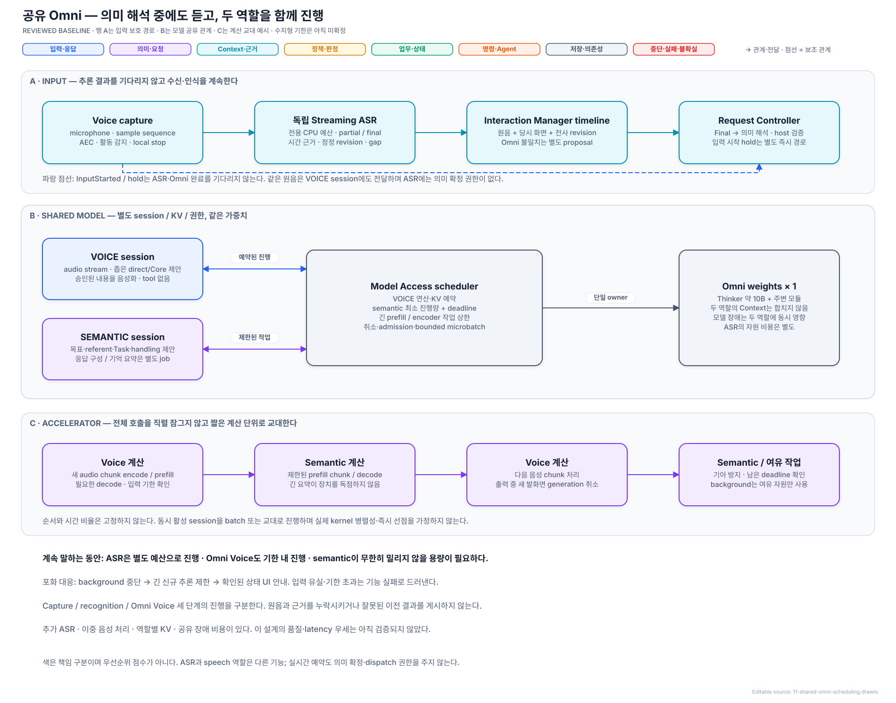

[draw.io 편집 원본](./diagrams/11-shared-omni-scheduling.drawio)

[공유 Omni 상세 설계](./shared-omni-runtime.md)는 역할별 계약·KV 분리, CPU ASR 예산, Omni Voice service 예약, semantic 최소 진행량, 취소·과부하·전사 불일치·모델 장애를 정의한다. 약 10B는 reference와 같은 Thinker 표기이며 전체 weights와 peak memory는 별도다. 지원 장비·workload의 수치 예산과 실측은 아직 없다. 녹음 backlog만 유지한 것을 정상 동시 처리로 보지 않는다.

Queue는 모두 유한하다. 로컬 재생 중단은 모델·State Store queue를 기다리지 않고, host의 명시적 제어 접수와 Agent terminal/question event는 일반 progress보다 먼저 처리한다. Progress는 Task별 최신 상태로 합칠 수 있지만 완료·실패·질문·정정 intent는 조용히 버리지 않는다. 내구 수신 여력이 없으면 지원되는 source에 backpressure를 걸고, 유실이 가능한 source는 gap을 기록해 재조회한다. 새 일반 요청을 수용할 수 없으면 바쁜 상태와 재시도 가능 여부를 명시하며 완료나 Agent 접수로 표시하지 않는다. 수치 설정은 Resource Profile의 필수 binding이며 무제한 queue는 허용하지 않는다.

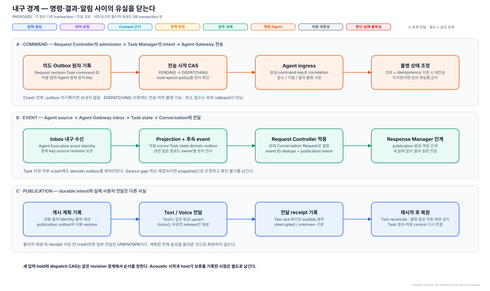

[draw.io 편집 원본](./diagrams/05-dispatch-and-recovery.drawio)

| 정정·취소 도착 시점 | 처리 |
| --- | --- |
| 전송 시작 전 | 관련 미전달 요청을 보류하고 최신 입력 반영 |
| 전송 시작 후·접수 불명 | 실행 여부 확인 후 수정·취소 연결 |
| 실행 중 | 지원되는 수정·취소 명령 전달 |
| 이미 완료 | 완료 사실과 가능한 후속 수정 안내 |

새 Voice 입력 시작은 현재 Conversation의 아직 보내지 않은 요청을 잠시 보류한다. 기존 모든 Task를 자동 중단하지 않는다. 선형화 지점 전에 들어온 정정·취소는 기존 command를 보내지 않고 새 semantic revision과 `supersedes_command_id`로 표현한다. 그 뒤에는 이미 막았다고 주장하지 않고 `UNKNOWN`, `CANCEL_REQUESTED`, `CORRECTION_PENDING` 중 실제 확인 상태를 기록한다.

선형화의 구체적인 주 설계는 State Store에서 `PENDING → DISPATCHING`을 변경하는 조건부 transaction이다. Agent Gateway는 동일 transaction에서 Request Controller의 admission revision·Conversation hold와 Task Manager의 command epoch·현재 policy revision을 검사한다. 새 입력 보류·정정도 같은 조건을 변경하므로 먼저 commit한 전이가 순서를 결정한다. 네트워크 전송은 transaction 밖에서 수행하고 crash 시 `DISPATCHING`을 접수 불명으로 취급한다. 실제 acoustic 입력 시작과 host의 hold 기록 사이에는 인식·IPC 지연이 있으므로 물리적으로 먼저 말하기 시작했다는 사실만으로 이미 나간 command를 막았다고 주장하지 않는다.

새 입력의 정정/기존 요청 관계를 먼저 확정한 뒤 영향을 받지 않는 기존 admission의 hold를 현재 revision으로 해제한다. 새 Turn 자신의 처리까지 hold 때문에 교착시키지 않으며, 해석 중에는 이전 PENDING command만 보류한다. 입력이 끊기거나 전체 deadline을 넘기면 `WAIT_USER`로 남기고 안내하며, timeout만으로 잠재적으로 수정된 Action을 자동 전송하지 않는다. 보류는 해당 Conversation의 미전송 command 범위에 한정하고 실행 중인 무관한 Task에는 전파하지 않는다.

Outbox는 재시작 후 의도를 복구하지만 외부 exactly-once 실행을 단독 보장하지 않는다. Agent가 중복 방지 key·epoch precondition을 지원하면 같은 key로 재전송한다. 미지원이고 전송 결과가 불명이면 조회 없이 재실행하지 않는다. 취소 전송도 취소 완료나 외부 변경의 rollback을 뜻하지 않는다. 필요한 precondition이나 상태 조회가 없는 Agent에는 정정·취소 정확성이 필요한 Action을 맡기지 않거나 보장 수준을 사용자에게 낮춰 표시한다.

## 12. 장기 업무·복합 요청·Agent event

**Agent Gateway로 업무 요청을 보내는 주체는 Task Manager다.** Request Controller가 의미와 dispatch admission을 확정하면 Task Manager가 Task·Execution 관계와 immutable Agent Command를 만들고 outbox에 기록한다. Agent Gateway의 전송 worker는 현재 command epoch·admission 유효성과 Agent capability를 확인한 뒤 전송한다. 정정·취소와 전송 시작의 경쟁은 §11의 선형화 경계를 공유한다. Agent Gateway가 독자적으로 목표·대상·처리 경로를 선택하지 않는다.

Command의 불변 payload는 Task Manager, 전송 시도·접수 불명·재조회 기록은 Agent Gateway가 각각 소유하고 command ID로 연결한다. 같은 레코드의 의미 field를 두 Component가 경쟁해서 변경하지 않는다.

Agent 선택에 필요한 capability profile은 Agent Gateway가 소유한다. Request Interpreter는 요구 capability와 후보를 제안하고 Request Controller가 사용자 지정 Agent·기능·권한·제약·상태 조회·중복 방지·제어 지원 조건을 검증한다. 기능적으로 동등한 후보는 설정된 선호와 안정적인 우선순위로 선택한다. 비용·권한·완료 조건이 달라지는 대체는 사용자 확인 없이 조용히 적용하지 않는다. 적합한 후보가 없으면 미지원으로 안내하며 VIA가 업무 실행을 대신하지 않는다. 전송 후 접수 불명인 업무를 다른 Agent로 넘기기 전에는 기존 실행 상태부터 확인한다.

**Agent 선택은 의미 판단과 결정적 조건 검사를 결합한다.** Task Manager는 확정된 선택으로 업무를 구성하는 주체이며, Agent를 고르기 위해 별도 LLM을 호출하지 않는다.

| 단계 | 주체·방식 | 전달·확정하는 정보 |
| --- | --- | --- |
| 기능 정보 확보 | Agent Gateway가 소유한 versioned capability profile을 Context Manager가 조회 | Agent identity·기능·접근 범위·연결 상태·조회/중복 방지/제어 지원과 profile revision |
| 의미상 적합성 제안 | Request Interpreter가 기존 요청 해석의 공유 semantic 호출에서 판단 | 업무 전체에 필요한 capability·사용자 제약·후보 Agent·선택 근거; 내부 수행 단계나 실행 tool 계획은 만들지 않음 |
| 후보 검증·최종 선택 | Request Controller가 일반 코드로 조건 검사 | 등록 profile과 요구 기능·현재 권한·사용자 지정·제어 조건을 대조; 허용된 동등 후보는 설정된 선호·안정적인 우선순위로 확정 |
| 업무 구성·전송 | Task Manager가 선택된 Agent binding과 명령을 기록하고 Agent Gateway가 전송 | 선택한 Agent·profile revision·admission·Task/Execution 관계; 전송 시 조건이 바뀌면 재검증하며 조용히 다른 Agent로 변경하지 않음 |

예를 들어 “이 자료를 요약해서 김대리에게 메일로 보내줘”는 Request Interpreter가 요약·메일 발송을 포함한 전체 목표를 처리할 후보를 제안하고 Request Controller가 조건을 확인해 하나의 Task로 위임한다. 기존 Execution의 상태 조회·정정·취소는 원래 binding으로 전달하며 새 Agent 선택 문제로 바꾸지 않는다. 후보의 설명 문장은 권한이나 기능 지원의 증거를 대신하지 않는다. 등록된 기능이 있다는 사실은 실제 도메인 품질이 가장 높다는 보장이 아니며, VIA가 Agent 내부 업무 능력을 평가해 최적 성능을 보장한다고 주장하지 않는다.

**Downstream Agent 결과를 직접 받는 곳은 Agent Gateway다.** Push event, stream 또는 polling 반환을 canonical Agent Event로 변환해 durable inbox에 먼저 기록한다. Task Manager가 correlation·중복·순서를 검증하고 `inbox 적용 상태 + source cursor + Task projection`을 한 transaction으로 반영한다. terminal event에 연결된 pending question이 있으면 Request Controller가 소유한 종료 전이도 같은 transaction에 참여시켜 오래된 질문을 닫는다. Task Manager가 Request Controller 상태를 임의로 쓰지 않으며, 뒤늦은 답변 admission도 현재 Task·question revision을 검사한다.

Task Manager는 확인된 변경을 Request Controller에 알린다. Request Controller는 원래 Conversation·Request·Task에 결합하고, 질문 등록·알림 시점·공개 범위를 결정해 Response Manager에 publication admission과 payload를 보낸다. 이 경로는 새 발화가 없어도 동작하며 일반 progress에는 semantic LLM 호출이 필요 없다. 긴 결과를 요약해야 할 때만 Response Manager가 공유 모델에 별도 생성 요청을 한다.

이 알림을 메모리 callback으로만 처리하지 않는다. Task projection과 **domain event outbox**를 같은 transaction에 기록하고 Request Controller가 event ID로 멱등 적용한다. Request Controller의 Request·질문 갱신과 publication intent도 함께 기록하고 Response Manager가 publication ID로 인계받는다. 따라서 Task 상태 저장 직후 또는 Response Manager 인계 직전에 crash해도 사용자에게 전달할 결과·질문을 다시 찾을 수 있다. 관련 질문의 종료 등 여러 owner 전이가 필요한 경우 각 owner가 만든 변경을 하나의 Unit of Work로 commit하며, State Store가 업무 의미를 판단하거나 owner 권한을 대체하지 않는다.

정상 progress마다 무조건 query하지 않고 다음 경우 재조회한다.

- event 순서 공백 또는 상태 모순
- 연결 복구, VIA 재시작
- 최신 상태를 요구하는 사용자 요청

중복 event를 제거하고 오래된 progress가 terminal state를 되돌리지 못하게 한다. Source 순서·revision을 제공하지 않는 Agent는 event를 변경 hint로 사용하고 조회로 확정한다. 조회도 불가능하면 확인 불가를 보존한다.

“자료를 요약한 다음 김대리에게 보내고, 발표자료는 계속 만들어”에서는 요약·발송 전체를 하나의 새 Task로 Agent에 넘기고, 발표자료는 별도 기존 Task로 유지한다. 요약 결과를 만드는 방법과 발송의 내부 의존·실패 처리는 해당 Agent 책임이다. VIA가 요약을 먼저 수행하거나 두 단계를 별도 Task로 쪼개지 않는다. Agent가 보고한 요약 완료·발송 실패는 같은 Task의 부분 결과이며, 독립된 발표자료 Task에는 전파하지 않는다.

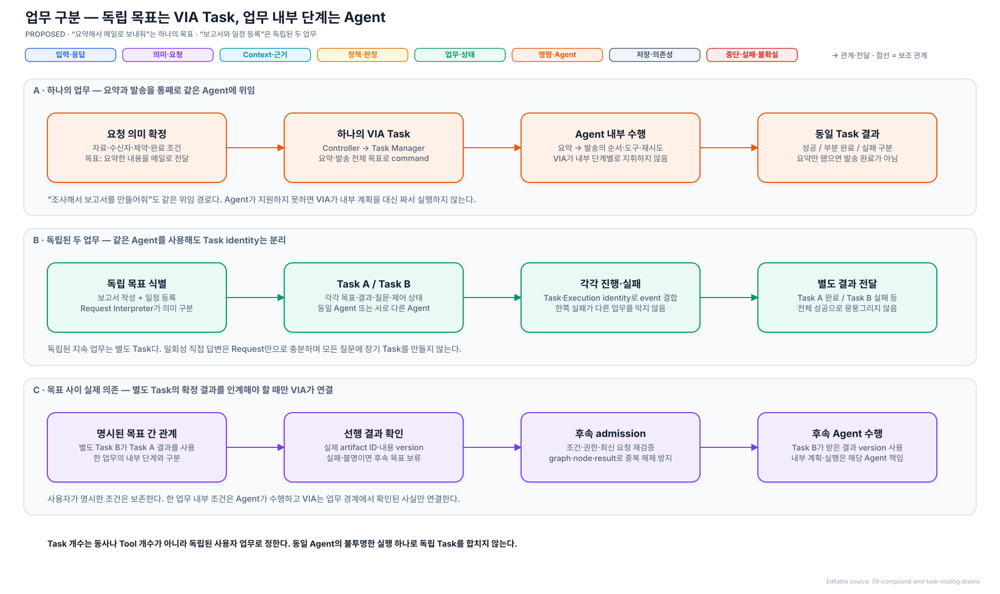

[draw.io 편집 원본](./diagrams/09-compound-and-task-routing.drawio)

별도 사용자 목표 사이에 실제 의존 관계가 있을 때만 Request Controller는 의존 node를 `WAIT_DEPENDENCY`로 두고, 실제 선행 결과 version·조건 사실·현재 권한이 확보되면 재검증해 해제한다. `graph revision + node ID + dependency result version`으로 해제 identity를 기록하여 같은 event 재처리가 후속 command를 중복 생성하지 않게 한다. 조건은 참·거짓·불명을 구분하며 업무 분석이 필요한 조건의 판단은 Agent에 맡긴다. 이미 해제한 결과가 나중에 바뀌면 이전 실행을 되돌린 것으로 취급하지 않고 정정 관계를 만든다.

범위가 명확한 자료 설명·요약은 VIA가 직접 처리하고, 조사·업무 분석·계획·파일 생성·외부 실행은 Agent가 담당한다는 방향은 사용자와 합의했다. 공유 semantic LLM이 대상·source 범위·요청 결과를 보고 handling을 제안하고 Request Controller가 고정 scope·권한·예산을 적용한다. “더 자세히”라는 말 자체는 위임 조건이 아니다. 같은 문단의 상세 설명은 VIA에 남을 수 있지만, 추가 조사를 통한 원인 분석이나 결과물 생성은 첫 요청부터 Agent로 보낸다. VIA가 먼저 답해 보고 사용자가 재요청할 때까지 위임을 미루는 규칙은 아니다.

복합 요청은 독립 목표·사용자 명시 의존 관계를 VIA가 관리하고, 한 업무를 이루는 내부 단계·도구·재시도·보상은 Agent가 관리한다. 하나의 업무를 구성하는 “요약 후 발송”·“조사 후 보고서 작성”은 목표·명시 조건을 보존해 통째로 Agent에 위임한다. 독립된 지속 업무는 같은 Agent를 선택해도 서로 다른 Task로 추적한다. 단독 자료 설명·요약이 VIA 범위라는 이유로 Agent 업무의 준비 단계까지 VIA로 끌어오지 않는다. Agent가 구조화된 부분 결과를 제공하지 않으면 문장이나 접속사만으로 내부 단계의 완료를 추측하지 않는다. VIA의 조건 검증과 실제 외부 Action 사이에 source가 바뀔 수 있으므로 Agent에도 version precondition과 충돌 시 처리 조건을 전달한다.

“이 문단 요약하고 오후 일정 알려줘”처럼 독립 목표가 함께 들어오면 각 Request의 결과·실패를 따로 관리한다. 일회성 직접 응답에 장기 Task를 강제하지 않는다. 독립된 지속 업무는 Agent가 상태·취소·질문·완료를 각각 연결할 identity를 제공해야 하며, 이 계약이 없다고 하나의 불투명한 실행으로 합치지 않는다.

한 Agent가 업무 전체를 수행할 수 없다는 이유로 VIA가 내부 계획을 만들지 않는다. 전체 수행 가능한 Agent를 찾거나 지원 한계를 알리고 사용자 선택을 구한다. 실패 시 완료 범위·artifact version·접수 상태를 확인하며, Agent 내부 retry와 VIA의 외부 재위임을 동시에 시도해 중복 실행하지 않는다. 사용자 명시 all-or-nothing 요구는 실행 전 capability로 확인하고, 여러 Agent의 Action을 VIA가 원자적으로 rollback할 수 있다고 약속하지 않는다.

Agent 질문·승인은 공통 Pending User Interaction에 Task + Execution + question ID + 요청 version으로 등록한다. 여러 질문 중 답변 대상을 특정하지 못하면 “응”을 임의 승인으로 사용하지 않는다.

## 13. 응답 전달

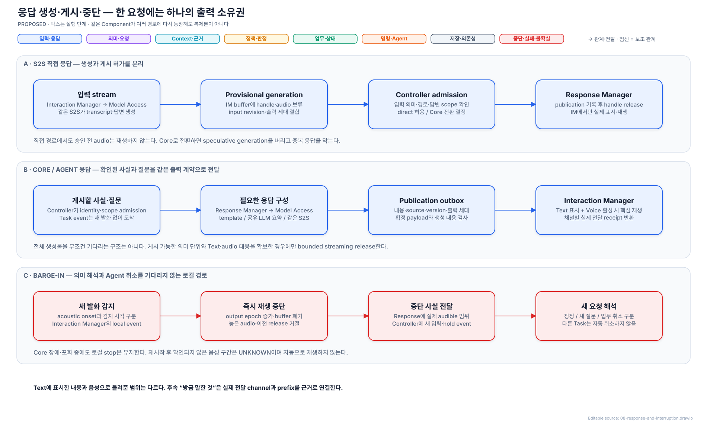

[draw.io 편집 원본](./diagrams/08-response-and-interruption.drawio)

Response Manager는 Request Controller가 admission한 Canonical Response Payload를 publication outbox에 기록하고 Text·Voice·알림 publication을 조정한다. 미리 생성된 S2S 응답이면 payload의 generation handle을 검증해 Interaction Manager에 release/cancel을 보낸다. 새로운 음성은 Model Access를 통해 같은 S2S로 생성한다. 긴 Agent 결과를 요약할 때는 같은 Model Access의 공유 semantic LLM을 사용하며, Request Controller가 허용한 source·목표·제약 범위를 벗어난 새 판단·실행을 만들지 않는다. 상태 template이면 semantic 호출을 생략한다.

생성 결과는 승인된 proposition·질문·불확실성과 Request·Task·result identity·staleness를 유지해야 한다. 내용이 이를 바꾸거나 근거가 부족하면 게시를 보류하고 Request Controller로 반환한다. Interaction Manager는 유효한 출력 세대와 release를 가진 응답만 표시·재생하고 delivery receipt를 반환한다. Barge-in은 이 승인 흐름과 독립적으로 즉시 재생을 중단하며, 오래된 release가 중단한 출력을 다시 살릴 수 없다.

Publication ID는 요청 전체와 별개이며 Text·Voice·알림에 공통으로 연결한다. Text는 같은 ID·내용 version으로 UI에 멱등 upsert한다. Voice는 generation·segment·output epoch로 중복과 오래된 packet을 거절한다. 전체 답변을 반드시 다 만든 뒤 재생하지는 않는다. source와 의미가 검증된 최소 문장 단위에서 Voice 요약문·audio 대응과 내구 publication intent를 확보하면 순차 release할 수 있다. 이를 제공하지 않는 S2S는 완성 단위까지 buffer해야 하며 추가 지연을 숨기지 않는다. Audio를 먼저 재생하고 나중에 Text의 의미를 맞추는 경로는 허용하지 않는다.

실제 재생과 receipt의 내구 기록은 원자적이지 않다. Crash 전에 저장된 마지막 확인 범위를 넘어선 구간은 `DELIVERY_UNKNOWN`으로 복원하고 이미 들었다거나 전혀 못 들었다고 단정하지 않는다. 확인 불가 음성을 자동 재생하지 않고 결과 Text를 복원하며 사용자가 요청하면 다시 읽는다. 생성된 상세 Text, UI에 실제 표시한 Text, 별도의 Voice 요약문, 확인된 audible prefix, 전달 불명 구간을 각각 남긴다.

- 모든 사용자 응답은 Text와 Conversation에 남고, Voice 활성 시 핵심을 짧게 전달한다.
- 사용자가 말하는 동안 진행·완료·실패·승인 질문을 포함한 어떤 업무 알림도 음성으로 끼어들지 않는다. 결과·질문은 화면에 먼저 표시하고 음성은 대기한다. 여러 결과를 동시에 재생하지 않는다.
- 반복 progress는 묶되 실패·완료·입력 필요 event는 보존한다.
- 중단한 출력 세대의 늦은 audio packet을 버리고 자동으로 이어 재생하지 않는다.
- Text 표시와 실제 Voice 전달을 별도로 기록한다. 화면에 전체 Text가 있어도 음성을 전부 들려준 것으로 기록하지 않는다.
- Conversation은 실제 게시된 Text와 사용자가 들을 수 있었던 audible prefix를 참조한다. 중단된 뒤의 후속 지칭에 생성만 되고 전달되지 않은 내용을 사용하지 않는다.
- OS 알림은 해당 Task와 상세 결과로 연결한다. 사용자를 별도 Agent 대화창으로 보내지 않는다.

### 화면 상세와 음성 요약, 말할 차례

**화면에는 상세 결과를, 음성에는 사람이 듣기 좋은 핵심 요약을 제공하며 사용자 발화를 가로막지 않는다는 원칙은 사용자 지정이다.** 두 채널의 문자열은 같을 필요가 없다. 공통으로 확인된 대상·상태·결론·중요한 실패와 불확실성은 일치해야 한다. 화면 표시를 Voice 생성·차례 대기 때문에 늦추지 않는다. 예를 들어 화면에는 성공·실패 항목과 파일 링크를 상세히 표시하고, Voice는 “보고서는 완성됐지만 메일은 아직 보내지 못했어요”라고 전달한다. 실패를 생략해 전부 완료한 것처럼 요약하지 않는다.

Response Manager 안의 발화 대기열은 publication·Task·result version과 Voice 대기 이유를 유지한다. Interaction Manager의 Turn-Taking Control이 사용자 발화 여부와 출력 가능 상태를 제공하고 재생 직전에도 확인한다. 단순한 짧은 침묵을 발화 완료로 확정하지 않으며 종료 판정이 틀려 사용자가 다시 말하면 로컬 stop을 적용한다. 사용자가 계속 말하면 음성은 계속 대기하되 화면 결과는 남는다. endpoint는 activity 종료 후보와 ASR final을 결합하며 실제 오차·시간 설정은 후속 검증 대상이다.

선택한 scheduling은 발화 종료 후 새 입력의 정정·취소·관련성을 먼저 반영하고, 현재 응답과 이전 업무의 핵심 결과를 한 발화 차례에 조정하는 것이다. 현재 응답을 기다리는 동안 이미 유효한 업무 결과는 별도로 짧게 안내할 수 있으나, 새 입력과 충돌할 가능성이 해소되지 않았다면 보류한다. 다른 VIA 음성을 중간에 끊어 알리지 않고 다음 경계에 전달한다. 재생 전에 최신 Task·policy·질문 revision을 확인하여 오래된 progress는 합치거나 대체하고, 완료·실패·사용자 입력 필요는 UI와 내구 대기 상태에 보존한다. Voice off 시 대기는 Text로 남기고 옛 음성은 재연결 뒤 자동 재생하지 않는다. 재연결 때 미확인 중요 결과·질문이 있음을 안내한다. 다른 Conversation의 결과는 업무 이름·상태만 짧게 알리고 상세는 사용자가 선택한 뒤 현재 대화에 참조를 연결한다. [발화 정책](./control-and-lifecycle.md#6-출력과-대화-차례)에 차례·재연결·질문 focus를 정의했다. 음성 대기 비용을 실제 responsiveness에서 임의로 제외하지 않는다.

### 중단 뒤 이어 말할지 확인

중단 후 재개는 사용자와 합의한 다음 정책을 따른다. Request Interpreter가 새 입력을 이전 응답·실제 전달 범위와 결합해 재개·정정·전환 의도를 해석하고 Request Controller가 적용한다. “계속해”이면 남은 내용을 재검증해 이어 말하고, “짧게 말해”이면 새 요청에 맞게 요약하며, “그건 됐고…”이면 이전 음성 재개를 폐기한다. 재개 의도가 불명확할 때만 “아까 설명을 이어드릴까요?”라는 Pending User Interaction을 만든다. 모든 새 답변마다 발화 허가를 묻지는 않는다. 모호한 경우에만 재확인한다는 행동 원칙과 함께 SuspendedDelivery·질문 focus·재개 output epoch를 [상태 계약](./control-and-lifecycle.md)에 정했다. 음성 재개 확인은 미전송 외부 Action의 실행 승인과 별개이며, 침묵이나 다른 질문의 “응”을 재개·실행 허가로 재사용하지 않는다.

## 14. 프로세스 배치·fault boundary

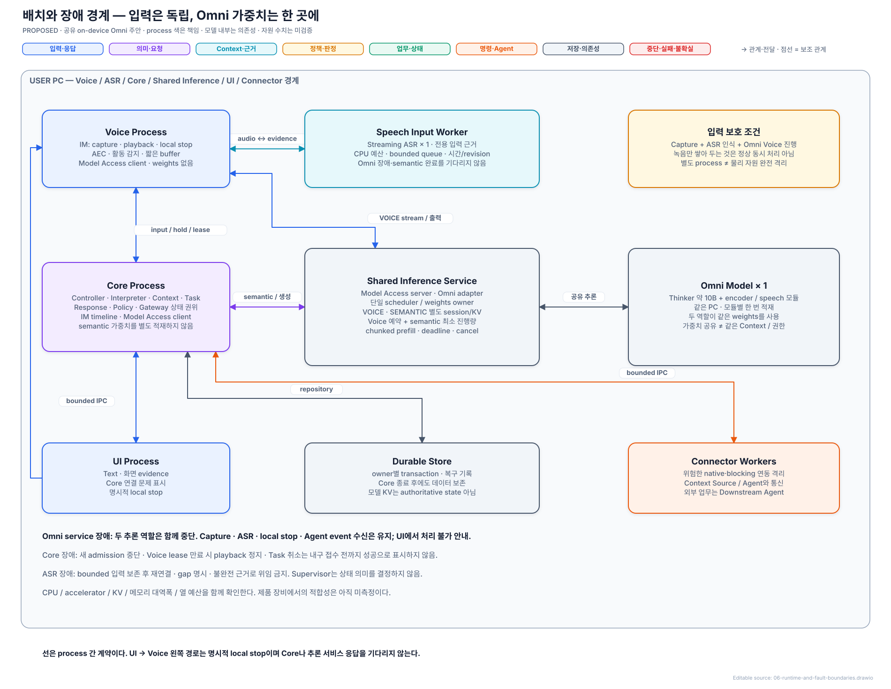

[draw.io 편집 원본](./diagrams/06-runtime-and-fault-boundaries.drawio)

주 배치는 UI·Voice·Core, **Shared Inference Service**, **Speech Input Worker**를 분리하고 위험한 native·blocking 연동은 Connector Worker에 격리한다. Voice는 capture·playback·AEC·활동 감지·로컬 stop과 Model Access client를 가진다. Speech Input Worker는 경량 Streaming ASR과 입력 근거 adapter를 독립 CPU 예산으로 실행한다. Core는 Request Controller, Request Interpreter, Context Manager, Task Manager, Response Manager, Policy Manager, Agent Gateway의 상태 권위 및 Model Access의 semantic client를 가진다.

Shared Inference Service는 Model Access의 Omni adapter·단일 scheduler·역할별 session/KV와 **한 번 적재한 Omni weights**를 소유한다. Voice와 Core의 요청이 여기서 함께 진행하며 서로 다른 session의 Context·권한을 합치지 않는다. 긴 native inference가 host 상태 전이를 막지 않게 service process로 분리한다. ASR worker와 Omni service의 분리는 process crash를 격리하지만 전력·열·메모리 대역폭의 물리적 경합은 여전히 device profile에서 확인한다.

프로세스 분리 자체가 모델의 의미 판단 능력을 높이는 것은 아니다. Responsiveness에는 blocking 격리와 IPC·직렬화·복사 비용이 직접 작용하며, accuracy에는 근거 수집 지연·유실·이벤트 순서가 판단에 영향을 주는 경우에만 인과 경로가 생긴다. 충분한 thread·비동기·자원 제어를 갖춘 단일 process도 같은 입력 근거를 유지할 수 있다. 이후 배치 대안에서는 그 가능성을 보존하고 차이가 없는 ASR에 이점을 만들어내지 않는다. Process별 runtime·buffer와 공유 메모리의 비용도 공개한다.

Interaction Manager의 Text·화면·pointer 수집은 UI process 쪽 OS adapter와 제한된 evidence buffer를 사용한다. 무거운 화면 읽기는 worker로 격리한다. Voice와 UI의 producer sequence·사건 시각·capture gap을 Core의 Interaction Manager timeline 모듈이 결합한 뒤 Request Controller에 넘긴다. Voice를 끈 상태에서도 Text·화면 경로는 유지된다. UI의 명시적 음성 stop은 Voice로 직접 전달하며 Task 제어는 Core를 거친다. 따라서 단일 논리 Component의 하위 모듈이 여러 process에 배치된다는 비용과 IPC 계약을 숨기지 않는다.

Connector Worker는 실제 연동의 장애·접근 경계에 따라 나누며 Task별로 만들지 않는다. Core 안에는 State Store access module이 있지만 durable State Store의 데이터는 Core crash 후에도 복구 가능해야 한다. 주 배치는 local embedded transactional DB이며 별도 DB server는 두지 않는다. 큰 evidence는 DB manifest와 파일 정리 원장으로 연결한다. Supervisor는 health·restart·backoff를 담당하며 Request·Task의 의미 상태를 직접 변경하지 않는다. 이 배치는 목표 설계 기준선이며 기존 accepted/deferred ADR의 상태·비교 조건을 자동 변경하지 않는다.

Core가 끊겨도 Voice의 로컬 stop은 동작한다. 새 응답의 admission은 중단하고 기존 playback도 lease 만료 또는 연결 단절 감지로 정지한다. Voice는 Core incarnation과 output epoch가 바뀐 이전 release를 거절한다. UI는 마지막 확인 상태와 Core 연결 문제를 표시하며 Task 취소를 내구 접수한 것처럼 보고하지 않는다. 명시적 UI stop과 실제 Task 취소의 보장 범위는 다르다.

모델 주 배치는 on-device 공유 Omni + 경량 ASR이다. Remote는 향후 교체 시나리오이지 기본 fallback이 아니다. 모르는 사이 외부에 음성·화면을 전송하지 않는다. ASR·Omni가 각각 죽으면 새 incarnation으로 복구하며 모델 세션을 VIA 상태의 원본으로 삼지 않는다.

| 장애 | 동작 |
| --- | --- |
| Voice Process 장애 | 해당 구간 입력·출력 gap 명시 후 복구; Core의 Text·Task 추적 유지 |
| Speech Input Worker 장애 | capture 유지 범위에서 bounded 재연결; 시간/전사 근거 미확보 요청은 commit 금지; backlog 초과를 유실로 표시 |
| Shared Inference Service 장애 | 음성·semantic 추론 둘 다 중단; capture·ASR·local stop과 Agent event 수신 유지; UI 안내 후 필요한 세션 재구성 |
| 특정 Context source 실패 | 해당 근거가 필요한 요청만 보류·실패 |
| Semantic LLM·전체 deadline timeout | partial inference나 불완전 Context를 commit하지 않고 clarification·확인 불가·안전한 실패로 종료; 확인된 상태와 명시적 UI 제어 유지 |
| Agent 단절 | 실행 실패로 단정하지 않고 상태 재조회·재연결 |
| Core 재시작 | 영속 기록과 Agent 상태로 업무 연결 복원 |
| State Store 쓰기 실패 | 복구 근거가 필요한 새 위임·수정·취소 전송 중단 |

모든 외부 호출에 deadline을 두고 요청 전체 deadline을 우선한다. 조회 재시도는 남은 예산 안에서 수행하며 반복 실패 connector의 새 호출을 잠시 제한한다. 수치형 deadline·메모리·queue 예산은 유한한 배포 Resource Profile로 주입하며 필수 필드와 미지원/초과 처리는 [Omni 실행 계약](./shared-omni-runtime.md#8-주요-설계를-닫는-schedulerruntime-계약)에 정했다. 보관 기본값은 기억 계약을 따른다. 무한 대기·무한 refinement·무조건 재전송은 허용하지 않는다.

재시작 시 command outbox, event inbox·cursor·Task projection, response publication outbox·delivery receipt를 각각 복원한다. 전송 대기·전송 불명·실행 중, event 반영 전·후, Text 게시·Voice 부분 전달을 구분해 상태를 확인한다. 결과·질문·허용 제어와 사용자가 실제 접한 응답이 다시 연결되어야 복구다. 프로세스가 재기동됐다는 이유만으로 복구 완료라고 하지 않는다.

복구 순서는 `새 incarnation·전송 fence 설정 → schema·owner state 복원 → inbox·domain event 재적용 → Agent 상태 조정 → 질문·publication 재결합 → 새 admission 개방`이다. 확인이 끝나지 않은 Task는 재조회 중·확인 불가로 남긴다. 한 Agent의 장기 장애가 무관한 대화의 개방을 무한히 막지 않게 Task별 recovery deadline을 적용한다. State Store 손상·migration 실패에서는 외부 Action을 새로 전송하지 않으며, 확인되지 않은 rollback·성공 복원을 주장하지 않는다.

## 15. 주요 runtime 시나리오

| 상황 | 동작 |
| --- | --- |
| “이거 지난번 자료에 넣어줘” | 당시 지칭 근거와 과거 자료 후보를 연결하고 목적 자료·Task 관계 확정 후 위임 |
| 후보가 둘 이상 | 값싼 추가 근거로 구분하거나 사용자 선택이 필요한 차이를 질문 |
| 해석 중 화면 변경 | 당시 근거 유지; 대상 내용·identity 변경 시 관련 해석만 무효화 |
| Agent 장기 실행 | 새 대화 계속; 마지막 확인 상태·시각 유지; 진행률 추측 금지 |
| Agent 실패·부분 완료 | 완료·실패 부분 분리; 외부 변경 확인 없이 전체 재실행 금지 |
| Voice barge-in | 재생 중단·출력 세대 폐기 먼저, 새 요청 해석은 이후 |
| 실행 직전 정정·취소 | 미전달 요청 보류; 전송 시작 뒤면 외부 실행 상태 확인 |
| 여러 업무의 확인 질문 | 질문별 identity 유지; 모호한 답변을 임의 승인으로 사용하지 않음 |
| Voice/Text 전환 | 동일 Conversation·대상·Task 유지; 음성 연결 수명과 분리 |
| Memory 삭제·권한 철회 | 지속 상태와 관련 cache·session 사용 중단을 함께 반영 |

## 16. 네 ASR의 설계 우선순위와 critical path

이 Architecture는 QA-19, QA-09, QA-29, QA-39 순으로 우선해 설계한 검토 기준선이다. 아래는 설계 당시 네 관점의 인과 설명이며, 다음 단계의 구조 선택·steelman 검토에서 사용할 ASR 목록을 고정하는 표가 아니다.

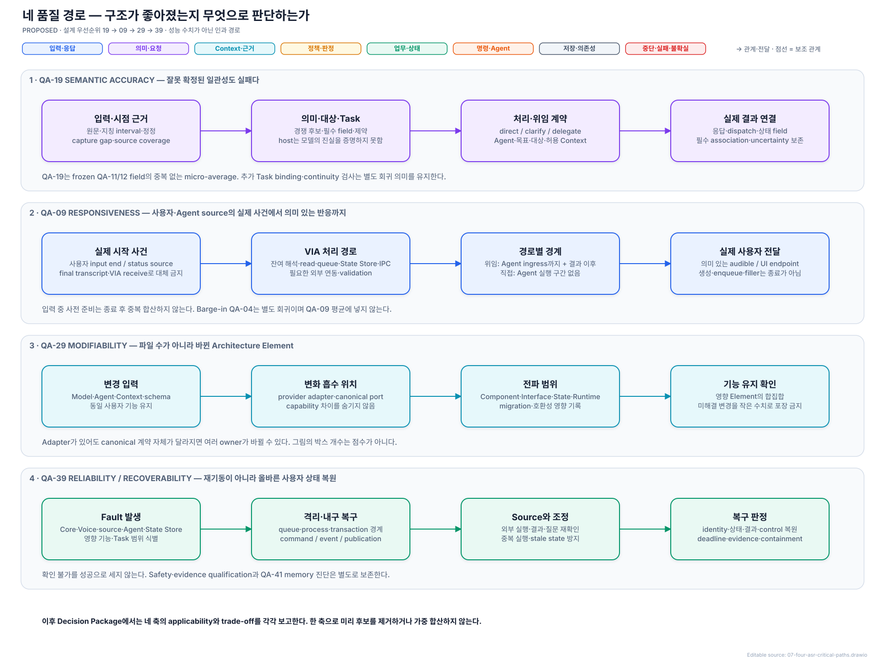

[draw.io 편집 원본](./diagrams/07-four-asr-critical-paths.drawio)

Context, queue, State Store, IPC, network, speech generation, playback buffer 비용도 경로에 포함된다. 입력 종료 전에 겹쳐 수행한 작업을 종료 후 비용에 다시 더하지 않는다. Agent 내부 업무 시간은 분리하되 전체 사용자 대기 시간은 유지한다. Filler·접수 인사를 유효 결과의 도착으로 취급하지 않는다. 이는 [event boundary 의미](../../11-measurement/event-boundary-contract.md)를 보존한 설계 설명이며 새 측정 계약은 아니다.

Accuracy 경로는 입력·시점 → 당시 근거 → 대상·목표 → Task·처리 방향 → 최신 요청 확정 → Agent 계약 → 진행·결과 연결이다.

Modifiability 경로는 Model·Agent·Context·policy 변화 → 해당 port와 adapter → canonical contract·state migration → 영향받는 Component·Interface·State·Runtime이다. Provider별 차이를 Core semantic state나 Task lifecycle로 누출하면 변경 파급이 커진다.

Reliability/recoverability 경로는 fault 발생 → process·queue·transaction boundary에서 격리 → durable intent/event/publication 복원 → source 상태 재확인 → 중복·오연결 없는 사용자 상태 수렴이다. 재시작 자체가 아니라 확인 가능한 Task·Execution·응답 관계의 복원이 끝점이다.

| 영향 지점 | QA-19 accuracy | QA-09 responsiveness | QA-29 modifiability | QA-39 reliability/recoverability |
| --- | --- | --- | --- | --- |
| Evidence·Context contract | 지칭·자료·시점·후보 coverage | 사전 준비·조회·prompt·재해석 비용 | source adapter와 canonical receipt가 변화 파급을 제한 | source fault·gap·stale evidence를 해당 요청에 격리 |
| Semantic Commit | 목표·대상·Task·handling 일관성 | 호출·검증·clarification 비용 | model/prompt/schema 변화가 Request Interpreter·contract에 집중 | timeout·늦은 결과가 확정 상태를 덮지 못함 |
| Request·Task·Command state | 정정·승인·업무 binding 보존 | transaction·queue·dispatch 비용 | aggregate별 단일 writer와 versioned state migration | outbox·epoch·projection으로 crash와 중복 전송 복구 |
| Agent Gateway·Response Manager의 port | 정확한 capability·event·사용자 결과 연결 | 변환·재조회·게시·재생 지연 | Agent/provider 변화가 Agent Gateway·Response Manager adapter에 집중 | inbox·cursor·publication receipt로 event·전달 복원 |

위 표는 네 ASR을 목표 구조에 반영한 인과 가설이다. 실제 수치나 다른 구조보다 우수하다는 측정 결과는 없다.

## 17. 비용·약점·재검토 조건

1. **틀린 근거의 일관된 해석:** 지칭 시각 오류나 source 후보 누락은 schema 검사를 통과할 수 있다. 근거 연결은 의미 정확성의 충분조건이 아니다.
2. **refinement 예산 초과:** 일반 요청조차 두 번 안에 안정되지 않고 clarification이 반복되면 기본 Context와 해석 책임을 재검토해야 한다.
3. **공유 모델 병목:** Voice 자원 예약·chunked scheduling·입력 ASR에도 실제 장비의 연산·대역폭·열 한계가 남는다. Semantic 중 입력 recognition/Omni Voice가 밀리거나 semantic이 기아 상태이면 profile을 기각한다. 지원되지 않는 선점을 queue만으로 해결할 수 없다.
4. **필수 dependency 기능 미확보:** 시간 근거·시각 이해·음성 통제·Agent 조회/중복 방지가 없으면 adapter만으로 필수 행동을 충족하지 못할 수 있다.
5. **지속적으로 바뀌는 자료:** 관련 근거가 계속 바뀌면 재검증으로 진행이 멈출 수 있다. 과거 대상으로 할 수 있는 요청과 현재 version이 필요한 Action을 구분해야 한다.
6. **구현 비용:** 증거·revision·outbox·event 정합성·출력 전달 상태가 추가된다. IPC·저장·cache 비용을 성능 이점에서 빼놓지 않는다.

반증 가능한 약점은 기준선에 보존하며, 다음 단계에서 중요한 구조적 선택·강한 대안·관련 ASR의 후보 목록을 함께 만든다. 후보 목록에서 실제 차이를 검토한 뒤 정식 Decision Package와 검증 설계로 발전시킨다. 주요 선택과 후속 검토 범위는 [설계 완결성 점검](./design-completeness.md)에 있다.

대표 UC 18개·필수 변형과 cross-cutting 기능의 설계 대응, 자체 시나리오 검토와 후속 구현 항목을 [설계 완결성 점검](./design-completeness.md)에 모았다. 주요 기능 설계는 사용자 검토를 마친 기준선이며 구현·성능 검증은 별개다. ASR의 추가·변경과 비교 기준 정의는 다음 Decision Point·steelman 후보 구체화에서 진행한다.
