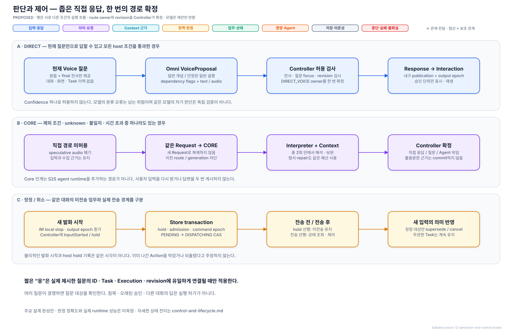

# 요청 판단·제어·대화의 실행 계약

> 상태: **REVIEWED_BASELINE / 사용자 검토 완료·목표 설계 기준선 확정 / 구현·성능 측정 없음**
> [전체 구조](./architecture.md) · [기능 완결성](./design-completeness.md) · [기억·Context](./memory-and-context-lifecycle.md)

이 문서는 “누가 판단하는가”에서 더 나아가 입력 확정, 직접 응답 허용, 질문의 답변 연결, 전송·정정 경쟁, 실제 전달과 재시작의 동작을 정한다. 수치형 기기 설정과 직렬화 코드는 후속 구현 항목이며 주요 동작 선택을 미루는 빈칸이 아니다.

## 1. 입력과 종료 판정

| 사건 | 소유자와 전이 | 예외 |
| --- | --- | --- |
| Voice 연결 | Interaction Manager가 device/connection epoch와 현재 Conversation의 Voice focus lease 발급; 음성 수집 상태를 UI에 표시 | microphone 권한 거부·장치 없음이면 Text 경로 유지; 연결 성공으로 표시하지 않음 |
| 발화 시작 | Interaction Manager가 Turn ID·sample start·Conversation·input sequence 고정, 즉시 local stop; Request Controller가 같은 대화의 미전송 admission hold | capture와 hold의 실제 시간 차이는 기록; 이미 전송된 업무를 막았다고 하지 않음 |
| 종료 후보 | Interaction Manager의 Turn-Taking Control이 speech activity·endpoint 신호로 `END_CANDIDATE` 기록; ASR final과 evidence producer watermark 요청 | 잠깐의 침묵만으로 업무를 전송하지 않음; 다시 말하면 같은 provisional Turn 연장 |
| InputFinal | ASR final revision·audio 종료 범위·watermark 또는 명시적 gap을 결합해 Request Controller가 `SEALED` 입력 생성 | source가 응답하지 않아도 무한 대기하지 않음; 불완전 근거를 표시하고 필요한 지칭은 clarification |
| 늦은 전사·화면 근거 | 기존 입력을 덮지 않고 새 revision과 영향 field 기록; 현재 admission 무효화 | 전송 후라면 새 정정 요청으로 조정; 외부 Action rollback으로 해석하지 않음 |
| Text 전송 | 제출한 본문·attachment·선택·Conversation을 고정하고 같은 Request Controller 경로 사용; 음성 중이면 local stop 및 새 input epoch | 단순 typing은 전송이 아님. 사용자가 미전송 요청 편집을 시작하면 명시적 edit hold |
| 비언어 활동·중단된 입력 | 내용이 없고 ASR/Interaction Manager 양쪽의 `NO_CONTENT`, gap 없음이 확인되면 `ABORTED_NO_CONTENT`; 이전 admission을 현재 조건으로 재검증 | 말을 했을 가능성·전사 실패·gap이 있으면 `WAIT_USER`; timeout만으로 Action hold 해제 금지 |

Turn의 Conversation은 입력 시작 시 고정한다. UI에서 다른 대화로 이동해도 이미 시작한 입력을 새 대화에 끼워 넣지 않는다. Voice focus 변경은 이전 발화가 종료된 뒤 새 connection/focus epoch로 적용하며, 사용자가 즉시 전환을 선택하면 이전 미완성 입력은 보류하고 새 입력을 받는다. 하나의 PC에서 동시에 음성 출력할 Conversation은 하나다.

Voice Process의 AEC와 보수적인 audio activity detector가 즉시 입력 시작/재생 중단을 담당하고, 종료는 activity 종료 후보와 ASR final의 결합으로 결정한다. 별도 학습된 endpoint/helper 모델은 기본 inventory에 추가하지 않는다. Detector 알고리즘·threshold는 교체 가능한 device adapter 설정이며 의미상 취소를 판단하지 않는다.

`InputFinal`은 의미의 정확성 선언이 아니다. Endpoint가 일찍 닫혔으면 뒤 발화를 새 Turn으로 받아 Request Interpreter가 continuation/correction 관계를 복원한다. 원음·전사·당시 화면이 사라진 경우 현재 화면으로 대체하지 않는다. 사용자가 직접 선택하거나 다시 지칭하도록 질문한다.

화면·포인터·선택 관측은 전사 token 도착마다 시작하지 않는다. Interaction Manager의 OS/UI 사건·유한 sampling·pre-roll·발화 구간 pin과 Context Manager의 기본/추가 조회 trigger는 [전체 구조 §9](./architecture.md)에 따른다. Request Controller는 최종 입력·근거·예산을 결합해 Request Interpreter를 호출하며, 추가 조회 결과도 Request Controller를 거쳐 재해석한다.

## 2. 최소 S2S 직접 응답 계약

**선택: 같은 Omni Voice 호출의 제한된 제안 + Request Controller의 보수적인 허용 검사. 별도 classifier나 매번 semantic 재호출을 추가하지 않는다.** Voice 직접 역할은 현재 Turn의 원음·정규 전사와 언어/출력 형식 설정만 받는다. 이전 대화·Task·개인 기억·화면을 주지 않으며 Turn마다 직접 응답용 대화 KV를 초기화한다. 지속 audio encoder 상태와 이전 질문의 의미 이력은 구분한다.

[draw.io 편집 원본](./diagrams/12-admission-and-control.drawio)

`VoiceProposal`의 필수 필드:

| 필드 | 의미 |
| --- | --- |
| identity | Turn, input revision, session, model build, generation ID |
| input_echo | 모델이 답하려는 현재 질문의 전사; host가 canonical ASR final과 공백·구두점만 정규화해 대조 |
| disposition | `DIRECT_CANDIDATE` 또는 `HANDOFF`; 그 밖의 값은 HANDOFF |
| knowledge_class | `GENERAL_DEFINITION` 또는 `STABLE_GENERAL_EXPLANATION`; 조회·업무·개인화 분류는 허용하지 않음 |
| dependencies | history / screen / personal / task / action / current_information / compound / uncertainty 각각 true·false·unknown |
| response | 답변 Text, 문장별 audio handle·text 대응, 종료 상태; 게시 권한은 포함하지 않음 |

Request Controller는 다음을 **모두** 만족할 때만 Direct Admission Record를 만든다.

1. 현재 Voice 입력이 SEALED이고 speech evidence gap·핵심 전사 불일치가 없다. `input_echo` 불일치는 보수적으로 Core에 넘긴다.
2. 허용 knowledge class이며 모든 dependency가 false다. confidence 값으로 누락·unknown을 대신하지 않는다.
3. 같은 대화에서 답변을 기다리는 질문·consent·approval, 미해결 정정/재개, 편집 hold가 없다. 대화 지칭·화면 첨부·제어 표현 등 host가 이미 아는 제외 근거가 없다.
4. 해당 입력 revision·policy·output epoch가 여전히 유효하고, Request의 route owner가 아직 없다.
5. 첫 게시 단위의 Text/audio 대응과 유효한 generation handle이 있다. 이후 단위도 같은 envelope 아래에서 검사한다.

성공 시 `route_owner=DIRECT_VOICE`를 조건부 확정하고 Response Manager에 넘긴다. 나머지는 `route_owner=CORE`로 확정하고 speculative audio를 폐기한다. Core는 **같은 Request ID**와 이미 모은 근거를 사용하므로 입력 재수집·중복 응답이 없다. Voice proposal이 늦거나 형식 오류이면 기다리는 시간을 늘리지 않고 Core로 간다. Direct 후보가 이미 채택된 후 늦은 HANDOFF가 오면 기록하고 필요하면 정정 응답을 만들되 같은 초기 답변을 다시 게시하지 않는다.

“광합성이 뭐야?”는 직접 후보, “방금 설명한 두 번째는?”, “지금 환율은?”, “이 파일을 설명해줘”, “보고서는 취소해”는 Core다. 단순한 새 질문도 앞선 승인 질문의 답일 가능성이 남으면 Core에서 관계를 먼저 해소한다. 이 손실은 accuracy를 우선한 의도적인 fast path 제한이다.

이 검사는 숨은 맥락 의존성이나 자체 지식의 사실 오류를 완벽히 탐지하지 못한다. S2S의 자기 분류는 독립 검증이 아니다. 잘못된 직접 답변은 오류로 남기고 사용자의 정정 시 같은 Conversation에서 수정한다. 기능이 없는 build는 Core-only로 동작 가능한 제한 모드이나, S2S 직접 응답을 포함한 전체 제품 기능을 충족했다고 선언하지 않는다.

## 3. Core 해석·읽기·응답 예산

- Request Controller는 input revision당 **semantic 호출 총 2회**를 배정한다. 최초 해석, 추가 근거 후 refinement, 형식 repair, 원음 재확인 또는 stale 재해석에 쓰는 모든 semantic generation을 이 합계에 센다. 자동 repair용 숨은 세 번째 호출은 없다.
- 기본 Context는 owner snapshot·현재 선택 등 값싼 읽기로 미리 준비한다. 모델이 요구한 추가 읽기는 한 묶음만 수행한다. 각 query의 source set·filter·page/byte 한도·deadline을 Request Controller가 고정하고 Context Manager가 실행한다. 한도에 걸리면 `TRUNCATED/UNKNOWN_COVERAGE`이지 전 후보 확인이 아니다.
- 조회 재시도는 read-only이며 같은 query ID로 최대 한 번, 남은 deadline과 같은 전체 byte/page 예산 안에서만 허용한다. 새로운 source 탐색으로 무한 확장하지 않는다.
- 2회 뒤 사용자가 풀 수 있는 모호함은 `WAIT_USER`, source·기능·시간 문제는 실패 이유와 재시도 선택으로 종료한다. 충분한 근거가 있는데도 무조건 질문하는 구조는 아니다.
- 사용자 추가 답변·정정은 새 input revision으로 기존 Request를 보완한다. source 변경이나 provider retry만으로 input revision을 늘려 예산을 초기화하지 않는다.
- Core 답변은 해석 결과의 초안을 사용할 수 있다. 별도 설명·긴 Agent 결과 요약은 Response Manager의 **구성 호출 최대 1회/게시 content revision**이다. 형식·필수 사실 보존 검사 실패 시 확인된 상태 template 또는 원문/결과 참조로 안내하고 실패한 요약을 성공으로 표시하지 않는다. 자료 설명 자체를 만들지 못한 경우 단순 접수 멘트로 완료하지 않는다.
- SpeechRender는 별도 음성 역할 비용이다. 승인된 Text의 문장별 audio 생성만 수행하고, 내용 재판단·추가 조회·새 Task는 만들지 않는다. Text/audio 대응 계약이 없으면 음성을 보류하고 Text로 전달 상태를 알린다.

모든 해석·read·구성에는 Request attempt deadline이 상한이다. `WAIT_USER` 동안 모델·source 자원을 잡고 있지 않으며 답변을 받으면 현재 revision·policy로 새 attempt를 만든다. 사용자 응답 대기 만료는 기계 시간 초과와 구분한다.

## 4. Request·질문·Task의 상태 전이

### Request — Request Controller 소유

| 상태 | 다음 전이와 조건 |
| --- | --- |
| RESOLVING | 추가 읽기면 WAIT_CONTEXT, 사용자 정보 필요면 WAIT_USER, 선행 결과 필요면 WAIT_DEPENDENCY, host 검증 성공이면 READY |
| WAIT_CONTEXT | receipt를 받아 남은 호출로 RESOLVING; 접근 거부·deadline이면 WAIT_USER 또는 FAILED와 원인 |
| WAIT_USER | 질문 ID에 결합한 유효 답변으로 RESOLVING; 명시 철회는 CANCELLED, 다른 목표로 대체는 SUPERSEDED |
| WAIT_DEPENDENCY | 지정한 결과 version·조건·권한으로 재검증 후 RESOLVING/READY; 선행 실패면 이유를 남기고 사용자 선택 또는 FAILED |
| READY | route/commit revision이 유효할 때 HANDLING; 새 입력/관련 변경은 hold 후 RESOLVING |
| HANDLING | 직접 답변의 마지막 필수 Text 단위 게시 또는 내부 기억 변경 확인 시 COMPLETED; 위임은 Agent 접수 확인 시 Request 처리 COMPLETED·Task 계속 추적 |
| COMPLETED / FAILED / CANCELLED / SUPERSEDED | 같은 attempt를 되살리지 않음. 후속 입력은 새 Request 또는 기록된 보완 관계를 생성; Task·결과 참조는 유지 |

Request의 `COMPLETED`는 VIA의 해당 처리 완료다. 사용자 업무 완료는 Task의 source-confirmed terminal 상태로만 표시한다. 직접 답변의 Voice는 `VOICE_PENDING/INTERRUPTED/DELIVERY_UNKNOWN` 등 별도 전달 상태로 남으므로 Text 게시 완료와 청취 완료를 혼동하지 않는다. 위임 접수 불명은 HANDLING + command UNKNOWN이며 COMPLETED가 아니다.

### Pending User Interaction — Request Controller 소유

`OPEN → PRESENTED → ANSWER_COMMITTED → CLOSED`를 기본으로 하고 `EXPIRED / REVOKED / SUPERSEDED`로도 닫힌다. 음성 일부만 전달되면 PRESENTED 범위에 실제 전달된 질문을 기록한다. 화면 카드의 명시적 답변은 interaction ID를 포함한다.

답변은 (1) UI가 지정한 질문 ID, 또는 (2) Request Interpreter가 확인한 대상 + 유일한 유효 후보에만 결합한다. 자연어 “응”에는 현재 Conversation의 **마지막으로 실제 제시된 유일한 질문 focus**가 필요하다. 다른 대화/업무 질문이 동시에 답변 후보이면 질문 대상을 다시 묻는다. 가장 최근에 생성된 질문을 자동 선택하지 않는다. 실행 승인에는 Task·Execution·question·action payload digest·policy revision·expiry가 모두 일치해야 한다.

답변 commit과 질문 종료는 같은 owner transaction으로 한 번만 적용한다. 늦은 답변, 이미 끝난 Execution의 승인, 변경된 action payload는 거절하고 현재 상황을 안내한다. VIA clarification은 Request가 유효하면 보관하고, Agent 질문·승인은 Agent expiry와 terminal 사건에 따라 만료한다. 사전 승인 기간이 없는 Action approval은 해당 연결/실행 revision에서만 유효하며 재시작·연결 복구 후 재조회한다. 침묵은 동의·거부·재개 허가가 아니다.

### Task / Agent Execution — Task Manager 소유

Task에는 `phase`, `control_state`, `verification_state`를 따로 둔다. Phase는 `PREPARING/RUNNING/WAITING_USER/SUCCEEDED/PARTIAL/FAILED/CANCELLED`, control은 `NONE/CORRECTION_PENDING/CANCEL_REQUESTED`, verification은 `CONFIRMED/RECONCILING/UNKNOWN`이다. PARTIAL은 Agent가 이번 실행의 종료와 완료·실패 범위를 명시한 경우에만 terminal이다. 진행 중 중간 산출물은 RUNNING의 artifact다.

Execution은 Agent가 돌려준 외부 identity에 결합한 projection이다. 접수 전 예약한 binding과 실제 접수된 execution ID를 구분한다. 동일 Agent의 독립 Task는 독립 execution correlation을 요구하며, Agent가 하나만 지원하면 Agent Gateway에서 순차 admission하거나 다른 적합 Agent를 선택한다. 실행 ID를 재활용해 두 업무의 결과를 합치지 않는다.

완료 Task의 같은 결과물 수정은 Task revision을 높이고 새 Execution을 연결한다. 이전 Execution의 terminal 이력은 불변이다. 이전 결과를 재료로 쓰는 별도 목표는 새 Task다. 완료와 취소가 교차하면 source에서 확인한 완료 범위·취소 불가/완료 상태를 둘 다 전달한다.

## 5. 전송과 정정의 원자적 경계

### Command — 의미는 Task Manager, 전달 상태는 Agent Gateway

`PENDING → DISPATCHING → ACKNOWLEDGED`이며, 확정된 거부는 `REJECTED`, 전송 시작 후 응답 유실은 `UNKNOWN`, 미전송 철회는 `WITHDRAWN`이다. ACKNOWLEDGED는 업무 완료가 아니다. Agent event와 조회는 이후 Execution을 갱신한다. Start·follow-up·correct·cancel·question answer 모두 command identity와 현재 revision을 갖는다.

단일 local State Store transaction에서 Request Controller가 만든 admission/hold 변경, Task Manager가 만든 command/epoch 변경, Agent Gateway의 transmission CAS를 조합한다. 각 owner의 검증된 변경 집합을 Unit of Work에 전달하며 다른 owner 필드를 직접 수정하지 않는다. 네트워크·모델 호출은 transaction 밖이다.

| 경쟁 | 먼저 확정된 사건에 따른 동작 |
| --- | --- |
| InputStarted / PENDING dispatch | hold가 먼저면 전송 안 함. DISPATCHING이 먼저면 UNKNOWN 가능성을 포함해 조회·정정·취소 |
| Policy revoke / dispatch | 현재 policy revision 비교로 미전송 차단. 이미 제공된 Context는 회수했다고 주장하지 않고 Agent에 중단·삭제 지원 여부 확인 |
| Answer / Agent terminal | 질문·Execution revision을 같은 transaction에서 확인; terminal이 먼저면 늦은 승인 전송 금지 |
| Dependency result / correction | graph revision + node ID + result version으로 한 번만 후속 admission; 정정 뒤 오래된 event는 no-op |
| Text/Voice publication / 새 발화 | durable publication admission과 별개로 Interaction Manager의 output epoch 검사; 새 발화 후 옛 packet은 재생 금지 |

화면의 미전송 요청 편집 UI와 명시적 취소 버튼은 의미 추론 없이 ID를 지정해 hold/cancel intent를 접수할 수 있다. 자연어 “그거 취소”는 대상 해석이 필요하다. 사용자 발화 중에는 같은 대화의 PENDING Action을 보류하지만 무관한 실행 중 Task를 중단하지 않는다.

### Agent capability별 처리

| 필수 계약 | 사용하는 방식 | 미지원 시 동작 |
| --- | --- | --- |
| start + correlation + result/error | 목표·완료 조건·Context scope와 execution binding | 해당 업무 미지원; VIA가 실행 대체하지 않음 |
| idempotent submit + status by command key | UNKNOWN start를 같은 key로 재조회·필요 시 재전송 | 전달 불명이면 자동 재전송·다른 Agent 재위임 금지; 확인 불가 안내 |
| event revision / snapshot query | 역순·중복 제거, gap 재조회 | event를 hint로 취급; 순서도 조회도 없으면 상태를 UNKNOWN으로 표시 |
| correct / cancel | 기존 execution과 command epoch를 지정 | 미전송은 철회 가능; 실행 중 미지원이면 불가/미확인을 안내. 수정하려고 중복 start하지 않음 |
| target/result precondition | 현재 source version을 실행 시점에 재확인 | race가 중요한 변경 업무는 해당 Agent에 admission하지 않음 |
| question / approval correlation | question·action digest별 승인·거부 | 해당 승인이 필요한 업무는 지원 불가; 일반 대화 “응”을 권한으로 변환하지 않음 |

기본 handling은 한정 자료 설명·요약은 VIA, 업무 조사·실행은 Agent다. 사용자가 특정 Agent에 정보성 요청도 맡기도록 명시했거나 이미 선택한 Agent 업무의 일부이면 해당 목표를 통째로 위임할 수 있다. 이때도 같은 목표·Context·결과 연결 계약을 지키고 권한·비용 차이가 있는 대체는 확인한다.

필수 capability는 위임 전에 고정한 profile revision으로 검사하고 실제 전송 때 다시 확인한다. Agent 교체는 Request/Task identity를 유지하지만 이전 실행 상태가 불명인 동안 새 실행을 시작하지 않는다. 상태 조회·취소가 없는 기능의 제한을 명시적으로 안내하는 것은 요구된 실패 동작이며 성공적인 자동 복구로 세지 않는다.

## 6. 출력과 대화 차례

Response는 채널별 상태를 가진다. Text는 `PENDING → DISPLAYED` 또는 `FAILED`, Voice는 `PENDING → READY → PLAYING → DELIVERED`, 중간에 `INTERRUPTED / SUPERSEDED / DELIVERY_UNKNOWN / TEXT_ONLY`가 가능하다. UI 접속이 없으면 durable PENDING으로 남고 다음 접속 때 같은 publication ID로 표시한다. 부분 문장만 게시한 상태에서 생성 실패하면 Response를 PARTIAL_FAILED로 표시하고 Request는 FAILED와 부분 전달 범위를 남기며 전체 직접 응답 완료로 바꾸지 않는다. 표시 receipt가 없는데 사용자가 읽었다고 하지 않는다.

**선택한 발화 정책:** 사용자가 말하는 중에는 음성 게시 금지. 발화 종료 후 해당 입력의 관계·정정·제어를 먼저 반영하고, 한 번에 하나의 Voice 출력 lease만 발급한다.

1. 새 입력의 직접 답변·clarification·제어 결과를 먼저 전달한다.
2. 같은 차례에 이전 Task의 사용자 입력 필요·실패·완료 요약을 업무 이름과 함께 이어 전달한다. 현재 요청이 오래 기다리는 상태이고 무관함이 확인된 결과는 먼저 짧게 전달할 수 있다.
3. 반복 progress는 Task별 최신값으로 합친다. 질문·실패·완료는 내구 기록과 UI에서 보존하며 Voice로는 묶어 요약해도 각 미해결 사실을 유지한다.
4. 다른 VIA 음성 중 새 결과는 현재 답변을 끊지 않고 문장/응답 종료 경계에서 조정한다. 사용자가 말하면 언제나 local stop이다.
5. 우선순위가 같은 알림은 원래 접수 순서다. 현재 foreground 응답 뒤 대기 terminal/question 알림을 처리한 다음 일반 progress를 처리한다. 사용자 발화가 계속되어 못 읽은 것은 Voice 대기로 명시하며 자동 전달했다고 기록하지 않는다.

Voice를 끄면 대기 결과는 Text로 남고 `TEXT_ONLY`로 전환한다. 다시 켜면 오래된 음성을 자동 재생하지 않고, 미확인 중요 결과·질문이 있음을 짧게 알린 뒤 현재 상태의 요약을 요청할 수 있게 한다. 새 대화가 현재 focus이면 다른 대화의 상세 내용은 자동으로 읽지 않는다. 업무 이름·완료/확인 필요만 알리고 사용자가 해당 업무를 선택하면 현재 대화에 참조를 추가해 설명한다. 같은 대화의 활성 Voice에서 도착한 유효 결과는 사용자의 발화가 끝난 뒤 자동 요약한다.

중단된 답변은 `SuspendedDelivery(publication, content revision, confirmed audible range, interrupted epoch)`로 남긴다. “계속해”는 현재 근거로 남은 문장을 새 output epoch에서 생성한다. “짧게”는 새 요약, “됐고”는 폐기, 재개 여부가 모호하면 한 번의 확인 질문으로 처리한다. 새 주제가 명백하면 이전 답변 재개 질문을 자동 삽입하지 않고 UI의 이어 듣기 수단을 남긴다. 승인·업무 실행 대기와 음성 재개는 별도 interaction ID다.

화면 상세를 음성 생성 때문에 기다리게 하지 않는다. 구조화된 상태·원래 Agent 결과·파일 참조는 즉시 표시 가능하고, 별도 Voice 요약에는 실패·부분 완료·불확실성을 반드시 보존한다. 의미 검사 자체가 모델 오류를 완전히 제거한다고 주장하지 않는다. source 없는 새 사실·외부 행동 지시는 response generation에서 허용하지 않는다.

## 7. 장애·재시작·버전 변경

| 사건 | 주요 설계 동작 |
| --- | --- |
| Core 재시작 | 새 incarnation fence → owner/schema 복원 → inbox/domain event 재적용 → Task별 조회 → 질문·publication 복원 → 무관한 정상 경로 admission 개방 |
| State Store 용량/쓰기 장애 | 새 내구 command·memory 변경·publication 확정 중단, UI의 명시적 장애 배너와 local stop 유지. 접수된 업무 상태를 잃었다고 가정해 새로 start하지 않음 |
| durable publication은 있고 UI receipt 없음 | 같은 ID로 Text upsert; 음성은 마지막 확인 범위 밖 UNKNOWN, 자동 재생 금지 |
| Source/Model deadline | Request attempt를 끝내고 원인·확인된 상태를 기록; 무한 자동 반복 없음. semantic 없이도 표시 가능한 상태 template 사용 |
| sleep·resume / 장치 교체 | connection·clock mapping·Voice output epoch 갱신, 이전 audio 폐기, 미완성 입력 gap 표시, Agent 상태 재조회; sleep 기간을 실제 처리시간으로 숨기지 않음 |
| OS lock·사용자 전환 | mic/screen capture와 Voice 재생 중지, unlock 후 이전 입력 자동 dispatch 금지; Agent 업무는 원래 OS 사용자 범위에서 추적하고 민감한 알림은 표시 제한 |
| schema / adapter 업데이트 | 새 admission drain·outbox fence 후 migration; durable schema version과 reader compatibility 검사. 미지원 구버전으로 자동 rollback해 중복 송신하지 않음 |
| adapter 교체 | canonical 계약과 capability version을 유지/변환; 진행 중 실행은 기존 binding으로 종료·조회하거나 명시적 migration. ID·권한을 새 Agent에 자동 재사용하지 않음 |

State Store는 **Core가 소유하는 local embedded transactional DB + 관리되는 evidence 파일**로 선택한다. 별도 DB server를 기본 배치로 두지 않는다. DB engine 제품·직렬화 형식은 위 원자성·crash 계약을 만족하는 구현 선택이다. 모델 KV와 cache는 재구성 가능하며 authoritative state가 아니다.

이 계약은 모든 장애에서 성공한다고 약속하지 않는다. 확인할 수 없는 상태, 불가능한 제어, 유실된 근거와 다음 사용자 행동까지 정하는 것으로 기능 경로를 닫는다. 구현·성능 측정 없이 작성한 주요 설계이며 QA 점수 또는 실현 성능의 증거가 아니다.
