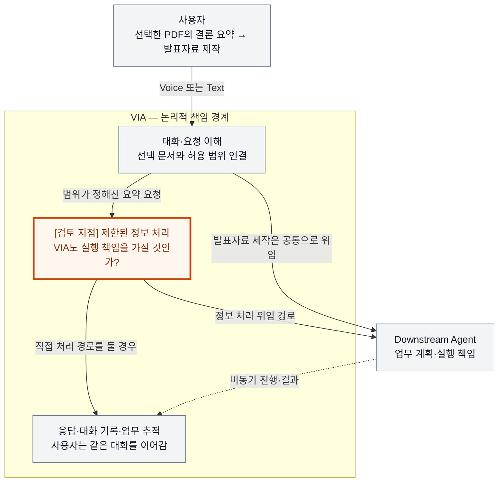
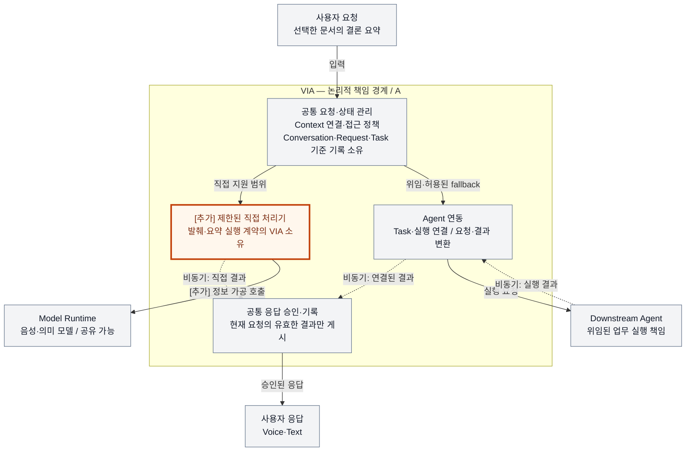
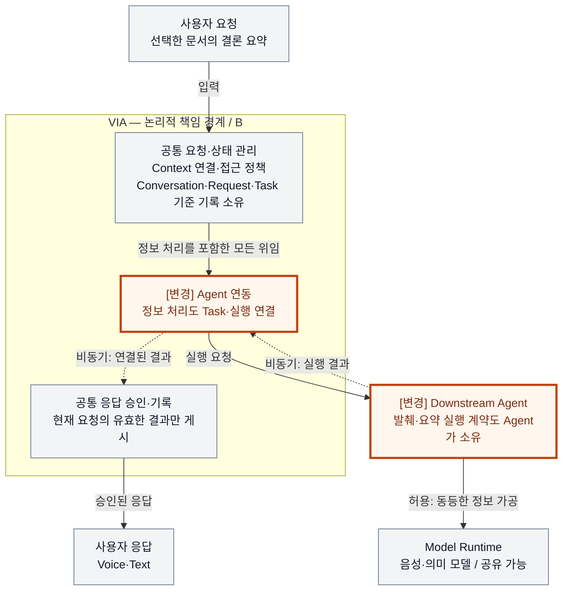

# VIA-DP-01 — 범위가 정해진 정보 처리의 책임 경계

> **검토 초안 v1 · 2026-09-24 · 사용자 검토 전**
>
> 결정할 것: VIA가 제한된 정보 처리 기능을 직접 소유하면서 Agent 위임과 조합할 것인가, 해당 기능의 실행 책임을 모두 Downstream Agent에 둘 것인가?
>
> 현재 판단: **책임 경계로서 중요한 결정이지만, 현행 QA에서 충분한 양방향 trade-off를 만드는 Core DP인지는 아직 입증하지 못했다.** 대안 선택, 구현, 측정은 하지 않았다. 모든 QA 결과는 `NOT_RUN`이다.

이 보고서는 VIA를 처음 접하는 SW Architect를 위한 독립된 검토 문서다. 배경과 대안을 설명한 뒤, 같은 사건을 두 구조에 통과시키는 사고실험으로 전체 QA를 검토한다. 마지막에 검증 계획, 현재 판단과 작성 과정에서 발견한 개선점을 남긴다. 사고실험은 설계 가설이지 실행 결과가 아니다.

## 1. 배경 — 간단한 정보 질문도 모두 업무로 위임해야 할까?

사용자가 PC에서 PDF를 선택하고 VIA에 말한다.

> “선택한 보고서의 결론을 세 문장으로 알려줘.”
> 답을 들은 뒤 “그 내용으로 발표자료 파일을 만들어줘.”라고 이어서 요청한다.

VIA는 Voice·Text·화면을 잇는 PC 소프트웨어다. 사용자의 요청과 대화를 이해하고, 필요한 Context를 연결하며, 업무의 진행·결과를 같은 대화와 Task에 연결한다. **Context**는 선택 문서·화면·대화 등 요청을 해석하고 수행하는 데 허용된 정보다. **Task**는 VIA가 추적하는 업무이며, Agent의 실행 ID와 구별한다.

발표자료를 실제로 만드는 업무는 Downstream Agent가 맡는다. Agent는 도메인 추론, 계획, Tool 선택과 실행을 책임진다. 문제는 그 앞의 짧은 문서 요약이다. 대상과 읽을 범위가 이미 정해졌다면 VIA도 처리할 수 있지만, 이를 지원하려면 VIA가 답변 기능의 계약·오류·변경·회귀 검증까지 책임져야 한다.



회색은 공통 책임, 주황색은 미정인 결정 지점이다. 검토 지점은 추가 Component가 아니다. 실선은 표시한 요청·결과 흐름, 점선은 비동기 전달이다. VIA 박스는 논리 경계이며 OS Process나 PC 배치를 뜻하지 않는다. Model·저장소·음성 재생의 상세는 이 배경 그림에서 생략했다.

**함께 만족시키려는 요구:** 짧은 정보 질문은 불필요한 위임 대기 없이 처리하고 싶다. 동시에 VIA가 Agent의 정보 처리 기능까지 중복 소유해 변경·검증 부담을 늘리는 것도 피하고 싶다. 선택적 직접 처리로 두 요구를 일부 조합할 수 있지만, 직접 기능을 하나라도 소유하면 그 기능의 수명과 오류에 대한 VIA 책임은 남는다.

**설계하지 않았을 때의 영향:** 간단한 질문까지 Agent 가용성에 의존하거나, 반대로 VIA가 어디까지 직접 처리해야 하는지 불명확해 요청 누락·중복 결과·범용 업무 실행기화가 발생할 수 있다. 다만 이런 위험이 실제 QA 점수 차이가 되는지는 뒤에서 따로 검증한다.

**이번 질문:** 범위가 정해진 정보 처리의 실행 책임을 VIA에도 둘 것인가, Agent 경계에 일원화할 것인가?

## 2. 무엇을 비교하고 무엇을 그대로 둘 것인가?

### 2.1 비교 대상 기능

이 검토의 출발 기능은 **사용자가 지정한 문서의 허용된 구간에서 내용을 발췌·요약해 답하는 기능**이다. 문서와 구간을 찾기 위한 공통 Context 연결과, 찾은 내용을 가공해 사용자의 정보 요청을 완수하는 실행 책임을 구별한다.

이후 그림의 **Conversation**은 이어지는 대화 기록, **Request**는 사용자 입력에서 분리한 논리적 처리 단위다. 하나의 Task에 여러 Request가 이어질 수도 있고, 짧은 직접 응답은 Task 없이 Request와 Conversation에만 기록될 수도 있다.

| 구분 | 이 보고서의 범위 |
| --- | --- |
| 직접 처리 후보 | 대상과 정보 범위가 이미 정해진 발췌·짧은 요약. 외부 변경이나 탐색 계획이 필요하지 않음 |
| 양쪽 모두 Agent 업무 | 열린 자료 조사, 여러 Tool을 선택하는 탐색, 파일 작성·수정, 전송·일정 변경 등 실제 행동 |
| 양쪽 모두 유지하는 기존 직접 응답 | S2S의 일반 대화, VIA가 이미 보유한 Task 상태 응답 |
| 양쪽 모두 VIA 책임 | 요청 이해, Context 연결·접근 정책, Conversation·Task의 기준 기록, 실행 연결, 사용자에게 결과를 전달하는 책임 |

S2S는 음성 입력과 음성 응답을 제공하는 모델 의존성이다. VIA Semantic Model은 요청 해석 등에 사용하는 의미 모델이다. **Model Runtime은 추론을 실행하는 의존성이지 요청·Task의 최종 소유자가 아니다.** 모델 내부 설계·학습은 이 결정의 대상이 아니다.

초기 기능을 문서 요약으로 좁힌 것은 사고실험의 입력을 명확히 하기 위해서다. 메일·일정·웹의 모든 조회를 이미 검증한 것으로 확대하지 않는다. 기능 범위를 확대하면 새 Context·권한·실패 조건을 검토한다.

### 2.2 사실·후보 설계·미확인 가정

| 구분 | 내용 | 근거 또는 상태 |
| --- | --- | --- |
| 현재 요구 | 제한된 정보 요청은 VIA 직접 처리와 Agent 위임 모두 허용된다. VIA가 범용 Agent가 되어서는 안 된다. | [System Mission](../01-system-mission-and-boundary.md), [Use Cases UC-02·08](../05-representative-use-cases.md) |
| 현재 요구 | 직접 응답에 Task가 없었어도 그 내용을 후속 업무에 연결한다. 위임 업무는 VIA Task와 Agent 실행을 연결한다. | [Use Cases UC-07·08](../05-representative-use-cases.md) |
| 후보 설계 | 양쪽에 같은 Context·Model 연결 추상화, 응답 승인·기록 정책과 Agent 연동 구조를 둔다. | 이 DP만 비교하기 위한 공통 고정 조건. 다른 DP의 채택 결과가 아님 |
| 후보 설계 | A는 제한된 직접 기능과 Agent 위임을 조합한다. B도 빠른 읽기 전용 Agent를 사용할 수 있다. | 아래 A/B 명세 |
| 미확인 | 같은 입력·기능 수준을 만족하는 직접 처리기와 Agent 구현의 처리시간, 메모리, 실제 변경 요소 수 | 미구현·미측정. 실제 값이나 우세 크기를 가정하지 않음 |
| 미확인 | 현행 QA 모집단에서 이 기능이 차지하는 비중과 최악 case 여부 | 후속 fixture·applicability 검토 필요 |

### 2.3 공정하게 고정할 조건

사용자 입력, 선택 문서 version과 허용 구간, 답의 완료 조건, 보호정보 정책, 음성 출력 조건, 기존 Task 부하를 같게 둔다. 동일 기능에 사용할 수 있는 모델 능력·실행 자원·cache 조건도 양쪽에 동등하게 허용한다. A만 로컬 모델, B만 느린 원격 범용 Agent인 비교는 하지 않는다.

B는 지정된 구간만 받아 단일 호출로 요약하는 전용 Agent를 사용할 수 있다. 불필요한 planning·다단계 Tool 호출·전체 대화 전달을 강제하지 않는다. A도 기존 Semantic Model을 공유할 수 있으며, 전용 모델 하나를 추가 상주시킨다고 가정하지 않는다. 양쪽 모두 필요한 Context 검사와 결과 연결 검증을 생략할 수 없다.

문서 요약의 동일 완료 조건에는 요청한 내용·형식·출처 연결과 허용 범위 준수가 포함된다. VIA 통합 검증에서는 사전 정의한 결과와 **oracle(실행 전에 정한 정답·허용 상태 조건)**로 통제한다. 외부 Agent의 일반적인 요약 능력과 VIA 모델의 능력을 임의로 비교해 Architecture 우열을 만들지 않는다.

## 3. 대안 A — 선택적 직접 처리 + Agent 위임

VIA가 지원하기로 선언한 제한된 기능을 직접 소유한다. 이 보고서의 최소 기능은 지정 구간의 발췌·요약이다. 범위·권한·실행 조건에 맞는 요청에는 직접 경로를 사용하고, 그 밖의 업무는 Agent에 위임한다. 직접 처리 실패 시에도 허용된 범위에서 Agent로 전환할 수 있다.

이 안은 “모든 요청을 VIA에서 처리”하는 안이 아니다. **직접 처리와 위임의 hybrid 자체가 A**다. VIA는 직접 기능의 입력·출력, 오류, 취소·정정 시 무효화, 출처와 응답 기록의 계약을 책임진다. 모델을 호출했다고 그 책임이 Model Runtime으로 이동하지 않는다.



회색은 B에도 있는 책임, 주황색은 A가 추가로 소유하는 직접 기능이다. 실선은 표시한 요청·응답 흐름, 점선은 비동기 결과다. Context와 기준 기록은 양쪽에서 같은 공통 관리 영역에 축약했다. 응답 승인·기록 상자는 그 관리 영역의 출력 측 책임을 펼친 것이며 새 상태 소유자를 뜻하지 않는다. VIA 박스는 Process 경계가 아니며 Model·Agent의 PC/원격 배치도 정하지 않는다. **양쪽에 공통으로 존재하는 음성·요청 해석용 Model 호출**, 모델 반환·음성 재생 상세·취소·진행 알림은 생략했다. 그림 상자는 Architecture Element 계수 결과가 아니다.

**강점의 최선 형태:** 이미 확보한 Context와 공유 모델을 활용해 Agent 경계를 거치지 않고 처리할 수 있다. 해당 직접 요청에는 Agent 가용성이 필수 조건이 아니다. 필요하면 위임하므로 직접 기능의 범위를 좁게 유지할 수 있다.

**보완 후에도 남는 부담:** 직접 실행의 정정·취소·오류와 위임 전환을 VIA가 검증해야 한다. 공통 서비스를 최대한 공유해도 “이 결과가 현재 요청에 대한 유효한 직접 답인가?”를 책임지는 기능 계약은 사라지지 않는다.

## 4. 대안 B — 정보 처리 실행의 Agent 일원화

VIA는 요청의 의미와 Context를 연결하지만, 이 DP의 대상인 발췌·요약 기능은 직접 실행하지 않는다. 이를 전용 또는 범용 Agent의 실행 계약으로 위임한다. 짧은 요청에도 Task와 Agent 실행을 연결하되, 사용자에게 별도의 복잡한 업무 화면을 강제할 필요는 없다.

**얇은 VIA가 기능이 빈약한 VIA를 뜻하지는 않는다.** S2S 대화, 기존 Task 상태 응답, 요청 이해, Context 연결, 결과 표시와 후속 대화는 A와 같이 유지한다. Agent도 같은 허용 구간과 빠른 실행 전략을 사용할 수 있다. VIA가 Agent 결과를 사용자에게 전달하기 위한 표현·합성을 하는 것과, 원천 문서에서 요청된 답을 직접 계산하는 것은 구별한다.



회색 노드는 A와 같은 책임이다. 주황색의 `[변경]`은 Agent 연동과 Agent의 실행 범위가 넓어진다는 뜻이다. A의 직접 처리기는 없다. 화살표·논리 경계·생략 범위는 A와 같다. Agent의 Model 호출은 허용되는 최적화이며 특정 Agent 내부 구현을 VIA가 소유한다는 뜻은 아니다. 이 그림으로 별도 Process 비용이나 원격 통신 비용을 자동 가정하지 않는다.

**강점의 최선 형태:** VIA는 이미 필요한 Agent 연결·Task 제어 계약으로 정보 처리도 수용한다. 개별 발췌·요약 기능의 실행 구현과 변경 책임을 Agent 경계 밖에 유지한다. 전용 Agent·streaming·최소 Context 전달로 불필요한 실행 비용을 줄일 수 있다.

**보완 후에도 남는 부담:** 해당 요청도 Agent 실행 계약과 가용성에 의존한다. Task·실행 연결과 사실에 맞는 상태 처리가 필요하다. 다만 이 추가 경계가 실제로 얼마나 느리거나 무거운지는 배치·계약·부하에 달려 있다.

## 5. 이것이 강한 A/B 결정인가?

### 5.1 구조 차이

| 항목 | A: 선택적 직접 처리 + 위임 | B: Agent 일원화 |
| --- | --- | --- |
| 직접 정보 처리 실행 책임 | VIA가 선언한 지원 범위에 대해 소유 | VIA에는 없음. Agent 실행 책임 |
| VIA가 유지해야 할 계약 | 공통 Agent 계약 + 제한된 직접 실행 계약 | 공통 Agent 계약으로 정보 처리까지 수용 |
| 대상 요청의 필수 경로 | 직접 처리 시 Agent 경계 불필요 | Task·Agent 실행 연결 필수 |
| 기준 기록의 소유자 | VIA가 Conversation·Request·Task 소유 | 동일 |
| 대상 요청의 상태 | 직접 시 Request·응답 수명. 추적 업무가 아니면 Task 불필요 | Request 외에 Task·Agent 실행 수명 필요 |
| Model 의존 방향 | VIA 직접 처리기가 필요 시 Model 호출 | Agent가 정보 처리에 필요한 Model 호출을 책임짐 |
| 변하지 않는 것 | VIA의 응답 창구, Context 정책, 범용 업무의 Agent 실행, 공통 음성·상태 관리 | 동일 |

양쪽 모두 여러 Component의 연결과 책임을 바꾸며, 단순 routing threshold나 알고리즘 선택은 아니다. 나중에 바꾸면 지원 기능 계약, 회귀 fixture, 실행 연결, 로그 해석과 진행 중 요청 이행을 함께 바꿔야 한다. 그러나 **구조 차이가 있다는 사실과 여러 QA에서 유의미한 trade-off가 있다는 사실은 별개의 심사 항목**이다.

### 5.2 상호 배타성의 정확한 범위

같은 제품 version·기능 범위에서 **VIA가 사용자에게 답을 완수하는 직접 정보 처리 기능을 하나 이상 소유하면 A, 하나도 소유하지 않고 Agent 실행으로만 제공하면 B**다. 단순히 Context를 읽어 대상·권한을 연결하는 것은 직접 답변 기능으로 세지 않는다.

특정 요청을 A에서 위임했다고 B가 되지는 않는다. 반대로 B가 로컬 Agent를 쓴다고 A가 되지도 않는다. 이름·실행 위치가 아니라 실행 계약의 소유권, 변경 책임, 실패와 취소를 책임지는 경계로 판정한다. VIA 내부 처리기를 이름만 “Agent”로 바꾸는 것은 B의 근거가 아니다.

이는 기능 범위가 정해진 뒤의 이분법이다. A의 직접 지원 범위를 무제한으로 넓힐 권한은 주지 않는다. 향후 범위가 바뀌면 후보 version을 갱신한다. **A/B는 이 책임 배치에서 mutually exclusive이며, 각 안에는 적용 가능한 최선의 보완책을 허용하는 steelman 원칙을 적용한다.**

### 5.3 Hybrid와 제3안 검토

| 제안 | 처리 | 남는 선택 |
| --- | --- | --- |
| 쉬운 것은 직접, 어려운 것은 위임 | A 자체로 채택 | 직접 실행 계약의 VIA 소유 유무 |
| 직접 실패 시 Agent fallback | A에 허용 | 중복 게시 방지와 전환 수명 책임이 VIA에 남음 |
| B에 빠른 읽기 전용 Agent 배치 | B에 허용 | 빨라도 Agent 실행 계약·Task 연결을 사용 |
| Context·모델·cache·응답 검증 공유 | 양쪽 허용 | 자원 공유가 실행 책임까지 없애지는 않음 |
| 직접 기능을 plugin으로 분리 | 계약 소유권으로 판정 | VIA의 직접 기능 계약이면 A, 실제 Agent 계약과 독립 실행 책임이면 B |
| A 직접 경로와 Agent를 동시에 실행해 먼저 온 답 사용 | A의 별도 정책일 수 있음. 이번 비교에서는 사용하지 않음 | 중복 실행·취소·비용을 추가하는 정책이며 양쪽 장점을 비용 없이 얻는 해법이 아님 |

마지막 병렬 실행 정책을 배제하는 이유는 A를 약하게 만들기 위해서가 아니다. 양쪽에 동일한 자원·실행 예산을 적용하며, speculative 실행이 필요하다는 근거가 나오면 비용까지 포함한 새 후보 version으로 검토한다. 현재 A는 순차적인 직접 시도와 선택적 fallback만 사용한다.

## 6. 근거를 따라가는 사고실험

각 실험은 같은 외부 사건을 A/B에 넣는다. 아래의 `T1`~`T8`은 QA가 아니라 이 보고서 안의 근거 식별자다. 숫자 결과를 만들지 않고, 구조에서 따라오는 차이·반례·검증할 정보를 기록한다. `fixture`는 정답·허용 조건을 검사하기 위한 고정 입력과 외부 사건, `attempt`는 한 요청을 처리하려는 개별 실행 시도다.

<a id="t1"></a>
### T1. 짧은 문서 요약 — 더 짧은 경로가 더 빠른가?

**같은 사건:** 사용자가 같은 PDF 구간을 선택하고 요약을 요청한다. Context와 권한은 같고 Agent·Model은 준비 상태다. A에서 이 요청은 직접 지원 범위에 들어간다.

| 순서 | A | B | 측정상 의미 |
| --- | --- | --- | --- |
| 1 | 입력 해석·선택 구간 연결 | 동일 | 공통 VIA 구간 |
| 2 | 직접 처리 진입·현재 요청 version 연결 | Task·실행 연결 후 Agent ingress에 전달 | 서로 다른 실행 진입 비용 |
| 3 | 직접 처리기·Model이 답 생성 | 빠른 전용 Agent가 동등한 답 생성 | A에서는 QA-02에 포함. B의 Agent 내부 구간은 QA-01에서 제외 |
| 4 | 유효한 현재 결과 확인·대화 기록·의미 있는 음성 출력 | 실행 결과 연결 후 같은 확인·기록·출력 | 결과 연결 계약과 실제 audible endpoint 포함 |

병렬화하지 않은 한 trial의 진단 모델을 `W_A = C + R_A + P_A`, `W_B = C + H_B + P_B`로 둔다. `C`는 실제로 공통인 입력·출력 비용, `R_A`는 A의 직접 진입·검증 비용, `H_B`는 B의 위임·상태 연결·반환 비용, `P_A/P_B`는 각각 답을 준비하는 나머지 처리시간이다. 공통으로 볼 수 없는 비용은 `C`에 숨기지 않는다.

따라서 `W_B - W_A = (H_B - R_A) + (P_B - P_A)`다. A가 전체 사용자 대기시간에서 빠르려면 이 값이 양수여야 한다. 호출 수만 세서는 부호를 정할 수 없다. B가 같은 모델·cache를 공유하면 경계 차이만 남을 수 있고, B의 전용 실행이 더 효율적이면 역전될 수 있다. A가 직접 처리를 오래 시도한 뒤 fallback하면 두 경로의 순차 비용을 부담한다.

이 식은 **수치 추정이나 p95 공식이 아니다.** Streaming은 실제 critical path로 다시 분해하며, 개별 구간의 p95를 더하지 않는다. 가장 느린 대표 case가 이 요약이 아니면 이 case의 개선이 QA 대표값을 바꾸지 않을 수도 있다.

**판정:** 대상 기능은 A의 QA-02와 B의 QA-01로 경로가 갈라진다. 두 QA를 직접 비교하거나 B의 제외된 실행시간을 0으로 세면 안 된다. 공통 S2S 직접 응답과 공통 위임 업무는 별도로 회귀 비교한다. 경로 중립적인 전체 사용자 대기시간은 유용한 보조 근거지만, 현재 별도 대표 QA로 승인된 것은 아니다.

**반증·확인:** 같은 완료 조건으로 실제 음성 시작까지 paired trace를 수집했을 때 경계 절약보다 B의 처리 이점이 크면 A 우세 가설을 철회한다. [Voice Contract](../08-quality-attributes/voice-responsiveness.md), [Event Contract §3](../11-measurement/event-boundary-contract.md)가 endpoint 근거다.

<a id="t2"></a>
### T2. 처리 중 정정·취소 — 경로가 하나 더 있으면 더 부정확한가?

**같은 사건:** 첫 요약을 요청한 뒤 답이 오기 전에 “아니, 다른 문서의 결론을 알려줘”라고 정정한다. 이전 실행 결과가 정정 이후 늦게 도착한다.

| 사건 | A | B |
| --- | --- | --- |
| 첫 요청 시작 | Request version과 직접 실행 attempt 연결 | Request version·Task·Agent 실행 연결 |
| 정정 수락 | 이전 직접 결과의 게시 자격 무효화, 새 대상 연결 | 이전 실행 결과의 게시 자격 무효화, 같은 의미 정책으로 Task·실행 갱신 |
| 이전 결과 도착 | 오래된 version이므로 새 답으로 게시하지 않음 | 오래된 실행·version이므로 새 답으로 게시하지 않음 |
| 직접 처리 실패 | 허용된 fallback은 새 attempt로 연결. 이전 attempt는 뒤늦게 성공해도 게시 불가 | Agent 실패·재시도도 같은 현재성 검증 |
| 사용자에게 표시 | 실제로 확인한 현재 처리 상태만 알림 | 동일. 취소 요청 전달과 실제 취소 완료를 구별 |

양쪽의 공통 불변조건은 **현재 요청에 유효한 결과만 한 번 게시**하는 것이다. 한쪽만 version 검사·중복 제거·취소 보완을 빼서는 안 된다. A는 직접·위임 경로 전환을, B는 Agent의 비동기 실행 연결을 검증해야 한다. 상태 저장 방식과 응답 승인 위치는 이 실험에서 고정하며 별도 DP로 남긴다.

**판정:** A가 경로 두 개라 QA-13/14가 반드시 나쁘다는 결론은 나오지 않는다. B도 외부 실행 event를 다룬다. 계약이 완성되면 양쪽 모두 정확할 수 있다. 실행 빈도·실패 양상 없이 정확도 차이의 크기를 예측할 근거는 없다.

Task 없는 A 직접 응답의 정정은 Request·응답 검증 대상이다. 이를 QA-14의 Task 상태 수렴 성공 표본으로 억지로 추가하지 않는다. QA-05의 Task 제어도 A의 즉시 로컬 중단과 B의 외부 완료를 곧바로 비교하지 않는다. 공통 Task 제어에서 `requested/pending`이 정당한 완료 상태라면 양쪽 모두 그 사실을 빠르게 전달할 수 있다.

**반증·확인:** 같은 정정 trace에 늦은·중복·역순 결과를 주입하고 사전 oracle로 연결·현재성·한 번의 게시를 확인한다. 정확도 전체 모집단에서는 양쪽에 허용된 handling을 인정하고, 다른 경로를 택했다는 이유만으로 실패시키지 않는다. [Correctness Contract §2~5](../08-quality-attributes/correctness-and-continuity.md), [Task Control Contract](../08-quality-attributes/interaction-control-responsiveness.md)가 기준이다.

<a id="t3"></a>
### T3. 요약에서 실제 업무로 전환 — Task가 먼저 있으면 연속성이 좋아지는가?

**같은 사건:** 요약 완료 → 다른 대화 → “아까 요약한 내용으로 발표자료 파일을 만들어줘.” Voice에서 Text로 채널을 바꾼 변형도 포함한다.

A는 직접 응답의 내용·출처·Request 관계를 Conversation에 남기고, 후속 제작 요청에서 Task를 생성해 Agent에 전달한다. B는 요약 Task의 결과를 같은 대화에서 찾고, 후속 제작 목표를 새 Task 또는 기존 Task의 후속 관계로 연결한다. 어느 관계가 옳은지는 사용자 목표와 사전 oracle로 정한다. **먼저 Task가 있었다는 이유만으로 새 목표를 기존 Task에 붙이는 것은 정답이 아니다.**

양쪽 모두 전체 대화가 아니라 필요한 요약·출처·새 제약을 전달한다. A에 영속 응답 기록을 허용하지 않거나 B에 자동으로 올바른 참조를 제공하면 불공정하다. 공통 Conversation 기록·참조 계약을 잘 설계하면 정상 전환의 QA-15는 비슷할 것으로 예상한다. QA-13 역시 Task 존재 유무보다 대상 연결의 정확성을 본다.

**반증·확인:** 여러 응답과 Task가 섞인 동일 trace에서 대상 artifact version과 사용자 목표를 유지하는지 확인한다. 단일 요약 성공을 전체 continuity 성공률로 확대하지 않는다. [Use Cases UC-07·15](../05-representative-use-cases.md), [Correctness Contract §6](../08-quality-attributes/correctness-and-continuity.md)가 근거다.

<a id="t4"></a>
### T4. Agent 장애와 재시작 — 의존하지 않는 이점은 어떤 QA인가?

**같은 사건:** 직접 기능에 필요한 Model·Context는 정상이고, Agent 서비스만 사용할 수 없어진다. 정보 질문과 이미 진행 중인 별도 Agent Task가 있다.

A의 직접 지원 질문은 Agent 없이 계속 처리할 수 있다. B의 정보 질문은 Agent가 필수 의존성이므로 처리 불가 또는 대기가 된다. 양쪽은 진행 중인 기존 Agent Task의 상태를 사실대로 알려야 한다. 이 차이는 **해당 장애 아래 정보 기능의 가용성 차이**이며 구조적으로 설명할 수 있다. 단, A가 Agent와 같은 장애 원인·Model·인증에 의존한다면 이 이점은 사라진다.

여기서 QA-32는 단순히 중단된 기능 수가 아니다. **고장난 의존성에 원래 의존하는 기능을 제외하고, 불필요하게 함께 중단된 기능·Task 수**다. B의 정보 질문은 필수 의존 폐쇄 안에 있으므로 이 실패만으로 QA-32가 나빠지지 않는다. 양쪽의 기존 무관한 S2S 대화·다른 Task가 정상이라면 초과 장애 전파는 같을 수 있다.

QA-31도 Task 없는 직접 응답에 복구시간 0을 주고 B의 Task와 비교할 수 없다. 같은 추적 Task에 대해 올바른 identity·상태·제어를 복구하는 시간을 비교한다. A의 직접 처리기가 공유 Process를 막아 다른 기능을 중단시키면 A가 나빠질 수 있지만, 그것은 실제 자원·격리 조건을 고정한 뒤 입증해야 하며 DP-11의 Process 선택을 몰래 바꾸면 안 된다.

VIA 재시작 변형에서는 양쪽 모두 같은 저장 정책으로 Task·실행 연결을 복원하고, Agent의 실제 상태를 확인한 뒤 중복 실행 없이 결과·미완료 제어를 다시 연결한다. 화면에 Task 목록이 보인 시점만으로 복구 완료라고 하지 않는다. A의 직접 응답 재개가 필요하면 그 계약도 별도 검증하되, Task 복구 지표의 표본으로 자동 편입하지 않는다.

**반증·확인:** fault별 필수 의존 집합을 결과 전에 선언하고 독립 관측으로 무관한 기능의 지속 여부를 확인한다. QA-11에서도 “실패를 정직하게 알렸다”와 “원래 요약 목표를 달성했다”를 구별한다. 장애 fixture의 기대 결과를 양쪽에 유리하게 다르게 만들지 않는다. [Reliability Contract §1·2](../08-quality-attributes/reliability-and-resource.md)가 기준이다.

<a id="t5"></a>
### T5. Model·Agent·Context가 바뀜 — 어느 쪽의 변경 범위가 작은가?

실행 경로가 짧거나 Component가 적다는 사실만으로 변경되는 Architecture Element 평균 수가 작아지지는 않는다. Architecture Element는 독립된 책임·계약·상태·배치 단위이며 그림 상자나 파일 개수가 아니다. 같은 의미의 요소를 임의로 합치거나 나눠 점수를 만들지 않는다.

**Agent 변화:** 양쪽 모두 실제 업무를 위임하므로 Agent 추가·교체·protocol·status·실행 identity·capability·인증·질문 응답·artifact 변화인 A-01~A-09 전체를 수용해야 한다. A의 직접 질문이 영향을 덜 받는다는 것은 사용자 영향 범위이지, Agent adapter 하나를 바꿀 때 수정하는 요소 수가 감소한다는 증거가 아니다. 같은 공통 Agent 경계를 사용하면 QA-21은 비슷할 가능성이 높다. A의 fallback capability와 Agent 지원 집합이 강결합하면 오히려 A의 변경 범위가 늘 수 있다.

**Model·Context·State 변화:** B에도 요청 의미 판단·Context·Conversation 저장이 존재한다. 직접 처리기를 없앴다고 이 변경들이 0이 되지 않는다. 아래는 전체 15개 변화에 대해 확인할 추가 전파 경로다. “흡수 가능”은 변경 수가 0이라는 뜻이 아니라 **A/B 공통 경계의 변경만으로 끝날 수 있음**을 뜻한다.

| 변화 | 공통 경계에서 흡수 가능한 부분 | A에 추가 전파될 수 있는 조건 |
| --- | --- | --- |
| M-01 S2S 제공자 | 공통 음성 계약 | 직접 처리기가 제공자 전용 응답 형식에 결합한 경우. 이 결합은 필수 아님 |
| M-02 의미 모델 제공자 | 공통 Model 연결 | 직접 답변의 입력·출력 의미가 공통 계약으로 보존되지 않는 경우 |
| M-03 모델 크기·입력 한도·프로필 | 공통 호출 설정·입력 관리 | 요약의 분할·완료 계약까지 조정해야 하는 경우 |
| M-04 Cloud에서 Private Cloud | 공통 주소·인증·연결 | 직접 처리 전용 endpoint에 독립 계약이 생긴 경우 |
| M-05 Remote에서 PC | 공통 Runtime 수명·자원 관리 | 직접 처리에만 별도 모델·배치 책임이 필요한 경우 |
| M-06 PC에서 Remote | 공통 연결·권한·단절 대응 | 직접 답변 계약의 단절·재개 의미가 달라지는 경우 |
| M-07 S2S 이벤트 정보 | 공통 입력·지칭 연결 | 직접 처리기가 저수준 음성 이벤트를 소비하는 경우. 반드시 필요하지 않음 |
| M-08 의미 모델 streaming | 공통 delta·완료·오류 정규화 | 직접 처리기의 부분 결과 확정·취소 계약까지 달라지는 경우 |
| M-09 모델 대화 이력 계약 | 공통 대화 ID 연결·재구성 | 직접 답변용 이력을 별도로 소유한 경우 |
| C-01 정보 Source 교체 | 공통 Context provider | 직접 처리기가 provider 표현에 결합한 경우 |
| C-02 DOCX 추가 | 공통 문서 추출·출처 계약 | 새 문서 의미가 기존 요약 입력 계약에 담기지 않는 경우 |
| C-03 화면 연동 계약 | 공통 선택·객체 연결 | 직접 처리기가 화면 handle 표현을 직접 소비하는 경우 |
| C-04 기억 기록 확장 | 공통 기억·Context 계약 | 직접 처리기가 기록 schema를 직접 소비하는 경우 |
| C-05 두 번째 동종 정보원 | 공통 Source 식별·등록 | 직접 처리기가 단일 Source를 가정한 경우 |
| C-06 저장 형식 변경 | 공통 저장·이행 계약 | 직접 실행 상태가 별도 schema·이행 책임을 가진 경우 |

A의 강한 설계는 provider·저수준 상태에 직접 결합하지 않으며, 공통 정규화·저장 계약을 재사용한다. 따라서 위 표의 가능성을 모두 A의 추가 변경으로 세면 strawman이 된다. 반대로 M-03·08 등에서 직접 기능의 의미를 공통 경계가 보존하지 못하면 VIA의 직접 계약 변화가 남고 B가 유리할 수 있다. **그 조건이 실제 15개 change pack에 성립하는지, 몇 개 요소가 바뀌는지는 아직 ledger로 입증하지 못했다.** 외부 Agent 내부의 변경 공수를 VIA 변경 요소 수로 섞지도 않는다.

**실험·로그 변화:** E-01 timing, E-02 correlation, E-03 schema, E-04 export, E-05 assignment 전체를 본다. A는 직접 실행의 계측을 소유하지만 B도 위임 ingress·result·Task 연결을 계측한다. 공통 trace API가 추가 dimension과 schema를 흡수하면 비슷할 수 있다. producer가 하나 더 보인다는 이유로 다섯 변화 모두에 추가 요소를 세지 않는다.

**판정·확인:** QA-21은 공통 Agent 계약을 전제로 비슷함, QA-22/23은 전체 변경 ledger가 없어서 방향·크기 근거 부족이다. 각 변경을 같은 출발점에 독립 적용해 before/after 계약과 수정·추가·제거 요소를 기록해야 한다. 출처는 [Intentional Variables §7.4](../07-intentional-variables.md), [Change Locality Contract §3~5](../08-quality-attributes/evidence/change-locality-rationale.md), [Element Definition](../10-element-definition.md)다.

<a id="t6"></a>
### T6. PC 메모리 — 직접 기능이 있으면 무조건 무거운가?

**같은 사건:** 동일한 문서 크기·동시 요청 수·기존 Task 부하에서 직접 처리 또는 Agent 위임을 수행한다. warm/cold 조건과 실행 위치를 같게 고정한다.

A가 추가 모델을 상주시키면 그 메모리를 포함해야 한다. 그러나 기존 모델을 공유하면 추가 가중치 메모리는 없을 수 있다. A의 직접 Context·추론 buffer와 B의 추가 Task·직렬화·전달 buffer를 모두 본다. 시간 `t`에서 공통 메모리를 제외한 차이는 다음처럼 분해할 수 있다.

```text
M_A(t) - M_B(t)
  = A의 추가 직접 실행 상태·buffer(t)
  + A의 추가 VIA 소유 Runtime 메모리(t)
  - B의 추가 위임·Task·전달 buffer(t)
```

이는 원인 분해이며 알려진 숫자가 아니다. 실제 peak는 각 trial의 같은 시점 합계로 구하고, 서로 다른 시점의 개별 peak를 더하지 않는다. 이후 workload별 p95와 최악 workload를 집계한다. 다른 workload가 대표 최대치를 지배하면 작은 요약 요청의 차이는 QA-41 대표값을 바꾸지 않는다.

**판정:** A에만 큰 상주 자원이 실제로 필요하면 B 우세 가능성이 크다. 공유 모델이면 작거나 비슷할 수 있고, B의 전달·대기 buffer가 더 크면 역전될 수 있다. 현재는 필수 상주 자원·동시성·buffer 수명이 정해지지 않아 크기를 확정할 근거가 없다.

QA-41은 현재 계약상 VIA 소유 PC 메모리 경계다. 별도 Agent 내부 메모리가 제외된다고 그 비용이 사라지는 것은 아니다. 특히 로컬 Agent 사용 시 사용자 PC 전체 메모리가 절약되었다고 확대 해석하지 않는다. [Resource Contract §3](../08-quality-attributes/reliability-and-resource.md)의 소유권 경계를 보존하고 외부 자원 이동은 보조 설명에 남긴다.

**반증·확인:** 동일 기능·자원 조건에서 peak 시계열을 관측하고, 직접 기능 추가분보다 위임 buffer가 크거나 공통 모델이 지배하면 “B가 가볍다”는 일반 주장을 철회한다.

<a id="t7"></a>
### T7. 개인정보 — Agent에 전달하지 않으면 QA가 좋아지는가?

**같은 사건:** PDF의 허용된 결론 구간에 보호정보가 있고, 나머지 구간은 이번 답에 필요하지 않다. 양쪽에 같은 recipient·purpose 정책을 적용한다.

A는 필요한 구간만 직접 처리에 사용한다. B도 그 구간만 Agent에 전달한다. A가 원격 모델을 쓰면 그 모델에 대한 허용 범위 역시 검사한다. 양쪽이 각각의 수신자·목적에 필요한 범위를 지키면 QA-51의 **필요 이상 노출 단위 수**는 모두 0일 수 있다. 외부 호출 수·전체 전달량·수신자 수가 적다는 것과 excess exposure가 적다는 것은 다르다.

**판정:** 최소 범위를 지키는 두 steelman에서는 비슷할 것으로 예상한다. B에 전체 문서를 강제하거나 A만 로컬로 두어 개인정보 우세를 만들지 않는다. Agent가 불필요한 범위를 실제로 요구하면 그 계약·capability 조건을 명시한 별도 검증이 필요하다. Privacy QA를 추가하거나 범위를 확장하지 않는다.

**반증·확인:** 결과 전에 정한 보호정보 단위·recipient·purpose별 필요 집합과 실제 노출 집합을 비교한다. 같은 정보를 반복 전송했다고 중복해서 세지 않는다. [Scoring Contract §10](../11-measurement/scoring-contract.md)이 근거다.

<a id="t8"></a>
### T8. 진행 알림·음성 중단·연구 로그 — 직접 경로가 적은 사건을 만들면 유리한가?

**같은 사건:** 별도 Agent Task의 status가 source에 생성되고, 사용자가 음성 응답에 끼어든다. 같은 trace를 저장한 뒤 평가를 재현한다. A/B의 문서 질문이 동시에 있는 부하 변형도 별도로 검토한다.

QA-03은 Agent가 status를 만들기까지가 아니라 source에 생긴 뒤 사용자에게 전달하는 시간이다. 공통 상태 경로와 빈 audio lane이면 비슷하다. QA-04는 사용자가 말하기 시작한 뒤 기존 음성이 실제 멈추는 시간이며 Agent 취소 완료를 기다릴 이유가 없다. 직접 모델 부하나 위임 event가 공통 자원을 점유하면 달라질 수 있지만, 어느 쪽이 지배하는지는 자원·우선순위 조건 없이는 정할 수 없다.

QA-61은 각 실제 경로를 끝까지 재구성할 수 있는 run 비율이다. A는 직접 처리·fallback의 현재성을, B는 Task·Agent 실행과 반환을 연결해야 한다. Agent 내부 추론을 볼 수 없다는 이유만으로 B의 VIA trace를 불완전하게 판정하지 않는다. A의 이벤트 수가 적어도 하나가 빠지면 그 run은 불완전하다. 공통 수집·보존 계약이 같은 완전성을 제공하면 비슷할 것으로 예상한다.

QA-62는 같은 모델 답을 다시 생성하는 비율이 아니라 **저장한 원천 근거로 같은 평가 결과를 정확히 재계산하는 비율**이다. 양쪽 모두 입력·출력·설정·계약 version·oracle 참조·평가기를 보존해야 한다. 모델 호출 수가 적다는 이유로 A의 평가 재현성이 더 높아지지 않는다.

**반증·확인:** 독립 fixture의 사건 집합과 후보 trace를 비교하고, 누락·전송 실패·부분 파일·schema 변경에도 완전성과 재계산 가능성을 확인한다. 한쪽에만 공통 trace 수집기나 정상 종료 flush를 제공하지 않는다. [Voice Contract §4·5](../08-quality-attributes/voice-responsiveness.md), [Observability Contract](../08-quality-attributes/observability.md)가 근거다.

## 7. 전체 19개 QA의 예상 비교

**사고실험 예상 / 실제 측정 `NOT_RUN`.** 아래는 §2의 공통 조건과 §3·4의 steelman을 적용한 결과다. 시간·변경 수·장애 영향·메모리·노출은 작을수록, 정확도·연속성·기록·재현 비율은 클수록 좋다. 정확한 정의는 [QA Catalog](../08-quality-attributes/quality-model.md)를 따른다.

“비슷”은 명시한 공통 계약에서 차이를 만들 구조 원인이 약하다는 예상이다. “판단 근거 부족”은 차이의 방향·크기를 아직 모른다는 뜻이다. 확실성은 해당 판정의 근거에 대한 것이며 측정 신뢰구간이 아니다. 이 표에 우세가 적다고 임의의 크기나 가짜 점수를 채우지 않는다.

| QA와 단일 metric 요약 | 예상 판정·차이 크기 | 확실성 | 원인·반례·근거 | 평가 역할 |
| --- | --- | --- | --- | --- |
| QA-01 위임 경로 VIA 처리시간: 최악 case p95, Agent 실행 제외 | **직접 비교 불가**: 대상 요약은 B에만 해당. 공통 위임 업무는 비슷 | 높음 | A 직접 처리시간과 Agent 실행 제외 시간을 비교할 수 없음. [T1](#t1) | 대상 경로 적용성 해결 필요. 공통 업무 회귀 |
| QA-02 직접 Voice 응답시간: 최악 case p95 | **직접 비교 불가**: 대상 요약은 A에만 해당. 공통 S2S 경로는 비슷 | 높음 | B의 대상 기능은 위임. 서로 다른 case 집합의 최대값으로 승패 금지. [T1](#t1) | 대상 경로 적용성 해결 필요. 공통 직접 응답 회귀 |
| QA-03 Agent 상태 Voice 전달시간: 최악 case p95 | **비슷**, 공통 상태 전달·빈 audio lane 조건 | 중간 | status 생성 전 시간은 제외. 부하 경쟁 시 방향 미확인. [T8](#t8) | 회귀 확인 |
| QA-04 음성 중단시간: 최악 case p95 | **비슷**, 공통 playback 제어 조건 | 중간 | 실행 주체와 음성 정지 책임은 별개. 공유 자원 포화 시 재검토. [T8](#t8) | 회귀 확인 |
| QA-05 Task 제어 응답시간: 최악 control case p95 | 공통 Task는 **비슷**. Task 없는 직접 중단과는 직접 비교 불가 | 중간 | 양쪽 모두 사실에 맞는 disposition. 외부 취소 완료를 일률 강제하지 않음. [T2](#t2) | 공통 Task 회귀·적용성 확인 |
| QA-11 전체 요청 처리 정확도: case별 성공률의 평균 | **판단 근거 부족**, 방향·크기 미정 | 낮음 | 양쪽 허용 handling과 동일 완료 조건 필요. fallback·장애 기대 결과가 전체 case 집합에 미칠 영향 미확인. [T1~4](#t1) | 필수 기능 적합성 및 주 비교 후보 |
| QA-12 의미 해석 정확도: 올바른 의미 해석 run 비율 | **비슷**, 공통 의미·Context 계약 조건 | 중간 | B도 동일 grounding 가능. 직접/위임 중 하나를 oracle 정답으로 강제하지 않음. [T1](#t1)·[T2](#t2) | 회귀 확인 |
| QA-13 Task·Interaction 연결 정확도: 올바른 연결 run 비율 | **판단 근거 부족**, 방향·크기 미정 | 낮음 | A의 직접/fallback attempt와 B의 Agent 실행 연결에 각각 검증 부담. 경로 수만으로 오류율 도출 불가. [T2](#t2)·[T3](#t3) | 주 비교 후보·필수 연결 검증 |
| QA-14 비동기 Task 상태 수렴 정확도: 올바른 수렴 run 비율 | 공통 Task는 **비슷**. 대상 요약만의 전체 비교는 분모 검토 필요 | 중간 | A의 Task 없는 Request를 성공 Task로 추가하지 않음. 공통 수렴 계약 고정. [T2](#t2) | 회귀·적용성 확인 |
| QA-15 대화·Task 연속성: 정상 전환 성공 scenario 비율 | **비슷**, 응답·출처·관계 기록 조건 | 중간 | Task 없는 응답도 후속 업무로 연결 가능. B의 기존 Task가 자동 정답은 아님. [T3](#t3) | 회귀 확인 |
| QA-21 Agent 변화 영향 범위: 9개 변화의 변경 요소 평균 | **비슷**, 공통 Agent 경계 조건 | 중간 | A도 모든 Agent 변화 수용 필요. 요청 수 감소는 요소 수 감소가 아님. fallback 강결합 시 A 불리 가능. [T5](#t5) | 회귀, 실제 전파 확인 시 주 비교 재검토 |
| QA-22 Model·Context·State 변화 영향 범위: 15개 변화의 변경 요소 평균 | **판단 근거 부족**. 직접 계약까지 바뀌면 B 우세 가능, 크기 미정 | 낮음 | 공통 경계가 의미를 보존하면 비슷. 전체 change ledger 없이는 B 우세를 확정 못함. [T5](#t5) | 주 비교 후보 |
| QA-23 실험·로그 변화 영향 범위: 5개 변화의 변경 요소 평균 | **판단 근거 부족**, 방향·크기 미정 | 낮음 | 공통 계측이 흡수할 수 있음. 실제 생산자 계약 변화 수 미정. [T5](#t5)·[T8](#t8) | 주 비교 후보 또는 회귀로 후속 분류 |
| QA-31 올바른 Task 복구시간: 최악 fault p95 | 공통 Task는 **비슷**. Task 없는 직접 경로에는 적용하지 않음 | 중간 | 상태·복구 정책 고정. 직접 경로를 복구시간 0으로 채점 금지. [T4](#t4) | 회귀·적용성 확인 |
| QA-32 불필요한 장애 영향 범위: 초과 중단 단위 최대 수 | **비슷**, 공통 격리 조건 | 중간 | B 정보 기능의 필수 Agent 의존 실패는 초과 전파가 아님. 무관한 기능 중단 시 재검토. [T4](#t4) | 회귀 확인 |
| QA-41 target PC 메모리: 최악 workload의 peak p95 | **조건에 따라 다름**, 크기 미정 | 낮음 | A 전용 상주 자원이 지배하면 B 우세, 공유 모델이면 비슷 가능, B 전달 buffer가 지배하면 A 우세. [T6](#t6) | 주 비교 후보 |
| QA-51 불필요한 보호정보 노출: 초과 노출 단위 수 | **비슷**, 최소 범위를 지킨 경우 | 중간 | B도 최소 Context, A도 원격 Model 가능. 총 전달량이 아닌 초과분. [T7](#t7) | 필수 정책 회귀 |
| QA-61 실행 trace 완전성: 완전한 trace run 비율 | **비슷**, 공통 관측 계약 조건 | 중간 | 각각 실제 경로를 완전히 연결해야 함. 이벤트 수·Agent 내부 비공개만으로 우열 없음. [T8](#t8) | 필수 근거 회귀 |
| QA-62 평가 재현성: 동일 평가 재계산 비율 | **비슷**, 동일 evidence 보존 조건 | 중간 | 모델 재실행의 답 동일성이 아님. 양쪽 모두 frozen evidence로 평가 재현 가능. [T8](#t8) | 필수 근거 회귀 |

**A를 선택할 이유:** 제한된 질문에서 Agent 비의존성이 제품상 중요하고, 같은 기능·자원 조건의 전체 사용자 대기시간 이점이 직접 기능의 소유 부담보다 크다는 근거가 있을 때다.

**B를 선택할 이유:** 전용 Agent의 경계 비용이 수용 가능하고, VIA 직접 기능을 유지하지 않는 것이 실제 변경 요소나 PC 자원을 줄인다는 근거가 있을 때다.

**결론을 바꿀 가정:** 직접 기능이 공유 모델·공통 계약으로 충분히 흡수되는가, 빠른 Agent가 동등 기능을 제공하는가, 현재 QA가 경로 변화와 필수 의존성 차이를 공정하게 드러내는가이다. 우세 개수로 투표하지 않으며 QA-11과 QA-12~15의 중복 성공을 합산하지 않는다.

## 8. 후속 검증 계획 — 아직 실행하지 않음

| 순서 | 확인할 것 | 판정을 바꾸는 근거 |
| --- | --- | --- |
| 1 | 직접 기능의 최소 지원 범위, 전용 Agent의 동등 기능, 완료·실패 oracle | 같은 목표를 양쪽이 수행할 수 없으면 A/B 비교부터 재설계 |
| 2 | 동일 Context·Model·음성·Agent 계약의 경로표와 QA별 모집단 | 경로 중립 비교가 불가능한 QA는 점수표에서 억지 대체하지 않음 |
| 3 | A/B 전체 요소 registry와 A-01~09, M-01~09·C-01~06, E-01~05 변경 ledger | 강한 추상화 이후에도 실제 변경 전파 차이가 남는지 확인 |
| 4 | 직접 실행·fallback·위임의 state/event trace와 반례 oracle | 정정·늦은 결과·중복·채널 전환에도 동일 정확성 조건 유지 |
| 5 | target PC 자원 경계와 warm/cold·문서 크기·동시성 workload | 공유/전용 모델과 buffer가 대표 peak를 바꾸는지 확인 |
| 6 | Agent 장애의 필수 의존 집합, 독립 관측 지점, privacy 필요 집합 | 기능 가용성·초과 전파·불필요 노출을 서로 혼동하지 않음 |
| 7 | 측정 승인 후 paired campaign 정의 | fixture·반복·timeout·실패·집계·target·동점 기준을 결과 전에 동결 |

실행한다면 T1의 전체 사용자 대기시간은 보조 근거로 남긴다. 이를 새 대표 QA로 채택할지는 사용자와 별도 합의한다. QA 정의를 후보 결과에 맞춰 수정하거나 두 responsiveness QA를 합치는 작업은 여기서 하지 않는다.

현재는 `NOT_RUN`이다. 나중에 mock/reference를 실행해도 `MEASURED_REFERENCE_HARNESS` 등 실제 경로에 맞는 evidence label을 쓰며, 제품 음성 endpoint를 관측하지 않은 결과를 `PRODUCT_E2E`로 부르지 않는다. 실패·timeout을 제거해 percentile이나 성공률을 개선하지 않는다.

## 9. 다른 결정과 변경 비용

| 연결되는 결정 | 이번에 고정한 것 | 다시 열어야 할 조건 |
| --- | --- | --- |
| DP-02 상태 소유, DP-08 저장·복구 | 같은 Conversation·Request·Task 기준 기록과 복구 정책 | 직접 실행 상태가 별도 저장·복구 책임을 요구하는 경우 |
| DP-04 응답 확정 | 양쪽 같은 승인·게시 정책 | 직접 처리기가 게시 권한까지 가져가는 경우. 별도 결정으로 분리 |
| DP-05 Context 전달 | 같은 허용 구간·source version·정책 | Agent와 직접 처리기에 실제로 동등한 Context 제공이 불가능한 경우 |
| DP-06 의미 판단, DP-07 복합 요청 조정 | 같은 요청 의미·업무 관계. Agent planning은 Agent 책임 | 직접 지원 범위가 열린 탐색·계획으로 확대되는 경우 |
| DP-09 Agent 경계, DP-10 Model 연결 | 같은 정규화·Model 연결 추상화 | 공유 계약이 직접 답변 의미를 보존하지 못하는 경우 |
| DP-11 Process 격리, DP-12 실행 기록 | 같은 격리·수집 정책 | 실행 위치·독립 Runtime·로그 소유권을 함께 변경하려는 경우 |

A에서 B로 바꾸면 직접 지원 기능을 Agent capability로 이행하고, 진행 중 직접 요청의 완료·취소와 응답·출처 관계를 보존해야 한다. B에서 A로 바꾸면 직접 실행 계약·수명과 회귀 fixture를 새로 소유해야 한다. 양쪽 모두 이미 완료한 대화·Task 기록의 의미를 바꾸거나 과거 QA 모집단을 새 경로로 소급 재해석하면 안 된다. 이 비용 때문에 요청별 feature flag 하나를 바꾸는 결정과 다르다.

## 10. 현재 판단과 다음 논의

**책임 경계 결정으로는 유효하다. Core DP로서의 충분한 QA trade-off는 보류한다.**

A/B는 같은 정보 기능의 실행 책임을 서로 다른 경계에 두며, hybrid와 빠른 Agent를 허용한 뒤에도 배타성이 남는다. 하지만 기존 후보 설명의 “A는 QA-21·51, B는 QA-41·22가 유리”라는 도식은 현행 metric으로 충분히 뒷받침되지 않는다. 특히 QA-21·51의 A 우세 주장은 이 보고서에서 철회한다. QA-22·41의 B 우세도 조건부 가설로 낮춘다.

따라서 DP-01을 좋은 A/B 평가 예시로 보이게 하려고 느린 Agent·과도한 Context·별도 대형 모델을 한쪽에 강제해서는 안 된다. 중요한 경계 질문이라는 이유만으로 여러 QA의 강한 trade-off를 이미 통과했다고 표시하지도 않는다.

다음에는 먼저 **요약 기능 하나에 대해 공통 추상화 이후의 변경 ledger와 자원 경계를 문서 수준에서 구체화**하는 것이 좋다. 이때도 여러 QA를 바꿀 인과가 남지 않으면 DP-01은 시스템 책임 범위를 정하는 선행 결정으로 유지하되, 핵심 A/B trade-off 평가 대상에서는 제외·통합하는 것이 타당하다. 이는 남은 11개 후보를 같은 기준으로 검토할 때도 허용해야 할 결과다.

경로 중립 응답시간과 필수 의존성에 따른 기능 가용성이 중요한데 현행 대표 QA로 직접 비교되지 않는다는 점도 사용자와 확인할 필요가 있다. 새로운 QA를 자동 추가하지 않고, 보조 근거로 충분한지 또는 QA 계약 논의를 다시 열지 별도 결정한다.

## 11. 이번 예시를 읽고 발견한 개선점

아래는 처음 읽는 심사관 관점으로 수행한 작성자 자체 검토다. 독립 심사나 외부 승인을 받았다는 뜻은 아니다.

| 발견한 문제 | 이 보고서에 반영한 개선 | 남은 확인 |
| --- | --- | --- |
| 직접 처리 대 위임이라는 이름만으로는 hybrid가 빠짐 | A를 선택적 직접 처리 + 위임으로 재구성하고 B에 전용 Agent 허용 | 최소 지원 기능·실제 계약 소유자 승인 |
| “얇은 B”가 Context·모델·대화 책임까지 없는 것처럼 읽힐 수 있음 | 같은 공통 Component와 기준 기록을 A/B 그림에 모두 표시 | 구체 후보 구조가 동일 고정 조건을 지키는지 |
| 짧은 화살표가 빠른 QA 점수처럼 보임 | T1에서 경로·endpoint·기호식·역전 조건을 분리 | route-neutral 보조 근거의 평가 역할 합의 |
| Agent 변경 영향과 요청 장애 영향을 혼동 | T5에서 전체 change pack과 변경 요소 의미로 재검토 | 실제 요소 ledger |
| 독립 가용성을 fault blast radius 우세로 오인 | T4에서 필수 의존 실패와 초과 전파를 구분 | fault별 의존 집합 |
| 외부 전달량 감소를 privacy 우세로 오인 | T7에서 초과 노출만 비교. 기존 A 우세 철회 | 동일 recipient·purpose 정책 |
| Task 없는 경로를 정확도·복구의 자동 성공으로 처리할 위험 | T2~4와 QA 표에 적용성·분모 차이를 명시 | canonical case별 양쪽 applicability |
| 많은 Component가 바뀌면 강한 DP라고 자동 판단 | 구조 강도와 실제 QA trade-off 적합성을 따로 판정 | Core DP 유지·선행 범위 결정·통합 중 사용자 검토 |

문서의 논리적 완결성과 후보의 검증 완료는 다르다. 이 보고서는 배경 → 대안 → 반례를 포함한 사고실험 → 전체 QA → 한계와 다음 결정을 한곳에 갖춘 **검토 가능한 보고서**다. 미확인 ledger·자원 값·oracle을 채운 최종 후보 명세나 측정 보고서는 아니다.

### 문서 검증 기록

- 이전 대화 없이 읽는 자체 검토에서 Request·Conversation·oracle·실행 시도 용어를 사용 위치 앞에 설명하고, 초기 과장된 QA 우세를 수정했다.
- Mermaid 10.9.3과 headless Chrome으로 배경·A·B 그림 3개를 렌더링해 직접 확인했다. 첫 A 그림이 너무 넓어지는 문제를 공통 책임의 동일 축약과 중복 화살표 정리로 개선했다. 글자 잘림·노드 겹침은 최종 렌더에서 발견하지 않았다. 공통 그림 가이드의 예시 3개도 렌더링해 확인했다.
- 이는 로컬 렌더 검증이며 GitHub의 Mermaid version·테마나 실제 발표 슬라이드 배치를 검증한 것은 아니다. 생성한 그림은 임시 검토용이고 저장소에는 Mermaid 원문을 유지한다.
- active Markdown 링크·용어·QA catalog 검사와 `git diff --check`를 통과했다. 이 검사는 문서 정합성 검사이지 후보 구현·QA 측정이 아니다.
