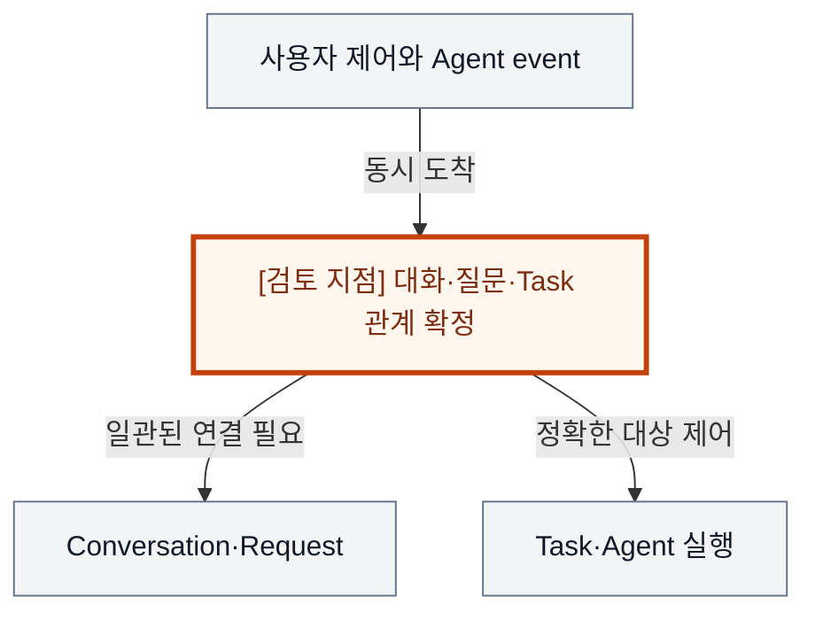
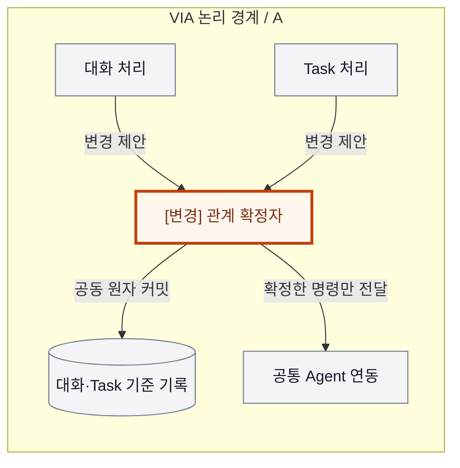
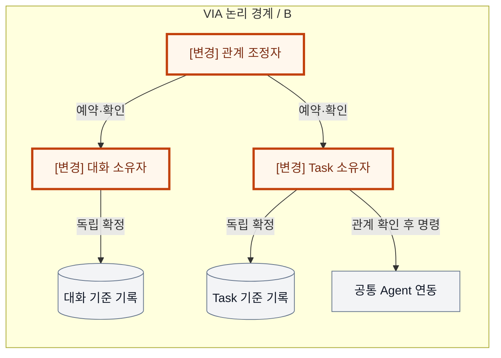
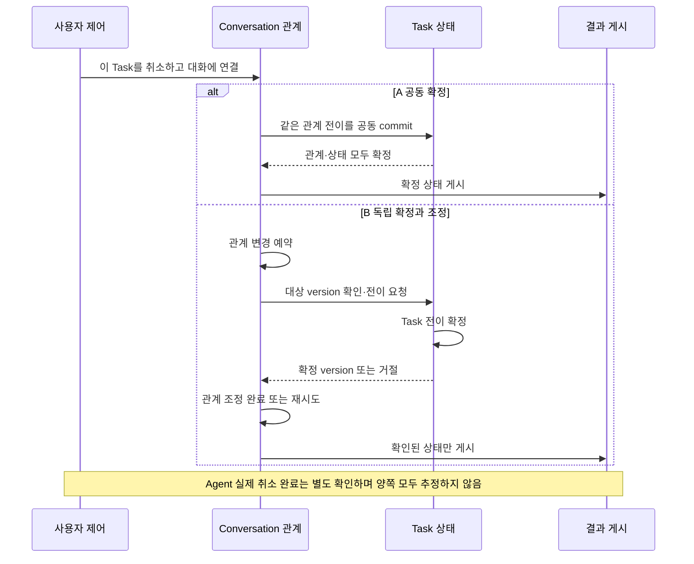

# VIA-DP-02 — 대화와 Task 관계의 확정 경계

> **검토 초안 v1 · 2026-09-24 · 사용자 검토 전**
>
> 질문: 대화·요청과 Task의 관계를 하나의 원자적 커밋으로 확정할 것인가, 독립 소유자의 확정을 연결할 것인가?
>
> 현재 판단: **조건부 핵심 검증 후보 — 소유자 수가 아니라 일관성 경계로 재정의** 대안 선택·구현·QA 측정은 하지 않았다. 실제 결과는 모두 `NOT_RUN`이다.

## 1. 배경 — 취소 중에 다른 Task의 질문이 도착하면 무엇이 먼저 확정되어야 할까?

보고서와 메일 검색이 진행 중이다. 사용자가 “보고서는 취소하고, 방금 질문에는 동의해”라고 말하는 동안 Agent의 완료 event가 도착한다. VIA는 어느 질문에 대한 동의인지, 취소 대상은 무엇인지, 대화에 어떤 상태를 기록했는지를 함께 맞춰야 한다. 관계를 함께 확정하면 중간 상태를 줄일 수 있지만, 서로 수명이 다른 대화와 업무를 계속 같은 확정 경계에 묶게 된다.

배경 그림의 주황색 검토 지점은 설계 질문이지 추가 Component가 아니다. VIA는 사용자 PC의 Voice·Text interaction과 업무 연결을 책임진다. Downstream Agent는 실제 업무 계획·Tool 실행을, Model Runtime은 추론 실행을 담당한다. 이 보고서는 그 내부 알고리즘이나 학습을 고르지 않는다.

## 2. 비교 범위와 공통 조건

**용어:** 원자적 commit(커밋)은 관련 변경을 전부 확정하거나 전부 확정하지 않는 처리다. owner는 상태 변경의 최종 권한자, mailbox는 그 권한자에게 들어오는 요청 대기열이다. version/세대는 오래된 변경을 구별하는 번호이고, 멱등 처리는 같은 명령이 중복 도착해도 효과를 중복 발생시키지 않는 방식이다.

대상은 VIA가 소유한 Conversation·Request·Task·대기 질문의 **교차 관계 변경**이다. Task 내부의 단일 변경 권한, Agent 내부 상태, 저장 방식이나 OS Process 수를 한꺼번에 고르지 않는다. 동의 대상 확인과 실행 권한 검사는 양쪽에 필수다.

**기준선에서 확인한 사실:** UC-06·12·14·15·18은 여러 질문의 연결, 취소·완료 교차, 채널 전환과 재시작 후 관계 복원을 요구한다. 요구의 출처는 [System Mission](../01-system-mission-and-boundary.md), [Fixed Scope](../03-fixed-architecture-scope.md), [Use Cases](../05-representative-use-cases.md)다.

**이번 비교의 설계 가정:** 동일한 영속 저장 매체·저장 보장, Agent 계약, Process 경계, 의미 해석 결과와 응답 게시 정책을 둔다. 외부 호출은 잠금 또는 소유자 mailbox의 상태 변경 구간 밖에서 실행한다. 공통 기준으로 오래된 세대의 변경을 거부한다.

**미확인 사항:** 교차 관계 변경의 실제 빈도, commit 지연, 지연 event 분포, C-06 상태 변경의 전체 요소 ledger. 사실·후보 설계·미확인 가정을 서로 바꿔 쓰지 않는다. Conversation은 이어지는 대화, Request는 논리적 요청, Task는 여러 요청에 걸쳐 추적하는 업무다. Oracle은 실행 전에 정한 정답·허용 상태 조건이고, fixture는 고정 입력·외부 사건이다.

## 3. 대안 A — 분리된 처리 책임 + 공동 원자 커밋

대화·Task 처리는 모듈로 분리하되, 관계를 바꿀 때는 하나의 관계 확정자가 관련 version과 정책을 검사하고 한 번에 커밋한다. Task별 mailbox·읽기용 사본·낙관적 version 검사를 허용한다. 기존 ‘통합 소유자’의 일관성과 ‘분리 책임’의 모듈성을 결합한 hybrid다.

채택 이유는 교차 관계의 확정과 복구를 한곳에서 설명하기 쉽다는 것이다. 모든 요청을 하나의 전역 잠금으로 직렬화하지 않는다. 그래도 공동 확정 계약·schema·오류 처리는 유지해야 하며, 관계 확정자가 불가용하면 그 관계 변경은 대기한다.

처리 모듈이 나뉘어도 최종 관계 확정은 하나다. 공유 DB를 사용한다는 사실보다 교차 변경을 승인·커밋하는 권한이 핵심이다.

## 4. 대안 B — 독립 상태 확정 + 관계 조정

대화 소유자와 Task 소유자가 자기 상태를 독립적으로 커밋한다. 관계 조정자는 같은 명령 ID와 version으로 예약·확인·완료를 이어 준다. 한쪽만 확정된 동안에는 아직 연결 중인 상태를 명시하고, 필요한 양쪽 확인 전에는 외부 행동이나 완료 게시를 하지 않는다.

단일 Task 내부 변경은 다른 대화 소유자의 가용성을 불필요하게 기다리지 않게 할 수 있다. 대기 기록·멱등 재전달·재조정을 포함한 강한 안이다. 대가로 중간 상태와 재시작 시 미완료 관계를 해소하는 계약이 추가된다. 분리되었다고 잘못된 관계를 잠깐 사용자에게 보여 주어도 되는 것은 아니다.

두 기록을 한 트랜잭션으로 공동 확정하지 않는다. 같은 DB 안에서도 서로 독립적으로 확정하면 B이며, 다른 Process 배치는 필수가 아니다.

두 구조도는 같은 확대 영역을 그린다. 회색은 공통 책임, 주황색과 `[변경]` 표기는 바뀌는 책임이다. 실선은 이름을 붙인 기능 흐름, 점선은 명시된 비동기 전달이다. **별도 Process라고 적힌 경우 외에는 논리 경계**다. 상자 수는 변경 요소 수나 메모리 크기가 아니다.

## 5. 구조 차이·상호 배타성·Hybrid 검토

| 차이 | A | B |
| --- | --- | --- |
| 관계 변경의 최종 기준 | 하나의 공동 commit | 각 owner commit + 조정 완료 |
| 실패 중간 상태 | 미커밋 또는 공동 확정 | 예약·한쪽 확정·조정 대기 가능 |
| 재시작 책임 | 공통 관계 version 복원 | owner 복원 + 미완료 조정 해소 |
| 공통 | Task identity·정책·외부 실행 사실 보존 | 동일 |

같은 교차 관계 전이를 A는 공동 원자 커밋으로, B는 독립 커밋들의 확인으로 확정한다. B에 최종 공동 commit을 추가하면 A로 바뀐다. A 안의 모듈·Task별 queue가 많아져도 공동 확정 기준을 유지하면 A다. 단일 Task 전이와 교차 전이는 구별하므로 모든 쓰기를 중앙화할 필요는 없다.

분리 owner를 두되 교차 변경만 공동 트랜잭션으로 처리하는 가장 강한 hybrid를 A에 포함했다. B의 빠른 로컬 전이와 조정 프로토콜도 허용한다. 2-phase commit을 쓰더라도 모든 관련 기록이 하나의 최종 commit 결정에 종속되면 A의 실현 방식이다. 이 결정과 Process 격리를 묶어 B에만 장애 격리 이점을 주지 않는다.

A/B 모두 같은 기능·권한·실패 의미와 합리적인 보완책을 허용하는 **steelman**이다. 같은 결정 범위의 최종 기준은 **mutually exclusive**해야 한다. 속도 차이를 만들기 위해 한쪽의 검증·기록·cache를 빼지 않는다.

### 같은 사건에서 확인하는 순서 차이

다음 그림은 A/B의 차이가 드러나는 동일 사건을 비교한다. 외부 완료와 VIA 내부 확정을 구별하며, 아래 사고실험에서 지연·실패 조건까지 확인한다.

## 6. 같은 사건을 통과시키는 사고실험

### T1. 동의·완료 교차의 정상 및 정정 trace

동일 입력에서 의미 해석은 같은 Task와 질문을 반환한다. A는 질문의 미완료 여부·Task version·동의 범위를 함께 검사해 관계와 명령을 확정한다. B는 대화의 답변 예약 → Task의 실행 가능성 확인 → 관계 조정 완료를 거친다. 그 사이 completion이 오면 양쪽 모두 이미 완료된 사실에 맞게 거절·수정한다. B는 version 충돌을 재조정해야 하지만 A도 optimistic 충돌 시 재시도가 필요하다.

공통 비용을 제외한 한 trial의 관계 처리 차이는 ‘B의 실제 조정 왕복·재시도 − A의 공동 commit·충돌 대기’다. A가 단순 관계 변경에서는 유리할 수 있으나 B가 호출을 합치고 같은 Process에서 실행하면 차이는 작다. 반대로 A가 많은 관계 쓰기의 경합점이 되면 단일 Task 제어는 B가 빠를 수 있다. 숫자와 전체 p95 방향은 workload 없이 정하지 않는다. QA-05는 취소 완료가 아니라 사실에 맞는 제어 disposition까지다.

### T2. 한 owner의 지연과 전체 재시작

같은 Task 관련 저장 호출이 지연되는 사건을 준다. A도 Task별 queue와 짧은 commit으로 다른 관계를 계속 처리할 수 있다. B는 로컬 전이를 계속할 수 있지만, 고장난 owner가 꼭 필요한 교차 관계는 기다려야 한다. 이 필수 의존 실패는 QA-32 초과 전파가 아니다. 논리 owner 분리를 Process crash 격리로 해석하지 않는다.

재시작은 A의 마지막 공동 상태와 pending 명령, B의 각 상태와 미완료 조정 기록에서 시작한다. B의 예약 후 중단, Task 확인 후 대화 확인 전 중단을 각각 재생해 중복 전달 없이 수렴해야 한다. B의 추가 reconciliation이 QA-31을 늘릴 수 있으나 A 전체 복원량·부분 로딩·B의 checkpoint에 따라 역전 가능하다. UI가 뜨는 시점이 아닌 모든 영향 Task의 올바른 제어 가능 시점이 종료다.

### T3. 채널 전환·trace·변경 전파

Voice를 끄고 Text로 답해도 두 안 모두 대기 질문과 Task identity를 보존해야 한다. A의 공동 기록은 인과 연결을 한곳에서 검사하기 쉽지만, B도 correlation과 owner별 확정 event로 완전한 trace를 만들 수 있다. QA-13/14/15/61의 자동 우세는 없다.

A-01~09는 동일 Agent 경계에서 흡수하는 회귀다. M-01~09 및 C-01~05는 공통 모델·Context 경계가 중심이며, C-06에서 A의 공동 관계 schema·commit 계약 또는 B의 조정 상태·이행 계약이 실제로 바뀌는지 ledger로 확인한다. 모듈화된 A를 일부러 전체 수정으로 세지 않는다. E-01~05도 공통 trace API·reader·export·assignment 변경과 owner별 수정이 필요한 부분을 분리한다. 전체 9/15/5개 평균을 예시 한 건으로 대신할 수 없다. Privacy는 같은 정보 범위를 유지하면 비슷하다.

## 7. 전체 19개 QA 비교

**사고실험 예상 / 실제 측정 `NOT_RUN`.** §2의 조건과 위 사고실험을 적용한다. 시간·변경 수·중단 수·메모리·노출은 작을수록, 정확성·연속성·완전성·재현 비율은 클수록 좋다. “비슷”은 명시한 조건에서 차이가 작다는 예상이며, “판단 근거 부족”은 방향·크기를 모른다는 뜻이다. 확실성은 실측 신뢰구간이 아니다. **부분 사례의 차이를 최악 case p95·전체 corpus·전체 change pack의 대표값 차이로 확대하지 않는다.**

| QA · 단일 metric | 예상 방향·크기 | 확실성 | 구조적 이유·반례와 근거 | 역할 |
| --- | --- | --- | --- | --- |
| QA-01 위임 경로 VIA 처리시간 · 최악 case p95; Agent 실행 제외 | 조건부: 교차 확정에서 A 조금 우세 가능 | 중간 | 공동 commit과 실제 조정 비용의 차이; A 경합이면 역전 [T1](#t1) | 주 비교 후보 |
| QA-02 직접 Voice 응답시간 · 최악 case p95 | 비슷; Task 관계 경로는 조건부 | 중간 | 일반 S2S는 동일, 기존 Task 조회에만 확정 경로 영향 [T1](#t1) | 회귀 |
| QA-03 Agent 상태 Voice 전달시간 · 최악 case p95 | 조건부; 크기 미정 | 낮음 | Task 상태와 대화 게시를 잇는 조정이 source 이후 경로에 참여 [T1](#t1) | 주 비교 후보 |
| QA-04 음성 중단시간 · 최악 case p95 | 비슷 | 중간 | 물리 재생 중단은 상태 공동 commit을 기다리지 않음 [T1](#t1) | 회귀 |
| QA-05 Task 제어 응답시간 · 최악 control case p95 | 조건에 따라 다름 | 중간 | 교차 제어는 A, 독립 전이 경합에서는 B 우세 가능 [T1](#t1) | 주 비교 후보 |
| QA-11 전체 요청 처리 정확도 · case별 strict 성공률의 평균 | 판단 근거 부족 | 낮음 | 올바른 중간 상태·실패 oracle가 필요하며 오류 빈도 미정 [T1](#t1) | 필수 검증 |
| QA-12 의미 해석 정확도 · strict 성공 run 비율 | 비슷 | 중간 | 같은 의미 해석 결과를 주고 확정 경계만 비교 [T1](#t1) | 회귀 |
| QA-13 Task·Interaction 연결 정확도 · strict 성공 run 비율 | 판단 근거 부족 | 낮음 | 공동 검사와 예약 프로토콜 모두 올바른 binding 가능 [T1](#t1) | 필수 검증 |
| QA-14 비동기 Task 상태 수렴 · strict 성공 run 비율 | 비슷 예상; 반례 검증 필요 | 중간 | 양쪽 모두 version·멱등·재조정으로 수렴 [T2](#t2) | 필수 검증 |
| QA-15 대화·Task 연속성 · 성공 scenario 비율 | 비슷 | 중간 | 채널 identity와 Task identity 분리는 공통 [T3](#t3) | 회귀 |
| QA-21 Agent 변화 영향 범위 · 9개 변화의 변경 요소 평균 | 비슷 | 중간 | Agent adapter의 변경 범위는 같은 조건 [T3](#t3) | 회귀 |
| QA-22 Model·Context·State 변화 영향 · 15개 변화의 변경 요소 평균 | 조건부; 방향·크기 미정 | 낮음 | C-06의 공동 schema와 조정 계약 변경 ledger 필요 [T3](#t3) | 주 비교 후보 |
| QA-23 실험·로그 변화 영향 · 5개 변화의 변경 요소 평균 | 판단 근거 부족 | 낮음 | owner 수만으로 E-01~05 변경 요소 수를 도출 못함 [T3](#t3) | 회귀·ledger |
| QA-31 올바른 Task 복구시간 · 최악 fault p95 | 조건에 따라 다름 | 중간 | B reconciliation 대 A 공동 복원량; 최악 fault 확인 필요 [T2](#t2) | 주 비교 후보 |
| QA-32 불필요한 장애 영향 범위 · 초과 중단 단위 최대 수 | 비슷; Process 격리 우세 없음 | 중간 | 필수 owner 의존과 무관한 전파를 구별 [T2](#t2) | 회귀 |
| QA-41 PC 메모리 · 최악 workload의 peak p95 | 판단 근거 부족 | 낮음 | A 경합 buffer와 B 조정 상태·사본 크기 미정 [T2](#t2) | 보조 비교 후보 |
| QA-51 불필요한 보호정보 노출 · 초과 노출 단위 수 | 비슷 | 중간 | 같은 보호정보·수신자 정책; owner 분리 자체는 노출 아님 [T3](#t3) | 필수 회귀 |
| QA-61 실행 trace 완전성 · 완전한 trace run 비율 | 비슷 | 중간 | 중앙 관계 기록과 완전한 owner trace 모두 허용 [T3](#t3) | 필수 회귀 |
| QA-62 평가 재현성 · 동일 평가 재계산 비율 | 비슷 | 중간 | 저장 evidence·평가 version 보존은 동일 [T3](#t3) | 필수 회귀 |

A의 채택 근거는 빈번한 교차 관계를 한 번에 확정하는 비용·복구 단순성이다. B의 근거는 독립 Task 전이의 자율성이다. 실제 부하·조정 계약을 구체화해도 이 차이가 사라지면 핵심 평가에서 내려야 한다.

## 8. 공정한 검증 계획 — 실행하지 않음

교차 관계와 Task 내부 전이를 나눈 입력 집합, 각 commit 사이의 중단 지점, 중복·역순 event, 동일 상태 이행 C-06을 먼저 문서로 고정한다. 상태 저장 호출과 외부 전달 사이에 재시작을 넣어 원래 Task가 한 번만 이어지는지 검증할 계획이다.

측정에 앞서 동일한 목표·fixture·외부 기능·자원 조건, case별 실제 참여 경로, 실패·timeout 처리, 반복·집계·target·동점 기준을 동결한다. 최종 점수나 승리 개수는 지금 만들지 않는다. QA-11과 QA-12~15의 성공을 중복 합산하지 않는다. 잘못된 대상·중복 Action, 무효 승인, 무단 접근은 점수로 상쇄할 수 없는 필수 위반 조건이다.

근거 계약: [Voice responsiveness](../08-quality-attributes/voice-responsiveness.md), [Task 제어](../08-quality-attributes/interaction-control-responsiveness.md), [실제 event 경계](../11-measurement/event-boundary-contract.md), [정확성·연속성](../08-quality-attributes/correctness-and-continuity.md), [복구·장애·메모리](../08-quality-attributes/reliability-and-resource.md), [19개 QA catalog](../08-quality-attributes/quality-model.md), [변경 전체 집합](../07-intentional-variables.md), [변경 요소와 실험 change pack](../08-quality-attributes/evidence/change-locality-rationale.md), [관측·재현](../08-quality-attributes/observability.md), [Privacy·집계](../11-measurement/scoring-contract.md). 문서 사고실험은 실행 evidence label이나 기존 archive 결과로 대신하지 않는다.

## 9. 다른 DP·변경 비용

DP-08 저장 기준과 DP-11 Process 경계는 별도다. DP-04 응답 권한, DP-07 복합 관계, DP-12 기록 의무와 조합 시 교차 확정 계약을 다시 확인한다. [기존 TASK ADR](../../adr/ADR-002-task-state-authority.md)은 Task별 writer 선택이며 이 보고서로 변경하지 않는다. A→B는 예약·중간 상태와 reader 호환 이행, B→A는 미완료 조정 종료 및 공동 commit 경계로의 이행이 필요하다.

## 10. 현재 판단과 재검토 조건

**조건부 핵심 후보로 유지한다.** ‘중앙은 정확, 분리는 장애 격리’라는 초기 설명을 철회하고, 실제 공동 commit 대 독립 commit의 비용으로 좁혔다. QA-05/31과 변경·관계 검증의 차이가 구체 ledger와 trace에서 사라지면 supporting 결정으로 재분류한다. 지금 A/B 승자를 선택하지 않는다.

## 11. 자체 검토에서 반영한 개선점

단일 owner를 전역 잠금과 동일시하지 않았고, 분리 owner를 Process 격리와 동일시하지 않았다. B의 잘못된 중간 결과를 정상 동작으로 허용하지 않았다. Hybrid를 A로 재구성했으므로 초기 discovery의 A/B 문구를 그대로 인용하면 안 된다.

검토 범위는 문서·사고실험이다. 외부 심사나 후보 성능 검증을 완료했다는 뜻이 아니다. 렌더링·정합성 검사와 전체 후보의 최종 분류는 [전체 검토 종합](./dp-review-synthesis.md)에 기록한다.
