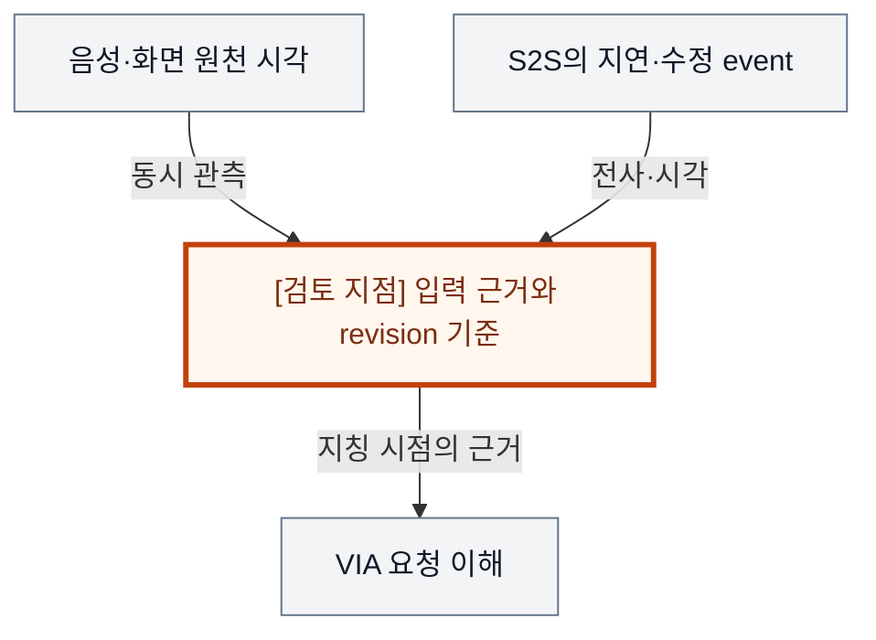
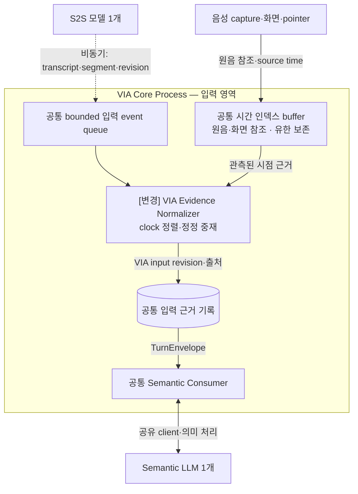
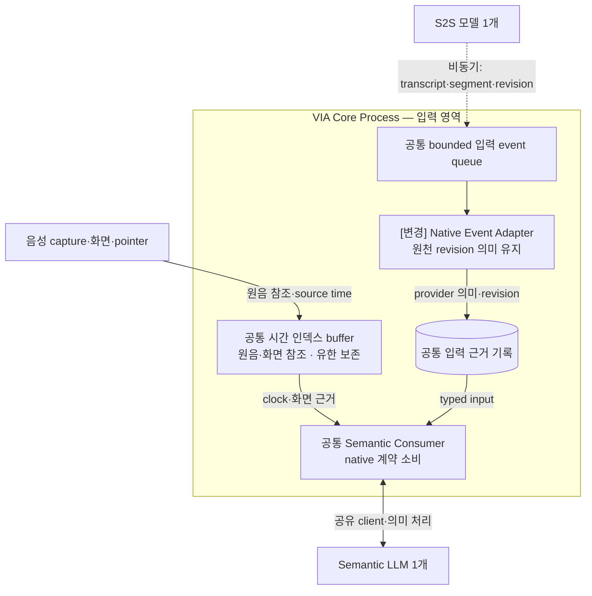
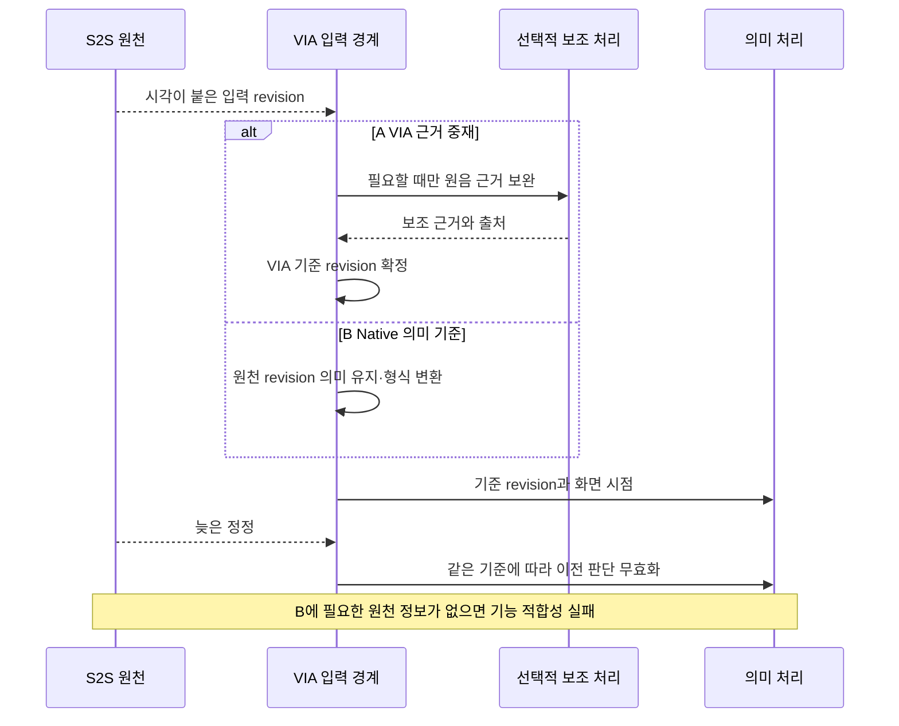

# VIA-DP-03 — 음성 입력 근거의 최종 기준

> **검토 초안 v2 · 2026-09-25 · 구현 구조 상세화 · 사용자 검토 전**
>
> 질문: 음성·정정·시각 근거의 의미를 VIA가 정규화해 소유할 것인가, S2S 제공자의 이벤트 계약을 기준으로 삼을 것인가?
>
> 현재 판단: **선행 기능 적합성 결정 — 고정 두 모델 안에서 입력 계약을 재정의, 핵심 점수 비교는 보류** 대안 선택·구현·QA 측정은 하지 않았다. 실제 결과는 모두 `NOT_RUN`이다.

## 1. 배경 — 늦게 도착한 ‘여기’는 어느 화면을 가리키는가?

사용자는 첫 그래프를 가리키며 “여기”, 두 번째 그래프를 가리키며 “여기와 비교해줘”라고 말한다. 전사 결과가 늦거나 수정되어 들어와도 VIA는 당시 화면과 각각의 표현을 연결해야 한다. S2S가 필요한 정보를 항상 같은 형식으로 제공한다고 가정할 수 없다. 이 문제는 ASR 제품 선택이 아니라 어떤 입력 근거를 최종 기준으로 유지하고, 누가 그 의미를 보존하는가의 문제다.

배경 그림의 주황색 검토 지점은 설계 질문이지 추가 Component가 아니다. VIA는 사용자 PC의 Voice·Text interaction과 업무 연결을 책임진다. Downstream Agent는 실제 업무 계획·Tool 실행을, Model Runtime은 추론 실행을 담당한다. 이 보고서는 그 내부 알고리즘이나 학습을 고르지 않는다.

## 2. 비교 범위와 공통 조건

**용어:** S2S는 음성을 입력받아 음성으로 응답하는 모델 의존성이다. native 계약은 그 제공자가 원래 내보내는 정보의 의미와 형식이다. revision은 입력 해석의 정정 버전이며, 같은 원음·화면의 시각을 연결해야 한다. 보조 처리는 빠진 근거를 확보하는 VIA 책임이지 원천에 없던 정답을 시험기가 제공한다는 뜻이 아니다.

대상은 Core에 전달하는 음성 입력·시각·정정 근거의 의미 계약이다. S2S 사용은 양쪽에 고정한다. 음성 출력용 TTS, 물리 재생 정지, 응답 게시 권한을 하나의 ‘보조 모델 사용’ 선택으로 묶지 않는다. 필요한 입력 근거가 없는 후보는 느리거나 부정확한 점수가 아니라 기능 부적합이다.

**기준선에서 확인한 사실:** UC-03·04는 사전 선택과 발화 중 지칭·정정을 모두 요구하며, 06 FA-09·10은 시험기가 잃어버린 이력이나 S2S에 없는 기능을 무료로 보충하지 못하게 한다. 요구의 출처는 [System Mission](../01-system-mission-and-boundary.md), [Fixed Scope](../03-fixed-architecture-scope.md), [Use Cases](../05-representative-use-cases.md)다.

**이번 비교의 설계 가정:** 같은 음성·pointer·screen source, source 시각과 도착 시각, S2S 기능 profile, 허용 Context와 정답 corpus를 사용한다. 실제 acoustic onset·playback stop은 양쪽에서 별도 관측한다. 추가 보조 모델은 허용하지 않는다. 비모델 정렬·정규화와 고정 모델의 실제 지원 기능만 사용한다.

**미확인 사항:** 현재 선택된 S2S 제공자가 없으므로 B가 전체 지칭·정정 UC를 만족하는 데 충분한 native evidence를 제공하는지 미확인이다. A의 정규화·보조 처리 비용과 모델 적합성도 미측정이다. 사실·후보 설계·미확인 가정을 서로 바꿔 쓰지 않는다. Conversation은 이어지는 대화, Request는 논리적 요청, Task는 여러 요청에 걸쳐 추적하는 업무다. Oracle은 실행 전에 정한 정답·허용 상태 조건이고, fixture는 고정 입력·외부 사건이다.

### 구현도를 읽기 위한 공통 전제

**S2S 모델 1개 + semantic LLM 1개**를 고정한다. Component·Task·단계별 별도 적재는 없고 프롬프트·세션·호출만 나눌 수 있다. 아래는 **구현 가능한 후보 설계 설명**이며 제품 구현 완료나 QA 실측이 아니다. 모델 동시 호출·취소 지원은 공통 dependency profile로 확인한다.

Core Process는 이 DP의 A/B 공통 비교용 배치다. Process 자체를 비교하는 VIA-DP-11 외에는 한쪽만 별도 Process를 추가하지 않는다. 외부 Agent Runtime은 VIA Client와 별개이며 모델의 local/remote 배치도 별도 조건이다. 생략 영역은 양쪽에서 동일하다.

실선은 라벨의 호출·반환·읽기·쓰기, 점선은 비동기 event다. Queue/buffer는 별도 노드, 영속 기록은 원통으로 그린다. 메모리 queue 수락은 durable commit이 아니고 별도 message bus 제품도 가정하지 않는다. 메시지는 request/Task/call identity와 관련 revision·generation으로 연결한다. 늦은 결과는 최종 owner가 검사한다. queue 용량·포화 정책은 측정 전 동결하며 무한 queue를 가정하지 않는다.

## 3. 대안 A — VIA 입력 계약 + 비모델 정렬·정규화

VIA의 입력 근거 관리자가 S2S event와 원음·화면 시각을 정규화해 Request version에 연결한다. S2S가 제공한 근거를 우선 활용하고 관측 원음·화면의 비모델 정렬·clock mapping을 결합한다. 새 ASR·VAD·TTS 모델을 추가하지 않는 hybrid다. 이 범위로 필수 정보를 얻지 못하면 capability 미충족이다.

최종 입력 version과 원천 근거의 관계를 VIA가 소유한다. S2S와 보조 결과가 충돌하면 조용히 덮어쓰지 않고 정정·보류 기준으로 처리한다. 강점은 제공자 변화에 대한 VIA 계약의 안정성이고, 약점은 충돌 해소와 보조 처리의 독립 수명·자원 책임이다.

**실제 호출·상태·실패 처리 순서**

1. Capture가 원음·pointer·화면 참조를 source time으로 buffer에 보존한다. S2S event는 수신 queue로 도착한다. 도착 순서와 발화 순서는 다를 수 있다.
2. Normalizer는 실제 segment·revision과 clock mapping을 연결해 VIA input revision을 확정한다. 정정이 오면 의존 판단을 무효화한다. 이후 의미 처리는 공유 LLM을 쓴다.
3. Normalizer는 새 ASR 모델이 아니다. 두 모델과 비모델 처리로 복원할 수 없는 시각·의미는 만들지 않는다. 필요한 기능이 없으면 clarification 또는 capability 미충족으로 남긴다.

보조 처리기는 항상 호출되는 고정 단계가 아니다. 어떤 결과가 현재 입력을 나타내는지 결정하는 계약은 VIA가 소유한다.

## 4. 대안 B — S2S 입력 계약을 기준으로 사용

S2S가 제공하는 transcript·segment·revision·time evidence를 최종 음성 입력 근거로 삼는다. VIA adapter는 표현·clock 연결을 변환하고 필요한 원천을 보존하지만, VIA가 확정한 별도 의미 입력으로 제공자 결과를 대체하지 않는다. 제공자별 typed event를 숨기지 않는 대신 Core와 grounding 경계에서 명시적으로 해석한다.

충분한 native 기능을 가진 제공자에서는 이중 입력 source의 충돌과 별도 입력 중재을 피할 수 있다. 빠른 source 처리와 사전 원음·화면 보존, 재연결·중복 제거는 허용한다. 그러나 native 계약으로 필요한 의미·정정 근거를 만들 수 없으면 이 profile에서 B는 성립하지 않는다.

**실제 호출·상태·실패 처리 순서**

1. 동일 buffer·queue를 쓴다. Adapter가 wire 형식·clock을 변환하지만 segment·정정의 최종 의미는 S2S 계약을 유지한다.
2. Consumer는 native 의미와 화면 근거로 요청을 해석한다. provider session과 VIA Conversation ID는 별개로 연결한다. 재연결만으로 새 대화를 만들지 않는다.
3. 늦은 revision으로 앞 판단을 무효화한다. 제공자가 필요한 근거를 주지 않으면 추가 ASR을 넣지 않는다. 동일 기능을 만족하는 native profile에서만 A/B 비교가 성립한다.

adapter가 있다는 이유만으로 A가 되지 않는다. 독립 입력 source로 제공자 의미를 대체·중재하는 권한을 두지 않는 것이 B의 경계다.

두 구조도는 같은 확대 영역이다. 같은 이름은 공통 책임, `[변경]`은 바뀐 책임이다. 경계의 Process 표시는 공통 비교용 배치이며 실선은 라벨의 기능 흐름, 점선은 비동기 전달이다. 상자 수는 변경 요소 수나 메모리 크기가 아니다.

## 5. 구조 차이·상호 배타성·Hybrid 검토

| 차이 | A | B |
| --- | --- | --- |
| 음성 입력의 최종 의미 계약 | VIA-owned input revision | S2S-native revision 의미 |
| 부족한 native 정보 | 보조 근거로 보완 가능 | 주어진 native profile로 요구 충족 여부 심사 |
| 변경 경계 | 정규화·보조 처리 책임 | native 계약 소비·adapter 책임 |
| 공통 | 원천 시각·출처, S2S, 화면 기록, 실제 음성 정지 | 동일 |

같은 입력 충돌에서 A는 VIA 계약에 따라 근거를 중재하고 B는 S2S 계약을 최종 의미 기준으로 삼는다. B가 VIA의 근거 중재를 최종 입력 기준으로 인정하면 A로 이동한다. 단순 format 변환·clock 변환·원음 보존은 양쪽에 허용된다.

S2S 근거와 VIA의 관측·비모델 정렬을 결합하는 구조를 A로 포함했다. 추가 helper 모델을 켜는 안은 현재 제약 밖이다. 초기 후보의 VAD·ASR·TTS·정렬 묶음은 서로 독립인 책임을 섞으므로 폐기했다. TTS는 출력 구현 조건, 물리 중단은 공통 필수 기능, response authority는 DP-04로 남긴다. 동등 기능의 B가 없는 profile에서는 억지로 A/B를 만들지 않는다.

A/B 모두 같은 기능·권한·실패 의미와 합리적인 보완책을 허용하는 **steelman**이다. 같은 결정 범위의 최종 기준은 **mutually exclusive**해야 한다. 속도 차이를 만들기 위해 한쪽의 검증·기록·cache를 빼지 않는다.

### 같은 사건에서 확인하는 순서 차이

다음 그림은 A/B의 차이가 드러나는 동일 사건을 비교한다. 외부 완료와 VIA 내부 확정을 구별하며, 아래 사고실험에서 지연·실패 조건까지 확인한다.

## 6. 같은 사건을 통과시키는 사고실험

### T1. 두 지칭과 늦은 정정

같은 source timeline에서 첫 ‘여기’의 수정 event가 두 번째 지칭 뒤 도착한다. A는 raw evidence → 정규화 revision → 필요한 보조 정렬 → 최종 referent 확정 순서로 처리한다. B는 native segment/revision → provider 의미 해석 → 같은 화면 근거 연결을 수행한다. 양쪽 모두 최신 화면 좌표로 과거 지칭을 대체하지 않는다.

A가 부가 정보를 얻어 더 잘 맞춘다는 주장은 실제 추가 근거의 생성 가능성과 정확도가 필요하다. Native evidence가 충분하면 B도 같은 대상을 얻는다. 반대로 어느 안도 원음·시각에서 복원할 근거가 없으면 clarification이 정답이며 oracle가 지칭을 무료로 알려주지 않는다. QA-12/11 방향은 실제 corpus 없이 확정할 수 없다.

### T2. 지연·중단과 보조 호출

A의 추가 처리가 critical path에 남는 경우에만 B의 QA-01/02/05 이점이 생긴다. 입력 중 병렬로 끝나거나 A가 native 결과를 그대로 쓰면 차이는 사라진다. A가 더 빠른 turn evidence를 제공하면 VIA 인식 지연을 줄일 가능성도 있지만, source 기능·정확성 검증 없이 그 시간을 만들지 않는다.

QA-04는 양쪽의 acoustic barge-in부터 실제 재생 정지까지다. ‘B는 S2S 서버가 인식할 때까지 기다린다’는 약한 안을 만들지 않는다. 공통 local playback 제어가 같다면 비슷하다. 두 안 모두 같은 두 모델만 사용한다. QA-41은 입력 queue·원음/화면 buffer·정규화 상태의 실제 수명만 확인하며 모델 추가 적재 차이는 없다.

### T3. 제공자 변경·재연결·연구 기록

M-01/07은 이번 경계에 직접 관련된다. M-07의 단어 시각→구간 시각 변경에도 원음은 제공되지만, B가 native 의미만으로 UC-04를 만족할 수 있는지는 별도 적합성 확인이다. 실패를 낮은 change count나 낮은 정확도 점수로 포장하지 않는다. A도 보조 정렬·입력 계약이 함께 바뀌면 여러 요소를 수정할 수 있다. M-02~06/08/09는 실제 역할·Runtime 변화가 닿는 경계를 각각 확인하고 C-01~06은 공통 Context·상태 계약 중심의 회귀다.

Agent A-01~09는 동일 경계를 유지한다. E-01~05는 입력 source·revision의 계측과 schema reader까지 추적하되 더 많은 event가 자동으로 더 완전한 trace를 뜻하지 않는다. 재연결 후 provider epoch를 새 VIA Conversation으로 착각하지 않고, 과거 근거와 이어 주어야 한다. QA-31은 실제 Task가 영향을 받은 fault에 한정하며 Voice-only 재연결을 Task 복구로 대체하지 않는다. 양쪽 모두 원음 무제한 보존이나 과다 외부 제공은 허용하지 않는다.

## 7. 전체 19개 QA 비교

**사고실험 예상 / 실제 측정 `NOT_RUN`.** §2의 조건과 위 사고실험을 적용한다. 시간·변경 수·중단 수·메모리·노출은 작을수록, 정확성·연속성·완전성·재현 비율은 클수록 좋다. “비슷”은 명시한 조건에서 차이가 작다는 예상이며, “판단 근거 부족”은 방향·크기를 모른다는 뜻이다. 확실성은 실측 신뢰구간이 아니다. **부분 사례의 차이를 최악 case p95·전체 corpus·전체 change pack의 대표값 차이로 확대하지 않는다.**

| QA · 단일 metric | 예상 방향·크기 | 확실성 | 구조적 이유·반례와 근거 | 역할 |
| --- | --- | --- | --- | --- |
| QA-01 위임 경로 VIA 처리시간 · 최악 case p95; Agent 실행 제외 | 조건부; 크기 미정 | 낮음 | 보조 처리의 비중첩 구간이면 B, 더 이른 유효 입력이면 A 가능 [T2](#t2) | 주 비교 가능성 |
| QA-02 직접 Voice 응답시간 · 최악 case p95 | 조건부; 크기 미정 | 낮음 | native fast path가 같으면 비슷; 호출 수만으로 판단 금지 [T2](#t2) | 주 비교 가능성 |
| QA-03 Agent 상태 Voice 전달시간 · 최악 case p95 | 비슷 | 중간 | source status의 공통 음성 전달은 입력 근거 결정과 별개 [T2](#t2) | 회귀 |
| QA-04 음성 중단시간 · 최악 case p95 | 비슷 | 중간 | local playback stop은 두 안 모두 허용 [T2](#t2) | 필수 회귀 |
| QA-05 Task 제어 응답시간 · 최악 control case p95 | 조건부; 크기 미정 | 낮음 | Voice control 입력 해석의 추가 근거 처리에 한정 [T2](#t2) | 주 비교 가능성 |
| QA-11 전체 요청 처리 정확도 · case별 strict 성공률의 평균 | 판단 근거 부족 | 낮음 | native capability와 전체 corpus 성공 조건 미확인 [T1](#t1) | 기능 적합성 |
| QA-12 의미 해석 정확도 · strict 성공 run 비율 | 판단 근거 부족 | 낮음 | 추가 evidence의 실제 유효성과 native 정보량 확인 필요 [T1](#t1) | 기능 적합성 |
| QA-13 Task·Interaction 연결 정확도 · strict 성공 run 비율 | 비슷 | 중간 | 최종 Request·Task identity 연결은 공통 [T3](#t3) | 회귀 |
| QA-14 비동기 Task 상태 수렴 · strict 성공 run 비율 | 비슷 | 중간 | Task source event 수렴 규칙은 같은 조건 [T3](#t3) | 회귀 |
| QA-15 대화·Task 연속성 · 성공 scenario 비율 | 비슷 | 중간 | provider epoch가 Conversation identity를 대체하지 않음 [T3](#t3) | 회귀 |
| QA-21 Agent 변화 영향 범위 · 9개 변화의 변경 요소 평균 | 비슷 | 중간 | Agent 변경 집합과 경계는 공통 [T3](#t3) | 회귀 |
| QA-22 Model·Context·State 변화 영향 · 15개 변화의 변경 요소 평균 | 조건부; 방향·크기 미정 | 낮음 | 정규화의 흡수 효과 대 정렬 계약 유지, M-07 적합성 우선 [T3](#t3) | 주 비교 가능성 |
| QA-23 실험·로그 변화 영향 · 5개 변화의 변경 요소 평균 | 판단 근거 부족 | 낮음 | 추가 source producer의 E 변경 ledger 필요 [T3](#t3) | 회귀·ledger |
| QA-31 올바른 Task 복구시간 · 최악 fault p95 | 판단 근거 부족 | 낮음 | Task가 영향받은 재연결·복원 경로만 비교 [T3](#t3) | 회귀 |
| QA-32 불필요한 장애 영향 범위 · 초과 중단 단위 최대 수 | 비슷; 격리 효과 미확정 | 중간 | 논리 입력 경계가 Process containment를 만들지는 않음 [T3](#t3) | 회귀 |
| QA-41 PC 메모리 · 최악 workload의 peak p95 | 판단 근거 부족 | 낮음 | 두 모델 수 동일; 입력 buffer·정렬 상태의 실제 peak 필요 [T2](#t2) | 자원 확인·ASR 우선 제외 |
| QA-51 불필요한 보호정보 노출 · 초과 노출 단위 수 | 비슷 | 중간 | source별 허용 목적·범위를 동일하게 유지 [T3](#t3) | 필수 회귀 |
| QA-61 실행 trace 완전성 · 완전한 trace run 비율 | 비슷 | 중간 | 필요한 source revision을 모두 기록하면 native도 complete 가능 [T3](#t3) | 필수 회귀 |
| QA-62 평가 재현성 · 동일 평가 재계산 비율 | 비슷 | 중간 | evidence와 evaluator 보존은 두 안 모두 가능 [T3](#t3) | 필수 회귀 |

A는 provider 변화를 견디는 입력 계약을, B는 충분한 native 기능을 단순하게 사용하는 구조를 선택할 이유가 있다. 현재 그 provider 적합성이 확인되지 않아 두 정상 후보가 실제로 성립한다고 확정하지 않는다.

## 8. 공정한 검증 계획 — 실행하지 않음

UC-03·04의 모든 하위 유형에 대해 native 제공 정보, 보존 원음·화면, 필요한 변환, 비모델 정렬의 실현 가능성을 적은 capability matrix부터 작성한다. 한쪽이 정보적으로 불가능하면 그 profile에서 비교를 멈춘다. 실제 모델과 고정 응답 재생의 의미 정확도 evidence를 구별한다.

측정에 앞서 동일한 목표·fixture·외부 기능·자원 조건, case별 실제 참여 경로, 실패·timeout 처리, 반복·집계·target·동점 기준을 동결한다. 최종 점수나 승리 개수는 지금 만들지 않는다. QA-11과 QA-12~15의 성공을 중복 합산하지 않는다. 잘못된 대상·중복 Action, 무효 승인, 무단 접근은 점수로 상쇄할 수 없는 필수 위반 조건이다.

근거 계약: [Voice responsiveness](../08-quality-attributes/voice-responsiveness.md), [Task 제어](../08-quality-attributes/interaction-control-responsiveness.md), [실제 event 경계](../11-measurement/event-boundary-contract.md), [정확성·연속성](../08-quality-attributes/correctness-and-continuity.md), [복구·장애·메모리](../08-quality-attributes/reliability-and-resource.md), [19개 QA catalog](../08-quality-attributes/quality-model.md), [변경 전체 집합](../07-intentional-variables.md), [변경 요소와 실험 change pack](../08-quality-attributes/evidence/change-locality-rationale.md), [관측·재현](../08-quality-attributes/observability.md), [Privacy·집계](../11-measurement/scoring-contract.md). 문서 사고실험은 실행 evidence label이나 기존 archive 결과로 대신하지 않는다.

## 9. 다른 DP·변경 비용

DP-05는 확보한 Context의 소비 계약, DP-06은 그 근거로 판단하는 권한이다. DP-04의 응답 승인과 DP-13의 물리 제어 자원은 별개다. A→B는 VIA 입력 version과 provider revision 이행, B→A는 정규화 기록·충돌 해소와 정렬 buffer 수명 이행이 필요하다. 기존 기능이 없는데 추가 모델이나 누락 근거를 측정기에서 무료 제공할 수 없다.

## 10. 현재 판단과 재검토 조건

**선행 기능 적합성 결정으로 유지하고 핵심 점수 비교는 보류한다.** ‘보조 모델을 몇 개 쓰는가’는 하나의 강한 DP가 아니었다. 재정의된 입력 authority도 동일 기능의 native B가 확인되어야 평가 후보로 승격한다. 임의 S2S 제품을 선정하거나 부족한 기능을 실제 제공 사실처럼 쓰지 않았다.

## 11. 자체 검토에서 반영한 개선점

음성 입력·음성 출력·물리 중단을 한꺼번에 바꾸던 결합을 해체했다. Native 기능 부재를 Architecture 점수 열세로 계산하는 오류를 제거했다. 추가 모델은 제약 위반으로 제외했다. 고정 두 모델과 비모델 정렬만으로 동일 기능을 제공할 수 있는지 확인해야 한다.

검토 범위는 문서·사고실험이다. 외부 심사나 후보 성능 검증을 완료했다는 뜻이 아니다. 전체 후보의 현재 상태·미완료 사항은 [요약 보고서](./dp-executive-summary.md#review-status), 문서 검증 기준은 [검토 protocol](./dp-review-protocol.md)을 따른다.
