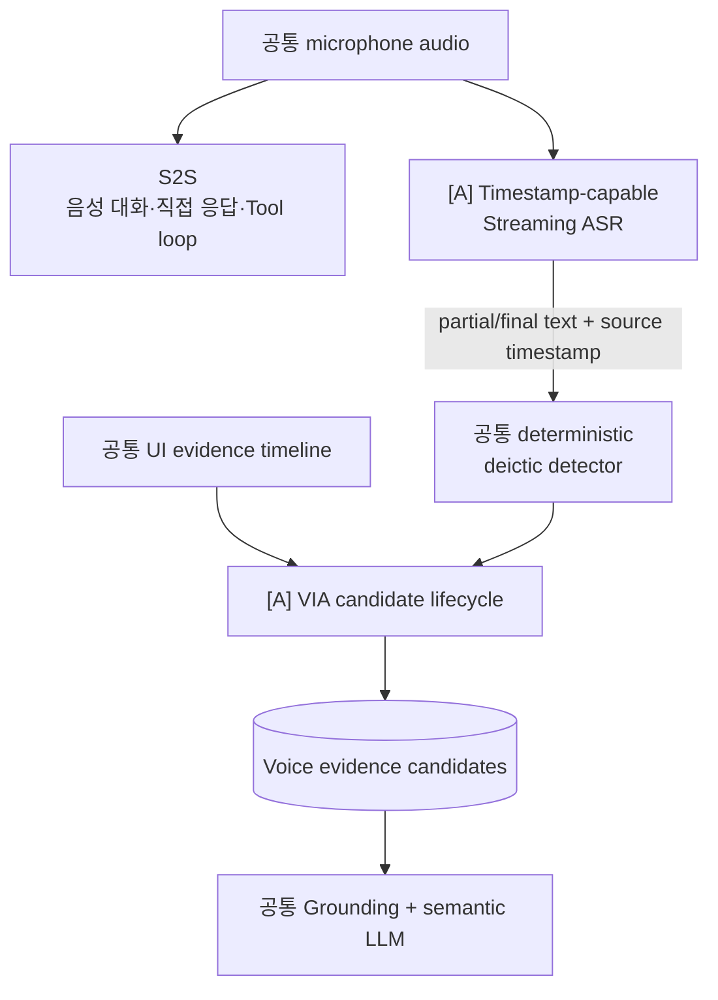
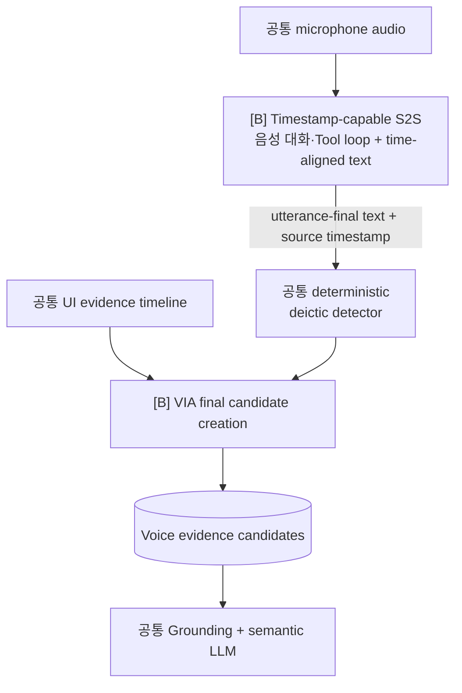
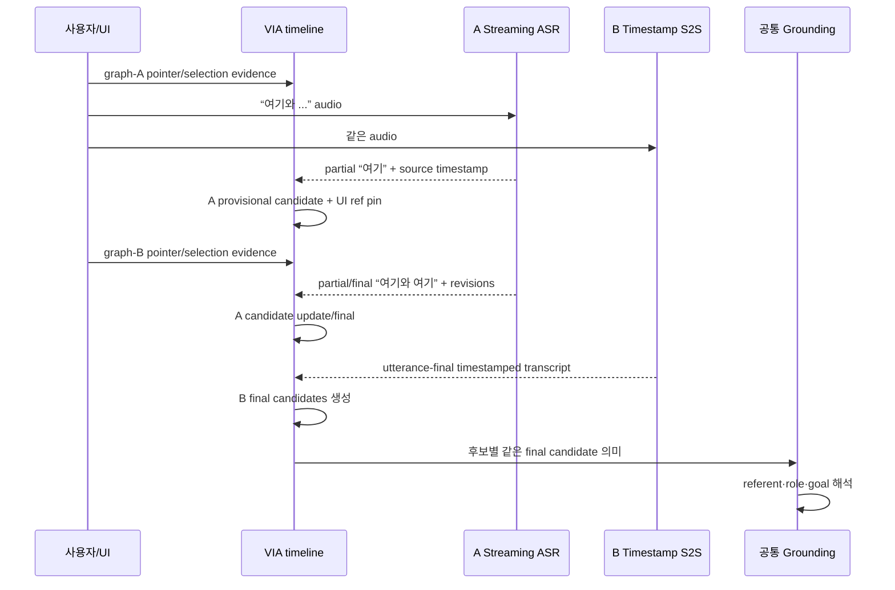

# VIA-DP-03 — 음성 지칭 근거 생성 경로

> **Core DP 1/6 · 대안 계약 합의 · Measurement Freeze 전**
>
> 질문: 지칭 표현의 실제 발화 시각을 별도 timestamp-capable Streaming ASR에서 받아
> VIA가 provisional evidence로 관리할 것인가, S2S 모델 자체가 발화 종료 후
> timestamped transcript를 최종 evidence로 제공할 것인가?
>
> 현재 판단: 대안 A/B의 책임·호출·candidate lifecycle은 합의했다. PoC는 A/B dependency behavior
> mock을 공식 profile로 사용한다. DP-03 spine patch·mock schedule과 Measurement Freeze는 아직
> `PENDING`이고 실제 결과는 `NOT_RUN`이다.
> 구현과 측정은 시작하지 않았다. 상세 동결 원장은
> [DP-03 Capability & Freeze Draft](../11-measurement/via-dp-03-capability-and-freeze.md)를 따르며,
> 공통 event·candidate 의미는 [DP-03 Candidate Contract](../11-measurement/via-dp-03-candidate-contract.md)에 둔다.

## 1. 해결할 사용자 문제

사용자는 첫 그래프를 가리키며 “여기”, 두 번째 그래프를 가리키며 “여기와 비교해줘”라고
말할 수 있다. Transcript가 늦게 도착했을 때 현재 pointer 위치만 사용하면 두 지칭이 모두
두 번째 그래프로 잘못 연결될 수 있다. VIA는 적어도 다음 관계를 보존해야 한다.

```text
음성의 지칭 span
→ 실제 audio source-time interval
→ 그 시각의 UI evidence reference
→ 이후 Grounding에서 확정할 referent
```

UC-03의 사전 선택, UC-04의 발화 중 복수 지칭·drag·정정·창 이동과 UC-11 중 UI 지칭을 포함한
Voice correction을 지원한다. UI 지칭이 없는 일반 transcript correction은 DP-03 후보 차이가 실제로
참여하지 않으므로 모집단에 억지로 넣지 않는다. 정보가 부족하면 임의 대상을 선택하지 않고
clarification한다.

## 2. DP-03의 경계

DP-03은 **지칭 span과 당시 UI 근거를 묶은 candidate를 만드는 경로**만 비교한다.

DP-03에 포함한다.

- timestamp가 있는 transcript span의 획득
- deterministic deictic-pattern detection
- partial/final/retraction lifecycle
- span과 같은 source-time의 UI evidence reference 연결
- Voice input evidence provenance와 revision 기록

DP-03에 포함하지 않는다.

- screenshot 분석 또는 Vision model 선택
- `graph-A` 같은 최종 referent 판정
- request goal, referent role, Task relation과 handling 확정
- Downstream Agent 계획·Tool 선택·실행
- S2S 직접 응답·Tool loop 자체의 선택

Grounding과 semantic LLM은 DP-03 candidate를 소비해 실제 referent와 요청 의미를 나중에
확정한다. Screenshot이 필요하다면 그 Grounding/Context 경로에서 처리한다. DP-03은 screenshot을
생성·분석하는 방법을 요구하지 않는다.

## 3. A/B 공통 조건

두 후보 모두 다음 기능과 경계를 유지한다.

- Voice Engine은 S2S 음성 입출력, turn-taking, interruption, 허용된 직접 응답과 Tool loop를 제공한다.
- VIA Core와 semantic LLM은 최종 요청 의미·Task 연결·handling을 담당한다.
- 같은 audio, Conversation/Request identity와 UI event source를 입력으로 받는다.
- 같은 deterministic deictic detector와 같은 Grounding consumer를 사용한다.
- UI evidence timeline은 지칭어가 transcript에 나타나기 전에 이미 기록되고 있어야 한다.
- UI 행동은 candidate 생성의 필수 `AND` 조건이 아니다. 사전 selection이나 움직임 없는 지칭도 있다.
- candidate가 참조하는 과거 UI evidence는 Grounding 시점에 조회 가능해야 한다.
- evaluator-only target과 정답 timestamp를 후보 입력으로 제공하지 않는다.
- 잘못된 대상을 빨리 고른 결과는 성공이 아니다.

화면 전체 녹화, screenshot 주기와 보존 정책은 이 DP에서 선택하지 않는다. Candidate에는 내용이
아니라 `screen_revision_id`, pointer/selection/focus/window/document/viewport reference를 남긴다.
해당 reference를 실제 과거 Context로 복원하는 공통 계약은 별도로 충족해야 한다.

## 4. 공통 candidate 의미 계약

Candidate는 최종 referent가 아니라 **지칭 span과 당시 UI evidence를 묶어 고정한 입력 근거**다.
합의한 A의 provisional machine example은 다음과 같다.

```json
{
  "schema_version": "via.voice-evidence-candidate.v0.1",
  "candidate_id": "candidate-1",
  "utterance_id": "utterance-1",
  "span_id": "span-1",
  "candidate_revision": 3,
  "text": "여기",
  "text_start_char": 8,
  "text_end_char": 10,
  "pattern_id": "ko.locative.here",
  "speech_clock_id": "audio-input-epoch-7",
  "clock_mapping_id": "clock-map-7",
  "speech_start_ms": 1120,
  "speech_end_ms": 1340,
  "ui_evidence": {
    "timeline_slice_id": "ui-slice-88",
    "ui_clock_id": "ui-monotonic-1",
    "screen_revision_id": "screen-104",
    "pointer_samples": ["pointer-310", "pointer-311"],
    "selection_state_id": "selection-42",
    "focus_state_id": "focus-18",
    "window_id": "window-7",
    "document_id": "document-3",
    "viewport_id": "viewport-91",
    "state_transition_ids": []
  },
  "provenance": {
    "alternative": "A",
    "provider": "provider-name",
    "profile": "profile-name",
    "source_epoch": "asr-epoch-7",
    "source_event_id": "provider-event-21",
    "source_event_seq": 21,
    "source_segment_id": "provider-segment-4",
    "source_revision": "partial-3",
    "source_final": false,
    "observed_at_monotonic_ms": 1842
  },
  "status": "provisional"
}
```

Machine schema 초안은 [Candidate Contract](../11-measurement/via-dp-03-candidate-contract.md)에서
관리하고 Measurement Freeze에서 확정하되 다음 의미는 유지한다.

| Field | 의미 |
| --- | --- |
| `span_id` | 같은 utterance와 revision chain 안에서 지칭 span을 식별하는 ID |
| `text` | 해당 revision이 인식한 지칭 표현 |
| `speech_start_ms`, `speech_end_ms` | transcript 도착 시각이 아닌 audio source 기준 구간 |
| source revision | A는 ASR revision, B는 S2S evidence revision 또는 final item identity |
| `ui_evidence` | 해당 source-time을 포함하는 과거 UI reference 집합 |
| `status` | `provisional`, `final`, `retracted` 중 하나 |

`ui_evidence`에 `graph-A` 같은 최종 target을 넣지 않는다. Target 후보·집합·역할은 이후
Grounding과 semantic 판단의 출력이다.

## 5. 대안 A — VIA 중심 근거 융합

### 5.1 구성

```text
Timestamp 없는 S2S
+ Timestamp-capable Streaming ASR
+ VIA가 지칭 span과 UI evidence를 연결
```

여기서 “Timestamp 없는 S2S”는 S2S의 음성 대화·직접 응답·Tool 기능을 제한한다는 뜻이 아니다.
DP-03 입력 evidence로 사용할 authoritative word/span source timestamp를 S2S가 제공하지 않는다는
뜻이다. 별도 Streaming ASR은 같은 microphone audio를 받아 transcript와 timestamp를 제공한다.


```mermaid
flowchart TB
 A["공통 microphone audio"] --> S["S2S<br/>음성 대화·직접 응답·Tool loop"]
 A --> R["[A] Timestamp-capable<br/>Streaming ASR"]
 R -->|"partial/final text + source timestamp"| D["공통 deterministic<br/>deictic detector"]
 U["공통 UI evidence timeline"] --> C["[A] VIA candidate lifecycle"]
 D --> C
 C --> E[("Voice evidence candidates")]
 E --> G["공통 Grounding + semantic LLM"]
```

### 5.2 정상 처리 순서

1. VIA는 audio와 UI evidence timeline을 같은 monotonic clock에 연결한다.
2. Streaming ASR partial에서 새 text span과 word/span timestamp를 받는다.
3. Deterministic code가 이전 partial과 diff하고 지칭 패턴을 찾는다.
4. 새 지칭 span마다 source-time을 포함하는 UI evidence reference를 pin해 `provisional` candidate를 만든다.
5. 후속 ASR revision이 span을 확장·교체·삭제하면 candidate를 update 또는 `retracted`로 바꾼다.
6. ASR final에서 살아 있는 candidate를 `final`로 확정한다.
7. Grounding과 semantic LLM이 final candidate를 실제 referent·goal·role·handling으로 해석한다.

### 5.3 지칭어 탐지는 모델 판단이 아니다

Candidate 생성에는 별도 LLM을 사용하지 않는다. 예를 들어 `여기`, `저기`, `이거`, `저거`,
`이 부분`, `저 그래프`, `이 범위`, `이 둘`과 같은 frozen pattern과 partial diff/state machine을
사용한다. `이`처럼 아직 완성되지 않은 표현은 후속 token을 기다릴 수 있다. Pattern이 일시적으로
나타났다 사라지면 candidate도 철회한다.

모든 partial에 candidate를 만들지 않는다. 새 revision에서 **새로운 지칭 span이 나타나거나 기존
span의 경계·text·timestamp가 바뀐 경우에만** 생성·갱신한다. UI 행동이 없다는 이유로 span을
버리지는 않는다.

### 5.4 A의 구조적 비용과 기대

- S2S와 Streaming ASR이 같은 audio를 각각 처리한다.
- ASR 연결·timestamp 계약·partial revision·중복·단절 상태를 Voice Engine이 관리한다.
- 발화 종료 전에 UI evidence를 pin하고 Grounding 준비를 시작할 수 있다.
- Timestamp가 붙은 partial이 늦거나 흔들리면 early candidate 이점이 줄어든다.
- Deictic detection과 candidate 생성 계산시간도 QA-09 경로에 포함한다.
- ASR timestamp 자체의 정확도와 revision 안정성은 QA-19 근거로 검증한다.

고정 delay 추정은 timestamp가 누락된 경우의 진단 또는 fallback tactic일 수 있으나, 합의한 A의
기본 candidate는 timestamp-capable Streaming ASR을 사용한다. 별도 forced-alignment model은 현재
기본 A에 포함하지 않는다.

## 6. 대안 B — 모델 중심 근거 제공

### 6.1 구성

```text
Timestamp-capable S2S
+ VIA가 지칭 span과 UI evidence를 연결
```

B에는 별도 Streaming ASR이 없다. 우리 팀이 S2S 모델에 time-aligned text output 기능을 개발하는
것이 최종 제품 방향이다. 이번 Architecture PoC는 그 개발을 선행조건으로 두지 않고, 아래 native
turn-final output contract를 deterministic S2S behavior mock으로 재현한다. 이 mock을 통과한
QA-09/19/29/39는 `MEASURED_MOCK_E2E` 공식 PoC 점수로 사용한다.


```mermaid
flowchart TB
 A["공통 microphone audio"] --> S["[B] Timestamp-capable S2S<br/>음성 대화·Tool loop + time-aligned text"]
 S -->|"utterance-final text + source timestamp"| D["공통 deterministic<br/>deictic detector"]
 U["공통 UI evidence timeline"] --> C["[B] VIA final candidate creation"]
 D --> C
 C --> E[("Voice evidence candidates")]
 E --> G["공통 Grounding + semantic LLM"]
```

### 6.2 정상 처리 순서

1. S2S는 발화 동안 audio를 처리하지만 DP-03 evidence delta는 내보내지 않는다.
2. 발화 종료 뒤 S2S가 final transcript와 각 word/span의 audio source timestamp를 제공한다.
3. A와 같은 deterministic detector가 final transcript에서 지칭 span을 찾는다.
4. VIA가 각 source-time에 해당하는 UI evidence reference를 연결한다.
5. B candidate는 처음부터 `final`이며 공통 Grounding과 semantic LLM에 전달된다.

### 6.3 B의 명시적 제한

- 이번 B는 **turn-final timestamped transcript**를 가정한다.
- Streaming timestamp와 provisional candidate를 B 기본안에 포함하지 않는다.
- 이는 S2S가 기술적으로 streaming timestamp를 만들 수 없다는 주장이 아니라 이번 후보의
  단순화·통합 선택이다. 변경하려면 Measurement Freeze 전에 후보 계약을 다시 승인한다.
- Tool call은 timestamp 능력을 만들어 주지 않으므로 B의 필수 메커니즘이 아니다.
- Timestamp는 S2S inference output 또는 그 native event contract여야 한다.
- Voice Engine 안에서 별도 ASR/aligner와 code가 timestamp를 합성하면 A다.

### 6.4 B의 구조적 비용과 기대

- 별도 ASR 연결과 partial revision 상태가 없다.
- 음성 이해를 S2S와 ASR이 중복 수행하지 않는다.
- S2S model training, timestamp output head/token과 inference contract 개발이 필요할 수 있다.
- Grounding은 발화 종료와 final evidence 도착 뒤 시작하므로 A보다 늦을 가능성이 있지만 실측 전
  방향과 크기를 확정하지 않는다.
- Model update가 timestamp 정확성·API schema까지 함께 바꿀 수 있어 QA-29 변경 경계가 다르다.

## 7. 상호 배타성과 같은 기능

| 항목 | A | B |
| --- | --- | --- |
| S2S input timestamp | authoritative source가 아님 | authoritative final source |
| 별도 ASR | timestamp-capable Streaming ASR 필요 | 없음 |
| evidence 시점 | 발화 중 provisional + 종료 후 final | 발화 종료 후 final만 |
| 지칭 pattern detector | 공통 deterministic code | 공통 deterministic code |
| UI evidence 연결 | VIA | VIA |
| Grounding·semantic LLM | 공통, 이후 단계 | 공통, 이후 단계 |
| screenshot/Vision | DP-03 밖 | DP-03 밖 |

같은 후보 안에서 별도 Streaming ASR timestamp와 S2S timestamp를 VIA가 중재해 최종 기준을 만들면
A다. 별도 ASR 없이 S2S final timestamp를 그대로 source-time authority로 사용하면 B다.

두 후보는 동일한 final candidate 의미와 referent oracle을 만족해야 한다. A의 provisional은 사용자
부작용을 일으키는 Action이나 Agent dispatch의 확정 근거가 아니다. Early UI pin·Context 준비처럼
되돌릴 수 있는 준비만 허용하고 final에서 철회·확정한다.

## 8. 같은 사건의 lifecycle


```mermaid
sequenceDiagram
 participant U as 사용자/UI
 participant V as VIA timeline
 participant A as A Streaming ASR
 participant B as B Timestamp S2S
 participant G as 공통 Grounding
 U->>V: graph-A pointer/selection evidence
 U->>A: “여기와 ...” audio
 U->>B: 같은 audio
 A-->>V: partial “여기” + source timestamp
 V->>V: A provisional candidate + UI ref pin
 U->>V: graph-B pointer/selection evidence
 A-->>V: partial/final “여기와 여기” + revisions
 V->>V: A candidate update/final
 B-->>V: utterance-final timestamped transcript
 V->>V: B final candidates 생성
 V->>G: 후보별 같은 final candidate 의미
 G->>G: referent·role·goal 해석
```

사용자가 “이 부분, 아니 여기”라고 정정해도 recognizer의 final transcript에 두 표현이 남아 있으면
A와 B 모두 두 span과 각 시점의 UI evidence를 final candidate로 보존한다. Correction cue와 순서를
해석해 앞 referent를 철회하는 것은 이후 Grounding의 일이다. A의 `retracted` candidate는 사용자의
의미 정정이 아니라 partial에 있던 지칭 span 자체가 후속 ASR revision에서 사라진 경우에만 생긴다.
어느 후보도 최신 pointer 하나로 전체 utterance를 대체하지 않는다.

## 9. Core ASR에서 볼 구조적 차이

DP-03의 초기 역할은 QA-09·QA-19·QA-29 `PRIMARY`, QA-39 `REGRESSION_ONLY`다. 정확한 모집단은
Measurement Freeze에서 승인한다.

| Core ASR | DP-03에서 확인할 차이 |
| --- | --- |
| QA-09 | A의 ASR partial/timestamp·pattern detection·candidate pin 시간과 B의 utterance-final timestamp 생성 이후 Grounding 준비시간을 포함한 실제 interaction 경로 |
| QA-19 | 지칭 span 순서, source-time에 연결된 target set·role, correction/retraction과 최종 request field의 정확성 |
| QA-29 | 별도 ASR 추가·교체·event 변경 대 S2S timestamp model/API 변경의 Architecture Element 영향 |
| QA-39 | A의 ASR stream 단절·stale revision과 B의 S2S final evidence 누락·duplicate가 다른 경로와 Task로 확산되지 않고 복구되는지 |

A가 빠르거나 B가 정확하다고 미리 가정하지 않는다. Timestamp-capable Streaming ASR도 lookahead와
revision 때문에 늦을 수 있고, B의 final decode도 발화 종료 직후 빠르게 끝날 수 있다. 결과 전에
동결한 A/B mock schedule과 실제 candidate 처리 span을 각각 기록해 비교한다.

## 10. Capability와 evidence 제한

모델 timestamp 생성 자체는 기존 ASR·speech model 사례와 팀 개발 방향으로 기술적 근거를 확보한다.
A의 streaming event shape와 B의 native aligned-text 가능성 근거는
[DP-03 Speech Evidence Capability 조사](../08-quality-attributes/evidence/via-dp-03-speech-evidence-capability.md)에
기록한다. 특정 상용 A나 완성된 B build는 PoC 선행조건이 아니다.

이번 PoC의 A/B mock은 다음을 공식 평가한다.

- QA-09: 동결된 dependency schedule을 포함한 실제 candidate 경로의 VIA-attributable time
- QA-19: correct/degraded/error speech-evidence profile에서 최종 field accuracy
- QA-29: 별도 ASR contract 대 S2S native output contract의 changed Architecture Element 수
- QA-39: late/stale/duplicate/disconnect fault의 containment·recovery 성공률

Mock event와 evaluator oracle은 분리하며 mock이 final system answer를 후보에 주지 않는다. 결과는
[Core DP PoC Mock & Shared Spine Contract](../11-measurement/core-poc-mock-and-spine-contract.md)에 따라
`MEASURED_MOCK_E2E`로 기록하고 A/B winner 판단에 직접 사용한다. 실제 모델 연결은 같은 spine으로
나중에 수행할 별도 revalidation이다.

## 11. 현재 상태와 다음 작업

완료된 것:

- A/B 구성과 상호 배타성
- candidate의 의미와 A provisional 예시
- Grounding·screenshot·Vision의 DP-03 제외
- A Streaming ASR와 B turn-final S2S evidence lifecycle
- Core ASR의 구조적 참여 이유

아직 동결하지 않은 것:

- A mock의 partial timestamp·revision·arrival/error schedule
- B mock의 turn-final aligned-text·arrival/error schedule
- 제품 UI evidence retention budget
- Shared Spine membership, DP-03 event patch와 fixture digest
- active candidate, runner와 result

다음 작업은 구현이 아니라 candidate schema·fixture·oracle·fault와 QA-29 ledger를 review하고,
[DP-03 Capability & Freeze Draft](../11-measurement/via-dp-03-capability-and-freeze.md)의 A/B mock
behavior profile과 Shared Spine patch를 확정해 Measurement Freeze를 만드는 것이다.
