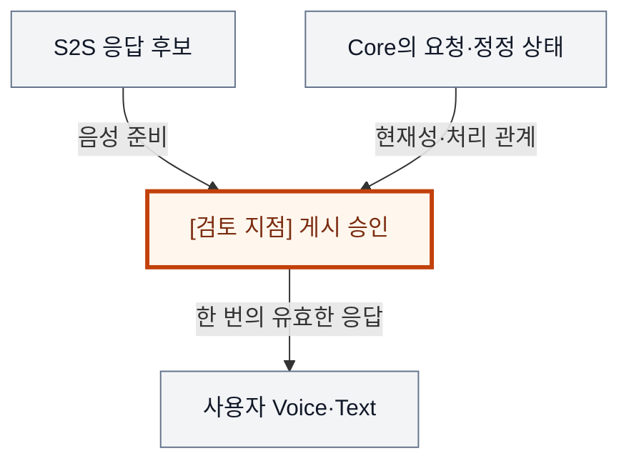
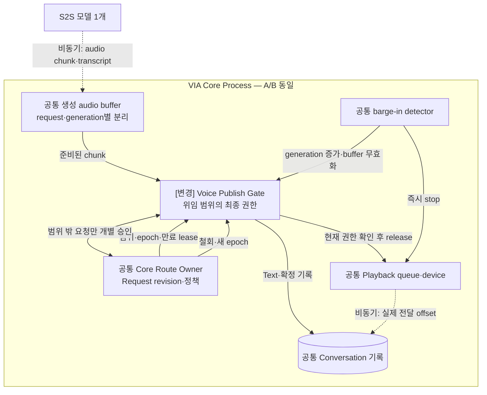
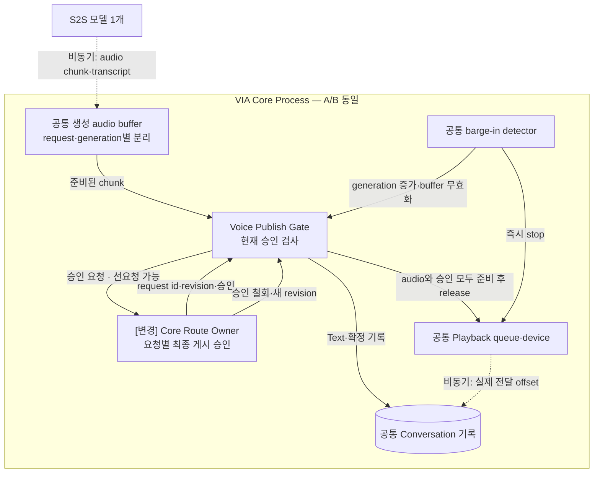
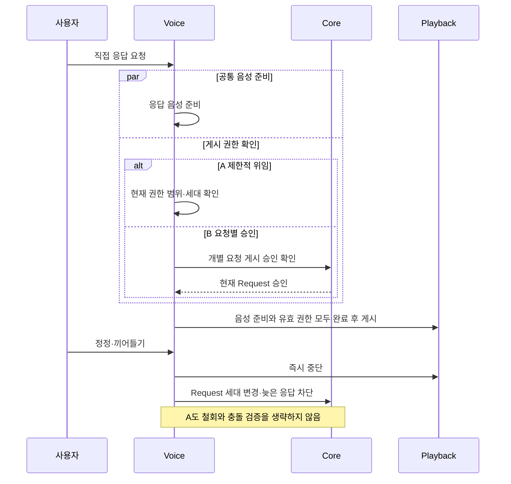

# VIA-DP-04 — S2S 직접 응답의 게시 권한

> **검토 초안 v2 · 2026-09-25 · 구현 구조 상세화 · 사용자 검토 전**
>
> 질문: 제한된 직접 응답의 게시 권한을 Voice Runtime에 위임할 것인가, 모든 응답에 Core의 요청별 승인을 요구할 것인가?
>
> 현재 판단: **조건부 핵심 검증 후보 — 제한적 권한 위임을 hybrid A로 재구성** 대안 선택·구현·QA 측정은 하지 않았다. 실제 결과는 모두 `NOT_RUN`이다.

## 1. 배경 — 답변 음성이 준비되어도 Core의 승인을 기다려야 할까?

“TCP와 UDP 차이가 뭐야?”라는 질문에 S2S가 답변을 준비한다. 동시에 VIA Core는 같은 입력이 기존 업무 제어인지, 정정되었는지 확인한다. 사용자는 빠른 답을 기대하지만, 먼저 말한 뒤 뒤늦게 다른 처리를 시작하거나 두 번 답해서는 안 된다. 음성 생성 속도와 별개로, 누가 이 요청의 답을 내보낼 권한을 갖는지 결정해야 한다.

배경 그림의 주황색 검토 지점은 설계 질문이지 추가 Component가 아니다. VIA는 사용자 PC의 Voice·Text interaction과 업무 연결을 책임진다. Downstream Agent는 실제 업무 계획·Tool 실행을, Model Runtime은 추론 실행을 담당한다. 이 보고서는 그 내부 알고리즘이나 학습을 고르지 않는다.

## 2. 비교 범위와 공통 조건

**용어:** 게시란 만들어진 답변을 사용자에게 실제로 내보내는 것이다. Voice는 음성 입출력을 맡는 VIA 영역, Core는 요청·업무 관계를 조정하는 영역이다. lease는 범위·수명이 제한된 권한 위임, epoch/세대는 철회된 옛 권한과 현재 권한을 구별하는 번호다. 늦은 응답을 막는 fencing은 이 현재성 검사를 뜻한다.

대상은 S2S 일반 대화 중 사전에 정의한 저위험 직접 응답 범위다. Agent 업무 시작, 기존 Task 제어, 새 보호정보 조회는 이 위임 범위 밖에서 Core가 관리한다. 이미 재생한 음성을 되돌릴 수 없으므로 게시 전의 권한과 게시 후 기록·정정 책임을 함께 정한다.

**기준선에서 확인한 사실:** UC-01은 S2S 직접 응답과 중복 처리 금지를, UC-11은 음성 중단과 정정을, UC-15는 채널 전환 뒤 같은 대화를 요구한다. 요구의 출처는 [System Mission](../01-system-mission-and-boundary.md), [Fixed Scope](../03-fixed-architecture-scope.md), [Use Cases](../05-representative-use-cases.md)다.

**이번 비교의 설계 가정:** 동일 S2S·입력 evidence·응답 내용·Context 정책·recording 의무·Process 배치·playback 제어를 사용한다. Core 승인에 별도 LLM 호출을 강제하지 않는다. A도 현재 요청의 유효성 검사와 Text 기록을 생략할 수 없다.

**미확인 사항:** Core가 승인할 수 있는 시점과 첫 유효 음성 준비 시점의 실제 중첩, 위임 범위 검사 비용, 철회 전파·lease 수명·기록 ledger. 사실·후보 설계·미확인 가정을 서로 바꿔 쓰지 않는다. Conversation은 이어지는 대화, Request는 논리적 요청, Task는 여러 요청에 걸쳐 추적하는 업무다. Oracle은 실행 전에 정한 정답·허용 상태 조건이고, fixture는 고정 입력·외부 사건이다.

### 구현도를 읽기 위한 공통 전제

**S2S 모델 1개 + semantic LLM 1개**를 고정한다. Component·Task·단계별 별도 적재는 없고 프롬프트·세션·호출만 나눌 수 있다. 아래는 **구현 가능한 후보 설계 설명**이며 제품 구현 완료나 QA 실측이 아니다. 모델 동시 호출·취소 지원은 공통 dependency profile로 확인한다.

Core Process는 이 DP의 A/B 공통 비교용 배치다. Process 자체를 비교하는 VIA-DP-11 외에는 한쪽만 별도 Process를 추가하지 않는다. 외부 Agent Runtime은 VIA Client와 별개이며 모델의 local/remote 배치도 별도 조건이다. 생략 영역은 양쪽에서 동일하다.

실선은 라벨의 호출·반환·읽기·쓰기, 점선은 비동기 event다. Queue/buffer는 별도 노드, 영속 기록은 원통으로 그린다. 메모리 queue 수락은 durable commit이 아니고 별도 message bus 제품도 가정하지 않는다. 메시지는 request/Task/call identity와 관련 revision·generation으로 연결한다. 늦은 결과는 최종 owner가 검사한다. queue 용량·포화 정책은 측정 전 동결하며 무한 queue를 가정하지 않는다.

## 3. 대안 A — 한정 권한 위임 + 범위 밖 Core 승인

Core는 허용된 응답 범위와 세대 번호를 정해 Voice Runtime에 게시 권한을 위임한다. Voice는 그 범위의 Request에 대해 현재성·취소 여부를 검사하고 직접 응답을 확정한다. Task 제어·추가 정보가 필요한 요청은 Core로 넘긴다. 빠른 경로와 중앙 정책을 결합한 hybrid다.

동일 Request의 실행 권한은 하나뿐이다. 위임 또는 회수 중에는 소유권이 불명확한 요청을 양쪽에서 실행하지 않는다. Voice는 확정·실제 전달·중단 event를 보존·전달하고, Core는 이미 처리된 Request를 다시 처리하지 않는다. 짧은 lease·세대 검사·재연결 handshake·내구 기록은 허용하지만 위임의 상태와 검증 계약은 남는다.

**실제 호출·상태·실패 처리 순서**

1. Core가 범위·epoch·만료 lease를 Gate에 준다. S2S audio는 request/generation별 buffer에 들어가며 생성 완료만으로 게시하지 않는다.
2. Gate가 입력·취소·lease 범위를 검사한다. 범위 안이면 Core의 개별 승인 없이 게시하고 범위 밖이면 승인받는다. Text 기록·음성 전달 의무는 B와 같다.
3. 끼어들기는 playback을 즉시 멈추고 이전 generation의 chunk를 폐기한다. Core 권한 인계는 lease 회수 확인 또는 만료 뒤 완료한다. 실제 전달 offset은 별도 기록한다.

Core가 정책을 소유하더라도 모든 Request의 게시 승인을 직접 수행하는 것은 아니다. 위임된 범위의 최종 게시 권한은 Voice에 있다.

## 4. 대안 B — 모든 직접 응답에 Core 요청별 승인

Voice는 음성을 미리 만들고 buffer할 수 있지만 의미 있는 답변 게시 전에 Core가 해당 Request의 처리 경로·현재성을 승인한다. Core는 입력 중에 판단하거나 준비 완료 전에 사전 승인할 수 있다. 승인 후 Voice가 출력하고 실제 전달 여부를 기록한다.

최선의 B는 음성 생성과 승인 계산을 병렬로 수행하며, 같은 Process의 짧은 호출과 결정적 fast path를 허용한다. 게시 권한 상태가 한 곳에 있는 장점이 있지만, 승인 완료가 늦으면 유효 음성이 준비되어도 기다린다. 재시작 뒤 오래된 승인은 다시 유효하게 만들지 않는다.

**실제 호출·상태·실패 처리 순서**

1. 음성 생성과 병렬로 요청별 Core 승인을 받는다. Core는 필요한 경우에만 공유 semantic LLM을 사용하며 모든 승인에 모델 왕복을 강제하지 않는다.
2. 유효 승인과 audio가 모두 준비되어야 Gate가 release한다. 대기 buffer 포화 때는 생성 backpressure 또는 취소를 수행한다. 승인 선행이면 추가 대기가 없을 수 있다.
3. barge-in은 승인 응답을 기다리지 않고 재생을 멈춘다. 늦은 승인·chunk는 generation 검사에서 거절한다. 요청별 승인을 재사용 가능한 포괄 lease로 없애면 A가 된다.

B의 Core 승인은 별도의 느린 의미 모델 호출과 동의어가 아니다. 실제로 승인 기다림이 남는지를 검토해야 한다.

두 구조도는 같은 확대 영역이다. 같은 이름은 공통 책임, `[변경]`은 바뀐 책임이다. 경계의 Process 표시는 공통 비교용 배치이며 실선은 라벨의 기능 흐름, 점선은 비동기 전달이다. 상자 수는 변경 요소 수나 메모리 크기가 아니다.

## 5. 구조 차이·상호 배타성·Hybrid 검토

| 차이 | A | B |
| --- | --- | --- |
| 허용된 직접 요청의 게시자 | 위임받은 Voice | 요청별 Core 승인 |
| 필요한 권한 상태 | 위임 범위·세대·회수·현재 Request | Request별 승인·현재성 |
| 조기 완료 | 범위 안이면 Core 개별 왕복 없이 가능 | 승인과 음성 준비가 모두 끝나야 가능 |
| 공통 | 중복 금지, 실제 출력 기록, 즉시 음성 중단 | 동일 |

같은 허용 Request의 게시에 Core 개별 승인이 없어도 되면 A, 반드시 필요하면 B다. A의 범위 밖 요청이 B 경로를 쓴다는 이유로 대안이 겹치지는 않는다. A에 매 요청 Core 재승인을 추가하면 B가 되고, B가 재사용 가능한 포괄 권한을 부여하면 A가 된다.

일반 대화는 Voice, 위험·불명확 요청은 Core라는 hybrid를 A로 삼았다. 초기 discovery의 Voice 자율안은 새 A로, 전면 Core 승인안은 새 B로 대응한다. 이는 기존 ADR의 A/B 문자를 바꾸는 작업이 아니다. B의 사전 계산·A의 lease와 빠른 회수는 정상적인 보완책이다. 권한을 가진 두 주체가 같은 Request에 동시에 답하는 구조는 대안이 아니라 위반이다.

A/B 모두 같은 기능·권한·실패 의미와 합리적인 보완책을 허용하는 **steelman**이다. 같은 결정 범위의 최종 기준은 **mutually exclusive**해야 한다. 속도 차이를 만들기 위해 한쪽의 검증·기록·cache를 빼지 않는다.

### 같은 사건에서 확인하는 순서 차이

다음 그림은 A/B의 차이가 드러나는 동일 사건을 비교한다. 외부 완료와 VIA 내부 확정을 구별하며, 아래 사고실험에서 지연·실패 조건까지 확인한다.

## 6. 같은 사건을 통과시키는 사고실험

### T1. 미리 준비된 승인과 의미 있는 첫 음성

같은 입력의 음성 준비 시각을 S, 해당 Request를 승인할 수 있는 Core 시각을 C, 마지막 전달·출력 비용을 공통 P라고 하자. B의 게시 가능 시점은 최소한 max(S,C)에 승인 전달의 비중첩 비용을 더한 값이다. A는 유효 위임 아래 Voice 검사 완료 시각 L과 S 중 늦은 시점을 따른다. 전체 latency 차이는 각 실제 critical path에서 도출하며 단순히 ‘Core hop 하나’로 고정하지 않는다.

C가 S보다 충분히 이르면 B도 기다리지 않는다. 반대로 S가 먼저 준비되고 Core가 다른 업무를 처리 중이면 A가 QA-02에 유리할 수 있다. A의 범위 판단이 별도 추론을 요구하거나 lease 갱신이 막히면 이점이 줄거나 역전된다. 가장 느린 직접 case가 Core 정보 답변이면 S2S fast path 이점이 전체 QA-02를 바꾸지 않을 수도 있다. QA-01/03의 공통 Agent 경로는 이 DP의 직접 근거가 아니다.

### T2. 정정·권한 회수·늦은 응답

입력 r1의 응답이 준비되는 중 사용자가 r2로 정정한다. A는 r1의 게시 자격을 Voice에서 무효화하고 Core에 같은 Request 관계를 알린다. B는 Core 승인 version을 무효화하며 Voice도 최신 정정 세대를 확인한다. 이미 재생한 부분은 두 안 모두 기록으로 남기며 그 사실을 없었던 것으로 만들지 않는다.

A의 권한 회수와 늦은 완료가 교차해도 이전 세대는 게시할 수 없어야 한다. 이를 메시지 수신 순서만으로 구현하면 위험하므로 lease 만료·세대 fence·새 소유권 인계 시 미완료 Request 확인이 필요하다. B도 승인 메시지를 받았다는 이유만으로 이후 취소를 무시할 수 없다. 양쪽 모두 올바른 구현이 가능하므로 A를 본질적으로 부정확하다고 채점하지 않는다. 차이는 검증해야 할 상태 계약과 오류 노출 조건이다.

### T3. 재연결·모델 변경과 관측

Voice 재연결 시 A는 이전 lease를 재사용하지 않고 새로운 세대와 처리된 Request를 확인한다. B도 과거 승인을 재사용하지 않는다. 같은 Conversation 기록으로 follow-up을 유지하고, crash 후 실제로 들려준 부분을 재전송하지 않는다. Task 복구 QA-31과 정상 Voice continuity QA-15를 구별한다.

M-01/07/09는 Voice event·대화 연결, M-02/03/08은 실제 범위 판단에 Model을 쓰는 경우, M-04~06은 공통 배치 계층, C-01~05는 공통 Context, C-06은 승인·위임 상태 이행을 확인한다. A-01~09는 위임 경로 회귀다. E-01~05는 게시 의도와 실제 재생 event, lease·Request correlation, version reader·export·assignment 전파를 확인한다. A/B 모두 공통 계측 SDK를 허용하므로 A가 무조건 더 많은 요소를 바꾼다고 할 수 없다. 완전한 기록과 최소 보호정보 조건도 동일하다.

## 7. 전체 19개 QA 비교

**사고실험 예상 / 실제 측정 `NOT_RUN`.** §2의 조건과 위 사고실험을 적용한다. 시간·변경 수·중단 수·메모리·노출은 작을수록, 정확성·연속성·완전성·재현 비율은 클수록 좋다. “비슷”은 명시한 조건에서 차이가 작다는 예상이며, “판단 근거 부족”은 방향·크기를 모른다는 뜻이다. 확실성은 실측 신뢰구간이 아니다. **부분 사례의 차이를 최악 case p95·전체 corpus·전체 change pack의 대표값 차이로 확대하지 않는다.**

| QA · 단일 metric | 예상 방향·크기 | 확실성 | 구조적 이유·반례와 근거 | 역할 |
| --- | --- | --- | --- | --- |
| QA-01 위임 경로 VIA 처리시간 · 최악 case p95; Agent 실행 제외 | 비슷 | 중간 | Agent handoff·결과 게시 경로는 같은 조건 [T1](#t1) | 회귀 |
| QA-02 직접 Voice 응답시간 · 최악 case p95 | 조건부: A 우세 가능; 크기 미정 | 중간 | Core 승인 대기가 실제 음성 critical path에 남을 때 [T1](#t1) | 주 비교 후보 |
| QA-03 Agent 상태 Voice 전달시간 · 최악 case p95 | 비슷 | 중간 | Agent status 전달 권한은 이 비교 밖에서 동일 [T1](#t1) | 회귀 |
| QA-04 음성 중단시간 · 최악 case p95 | 비슷 | 중간 | 두 안 모두 물리 중단을 즉시 처리하며 Core 의미 승인 대기 안 함 [T2](#t2) | 회귀 |
| QA-05 Task 제어 응답시간 · 최악 control case p95 | 비슷 | 중간 | Task 제어는 위임 범위 밖의 공통 Core 처리 [T2](#t2) | 회귀 |
| QA-11 전체 요청 처리 정확도 · case별 strict 성공률의 평균 | 판단 근거 부족 | 낮음 | 동일 요청 중복·정정 정확성의 실제 반례 빈도 미정 [T2](#t2) | 필수 검증 |
| QA-12 의미 해석 정확도 · strict 성공 run 비율 | 조건부; 방향 미정 | 낮음 | 범위 판단에 필요한 근거와 Model 계약이 같아야 비교 가능 [T2](#t2) | 필수 검증 |
| QA-13 Task·Interaction 연결 정확도 · strict 성공 run 비율 | 비슷 예상 | 중간 | A도 Request identity·세대 fence로 연결 가능 [T2](#t2) | 필수 검증 |
| QA-14 비동기 Task 상태 수렴 · strict 성공 run 비율 | 비슷 | 중간 | Agent Task 수렴 authority는 변경하지 않음 [T3](#t3) | 회귀 |
| QA-15 대화·Task 연속성 · 성공 scenario 비율 | 비슷 예상 | 중간 | 위임 lease와 승인 복원 모두 Conversation 보존 필요 [T3](#t3) | 필수 검증 |
| QA-21 Agent 변화 영향 범위 · 9개 변화의 변경 요소 평균 | 비슷 | 중간 | Agent 경계·change pack 공통 [T3](#t3) | 회귀 |
| QA-22 Model·Context·State 변화 영향 · 15개 변화의 변경 요소 평균 | 판단 근거 부족 | 낮음 | A 위임 계약 대 B 요청별 승인 계약의 실제 변경 ledger 필요 [T3](#t3) | 주 비교 후보 |
| QA-23 실험·로그 변화 영향 · 5개 변화의 변경 요소 평균 | 판단 근거 부족 | 낮음 | 게시·실제 재생 event 계측은 양쪽 모두 필요 [T3](#t3) | 회귀·ledger |
| QA-31 올바른 Task 복구시간 · 최악 fault p95 | 비슷; 대상 Task 영향 시 재검토 | 중간 | Voice만 재연결한 것을 Task recovery로 세지 않음 [T3](#t3) | 회귀 |
| QA-32 불필요한 장애 영향 범위 · 초과 중단 단위 최대 수 | 비슷 | 중간 | 논리 권한 분리가 Process fault 격리는 아님 [T3](#t3) | 회귀 |
| QA-41 PC 메모리 · 최악 workload의 peak p95 | 조건부; 방향·크기 미정 | 낮음 | A lease·사본 대 B 음성 승인 대기 buffer [T1](#t1) | 자원 확인·ASR 우선 제외 |
| QA-51 불필요한 보호정보 노출 · 초과 노출 단위 수 | 비슷 | 중간 | Core 집중 여부와 관계없이 같은 scope 검사 필수 [T3](#t3) | 필수 회귀 |
| QA-61 실행 trace 완전성 · 완전한 trace run 비율 | 비슷 | 중간 | 의도·승인·실제 출력 연결을 양쪽 모두 기록 [T3](#t3) | 필수 회귀 |
| QA-62 평가 재현성 · 동일 평가 재계산 비율 | 비슷 | 중간 | 원천 근거·평가기 version 보존 공통 [T3](#t3) | 필수 회귀 |

A는 Core 승인 대기가 지배적인 S2S 직접 경로에서 합리적이고, B는 요청별 권한을 한곳에서 검사하는 계약을 선호할 때 합리적이다. A가 항상 빠르거나 B가 항상 정확하다는 주장은 철회한다. QA-02와 상태·메모리·변경 비용의 반대 방향 차이는 아직 조건부다.

## 8. 공정한 검증 계획 — 실행하지 않음

승인 계산·음성 준비·권한 회수·정정·재연결을 같은 timestamp trace에 배치한다. 승인 선행/후행 조건을 모두 포함하고 실제 audible onset·stop을 관측하는 계획을 세운다. 위임 상태 전체와 B의 승인 buffer를 포함한 ledger를 결과 전에 고정한다.

측정에 앞서 동일한 목표·fixture·외부 기능·자원 조건, case별 실제 참여 경로, 실패·timeout 처리, 반복·집계·target·동점 기준을 동결한다. 최종 점수나 승리 개수는 지금 만들지 않는다. QA-11과 QA-12~15의 성공을 중복 합산하지 않는다. 잘못된 대상·중복 Action, 무효 승인, 무단 접근은 점수로 상쇄할 수 없는 필수 위반 조건이다.

근거 계약: [Voice responsiveness](../08-quality-attributes/voice-responsiveness.md), [Task 제어](../08-quality-attributes/interaction-control-responsiveness.md), [실제 event 경계](../11-measurement/event-boundary-contract.md), [정확성·연속성](../08-quality-attributes/correctness-and-continuity.md), [복구·장애·메모리](../08-quality-attributes/reliability-and-resource.md), [19개 QA catalog](../08-quality-attributes/quality-model.md), [변경 전체 집합](../07-intentional-variables.md), [변경 요소와 실험 change pack](../08-quality-attributes/evidence/change-locality-rationale.md), [관측·재현](../08-quality-attributes/observability.md), [Privacy·집계](../11-measurement/scoring-contract.md). 문서 사고실험은 실행 evidence label이나 기존 archive 결과로 대신하지 않는다.

## 9. 다른 DP·변경 비용

DP-03 입력 evidence, DP-02 상태 commit, DP-12 기록 선행 의무, DP-13 제어 자원을 고정한다. A의 빠른 경로도 기록 의무·자원 경계에 따라 기다릴 수 있다. A→B 전환 시 기존 lease를 소진·회수하고 진행 Request를 인계한다. B→A는 scope·세대·회수 계약과 replay 방지를 도입한다.

## 10. 현재 판단과 재검토 조건

**조건부 후보로 유지한다.** 응답 게시 권한은 강한 구조 결정이지만, 사전 승인을 허용한 B와 공유 기록을 가진 A 사이에 충분한 QA 차이가 남는지 확인해야 한다. 승인 대기가 숨겨지고 변경·메모리 차이도 사라지면 우선순위를 낮춘다.

## 11. 자체 검토에서 반영한 개선점

빠른 B를 만들기 위해 Core를 생략하는 식의 초기 A/B 혼동을 제거하고 hybrid를 새 A로 명시했다. 요청별 승인을 무조건 LLM 왕복으로 계산하지 않았다. Privacy·정확성 우세와 Process 격리 이점을 자동 부여하지 않았다.

검토 범위는 문서·사고실험이다. 외부 심사나 후보 성능 검증을 완료했다는 뜻이 아니다. 렌더링·정합성 검사와 전체 후보의 최종 분류는 [전체 검토 종합](./dp-review-synthesis.md)에 기록한다.
