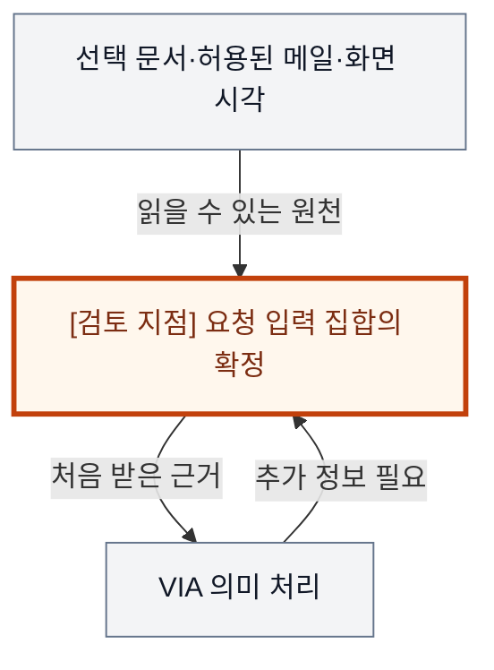
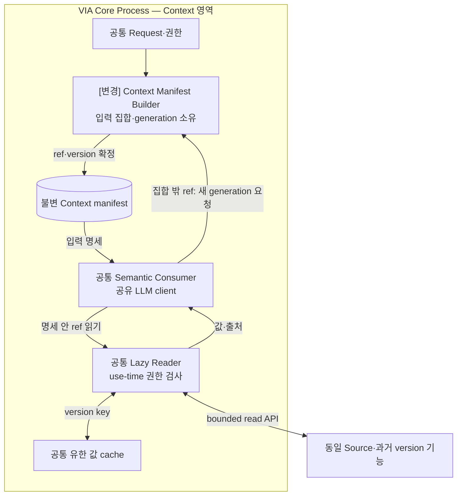
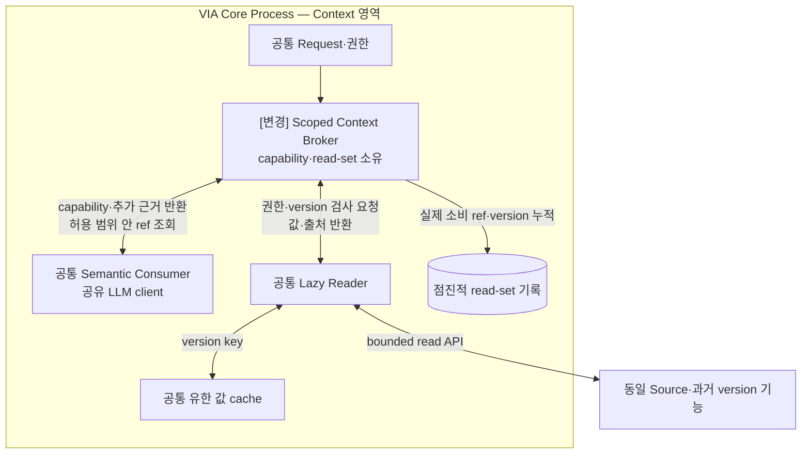
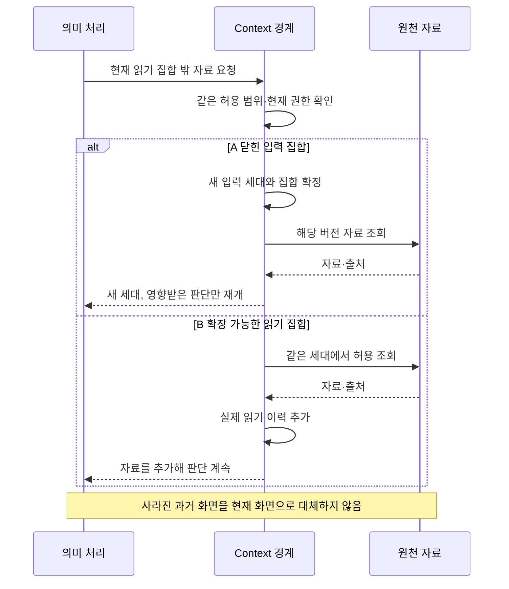

# VIA-DP-05 — 요청 Context의 읽기 집합 확정 계약

> **검토 초안 v2 · 2026-09-25 · 구현 구조 상세화 · 사용자 검토 전**
>
> 질문: 의미 처리 전에 입력 원천 집합을 닫을 것인가, 허용 범위 안에서 처리 도중 읽기 집합을 확장할 수 있게 할 것인가?
>
> 현재 판단: **조건부 핵심 검증 후보 — snapshot 대 조회라는 겹치는 비교를 재구성** 대안 선택·구현·QA 측정은 하지 않았다. 실제 결과는 모두 `NOT_RUN`이다.

## 1. 배경 — ‘이 자료’에 답하는 도중 다른 정보가 필요해지면?

선택한 보고서와 최근 메일의 숫자가 왜 다른지 사용자가 묻는다. 처음에는 선택 문서만으로 충분해 보였지만, 의미를 해석한 뒤 특정 메일의 표가 필요해질 수 있다. 동시에 화면은 바뀌고 사용자는 접근 동의를 철회할 수 있다. 필요한 정보를 모두 미리 모으는 방식과 필요할 때 읽는 방식을 섞을 수 있으므로, 실제 결정은 요청의 입력 집합을 누가 언제 확정하는가로 좁혀야 한다.

배경 그림의 주황색 검토 지점은 설계 질문이지 추가 Component가 아니다. VIA는 사용자 PC의 Voice·Text interaction과 업무 연결을 책임진다. Downstream Agent는 실제 업무 계획·Tool 실행을, Model Runtime은 추론 실행을 담당한다. 이 보고서는 그 내부 알고리즘이나 학습을 고르지 않는다.

## 2. 비교 범위와 공통 조건

**용어:** Context는 요청에 필요한 허용된 문서·화면·대화 등의 정보다. 읽기 집합(read-set)은 해당 판단에 사용할 원천 참조와 버전의 집합이다. 입력 세대는 하나의 판단에 적용할 집합의 확정 버전이며, Broker는 허용 범위와 현재 권한을 검사해 조회를 중개한다. lazy loading은 값이 실제 필요할 때 읽는 방식이다.

대상은 VIA의 bounded Context 처리에서 원천 참조·version을 선택하고 소비자에게 주는 계약이다. 업무 조사 계획은 Agent 책임으로 유지한다. ‘발화 당시 화면’과 ‘지금 일정’의 시간 의미는 사용자 요구로 고정하며 A/B에 다른 정답을 주지 않는다.

**기준선에서 확인한 사실:** UC-02~06·16·17은 지정 자료·과거 대상·최신성·동의 철회·기억 삭제를 요구한다. 과거 포인터를 현재 화면으로 바꾸거나 필요 이상의 Context를 전달해서는 안 된다. 요구의 출처는 [System Mission](../01-system-mission-and-boundary.md), [Fixed Scope](../03-fixed-architecture-scope.md), [Use Cases](../05-representative-use-cases.md)다.

**이번 비교의 설계 가정:** 동일한 원천 version 접근 기능, 허용 정보 범위, 의미 모델, Task·기록·Process 구조를 사용한다. 양쪽 모두 최소 전달, version pinning, 부분 materialization, deduplication과 cache를 허용한다. Source에 없는 과거 자료는 시험기가 보충하지 않는다.

**미확인 사항:** 대표 요청의 최초 입력 집합 적중률, 추가 읽기 횟수·직렬 의존, source 보존 수명, 문서 크기·cache·동시성의 실제 분포. 사실·후보 설계·미확인 가정을 서로 바꿔 쓰지 않는다. Conversation은 이어지는 대화, Request는 논리적 요청, Task는 여러 요청에 걸쳐 추적하는 업무다. Oracle은 실행 전에 정한 정답·허용 상태 조건이고, fixture는 고정 입력·외부 사건이다.

### 구현도를 읽기 위한 공통 전제

**S2S 모델 1개 + semantic LLM 1개**를 고정한다. Component·Task·단계별 별도 적재는 없고 프롬프트·세션·호출만 나눌 수 있다. 아래는 **구현 가능한 후보 설계 설명**이며 제품 구현 완료나 QA 실측이 아니다. 모델 동시 호출·취소 지원은 공통 dependency profile로 확인한다.

Core Process는 이 DP의 A/B 공통 비교용 배치다. Process 자체를 비교하는 VIA-DP-11 외에는 한쪽만 별도 Process를 추가하지 않는다. 외부 Agent Runtime은 VIA Client와 별개이며 모델의 local/remote 배치도 별도 조건이다. 생략 영역은 양쪽에서 동일하다.

실선은 라벨의 호출·반환·읽기·쓰기, 점선은 비동기 event다. Queue/buffer는 별도 노드, 영속 기록은 원통으로 그린다. 메모리 queue 수락은 durable commit이 아니고 별도 message bus 제품도 가정하지 않는다. 메시지는 request/Task/call identity와 관련 revision·generation으로 연결한다. 늦은 결과는 최종 owner가 검사한다. queue 용량·포화 정책은 측정 전 동결하며 무한 queue를 가정하지 않는다.

## 3. 대안 A — 불변 입력 명세 + 필요한 값만 지연 적재

Context 준비자가 요청 세대마다 사용할 원천 참조와 version의 집합을 확정한다. 실제 값은 필요한 순간에 적재할 수 있고, 소비자별로 필요한 부분만 전달한다. 따라서 ‘snapshot이면 전체 원문 복사’라는 약한 안이 아니다. 값의 선적재와 지연 적재를 함께 쓸 수 있는 hybrid다.

확정 집합 밖의 새 원천이 필요하면 같은 사용자 요청에 새 Context 세대를 만들고 관련 판단만 다시 유효화한다. 기존 cache와 변하지 않은 판단 근거는 재사용할 수 있다. 입력 재현과 소비자 계약은 단순하지만 추가 원천에 대한 확정·무효화 경계는 남는다.

**실제 호출·상태·실패 처리 순서**

1. Builder가 요청 세대의 ref/version 집합을 확정한다. manifest는 원문 전체 복사가 아니라 참조 명세다. Consumer가 필요한 값만 Reader로 읽어 공유 LLM에 전달한다.
2. Reader는 현재 접근 권한·pin된 version을 검사하고 cache를 재사용한다. 집합 밖 자료가 필요하면 새 generation을 만들고 영향을 받는 판단만 재개한다.
3. 정정·권한 철회 뒤 늦은 read 응답은 generation 검사에서 배제한다. 사라진 과거 자료를 현재 값으로 대신하지 않는다. read는 비동기 완료될 수 있지만 별도 message bus를 요구하지 않는다.

불변 명세는 모든 값의 복사본이 아니다. 같은 세대 안에서 입력 원천 집합을 소비자가 늘릴 수 없다는 것이 차이다.

## 4. 대안 B — 범위 제한 조회 권한 + 처리 중 입력 확장

Context Broker는 Request·목적·수신자·유효 세대에 묶인 조회 권한을 제공한다. 소비자는 그 허용 namespace 안에서 필요한 원천을 선택하며 읽기 집합을 점진적으로 확장한다. 발화 당시 근거는 고정 version으로, 현재성 요구는 같은 사전 규칙으로 조회한다.

B도 이미 읽은 자료를 cache하고, 확정된 사실의 불변 사본과 읽기 이력을 남긴다. 권한 범위를 넓히려면 새 동의·세대가 필요하다. 같은 허용 범위 안의 추가 원천을 위해 매번 전체 Context 집합을 다시 확정하지 않는 것이 장점이다. 대신 조회 capability·읽기 이력·source 수명·철회 검사 책임이 지속된다.

**실제 호출·상태·실패 처리 순서**

1. Broker가 Request·목적·허용 Source 범위에 묶인 capability를 준다. Consumer는 필요한 ref가 생기면 같은 범위 안에서 추가 조회한다.
2. 같은 Reader·cache를 사용하고 실제 소비한 ref/version을 read-set에 기록한다. 범위 안의 ref 추가 때문에 새 Context generation이 필수는 아니다. 권한 범위 확대에는 별도 동의·세대가 필요하다.
3. Broker가 철회·정정·source 소멸을 검사한다. 모델의 도구형 조회 요청도 Broker를 거치며 임의 Source 접근 권한을 모델에 주지 않는다.

B는 현재 화면을 무조건 읽는 안이 아니다. 필요한 시점·원천 version과 실제 읽기 기록을 유지한다.

두 구조도는 같은 확대 영역이다. 같은 이름은 공통 책임, `[변경]`은 바뀐 책임이다. 경계의 Process 표시는 공통 비교용 배치이며 실선은 라벨의 기능 흐름, 점선은 비동기 전달이다. 상자 수는 변경 요소 수나 메모리 크기가 아니다.

## 5. 구조 차이·상호 배타성·Hybrid 검토

| 차이 | A | B |
| --- | --- | --- |
| 같은 요청 세대의 입력 집합 | 의미 처리 전 닫힘 | 허용 범위 안에서 확장 가능 |
| 새 원천 필요 시 | 새 입력 세대·관련 판단 유효화 | Broker 조회와 이력 추가 |
| 기준 evidence | 명세 + 실제 소비 값·출처 | 조회 권한 + 실제 read-set·값·출처 |
| 공통 | 지연 적재·cache·최소 정보·철회·시간 의미 | 동일 |

같은 Context 세대의 원천 집합 밖을 새 세대 없이 읽을 수 있으면 B, 반드시 새 확정 세대를 거치면 A다. A에 lazy handle을 넣어도 미리 정한 집합 안이면 A다. B가 항상 집합을 닫고 추가 조회를 금지하면 A의 계약이 된다.

snapshot+handle+cache는 양쪽에 허용했다. 가장 강한 ‘불변 참조 집합과 lazy 값’ 조합을 A로 삼고, 대등한 B를 처리 중 집합 확장 계약으로 재정의했다. cache 크기·prefetch 비율만 다르면 별도 Architecture DP가 아니라 tuning이므로 비교하지 않는다.

A/B 모두 같은 기능·권한·실패 의미와 합리적인 보완책을 허용하는 **steelman**이다. 같은 결정 범위의 최종 기준은 **mutually exclusive**해야 한다. 속도 차이를 만들기 위해 한쪽의 검증·기록·cache를 빼지 않는다.

### 같은 사건에서 확인하는 순서 차이

다음 그림은 A/B의 차이가 드러나는 동일 사건을 비교한다. 외부 완료와 VIA 내부 확정을 구별하며, 아래 사고실험에서 지연·실패 조건까지 확인한다.

## 6. 같은 사건을 통과시키는 사고실험

### T1. 처음 정한 입력으로 충분한 요청

같은 선택 문서로 답이 끝나는 요청이다. A는 닫힌 명세를 만들고 필요한 값만 적재한다. B는 같은 값을 Broker에서 읽고 이력을 남긴다. 둘 다 같은 cache를 사용할 수 있다. A만 미리 준비하거나 B만 반복 원격 왕복을 시키지 않으면, 초기 가설인 ‘snapshot은 빠르지만 무겁다’는 자동으로 성립하지 않는다.

초기 준비·조회·입력 검증 중 실제 critical path에 남은 차이만 QA-01/02/05에 포함한다. 최초 source read가 지배하면 구조 차이는 작다. 필요 없는 값은 양쪽 모두 전송하지 않으므로 QA-51도 자동 우열이 없다. 메모리는 원문 총량보다 참조·cache·in-flight 값의 실제 동시 수명에 달린다.

### T2. 같은 허용 범위 안의 새 자료가 필요함

문서의 약어를 해석한 뒤 특정 메일 표가 필요해진다. A는 새 참조를 포함하는 Context 세대 확정 → 영향을 받는 판단 version 갱신 → 같은 cache의 자료 소비를 거친다. B는 허용 범위 조회 → read-set 확장 → 판단 계속을 수행한다. 같은 세대 관리 비용을 무시하면 A를 부당하게 빠르게 만들고, A에 전체 대화 재추론을 강제하면 부당하게 느리게 만든다.

B의 이점은 새 세대 확정과 실제 재판단이 필요한 비중첩 비용을 피하는 정도다. 반대로 B가 입력을 조각내 순차 조회하고 A 준비자가 병렬로 정확한 집합을 만들면 A가 빠를 수 있다. 각각 적중·추가 읽기·과다 준비 조건을 같은 workload에 포함해야 한다. latency 전체 p95와 QA-41 peak 방향은 그 구성 없이 정하지 않는다.

### T3. 화면 변경·권한 철회·과거 근거 소멸

사용자가 첫 그래프를 가리킨 뒤 화면이 바뀌고 권한을 철회한다. A도 이미 준비한 snapshot이라고 새 외부 제공 권한을 자동 유지할 수 없다. B도 늦게 조회한다고 현재 화면을 과거 지칭의 정답으로 사용할 수 없다. 둘 다 정보 시점과 현재 접근 권한을 분리한다. 삭제된 User Memory는 다음 요청에 재사용하지 않으며, 최소 과거 평가 근거 보존 정책과 사용자 정보 원문 보존을 구별한다.

A는 참조를 고정했어도 해당 값이 사라질 수 있어 필요한 수명 보장을 소유해야 한다. B도 source revision을 다시 얻을 수 없다면 당시 소비한 최소 evidence를 보존해야 한다. 충분한 보존·철회 계약이 있으면 QA-12/15/51/61/62는 모두 맞을 수 있다. 과거 자료를 못 읽는 B를 의도적으로 비교안으로 삼지 않는다.

### T4. Source 변경과 복구

C-01~05의 제공자·문서형식·화면·기억·다중 Source 변경은 A의 집합 준비자와 B의 Broker 각각에서 흡수할 수 있다. C-06은 Context 세대와 read-set 이행을 확인한다. M-01~09는 실제 입력 계약 소비자에 전파되는 항목을 구별하고, A-01~09는 공통 Agent 전달 경계에서 회귀한다. E-01~05에서는 명세만 기록해 실제 소비 값을 놓치거나 조회 결과만 기록해 권한·source version을 놓치지 않는지 확인한다. 전체 change pack 평균의 차이는 ledger가 없으므로 미정이다.

재시작 후 A는 진행 요청의 입력 세대와 미완료 명세, B는 capability 세대·실제 read-set·미완료 조회를 복원한다. 둘 다 이미 전달한 Agent 명령을 Context 재조회 때문에 중복 시작하지 않는다. Broker 불가용이면 필요한 새 조회만 영향을 받아야 하며 단순 S2S 대화까지 멈추는지는 QA-32의 별도 초과 전파 검증이다.

## 7. 전체 19개 QA 비교

**사고실험 예상 / 실제 측정 `NOT_RUN`.** §2의 조건과 위 사고실험을 적용한다. 시간·변경 수·중단 수·메모리·노출은 작을수록, 정확성·연속성·완전성·재현 비율은 클수록 좋다. “비슷”은 명시한 조건에서 차이가 작다는 예상이며, “판단 근거 부족”은 방향·크기를 모른다는 뜻이다. 확실성은 실측 신뢰구간이 아니다. **부분 사례의 차이를 최악 case p95·전체 corpus·전체 change pack의 대표값 차이로 확대하지 않는다.**

| QA · 단일 metric | 예상 방향·크기 | 확실성 | 구조적 이유·반례와 근거 | 역할 |
| --- | --- | --- | --- | --- |
| QA-01 위임 경로 VIA 처리시간 · 최악 case p95; Agent 실행 제외 | 조건에 따라 다름 | 중간 | 새 입력 세대 비용은 B 유리, A의 정확한 병렬 준비는 역전 가능 [T2](#t2) | 주 비교 후보 |
| QA-02 직접 Voice 응답시간 · 최악 case p95 | 조건에 따라 다름 | 중간 | Context를 실제 사용하는 direct case에 한정 [T2](#t2) | 주 비교 후보 |
| QA-03 Agent 상태 Voice 전달시간 · 최악 case p95 | 비슷; Context 보완 시 조건부 | 중간 | 기존 상태 전달은 공통, 실제 새 근거가 필요한 경우만 영향 [T1](#t1) | 회귀 |
| QA-04 음성 중단시간 · 최악 case p95 | 비슷 | 중간 | 음성 정지에는 새 Context 조회가 필요하지 않음 [T1](#t1) | 회귀 |
| QA-05 Task 제어 응답시간 · 최악 control case p95 | 조건부; 크기 미정 | 낮음 | 대상 판별에 새 자료가 필요한 control 경로만 비교 [T2](#t2) | 주 비교 후보 |
| QA-11 전체 요청 처리 정확도 · case별 strict 성공률의 평균 | 판단 근거 부족 | 낮음 | 필요 정보 도달·정정·철회 corpus의 전체 결과 미정 [T3](#t3) | 필수 검증 |
| QA-12 의미 해석 정확도 · strict 성공 run 비율 | 비슷 예상; 실제 모델 결과 미정 | 중간 | 동일 시간 의미와 출처를 제공하면 두 안 모두 정확 가능 [T3](#t3) | 필수 검증 |
| QA-13 Task·Interaction 연결 정확도 · strict 성공 run 비율 | 비슷 | 중간 | 같은 Request·Task 연결과 세대 검증 [T4](#t4) | 회귀 |
| QA-14 비동기 Task 상태 수렴 · strict 성공 run 비율 | 비슷 | 중간 | Task authoritative convergence 규칙은 공통 [T4](#t4) | 회귀 |
| QA-15 대화·Task 연속성 · 성공 scenario 비율 | 비슷 | 중간 | 과거 referent 보존 계약은 양쪽 필수 [T3](#t3) | 필수 회귀 |
| QA-21 Agent 변화 영향 범위 · 9개 변화의 변경 요소 평균 | 비슷 | 중간 | 공통 Agent 경계 유지 [T4](#t4) | 회귀 |
| QA-22 Model·Context·State 변화 영향 · 15개 변화의 변경 요소 평균 | 판단 근거 부족 | 낮음 | 준비자 대 Broker의 전체 C·M ledger 필요 [T4](#t4) | 주 비교 후보 |
| QA-23 실험·로그 변화 영향 · 5개 변화의 변경 요소 평균 | 판단 근거 부족 | 낮음 | 명세·read-set의 계측 소비자 변경 범위 미정 [T4](#t4) | 회귀·ledger |
| QA-31 올바른 Task 복구시간 · 최악 fault p95 | 조건부; 방향 미정 | 낮음 | 진행 요청의 세대·조회 복원과 모든 Task 재연결 비용 [T4](#t4) | 주 비교 가능성 |
| QA-32 불필요한 장애 영향 범위 · 초과 중단 단위 최대 수 | 비슷 예상 | 중간 | 필수 Source 실패와 무관한 경로 중단을 분리 [T4](#t4) | 회귀 |
| QA-41 PC 메모리 · 최악 workload의 peak p95 | 조건에 따라 다름 | 중간 | 양쪽 lazy·cache 허용; 실제 값 동시 수명과 요청 재세대 비용 [T1](#t1) | 자원 확인·ASR 우선 제외 |
| QA-51 불필요한 보호정보 노출 · 초과 노출 단위 수 | 비슷 | 중간 | 명세나 capability 자체가 과다 노출을 정당화하지 않음 [T3](#t3) | 필수 회귀 |
| QA-61 실행 trace 완전성 · 완전한 trace run 비율 | 비슷 | 중간 | 실제로 소비한 값·source·권한 근거를 두 안 모두 보존 [T3](#t3) | 필수 회귀 |
| QA-62 평가 재현성 · 동일 평가 재계산 비율 | 비슷 | 중간 | snapshot 존재만으로 재현되지 않으며 B도 frozen evidence 가능 [T3](#t3) | 필수 회귀 |

정확한 선행 입력 집합이 자주 가능하면 A, 처리 중 필요한 자료가 드러나는 요청이 중요하면 B의 계약이 자연스럽다. 이 선택이 실제 latency·메모리·변경 범위를 바꾸는지는 아직 조건부이며, snapshot이 무조건 정확하거나 Broker가 무조건 개인정보에 유리하다는 주장은 폐기한다.

## 8. 공정한 검증 계획 — 실행하지 않음

초기 집합 적중·추가 원천·source 소멸·철회·User Memory 삭제를 동일 trace에 포함한다. 의미가 같은 입력 집합 변경에서 실제 재판단 범위만 기록하고, 요청 전체 재실행을 강제하지 않는다. 값의 source version·접근 시점·소비 시점과 메모리 수명을 함께 freeze한다.

측정에 앞서 동일한 목표·fixture·외부 기능·자원 조건, case별 실제 참여 경로, 실패·timeout 처리, 반복·집계·target·동점 기준을 동결한다. 최종 점수나 승리 개수는 지금 만들지 않는다. QA-11과 QA-12~15의 성공을 중복 합산하지 않는다. 잘못된 대상·중복 Action, 무효 승인, 무단 접근은 점수로 상쇄할 수 없는 필수 위반 조건이다.

근거 계약: [Voice responsiveness](../08-quality-attributes/voice-responsiveness.md), [Task 제어](../08-quality-attributes/interaction-control-responsiveness.md), [실제 event 경계](../11-measurement/event-boundary-contract.md), [정확성·연속성](../08-quality-attributes/correctness-and-continuity.md), [복구·장애·메모리](../08-quality-attributes/reliability-and-resource.md), [19개 QA catalog](../08-quality-attributes/quality-model.md), [변경 전체 집합](../07-intentional-variables.md), [변경 요소와 실험 change pack](../08-quality-attributes/evidence/change-locality-rationale.md), [관측·재현](../08-quality-attributes/observability.md), [Privacy·집계](../11-measurement/scoring-contract.md). 문서 사고실험은 실행 evidence label이나 기존 archive 결과로 대신하지 않는다.

## 9. 다른 DP·변경 비용

DP-03은 입력 시각 근거를 생성하고 DP-06은 Context를 소비해 판단한다. DP-01 직접 처리 범위와 DP-07 복합 업무를 고정한다. DP-12는 평가 근거 기록, DP-08은 Task 복구 기준이며 Context 전달과 독립이다. A→B는 capability·read-set 상태, B→A는 미완료 조회 종료·명세 이행·reader 호환이 필요하다.

## 10. 현재 판단과 재검토 조건

**닫힌 입력 집합 대 처리 중 확장 계약으로 조건부 유지한다.** 실제 차이가 prefetch 설정이나 cache 정책뿐으로 축소되면 이 DP를 supporting 계약으로 내린다. QA 점수를 얻으려고 최신성과 과거 시점 요구를 다르게 주거나 Privacy 범위를 넓히지 않는다.

## 11. 자체 검토에서 반영한 개선점

값 전달 대 handle 전달은 함께 쓸 수 있어 배타적 대안이 아니었다. 불변 참조+lazy를 A에 포함했고, 두 안 모두 version pinning·최소 노출·cache를 허용했다. ‘B의 현재 값이 더 정확’이라는 요구 변경을 제거했다.

검토 범위는 문서·사고실험이다. 외부 심사나 후보 성능 검증을 완료했다는 뜻이 아니다. 전체 후보의 현재 상태·미완료 사항은 [요약 보고서](./dp-executive-summary.md#review-status), 문서 검증 기준은 [검토 protocol](./dp-review-protocol.md)을 따른다.
