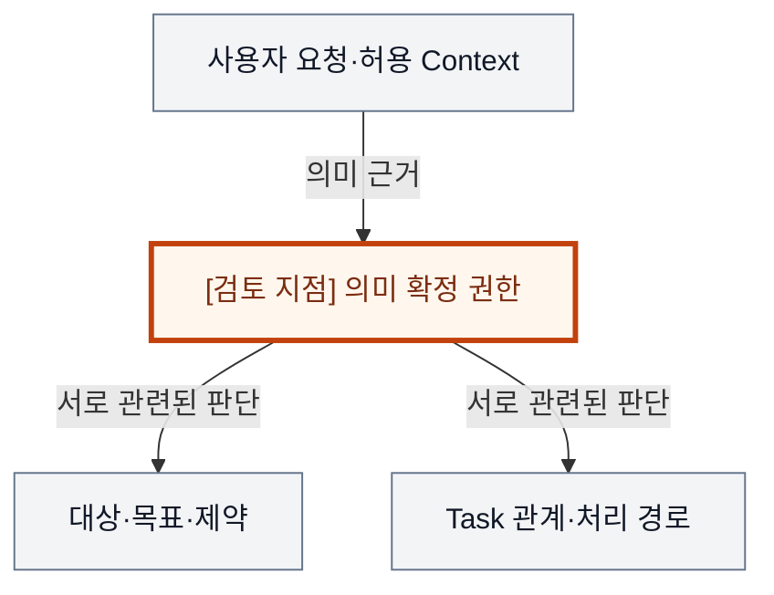
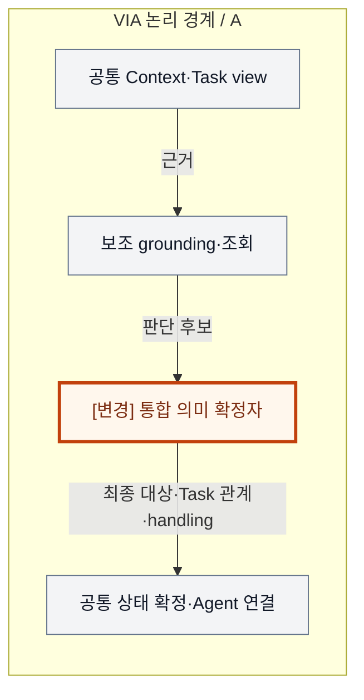
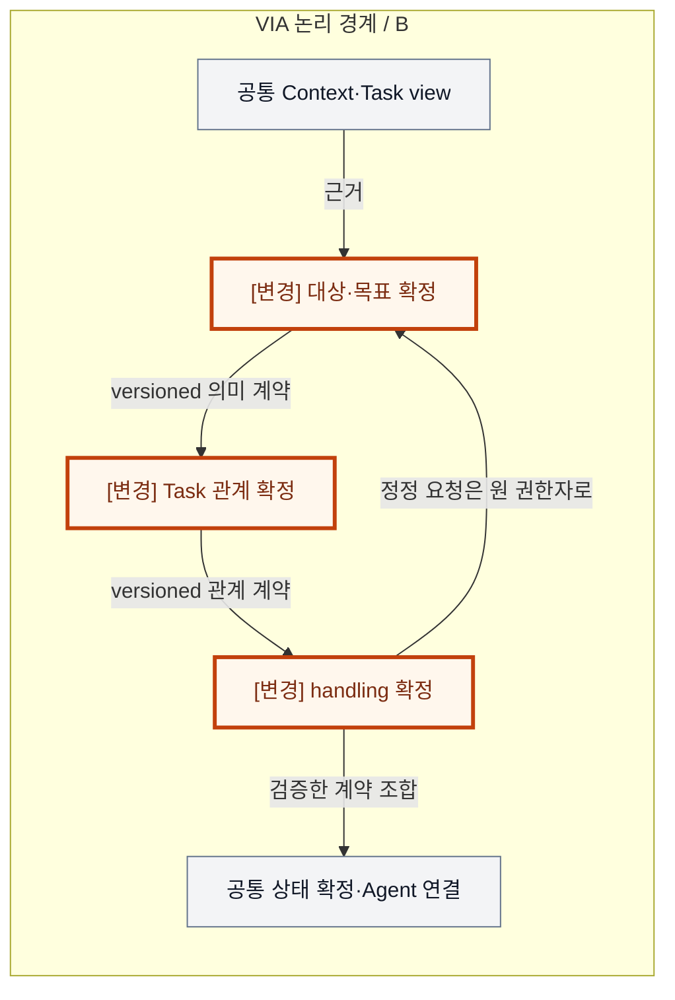
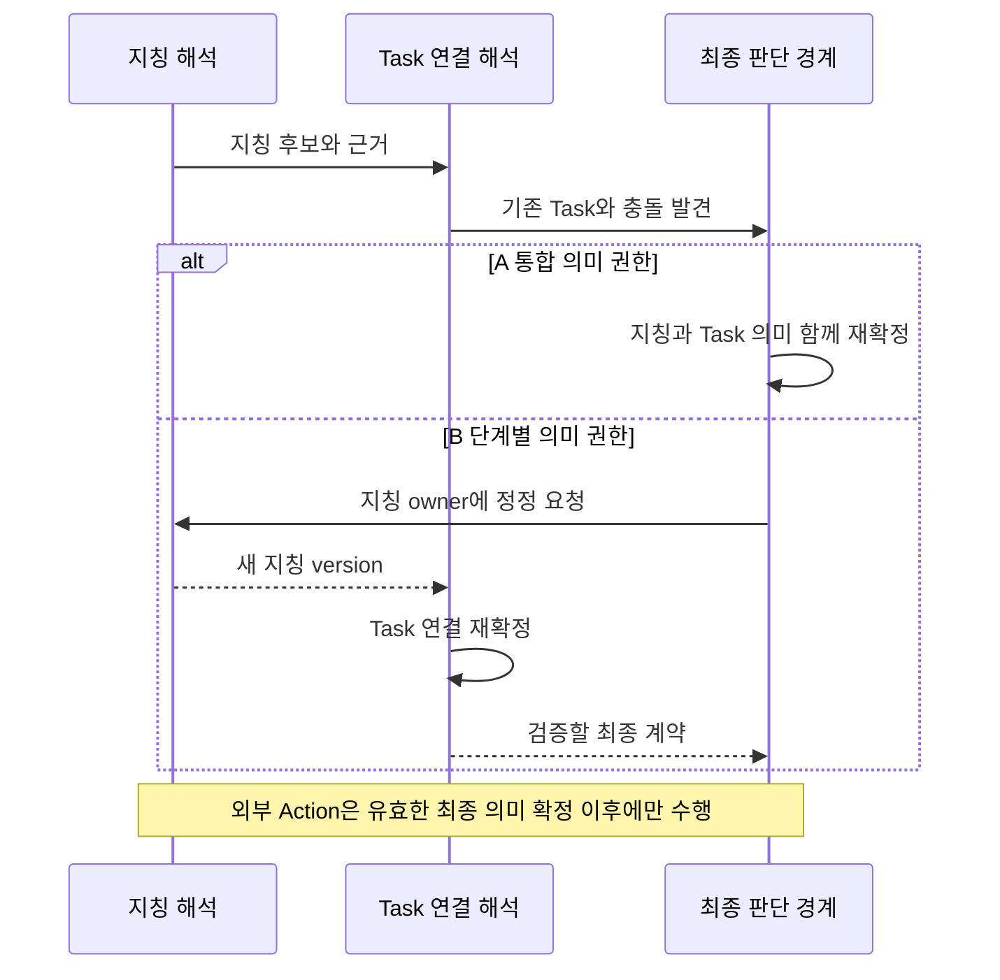

# VIA-DP-06 — 요청 의미의 최종 확정 권한

> **검토 초안 v1 · 2026-09-24 · 사용자 검토 전**
>
> 질문: 대상·Task 관계·처리 경로를 하나의 의미 확정자가 함께 결정할 것인가, 단계별 권한자가 계약을 통해 확정할 것인가?
>
> 현재 판단: **조건부 핵심 검증 후보 — 호출 수가 아닌 의미 계약의 권한으로 비교** 대안 선택·구현·QA 측정은 하지 않았다. 실제 결과는 모두 `NOT_RUN`이다.

## 1. 배경 — ‘아까 그 자료’의 대상과 Task를 따로 정해도 될까?

“아까 그 자료에 결론 한 장만 더 넣어줘”라는 요청에서 자료가 무엇인지 알아야 Task를 고를 수 있고, 어떤 Task인지 알아야 ‘그 자료’의 후보가 좁혀진다. 목표·지칭·업무 관계·Agent capability 판단은 서로 영향을 준다. 한곳에서 함께 판단하면 이런 관계를 보존하기 쉽지만, 모든 의미 변화가 큰 계약으로 모일 수 있다. 단계별로 나누면 책임은 분명해지나 앞 판단을 되돌리는 계약이 필요하다.

배경 그림의 주황색 검토 지점은 설계 질문이지 추가 Component가 아니다. VIA는 사용자 PC의 Voice·Text interaction과 업무 연결을 책임진다. Downstream Agent는 실제 업무 계획·Tool 실행을, Model Runtime은 추론 실행을 담당한다. 이 보고서는 그 내부 알고리즘이나 학습을 고르지 않는다.

## 2. 비교 범위와 공통 조건

**용어:** 의미는 요청 종류, 지칭 대상(referent), Task 연결과 요청 관계를 포함한다. owner는 해당 의미를 최종 수정할 수 있는 권한자다. 중간 의미 계약은 다른 단계가 소비하는 값·버전·오류/정정 규칙이며, 최종 schema 검사는 형식 확인이지 의미를 새로 판단하는 권한이 아니다.

대상은 VIA가 소유한 요청 refinement·referent·Task relation·handling 의미의 확정이다. 실제 Task 상태를 쓰는 권한과 외부 Agent 계획은 별개다. 각 판단이 하나의 모델 호출이어야 한다거나 순서가 고정되어야 한다는 조건은 두지 않는다.

**기준선에서 확인한 사실:** UC-05·06·09·10·14는 과거 대상, 부족한 정보, 복합 관계, Existing/New Task 구분을 요구한다. Canonical Flow는 판단 순서·병렬화·모델 호출 수를 미리 고정하지 않는다. 요구의 출처는 [System Mission](../01-system-mission-and-boundary.md), [Fixed Scope](../03-fixed-architecture-scope.md), [Use Cases](../05-representative-use-cases.md)다.

**이번 비교의 설계 가정:** 같은 원천 근거·모델 역할 적합성·최종 의미 schema·oracle, Context 계약·Task 상태 확정·Agent 경계·게시 권한을 둔다. 같은 책임에는 같은 모델을 우선 사용하고 역할 분할로 달라진 구성은 결합 효과로 표시한다.

**미확인 사항:** 실제 serialized prompt·token 길이·모델 호출 graph, corpus별 정확도, 부분 재판단의 빈도와 15개 Model·Context 변경 ledger. 사실·후보 설계·미확인 가정을 서로 바꿔 쓰지 않는다. Conversation은 이어지는 대화, Request는 논리적 요청, Task는 여러 요청에 걸쳐 추적하는 업무다. Oracle은 실행 전에 정한 정답·허용 상태 조건이고, fixture는 고정 입력·외부 사건이다.

## 3. 대안 A — 단계별 보조 처리 + 통합 최종 확정

필요한 grounding·Task 검색·capability 조회를 모듈이나 보조 단계로 나눌 수 있지만 하나의 semantic authority가 최종 의미 묶음을 일관되게 확정한다. 부분 cache·병렬 조회·특정 항목 재계산도 허용한다. 모듈성과 공동 판단을 결합한 hybrid다.

최종 확정자는 서로 모순된 보조 결과를 조정하고 clarification을 선택한다. 강점은 관련 의미를 함께 볼 수 있다는 것이며, 약점은 최종 schema·검증·판단 규칙의 결합이다. 단일 호출·단일 거대 prompt를 필수 조건으로 삼지 않는다.

보조 단계 수가 아니라 최종 의미 묶음을 누가 수정·확정하는지가 A의 식별 규칙이다.

## 4. 대안 B — 단계별 의미 권한 + 명시적 정정 계약

grounding/refinement, Task association, handling/capability 선택이 각자의 의미 계약을 확정한다. 후속 단계는 앞 결과가 틀리거나 부족하면 정정 요청을 보내 해당 권한자가 새 version을 만들게 한다. 최종 validator는 계약 조합의 유효성을 검사하지만 임의로 앞 의미를 다시 결정하지 않는다.

각 단계는 필요한 근거에 집중하고 독립 교체·부분 재실행할 수 있다. 공통 모델·prompt fragment·검증 library를 공유할 수 있다. 그러나 후속 정보로 앞 판단을 바꿀 때 version 연결과 재개 규칙이 필요하며, schema를 통과한 의미 오류가 자동으로 사라지지는 않는다.

그림은 의존관계를 드러내는 대표 경로다. 독립 조회의 병렬화와 필요 없는 단계 생략을 금지하지 않는다.

두 구조도는 같은 확대 영역을 그린다. 회색은 공통 책임, 주황색과 `[변경]` 표기는 바뀌는 책임이다. 실선은 이름을 붙인 기능 흐름, 점선은 명시된 비동기 전달이다. **별도 Process라고 적힌 경우 외에는 논리 경계**다. 상자 수는 변경 요소 수나 메모리 크기가 아니다.

## 5. 구조 차이·상호 배타성·Hybrid 검토

| 차이 | A | B |
| --- | --- | --- |
| 최종 의미 수정 권한 | 하나의 통합 확정자 | 항목별 권한자 |
| 후속 근거로 앞 판단 변경 | 최종 묶음 안에서 조정 | 정정 계약으로 원 권한자 재개 |
| 중간 산출물 | 보조 결과·cache | 독립 versioned 의미 계약 |
| 공통 | 같은 사용자 목표·자료·안전 검사·최종 상태 확정 | 동일 |

동일 referent·Task relation 충돌에서 최종 확정자가 둘을 함께 덮어쓸 수 있으면 A다. 각 단계의 owner만 자기 의미를 바꿀 수 있고 후속자는 재개를 요청해야 하면 B다. B 뒤에 모든 의미를 다시 판단하는 ‘최종 LLM’을 붙이면 A로 이동한다. 단순 최종 schema 검사만으로는 A가 되지 않는다.

통합 authority 안의 modular 단계·부분 재시도·공통 provenance는 A에 포함했다. B의 공유 모델과 동적 단계 생략도 허용했다. 단일 호출 대 세 호출, 큰 모델 대 작은 모델로 후보를 정의하지 않는다. 기존 IR ADR의 유예 상태를 재정의로 해소했다고 주장하지 않는다.

A/B 모두 같은 기능·권한·실패 의미와 합리적인 보완책을 허용하는 **steelman**이다. 같은 결정 범위의 최종 기준은 **mutually exclusive**해야 한다. 속도 차이를 만들기 위해 한쪽의 검증·기록·cache를 빼지 않는다.

### 같은 사건에서 확인하는 순서 차이

다음 그림은 A/B의 차이가 드러나는 동일 사건을 비교한다. 외부 완료와 VIA 내부 확정을 구별하며, 아래 사고실험에서 지연·실패 조건까지 확인한다.

## 6. 같은 사건을 통과시키는 사고실험

### T1. 서로 의존하는 지칭·업무 해석

같은 ‘아까 그 자료’에 후보 문서 두 개, 진행 Task와 완료 Task가 섞여 있다. A는 대상과 목표·Task 관계를 함께 보고 최종 묶음을 만들거나 clarification을 낸다. B는 대상 후보를 확정·전달한 뒤 Task 단계에서 충돌을 발견하면 정정 계약으로 앞 단계를 다시 연다. 앞 단계의 후보 집합을 충분히 전달하면 불필요한 재실행을 줄일 수 있다.

A가 전역 근거를 본다고 실제 모델이 반드시 더 정확하지 않고, B가 좁은 문제를 본다고 반드시 더 정확하지도 않다. 중간 schema가 불확실성·대안·출처를 보존하는지와 실제 모델의 역할 적합성이 관건이다. Oracle는 동등한 분해·clarification을 허용하되 잘못된 Task identity를 입력으로 알려주지 않는다. QA-12가 주 원인 지표이고 QA-11은 통합 결과다.

### T2. 빠른 경로와 정정의 critical path

간단한 명시 Task 요청은 양쪽 모두 결정적 fast path로 처리할 수 있다. 이를 B에 세 번의 LLM 호출로 강제하면 불공정하다. 어려운 case의 지연은 각 후보의 실제 의존 graph에서 가장 긴 경로로 구한다. A의 긴 prompt·검증·repair 비용과 B의 중간 직렬 의존·정정 왕복을 모두 포함한다.

B가 이미 확정한 grounding을 보존하고 handling만 재실행할 때 이점이 있을 수 있지만 A도 부분 cache를 재사용할 수 있다. 남는 차이는 독립 계약의 재개·검증 비용과 공동 최종 판단에 실제로 필요한 재추론이다. 입력/출력 token과 연결 비용이 없으므로 수치나 항상 빠른 안을 만들지 않는다. 늦은 단계 결과는 두 안 모두 Request version으로 거부한다. 음성 중단은 이 모델 graph를 끝까지 기다리지 않는다.

### T3. 의미 계약 변경·재연결·관측

M-02/03/08/09가 주요 의미 모델 계약 변화다. A는 통합 출력·검증, B는 영향을 받는 단계와 중간 의미 schema·reader가 바뀔 수 있다. B가 단계 분리로 항상 적은 요소를 바꾼다는 가정은 틀리다. M-01/07은 입력 경계, M-04~06은 공통 배치, C-01~06은 실제 Context·Task view schema 소비자를 확인한다. A-01~09에서는 capability 의미가 이 경계에 도달하는 A-06 등의 영향을 확인하되 나머지 Agent transport 변경을 억지로 primary로 만들지 않는다.

E-01~05는 A에도 판단 후보·최종 확정의 근거 event를 남길 수 있고 B에도 공통 schema·export를 사용할 수 있다. 단계별 모델의 비공개 사고과정 수집은 필요하지 않다. 재연결·복구 시 최종 확정 여부와 유효한 부분 결과의 version을 복원하고 이미 나간 Agent 실행을 재시도하지 않는다. 중간 상태 수가 많다는 사실만으로 QA-31/41이 얼마나 달라지는지는 도출할 수 없다.

## 7. 전체 19개 QA 비교

**사고실험 예상 / 실제 측정 `NOT_RUN`.** §2의 조건과 위 사고실험을 적용한다. 시간·변경 수·중단 수·메모리·노출은 작을수록, 정확성·연속성·완전성·재현 비율은 클수록 좋다. “비슷”은 명시한 조건에서 차이가 작다는 예상이며, “판단 근거 부족”은 방향·크기를 모른다는 뜻이다. 확실성은 실측 신뢰구간이 아니다. **부분 사례의 차이를 최악 case p95·전체 corpus·전체 change pack의 대표값 차이로 확대하지 않는다.**

| QA · 단일 metric | 예상 방향·크기 | 확실성 | 구조적 이유·반례와 근거 | 역할 |
| --- | --- | --- | --- | --- |
| QA-01 위임 경로 VIA 처리시간 · 최악 case p95; Agent 실행 제외 | 조건에 따라 다름 | 중간 | A 긴 공동 추론 대 B 직렬 계약·재개 경로; graph 필요 [T2](#t2) | 주 비교 후보 |
| QA-02 직접 Voice 응답시간 · 최악 case p95 | 조건에 따라 다름 | 중간 | 실제 semantic 경로에 참여한 direct case만 비교 [T2](#t2) | 주 비교 후보 |
| QA-03 Agent 상태 Voice 전달시간 · 최악 case p95 | 비슷; semantic 합성 참여 시 조건부 | 중간 | 공통 상태 전달에 재판단이 없으면 구조 효과 없음 [T2](#t2) | 회귀 |
| QA-04 음성 중단시간 · 최악 case p95 | 비슷 | 중간 | acoustic interruption은 의미 추론 완료와 분리 [T2](#t2) | 회귀 |
| QA-05 Task 제어 응답시간 · 최악 control case p95 | 조건에 따라 다름 | 중간 | 같은 Task 판별·정정에 필요한 실제 graph 차이 [T2](#t2) | 주 비교 후보 |
| QA-11 전체 요청 처리 정확도 · case별 strict 성공률의 평균 | 판단 근거 부족 | 낮음 | 모델 corpus의 전체 요청 성공 결과 미실행 [T1](#t1) | 주 비교 후보·필수 |
| QA-12 의미 해석 정확도 · strict 성공 run 비율 | 조건부; 방향·크기 미정 | 낮음 | 공동 맥락과 단계별 집중의 실제 의미 정확도 [T1](#t1) | 주 비교 후보 |
| QA-13 Task·Interaction 연결 정확도 · strict 성공 run 비율 | 비슷 예상 | 중간 | 최종 의미를 동일 Task·Request에 적용하는 경계는 공통 [T2](#t2) | 필수 회귀 |
| QA-14 비동기 Task 상태 수렴 · strict 성공 run 비율 | 비슷 | 중간 | Task 상태 수렴 규칙은 별도 공통 authority [T3](#t3) | 회귀 |
| QA-15 대화·Task 연속성 · 성공 scenario 비율 | 비슷 예상 | 중간 | 정상 채널·Task 연속성의 기록은 공통 [T3](#t3) | 회귀 |
| QA-21 Agent 변화 영향 범위 · 9개 변화의 변경 요소 평균 | 조건부; 전체 평균 미정 | 낮음 | capability 의미 변화가 닿는 범위만 ledger로 판정 [T3](#t3) | 회귀·ledger |
| QA-22 Model·Context·State 변화 영향 · 15개 변화의 변경 요소 평균 | 조건에 따라 다름 | 낮음 | A 통합 계약과 B 중간 계약의 변경 수는 실제 change별 확인 [T3](#t3) | 주 비교 후보 |
| QA-23 실험·로그 변화 영향 · 5개 변화의 변경 요소 평균 | 판단 근거 부족 | 낮음 | 단계 수가 producer 변경 수와 같지는 않음 [T3](#t3) | 회귀·ledger |
| QA-31 올바른 Task 복구시간 · 최악 fault p95 | 판단 근거 부족 | 낮음 | 유효 부분 판단의 복구 필요량과 외부 실행 확인 조건 [T3](#t3) | 회귀 |
| QA-32 불필요한 장애 영향 범위 · 초과 중단 단위 최대 수 | 비슷 | 중간 | 논리 단계 분리는 fatal Process 격리와 다름 [T3](#t3) | 회귀 |
| QA-41 PC 메모리 · 최악 workload의 peak p95 | 조건에 따라 다름 | 낮음 | A prompt·cache 대 B 중간 상태·동시 호출 buffer [T2](#t2) | 주 비교 후보 |
| QA-51 불필요한 보호정보 노출 · 초과 노출 단위 수 | 비슷 | 중간 | 단계별 필요 정보만 전달하고 목적별 초과분은 금지 [T3](#t3) | 필수 회귀 |
| QA-61 실행 trace 완전성 · 완전한 trace run 비율 | 비슷 | 중간 | A도 관측 가능한 입력·출력·version의 근거를 남길 수 있음 [T3](#t3) | 필수 회귀 |
| QA-62 평가 재현성 · 동일 평가 재계산 비율 | 비슷 | 중간 | 중간 단계 수가 평가 재계산 가능성을 자동 결정하지 않음 [T3](#t3) | 필수 회귀 |

A는 상호 의존 의미를 공동 결정하는 요구에서, B는 안정된 중간 계약과 반복 가능한 부분 수정에서 합리적이다. 실제 latency와 정확도·변경 범위의 방향은 corpus와 호출 graph에 달려 있어 승자를 유예한다.

## 8. 공정한 검증 계획 — 실행하지 않음

모호한 대상·완료된 Task 수정·새 목표·복합 관계·정정 case를 모두 포함한 evaluator-only oracle를 고정한다. 실제 모델 실행 전 prompt·token·출력 schema·repair 상한과 의존 graph를 공개한다. 고정 모델 출력 replay로 QA-12의 실제 의미 능력을 입증하지 않는다.

측정에 앞서 동일한 목표·fixture·외부 기능·자원 조건, case별 실제 참여 경로, 실패·timeout 처리, 반복·집계·target·동점 기준을 동결한다. 최종 점수나 승리 개수는 지금 만들지 않는다. QA-11과 QA-12~15의 성공을 중복 합산하지 않는다. 잘못된 대상·중복 Action, 무효 승인, 무단 접근은 점수로 상쇄할 수 없는 필수 위반 조건이다.

근거 계약: [Voice responsiveness](../08-quality-attributes/voice-responsiveness.md), [Task 제어](../08-quality-attributes/interaction-control-responsiveness.md), [실제 event 경계](../11-measurement/event-boundary-contract.md), [정확성·연속성](../08-quality-attributes/correctness-and-continuity.md), [복구·장애·메모리](../08-quality-attributes/reliability-and-resource.md), [19개 QA catalog](../08-quality-attributes/quality-model.md), [변경 전체 집합](../07-intentional-variables.md), [변경 요소와 실험 change pack](../08-quality-attributes/evidence/change-locality-rationale.md), [관측·재현](../08-quality-attributes/observability.md), [Privacy·집계](../11-measurement/scoring-contract.md). 문서 사고실험은 실행 evidence label이나 기존 archive 결과로 대신하지 않는다.

## 9. 다른 DP·변경 비용

DP-03/05가 입력 근거와 조회 계약을, DP-02가 상태 적용을 제공한다. DP-04 게시 권한과 의미 확정 권한은 다른 결정이다. [기존 IR ADR](../../adr/ADR-004-semantic-decision-ownership.md)은 Deferred이며 A는 interim reference일 뿐이다. A→B에는 중간 schema·version·정정 reader, B→A에는 단일 의미 묶음과 진행 단계 이행이 필요하다.

## 10. 현재 판단과 재검토 조건

**조건부 핵심 후보로 유지한다.** QA-01/02/05, QA-12, QA-22/41의 구조적 인과는 설명되지만 방향은 미확인이다. 실제 계약을 작성한 뒤에도 차이가 단순 prompt tuning만 남으면 핵심 DP에서 제외한다. 기존 IR 유예 결정과 QA/ASR 상태는 변경하지 않는다.

## 11. 자체 검토에서 반영한 개선점

단계 수·모델 호출 수·모델 크기를 대안 정의에서 분리했다. 공통 cache·부분 재판단·최종 검증을 양쪽에 허용했다. 내부 모델 사고과정 로그를 observability 요구로 만들지 않았다.

검토 범위는 문서·사고실험이다. 외부 심사나 후보 성능 검증을 완료했다는 뜻이 아니다. 렌더링·정합성 검사와 전체 후보의 최종 분류는 [전체 검토 종합](./dp-review-synthesis.md)에 기록한다.
