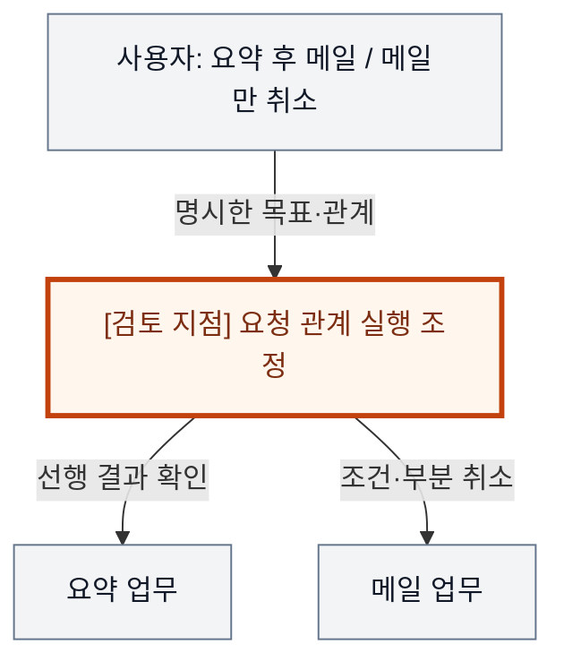
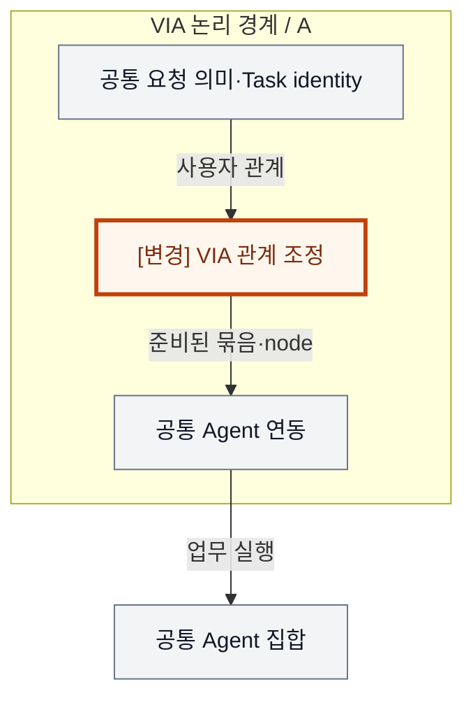
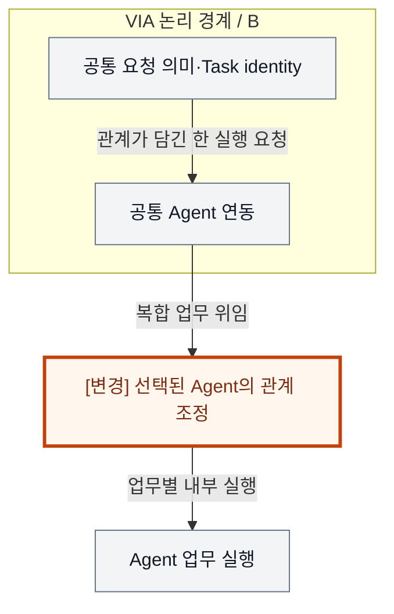
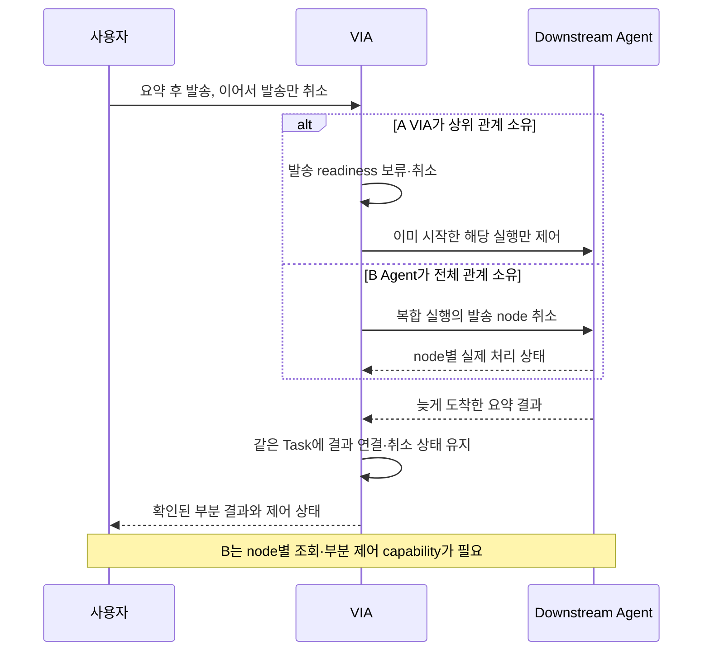

# VIA-DP-07 — 복합 요청 관계의 실행 책임

> **검토 초안 v1 · 2026-09-24 · 사용자 검토 전**
>
> 질문: VIA가 일부 요청 관계를 직접 조정하며 묶음 위임을 조합할 것인가, 실행 가능한 복합 업무 전체의 관계 조정을 Agent에 맡길 것인가?
>
> 현재 판단: **선행 Agent capability 결정 — 부분 제어를 보존하는 동등 기능 확인 전 핵심 비교 보류** 대안 선택·구현·QA 측정은 하지 않았다. 실제 결과는 모두 `NOT_RUN`이다.

## 1. 배경 — ‘요약은 하고, 메일만 취소해’는 누가 집행할까?

사용자가 “자료를 요약한 다음 그 요약을 김대리에게 보내줘”라고 지시한 뒤 “보내는 건 취소하고 요약은 보여줘”라고 바꾼다. VIA는 사용자가 말한 목표·순서·데이터 의존을 보존해야 하지만, 요약 방법이나 메일 Tool을 직접 계획해서는 안 된다. 이 관계의 실행 준비 여부와 부분 제어를 VIA가 관리할지, 복합 업무를 지원하는 Agent가 관리할지가 결정 지점이다.

배경 그림의 주황색 검토 지점은 설계 질문이지 추가 Component가 아니다. VIA는 사용자 PC의 Voice·Text interaction과 업무 연결을 책임진다. Downstream Agent는 실제 업무 계획·Tool 실행을, Model Runtime은 추론 실행을 담당한다. 이 보고서는 그 내부 알고리즘이나 학습을 고르지 않는다.

## 2. 비교 범위와 공통 조건

**용어:** 복합 요청의 node는 사용자가 지정한 하위 요청이며, readiness는 앞 결과·조건이 충족되어 그 요청을 시작해도 되는 상태다. capability는 Agent가 실제 제공하는 실행·조회·부분 제어 기능 계약이다. VIA가 사용자의 요청 관계를 연결하는 것과 Agent가 업무 내부 Tool 계획을 세우는 것은 다른 책임이다.

대상은 사용자가 명시한 순서·조건·결과 의존의 실행 조정이다. 요청 분해·의미 해석·Task identity·사용자 승인 창구는 VIA가 계속 소유한다. Agent 내부의 조사 계획·Tool 단계·자체 retry는 VIA가 다시 구현하지 않는다. 이미 실행 중인 서로 다른 Agent Task를 포함한 혼합 입력은 별도 capability 제약을 가진다.

**기준선에서 확인한 사실:** UC-09·12·14는 부분 취소와 독립 요청의 지속, 선행 실패 뒤 후행 미실행, 정확한 결과 전달을 요구한다. 단일 복합 Agent가 모든 기능을 제공한다는 현재 확정 사실은 없다. 요구의 출처는 [System Mission](../01-system-mission-and-boundary.md), [Fixed Scope](../03-fixed-architecture-scope.md), [Use Cases](../05-representative-use-cases.md)다.

**이번 비교의 설계 가정:** 같은 기능 선언의 Agent 집합을 양쪽에 제공한다. 복합 실행·node identity·부분 결과·부분 취소가 가능한 profile과 불가능한 profile을 분리한다. 원래 Task 상태·Context·응답 게시·기록 보장은 동일하다.

**미확인 사항:** 전체 대표 복합 요청을 소화하는 Agent의 실제 capability, 이미 진행 중인 다른 Agent 실행을 조정할 수 있는 계약, node별 source event 경계. 사실·후보 설계·미확인 가정을 서로 바꿔 쓰지 않는다. Conversation은 이어지는 대화, Request는 논리적 요청, Task는 여러 요청에 걸쳐 추적하는 업무다. Oracle은 실행 전에 정한 정답·허용 상태 조건이고, fixture는 고정 입력·외부 사건이다.

## 3. 대안 A — VIA 관계 조정 + 가능한 부분의 묶음 위임

VIA는 사용자 요청 관계 중 상위 연결의 준비·보류·부분 완료를 관리한다. Agent가 잘 처리할 수 있는 연결된 부분은 하나의 묶음으로 위임하고, 묶음 간 결과와 조건을 VIA가 잇는다. 모든 node를 하나씩 위임하는 약한 안이 아니라 묶음과 개별 실행을 조합한 hybrid다.

VIA는 사용자 관계 graph와 node·Task·Agent 실행의 연결을 소유한다. 완료 event와 취소가 교차하면 확인한 실행 사실에 따라 후행 요청을 억제하거나 이미 수행된 사실을 알린다. 장점은 서로 다른 Agent·기존 Task를 연결하는 제어 범위이고, 비용은 readiness·부분 상태·artifact version·재시작 중복 방지 계약이다.

VIA가 조정하는 것은 사용자가 명시한 업무 관계다. Agent 내부 Tool graph를 복제하지 않는다.

## 4. 대안 B — 복합 업무 전체의 Agent 조정

VIA는 관계를 포함한 요청을 이를 수행할 수 있는 Agent에 위임한다. Agent가 node 준비·조건·실행 관계를 소유하고, VIA는 안정된 node ID·부분 결과·control scope를 받아 사용자 Task view와 연결한다. 독립 정보 질의와 다른 Task 제어까지 하나의 만능 Agent에 몰아넣는 것은 아니다.

부분 취소·clarification·artifact 관계가 실제 계약으로 제공되어야 강한 B다. VIA의 단일 Task identity와 사용자 창구는 유지된다. 기존 다른 Agent Task까지 포함한 복합 범위를 맡기려면 그 연결 capability가 필요하며, 없으면 그 입력에 B를 적용할 수 없다. B의 기능 부족을 VIA의 낮은 QA 점수로 포장하지 않는다.

Agent-neutral 원칙을 유지하려면 특정 Agent가 VIA 전체의 의미·Task authority를 가져서는 안 된다. 복합 실행 책임만 선택된 Agent에 놓는다.

두 구조도는 같은 확대 영역을 그린다. 회색은 공통 책임, 주황색과 `[변경]` 표기는 바뀌는 책임이다. 실선은 이름을 붙인 기능 흐름, 점선은 명시된 비동기 전달이다. **별도 Process라고 적힌 경우 외에는 논리 경계**다. 상자 수는 변경 요소 수나 메모리 크기가 아니다.

두 구조도는 실행 요청의 정방향을 같은 시야로 비교한다. 생략한 역방향의 부분 결과·제어 확인은 아래 동일 사건 sequence에서 함께 설명한다.

## 5. 구조 차이·상호 배타성·Hybrid 검토

| 차이 | A | B |
| --- | --- | --- |
| 상위 요청 관계 readiness | VIA가 하나 이상 소유 | 대상 복합 업무에서는 Agent가 전부 소유 |
| Task와 실행 관계 | node·묶음별 실행 연결 | 복합 실행 + 외부 node 연결 |
| 부분 제어 | VIA가 후행 위임 억제 가능 | Agent의 실제 node control 필요 |
| 공통 | 사용자가 명시한 관계·VIA Task identity·정직한 상태 | 동일 |

같은 대상 복합 업무의 연결을 VIA가 최종적으로 해제·준비시키면 A, 모든 readiness를 Agent가 확정하면 B다. A가 묶음 내부를 위임해도 VIA 소유 상위 연결이 남으면 A다. B를 돕는 VIA가 사실상 node 실행 순서를 결정하면 A가 된다. 서로 다른 독립 업무의 라우팅은 이 결정과 별개다.

작은 묶음은 Agent, 묶음 간은 VIA가 조정하는 hybrid를 A에 포함했다. B는 임의 범용 Agent가 아니라 동등한 node control 계약을 가진 복합 Agent다. ‘부분 제어를 못 하지만 빨리 위임한다’는 B는 제외한다. 그 capability가 없다면 선택은 비교 우열이 아니라 기능 적합성에 의해 제한된다.

A/B 모두 같은 기능·권한·실패 의미와 합리적인 보완책을 허용하는 **steelman**이다. 같은 결정 범위의 최종 기준은 **mutually exclusive**해야 한다. 속도 차이를 만들기 위해 한쪽의 검증·기록·cache를 빼지 않는다.

### 같은 사건에서 확인하는 순서 차이

다음 그림은 A/B의 차이가 드러나는 동일 사건을 비교한다. 외부 완료와 VIA 내부 확정을 구별하며, 아래 사고실험에서 지연·실패 조건까지 확인한다.

## 6. 같은 사건을 통과시키는 사고실험

### T1. 요약 결과 전달과 후행 취소

같은 원천·artifact 결과를 주고, 요약 완료 직전 메일 취소가 도착하게 한다. A는 메일 node의 readiness를 닫고 실제 요약 결과를 남긴다. B는 동일 node ID로 취소를 전달하고 Agent의 confirmed pending/canceled/already-completed 상태를 받는다. A에서도 이미 메일이 위임되었다면 외부 확인이 필요하므로 무조건 즉시 취소 완료라고 말할 수 없다.

B에 안정된 node 결과·control이 있으면 QA-13/14도 올바를 수 있다. VIA가 node를 소유한다고 자동으로 더 정확하지 않다. 반대로 B가 node 정보를 제공하지 않으면 같은 사용자 목표의 대안이 아니다. QA-05는 해당 case에서 사실에 맞는 disposition까지를 측정하며 외부 완료 대기 조건을 양쪽에 같게 적용한다.

### T2. VIA overhead를 Agent 실행으로 옮긴 효과

A는 상위 연결에서 source 결과 수신 → artifact 연결 → 다음 위임 준비를 수행한다. B는 최초 위임 후 Agent 내부에서 관계를 진행한다. B의 VIA-side 경계가 줄 수 있지만 그 조정 비용은 사라진 것이 아니라 Agent 내부로 이동했다.

현행 QA-01은 단일 위임의 outbound와 terminal inbound 경계를 명시한다. 복합 A의 여러 실행에 이를 무조건 합산하거나 B의 전체 interval에서 Agent 시간을 뺀 값과 비교하면 같은 metric이 아니다. 복합 실행의 공통 source endpoint·분모가 승인되기 전에는 이 대상의 QA-01을 직접 비교 불가로 둔다. 전체 사용자 대기시간은 보조 근거다. A도 묶음을 써 경계를 줄일 수 있으므로 node 수 자체를 지연값으로 쓰지 않는다.

### T3. 부분 장애·재시작·혼합된 기존 Task

요약 성공, 메일 실패, 다른 보고서는 계속되는 같은 사건을 준다. A는 각 실행의 사실과 준비되지 않은 후행을 복원한다. B는 외부 Agent가 복합 node 상태를 조회·재연결 가능하게 제공해야 한다. 이 capability가 있으면 VIA가 shadow scheduler를 추가할 필요가 없고, 없다면 시험기가 대신 복원할 수 없다. 두 안 모두 확인 없는 재전송으로 외부 Action을 중복시키지 않는다.

UC-09.5처럼 이미 서로 다른 Agent에 진행 중인 Task와 직접 질문이 섞이면, B가 이를 하나의 복합 실행으로 옮길 수 있다고 가정할 수 없다. 기존 실행 ownership을 Agent가 실제로 제어할 계약이 없으면 해당 혼합 부분은 공통 VIA 제어로 남기거나 B 적용 범위를 좁혀야 한다. ‘전체 시스템은 B’라는 초기 표현을 이 때문에 보류한다.

### T4. 변경·자원·연구 기록

A-04~06/08/09의 status·identity·capability·질문·artifact 변화는 A의 node 연결 또는 B의 복합 계약에 닿을 수 있다. A-01~03/07도 같은 전체 pack에서 확인한다. M-01~09와 C-01~06은 공통 모델·Context·저장 계약을 유지하며, 외부 Agent의 graph 구현 변경을 QA-22의 VIA 요소로 세지 않는다. E-01~05는 실제 상위 node와 실행 관계를 기록하는 요소의 수정 범위를 확인한다.

A의 graph state와 B의 외부 node shadow view가 모두 필요하므로 B의 PC 메모리가 항상 작다고 할 수 없다. QA-61은 VIA 책임 경계의 연결을 요구하지 Agent 내부 Tool trace를 요구하지 않는다. 양쪽 frozen evidence와 evaluator가 있으면 QA-62는 같을 수 있다. 최소 필요 Context는 묶음 위임에도 동일하게 적용한다.

## 7. 전체 19개 QA 비교

**사고실험 예상 / 실제 측정 `NOT_RUN`.** §2의 조건과 위 사고실험을 적용한다. 시간·변경 수·중단 수·메모리·노출은 작을수록, 정확성·연속성·완전성·재현 비율은 클수록 좋다. “비슷”은 명시한 조건에서 차이가 작다는 예상이며, “판단 근거 부족”은 방향·크기를 모른다는 뜻이다. 확실성은 실측 신뢰구간이 아니다. **부분 사례의 차이를 최악 case p95·전체 corpus·전체 change pack의 대표값 차이로 확대하지 않는다.**

| QA · 단일 metric | 예상 방향·크기 | 확실성 | 구조적 이유·반례와 근거 | 역할 |
| --- | --- | --- | --- | --- |
| QA-01 위임 경로 VIA 처리시간 · 최악 case p95; Agent 실행 제외 | 대상 복합 경로는 직접 비교 불가 | 높음 | 다중 실행과 단일 복합 실행의 공통 집계 경계 미정 [T2](#t2) | 적용성 선행 |
| QA-02 직접 Voice 응답시간 · 최악 case p95 | 비슷 | 중간 | 공통 직접 응답은 복합 Agent orchestration과 분리 [T2](#t2) | 회귀 |
| QA-03 Agent 상태 Voice 전달시간 · 최악 case p95 | 조건부; 크기 미정 | 낮음 | 동일 node status source를 정의할 수 있는 profile에서만 비교 [T1](#t1) | 적용성 선행 |
| QA-04 음성 중단시간 · 최악 case p95 | 비슷 | 중간 | 물리 음성 중단은 node 취소와 다름 [T1](#t1) | 회귀 |
| QA-05 Task 제어 응답시간 · 최악 control case p95 | 조건부: 위임 전 억제는 A 가능 | 중간 | 위임 후에는 A도 외부 사실 확인; B 부분 제어 capability 필수 [T1](#t1) | 주 비교 가능성 |
| QA-11 전체 요청 처리 정확도 · case별 strict 성공률의 평균 | 판단 근거 부족 | 낮음 | 동등 기능의 복합 Agent와 혼합 Task 지원 미확인 [T3](#t3) | 기능 적합성 |
| QA-12 의미 해석 정확도 · strict 성공 run 비율 | 비슷 | 중간 | 사용자 관계의 의미 해석은 VIA 공통 책임 [T1](#t1) | 회귀 |
| QA-13 Task·Interaction 연결 정확도 · strict 성공 run 비율 | 비슷 예상; capability 선행 | 중간 | node ID·부분 control이 있으면 B도 정확히 연결 가능 [T1](#t1) | 기능 적합성 |
| QA-14 비동기 Task 상태 수렴 · strict 성공 run 비율 | 비슷 예상; capability 선행 | 중간 | 부분 terminal·취소·완료 수렴을 두 안 모두 확인 [T3](#t3) | 기능 적합성 |
| QA-15 대화·Task 연속성 · 성공 scenario 비율 | 비슷 예상 | 중간 | 복합 실행 ID와 VIA Task identity를 구별 [T3](#t3) | 회귀 |
| QA-21 Agent 변화 영향 범위 · 9개 변화의 변경 요소 평균 | 조건부; 전체 평균 미정 | 낮음 | node·복합 계약의 전파를 모든 A 변화에서 확인 [T4](#t4) | 주 비교 가능성 |
| QA-22 Model·Context·State 변화 영향 · 15개 변화의 변경 요소 평균 | 판단 근거 부족 | 낮음 | Agent 내부 graph 변화는 VIA 변경 감소 점수로 바로 환산 못함 [T4](#t4) | 회귀·ledger |
| QA-23 실험·로그 변화 영향 · 5개 변화의 변경 요소 평균 | 판단 근거 부족 | 낮음 | 상위 관계와 외부 node evidence 계약의 변경 수 미정 [T4](#t4) | 회귀·ledger |
| QA-31 올바른 Task 복구시간 · 최악 fault p95 | 조건부; 크기 미정 | 낮음 | Agent의 부분 상태 조회·재연결 기능이 필요 [T3](#t3) | 기능 적합성 |
| QA-32 불필요한 장애 영향 범위 · 초과 중단 단위 최대 수 | 비슷; 의존 범위 고정 필요 | 중간 | 복합 Agent 필수 의존 실패를 초과 전파로 세지 않음 [T3](#t3) | 회귀 |
| QA-41 PC 메모리 · 최악 workload의 peak p95 | 조건부; 방향 미정 | 낮음 | VIA graph와 복합 node view의 실제 resident 상태 비교 [T4](#t4) | 주 비교 가능성 |
| QA-51 불필요한 보호정보 노출 · 초과 노출 단위 수 | 비슷 | 중간 | 업무 묶음이라는 이유로 과다 Context 전달 금지 [T4](#t4) | 필수 회귀 |
| QA-61 실행 trace 완전성 · 완전한 trace run 비율 | 비슷 | 중간 | B에도 상위 node·Task·실행 연결 trace를 허용 [T4](#t4) | 필수 회귀 |
| QA-62 평가 재현성 · 동일 평가 재계산 비율 | 비슷 | 중간 | Agent 재실행 없이 보존된 평가 근거 재계산 [T4](#t4) | 필수 회귀 |

A의 독립 제어와 B의 외부 orchestration 재사용은 합리적인 선택 이유다. 그러나 기능 불가능한 B를 만들거나 VIA-only 시간을 외부로 옮겨 빠른 안을 만드는 비교는 하지 않는다.

## 8. 공정한 검증 계획 — 실행하지 않음

UC-09 전체 5유형과 UC-12/14의 부분 제어에 대해 composite capability·node identity·source status·artifact·reconnect를 명세한다. 지원하지 않는 profile은 A/B 비교 표본이 아니라 적용 범위 제약으로 기록한다. 가능한 profile에서만 공통 endpoint 계약을 제안한다.

측정에 앞서 동일한 목표·fixture·외부 기능·자원 조건, case별 실제 참여 경로, 실패·timeout 처리, 반복·집계·target·동점 기준을 동결한다. 최종 점수나 승리 개수는 지금 만들지 않는다. QA-11과 QA-12~15의 성공을 중복 합산하지 않는다. 잘못된 대상·중복 Action, 무효 승인, 무단 접근은 점수로 상쇄할 수 없는 필수 위반 조건이다.

근거 계약: [Voice responsiveness](../08-quality-attributes/voice-responsiveness.md), [Task 제어](../08-quality-attributes/interaction-control-responsiveness.md), [실제 event 경계](../11-measurement/event-boundary-contract.md), [정확성·연속성](../08-quality-attributes/correctness-and-continuity.md), [복구·장애·메모리](../08-quality-attributes/reliability-and-resource.md), [19개 QA catalog](../08-quality-attributes/quality-model.md), [변경 전체 집합](../07-intentional-variables.md), [변경 요소와 실험 change pack](../08-quality-attributes/evidence/change-locality-rationale.md), [관측·재현](../08-quality-attributes/observability.md), [Privacy·집계](../11-measurement/scoring-contract.md). 문서 사고실험은 실행 evidence label이나 기존 archive 결과로 대신하지 않는다.

## 9. 다른 DP·변경 비용

DP-01 직접 처리 범위, DP-02 관계 확정, DP-06 사용자 관계 해석, DP-09 Agent 의미 계약을 고정한다. A→B는 진행 중 node를 임의로 외부 실행에 이식하지 않고 종료·재연결 가능한 경계에서 전환한다. B→A도 외부 내부 state를 복원할 수 있다고 가정하지 않고 확인 가능한 결과·관계부터 이행한다.

## 10. 현재 판단과 재검토 조건

**선행 capability·책임 범위 결정으로 남긴다.** B의 동등 기능과 복합 QA-01 경계가 확인되기 전 핵심 점수 비교로 올리지 않는다. 기능이 제한된 Agent 환경에서 A가 필요하다는 사실은 B의 낮은 QA 점수나 모든 환경의 A 승리를 뜻하지 않는다.

## 11. 자체 검토에서 반영한 개선점

묶음 위임 hybrid를 A에 포함했다. B의 부분 취소·재시작 기능을 명시했으며 UC-09.5의 이미 진행 중인 다른 Agent 업무 문제를 새 제약으로 드러냈다. Agent 내부 실행시간·메모리·변경 책임의 외부 이동을 이점과 구별했다.

검토 범위는 문서·사고실험이다. 외부 심사나 후보 성능 검증을 완료했다는 뜻이 아니다. 렌더링·정합성 검사와 전체 후보의 최종 분류는 [전체 검토 종합](./dp-review-synthesis.md)에 기록한다.
