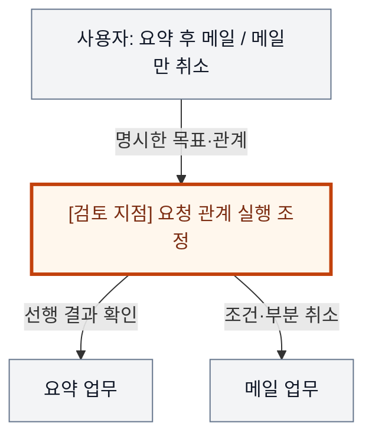
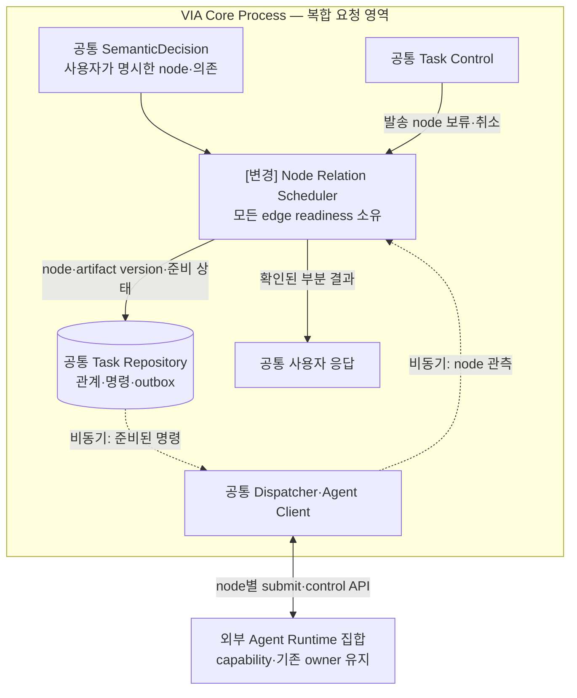
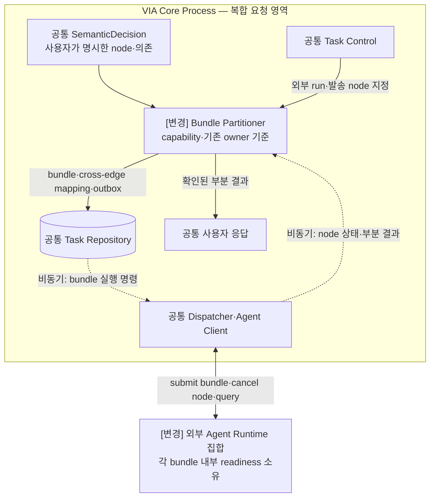
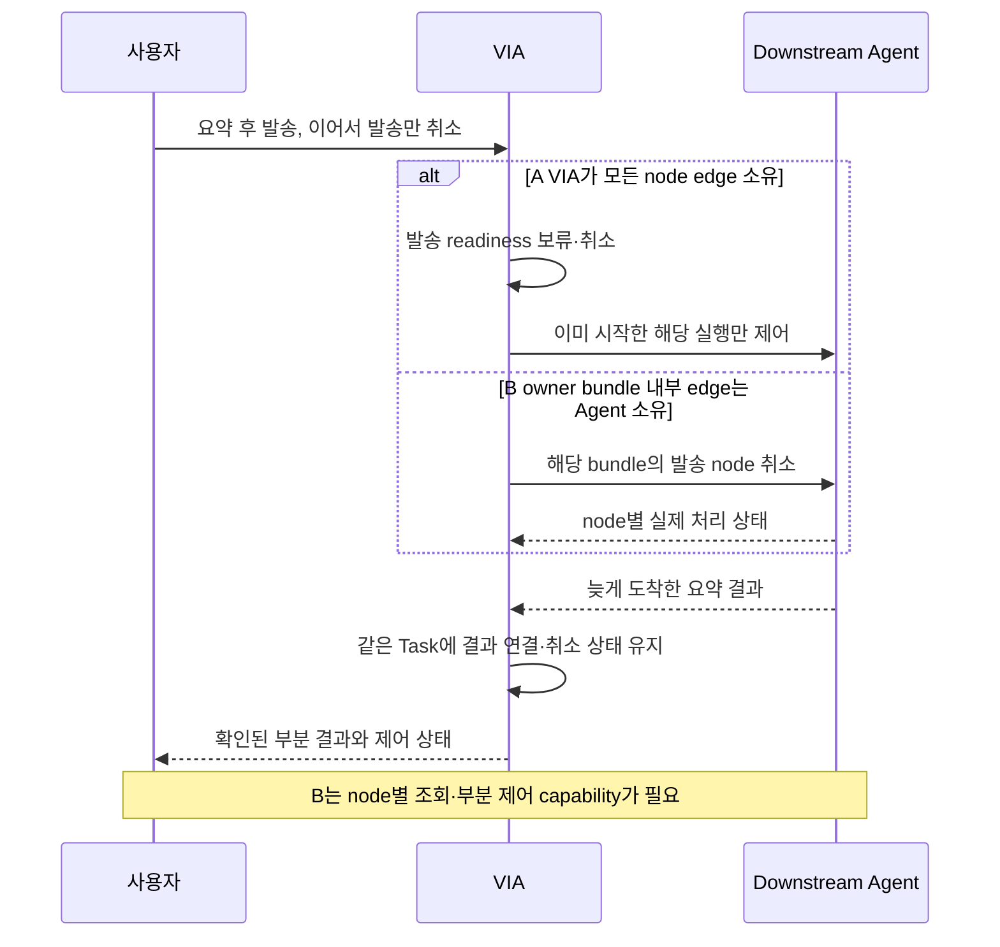

# VIA-DP-07 — 복합 요청 graph의 dependency 실행 권한

> **핵심 DP 초안 v3 · 2026-09-28 · 사용자 선정 반영 / 상세 검토 예정**
>
> 질문: 사용자가 명시한 복합 요청 graph의 dependency edge를 VIA가 node 단위로 모두 실행 관리할 것인가, 같은 owner Agent가 처리할 수 있는 bundle 내부 edge는 그 Agent에 맡길 것인가?
>
> 현재 판단: **2026-09-28 핵심 DP shortlist에 포함**. “전체 복합 요청을 한 Agent에 위임”하는 약한 B를 폐기하고, capability·기존 Task owner에 따라 bundle을 나눈 뒤 edge별 readiness authority를 비교하도록 재정의했다. 상세 capability와 measurement contract는 후속 심층 검토에서 동결하며 실제 결과는 `NOT_RUN`이다.

## 1. 배경 — ‘요약은 하고, 메일만 취소해’는 누가 집행할까?

사용자가 “자료를 요약한 다음 그 요약을 김대리에게 보내줘”라고 지시한 뒤 “보내는 건 취소하고 요약은 보여줘”라고 바꾼다. VIA는 사용자가 말한 목표·순서·데이터 의존을 보존해야 하지만, 요약 방법이나 메일 Tool을 직접 계획해서는 안 된다. 이 관계의 실행 준비 여부와 부분 제어를 VIA가 관리할지, 복합 업무를 지원하는 Agent가 관리할지가 결정 지점이다.

```mermaid
flowchart TB
 U["사용자: 요약 후 메일 / 메일만 취소"] -->|명시한 목표·관계| Q["[검토 지점] 요청 관계 실행 조정"]
 Q -->|선행 결과 확인| A["요약 업무"]
 Q -->|조건·부분 취소| B["메일 업무"]

classDef common fill:#F3F4F6,stroke:#64748B,color:#111827;
classDef change fill:#FFF7ED,stroke:#C2410C,stroke-width:3px,color:#7C2D12;
class U,A,B common;
class Q change;
```

배경 그림의 주황색 검토 지점은 설계 질문이지 추가 Component가 아니다. VIA는 사용자 PC의 Voice·Text interaction과 업무 연결을 책임진다. Downstream Agent는 실제 업무 계획·Tool 실행을, Model Runtime은 추론 실행을 담당한다. 이 보고서는 그 내부 알고리즘이나 학습을 고르지 않는다.

## 2. 비교 범위와 공통 조건

**용어:** 복합 요청의 node는 사용자가 지정한 하위 요청이며, readiness는 앞 결과·조건이 충족되어 그 요청을 시작해도 되는 상태다. capability는 Agent가 실제 제공하는 실행·조회·부분 제어 기능 계약이다. VIA가 사용자의 요청 관계를 연결하는 것과 Agent가 업무 내부 Tool 계획을 세우는 것은 다른 책임이다.

대상은 사용자가 명시한 순서·조건·결과 의존의 실행 조정과 각 dependency edge의 readiness authority다. 요청 분해·의미 해석·VIA Task identity·사용자 승인 창구와 bundle 사이 관계는 VIA가 계속 소유한다. Agent 내부의 조사 계획·Tool 단계·자체 retry는 VIA가 다시 구현하지 않는다.

하나의 Agent가 모든 capability와 기존 실행 ownership을 가진다고 가정하지 않는다. 먼저 node를 capability와 기존 Task/Agent execution owner에 따라 partition하고, 같은 owner가 동등한 node status·artifact·부분 control을 제공할 수 있는 bundle 내부 edge만 A/B 비교 대상으로 삼는다. 서로 다른 owner 사이 edge는 양쪽 모두 VIA가 관리한다.

**기준선에서 확인한 사실:** UC-09·12·14는 부분 취소와 독립 요청의 지속, 선행 실패 뒤 후행 미실행, 정확한 결과 전달을 요구한다. 단일 복합 Agent가 모든 기능을 제공한다는 현재 확정 사실은 없다. 요구의 출처는 [System Mission](../01-system-mission-and-boundary.md), [Fixed Scope](../03-fixed-architecture-scope.md), [Use Cases](../05-representative-use-cases.md)다.

**이번 비교의 설계 가정:** 같은 기능 선언의 Agent 집합을 양쪽에 제공한다. 복합 실행·node identity·부분 결과·부분 취소가 가능한 profile과 불가능한 profile을 분리한다. 원래 Task 상태·Context·응답 게시·기록 보장은 동일하다.

**미확인 사항:** bundle submission·node status·artifact version·부분 control의 실제 Agent capability, bundle partition 규칙, node별 source event 경계. 이미 진행 중인 다른 Agent 실행을 다른 owner에게 이식할 수 있다고 가정하지 않는다. 사실·후보 설계·미확인 가정을 서로 바꿔 쓰지 않는다. Conversation은 이어지는 대화, Request는 논리적 요청, Task는 여러 요청에 걸쳐 추적하는 업무다. Oracle은 실행 전에 정한 정답·허용 상태 조건이고, fixture는 고정 입력·외부 사건이다.

### 구현도를 읽기 위한 공통 전제

**S2S 모델 1개 + semantic LLM 1개**를 고정한다. Component·Task·단계별 별도 적재는 없고 프롬프트·세션·호출만 나눌 수 있다. 아래는 **구현 가능한 후보 설계 설명**이며 제품 구현 완료나 QA 실측이 아니다. 모델 동시 호출·취소 지원은 공통 dependency profile로 확인한다.

Core Process는 이 DP의 A/B 공통 비교용 배치다. Process 자체를 비교하는 VIA-DP-11 외에는 한쪽만 별도 Process를 추가하지 않는다. 외부 Agent Runtime은 VIA Client와 별개이며 모델의 local/remote 배치도 별도 조건이다. 생략 영역은 양쪽에서 동일하다.

실선은 라벨의 호출·반환·읽기·쓰기, 점선은 비동기 event다. Queue/buffer는 별도 노드, 영속 기록은 원통으로 그린다. 메모리 queue 수락은 durable commit이 아니고 별도 message bus 제품도 가정하지 않는다. 메시지는 request/Task/call identity와 관련 revision·generation으로 연결한다. 늦은 결과는 최종 owner가 검사한다. queue 용량·포화 정책은 측정 전 동결하며 무한 queue를 가정하지 않는다.

## 3. 대안 A — VIA node-level orchestration

VIA는 user-visible node와 그 사이 dependency edge의 준비·보류·부분 완료를 모두 관리한다. 각 node는 capability와 기존 Task owner에 맞는 Agent로 보낸다. 같은 Agent가 연속 node를 수행하더라도 다음 node의 release 여부는 VIA가 source result·artifact version·control state를 확인해 결정한다.

장점은 서로 다른 Agent·기존 Task를 같은 방식으로 연결하고 node별 부분 제어·장애 격리를 유지하는 것이다. 비용은 node 사이마다 VIA status 수신·artifact 연결·readiness commit·다음 dispatch가 반복된다는 점이다.

```mermaid
flowchart TB
 subgraph V["VIA Core Process — 복합 요청 영역"]
 R["공통 SemanticDecision<br/>사용자가 명시한 node·의존"] --> G["[변경] Node Relation Scheduler<br/>모든 edge readiness 소유"]
 G -->|"node·artifact version·준비 상태"| DB[("공통 Task Repository<br/>관계·명령·outbox")]
 DB -.->|"비동기: 준비된 명령"| D["공통 Dispatcher·Agent Client"]
 D -.->|"비동기: node 관측"| G
 U["공통 Task Control"] -->|"발송 node 보류·취소"| G
 G -->|"확인된 부분 결과"| P["공통 사용자 응답"]
 end
 D <-->|"node별 submit·control API"| A["외부 Agent Runtime 집합<br/>capability·기존 owner 유지"]
```

**실제 호출·상태·실패 처리 순서**

1. Scheduler는 ‘요약 → 발송’이라는 사용자 관계를 저장한다. 요약 방법·메일 Tool은 정하지 않는다. 준비된 node만 outbox에 넣어 capability와 기존 owner가 맞는 외부 Agent에 전달한다.
2. 요약 완료가 오면 node·artifact version을 확인하고 발송이 아직 허용될 때만 후행 명령을 만든다. ‘발송만 취소’가 먼저 확정됐다면 늦은 요약 결과가 발송을 되살리지 않는다.
3. crash 뒤 저장된 node·submission key를 확인한다. 이미 위임한 개별 node의 실제 중단·완료 확인은 Agent capability에 의존하지만, 아직 release하지 않은 후행 node의 억제는 VIA가 확정한다. Scheduler·Task마다 별도 모델이나 외부 Agent Process를 생성하지 않는다.

VIA가 조정하는 것은 사용자가 명시한 업무 관계다. Agent 내부 Tool graph를 복제하지 않는다.

## 4. 대안 B — Owner-affinity bundle orchestration

VIA는 같은 capability와 기존 execution owner를 가진 연결 node를 maximal owner-affinity bundle로 partition한다. 선택된 Agent는 bundle 내부 node의 준비·조건·실행 관계를 소유하고, VIA는 bundle 사이 edge와 안정된 node ID·부분 결과·control scope를 사용자 Task view에 연결한다. 복합 요청 전체를 하나의 만능 Agent에 몰아넣는 안이 아니다.

부분 취소·clarification·artifact·node status가 실제 bundle 계약으로 제공되어야 강한 B다. VIA의 단일 Task identity와 사용자 창구는 유지된다. 다른 capability나 기존 Agent execution이 필요한 node는 별도 bundle로 남고 cross-bundle edge는 VIA가 소유한다. 필요한 bundle capability가 없으면 해당 edge에는 B를 적용하지 않으며 기능 부족을 낮은 QA 점수로 포장하지 않는다.

```mermaid
flowchart TB
 subgraph V["VIA Core Process — 복합 요청 영역"]
 R["공통 SemanticDecision<br/>사용자가 명시한 node·의존"] --> T["[변경] Bundle Partitioner<br/>capability·기존 owner 기준"]
 T -->|"bundle·cross-edge mapping·outbox"| DB[("공통 Task Repository")]
 DB -.->|"비동기: bundle 실행 명령"| D["공통 Dispatcher·Agent Client"]
 D -.->|"비동기: node 상태·부분 결과"| T
 U["공통 Task Control"] -->|"외부 run·발송 node 지정"| T
 T -->|"확인된 부분 결과"| P["공통 사용자 응답"]
 end
 D <-->|"submit bundle·cancel node·query"| A["[변경] 외부 Agent Runtime 집합<br/>각 bundle 내부 readiness 소유"]
```

**실제 호출·상태·실패 처리 순서**

1. VIA는 graph를 capability와 기존 owner로 partition하고 각 bundle을 해당 Agent에 보낸다. 반환된 run/node ID를 VIA Task에 연결하며 bundle 내부 다음 node의 readiness는 Agent가 결정한다.
2. 부분 취소는 안정된 node ID로 전달한다. Agent가 접수·취소 완료·이미 실행을 구분하고 부분 결과를 제공해야 같은 사용자 기능이 성립한다.
3. bundle 내부 edge를 VIA가 사실상 하나씩 release하면 그 edge는 A가 된다. 필요한 capability가 없는 edge는 A 또는 cross-bundle VIA edge로 남긴다. 외부 Runtime은 양쪽 모두 VIA Process 밖이다.

Agent-neutral 원칙을 유지하려면 특정 Agent가 VIA 전체의 의미·Task authority를 가져서는 안 된다. 복합 실행 책임만 선택된 Agent에 놓는다.

두 구조도는 같은 확대 영역이다. 같은 이름은 공통 책임, `[변경]`은 바뀐 책임이다. 경계의 Process 표시는 공통 비교용 배치이며 실선은 라벨의 기능 흐름, 점선은 비동기 전달이다. 상자 수는 변경 요소 수나 메모리 크기가 아니다.

두 구조도는 실행 요청의 정방향을 같은 시야로 비교한다. 생략한 역방향의 부분 결과·제어 확인은 아래 동일 사건 sequence에서 함께 설명한다.

## 5. 구조 차이·상호 배타성·Hybrid 검토

| 차이 | A | B |
| --- | --- | --- |
| 비교 대상 edge readiness | VIA가 모든 node edge 소유 | 같은 owner bundle 내부는 Agent, bundle 사이는 VIA |
| Task와 실행 관계 | node별 실행 연결 | bundle 실행 + 외부 node 연결 |
| 부분 제어 | VIA가 후행 위임 억제 가능 | Agent의 실제 node control 필요 |
| 공통 | 사용자가 명시한 관계·VIA Task identity·정직한 상태 | 동일 |

같은 비교 대상 edge를 VIA가 최종적으로 해제·준비시키면 A, owner Agent가 bundle 내부 상태로 확정하면 B다. B에서도 서로 다른 bundle 사이 edge는 VIA가 소유하므로 “전체 시스템의 orchestration을 특정 Agent에 넘긴다”는 의미가 아니다. B를 돕는 VIA가 bundle 내부 node 실행 순서를 사실상 결정하면 그 edge는 A가 된다.

제품 graph에는 A edge와 B edge가 함께 존재할 수 있지만, 동일 edge의 authority는 하나다. A 후보는 모든 user-declared edge를 VIA에 유지하고, B 후보는 사전 정의한 owner-compatible edge를 bundle 내부로 이동한다. ‘부분 제어를 못 하지만 빨리 위임한다’는 B는 제외한다. capability가 없다면 선택은 비교 우열이 아니라 기능 적합성에 의해 제한된다.

A/B 모두 같은 기능·권한·실패 의미와 합리적인 보완책을 허용하는 **steelman**이다. 같은 결정 범위의 최종 기준은 **mutually exclusive**해야 한다. 속도 차이를 만들기 위해 한쪽의 검증·기록·cache를 빼지 않는다.

### 같은 사건에서 확인하는 순서 차이

다음 그림은 A/B의 차이가 드러나는 동일 사건을 비교한다. 외부 완료와 VIA 내부 확정을 구별하며, 아래 사고실험에서 지연·실패 조건까지 확인한다.

```mermaid
sequenceDiagram
 participant U as 사용자
 participant V as VIA
 participant A as Downstream Agent
 U->>V: 요약 후 발송, 이어서 발송만 취소
 alt A VIA가 모든 node edge 소유
 V->>V: 발송 readiness 보류·취소
 V->>A: 이미 시작한 해당 실행만 제어
 else B owner bundle 내부 edge는 Agent 소유
 V->>A: 해당 bundle의 발송 node 취소
 A-->>V: node별 실제 처리 상태
 end
 A-->>V: 늦게 도착한 요약 결과
 V->>V: 같은 Task에 결과 연결·취소 상태 유지
 V-->>U: 확인된 부분 결과와 제어 상태
 Note over U,A: B는 node별 조회·부분 제어 capability가 필요
```

## 6. 같은 사건을 통과시키는 사고실험

### T1. 요약 결과 전달과 후행 취소

같은 원천·artifact 결과를 주고, 요약 완료 직전 메일 취소가 도착하게 한다. A는 메일 node의 readiness를 닫고 실제 요약 결과를 남긴다. B는 동일 node ID로 취소를 전달하고 Agent의 confirmed pending/canceled/already-completed 상태를 받는다. A에서도 이미 메일이 위임되었다면 외부 확인이 필요하므로 무조건 즉시 취소 완료라고 말할 수 없다.

B에 안정된 node 결과·control이 있으면 QA-13/14도 올바를 수 있다. VIA가 node를 소유한다고 자동으로 더 정확하지 않다. 반대로 B가 node 정보를 제공하지 않으면 같은 사용자 목표의 대안이 아니다. QA-05는 해당 case에서 사실에 맞는 disposition까지를 측정하며 외부 완료 대기 조건을 양쪽에 같게 적용한다.

### T2. VIA overhead를 Agent 실행으로 옮긴 효과

A는 같은 owner가 처리할 수 있는 연속 node에서도 source 결과 수신 → artifact 연결 → readiness commit → 다음 위임을 VIA가 수행한다. B는 bundle을 한 번 위임한 뒤 bundle 내부 edge를 Agent가 진행한다. Cross-bundle edge에서는 B도 VIA를 다시 거친다. B의 VIA-side 경계가 줄 수 있지만 그 조정 비용은 사라진 것이 아니라 Agent 내부로 이동했다.

QA-09에는 동일한 사용자 graph를 완료하는 동안 실제로 발생한 VIA-attributable segment를 합산하되 Agent 내부 queue·reasoning·Tool 시간은 제외한다. A의 node별 왕복과 B의 bundle ingress/terminal·cross-bundle 왕복을 같은 source 사건으로 계측한다. Agent 내부로 비용이 이동한 사실을 숨기지 않도록 full user wall-clock도 secondary evidence로 공개한다. 단순 node 수를 지연값으로 쓰지 않고 실제 VIA event를 측정한다.

### T3. 부분 장애·재시작·혼합된 기존 Task

요약 성공, 메일 실패, 다른 보고서는 계속되는 같은 사건을 준다. A는 각 node 실행의 사실과 준비되지 않은 후행을 복원한다. B는 영향 bundle의 node 상태를 조회·재연결하고 cross-bundle edge를 VIA 기록에서 복원한다. Bundle 하나의 Agent가 죽었을 때 같은 bundle의 아직 실행되지 않은 node까지 영향을 받는 범위와 A의 node별 격리를 QA-39에서 비교한다. 두 안 모두 확인 없는 재전송으로 외부 Action을 중복시키지 않는다.

UC-09.5처럼 이미 서로 다른 Agent에 진행 중인 Task와 직접 질문이 섞이면 기존 실행을 현재 owner의 bundle에 유지한다. 다른 owner로 이식하지 않으며 owner 사이 dependency는 VIA edge다. 이 partition 규칙 덕분에 A/B 모두 혼합 요청을 처리할 수 있지만, B bundle 내부 node control capability가 없는 Agent는 단일-node bundle로 축소된다.

### T4. 변경·자원·연구 기록

A-04~06/08/09의 status·identity·capability·질문·artifact 변화는 A의 node 연결 또는 B의 복합 계약에 닿을 수 있다. A-01~03/07도 같은 전체 pack에서 확인한다. M-01~09와 C-01~06은 공통 모델·Context·저장 계약을 유지하며, 외부 Agent의 graph 구현 변경을 QA-22의 VIA 요소로 세지 않는다. E-01~05는 실제 상위 node와 실행 관계를 기록하는 요소의 수정 범위를 확인한다.

A의 graph state와 B의 외부 node shadow view가 모두 필요하므로 B의 PC 메모리가 항상 작다고 할 수 없다. QA-61은 VIA 책임 경계의 연결을 요구하지 Agent 내부 Tool trace를 요구하지 않는다. 양쪽 frozen evidence와 evaluator가 있으면 QA-62는 같을 수 있다. 최소 필요 Context는 묶음 위임에도 동일하게 적용한다.

## 7. Core ASR 적용과 상세 QA 사고실험

이 DP의 초기 역할은 **QA-09/19/29/39 모두 `PRIMARY`**다. 복합 위임·상태·제어 시간, dependency field, compound 계약 change와 부분 실행 중 crash 복원을 함께 측정한다. 최종 모집단은 [Core ASR Contract의 DP 원장](../08-quality-attributes/core-asr-contract.md#8-via-dp-0118-적용-원장)에서 freeze한다. 아래 표는 상세 input·diagnostic이다.

**사고실험 예상 / 실제 측정 `NOT_RUN`.** §2의 조건과 위 사고실험을 적용한다. 시간·변경 수·중단 수·메모리·노출은 작을수록, 정확성·연속성·완전성·재현 비율은 클수록 좋다. “비슷”은 명시한 조건에서 차이가 작다는 예상이며, “판단 근거 부족”은 방향·크기를 모른다는 뜻이다. 확실성은 실측 신뢰구간이 아니다. **부분 사례의 차이를 최악 case p95·전체 corpus·전체 change pack의 대표값 차이로 확대하지 않는다.**

| QA · 단일 metric | 예상 방향·크기 | 확실성 | 구조적 이유·반례와 근거 | 역할 |
| --- | --- | --- | --- | --- |
| QA-01 위임 경로 VIA 처리시간 · 최악 case p95; Agent 실행 제외 | 조건부: B 우세 가능 | 중간 | owner-compatible 연속 node의 VIA 왕복 감소; cross-bundle은 동일, full wall-clock 병기 [T2](#t2) | 주 비교 후보 |
| QA-02 직접 Voice 응답시간 · 최악 case p95 | 비슷 | 중간 | 공통 직접 응답은 복합 Agent orchestration과 분리 [T2](#t2) | 회귀 |
| QA-03 Agent 상태 Voice 전달시간 · 최악 case p95 | 조건부; 크기 미정 | 낮음 | 동일 node status source를 정의할 수 있는 profile에서만 비교 [T1](#t1) | 적용성 선행 |
| QA-04 음성 중단시간 · 최악 case p95 | 비슷 | 중간 | 물리 음성 중단은 node 취소와 다름 [T1](#t1) | 회귀 |
| QA-05 Task 제어 응답시간 · 최악 control case p95 | 조건부: 위임 전 억제는 A 가능 | 중간 | 위임 후에는 A도 외부 사실 확인; B 부분 제어 capability 필수 [T1](#t1) | 주 비교 가능성 |
| QA-11 전체 요청 처리 정확도 · case별 strict 성공률의 평균 | 조건부; 방향 미정 | 낮음 | edge owner·artifact version·부분 control·기존 owner binding의 field 정확도 [T1](#t1) [T3](#t3) | 주 비교 후보 |
| QA-12 의미 해석 정확도 · strict 성공 run 비율 | 비슷 | 중간 | 사용자 관계의 의미 해석은 VIA 공통 책임 [T1](#t1) | 회귀 |
| QA-13 Task·Interaction 연결 정확도 · strict 성공 run 비율 | 비슷 예상; capability 선행 | 중간 | node ID·부분 control이 있으면 B도 정확히 연결 가능 [T1](#t1) | 기능 적합성 |
| QA-14 비동기 Task 상태 수렴 · strict 성공 run 비율 | 비슷 예상; capability 선행 | 중간 | 부분 terminal·취소·완료 수렴을 두 안 모두 확인 [T3](#t3) | 기능 적합성 |
| QA-15 대화·Task 연속성 · 성공 scenario 비율 | 비슷 예상 | 중간 | 복합 실행 ID와 VIA Task identity를 구별 [T3](#t3) | 회귀 |
| QA-21 Agent 변화 영향 범위 · 9개 변화의 변경 요소 평균 | 조건부; 전체 평균 미정 | 낮음 | node·복합 계약의 전파를 모든 A 변화에서 확인 [T4](#t4) | 주 비교 가능성 |
| QA-22 Model·Context·State 변화 영향 · 15개 변화의 변경 요소 평균 | 판단 근거 부족 | 낮음 | Agent 내부 graph 변화는 VIA 변경 감소 점수로 바로 환산 못함 [T4](#t4) | 회귀·ledger |
| QA-23 실험·로그 변화 영향 · 5개 변화의 변경 요소 평균 | 판단 근거 부족 | 낮음 | 상위 관계와 외부 node evidence 계약의 변경 수 미정 [T4](#t4) | 회귀·ledger |
| QA-31 올바른 Task 복구시간 · 최악 fault p95 | 조건부; 크기 미정 | 낮음 | Agent의 부분 상태 조회·재연결 기능이 필요 [T3](#t3) | 기능 적합성 |
| QA-32 불필요한 장애 영향 범위 · 초과 중단 단위 최대 수 | 조건부: A 우세 가능 | 중간 | node별 격리 대 bundle owner 장애가 아직 실행되지 않은 sibling node에 미치는 범위 [T3](#t3) | 주 비교 후보 |
| QA-41 PC 메모리 · 최악 workload의 peak p95 | 조건부; 방향 미정 | 낮음 | VIA graph와 복합 node view의 실제 resident 상태 비교 [T4](#t4) | 자원 확인·ASR 우선 제외 |
| QA-51 불필요한 보호정보 노출 · 초과 노출 단위 수 | 비슷 | 중간 | 업무 묶음이라는 이유로 과다 Context 전달 금지 [T4](#t4) | 필수 회귀 |
| QA-61 실행 trace 완전성 · 완전한 trace run 비율 | 비슷 | 중간 | B에도 상위 node·Task·실행 연결 trace를 허용 [T4](#t4) | 필수 회귀 |
| QA-62 평가 재현성 · 동일 평가 재계산 비율 | 비슷 | 중간 | Agent 재실행 없이 보존된 평가 근거 재계산 [T4](#t4) | 필수 회귀 |

A의 독립 제어와 B의 외부 orchestration 재사용은 합리적인 선택 이유다. 그러나 기능 불가능한 B를 만들거나 VIA-only 시간을 외부로 옮겨 빠른 안을 만드는 비교는 하지 않는다.

## 8. 공정한 검증 계획 — 실행하지 않음

UC-09 전체 5유형과 UC-12/14의 부분 제어에 대해 composite capability·node identity·source status·artifact·reconnect를 명세한다. 지원하지 않는 profile은 A/B 비교 표본이 아니라 적용 범위 제약으로 기록한다. 가능한 profile에서만 공통 endpoint 계약을 제안한다.

측정에 앞서 동일한 목표·fixture·외부 기능·자원 조건, case별 실제 참여 경로, 실패·timeout 처리, 반복·집계·target·동점 기준을 동결한다. 최종 점수나 승리 개수는 지금 만들지 않는다. QA-11과 QA-12~15의 성공을 중복 합산하지 않는다. 잘못된 대상·중복 Action, 무효 승인, 무단 접근은 점수로 상쇄할 수 없는 필수 위반 조건이다.

근거 계약: [Voice responsiveness](../08-quality-attributes/voice-responsiveness.md), [Task 제어](../08-quality-attributes/interaction-control-responsiveness.md), [실제 event 경계](../11-measurement/event-boundary-contract.md), [정확성·연속성](../08-quality-attributes/correctness-and-continuity.md), [복구·장애·메모리](../08-quality-attributes/reliability-and-resource.md), [19개 QA catalog](../08-quality-attributes/quality-model.md), [변경 전체 집합](../07-intentional-variables.md), [변경 요소와 실험 change pack](../08-quality-attributes/evidence/change-locality-rationale.md), [관측·재현](../08-quality-attributes/observability.md), [Privacy·집계](../11-measurement/scoring-contract.md). 문서 사고실험은 실행 evidence label이나 기존 archive 결과로 대신하지 않는다.

## 9. 다른 DP·변경 비용

VIA-DP-01 직접 처리 범위, VIA-DP-02 관계 확정, VIA-DP-06 사용자 관계 해석, VIA-DP-09 Agent 의미 계약을 고정한다. A→B는 진행 중 node를 임의로 외부 실행에 이식하지 않고 종료·재연결 가능한 경계에서 전환한다. B→A도 외부 내부 state를 복원할 수 있다고 가정하지 않고 확인 가능한 결과·관계부터 이행한다.

## 10. 현재 판단과 재검토 조건

**Node-level edge authority 대 owner-affinity bundle authority로 핵심 shortlist에 유지한다.** 후속 심층 검토에서 bundle capability, 기존 Task owner 보존, cross-bundle artifact·control, 공통 QA-09 복합 집계 경계를 먼저 동결한다. 동등한 node status·부분 control·재연결을 제공하지 못하는 Agent profile은 B 점수 표본이 아니라 기능 부적합으로 분리한다.

## 11. 자체 검토에서 반영한 개선점

묶음 위임 hybrid를 A에 포함했다. B의 부분 취소·재시작 기능을 명시했으며 UC-09.5의 이미 진행 중인 다른 Agent 업무 문제를 새 제약으로 드러냈다. Agent 내부 실행시간·메모리·변경 책임의 외부 이동을 이점과 구별했다.

검토 범위는 문서·사고실험이다. 외부 심사나 후보 성능 검증을 완료했다는 뜻이 아니다. 전체 후보의 현재 상태·미완료 사항은 [요약 보고서](./dp-executive-summary.md#review-status), 문서 검증 기준은 [검토 protocol](./dp-review-protocol.md)을 따른다.
