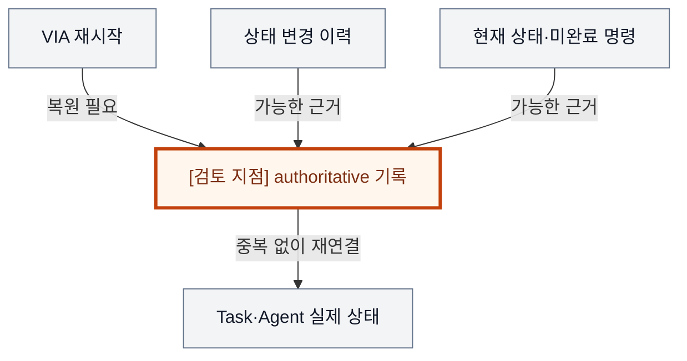
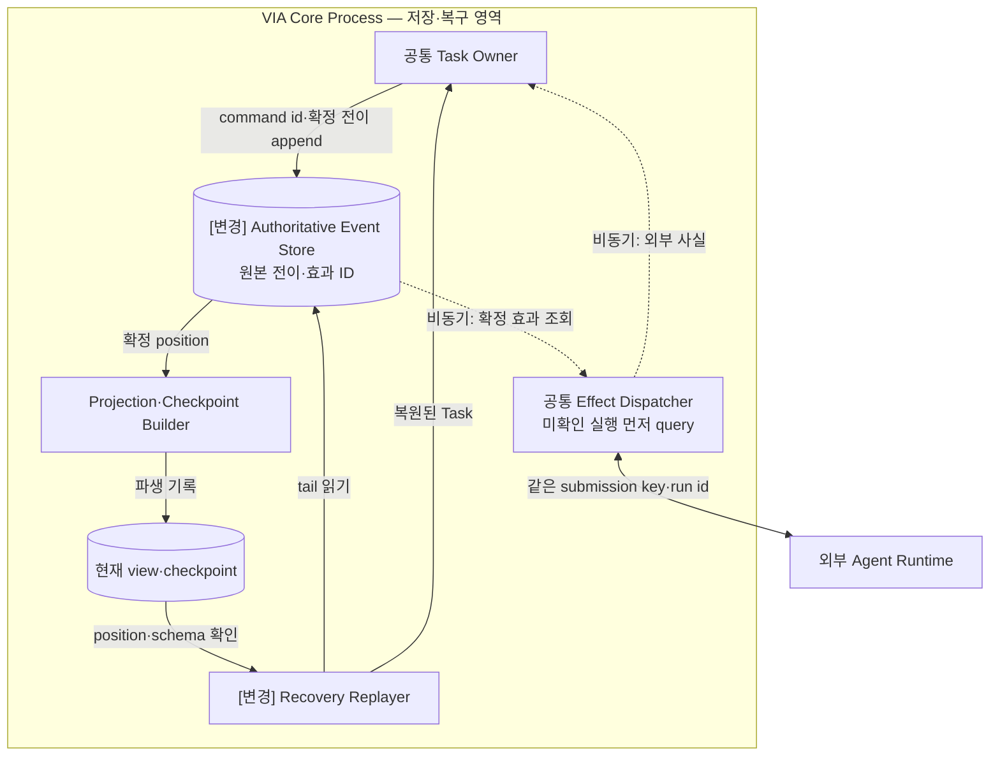
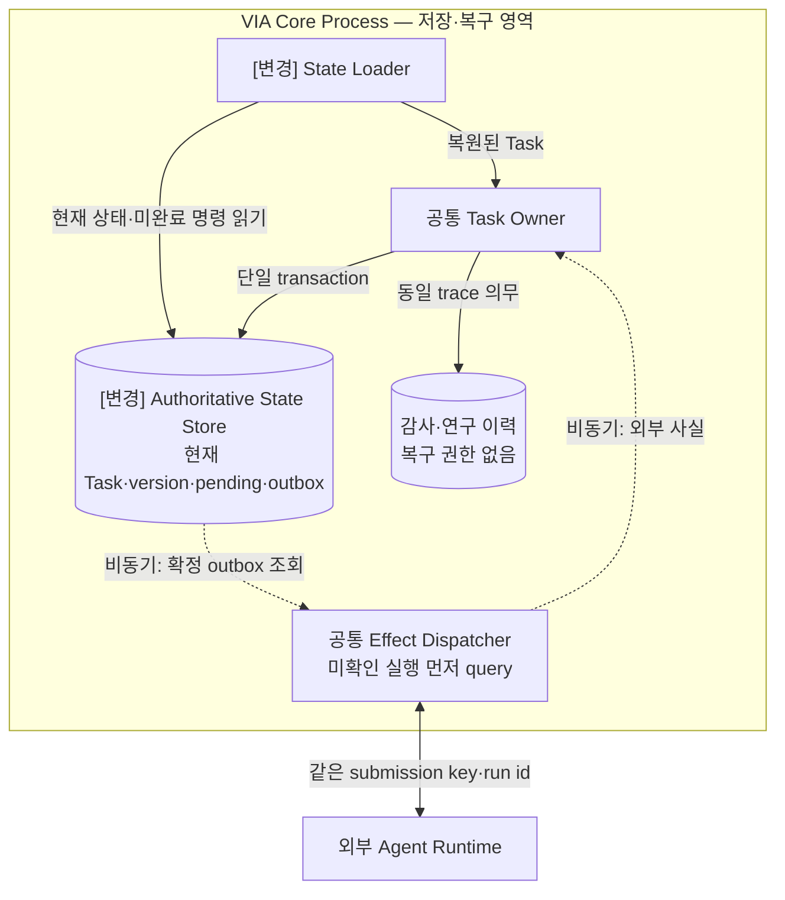
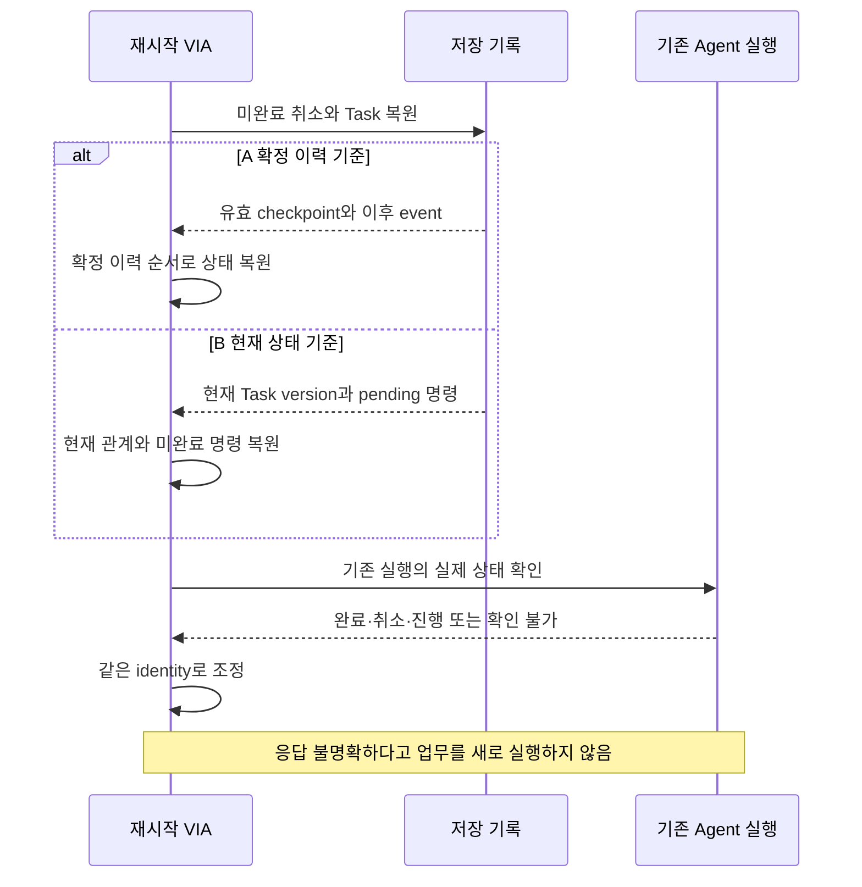

# VIA-DP-08 — 재시작 후 상태의 기준 기록

> **검토 초안 v2 · 2026-09-25 · 구현 구조 상세화 · 사용자 검토 전**
>
> 질문: 상태 변경 이력과 checkpoint를 복구의 진실로 삼을 것인가, 현재 상태와 미완료 동작 기록을 진실로 삼을 것인가?
>
> 현재 판단: **설계 후보로 유지 — 강한 양방향 QA trade-off 미입증** 대안 선택·구현·QA 측정은 하지 않았다. 실제 결과는 모두 `NOT_RUN`이다.

## 1. 배경 — 취소 요청 직후 재시작하면 무엇을 믿을까?

보고서를 만들던 VIA가 취소 명령을 전달하는 도중 종료된다. Agent는 계속 실행될 수도 있고 이미 완료했을 수도 있다. VIA는 다시 켜질 때 Task 목록만 복원하는 것이 아니라 어떤 명령을 확정했고 외부에서 무엇이 확인되었는지 알아야 한다. 현재 상태와 이벤트 이력은 함께 저장할 수 있으므로 ‘무엇을 저장하는가’보다 두 기록이 어긋났을 때 무엇이 기준인가가 핵심이다.

배경 그림의 주황색 검토 지점은 설계 질문이지 추가 Component가 아니다. VIA는 사용자 PC의 Voice·Text interaction과 업무 연결을 책임진다. Downstream Agent는 실제 업무 계획·Tool 실행을, Model Runtime은 추론 실행을 담당한다. 이 보고서는 그 내부 알고리즘이나 학습을 고르지 않는다.

## 2. 비교 범위와 공통 조건

**용어:** 기준 기록(authoritative record)은 다른 사본과 충돌할 때 최종적으로 따르는 기록이다. checkpoint는 확정 이력을 중간 상태로 요약한 복구 지점이고, tail은 그 이후의 이력이다. pending 명령은 처리 완료를 아직 확인하지 못한 명령, outbox는 외부 전달할 명령을 상태 변경과 연결해 보존하는 기록이다.

대상은 Conversation·Request·Task·미완료 명령을 복구하는 기준 기록이다. DB 제품·단일 writer·Process 배치·연구 로그의 저장 시점을 함께 선택하지 않는다. 저장장치 물리 파손·Agent 내부 checkpoint 복원은 현재 기본 장애 범위 밖이다.

**기준선에서 확인한 사실:** UC-18과 FA-14는 VIA 메모리를 잃어도 저장장치와 살아 있는 Agent 조회로 업무를 재연결하도록 요구한다. 조회 불가능한 외부 실행은 무조건 재실행하지 않는다. 요구의 출처는 [System Mission](../01-system-mission-and-boundary.md), [Fixed Scope](../03-fixed-architecture-scope.md), [Use Cases](../05-representative-use-cases.md)다.

**이번 비교의 설계 가정:** 동일 저장 보장·장비·retention·Agent 조회 및 멱등 capability·정책·trace 의무를 적용한다. 양쪽 모두 checkpoint·transactional outbox·backup·인덱스·부분 loading을 사용할 수 있다.

**미확인 사항:** 실제 state 크기·변경 이력 길이·checkpoint 빈도·복원 critical path·schema 이행 ledger. 그 값을 이번 문서에서 tuning하거나 임의 지연으로 채우지 않는다. 사실·후보 설계·미확인 가정을 서로 바꿔 쓰지 않는다. Conversation은 이어지는 대화, Request는 논리적 요청, Task는 여러 요청에 걸쳐 추적하는 업무다. Oracle은 실행 전에 정한 정답·허용 상태 조건이고, fixture는 고정 입력·외부 사건이다.

### 구현도를 읽기 위한 공통 전제

**S2S 모델 1개 + semantic LLM 1개**를 고정한다. Component·Task·단계별 별도 적재는 없고 프롬프트·세션·호출만 나눌 수 있다. 아래는 **구현 가능한 후보 설계 설명**이며 제품 구현 완료나 QA 실측이 아니다. 모델 동시 호출·취소 지원은 공통 dependency profile로 확인한다.

Core Process는 이 DP의 A/B 공통 비교용 배치다. Process 자체를 비교하는 VIA-DP-11 외에는 한쪽만 별도 Process를 추가하지 않는다. 외부 Agent Runtime은 VIA Client와 별개이며 모델의 local/remote 배치도 별도 조건이다. 생략 영역은 양쪽에서 동일하다.

실선은 라벨의 호출·반환·읽기·쓰기, 점선은 비동기 event다. Queue/buffer는 별도 노드, 영속 기록은 원통으로 그린다. 메모리 queue 수락은 durable commit이 아니고 별도 message bus 제품도 가정하지 않는다. 메시지는 request/Task/call identity와 관련 revision·generation으로 연결한다. 늦은 결과는 최종 owner가 검사한다. queue 용량·포화 정책은 측정 전 동결하며 무한 queue를 가정하지 않는다.

## 3. 대안 A — 상태 변경 이력 + 검증된 checkpoint

확정된 상태 전이 이력이 권위 있는 원본이다. 현재 view와 checkpoint는 이력의 특정 위치에서 만든 파생 상태이며, 유효한 checkpoint 이후 tail을 재생해 복원한다. 모든 이력을 매번 처음부터 재생하는 약한 안이 아니라 빠른 현재 view와 이력 복구를 함께 쓰는 hybrid다.

외부 효과는 이력에 확정한 명령 ID와 연결하고, 이미 처리된 event의 중복을 거부한다. 과거 schema를 읽는 책임과 checkpoint·이력 version 관계가 남는다. 이력에 없는 실제 외부 완료 사실을 만들어낼 수는 없다.

**실제 호출·상태·실패 처리 순서**

1. Task Owner가 전이·effect identity를 Event Store에 확정한다. view·checkpoint는 이력 position이 있는 파생 자료다. Dispatcher는 확정 효과만 transaction 밖에서 전달한다.
2. 재시작하면 checkpoint를 검증하고 이후 tail을 재생한다. view가 다르면 기준은 이력이다. replay는 이미 수행한 외부 Action을 다시 실행한다는 뜻이 아니다.
3. 미확인 실행은 같은 run/submission key로 조회한다. 외부 조회·중복 억제 미지원이면 확인 불가로 남긴다. 이력에 실제 관측하지 않은 Agent 완료를 만들어 넣지 않는다.

현재 view가 있어도 진실의 기준은 전이 이력이다. Checkpoint의 이력 위치·schema가 맞지 않으면 그대로 신뢰하지 않는다.

## 4. 대안 B — 현재 상태 + 미완료 동작 + 감사 이력

현재 authoritative state와 version, 아직 확인되지 않은 명령·outbox/inbox가 복구 기준이다. 감사·연구 이력과 backup을 함께 남길 수 있으나 그 이력으로 현재 상태를 임의 재작성하지 않는다. 현재 기록에서 복구한 뒤 외부 Agent 사실을 조회해 맞춘다.

이력·provenance를 생략하는 안이 아니므로 정확성과 observability를 희생하지 않는다. 현재 schema를 직접 읽는 장점이 있지만, 과거 전이의 의미를 재실행하는 기능은 별도 설계이며 감사 이력과 운영 상태의 관계를 검사해야 한다.

**실제 호출·상태·실패 처리 순서**

1. 현재 state·revision·dedup·outbox를 함께 commit한다. 감사 이력도 남기지만 복구 원본은 아니다. 감사 기록의 시점은 VIA-DP-12를 A/B 동일하게 고정한다.
2. Loader는 현재 기록과 pending 명령을 읽고 schema 이행·무결성을 검사한다. 이후 공통 Dispatcher로 실제 외부 상태를 확인한다.
3. 감사 이력과 state가 다르면 로그로 조용히 덮지 않고 승인된 state migration·불일치 규칙을 따른다. 양쪽 모두 영속 기록이 필요하며 메모리 queue만으로 복구를 보장하지 않는다.

감사 이력이 있다는 이유로 A가 되지 않는다. 복구의 최종 기준은 현재 상태와 확정된 미완료 동작이다.

두 구조도는 같은 확대 영역이다. 같은 이름은 공통 책임, `[변경]`은 바뀐 책임이다. 경계의 Process 표시는 공통 비교용 배치이며 실선은 라벨의 기능 흐름, 점선은 비동기 전달이다. 상자 수는 변경 요소 수나 메모리 크기가 아니다.

## 5. 구조 차이·상호 배타성·Hybrid 검토

| 차이 | A | B |
| --- | --- | --- |
| 복구 기준 | 확정 이력 위치 + 유효 checkpoint + tail | 현재 state·version·미완료 명령 |
| 현재 view 불일치 | 이력 기준으로 재구성 | authoritative 현재 기록·이행 상태를 확인 |
| 이행 책임 | event schema·reader·checkpoint 호환 | state schema·migration·pending 명령 호환 |
| 공통 | 감사 이력·멱등·외부 확인·durable 명령 | 동일 |

같은 복구 충돌을 이력에서 현재 상태를 다시 만들어 해소하면 A, 현재 authoritative state를 기준으로 해소하고 감사 이력은 증거로 쓰면 B다. 둘을 모두 최종 진실로 삼으면 충돌 해소 규칙이 빠진 것이므로 제3의 정상 대안이 아니다.

이력+checkpoint+현재 view를 A로, 현재 state+감사 로그+outbox를 B로 강화했다. 초기 discovery의 이벤트 이력안은 새 A에, 현재 상태안은 새 B에 대응한다. DB WAL은 저장 엔진의 durability 수단이지 곧바로 domain event가 기준인 A라는 뜻이 아니다.

A/B 모두 같은 기능·권한·실패 의미와 합리적인 보완책을 허용하는 **steelman**이다. 같은 결정 범위의 최종 기준은 **mutually exclusive**해야 한다. 속도 차이를 만들기 위해 한쪽의 검증·기록·cache를 빼지 않는다.

### 같은 사건에서 확인하는 순서 차이

다음 그림은 A/B의 차이가 드러나는 동일 사건을 비교한다. 외부 완료와 VIA 내부 확정을 구별하며, 아래 사고실험에서 지연·실패 조건까지 확인한다.

## 6. 같은 사건을 통과시키는 사고실험

### T1. 취소 전달의 중간 지점에서 crash

같은 Task cancel을 확정하고 Agent에 보내는 중 VIA가 종료된다. A는 명령이 포함된 확정 전이와 전달 상태를, B는 현재 Task·명령·outbox를 복원한다. Agent가 같은 명령 ID의 사실을 알려주면 원래 Task에 연결하고, 확인되지 않으면 pending/unknown을 정직하게 유지한다.

두 안 모두 불확실한 Action을 무조건 재전송하면 안 된다. 이력 저장이 외부 exactly-once 실행을 보장하지 않고 현재 상태 저장도 명령 이력을 잃어도 된다는 뜻이 아니다. QA-13/14와 필수 중복 방지 gate는 모두 통과할 수 있으며 구조만으로 오류율을 만들 수 없다.

### T2. 빠른 복구의 역전 조건

A의 복구는 checkpoint 읽기·검증 + 실제 tail 재생 + 외부 reconciliation, B는 현재 상태 읽기·검증 + 미완료 동작 재구성 + 같은 외부 reconciliation이다. 공통 외부 대기가 지배하면 두 안의 차이는 작다. A의 tail이 크면 B가 유리할 수 있고, B의 현재 상태 전체 loading이 크면 A의 부분 checkpoint 복원이 유리할 수도 있다.

A의 checkpoint를 금지하거나 B의 인덱스를 금지하지 않는다. 저장장치 손상을 새 fault로 넣어 A의 이력 복구만 유리하게 만들지도 않는다. 어떤 fault의 p95가 좋아져도 다른 fault가 QA-31 최댓값을 지배하면 대표값은 그대로다. Replay buffer와 current cache의 동시 peak를 비교해야 하며 디스크 저장량을 QA-41 메모리로 바꾸지 않는다.

### T3. 연구 재현과 schema 변경

A의 domain event 이력만으로는 acoustic endpoint·model config·fixture·실제 응답 trace가 완성되지 않는다. B도 같은 execution evidence와 evaluator를 보존할 수 있다. 따라서 QA-61/62는 A의 자동 우세가 아니다. 과거 Task transition을 replay하는 것과 평가 숫자를 재계산하는 것은 다른 기능이다.

C-06에서 A는 event reader/upcaster·checkpoint schema·projection, B는 state migration·pending 명령 reader·감사 schema를 확인한다. 변경 요소 수는 이런 역할을 실제로 독립 소유하는지 ledger로 판정하며 이름 개수로 세지 않는다. M-01~09·C-01~05·A-01~09도 같은 전체 pack에 포함하되 해당 경계에서 의미가 바뀌는 항목만 추적한다. E-01~05는 공통 instrumentation·evidence 책임이며 DP-12의 기록 의무를 양쪽에 동일하게 적용한다. 보존·삭제·보호정보 최소화도 이력 방식의 예외가 아니다.

## 7. 전체 19개 QA 비교

**사고실험 예상 / 실제 측정 `NOT_RUN`.** §2의 조건과 위 사고실험을 적용한다. 시간·변경 수·중단 수·메모리·노출은 작을수록, 정확성·연속성·완전성·재현 비율은 클수록 좋다. “비슷”은 명시한 조건에서 차이가 작다는 예상이며, “판단 근거 부족”은 방향·크기를 모른다는 뜻이다. 확실성은 실측 신뢰구간이 아니다. **부분 사례의 차이를 최악 case p95·전체 corpus·전체 change pack의 대표값 차이로 확대하지 않는다.**

| QA · 단일 metric | 예상 방향·크기 | 확실성 | 구조적 이유·반례와 근거 | 역할 |
| --- | --- | --- | --- | --- |
| QA-01 위임 경로 VIA 처리시간 · 최악 case p95; Agent 실행 제외 | 조건부; 방향 미정 | 낮음 | 실제 durable 쓰기·현재 view 갱신의 critical path 차이 [T1](#t1) | 보조 비교 |
| QA-02 직접 Voice 응답시간 · 최악 case p95 | 비슷; 기록 참여 시 조건부 | 중간 | 직접 응답도 같은 기록 의무를 지킴 [T3](#t3) | 회귀 |
| QA-03 Agent 상태 Voice 전달시간 · 최악 case p95 | 조건부; 방향 미정 | 낮음 | source 이후 상태 반영·게시 경로의 실제 쓰기 비용 [T1](#t1) | 보조 비교 |
| QA-04 음성 중단시간 · 최악 case p95 | 비슷 | 중간 | 음성 stop에 domain replay를 기다릴 이유 없음 [T1](#t1) | 회귀 |
| QA-05 Task 제어 응답시간 · 최악 control case p95 | 조건부; 방향 미정 | 낮음 | 두 안 모두 명령·사실 기록 필요; 현재 상태 읽기는 A도 가능 [T1](#t1) | 보조 비교 |
| QA-11 전체 요청 처리 정확도 · case별 strict 성공률의 평균 | 비슷 예상 | 중간 | 동일한 durable 명령과 외부 사실 확인으로 정확성 보존 가능 [T1](#t1) | 필수 회귀 |
| QA-12 의미 해석 정확도 · strict 성공 run 비율 | 비슷 | 중간 | 사용자 의미 판단은 저장 방식과 독립 [T1](#t1) | 회귀 |
| QA-13 Task·Interaction 연결 정확도 · strict 성공 run 비율 | 비슷 | 중간 | 명령·Task identity를 양쪽 모두 복원 [T1](#t1) | 필수 회귀 |
| QA-14 비동기 Task 상태 수렴 · strict 성공 run 비율 | 비슷 | 중간 | 이력의 존재보다 version·reconciliation 규칙이 중요 [T1](#t1) | 필수 회귀 |
| QA-15 대화·Task 연속성 · 성공 scenario 비율 | 비슷 | 중간 | 정상 채널 전환은 두 안 모두 기록에서 연결 [T3](#t3) | 회귀 |
| QA-21 Agent 변화 영향 범위 · 9개 변화의 변경 요소 평균 | 비슷 예상 | 중간 | 공통 Agent 경계의 전체 change pack 유지 [T3](#t3) | 회귀 |
| QA-22 Model·Context·State 변화 영향 · 15개 변화의 변경 요소 평균 | 조건부; 방향·크기 미정 | 낮음 | C-06 reader·migration ledger로 확인해야 함 [T3](#t3) | 보조 비교 |
| QA-23 실험·로그 변화 영향 · 5개 변화의 변경 요소 평균 | 비슷 예상 | 중간 | 연구 evidence contract를 양쪽에 동일하게 제공 가능 [T3](#t3) | 회귀 |
| QA-31 올바른 Task 복구시간 · 최악 fault p95 | 조건에 따라 다름 | 중간 | checkpoint tail 대 current loading, 공통 외부 대기의 비중 [T2](#t2) | 보조 비교 |
| QA-32 불필요한 장애 영향 범위 · 초과 중단 단위 최대 수 | 비슷 | 중간 | 기준 기록 선택이 별도 Process 격리는 아님 [T2](#t2) | 회귀 |
| QA-41 PC 메모리 · 최악 workload의 peak p95 | 조건부; 방향 미정 | 낮음 | replay buffer·current cache의 실제 peak 수명 필요 [T2](#t2) | 자원 확인·ASR 우선 제외 |
| QA-51 불필요한 보호정보 노출 · 초과 노출 단위 수 | 비슷 | 중간 | 이력 보존도 동일한 최소 정보·삭제 정책 적용 [T3](#t3) | 필수 회귀 |
| QA-61 실행 trace 완전성 · 완전한 trace run 비율 | 비슷 | 중간 | domain event만으로 execution trace는 완성되지 않음 [T3](#t3) | 필수 회귀 |
| QA-62 평가 재현성 · 동일 평가 재계산 비율 | 비슷 | 중간 | 두 안 모두 frozen execution evidence로 같은 평가 재계산 가능 [T3](#t3) | 필수 회귀 |

A는 전이 이력을 운영 상태의 기준으로 삼으려는 요구에서, B는 현재 상태와 명령 복원 계약을 중심으로 운영하려는 요구에서 합리적이다. 현행 QA만으로 한쪽의 명확한 장점과 반대쪽의 이점을 동시에 입증하지 못했다.

## 8. 공정한 검증 계획 — 실행하지 않음

동일 commit·전달 중단 지점과 저장 보장을 적용하고 checkpoint·현재 state의 크기·읽기 범위를 명시한다. C-06 설계 ledger와 전체 source event trace를 비교한다. 실제 성능 차이가 남을 때만 보조 결정을 핵심 비교로 다시 올린다.

측정에 앞서 동일한 목표·fixture·외부 기능·자원 조건, case별 실제 참여 경로, 실패·timeout 처리, 반복·집계·target·동점 기준을 동결한다. 최종 점수나 승리 개수는 지금 만들지 않는다. QA-11과 QA-12~15의 성공을 중복 합산하지 않는다. 잘못된 대상·중복 Action, 무효 승인, 무단 접근은 점수로 상쇄할 수 없는 필수 위반 조건이다.

근거 계약: [Voice responsiveness](../08-quality-attributes/voice-responsiveness.md), [Task 제어](../08-quality-attributes/interaction-control-responsiveness.md), [실제 event 경계](../11-measurement/event-boundary-contract.md), [정확성·연속성](../08-quality-attributes/correctness-and-continuity.md), [복구·장애·메모리](../08-quality-attributes/reliability-and-resource.md), [19개 QA catalog](../08-quality-attributes/quality-model.md), [변경 전체 집합](../07-intentional-variables.md), [변경 요소와 실험 change pack](../08-quality-attributes/evidence/change-locality-rationale.md), [관측·재현](../08-quality-attributes/observability.md), [Privacy·집계](../11-measurement/scoring-contract.md). 문서 사고실험은 실행 evidence label이나 기존 archive 결과로 대신하지 않는다.

## 9. 다른 DP·변경 비용

DP-02 상태 소유 경계와 독립이다. DP-12의 실행 evidence durability는 양쪽 상태 방식에 적용할 수 있다. DP-11 Process 복구도 같은 기준 기록을 사용한다. A→B는 특정 이력 위치의 authoritative state 전환, B→A는 기준 snapshot·명령 상태와 시작 event 경계를 명시해야 한다. 기존 history를 새 event가 있었던 것처럼 재작성하지 않는다.

## 10. 현재 판단과 재검토 조건

**설계 후보로 유지하고 핵심 A/B 평가에서는 우선 제외한다.** 재시작 구조로 중요하지만 ‘이력은 정확·관측 우세, 현재 state는 빠름’이라는 초기 trade-off는 steelman 뒤 성립하지 않는다. 저장·이행 계약을 선택해야 한다는 사실과 강한 QA 점수 비교 대상이라는 사실을 구분한다.

## 11. 자체 검토에서 반영한 개선점

A의 snapshot과 B의 감사 로그를 모두 허용했다. 로그와 현재 state의 공존이 아니라 충돌 시 복구 기준으로 배타성을 정했다. QA-62를 domain state replay나 모델 재실행과 혼동하지 않았다.

검토 범위는 문서·사고실험이다. 외부 심사나 후보 성능 검증을 완료했다는 뜻이 아니다. 렌더링·정합성 검사와 전체 후보의 최종 분류는 [전체 검토 종합](./dp-review-synthesis.md)에 기록한다.
