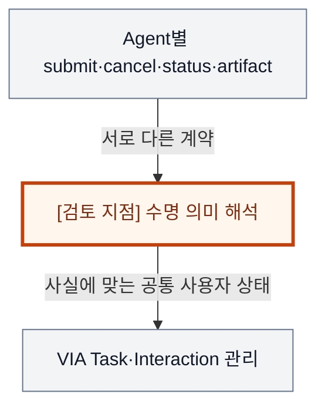
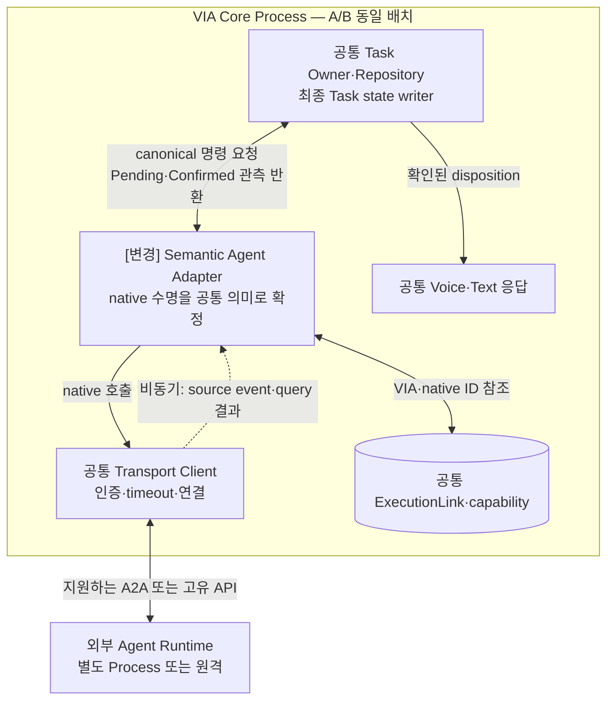
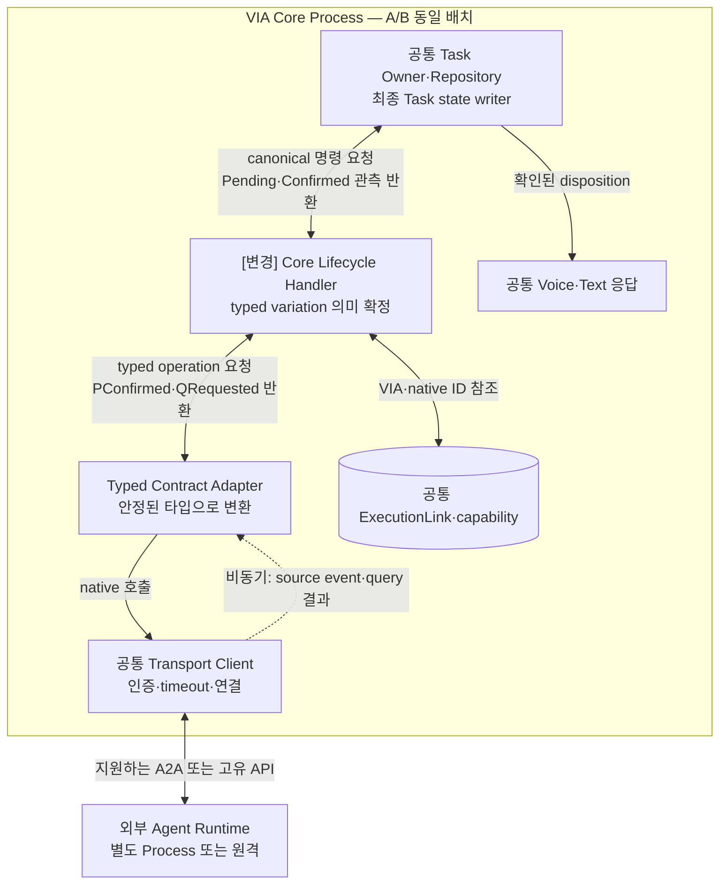

# VIA-DP-09 — Agent 수명 계약의 의미 해석 위치

> **검토 초안 v2 · 2026-09-25 · 구현 구조 상세화 · 사용자 검토 전**
>
> 질문: 공통 수명 의미와 확장 정보를 연동 경계에서 확정할 것인가, Core의 유형별 handler가 확정할 것인가?
>
> 현재 판단: **설계 후보로 유지 — 변경 국소화는 유효하나 반대 방향 QA 이점 미입증** 대안 선택·구현·QA 측정은 하지 않았다. 실제 결과는 모두 `NOT_RUN`이다.

## 1. 배경 — ‘취소됨’과 ‘취소 요청을 받음’은 어디서 구별할까?

한 Agent는 cancel 호출 뒤 즉시 접수 ID만 주고, 다른 Agent는 종료 상태를 조회해야 하며, 어떤 Agent는 취소를 지원하지 않는다. VIA는 이를 모두 같은 사용자 창구에서 사실대로 설명해야 한다. 차이를 숨겨 기능을 잃어도 안 되고, 제공자 SDK의 모든 세부사항이 Core 전체에 퍼져도 안 된다. 결정할 것은 변환 코드 유무가 아니라 실행 수명의 의미를 어디에서 해석·확정하는가다.

배경 그림의 주황색 검토 지점은 설계 질문이지 추가 Component가 아니다. VIA는 사용자 PC의 Voice·Text interaction과 업무 연결을 책임진다. Downstream Agent는 실제 업무 계획·Tool 실행을, Model Runtime은 추론 실행을 담당한다. 이 보고서는 그 내부 알고리즘이나 학습을 고르지 않는다.

## 2. 비교 범위와 공통 조건

**용어:** native event는 Agent가 원래 내보내는 사건이다. canonical 계약은 VIA가 공통으로 이해하는 업무 의미 계약이며, typed variation은 고유 차이를 명시적 유형으로 보존한 계약이다. handler는 그 의미를 해석하는 책임이다. opaque 확장은 Core가 의미를 모르는 부가 값으로, 필요한 의미를 숨기는 수단이 되어서는 안 된다.

대상은 Agent protocol을 받은 뒤 Task owner가 사용할 실행 수명 의미를 만드는 책임이다. Task state의 최종 writer는 양쪽 모두 VIA에 남는다. Native payload를 그대로 전역에 흘리는 B나 capability를 잃는 A는 비교하지 않는다.

**기준선에서 확인한 사실:** UC-08·10·12·13·16·18은 Agent identity·후속 실행·지원 불가·취소 접수/완료·질문·artifact를 구별해야 한다. 요구의 출처는 [System Mission](../01-system-mission-and-boundary.md), [Fixed Scope](../03-fixed-architecture-scope.md), [Use Cases](../05-representative-use-cases.md)다.

**이번 비교의 설계 가정:** 같은 native fixture와 capability·source revision·Process 배치·Task authority·durability를 사용한다. 양쪽 모두 versioned 계약·conformance 검사·typed extension·공통 invariant를 제공한다.

**미확인 사항:** 현재 전체 A-01~09 change pack에 대한 동등한 요소 ledger, 새로운 수명 개념을 공통 계약으로 수용하는 비용, 변환 경로의 실제 latency. 사실·후보 설계·미확인 가정을 서로 바꿔 쓰지 않는다. Conversation은 이어지는 대화, Request는 논리적 요청, Task는 여러 요청에 걸쳐 추적하는 업무다. Oracle은 실행 전에 정한 정답·허용 상태 조건이고, fixture는 고정 입력·외부 사건이다.

### 구현도를 읽기 위한 공통 전제

**S2S 모델 1개 + semantic LLM 1개**를 고정한다. Component·Task·단계별 별도 적재는 없고 프롬프트·세션·호출만 나눌 수 있다. 아래는 **구현 가능한 후보 설계 설명**이며 제품 구현 완료나 QA 실측이 아니다. 모델 동시 호출·취소 지원은 공통 dependency profile로 확인한다.

Core Process는 이 DP의 A/B 공통 비교용 배치다. Process 자체를 비교하는 VIA-DP-11 외에는 한쪽만 별도 Process를 추가하지 않는다. 외부 Agent Runtime은 VIA Client와 별개이며 모델의 local/remote 배치도 별도 조건이다. 생략 영역은 양쪽에서 동일하다.

실선은 라벨의 호출·반환·읽기·쓰기, 점선은 비동기 event다. Queue/buffer는 별도 노드, 영속 기록은 원통으로 그린다. 메모리 queue 수락은 durable commit이 아니고 별도 message bus 제품도 가정하지 않는다. 메시지는 request/Task/call identity와 관련 revision·generation으로 연결한다. 늦은 결과는 최종 owner가 검사한다. queue 용량·포화 정책은 측정 전 동결하며 무한 queue를 가정하지 않는다.

## 3. 대안 A — 공통 의미 정규화 + 손실 없는 확장

연동 경계의 의미 adapter가 provider별 수명을 공통 operation·observation으로 바꾼다. unsupported·pending·source-confirmed·artifact 조회 참조를 명시하며, 필요한 확장 정보와 native provenance를 함께 보존한다. Core는 이 공통 의미를 소비한다.

최선의 A는 최소 공통분모로 기능을 깎지 않는다. 새 개념이 공통 계약으로 표현되지 않으면 version을 확장하고 소비자를 함께 검토한다. Adapter가 Task state를 직접 쓰거나 source revision을 만들어내지는 않는다. 강점은 provider 차이의 경계 집중이며 약점은 의미 adapter의 계약 유지 책임이다.

**실제 호출·상태·실패 처리 순서**

1. Task Owner의 cancel을 Adapter가 외부 호출로 변환한다. Client는 인증·연결·timeout을 처리한다. event가 있으면 수신하고 필요한 경우 지원되는 query로 확인한다.
2. 예시 P의 종료 확인은 CancelConfirmed, Q의 취소 접수는 CancelPending으로 Adapter가 해석한다. P/Q는 설명용 fixture이며 특정 제품의 API 지원 주장이 아니다. 필요한 확장·원천 근거를 보존한다.
3. Task를 쓰는 것은 Owner다. 늦은 completion도 사실대로 반영한다. 별도 message bus·추가 LLM 없이 결정적 변환 코드로 구현할 수 있다.

공통 형식은 기능을 지우는 형식이 아니다. 사실·미지원·확장 의미를 보존해야 같은 기능 비교가 된다.

## 4. 대안 B — 공통 전송·타입 계약 + Core 유형별 의미 확정

연동 경계는 인증·전송·wire 형식을 변환하고 provider-neutral typed variation을 전달한다. Core의 제한된 capability handler가 follow-up·cancel·status mode를 해석한다. 다른 Core 모듈에는 provider SDK를 노출하지 않는다.

공통 handler library와 공통 Task invariant를 허용한다. 새 capability 의미를 Core가 명시적으로 다루기 쉽다는 채택 이유가 있지만, 이것이 A에서는 표현 불가능하다는 뜻은 아니다. Typed contract와 그 소비 handler의 변경 책임이 남는다.

**실제 호출·상태·실패 처리 순서**

1. 같은 Client를 쓴다. Typed Adapter는 wire를 타입으로 바꾸지만 취소 완료 여부의 최종 의미는 Core Handler가 정한다.
2. 제한된 Handler가 PConfirmed/QRequested를 Task 의미로 바꾸어 Owner에 전달한다. provider SDK를 UI·대화·Task 모듈 전체에 노출하는 구조가 아니다.
3. 명령·재연결에도 같은 경계를 쓴다. 공통 library·extension·provenance는 양쪽에 허용한다. 위치 차이만으로 속도·정확도 우세를 만들지 않고 QA-21의 실제 변경 전파를 비교한다.

B의 차이는 Core 전체에 native 데이터를 흩뿌리는 것이 아니라 제한된 handler가 수명 의미를 소유한다는 것이다.

두 구조도는 같은 확대 영역이다. 같은 이름은 공통 책임, `[변경]`은 바뀐 책임이다. 경계의 Process 표시는 공통 비교용 배치이며 실선은 라벨의 기능 흐름, 점선은 비동기 전달이다. 상자 수는 변경 요소 수나 메모리 크기가 아니다.

두 그림은 같은 Agent 사건을 수신해 Task 의미로 바꾸는 경로를 확대한다. 역방향의 실행·취소 명령 변환도 같은 의미 책임을 따르며, 아래 취소·완료 사고실험에서 함께 검토한다.

## 5. 구조 차이·상호 배타성·Hybrid 검토

| 차이 | A | B |
| --- | --- | --- |
| 수명 의미 확정 | integration semantic adapter | Core capability handler |
| Core 앞 계약 | canonical 의미 + 명시적 확장 | typed lifecycle variation |
| 변경 전파 | adapter 중심, 새 의미는 공통 계약 확장 가능 | 타입 계약·해석 handler 중심 |
| 공통 | capability 보존·Task authority·source 근거·지원 불가 표시 | 동일 |

동일 native event를 Task-level 의미로 확정하는 최종 책임이 경계 adapter에 있으면 A, Core handler에 있으면 B다. A의 opaque extension을 Core가 다시 해석해야만 정답 Task 의미가 되면 그 부분은 B다. 이름이나 디렉터리 위치가 아니라 실제 의미 소비 계약으로 구분한다.

공통 의미+typed extension hybrid를 A에 포함했다. B도 transport 정규화·공통 invariant를 갖는다. 이렇게 강화한 뒤 B의 유일한 이점이 ‘분기문이 Core에 있다’뿐이라면 강한 core trade-off가 아니라고 판정한다. A에 extension을 금지해 B의 기능 우세를 만들지 않는다.

A/B 모두 같은 기능·권한·실패 의미와 합리적인 보완책을 허용하는 **steelman**이다. 같은 결정 범위의 최종 기준은 **mutually exclusive**해야 한다. 속도 차이를 만들기 위해 한쪽의 검증·기록·cache를 빼지 않는다.

## 6. 같은 사건을 통과시키는 사고실험

### T1. 취소 접수와 완료가 교차

같은 Agent가 cancel 접수 ID를 반환한 뒤 기존 실행 completion을 보낸다. A는 adapter에서 pending control과 source terminal 의미를 정리해 Task owner로 전달한다. B는 같은 typed 사실을 Core handler에서 해석한다. 양쪽 Task owner는 실제 완료 결과를 유지하고 ‘취소 완료’라고 꾸미지 않는다.

같은 검사와 같은 Process를 유지하면 의미 계산 위치를 옮겼다는 이유만으로 QA-05·13·14가 크게 달라지지 않는다. 추가 serialization이나 queue를 A에만 넣는 것은 이 DP가 아니라 별도 배치 변경이다. B가 사실을 더 잘 볼 수 있다는 초기 주장은 A에도 같은 source provenance를 허용하면 약해진다.

### T2. 새 capability와 9개 Agent 변화

A-01/02/03은 신규·교체·protocol, A-04/05는 status·실행 식별, A-06은 capability 재구성, A-07은 인증, A-08/09는 질문 응답·artifact 변화다. 기존 공통 의미로 표현되는 변경은 A adapter에 국소화될 수 있다. B도 stable typed contract와 공유 handler가 흡수하면 Core 전체가 바뀌지 않는다.

반대로 새 수명 개념이 필요한 변화는 A의 canonical contract·adapter·consumer를 바꿀 수 있고 B는 해당 variant·handler만 바꿀 수 있다. 어느 쪽 요소가 더 적은지는 전체 ledger와 책임 granularity로 판정한다. 초기 A의 변경 국소화 가설은 유효하지만 현재 9개 평균의 우세 크기를 과거 결과로 채우지 않는다. 기능 차이는 보존하는 두 안 사이에서 QA-11의 반대 방향 우세를 아직 도출하지 못했다.

### T3. 복구·모델 변화·근거 수집

재시작 시 양쪽 모두 VIA Task와 native 실행 ID·질문 ID·취소 ID의 mapping을 복원한다. Source가 없는 revision을 adapter든 handler든 만들어내서는 안 된다. Adapter 위치가 Process fault boundary를 바꾸는 것은 아니며, 동일 fault는 DP-11 조건에서 검토한다.

M-01~09·C-01~06은 공통 모델·Context·저장 경계가 중심이며 mapping schema를 실제로 소비하는 부분만 추가 전파를 기록한다. E-01~05는 native source와 canonical/typed 의미를 잇는 span·correlation·schema·export·assignment가 대상이다. 양쪽 모두 완전한 event provenance와 frozen evaluator를 가질 수 있어 QA-61/62 자동 우세는 없다. 최소 정보 제공도 양쪽에 동일하다.

## 7. 전체 19개 QA 비교

**사고실험 예상 / 실제 측정 `NOT_RUN`.** §2의 조건과 위 사고실험을 적용한다. 시간·변경 수·중단 수·메모리·노출은 작을수록, 정확성·연속성·완전성·재현 비율은 클수록 좋다. “비슷”은 명시한 조건에서 차이가 작다는 예상이며, “판단 근거 부족”은 방향·크기를 모른다는 뜻이다. 확실성은 실측 신뢰구간이 아니다. **부분 사례의 차이를 최악 case p95·전체 corpus·전체 change pack의 대표값 차이로 확대하지 않는다.**

| QA · 단일 metric | 예상 방향·크기 | 확실성 | 구조적 이유·반례와 근거 | 역할 |
| --- | --- | --- | --- | --- |
| QA-01 위임 경로 VIA 처리시간 · 최악 case p95; Agent 실행 제외 | 비슷 예상 | 중간 | 같은 검사를 다른 논리 위치에 둔 것만으로 hop 추가 안 됨 [T1](#t1) | 회귀 |
| QA-02 직접 Voice 응답시간 · 최악 case p95 | 비슷 | 높음 | Agent를 쓰지 않는 direct path는 실제 비참여 [T1](#t1) | 회귀·비참여 |
| QA-03 Agent 상태 Voice 전달시간 · 최악 case p95 | 비슷 예상 | 중간 | 동일 source event·변환 의미·배치 조건 [T1](#t1) | 회귀 |
| QA-04 음성 중단시간 · 최악 case p95 | 비슷 | 높음 | 음성 중단은 Agent 의미 변환과 분리 [T1](#t1) | 회귀·비참여 |
| QA-05 Task 제어 응답시간 · 최악 control case p95 | 비슷 예상 | 중간 | 두 안 모두 pending/confirmed를 정확히 표시 가능 [T1](#t1) | 필수 회귀 |
| QA-11 전체 요청 처리 정확도 · case별 strict 성공률의 평균 | 비슷 예상 | 중간 | A의 capability 손실과 B의 native 누출을 허용하지 않음 [T1](#t1) | 필수 회귀 |
| QA-12 의미 해석 정확도 · strict 성공 run 비율 | 비슷 | 중간 | 요청 의미·capability 요구는 공통 기능 [T2](#t2) | 회귀 |
| QA-13 Task·Interaction 연결 정확도 · strict 성공 run 비율 | 비슷 예상 | 중간 | 같은 identity·cardinality 검증 책임 유지 [T1](#t1) | 필수 회귀 |
| QA-14 비동기 Task 상태 수렴 · strict 성공 run 비율 | 비슷 예상 | 중간 | source revision·terminal·pending 의미 모두 보존 [T1](#t1) | 필수 회귀 |
| QA-15 대화·Task 연속성 · 성공 scenario 비율 | 비슷 | 중간 | VIA Task identity와 native 실행 identity 분리 공통 [T3](#t3) | 회귀 |
| QA-21 Agent 변화 영향 범위 · 9개 변화의 변경 요소 평균 | 조건부: A 우세 가능; 크기 미정 | 중간 | 공통 의미 안의 변화는 edge 국소화, 새 의미면 역전 가능 [T2](#t2) | 보조 비교 |
| QA-22 Model·Context·State 변화 영향 · 15개 변화의 변경 요소 평균 | 비슷 예상; ledger 확인 | 중간 | M·C 변경에 자동 Agent 경계 우세 없음 [T3](#t3) | 회귀·ledger |
| QA-23 실험·로그 변화 영향 · 5개 변화의 변경 요소 평균 | 판단 근거 부족 | 낮음 | 공통 계측 API와 실제 의미 변환 producer 수정 범위 [T3](#t3) | 회귀·ledger |
| QA-31 올바른 Task 복구시간 · 최악 fault p95 | 비슷 예상 | 중간 | 같은 native mapping·명령 복원·외부 조회 [T3](#t3) | 회귀 |
| QA-32 불필요한 장애 영향 범위 · 초과 중단 단위 최대 수 | 비슷 | 중간 | Core 대 edge 논리 위치만으로 Process 격리 이점 없음 [T3](#t3) | 회귀 |
| QA-41 PC 메모리 · 최악 workload의 peak p95 | 비슷 예상 | 낮음 | 같은 capability·mapping을 보존; 표현 크기 미측정 [T3](#t3) | 자원 확인·ASR 우선 제외 |
| QA-51 불필요한 보호정보 노출 · 초과 노출 단위 수 | 비슷 | 중간 | 같은 recipient·purpose별 최소 범위 [T3](#t3) | 필수 회귀 |
| QA-61 실행 trace 완전성 · 완전한 trace run 비율 | 비슷 | 중간 | A도 native provenance·확장 정보를 보존 [T3](#t3) | 필수 회귀 |
| QA-62 평가 재현성 · 동일 평가 재계산 비율 | 비슷 | 중간 | 동일 evidence와 evaluator를 보존 가능 [T3](#t3) | 필수 회귀 |

A의 변경 국소화와 B의 명시적 유형 해석은 모두 합리적이다. 그러나 동일 기능과 확장을 허용한 뒤 B의 별도 QA 우세는 뒷받침하지 못했다. 한쪽 지배 가능성을 숨기기 위해 정확성 점수를 만들지 않는다.

## 8. 공정한 검증 계획 — 실행하지 않음

A-01~09 각각의 native before/after와 canonical/typed 계약, 변경 요소 ID를 동일 깊이로 작성한다. Capability·취소·질문·artifact conformance를 양쪽에 적용하고, 새 의미가 경계만으로 흡수되는지 확인한다.

측정에 앞서 동일한 목표·fixture·외부 기능·자원 조건, case별 실제 참여 경로, 실패·timeout 처리, 반복·집계·target·동점 기준을 동결한다. 최종 점수나 승리 개수는 지금 만들지 않는다. QA-11과 QA-12~15의 성공을 중복 합산하지 않는다. 잘못된 대상·중복 Action, 무효 승인, 무단 접근은 점수로 상쇄할 수 없는 필수 위반 조건이다.

근거 계약: [Voice responsiveness](../08-quality-attributes/voice-responsiveness.md), [Task 제어](../08-quality-attributes/interaction-control-responsiveness.md), [실제 event 경계](../11-measurement/event-boundary-contract.md), [정확성·연속성](../08-quality-attributes/correctness-and-continuity.md), [복구·장애·메모리](../08-quality-attributes/reliability-and-resource.md), [19개 QA catalog](../08-quality-attributes/quality-model.md), [변경 전체 집합](../07-intentional-variables.md), [변경 요소와 실험 change pack](../08-quality-attributes/evidence/change-locality-rationale.md), [관측·재현](../08-quality-attributes/observability.md), [Privacy·집계](../11-measurement/scoring-contract.md). 문서 사고실험은 실행 evidence label이나 기존 archive 결과로 대신하지 않는다.

## 9. 다른 DP·변경 비용

[기존 AGENT ADR](../../adr/ADR-001-agent-integration-contract-boundary.md)은 A accepted이며 과거 change-ledger 근거와 현재 QA caveat를 가진다. 이 보고서는 이를 취소하거나 현재 실측으로 재승인하지 않는다. DP-07 node capability, DP-02 Task state, DP-11 배치는 독립이다. 전환 시 in-flight native ID와 의미 version을 보존하고 reader·control mapping을 함께 이행한다.

## 10. 현재 판단과 재검토 조건

**설계 후보로 유지한다.** QA-21의 자연스러운 인과는 있지만 충분한 반대 방향 QA trade-off가 현행 초안에서 입증되지 않았다. 새 수명 개념의 전체 ledger에서 실제 충돌이 드러나면 다시 핵심 후보로 올릴 수 있다. 기존 accepted ADR은 그대로다.

## 11. 자체 검토에서 반영한 개선점

‘공통 형식은 기능 손실, Core handler는 정확성 향상’이라는 불공정한 대비를 제거했다. 양쪽에 typed extension·공통 library·source provenance를 허용했다. 이전 generation의 수치를 현재 QA-21 결과로 재사용하지 않았다.

검토 범위는 문서·사고실험이다. 외부 심사나 후보 성능 검증을 완료했다는 뜻이 아니다. 렌더링·정합성 검사와 전체 후보의 최종 분류는 [전체 검토 종합](./dp-review-synthesis.md)에 기록한다.
