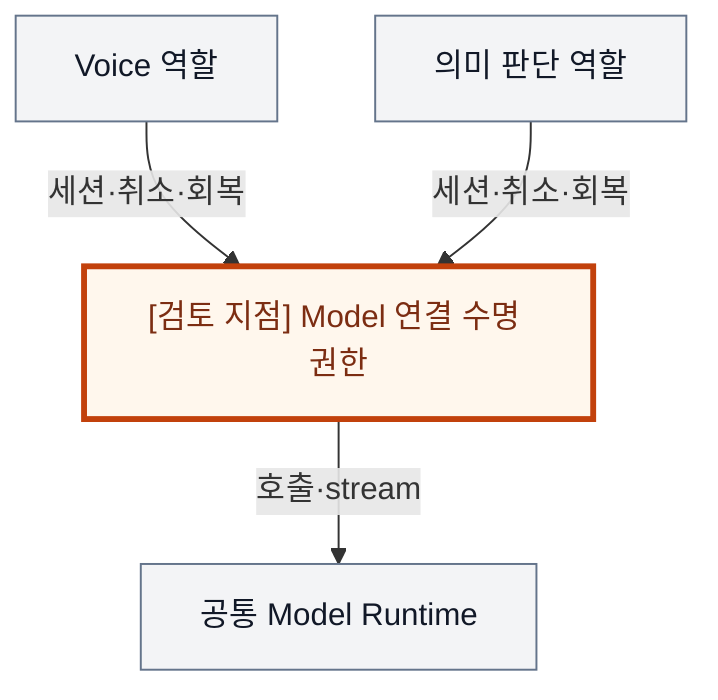
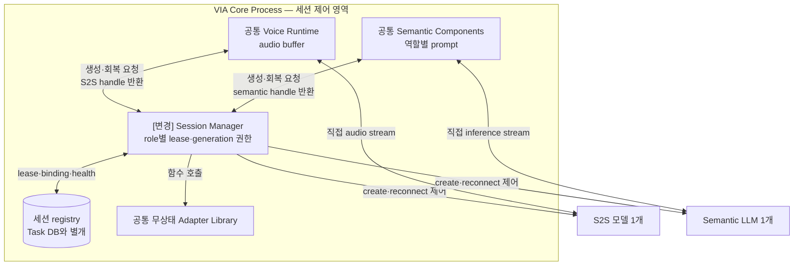
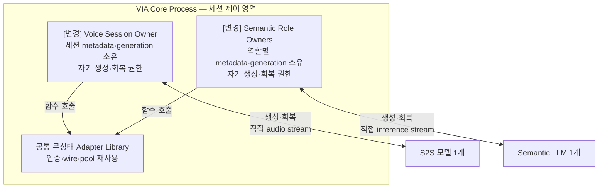
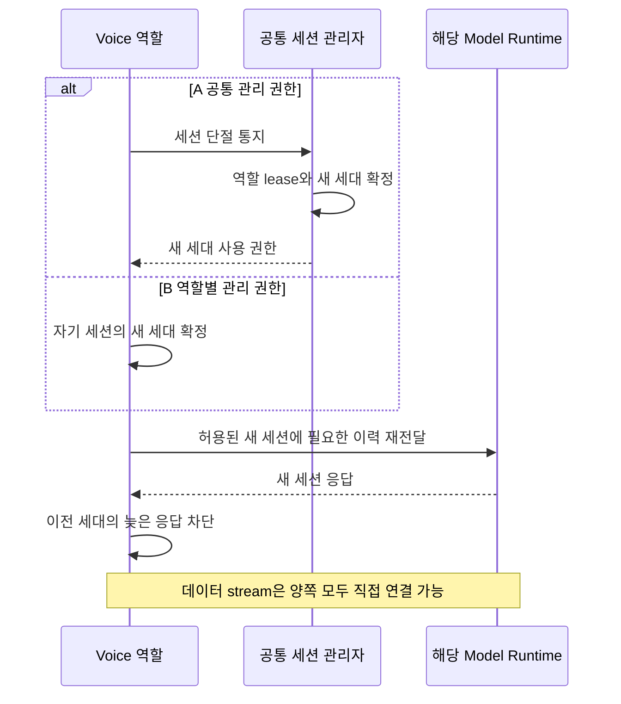

# VIA-DP-10 — Model 세션·연결 수명의 관리 권한

> **검토 초안 v2 · 2026-09-25 · 구현 구조 상세화 · 사용자 검토 전**
>
> 질문: 공통 관리자가 역할별 세션의 생성·회복을 소유할 것인가, 각 역할 Component가 자기 세션을 소유할 것인가?
>
> 현재 판단: **설계 후보로 유지 — Gateway·공유 모델·별도 Process의 결합을 해체** 대안 선택·구현·QA 측정은 하지 않았다. 실제 결과는 모두 `NOT_RUN`이다.

## 1. 배경 — 같은 모델을 쓰는 두 역할의 연결이 끊기면?

Voice는 S2S 모델 1개를, 요청 의미 판단 역할들은 semantic LLM 1개를 사용한다. 모델별 연결의 생성·회복 권한을 공통으로 관리할지 결정한다. Voice 연결만 끊겼을 때 의미 판단까지 다시 시작해야 할까? 제공자가 바뀔 때 각 역할이 연결·취소·복원 코드를 모두 고쳐야 할까? 공통 관리가 도움이 될 수 있지만, 모든 stream을 하나의 relay에 통과시키거나 모든 모델을 하나의 Process에 올리는 것까지 같은 결정은 아니다.

배경 그림의 주황색 검토 지점은 설계 질문이지 추가 Component가 아니다. VIA는 사용자 PC의 Voice·Text interaction과 업무 연결을 책임진다. Downstream Agent는 실제 업무 계획·Tool 실행을, Model Runtime은 추론 실행을 담당한다. 이 보고서는 그 내부 알고리즘이나 학습을 고르지 않는다.

## 2. 비교 범위와 공통 조건

**용어:** Model session은 제공자와의 연결·대화 수명을 뜻하며 VIA의 Conversation·Task identity와 다르다. control 경로는 생성·회복 권한을, data 경로는 실제 입력·출력 stream 전달을 뜻한다. lease는 역할별 사용 권한, generation/세대는 재연결 전후의 응답을 구별하는 번호다.

대상은 VIA가 사용하는 Model의 역할별 연결·세션·재연결·취소 계약 소유권이다. provider 제품, 모델 크기, local/remote 위치, 실시간 queue 자원 보장, Process 격리는 별도 조건이다. 물리 모델 가중치를 공유할 수 있는 것과 세션을 누가 관리하는지는 다르다.

**기준선에서 확인한 사실:** 01·03은 Model Runtime을 local/remote dependency로 두며 통합 책임은 VIA에 둔다. UC-11·15·18은 취소·연결 종료·재연결에도 대화와 업무 관계를 유지하도록 요구한다. 요구의 출처는 [System Mission](../01-system-mission-and-boundary.md), [Fixed Scope](../03-fixed-architecture-scope.md), [Use Cases](../05-representative-use-cases.md)다.

**이번 비교의 설계 가정:** 동일 모델 기능·Runtime·배치·모델 수 고정·총 자원 한도·native cancellation 기능을 제공한다. 양쪽에 공통 stateless adapter library·직접 data stream·역할별 queue를 허용한다. Model의 provider conversation ID는 VIA Conversation identity가 아니다.

**미확인 사항:** 세션 재사용 가능성과 동시 호출·취소의 native 계약, 공통 manager가 실제로 줄이는 변경 요소·resident 메모리, 연결 회복 비용. 사실·후보 설계·미확인 가정을 서로 바꿔 쓰지 않는다. Conversation은 이어지는 대화, Request는 논리적 요청, Task는 여러 요청에 걸쳐 추적하는 업무다. Oracle은 실행 전에 정한 정답·허용 상태 조건이고, fixture는 고정 입력·외부 사건이다.

### 구현도를 읽기 위한 공통 전제

**S2S 모델 1개 + semantic LLM 1개**를 고정한다. Component·Task·단계별 별도 적재는 없고 프롬프트·세션·호출만 나눌 수 있다. 아래는 **구현 가능한 후보 설계 설명**이며 제품 구현 완료나 QA 실측이 아니다. 모델 동시 호출·취소 지원은 공통 dependency profile로 확인한다.

Core Process는 이 DP의 A/B 공통 비교용 배치다. Process 자체를 비교하는 VIA-DP-11 외에는 한쪽만 별도 Process를 추가하지 않는다. 외부 Agent Runtime은 VIA Client와 별개이며 모델의 local/remote 배치도 별도 조건이다. 생략 영역은 양쪽에서 동일하다.

실선은 라벨의 호출·반환·읽기·쓰기, 점선은 비동기 event다. Queue/buffer는 별도 노드, 영속 기록은 원통으로 그린다. 메모리 queue 수락은 durable commit이 아니고 별도 message bus 제품도 가정하지 않는다. 메시지는 request/Task/call identity와 관련 revision·generation으로 연결한다. 늦은 결과는 최종 owner가 검사한다. queue 용량·포화 정책은 측정 전 동결하며 무한 queue를 가정하지 않는다.

## 3. 대안 A — 공통 세션 관리자 + 역할별 직접 stream

공통 manager가 역할별 세션의 생성·lease·health·회복 규칙과 provider binding을 소유한다. 실제 큰 audio/token stream은 역할과 Runtime 사이를 직접 흐르게 할 수 있고, queue와 장애 처리는 역할별로 나눌 수 있다. 관리 통합과 빠른 data path를 결합한 hybrid다.

장점은 실행 연결 정책과 변경을 한 계약에서 관리하는 것이다. 약점은 공통 manager와 역할 lease의 수명·version 책임이다. Manager 장애 때 기존 session이 언제까지 유효한지 명시하고, 무관한 역할을 이유 없이 중단시키지 않는다.

**실제 호출·상태·실패 처리 순서**

1. Voice와 의미 Component가 Manager에 세션을 요청한다. Manager는 공통 adapter library로 해당 모델에 연결하고 role별 generation·lease를 등록한다. registry는 모델 인스턴스를 늘리는 장치가 아니다.
2. handle을 받아 Voice는 S2S 1개에, 의미 역할은 semantic LLM 1개에 직접 stream을 연결한다. 모든 audio/token이 Manager를 통과할 필요는 없다. Library는 코드 재사용이지 별도 서비스가 아니다.
3. Voice 단절이면 해당 lease만 fence하고 재연결한다. 무관한 semantic 세션까지 초기화하지 않는다. 늦은 응답은 generation으로 거부하고 VIA Conversation·Task identity는 유지한다.

관리자는 모든 token·audio의 강제 relay가 아니다. 공통 authority가 있어도 fast data path를 둘 수 있다.

## 4. 대안 B — 역할별 세션 소유 + 공통 adapter library

Voice와 의미 처리 Component가 자기 세션의 생성·취소·회복을 결정한다. Provider wire·인증·stream parsing은 공통 library를 재사용하고, 같은 Runtime의 가중치·연결 pooling 기능을 동등하게 이용할 수 있다. 공통 live session authority는 두지 않는다.

역할에 맞춘 수명 처리가 독립적인 장점이 있지만, 역할 간 조율·version 호환이 필요하면 계약을 직접 관리해야 한다. 코드 복사·모델 인스턴스 중복을 강제하지 않으므로 B의 비용을 부풀리지 않는다.

**실제 호출·상태·실패 처리 순서**

1. 각 역할이 자기 세션 생성·취소·재연결을 결정한다. 같은 library를 쓰지만 모든 새 generation을 승인하는 공통 실행 중 Manager는 없다.
2. Voice는 동일 S2S, 모든 의미 역할은 동일 LLM에 연결한다. provider가 복수 세션을 지원하지 않으면 그 제한을 양쪽에 동일 적용한다. 세션 소유권 분리는 모델 복제나 무제한 병렬 추론이 아니다.
3. 단절된 owner가 generation을 증가시키고 필요한 이력을 다시 보낸다. VIA identity는 바꾸지 않는다. 모델 용량·admission 조건은 A와 동일하다.

공통 library의 존재는 공통 실행 중 authority와 다르다. 같은 Runtime을 사용하는 것도 B와 양립한다.

두 구조도는 같은 확대 영역이다. 같은 이름은 공통 책임, `[변경]`은 바뀐 책임이다. 경계의 Process 표시는 공통 비교용 배치이며 실선은 라벨의 기능 흐름, 점선은 비동기 전달이다. 상자 수는 변경 요소 수나 메모리 크기가 아니다.

## 5. 구조 차이·상호 배타성·Hybrid 검토

| 차이 | A | B |
| --- | --- | --- |
| 세션 생성·회복의 최종 권한 | 공통 manager | 역할별 owner |
| 공통 관리 상태 | role lease·binding·health | 없음; 역할별 상태와 공유 library |
| 데이터 경로 | 직접 stream 허용 | 직접 stream 허용 |
| 공통 | provider 기능·모델 공유·역할별 queue·Task identity | 동일 |

동일 역할 세션의 새 generation을 공통 manager가 최종 승인하면 A, 역할 owner가 독립 확정하면 B다. B에 모든 role 세션의 최종 생성·회복을 맡는 살아 있는 조정자를 두면 A다. Provider 자체의 내부 pooling은 두 안의 외부 공통 기능이다.

공통 control manager와 직접 stream의 hybrid를 A로 재구성했다. ‘Gateway면 항상 추가 audio hop’과 ‘역할별이면 가중치 복제’는 폐기했다. 자원 예약은 DP-13, Process 격리는 DP-11로 분리한다. 공통 함수 library만 추가하는 선택은 독립 Architecture DP로 세지 않는다.

A/B 모두 같은 기능·권한·실패 의미와 합리적인 보완책을 허용하는 **steelman**이다. 같은 결정 범위의 최종 기준은 **mutually exclusive**해야 한다. 속도 차이를 만들기 위해 한쪽의 검증·기록·cache를 빼지 않는다.

### 같은 사건에서 확인하는 순서 차이

다음 그림은 A/B의 차이가 드러나는 동일 사건을 비교한다. 외부 완료와 VIA 내부 확정을 구별하며, 아래 사고실험에서 지연·실패 조건까지 확인한다.

## 6. 같은 사건을 통과시키는 사고실험

### T1. 정상 호출과 음성 중단

같은 고정 구성의 S2S 세션에서 Voice를, semantic LLM 세션에서 의미 판단을 수행한다. A는 사전 lease가 있으면 직접 stream을 사용하고, B는 역할 owner가 같은 Runtime에 직접 연결한다. 준비된 steady-state에서 A에 강제 relay 비용을 넣을 수 없다. Cold 연결 시 A의 manager 계약과 B의 역할 초기화 비용이 다를 수 있으나 native pooling·cache를 양쪽에 허용한다.

사용자 끼어들기 때 두 안 모두 local playback을 먼저 멈추고 해당 모델 generation을 취소한다. 모델의 취소 확인이 늦어도 음성 정지를 늦출 이유가 없다. 따라서 QA-04의 A/B 자동 우세는 없고 QA-01/02/03/05 역시 실제 setup critical path를 확인해야 한다.

### T2. Voice 세션 단절과 역할별 회복

Voice 연결만 끊기고 의미 세션은 살아 있는 사건을 준다. A는 role lease를 fence하고 Voice만 다시 연결할 수 있다. B는 Voice owner가 같은 처리를 한다. A가 모든 역할을 함께 재시작하도록 강제하면 약한 비교다. 반대로 A의 manager 자체가 소실되면 새 session 생성이 제한될 수 있으며 기존 lease의 허용 범위를 확인해야 한다.

QA-32의 필요 의존 집합은 같은 사용자 기능 의미로 고정한다. 공통 manager를 쓰는 모든 기능이 임의로 필수 영향이라고 선언되어 점수가 사라지지 않도록, fault의 원인을 native Voice 연결과 manager 전체 상실로 구분한다. 논리 권한 분리만으로 fatal Process containment를 주장하지 않는다. QA-31은 영향을 받은 Task의 상태·control 복구까지이며 단순 Model 연결 성공 시간이 아니다.

### T3. 전체 Model change pack과 자원·로그

M-01/02는 provider별 adapter, M-03은 역할별 profile·입력 한도, M-04~06은 binding·local Runtime 수명, M-07/08은 stream 의미, M-09는 provider conversation 재구성이다. A에서 공통 관리가 흡수할 수 있지만 B의 공유 library도 같은 변경을 흡수할 수 있다. 반대로 역할 특수 계약은 A의 공통 API까지 확장할 수 있어 항상 A가 적은 요소를 바꾸는 것은 아니다. C-01~06·A-01~09는 실제 Context·Task·Agent 소비자에 닿는 변경만 추가하고 전체 평균을 유지한다.

양쪽이 같은 가중치와 native pool을 공유할 수 있으므로 A의 메모리 우세를 단정하지 않는다. 차이는 manager 상태·lease·buffer 대 역할별 세션 metadata이며 실제 peak가 필요하다. E-01~05는 source clock·session generation·role correlation·schema·export·assignment의 공통 API 변경과 소비자 변경을 구별한다. Trace·privacy 검사 library는 B에도 제공할 수 있다.

## 7. 전체 19개 QA 비교

**사고실험 예상 / 실제 측정 `NOT_RUN`.** §2의 조건과 위 사고실험을 적용한다. 시간·변경 수·중단 수·메모리·노출은 작을수록, 정확성·연속성·완전성·재현 비율은 클수록 좋다. “비슷”은 명시한 조건에서 차이가 작다는 예상이며, “판단 근거 부족”은 방향·크기를 모른다는 뜻이다. 확실성은 실측 신뢰구간이 아니다. **부분 사례의 차이를 최악 case p95·전체 corpus·전체 change pack의 대표값 차이로 확대하지 않는다.**

| QA · 단일 metric | 예상 방향·크기 | 확실성 | 구조적 이유·반례와 근거 | 역할 |
| --- | --- | --- | --- | --- |
| QA-01 위임 경로 VIA 처리시간 · 최악 case p95; Agent 실행 제외 | 비슷; setup에서는 조건부 | 중간 | A도 직접 data path 가능; manager의 실제 초기화 비용 확인 [T1](#t1) | 보조 비교 |
| QA-02 직접 Voice 응답시간 · 최악 case p95 | 비슷; setup에서는 조건부 | 중간 | Gateway를 강제 audio relay로 만들지 않음 [T1](#t1) | 보조 비교 |
| QA-03 Agent 상태 Voice 전달시간 · 최악 case p95 | 비슷 예상 | 중간 | 준비된 동일 음성 세션과 output 경로 [T1](#t1) | 회귀 |
| QA-04 음성 중단시간 · 최악 case p95 | 비슷 | 중간 | local playback stop은 model manager 응답과 분리 [T1](#t1) | 필수 회귀 |
| QA-05 Task 제어 응답시간 · 최악 control case p95 | 비슷; 연결 복원 시 조건부 | 중간 | semantic·control session이 실제 참여하는 비용만 포함 [T2](#t2) | 회귀 |
| QA-11 전체 요청 처리 정확도 · case별 strict 성공률의 평균 | 비슷 예상 | 중간 | 같은 Model 기능·의미 결과와 유효 세대 검사 [T2](#t2) | 필수 회귀 |
| QA-12 의미 해석 정확도 · strict 성공 run 비율 | 비슷 | 중간 | Model 제품·능력을 함께 바꾸지 않음 [T1](#t1) | 회귀 |
| QA-13 Task·Interaction 연결 정확도 · strict 성공 run 비율 | 비슷 | 중간 | role session과 VIA Request·Task 연결은 양쪽 필수 [T2](#t2) | 회귀 |
| QA-14 비동기 Task 상태 수렴 · strict 성공 run 비율 | 비슷 | 중간 | Task state convergence authority 공통 [T2](#t2) | 회귀 |
| QA-15 대화·Task 연속성 · 성공 scenario 비율 | 비슷 예상 | 중간 | provider session을 VIA Conversation으로 대체하지 않음 [T2](#t2) | 필수 회귀 |
| QA-21 Agent 변화 영향 범위 · 9개 변화의 변경 요소 평균 | 비슷 | 중간 | Agent 생태계 변화는 공통 integration 경계 [T3](#t3) | 회귀 |
| QA-22 Model·Context·State 변화 영향 · 15개 변화의 변경 요소 평균 | 조건부; 방향·크기 미정 | 낮음 | 공통 manager와 공유 library의 실제 15개 변경 ledger 비교 [T3](#t3) | 보조 비교 |
| QA-23 실험·로그 변화 영향 · 5개 변화의 변경 요소 평균 | 판단 근거 부족 | 낮음 | 공통 계측과 role producer 수정의 범위 미정 [T3](#t3) | 회귀·ledger |
| QA-31 올바른 Task 복구시간 · 최악 fault p95 | 조건부; 방향 미정 | 낮음 | Task 영향·lease 복원·외부 reconciliation까지 확인 [T2](#t2) | 보조 비교 |
| QA-32 불필요한 장애 영향 범위 · 초과 중단 단위 최대 수 | 비슷 예상; fault별 확인 | 중간 | A도 role별 recovery 가능; 공통 manager fault는 별도 원인 [T2](#t2) | 필수 회귀 |
| QA-41 PC 메모리 · 최악 workload의 peak p95 | 판단 근거 부족 | 낮음 | 양쪽 weight 공유 가능, manager와 role metadata의 실제 peak 필요 [T3](#t3) | 자원 확인·ASR 우선 제외 |
| QA-51 불필요한 보호정보 노출 · 초과 노출 단위 수 | 비슷 | 중간 | 공통 privacy 검사와 최소 Context는 B에도 허용 [T3](#t3) | 필수 회귀 |
| QA-61 실행 trace 완전성 · 완전한 trace run 비율 | 비슷 | 중간 | 공통 source·role·generation trace를 두 안 모두 보존 [T3](#t3) | 필수 회귀 |
| QA-62 평가 재현성 · 동일 평가 재계산 비율 | 비슷 | 중간 | 평가 evidence 보존과 role 수명 authority는 별개 [T3](#t3) | 필수 회귀 |

A는 관리 정책의 일관성과 공통 binding 책임을, B는 역할별 수명 자율성을 선택할 이유가 있다. 현재 정의에서는 공유 library와 직접 stream을 허용한 뒤 명확한 반대 방향 QA 효과를 입증하지 못했다.

## 8. 공정한 검증 계획 — 실행하지 않음

Role별 session·stream·cancel·health의 실제 native 기능과 manager 부재 시 동작을 명세한다. M-01~09·C-01~06 ledger, cold/warm path, 모델 가중치 공유 여부와 전체 PC 메모리를 동일 기준으로 확인할 계획이다.

측정에 앞서 동일한 목표·fixture·외부 기능·자원 조건, case별 실제 참여 경로, 실패·timeout 처리, 반복·집계·target·동점 기준을 동결한다. 최종 점수나 승리 개수는 지금 만들지 않는다. QA-11과 QA-12~15의 성공을 중복 합산하지 않는다. 잘못된 대상·중복 Action, 무효 승인, 무단 접근은 점수로 상쇄할 수 없는 필수 위반 조건이다.

근거 계약: [Voice responsiveness](../08-quality-attributes/voice-responsiveness.md), [Task 제어](../08-quality-attributes/interaction-control-responsiveness.md), [실제 event 경계](../11-measurement/event-boundary-contract.md), [정확성·연속성](../08-quality-attributes/correctness-and-continuity.md), [복구·장애·메모리](../08-quality-attributes/reliability-and-resource.md), [19개 QA catalog](../08-quality-attributes/quality-model.md), [변경 전체 집합](../07-intentional-variables.md), [변경 요소와 실험 change pack](../08-quality-attributes/evidence/change-locality-rationale.md), [관측·재현](../08-quality-attributes/observability.md), [Privacy·집계](../11-measurement/scoring-contract.md). 문서 사고실험은 실행 evidence label이나 기존 archive 결과로 대신하지 않는다.

## 9. 다른 DP·변경 비용

DP-03 음성 입력 계약과 DP-06 의미 판단은 이 수명 관리를 사용한다. DP-11 Process 경계, DP-13 자원 예약을 공통 manager 선택에 묶지 않는다. A→B는 활성 lease·generation·취소 ownership 인계, B→A는 역할 상태의 등록·중복 생성 방지·reader 호환이 필요하다.

## 10. 현재 판단과 재검토 조건

**설계 후보로 유지한다.** 구조 질문은 유효하지만 Gateway·별도 Process·모델 공유·scheduling을 묶어서 만든 초기 trade-off는 인정하지 않는다. 실제 role 변경 ledger나 cold path가 충분한 반대 방향 QA 효과를 보이면 다시 핵심 후보로 검토한다.

## 11. 자체 검토에서 반영한 개선점

A의 공통 control과 직접 data path를 함께 허용했다. B에도 공통 adapter와 Model Runtime 공유를 허용했다. QA-04의 물리 음성 정지와 원격 inference 취소를 구별하고, Process 격리·자원 예약은 다른 DP로 분리했다.

검토 범위는 문서·사고실험이다. 외부 심사나 후보 성능 검증을 완료했다는 뜻이 아니다. 렌더링·정합성 검사와 전체 후보의 최종 분류는 [전체 검토 종합](./dp-review-synthesis.md)에 기록한다.
