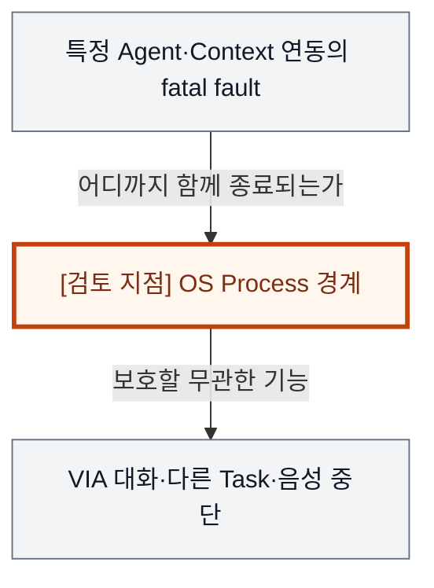
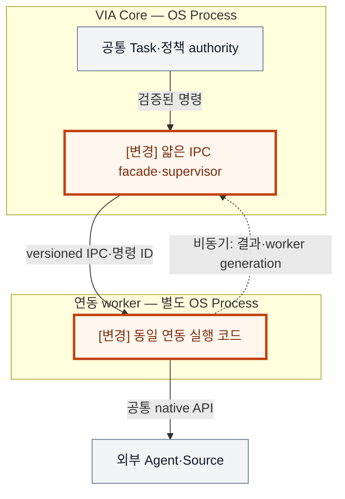
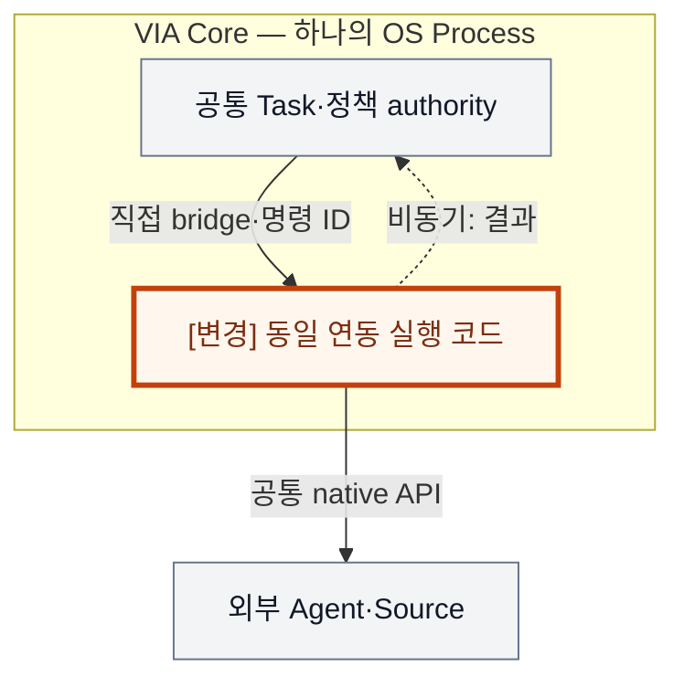
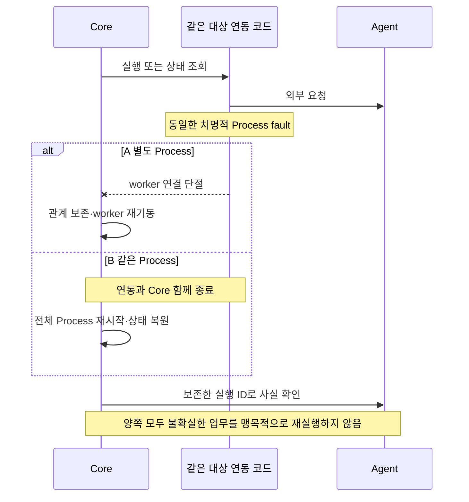

# VIA-DP-11 — 외부 연동 코드의 Process 장애 경계

> **검토 초안 v1 · 2026-09-24 · 사용자 검토 전**
>
> 질문: 치명적 실패 가능성이 있는 연동 실행을 별도 Process에 가둘 것인가, Core와 같은 Process에서 논리적으로 격리할 것인가?
>
> 현재 판단: **우선 핵심 검증 후보 — 장애 전파 대 IPC·자원 비용의 직접적인 구조 인과** 대안 선택·구현·QA 측정은 하지 않았다. 실제 결과는 모두 `NOT_RUN`이다.

## 1. 배경 — 한 Agent 연동이 죽어도 VIA와 다른 업무는 살아 있어야 할까?

메일 Agent의 응답을 처리하던 연동 코드가 치명적으로 종료된다. 다른 보고서 Task와 사용자의 일반 음성 대화는 그 Agent에 의존하지 않는다. 단순 timeout과 예외 처리는 정상 오류를 다룰 수 있지만, Process 자체가 종료되면 같은 주소 공간의 Core도 함께 사라진다. 이를 별도 경계에 가두면 외부 실행과 다시 연결하는 비용·불확실성이 추가된다.

배경 그림의 주황색 검토 지점은 설계 질문이지 추가 Component가 아니다. VIA는 사용자 PC의 Voice·Text interaction과 업무 연결을 책임진다. Downstream Agent는 실제 업무 계획·Tool 실행을, Model Runtime은 추론 실행을 담당한다. 이 보고서는 그 내부 알고리즘이나 학습을 고르지 않는다.

## 2. 비교 범위와 공통 조건

**용어:** Process는 주소 공간과 종료 수명을 가진 OS 실행 단위다. IPC는 Process 사이의 통신이며, facade는 Core에 남는 얇은 연결 계층이다. fatal fault는 같은 Process를 종료시키는 장애로 일반 예외와 구별한다. in-flight는 외부 요청을 보냈지만 결과를 아직 확정하지 못한 상태다.

대상 연동 코드·dependency 집합을 결과 전에 같은 의미로 고정한다. 정상 예외·timeout과 Process abort·native fatal failure를 구분한다. Core 로직, canonical state, 정책 authority는 양쪽 모두 Core에 유지한다.

**기준선에서 확인한 사실:** UC-14는 한 업무 문제로 무관한 대화가 중단되지 않도록 요구하고, UC-18·QA-31/32는 올바른 재연결과 불필요한 영향 범위를 구분한다. 요구의 출처는 [System Mission](../01-system-mission-and-boundary.md), [Fixed Scope](../03-fixed-architecture-scope.md), [Use Cases](../05-representative-use-cases.md)다.

**이번 비교의 설계 가정:** 같은 연동 기능·외부 API·총 자원 한도·queue 제한·timeout·저장 보장·명령 identity·source fault를 적용한다. A에만 코드를 더 안전하게 만들거나 B에만 blocking API를 강제하지 않는다. 실제 Native SDK의 존재·취약성을 확정 사실로 주장하지 않는다.

**미확인 사항:** target Windows IPC·serialization 비용, worker 시작·재연결 비용, 외부 실행의 idempotency/조회 capability, fault별 user-visible unit과 최악 대표값. 사실·후보 설계·미확인 가정을 서로 바꿔 쓰지 않는다. Conversation은 이어지는 대화, Request는 논리적 요청, Task는 여러 요청에 걸쳐 추적하는 업무다. Oracle은 실행 전에 정한 정답·허용 상태 조건이고, fixture는 고정 입력·외부 사건이다.

## 3. 대안 A — 위험 연동 격리 + 얇은 Core 연결부

외부 연동 실행 코드를 supervised worker Process에 두고 Core에는 검증·연결용 얇은 facade와 상태 authority를 남긴다. 모든 VIA를 무조건 여러 Process로 쪼개지 않는 hybrid다. 공유 메모리·batch·작은 제어 message·warm worker를 허용한다.

Worker generation·in-flight 명령·source identity를 관리하고, worker가 죽으면 새 generation을 만들고 외부 실행 사실을 확인한다. 장점은 대상 연동의 fatal failure가 Core의 메모리·음성 제어를 직접 파괴하지 않는다는 것이다. 약점은 IPC 계약·추가 Runtime·끊긴 전달의 불확실성이다.

이 그림의 두 경계는 실제 OS Process다. Worker를 나눴다는 이유로 외부 Action이 exactly-once가 되지는 않는다.

## 4. 대안 B — 같은 Process + 제한된 queue·실패 처리

동일 연동 코드를 Core와 같은 OS Process에서 실행한다. 별도 task·thread, bounded queue, timeout·cancellation, 안전한 메모리 접근과 잡을 수 있는 예외 처리로 논리적으로 격리한다. Core 잠금을 잡고 외부 API를 기다리지 않는다.

같은 주소 공간의 직접 호출·buffer 공유로 IPC와 별도 worker 수명을 피하는 강한 안이다. 정상 예외를 모두 Core crash로 만드는 비교는 하지 않는다. 다만 Process abort나 잡을 수 없는 fatal failure가 실제로 발생하면 논리 queue가 Core를 살려주지는 못한다.

Thread·mailbox 격리는 정상 정지·예외를 제한할 수 있지만 주소 공간이 같은 fatal 종료 경계는 유지된다.

두 구조도는 같은 확대 영역을 그린다. 회색은 공통 책임, 주황색과 `[변경]` 표기는 바뀌는 책임이다. 실선은 이름을 붙인 기능 흐름, 점선은 명시된 비동기 전달이다. **별도 Process라고 적힌 경우 외에는 논리 경계**다. 상자 수는 변경 요소 수나 메모리 크기가 아니다.

## 5. 구조 차이·상호 배타성·Hybrid 검토

| 차이 | A | B |
| --- | --- | --- |
| 대상 연동 fatal 종료 | worker 경계 | Core와 같은 Process |
| 전달 계약 | IPC·worker generation·재연결 | 같은 Process bridge·task 수명 |
| 자원 | worker·IPC buffer·supervisor | 직접 호출·공유 buffer |
| 공통 | Core 상태·정책·Agent 실제 사실·멱등 명령 | 동일 |

같은 대상 코드의 주소 공간이 Core와 분리되면 A, 같으면 B다. A의 Core facade는 외부 연동 실행 책임 자체를 다시 갖지 않는다. 위험 코드만 격리하는 hybrid를 A에 포함했으므로 비교 중 대상 집합을 유리하게 바꾸지 않는다.

같은 Process 안의 sandbox도 제3안으로 검토했다. 동일 기능·외부 API를 지원하고 fatal fault를 정말 trap할 수 있다면 강한 B의 실현 방식 또는 새 runtime 대안으로 재검토한다. 그러나 native API를 사용할 수 없거나 fault 종류를 바꾸면 동등 기능 증명이 먼저다. 현재 sandbox 지원을 가정하지도 배제하지도 않으며, 그 조건이 확인되면 A의 containment 우세를 다시 연다. 초기 discovery/EXEC의 격리 B는 이 보고서의 hybrid A에 대응한다.

A/B 모두 같은 기능·권한·실패 의미와 합리적인 보완책을 허용하는 **steelman**이다. 같은 결정 범위의 최종 기준은 **mutually exclusive**해야 한다. 속도 차이를 만들기 위해 한쪽의 검증·기록·cache를 빼지 않는다.

### 같은 사건에서 확인하는 순서 차이

다음 그림은 A/B의 차이가 드러나는 동일 사건을 비교한다. 외부 완료와 VIA 내부 확정을 구별하며, 아래 사고실험에서 지연·실패 조건까지 확인한다.

## 6. 같은 사건을 통과시키는 사고실험

### T1. 정상 handoff·status·Context 전달 비용

같은 payload가 Core에서 연동 실행을 거쳐 실제 Agent ingress에 도달한다. A의 추가 비용은 실제 serialization·IPC·queue·validation·copy의 비중첩 부분이며 B도 bridge·queue·validation 비용이 있다. A의 shared memory·batch는 비용을 줄일 수 있지만 version·수명 검사가 공짜는 아니다.

B는 정상 small-message·warm-worker 조건에서 조금 유리할 가능성이 있다. 큰 payload는 copy 경로에 따라 방향·크기가 달라지고, Model inference가 지배하면 대표 p95 차이가 작다. QA-03은 Agent status source 이후 IPC도 포함하며, QA-01에서 worker queue를 Agent 내부 시간으로 빼면 안 된다. Agent 없는 S2S 경로의 QA-02에는 이 경계를 억지로 넣지 않는다.

### T2. 같은 연동의 fatal fault와 정상 오류

메일 연동 실행에서 잡을 수 없는 Process 종료 사건을 주입한다. A는 worker만 종료되어 Core·다른 Task·공통 playback 제어가 살아 있을 수 있다. B는 같은 Process가 종료되어 그 연동을 필요로 하지 않던 기능까지 중단될 수 있다. 이 차이가 QA-32의 직접적인 구조 원인이다. 필요 의존 집합을 ‘같은 Process의 모든 기능’으로 정의해 B의 전파를 필수로 바꾸면 안 된다.

반대로 정상 timeout·잡을 수 있는 예외에서는 B도 해당 연동만 실패 처리할 수 있어 A가 크게 우세하다고 할 수 없다. Core 자체의 fatal fault·PC 전체 종료에는 A도 보호되지 않는다. 어느 fault가 전체 QA-32 최댓값을 지배하는지 같은 fault pack으로 확인한다. Process 분리만으로 OS 자원 고갈·공유 lock·shared-memory 손상까지 격리된다고 주장하지 않는다.

### T3. 불확실한 in-flight 실행과 올바른 복구

명령을 worker에 전달한 직후 worker가 죽어 Agent가 받았는지 알 수 없게 한다. A는 durable 명령 ID·worker generation을 복원하고 Agent가 실제로 제공하는 idempotency·query로 확인한다. B도 전체 Process crash 뒤 같은 확인이 필요하다. 확인 불가한 Action은 재전송하여 중복 실행하면 안 된다.

A의 복구 경로는 worker 시작·handshake·미완료 명령 reconciliation, B는 Core·대화·모든 영향 Task 복원과 연동 재연결이다. A에서 Core와 독립 Task가 살아남는 fault는 복구 부담이 작을 수 있다. 하지만 worker가 느리게 시작하거나 공통 Agent 조회가 지배하면 QA-31 차이는 작다. 다른 whole-Core fault가 최악 p95라면 worker fault 개선이 대표값을 바꾸지 않을 수 있다.

### T4. 배치 변경·PC 자원·trace

A의 worker runtime·supervisor·IPC buffer를 모두 QA-41에 포함한다. B의 같은 Process thread stack·queue도 포함한다. 원격 Agent 내부 memory를 이동하여 VIA PC 절약처럼 말하지 않는다. 동등 구현에서 A의 추가 resident runtime은 B에 유리한 원인이지만 peak와 모델 지배 여부 없이는 크기를 정하지 않는다.

A-01~09·M-01~09·C-01~06에서 의미 경계는 고정한다. 특히 새 protocol·인증·artifact 또는 Model local/remote 변경이 IPC frame·배치에 실제로 닿는지 ledger로 확인한다. E-01~05는 Process generation·clock correlation·worker spool·schema·export·assignment를 포함한다. A가 Process별 source를 알기 쉽다는 이유로 trace가 자동 완전한 것은 아니다. Worker crash 직전 volatile 로그는 잃을 수 있으므로 DP-12 기록 의무를 두 안에 같게 둔다.

## 7. 전체 19개 QA 비교

**사고실험 예상 / 실제 측정 `NOT_RUN`.** §2의 조건과 위 사고실험을 적용한다. 시간·변경 수·중단 수·메모리·노출은 작을수록, 정확성·연속성·완전성·재현 비율은 클수록 좋다. “비슷”은 명시한 조건에서 차이가 작다는 예상이며, “판단 근거 부족”은 방향·크기를 모른다는 뜻이다. 확실성은 실측 신뢰구간이 아니다. **부분 사례의 차이를 최악 case p95·전체 corpus·전체 change pack의 대표값 차이로 확대하지 않는다.**

| QA · 단일 metric | 예상 방향·크기 | 확실성 | 구조적 이유·반례와 근거 | 역할 |
| --- | --- | --- | --- | --- |
| QA-01 위임 경로 VIA 처리시간 · 최악 case p95; Agent 실행 제외 | 조건부: B 조금 우세 예상 | 중간 | 추가 IPC의 실제 비중첩 경로; Model 지배·shared memory면 축소 [T1](#t1) | 주 비교 후보 |
| QA-02 직접 Voice 응답시간 · 최악 case p95 | 비참여 경로는 비슷; 연동 사용 시 B 가능 | 중간 | Context 경로가 실제 worker를 통과하는 경우만 [T1](#t1) | 주 비교 후보·회귀 |
| QA-03 Agent 상태 Voice 전달시간 · 최악 case p95 | 조건부: B 조금 우세 예상 | 중간 | source status 이후 IPC·변환 비용 포함 [T1](#t1) | 주 비교 후보 |
| QA-04 음성 중단시간 · 최악 case p95 | 정상은 비슷; fatal fault 지속성은 A 가능 | 중간 | playback은 Core 공통; crash로 기능 소실은 별도 실패 포함 [T2](#t2) | 회귀·fault 검증 |
| QA-05 Task 제어 응답시간 · 최악 control case p95 | 조건부: B 조금 우세 예상 | 중간 | 실제 control IPC 비용; 확인 의미는 동일 [T1](#t1) | 주 비교 후보 |
| QA-11 전체 요청 처리 정확도 · case별 strict 성공률의 평균 | 비슷 예상; fault 완료 조건 필요 | 중간 | IPC가 기능 실패를 정당화하지 않음 [T3](#t3) | 필수 검증 |
| QA-12 의미 해석 정확도 · strict 성공 run 비율 | 비슷 | 중간 | Model 의미 능력·Context 입력은 같은 조건 [T1](#t1) | 회귀 |
| QA-13 Task·Interaction 연결 정확도 · strict 성공 run 비율 | 비슷 예상 | 중간 | generation·명령 ID·binding은 양쪽 필수 [T3](#t3) | 필수 검증 |
| QA-14 비동기 Task 상태 수렴 · strict 성공 run 비율 | 비슷 예상 | 중간 | Task state authority·revision 규칙 공통 [T3](#t3) | 필수 검증 |
| QA-15 대화·Task 연속성 · 성공 scenario 비율 | 비슷 | 중간 | 정상 채널 전환은 Process 격리와 독립 [T3](#t3) | 회귀 |
| QA-21 Agent 변화 영향 범위 · 9개 변화의 변경 요소 평균 | 조건부; 방향 미정 | 낮음 | 새 계약의 IPC 영향은 전체 A 변경 ledger로 확인 [T4](#t4) | 주 비교 가능성 |
| QA-22 Model·Context·State 변화 영향 · 15개 변화의 변경 요소 평균 | 조건부; 방향 미정 | 낮음 | 공통 의미 변경과 deployment/frame 변경을 구분 [T4](#t4) | 주 비교 가능성 |
| QA-23 실험·로그 변화 영향 · 5개 변화의 변경 요소 평균 | 조건부: B 유리 가능; 크기 미정 | 낮음 | Process 경계 계측·reader 추가 수정이 실제 필요한 경우 [T4](#t4) | 주 비교 가능성 |
| QA-31 올바른 Task 복구시간 · 최악 fault p95 | 조건부: A 우세 가능 | 중간 | integration fatal의 복원 범위 감소, 최악 fault 집계는 별도 [T3](#t3) | 주 비교 후보 |
| QA-32 불필요한 장애 영향 범위 · 초과 중단 단위 최대 수 | 조건부: A 크게 우세 가능한 fault 존재 | 높음 | 동일 integration fatal이 무관한 Core 기능을 함께 종료시키는가 [T2](#t2) | 주 비교 후보 |
| QA-41 PC 메모리 · 최악 workload의 peak p95 | 조건부: B 우세 가능 | 중간 | worker·IPC의 추가 resident 자원, peak 크기는 미정 [T4](#t4) | 주 비교 후보 |
| QA-51 불필요한 보호정보 노출 · 초과 노출 단위 수 | 비슷 | 중간 | Process 분리는 초과 정보 제공 정책의 대체물이 아님 [T4](#t4) | 필수 회귀 |
| QA-61 실행 trace 완전성 · 완전한 trace run 비율 | 비슷 예상; crash 보존 확인 | 중간 | worker 로그 손실은 별도 기록 계약으로 검증 [T4](#t4) | 필수 회귀 |
| QA-62 평가 재현성 · 동일 평가 재계산 비율 | 비슷 | 중간 | 동일 frozen evidence·evaluator 보존 [T4](#t4) | 필수 회귀 |

A는 fatal 연동 실패를 무관한 interaction에서 격리할 이유가 강하다. B는 정상 경로의 IPC·resident runtime 비용을 줄일 이유가 있다. 다만 전체 대표값의 실제 우열과 강도는 fault·workload pack을 고정해 확인해야 한다.

## 8. 공정한 검증 계획 — 실행하지 않음

정상 예외, 연동 fatal, Core fatal, worker restart, uncertain dispatch를 구분한 fault pack과 같은 의미의 necessary dependency closure를 고정한다. Worker만 죽는 A와 임의로 더 큰 fault를 주는 B를 비교하지 않는다. 실제 Windows IPC와 audible endpoint는 구현 승인 후 확인한다.

측정에 앞서 동일한 목표·fixture·외부 기능·자원 조건, case별 실제 참여 경로, 실패·timeout 처리, 반복·집계·target·동점 기준을 동결한다. 최종 점수나 승리 개수는 지금 만들지 않는다. QA-11과 QA-12~15의 성공을 중복 합산하지 않는다. 잘못된 대상·중복 Action, 무효 승인, 무단 접근은 점수로 상쇄할 수 없는 필수 위반 조건이다.

근거 계약: [Voice responsiveness](../08-quality-attributes/voice-responsiveness.md), [Task 제어](../08-quality-attributes/interaction-control-responsiveness.md), [실제 event 경계](../11-measurement/event-boundary-contract.md), [정확성·연속성](../08-quality-attributes/correctness-and-continuity.md), [복구·장애·메모리](../08-quality-attributes/reliability-and-resource.md), [19개 QA catalog](../08-quality-attributes/quality-model.md), [변경 전체 집합](../07-intentional-variables.md), [변경 요소와 실험 change pack](../08-quality-attributes/evidence/change-locality-rationale.md), [관측·재현](../08-quality-attributes/observability.md), [Privacy·집계](../11-measurement/scoring-contract.md). 문서 사고실험은 실행 evidence label이나 기존 archive 결과로 대신하지 않는다.

## 9. 다른 DP·변경 비용

[기존 EXEC ADR](../../adr/ADR-003-runtime-fault-isolation-boundary.md)은 격리 B accepted이며 새 QA 재검증 caveat가 있다. 이 보고서의 hybrid A와 대응하지만 기존 문자의 의미나 결정은 바꾸지 않는다. DP-02/08 상태, DP-12 evidence, DP-13 queue 자원은 각각 별도 축이다. 전환 시 frame version·in-flight 명령·worker generation·업데이트/rollback 호환을 이행한다.

## 10. 현재 판단과 재검토 조건

**우선 핵심 검증 후보로 유지한다.** 정상 경로의 통신·자원 비용과 fatal fault의 불필요한 영향 범위라는 반대 방향 인과가 남는다. 같은 Process sandbox가 동일 기능과 containment를 제공하거나 fatal fault profile이 해당 제품에 부적합하면 비교를 다시 연다. 지금 실제 승자·점수·target 충족을 선언하지 않는다.

## 11. 자체 검토에서 반영한 개선점

정상 예외와 Process fatal을 분리했다. A에도 얇은 Core facade·shared memory·warm worker를 허용하고 B에도 bounded queue·안전한 오류 처리를 허용했다. 필요 의존 집합을 배치 결과로 넓혀 장애 전파를 숨기는 오류를 명시적으로 금지했다.

검토 범위는 문서·사고실험이다. 외부 심사나 후보 성능 검증을 완료했다는 뜻이 아니다. 렌더링·정합성 검사와 전체 후보의 최종 분류는 [전체 검토 종합](./dp-review-synthesis.md)에 기록한다.
