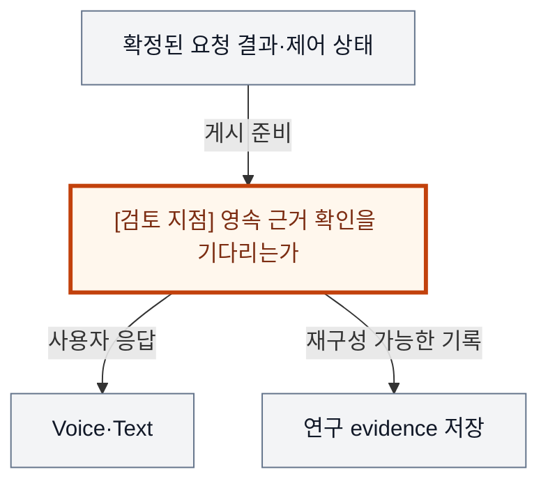
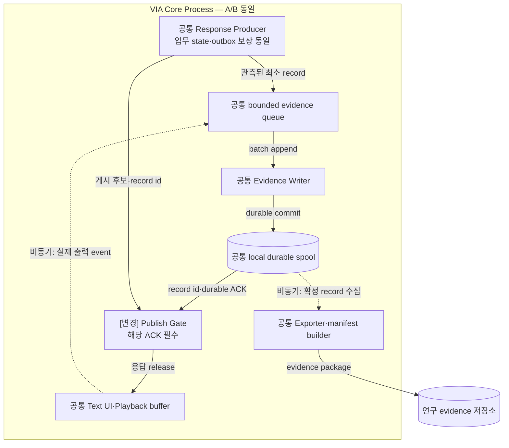
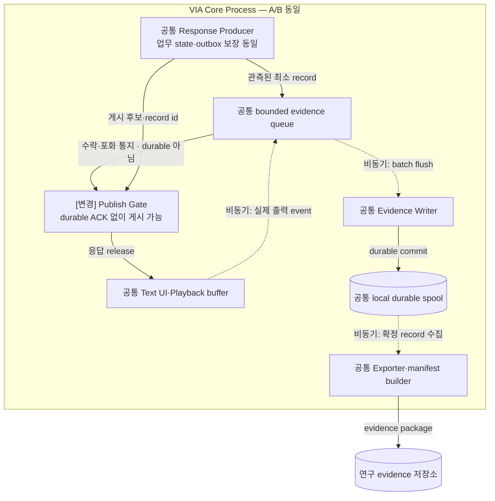
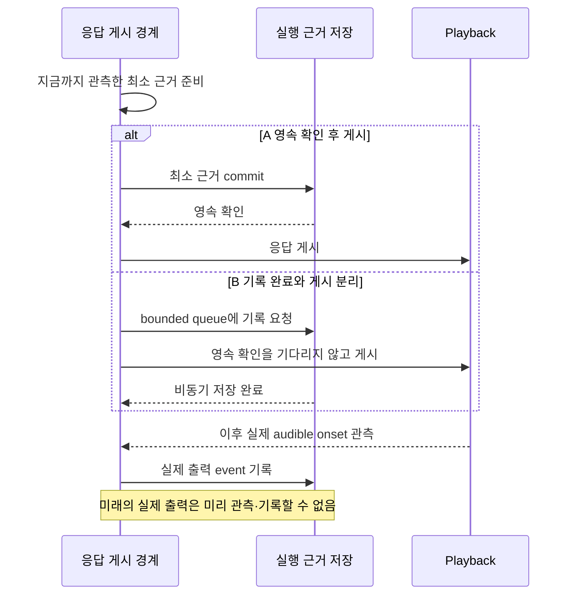

# VIA-DP-12 — 응답 게시와 실행 근거의 영속 확정 순서

> **검토 초안 v2 · 2026-09-25 · 구현 구조 상세화 · 사용자 검토 전**
>
> 질문: 최소 실행 근거의 영속 확인 뒤 응답·제어 disposition을 게시할 것인가, 정상 기록을 유지하되 게시와 영속 기록을 비동기로 분리할 것인가?
>
> 현재 판단: **검증 후보 — 중앙 수집 위치에서 기록 완료 의무로 재정의** 대안 선택·구현·QA 측정은 하지 않았다. 실제 결과는 모두 `NOT_RUN`이다.

## 1. 배경 — 시험은 끝났는데 왜 그런 결과가 나왔는지 로그가 없다면?

연구자가 새 VIA 기능을 시험하고 응답을 확인했는데, 직후 Process가 종료되어 timing·경로·설정 기록의 일부가 사라진다. 사용자 동작은 성공했어도 원인 분석과 평가가 불가능할 수 있다. 반대로 저장소가 느릴 때 모든 응답을 기다리게 하면 상호작용이 나빠진다. Producer별 spool과 중앙 수집을 함께 쓰는 것은 가능하므로, 실제 결정은 응답 전에 어떤 기록의 완료를 요구하는가다.

배경 그림의 주황색 검토 지점은 설계 질문이지 추가 Component가 아니다. VIA는 사용자 PC의 Voice·Text interaction과 업무 연결을 책임진다. Downstream Agent는 실제 업무 계획·Tool 실행을, Model Runtime은 추론 실행을 담당한다. 이 보고서는 그 내부 알고리즘이나 학습을 고르지 않는다.

## 2. 비교 범위와 공통 조건

**용어:** evidence는 판단·평가를 뒷받침하는 실행 근거다. durable/영속 확인은 해당 저장소의 약속 아래 재시작 후에도 기록이 남음을 확인하는 것이다. spool은 전달·수집 전 임시 보관 기록, bounded queue는 크기가 제한된 대기열이다. disposition은 완료·거절·확인 대기 등 사실에 맞는 현재 처리 상태이고, manifest는 입력·설정·분석기 버전을 묶어 기록한 명세다.

대상은 사용자 응답·Task control disposition을 게시하기 전 이미 관측된 최소 execution evidence의 영속 확인 의무다. Business state·Action audit·명령 outbox 등 안전에 필수인 기록은 두 안 모두 같은 보장으로 별도 유지한다. 아직 발생하지 않은 실제 acoustic endpoint를 미리 관측했다고 기록할 수 없다.

**기준선에서 확인한 사실:** UC-13·18은 실제 전달·실패를 사실대로 남겨야 하며, QA-61은 완전한 실행 재구성, QA-62는 보존된 근거에서 같은 평가 결과를 재계산하는 비율이다. 불완전한 trace를 성공 측정으로 숨길 수 없다. 요구의 출처는 [System Mission](../01-system-mission-and-boundary.md), [Fixed Scope](../03-fixed-architecture-scope.md), [Use Cases](../05-representative-use-cases.md)다.

**이번 비교의 설계 가정:** 같은 required event·schema·privacy 필터·총 저장/메모리 예산·batch 기회·writer·export 기능을 사용한다. 둘 다 local durable spool+중앙 수집·공통 schema·manifest를 사용할 수 있다. 누락·timeout·기록 오류는 같은 분모에서 실패·불완전으로 남긴다.

**미확인 사항:** 최소 record 크기·state commit과의 결합 가능성·저장 지연, 장애가 flush 전후 어느 구간에 발생하는지, 후발 acoustic event 수집·보존 방식. 사실·후보 설계·미확인 가정을 서로 바꿔 쓰지 않는다. Conversation은 이어지는 대화, Request는 논리적 요청, Task는 여러 요청에 걸쳐 추적하는 업무다. Oracle은 실행 전에 정한 정답·허용 상태 조건이고, fixture는 고정 입력·외부 사건이다.

### 구현도를 읽기 위한 공통 전제

**S2S 모델 1개 + semantic LLM 1개**를 고정한다. Component·Task·단계별 별도 적재는 없고 프롬프트·세션·호출만 나눌 수 있다. 아래는 **구현 가능한 후보 설계 설명**이며 제품 구현 완료나 QA 실측이 아니다. 모델 동시 호출·취소 지원은 공통 dependency profile로 확인한다.

Core Process는 이 DP의 A/B 공통 비교용 배치다. Process 자체를 비교하는 VIA-DP-11 외에는 한쪽만 별도 Process를 추가하지 않는다. 외부 Agent Runtime은 VIA Client와 별개이며 모델의 local/remote 배치도 별도 조건이다. 생략 영역은 양쪽에서 동일하다.

실선은 라벨의 호출·반환·읽기·쓰기, 점선은 비동기 event다. Queue/buffer는 별도 노드, 영속 기록은 원통으로 그린다. 메모리 queue 수락은 durable commit이 아니고 별도 message bus 제품도 가정하지 않는다. 메시지는 request/Task/call identity와 관련 revision·generation으로 연결한다. 늦은 결과는 최종 owner가 검사한다. queue 용량·포화 정책은 측정 전 동결하며 무한 queue를 가정하지 않는다.

## 3. 대안 A — 최소 근거 선확정 + 상세 자료 비동기 수집

게시 전 이미 발생한 필수 입력·경로·identity·설정·판단·source event 근거를 local durable 저장소가 확인한 뒤 결과를 내보낸다. 큰 artifact와 분석용 부가 자료의 수집·원격 export는 비동기로 둘 수 있다. Business state transaction과 기록을 합칠 수 있으면 허용한다. 최소 의무만 동기로 하는 hybrid다.

기록 실패 시 다른 저장 경로로 같은 보장을 만족시키거나 해당 게시를 보류·실패 처리한다. 무한 대기나 전체 VIA 중단을 기본으로 하지 않는다. 강점은 게시 직전까지 관측한 근거의 유실 창을 줄이는 것이고, 약점은 critical path의 저장 확인·backpressure다. 실제 재생 완료·onset처럼 나중에 생기는 event는 별도로 수집해야 한다.

**실제 호출·상태·실패 처리 순서**

1. 업무 state·Action audit·outbox 보장은 동일하다. Producer가 게시 전까지 관측한 최소 evidence를 queue로 보내고 Writer가 local spool에 저장한다.
2. Gate는 해당 record의 durable ACK를 받아야 응답을 release한다. enqueue는 영속 확인이 아니다. 저장 지연·포화 때는 게시 보류 또는 명시된 실패가 발생한다.
3. 실제 audible onset·중단 offset은 게시 후 별도 기록한다. Exporter는 확정 자료와 manifest를 비동기 수집한다. A도 미래의 물리 출력까지 사전 보장하지 못한다.

A도 아직 발생하지 않은 실제 출력 event의 영속성을 사전에 보장하지 않는다. 선확정 대상과 후발 관측을 분리한다.

## 4. 대안 B — 게시와 영속 기록의 비동기 분리

같은 최소 evidence를 bounded memory queue에 넣고 정상적으로 writer가 영속 저장하게 한다. 응답 게시가 해당 record의 durable acknowledgement를 기다릴 필요는 없다. Background flush·짧은 batch·producer spool·누락 감지·독립 health를 모두 허용한다.

Queue 포화 때는 명시된 backpressure·부가 이벤트 축소·요청 보류 정책으로 처리하고, required event를 버렸다면 그 run을 불완전으로 표시한다. 기록을 끄거나 성공 run만 보관하는 안이 아니다. 빠른 게시와 storage tail 분리가 장점이지만 volatile 수락과 durable 완료 사이의 crash window는 남는다.

**실제 호출·상태·실패 처리 순서**

1. 같은 required record·Writer·spool을 쓴다. queue 수락 뒤 durable 완료를 기다리지 않고 게시할 수 있으며 Writer는 background flush를 한다.
2. 포화·required record 손실은 명시하고 run을 불완전으로 남긴다. 성공 표본만 보관하거나 로그를 끄는 안이 아니다.
3. 게시 직후 flush 전 crash에서는 응답은 갔지만 근거가 유실될 수 있다. 실제 출력 후발 event의 손실은 양쪽에 남는다. QA-61 완전성과 QA-62 재계산 가능성을 동일시하지 않는다.

B가 정상적으로 영속 로그를 남겨도 게시 전 완료를 의무화하지 않는다는 점에서 A와 다르다.

두 구조도는 같은 확대 영역이다. 같은 이름은 공통 책임, `[변경]`은 바뀐 책임이다. 경계의 Process 표시는 공통 비교용 배치이며 실선은 라벨의 기능 흐름, 점선은 비동기 전달이다. 상자 수는 변경 요소 수나 메모리 크기가 아니다.

## 5. 구조 차이·상호 배타성·Hybrid 검토

| 차이 | A | B |
| --- | --- | --- |
| 게시 조건 | 관측된 최소 evidence의 durable 확인 필요 | 해당 durable 확인 없이 게시 가능 |
| crash window | 선확정 범위는 닫힘; 후발 event는 남음 | 미flush된 필수 event까지 유실 가능 |
| storage 지연 | 게시 critical path에 남을 수 있음 | queue 한도 안에서 분리 가능 |
| 공통 | 정상 기록·privacy·business durability·manifest·실제 출력 관측 | 동일 |

동일 게시 사건이 해당 최소 evidence의 durable 확인 전에 허용되면 B, 허용되지 않으면 A다. B의 local spool이 항상 영속 확인된 뒤에만 게시한다면 A로 바뀐다. A가 저장 실패 때 근거 없이 게시하도록 fallback하면 그 범위는 B이며 새 후보 version으로 명시해야 한다.

초기 ‘개별 로그 대 중앙 수집’은 producer spool+공통 수집+immutable manifest로 결합 가능하고 필수 데이터 손실 차이도 없으므로 core 축에서 내렸다. 그 hybrid를 공통 기반으로 두고 최소 근거만 선확정하는 A와 대등한 비동기 B를 도출했다. 최종 원본의 저장 소유자·중앙/분산 배치는 이 비교에서 고정한다.

A/B 모두 같은 기능·권한·실패 의미와 합리적인 보완책을 허용하는 **steelman**이다. 같은 결정 범위의 최종 기준은 **mutually exclusive**해야 한다. 속도 차이를 만들기 위해 한쪽의 검증·기록·cache를 빼지 않는다.

### 같은 사건에서 확인하는 순서 차이

다음 그림은 A/B의 차이가 드러나는 동일 사건을 비교한다. 외부 완료와 VIA 내부 확정을 구별하며, 아래 사고실험에서 지연·실패 조건까지 확인한다.

## 6. 같은 사건을 통과시키는 사고실험

### T1. 정상 응답과 저장소 tail latency

같은 응답 후보와 최소 evidence가 준비된다. A는 실제 durable 확인과 게시 준비가 모두 끝나야 출력할 수 있고, B는 queue 수락과 게시 준비가 끝나면 출력할 수 있다. A의 추가 지연은 두 경로가 겹치고 남은 durable 대기뿐이다. 모든 요청에 별도 fsync 1회를 가정하지 않는다. Business commit과 함께 기록되거나 음성 생성 중 flush가 끝나면 차이는 작다.

Storage tail이 음성 준비 뒤까지 남는 case에서 B의 QA-02/03/05가 유리할 수 있다. QA-01도 outbound/inbound 실제 경계에서 기록 의무가 걸리는 구간에만 포함한다. B 역시 queue가 포화되면 backpressure를 받으므로 무한한 비동기 buffer로 빠른 값을 만들지 않는다. QA-04 물리 중단은 먼저 수행하고 그 관측을 나중에 기록하는 공통 안전 경로다.

### T2. 게시 직후 Process 종료와 trace 완전성

동일 의미의 crash를 ‘사용자 게시가 일어난 뒤, 비동기 writer가 해당 batch를 flush하기 전’에 넣는다. A는 게시 전 관측한 근거를 이미 보존하고 B는 그 일부를 잃을 수 있다. 이것은 QA-61의 구조적 차이이며 이미 영속된 A record를 B에 시험기가 무료로 보충하지 않는다.

하지만 A도 실제 audible onset·마지막 출력 event가 기록되기 전에 죽으면 그 run 전체는 incomplete일 수 있다. A가 언제나 100%라는 결론은 틀리다. 후발 event를 공통 독립 관측자가 보존한 변형과 그렇지 않은 변형을 같은 fault pack에 넣어 차이가 전체 strict run 비율에 남는지 확인한다. 각 후보의 로그만으로 자기 누락 여부를 판정하지 않는다.

### T3. 기록 오류가 사용자 기능·평가 재현에 주는 영향

저장 장치의 영구 물리 파손이 아니라 writer 지연·일시 오류·queue 포화를 공통 조건으로 준다. A는 같은 durability를 제공하는 fallback 또는 bounded 보류가 필요하고, B는 flush 전까지 계속 게시할 수 있지만 누락 run을 정상으로 꾸밀 수 없다. 기능을 전부 막아 trace completeness를 높이면 QA-11의 사용자 완료 조건과 함께 실패를 드러낸다. Business 안전 기록은 이 비교로 약화하지 않는다.

QA-32의 필요 의존 집합은 공통 기능 의미로 사전 승인한다. 진단 writer 오류가 원래 그 기록 없이 가능한 무관한 음성 제어까지 막는다면 초과 전파 후보이나, A의 필수 기록과 fault 범위를 결과에 맞춰 재정의하지 않는다. QA-62는 B의 incomplete 판정 자체도 frozen evidence·manifest로 정확히 재계산할 수 있어 A의 자동 우세가 아니다. 원래 보고값을 복원 못하는 missing evidence가 실제 발생했을 때만 재현 실패다.

정확성 계약에서는 해당 판정에 필요한 trace가 없으면 실패다. 따라서 실제 의미·Task 동작이 같아도 B가 필요한 판정 근거를 잃으면 QA-11~15의 관측 점수가 달라질 수 있다. 모든 부가 로그 누락이 곧 모든 정확성 QA 실패인 것은 아니다. 공통 독립 observer가 제공하는 판정 근거와 제품 trace 의무를 먼저 구분하고, 근거 누락에 따른 실패를 실제 잘못된 동작과 별도 원인으로 보고한다.

### T4. 연구 변경·memory·삭제 정책

E-01 timing span은 선확정 집합·critical path에 추가되는지, E-02 correlation은 request·generation 연결, E-03 schema는 durable reader, E-04 export는 local commit과 remote export 분리, E-05 assignment는 실제 적용 설정의 선확정 여부를 확인한다. A의 schema 변경이 게시 gate까지 바꾸면 B보다 넓을 수 있지만 공통 library로 흡수되면 비슷하다. 전체 5개 ledger 없이 평균을 만들지 않는다.

M-01~09·C-01~06·A-01~09는 필요한 producer·source version이 실제 바뀌는지를 같은 전체 pack에서 검토한다. QA-41에는 A의 pending release buffer와 B의 flush backlog가 모두 들어가며 어느 쪽이 큰지 workload에 달린다. 보호정보 원문을 더 남겨 완전성을 높이지 않고 digest·opaque ID·허용된 frozen 자료 참조를 사용한다. 삭제된 User Memory를 과거 evidence 명목으로 다음 요청에 재주입하지 않는다.

## 7. 전체 19개 QA 비교

**사고실험 예상 / 실제 측정 `NOT_RUN`.** §2의 조건과 위 사고실험을 적용한다. 시간·변경 수·중단 수·메모리·노출은 작을수록, 정확성·연속성·완전성·재현 비율은 클수록 좋다. “비슷”은 명시한 조건에서 차이가 작다는 예상이며, “판단 근거 부족”은 방향·크기를 모른다는 뜻이다. 확실성은 실측 신뢰구간이 아니다. **부분 사례의 차이를 최악 case p95·전체 corpus·전체 change pack의 대표값 차이로 확대하지 않는다.**

| QA · 단일 metric | 예상 방향·크기 | 확실성 | 구조적 이유·반례와 근거 | 역할 |
| --- | --- | --- | --- | --- |
| QA-01 위임 경로 VIA 처리시간 · 최악 case p95; Agent 실행 제외 | 조건부: B 우세 가능; 크기 미정 | 중간 | durable 대기가 VIA critical path에 남는 구간만 [T1](#t1) | 주 비교 후보 |
| QA-02 직접 Voice 응답시간 · 최악 case p95 | 조건부: B 우세 가능; 크기 미정 | 중간 | 출력 준비와 기록 flush의 중첩 여부가 핵심 [T1](#t1) | 주 비교 후보 |
| QA-03 Agent 상태 Voice 전달시간 · 최악 case p95 | 조건부: B 우세 가능; 크기 미정 | 중간 | source status 이후 게시 전 기록 대기 [T1](#t1) | 주 비교 후보 |
| QA-04 음성 중단시간 · 최악 case p95 | 비슷 | 높음 | 물리 음성 stop은 진단 기록을 기다리지 않음 [T1](#t1) | 필수 회귀 |
| QA-05 Task 제어 응답시간 · 최악 control case p95 | 조건부: B 우세 가능; 크기 미정 | 중간 | 같은 truthful disposition의 게시 시점 비교 [T1](#t1) | 주 비교 후보 |
| QA-11 전체 요청 처리 정확도 · case별 strict 성공률의 평균 | 조건부; 방향 미정 | 낮음 | A 기록 보류와 B의 필수 판정 근거 누락을 모두 실패 처리; 실제 오동작과 원인 구분 [T3](#t3) | 필수 검증 |
| QA-12 의미 해석 정확도 · strict 성공 run 비율 | 근거 보존 시 비슷; 누락 시 조건부 | 중간 | 같은 의미·Model 결과여도 필요한 판단 trace가 없으면 실패 [T3](#t3) | 회귀 |
| QA-13 Task·Interaction 연결 정확도 · strict 성공 run 비율 | 근거 보존 시 비슷; 누락 시 조건부 | 중간 | business binding durability는 공통이나 해당 판정 근거의 보존도 필요 [T3](#t3) | 필수 회귀 |
| QA-14 비동기 Task 상태 수렴 · strict 성공 run 비율 | 근거 보존 시 비슷; 누락 시 조건부 | 중간 | 같은 수렴 규칙과 관측 가능한 상태 전이 근거를 구분 [T3](#t3) | 회귀 |
| QA-15 대화·Task 연속성 · 성공 scenario 비율 | 근거 보존 시 비슷; 누락 시 조건부 | 중간 | 같은 연속성 계약에서도 scenario 판정 근거가 사라지면 실패 [T3](#t3) | 회귀 |
| QA-21 Agent 변화 영향 범위 · 9개 변화의 변경 요소 평균 | 비슷 예상 | 중간 | Agent 의미 경계는 고정; trace producer 영향은 ledger 확인 [T4](#t4) | 회귀 |
| QA-22 Model·Context·State 변화 영향 · 15개 변화의 변경 요소 평균 | 조건부; 방향 미정 | 낮음 | 새 required evidence가 실제 gate·schema에 전파되는가 [T4](#t4) | 회귀·ledger |
| QA-23 실험·로그 변화 영향 · 5개 변화의 변경 요소 평균 | 조건부: B 우세 가능; 크기 미정 | 낮음 | A의 선확정 집합·게시 gate까지 변경되는 경우 [T4](#t4) | 주 비교 후보 |
| QA-31 올바른 Task 복구시간 · 최악 fault p95 | 비슷 예상; backlog 조건부 | 중간 | Task recovery와 연구 trace 복구를 혼동하지 않음 [T3](#t3) | 회귀 |
| QA-32 불필요한 장애 영향 범위 · 초과 중단 단위 최대 수 | 조건부; 정의 선행 | 낮음 | writer failure가 무관한 기능까지 막는지 공통 closure로 검증 [T3](#t3) | 주 비교 가능성 |
| QA-41 PC 메모리 · 최악 workload의 peak p95 | 조건에 따라 다름 | 중간 | pending release 대 flush backlog의 실제 peak [T4](#t4) | 자원 확인·ASR 우선 제외 |
| QA-51 불필요한 보호정보 노출 · 초과 노출 단위 수 | 비슷 | 중간 | 같은 최소 evidence·redaction·recipient 정책 [T4](#t4) | 필수 회귀 |
| QA-61 실행 trace 완전성 · 완전한 trace run 비율 | 조건부: A 우세; 전체 크기 미정 | 중간 | 선확정 전 event의 유실 창 감소, 후발 출력 event는 공통 한계 [T2](#t2) | 주 비교 후보 |
| QA-62 평가 재현성 · 동일 평가 재계산 비율 | 비슷 또는 조건부 | 중간 | incomplete 판정도 재현 가능; 원래 보고 근거 손실 때만 실패 [T3](#t3) | 필수 검증 |

A는 실행이 끝난 뒤 근거가 없어 연구를 다시 해야 하는 위험을 줄이는 선택이고, B는 기록 시스템의 tail을 사용자 게시에서 분리하는 선택이다. 응답 지연과 QA-61 사이의 반대 방향 구조 인과가 남지만, 무장애 정상 run만으로는 거의 동점일 수 있다.

## 8. 공정한 검증 계획 — 실행하지 않음

required pre-release evidence와 post-output evidence를 먼저 분리해 승인한다. 동일 writer·batch·state commit 결합을 허용하고, 공통 독립 observer로 게시·flush·crash 위치를 검증한다. 누락 run·실패 판정·재현 표본을 사후 삭제하지 않는다. 이번에는 로그 구현·장애 주입·측정하지 않는다.

측정에 앞서 동일한 목표·fixture·외부 기능·자원 조건, case별 실제 참여 경로, 실패·timeout 처리, 반복·집계·target·동점 기준을 동결한다. 최종 점수나 승리 개수는 지금 만들지 않는다. QA-11과 QA-12~15의 성공을 중복 합산하지 않는다. 잘못된 대상·중복 Action, 무효 승인, 무단 접근은 점수로 상쇄할 수 없는 필수 위반 조건이다.

근거 계약: [Voice responsiveness](../08-quality-attributes/voice-responsiveness.md), [Task 제어](../08-quality-attributes/interaction-control-responsiveness.md), [실제 event 경계](../11-measurement/event-boundary-contract.md), [정확성·연속성](../08-quality-attributes/correctness-and-continuity.md), [복구·장애·메모리](../08-quality-attributes/reliability-and-resource.md), [19개 QA catalog](../08-quality-attributes/quality-model.md), [변경 전체 집합](../07-intentional-variables.md), [변경 요소와 실험 change pack](../08-quality-attributes/evidence/change-locality-rationale.md), [관측·재현](../08-quality-attributes/observability.md), [Privacy·집계](../11-measurement/scoring-contract.md). 문서 사고실험은 실행 evidence label이나 기존 archive 결과로 대신하지 않는다.

## 9. 다른 DP·변경 비용

DP-08 운영 상태 기준과 별개로 A/B 어디에도 적용할 수 있다. DP-11 worker generation과 DP-13 제어 자원 경로를 같은 조건으로 둔다. DP-04 Voice 자율 게시도 이 기록 의무를 우회하지 않는다. A→B는 보존 보장 변화·manifest를 명시하고, B→A는 gate·durable acknowledgement·reader·기존 pending queue drain을 이행한다.

## 10. 현재 판단과 재검토 조건

**재정의한 축을 검증 후보로 유지한다.** 중앙 수집 위치 자체는 보조 설계로 남긴다. Business commit이 이미 모든 필요한 근거를 보호해 A의 추가 비용과 B의 유실 창이 모두 사라지면 이 축도 핵심 평가에서 내린다. QA-62를 QA-61의 복제 점수로 쓰지 않는다.

## 11. 자체 검토에서 반영한 개선점

처음의 수집 위치 대립을 hybrid로 통합하고 응답과 영속 기록의 ordering을 실제 결정으로 삼았다. A도 실제 출력 이전에 미래 endpoint를 기록할 수 없다는 한계를 명시했다. 비동기 B의 정상 기록·누락 감지·bounded buffer를 보장했다.

검토 범위는 문서·사고실험이다. 외부 심사나 후보 성능 검증을 완료했다는 뜻이 아니다. 전체 후보의 현재 상태·미완료 사항은 [요약 보고서](./dp-executive-summary.md#review-status), 문서 검증 기준은 [검토 protocol](./dp-review-protocol.md)을 따른다.
