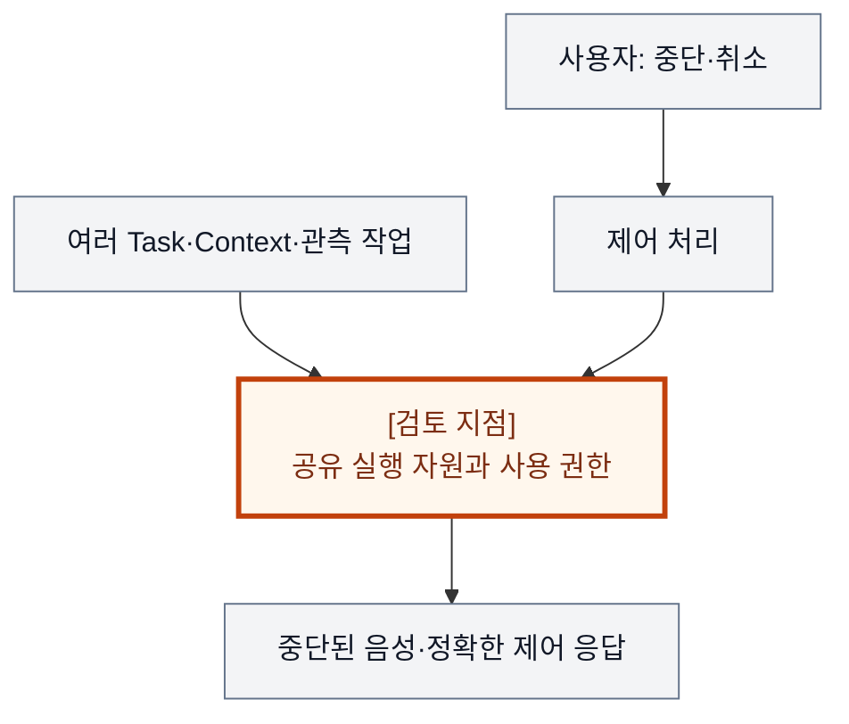
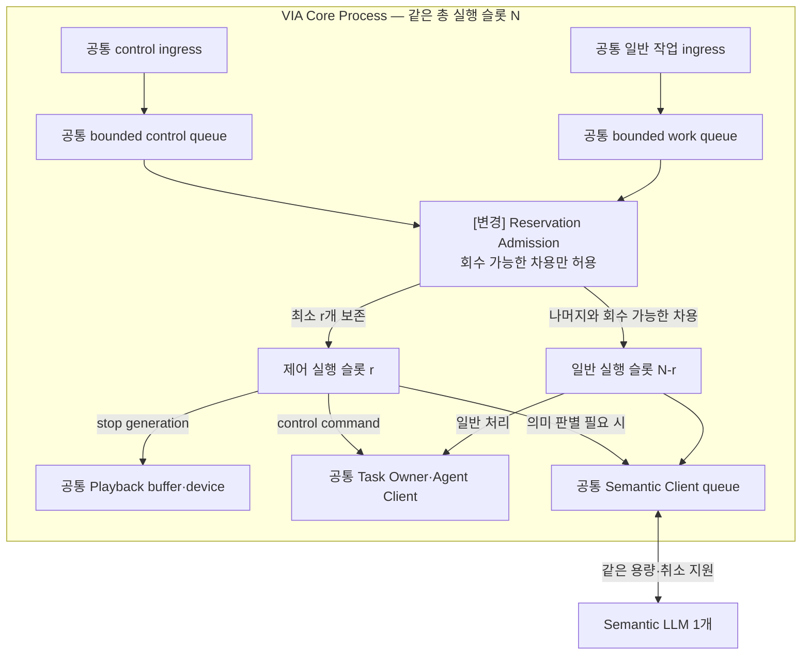
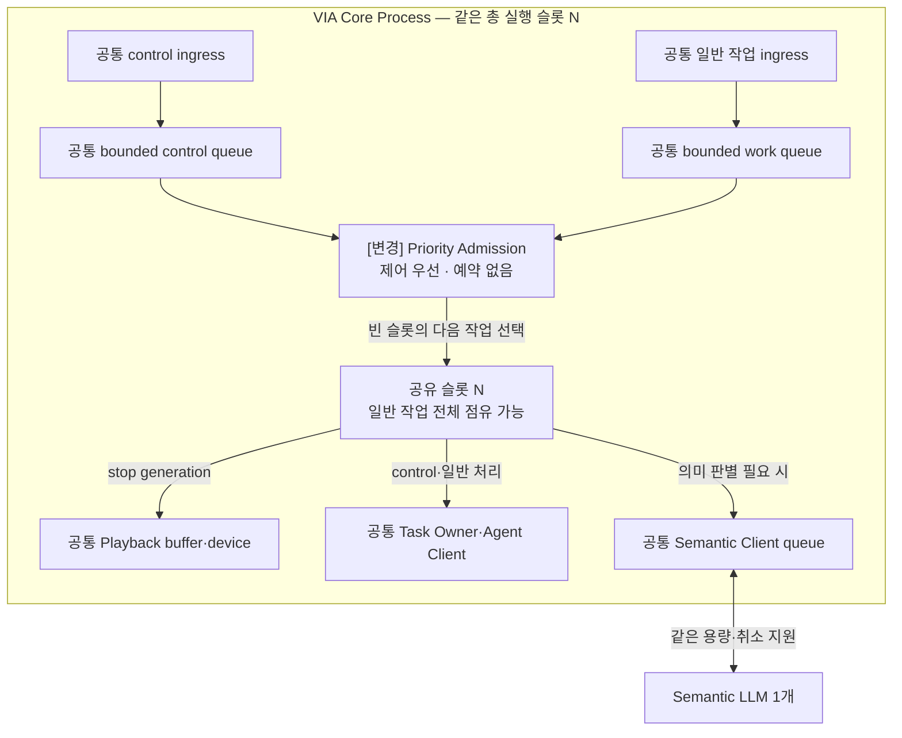
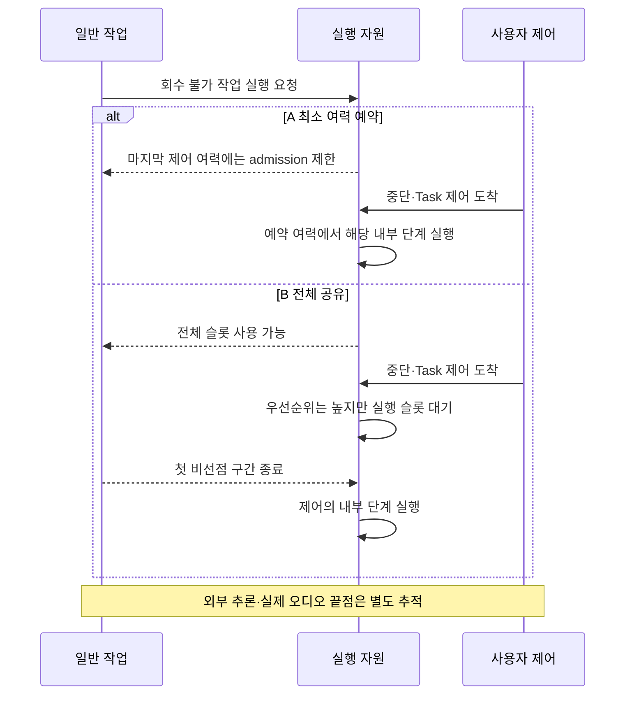

# VIA-DP-13 — 사용자 제어를 위한 실행 자원을 예약할 것인가

> **검토 초안 v2 · 2026-09-25 · 구현 구조 상세화 · 사용자 검토 전**
>
> 질문: 같은 PC 자원 한도 안에서 중단·Task 제어 경로에 회수 가능한 최소 실행 여력을 보장할 것인가?
>
> 현재 판단: **새 후보 · 추가 검증 후보** 대안 선택·구현·QA 측정은 하지 않았다. 실제 결과는 모두 `NOT_RUN`이다.

## 1. 배경 — 업무가 바쁠수록 ‘그만’이라는 말은 더 빨리 처리되어야 한다

사용자는 여러 Task를 진행하면서 음성을 끊거나 특정 업무를 취소한다. 그런데 상태 변환·Context 처리·로그 직렬화 같은 일반 작업이 VIA의 실행 슬롯을 모두 점유하면, 제어 요청의 우선순위만 높여도 이미 실행 중인 작업을 밀어낼 수 없을 수 있다.

문제는 thread 수를 얼마로 조정하느냐가 아니다. **일반 작업이 사용자 제어에 필요한 마지막 실행 여력까지 사용할 권한이 있는가**이다. 이 결정은 admission 정책, queue, 처리 단위, 의존 서비스와 자원 소유권을 함께 바꾼다. 초기 12개 후보에서 Process 격리나 Model session 관리만으로는 설명되지 않아 추가했다.

배경 그림의 주황색 검토 지점은 설계 질문이지 추가 Component가 아니다. VIA는 사용자 PC의 Voice·Text interaction과 업무 연결을 책임진다. Downstream Agent는 실제 업무 계획·Tool 실행을, Model Runtime은 추론 실행을 담당한다. 이 보고서는 그 내부 알고리즘이나 학습을 고르지 않는다.

## 2. 비교 범위와 공통 조건

**용어:** 실행 슬롯은 작업을 처리할 수 있는 한 단위의 여력이다. admission은 현재 작업을 받아 실행시킬지 결정하는 정책이고, borrowing은 유휴 예약분을 다른 작업에 빌려주는 것이다. 비선점 구간은 시작한 처리를 즉시 안전하게 중단할 수 없는 구간이다. critical path는 최종 응답을 기다리게 만드는 실제 의존 경로다.

대상은 VIA가 소유하는 실행 슬롯·queue·메모리 한도 중, 음성 중단과 Task 제어가 실제로 사용하는 자원의 **최소 여력 사용 계약**이다. A는 제어용 최소 여력을 보장하고 회수 가능한 때에만 일반 작업에 빌려준다. B는 전체를 공유하되 우선순위·admission으로 제어를 우대한다. 같은 자원에 같은 보장 여부를 비교한다. OS hard-real-time 보장, Model 알고리즘, 외부 Agent의 취소 완료 속도를 선택하지 않는다.

**기준선에서 확인한 사실:** UC-11/12는 음성 중단과 업무 취소를 구분하며 UC-14는 여러 Task의 동시 진행을 요구한다. QA-04는 실제 음성 정지, QA-05는 올바른 제어 disposition까지 측정한다. VIA 밖의 업무가 실제로 중단되었다고 거짓 보고해서는 안 된다. 요구의 출처는 [System Mission](../01-system-mission-and-boundary.md), [Fixed Scope](../03-fixed-architecture-scope.md), [Use Cases](../05-representative-use-cases.md)다.

**이번 비교의 설계 가정:** 같은 총 CPU·실행 슬롯·queue·메모리 한도, 같은 일반 작업 입력과 실행 비용, 같은 interruptibility와 외부 Model/Agent profile을 사용한다. 양쪽 모두 제어 우선순위, 취소 신호, 작업 쪼개기, bounded queue, 과부하 admission을 허용한다. A만 자원을 더 받거나 B만 FIFO로 처리하지 않는다. 제어의 실제 의존 경로가 무엇인지 공통으로 식별한다.

**미확인 사항:** 목표 PC 자원 한도, 제어와 일반 작업의 실제 공유 지점, 긴 비선점 구간, 외부 추론이 제어 응답에 필요한 비율은 확인 전이다. 비선점은 시작한 처리를 안전하게 즉시 중단할 수 없다는 뜻이다. 외부 Runtime 대기가 지배적이면 VIA 내부 여력만 예약해서 QA-05를 개선할 수 없다. 사실·후보 설계·미확인 가정을 서로 바꿔 쓰지 않는다. Conversation은 이어지는 대화, Request는 논리적 요청, Task는 여러 요청에 걸쳐 추적하는 업무다. Oracle은 실행 전에 정한 정답·허용 상태 조건이고, fixture는 고정 입력·외부 사건이다.

### 구현도를 읽기 위한 공통 전제

**S2S 모델 1개 + semantic LLM 1개**를 고정한다. Component·Task·단계별 별도 적재는 없고 프롬프트·세션·호출만 나눌 수 있다. 아래는 **구현 가능한 후보 설계 설명**이며 제품 구현 완료나 QA 실측이 아니다. 모델 동시 호출·취소 지원은 공통 dependency profile로 확인한다.

Core Process는 이 DP의 A/B 공통 비교용 배치다. Process 자체를 비교하는 VIA-DP-11 외에는 한쪽만 별도 Process를 추가하지 않는다. 외부 Agent Runtime은 VIA Client와 별개이며 모델의 local/remote 배치도 별도 조건이다. 생략 영역은 양쪽에서 동일하다.

실선은 라벨의 호출·반환·읽기·쓰기, 점선은 비동기 event다. Queue/buffer는 별도 노드, 영속 기록은 원통으로 그린다. 메모리 queue 수락은 durable commit이 아니고 별도 message bus 제품도 가정하지 않는다. 메시지는 request/Task/call identity와 관련 revision·generation으로 연결한다. 늦은 결과는 최종 owner가 검사한다. queue 용량·포화 정책은 측정 전 동결하며 무한 queue를 가정하지 않는다.

## 3. 대안 A — 제어 여력 예약 + 회수 가능한 유휴 자원 공유

제어 경로에 필요한 최소 실행 슬롯과 bounded admission 여력을 VIA가 예약한다. 일반 작업은 나머지를 사용하고, 제어 요청이 오면 정해진 경계 안에 회수할 수 있는 작업만 유휴 예약분을 빌린다. 회수 불가능한 긴 작업은 마지막 제어 슬롯을 점유할 수 없다.

이는 유휴 CPU를 무조건 놀리는 구조가 아니다. 안전한 borrowing, 일반 작업의 협력적 중단과 batch 분할을 포함한 hybrid다. 제어가 필요로 하는 queue나 내부 lock도 함께 분석해야 한다. 예약 thread 하나가 공유 lock 뒤에 막히면 보장은 성립하지 않는다. 외부 추론·OS scheduling까지 보장한다고 주장하지 않는다.

과부하에서는 일반 요청을 늦추거나 명시적으로 admission을 거절할 수 있다. 그 실패·대기는 일반 요청 QA 분모에 남긴다. 제어뿐 아니라 일반 업무도 수행하는 동일 제품 기능이 유지되어야 한다.

**실제 호출·상태·실패 처리 순서**

1. 양쪽은 같은 queue·총 슬롯 N을 가진다. A는 마지막 r개를 회수 불가능한 일반 작업에 주지 않는다. N·r은 추후 동결할 파라미터이지 제품 목표가 아니다.
2. barge-in은 Playback을 중단하고 Task 취소는 Owner가 처리한다. 대상 의미 판별이 필요하면 같은 LLM을 쓴다. **제어용 LLM은 추가하지 않는다.** S2S도 공통 1개이며 그림은 그 이후 자원 영역이다.
3. 차용 슬롯은 약속된 경계에서 반환해야 한다. lock·DB·Client queue까지 분석한다. 외부 모델 비선점 추론·OS scheduling까지 이 예약이 보장하지는 않는다.

[변경] 표시는 자원을 더 추가하는 것이 아니라 같은 한도 안에서 점유 권한을 나누는 것이다. 필요한 내부 의존에도 예약 계약이 이어져야 한다.

## 4. 대안 B — 전체 자원 공유 + 우선순위 기반 제어 우대

제어와 일반 작업이 하나의 자원 pool을 사용한다. 제어 요청을 먼저 선택하고, 대기 일반 작업을 취소·지연하거나 새 작업을 제한한다. 공통 adapter와 bounded queue, 협력적 선점, 작업 분할을 최대한 활용한다.

다만 마지막 실행 여력까지 일반 작업에 줄 수 있다. 이미 실행 중인 비선점 작업이 전체 슬롯을 점유했다면 제어는 첫 슬롯이 풀릴 때까지 기다린다. 이를 받아들이는 대신 제어 요청이 없을 때 일반 작업이 전체 capacity를 활용할 수 있다. 항상 제어 여력을 남기도록 admission을 바꾸면 구현 명칭과 무관하게 A가 된다.

B는 합리적인 공유 구조다. 긴 비선점 작업이 없거나 실제 제어 전용 오디오 경로가 이미 독립되어 있다면 A의 예약 정책 없이도 제어 목표를 달성할 수 있다.

**실제 호출·상태·실패 처리 순서**

1. 다음 작업 선택 시 control을 우선하지만 일반 작업도 빈 슬롯을 전부 쓸 수 있다. FIFO만 쓰는 약한 B가 아니다.
2. 모든 슬롯이 비선점 작업 중이면 제어는 첫 반환까지 기다린다. 작업 분할·협력적 취소·admission 제한으로 지연을 줄일 수 있다.
3. 음성 중단이 이미 독립 callback에서 실행되면 이 pool은 QA-04에 비참여한다. QA-05도 공유 LLM·Agent 대기가 지배하면 예약 효과가 작다. 실제 참여 경로를 확인한다.

B에도 우선순위와 과부하 제어가 있다. 차이는 이미 실행 중인 일반 작업이 모든 여력을 점유할 수 있다는 점이다.

두 구조도는 같은 확대 영역이다. 같은 이름은 공통 책임, `[변경]`은 바뀐 책임이다. 경계의 Process 표시는 공통 비교용 배치이며 실선은 라벨의 기능 흐름, 점선은 비동기 전달이다. 상자 수는 변경 요소 수나 메모리 크기가 아니다.

## 5. 구조 차이·상호 배타성·Hybrid 검토

| 구조 항목 | A | B |
| --- | --- | --- |
| 마지막 실행 여력 사용 권한 | 제어가 우선 소유; 일반 작업은 회수 가능할 때만 차용 | 일반 작업도 전체 점유 가능 |
| admission 계약 | 제어 의존 경로의 최소 여력을 보존 | 전체 capacity·대기 우선순위에 따라 수락 |
| 상태·Interface | 예약량, 차용·회수 상태와 처리 단위의 회수 계약 | 공통 queue 상태와 우선순위·취소 계약 |
| 장애와의 구분 | 과부하 대기를 제어; Process crash 자체를 격리하지 않음 | 동일; Process 격리는 DP-11의 별도 선택 |
| 변경 비용 | 일반 worker와 내부 의존의 점유·회수 계약을 함께 변경 | 공통 scheduler 중심; A로 이동 시 각 의존의 비선점 구간 조사 필요 |

**배타성:** 대상 자원의 마지막 제어 여력을 회수 불가능한 일반 작업에 내줄 수 있는가? A는 아니오, B는 예다. 같은 순간·같은 자원에 두 답을 적용할 수 없다. 요청별 적용을 나누려면 어떤 제어 등급에 어떤 보장을 줄지 하나의 명시적 예약 정책으로 정의해야 한다.

고정 전용 pool과 무조건 공유 pool을 그대로 대립시키지 않았다. 유휴분 차용을 포함한 hybrid를 A로 삼았다. B의 높은 우선순위·cooperative yield는 허용하지만 최소 여력 보장을 도입하면 A로 분류한다. 모든 작업을 충분히 짧게 선점할 수 있는 제3안이 현재 dependency로 가능하다면 양쪽에 적용한 후 차이가 사라지는지 재검토한다. Process를 늘리는 것으로 예약을 대신하지 않는다.

A/B 모두 같은 기능·권한·실패 의미와 합리적인 보완책을 허용하는 **steelman**이다. 같은 결정 범위의 최종 기준은 **mutually exclusive**해야 한다. 속도 차이를 만들기 위해 한쪽의 검증·기록·cache를 빼지 않는다.

### 같은 사건에서 확인하는 순서 차이

다음 그림은 A/B의 차이가 드러나는 동일 사건을 비교한다. 외부 완료와 VIA 내부 확정을 구별하며, 아래 사고실험에서 지연·실패 조건까지 확인한다.

## 6. 같은 사건을 통과시키는 사고실험

### T1. 모든 공유 슬롯이 긴 일반 작업을 실행 중일 때 제어가 도착한다

같은 수의 슬롯과 같은 입력 작업을 사용한다. 어떤 일반 작업은 다음 안전 경계까지 중단할 수 없다. B가 모든 슬롯에 이 작업을 실행시킨 뒤 제어가 오면, 제어의 시작 대기는 남은 비선점 시간 중 최소값보다 작을 수 없다. 대기 queue에서 우선순위 1위여도 이 시간은 사라지지 않는다.

A는 회수 불가능한 작업에 예약분을 내주지 않았으므로 그 내부 단계의 슬롯 대기를 피할 수 있다. 반대로 A의 일반 작업 일부는 더 늦게 시작한다. 제어가 없었던 구간에는 B가 일반 작업을 먼저 완료할 수 있다. 동일 offered workload를 유지하며 A가 미룬 일반 요청도 QA-01/02에 포함한다.

이것은 수치 예측이 아니라 점유 계약에서 나오는 순서 제약이다. QA-04의 오디오 경로가 실제 이 자원을 쓰지 않으면 QA-04 이점은 없다. QA-05가 외부 추론에 막히면 내부 시작 개선이 최종 응답 개선으로 이어지지 않을 수 있다.

### T2. 일반 작업을 즉시 양보시킬 수 있거나 전체 부하가 낮다

양쪽 모두 cooperative yield가 충분히 짧고 queue가 비어 있는 profile을 통과시킨다. B도 제어를 곧바로 실행하므로 QA-04/05 차이는 작을 수 있다. A가 안전하게 유휴분을 빌려주면 일반 요청 손해도 줄어든다. 이 profile에서 큰 trade-off를 주장하면 안 된다.

예약 자체의 상태 관리 비용은 존재할 수 있지만, 상자 수로 메모리 증가를 산정하지 않는다. 같은 전체 메모리 한도에서 queue 분포만 바뀔 수도 있다. 측정 조건에 따라 A/B가 사실상 같다면 우선순위 구현 과제로 낮춘다.

### T3. 예약 worker가 다른 공통 자원 뒤에 막힌다

제어 worker는 비어 있지만 필요한 lock을 일반 작업이 보유하거나, 공통 Model session이 긴 추론을 처리하는 사건을 넣는다. A의 국소 예약은 end-to-end 제어 보장이 아니다. 회수 가능한 lock 사용, 필요한 내부 자원의 admission 연계 등 보완을 A에 포함하되 비용도 기록한다. 외부 Runtime이 필요한 기능을 제공하지 않으면 그 구간은 미해결 가정이다.

같은 사건의 Task cancel에서는 pending을 정확히 보고할 수 있는 공통 규칙을 사용한다. A만 낙관적 성공을 말하거나 B만 외부 취소 완료까지 기다리게 하지 않는다. scheduler가 죽는 fault와 정상 과부하를 분리한다. 예약으로 QA-32의 Process 장애 영향이 자동으로 작아진다고 하지 않는다.

### T4. 동시 Task·로그 export·재연결에서 일반 기능을 굶기지 않는다

UC-14/15의 상태 복원·결과 통지와 E-04 로그 export를 제어 요청과 함께 제공한다. A/B 모두 일반 작업이 지속적으로 완료될 수 있는 공통 기능 조건을 만족해야 한다. 제어 요청을 빌미로 모든 업무를 영구 거절하는 A나 기록을 버리는 B는 탈락한다.

M-05/06의 local/remote Model 전환과 E change pack이 새 queue·자원 계약을 건드리는지는 전체 QA-22/23 change ledger에 기록한다. 특정 scheduler 변경 한 건을 전체 평균으로 대표하지 않는다. slot 점유·admission·queue 대기와 실제 오디오/제어 endpoint를 trace로 연결해야 하며, 양쪽에 동일 관측 비용을 적용한다.

## 7. 전체 19개 QA 비교

**사고실험 예상 / 실제 측정 `NOT_RUN`.** §2의 조건과 위 사고실험을 적용한다. 시간·변경 수·중단 수·메모리·노출은 작을수록, 정확성·연속성·완전성·재현 비율은 클수록 좋다. “비슷”은 명시한 조건에서 차이가 작다는 예상이며, “판단 근거 부족”은 방향·크기를 모른다는 뜻이다. 확실성은 실측 신뢰구간이 아니다. **부분 사례의 차이를 최악 case p95·전체 corpus·전체 change pack의 대표값 차이로 확대하지 않는다.**

| QA · 단일 metric | 예상 방향·크기 | 확실성 | 구조적 이유·반례와 근거 | 역할 |
| --- | --- | --- | --- | --- |
| QA-01 위임 경로 VIA 처리시간 · 최악 case p95; Agent 실행 제외 | B 우세 가능 · 중~큼, 포화 경로 한정 | 중간 | A의 회수 불가 일반 작업 admission 제한으로 위임 전후 VIA 처리가 늦어질 수 있다. Agent 실행시간은 포함하지 않는다. [T1](#t1) | trade-off |
| QA-02 직접 Voice 응답시간 · 최악 case p95 | B 우세 가능 · 중~큼, 포화 경로 한정 | 중간 | 직접 응답이 일반 처리 자원을 쓰면 A의 예약 제한을 받는다. 저부하·안전한 차용에서는 비슷하다. [T1](#t1) | trade-off |
| QA-03 Agent 상태 Voice 전달시간 · 최악 case p95 | 판단 근거 부족 | 낮음 | 상태 통지가 제어 등급인지 일반 등급인지 공통으로 정해야 한다. quiet-lane 대표값을 포화 이벤트로 대체하지 않는다. [T4](#t4) | 회귀 |
| QA-04 음성 중단시간 · 최악 case p95 | A 우세 가능 · 중~큼, 공유 경로 한정 | 중간 | 실제 중단 경로가 포화 슬롯을 사용하면 A가 시작 대기를 줄인다. 이미 독립 오디오 경로면 비슷하다. [T1](#t1) | 핵심 |
| QA-05 Task 제어 응답시간 · 최악 control case p95 | A 우세 가능 · 중~큼, 내부 대기 지배 시 | 중간 | 정확한 제어 disposition 경로에 예약이 이어질 때만 유리하다. 외부 Model 대기와 취소 완료는 별개다. [T3](#t3) | 핵심 |
| QA-11 전체 요청 처리 정확도 · case별 strict 성공률의 평균 | 판단 근거 부족 | 낮음 | 시간 개선이 strict 성공을 높이는지는 oracle deadline과 일반 업무 실패까지 포함해 확인해야 한다. [T4](#t4) | 회귀 |
| QA-12 의미 해석 정확도 · strict 성공 run 비율 | 비슷 예상 · 작음 | 중간 | 같은 의미 입력·추론과 oracle을 유지한다. 예약은 의미 판정을 개선하는 알고리즘이 아니다. [T2](#t2) | 회귀 |
| QA-13 Task·Interaction 연결 정확도 · strict 성공 run 비율 | 비슷 예상 · 작음 | 중간 | 같은 Task identity와 제어 대상 검증을 사용한다. 빠른 잘못된 취소는 탈락이다. [T3](#t3) | 필수 회귀 |
| QA-14 비동기 Task 상태 수렴 · strict 성공 run 비율 | 판단 근거 부족 | 낮음 | 제어 우대로 일반 상태 처리가 늦어질 수 있으나 version·정합성 규칙은 같다. deadline에 따라 달라진다. [T4](#t4) | 회귀 |
| QA-15 대화·Task 연속성 · 성공 scenario 비율 | 비슷 예상 · 작음 | 낮음 | 같은 복원 데이터와 재연결 계약이다. 포화 상황의 복원 지연은 scenario 조건을 확인해야 한다. [T4](#t4) | 회귀 |
| QA-21 Agent 변화 영향 범위 · 9개 변화의 변경 요소 평균 | 비슷 예상 · 작음 | 낮음 | 동일 Agent adapter 계약이므로 자동 격리 이점이 없다. A-01~09 전체 ledger가 필요하다. [T4](#t4) | 변경 회귀 |
| QA-22 Model·Context·State 변화 영향 · 15개 변화의 변경 요소 평균 | B 우세 가능 · 작음~중간 | 낮음 | 새 Runtime·Context 의존에 A 예약 계약을 연결할 수 있다. 공유 공통화 여부와 M/C 전체 집합으로 확인한다. [T4](#t4) | 보조 |
| QA-23 실험·로그 변화 영향 · 5개 변화의 변경 요소 평균 | 판단 근거 부족 | 낮음 | E 변경이 예약·queue 계측 계약까지 바꾸는지에 달려 있다. 별도 정책 요소 수만으로 결론내리지 않는다. [T4](#t4) | 변경 회귀 |
| QA-31 올바른 Task 복구시간 · 최악 fault p95 | 판단 근거 부족 | 낮음 | 복구를 예약 제어 등급으로 둘지 공통으로 동결해야 한다. 단순 UI 응답 재개는 올바른 Task 복구가 아니다. [T3](#t3) | 회귀 |
| QA-32 불필요한 장애 영향 범위 · 초과 중단 단위 최대 수 | 비슷 예상 · 작음 | 중간 | 같은 Process·fault boundary를 유지한다. 정상 과부하 감소를 장애 영향 단위 감소로 바꾸지 않는다. [T3](#t3) | 회귀 |
| QA-41 PC 메모리 · 최악 workload의 peak p95 | 판단 근거 부족 | 낮음 | 총 한도가 같다. 예약 metadata·queue 분포·차용 비용의 실제 peak를 봐야 한다. [T2](#t2) | 자원 확인·ASR 우선 제외 |
| QA-51 불필요한 보호정보 노출 · 초과 노출 단위 수 | 비슷 예상 · 작음 | 중간 | 같은 최소 필요 정보·recipient·목적이며 slot 예약은 공개 권한을 바꾸지 않는다. [T4](#t4) | 필수 회귀 |
| QA-61 실행 trace 완전성 · 완전한 trace run 비율 | 비슷 예상 · 작음 | 낮음 | 양쪽 모두 전체 요청 trace를 보존해야 한다. backlog와 timeout 누락을 포함해 확인한다. [T4](#t4) | 관측 회귀 |
| QA-62 평가 재현성 · 동일 평가 재계산 비율 | 비슷 예상 · 작음 | 중간 | 동일 raw evidence·manifest·analyzer를 저장한다. scheduler 결정론이나 Model 재실행률을 metric으로 바꾸지 않는다. [T4](#t4) | 관측 회귀 |

**핵심 맞교환은 사용자 제어 응답과 일반 요청의 처리 여력이다.** 실제 공유 비선점 구간이 존재하면 같은 자원 한도에서 구조적 충돌을 설명할 수 있다. 다만 모든 성능 QA가 자동으로 반대 방향을 보이는 것은 아니며, 목표 workload에서 최악 p95를 움직이는지는 아직 모른다. QA-41을 억지로 A의 손해로 넣지 않았다.

## 8. 공정한 검증 계획 — 실행하지 않음

먼저 제어의 실제 dependency graph와 비선점 구간을 식별한다. 저부하, 일반 작업 포화 후 제어 도착, 제어·일반 동시 유입, 외부 Runtime 대기 지배 profile을 사전에 동결한다. 같은 도착열·자원 한도·작업 비용을 사용하고 양쪽 admission 실패와 timeout을 포함한다. 내부 queue 대기는 원인 증거이며 QA-04/05를 대체하지 않는다. 지속적인 일반 기능 완료도 검증한다. 이 사고실험을 실행한 benchmark 결과는 없다.

측정에 앞서 동일한 목표·fixture·외부 기능·자원 조건, case별 실제 참여 경로, 실패·timeout 처리, 반복·집계·target·동점 기준을 동결한다. 최종 점수나 승리 개수는 지금 만들지 않는다. QA-11과 QA-12~15의 성공을 중복 합산하지 않는다. 잘못된 대상·중복 Action, 무효 승인, 무단 접근은 점수로 상쇄할 수 없는 필수 위반 조건이다.

근거 계약: [Voice responsiveness](../08-quality-attributes/voice-responsiveness.md), [Task 제어](../08-quality-attributes/interaction-control-responsiveness.md), [실제 event 경계](../11-measurement/event-boundary-contract.md), [정확성·연속성](../08-quality-attributes/correctness-and-continuity.md), [복구·장애·메모리](../08-quality-attributes/reliability-and-resource.md), [19개 QA catalog](../08-quality-attributes/quality-model.md), [변경 전체 집합](../07-intentional-variables.md), [변경 요소와 실험 change pack](../08-quality-attributes/evidence/change-locality-rationale.md), [관측·재현](../08-quality-attributes/observability.md), [Privacy·집계](../11-measurement/scoring-contract.md). 문서 사고실험은 실행 evidence label이나 기존 archive 결과로 대신하지 않는다.

## 9. 다른 DP·변경 비용

DP-11은 Process crash의 격리이고 이 DP는 정상 과부하의 자원 점유 권한이다. DP-10의 공통 session manager가 있어도 역할별 예약은 가능하며, 역할별 manager여도 Runtime capacity를 공유할 수 있다. DP-04의 Voice 권한만 위임해도 실행 슬롯이 없으면 빠르게 답할 수 없다. DP-12의 저장 barrier가 제어 경로에 있다면 해당 저장 의존도 고려한다.

A→B는 예약 상태·차용 계약·admission을 풀어야 하고, B→A는 모든 제어 의존의 회수 가능 경계와 자원 사용자를 조사해야 한다. 단순 thread 숫자 변경으로 이행을 설명할 수 없다. 진행 중 작업은 기존 lease를 소진·회수한 뒤 정책 epoch를 전환하고, 제어 요청을 잃지 않는 rollback 경로가 필요하다.

## 10. 현재 판단과 재검토 조건

**DP-13을 새 핵심 후보로 추가하고 우선 검증한다.** 근거는 기존 UC의 제어·동시 작업 요구와 동일 자원 아래 실제로 양립하기 어려운 점유 권한이다. 다른 DP의 Process·Model 배치와 독립된 결정이다. 실제 제품에서 모든 제어 의존이 이미 독립되었거나 일반 작업을 충분히 짧게 회수할 수 있어 A/B가 같아지면 핵심 평가 대상에서 내린다. 현재는 후보 비교 구조를 정리한 것이며 목표 달성이나 A 채택을 결정한 것이 아니다.

## 11. 자체 검토에서 반영한 개선점

- B를 단순 FIFO로 두어 인위적인 제어 지연을 만드는 비교를 제거했다.
- A에 유휴분 차용을 포함하고도 남는 ‘회수 불가 점유 금지’를 배타적 결정으로 남겼다.
- 내부 예약을 외부 Model까지 포함한 end-to-end 보장으로 과장하지 않았다.
- 제어 개선을 위해 미룬 일반 요청과 실패를 분모에서 제거하지 않았다.
- Process 격리·메모리 크기·정확성 향상을 예약 정책의 자동 효과로 간주하지 않았다.

검토 범위는 문서·사고실험이다. 외부 심사나 후보 성능 검증을 완료했다는 뜻이 아니다. 전체 후보의 현재 상태·미완료 사항은 [요약 보고서](./dp-executive-summary.md#review-status), 문서 검증 기준은 [검토 protocol](./dp-review-protocol.md)을 따른다.
