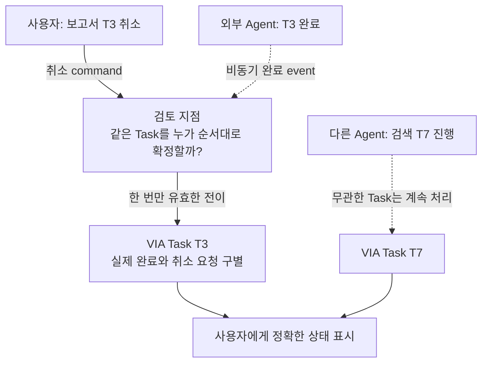
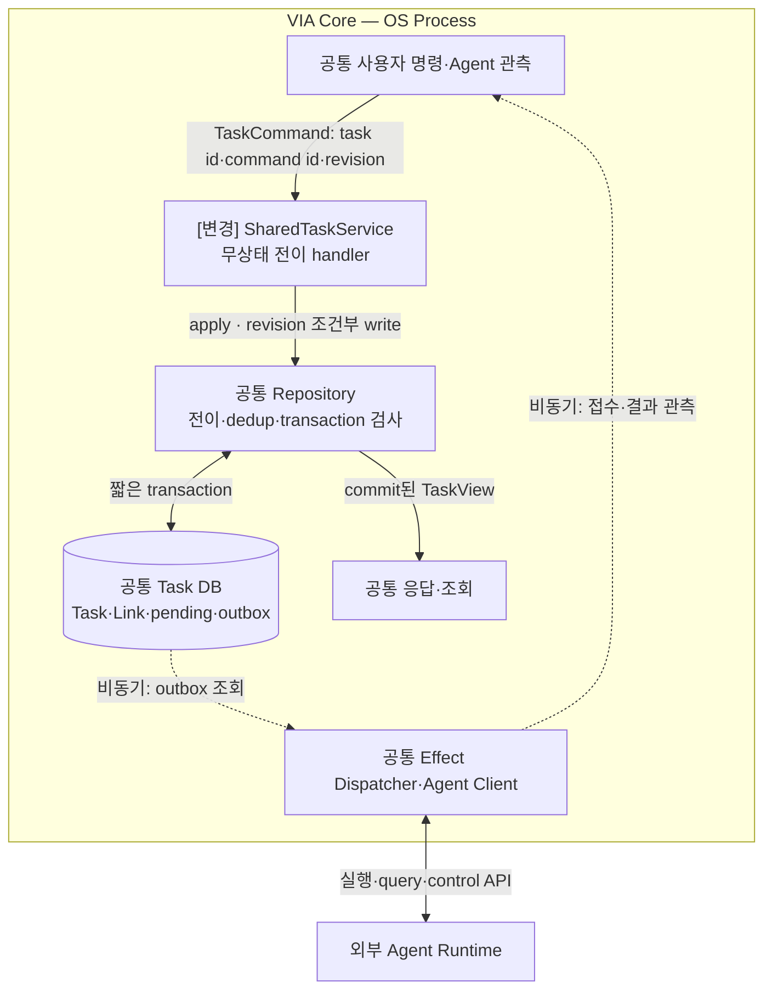
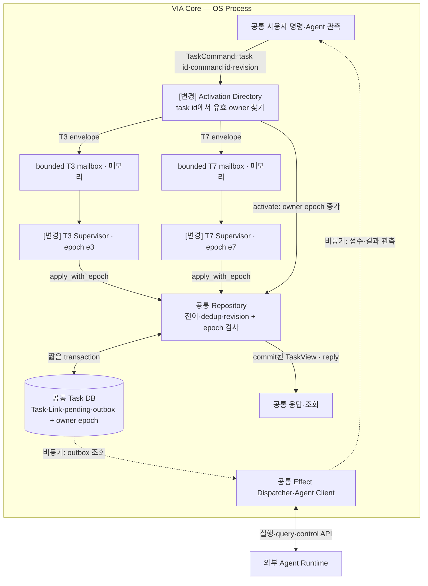

# VIA-DP-14 — Task 상태 전이의 소유권

> **검토 초안 v1 · 2026-09-25 · 구현 구조 상세화 / 사용자 검토 전**
>
> 질문: 공유 Task 서비스가 revision으로 쓰기를 조정할 것인가, Task별 단일 supervisor가 명령을 받아 쓸 것인가?
>
> 현재 판단: 기존 TASK-DP01을 현행 번호로 편입한다. 기존 B accepted는 유지하되 현행 QA 재검증이 필요하다. 강한 양방향 trade-off는 미입증이다. 후보 문서의 완성과 QA trade-off 입증은 별개다. 실제 QA 측정은 `NOT_RUN`이며 이번 작업에서 구현·측정·새 승자 선정은 하지 않았다.

## 1. 배경 — 취소와 완료가 동시에 오면 누가 Task를 갱신할까?

보고서 T3와 검색 T7이 진행 중이다. 사용자가 T3를 취소하는 동시에 T3의 완료가 도착한다. VIA는 T7을 방해하지 않으면서 T3의 실제 결과와 취소 상태를 한 번만 올바르게 갱신해야 한다. 결정은 DB 제품이나 Agent 실행 방법이 아니라, 같은 Task에 쓰려는 명령을 누가 조정하고 최종 확정하는가다.

배경의 검토 지점은 추가 Component가 아니다. VIA는 Voice·Text·화면 interaction과 Task 연결을 소유한다. 실제 업무 계획·도구 실행은 외부 Downstream Agent의 책임이고 모델은 추론 dependency다.

## 2. 비교 범위와 공통 조건

대상은 VIA Task의 상태 전이 writer다. Conversation과 Task의 교차 원자 commit은 VIA-DP-02, 복구 원본은 VIA-DP-08로 분리한다. 양쪽에 같은 Repository·revision 검사·명령 dedup·outbox와 외부 재연결 계약을 둔다. epoch는 supervisor가 재활성화될 때 증가하는 소유권 세대이며 이전 writer의 쓰기를 거부하는 기준이다. Supervisor는 async task와 mailbox를 가진 VIA 코드이지 LLM·OS Process·Downstream Agent가 아니다.

**모델 불변식:** S2S 모델 1개 + semantic LLM 1개. Component·Task별 모델을 별도 적재하지 않는다. 프롬프트·세션·호출을 나눠도 공유 모델이며 동시 처리·취소 지원을 임의 가정하지 않는다.

**그림의 구현 수준:** VIA Core Process는 A/B 공통 비교용 배치다. Process 격리는 VIA-DP-11의 별도 축이며 외부 Agent는 양쪽 모두 별도 Runtime이다. 실선은 라벨의 호출·반환·저장, 점선은 비동기 event다. 메모리 queue 수락과 디스크 commit을 구별하며 별도 message bus 제품은 가정하지 않는다. queue 용량·포화 정책은 추후 동일 조건으로 동결한다. 이 구조도는 후보 명세이며 구현 완료 증거가 아니다.

**출처와 한계:** [시스템 경계](../01-system-mission-and-boundary.md), [UC](../05-representative-use-cases.md), [공통 조건](../06-fixed-assumptions.md), [현행 QA](../08-quality-attributes/quality-model.md)가 요구의 기준이다. 아래 구조는 그 요구를 만족시키려는 후보 설계다. 실제 지연·오류 빈도·변경 요소 ledger는 미확인이다.

## 3. 대안 A — 공유 transactional Task 서비스

TaskService의 무상태 handler가 명령마다 저장소 revision을 확인하고 전이를 수행한다. Task별 준비·분할 queue·짧은 transaction을 허용하므로 전역 직렬 서비스가 아니다. 소유자 활성화 없이 호출할 수 있지만 동시 갱신 충돌의 재시도 책임이 남는다.

**실제 호출·상태·실패 처리 순서**

1. 같은 TaskCommand를 SharedTaskService.apply에 보낸다. Repository가 command 중복·expected revision·허용 전이를 검사하고 상태와 효과를 commit한다. 중복 명령은 보존한 결과를 반환한다.
2. 충돌한 handler는 최신 상태를 읽고 같은 사용자 의도에 맞게 재검토한다. 이미 완료됐으면 취소 완료라고 덮지 않는다. Task별 준비는 병렬일 수 있지만 실제 DB write 제약은 그대로다.
3. Dispatcher는 commit 뒤 외부 호출하고 결과를 새 관측 command로 돌려보낸다. 재시작 시 기존 명령·Link·outbox로 복구한다. Agent나 LLM 응답을 transaction 안에서 기다리지 않는다.

## 4. 대안 B — Task별 단일 writer supervisor

각 Task에 활성 owner 하나와 메모리 mailbox를 둔다. 같은 Task의 command는 그 owner가 순서대로 처리하고 Repository가 epoch를 검사한다. 공통 전이 library·저장소·지연 활성화를 허용한다. Task별 순서와 수명 경계가 명시적이지만 registry·mailbox·fencing 계약이 추가된다.

**실제 호출·상태·실패 처리 순서**

1. Directory가 Task ID의 sender를 찾는다. 없거나 종료됐으면 Repository.activate로 새 epoch를 저장하고 supervisor와 bounded mailbox를 만든다. 현재 구조 코드의 mailbox 용량 64는 구현값이지 제품 요구가 아니다.
2. Supervisor가 한 envelope씩 apply_with_epoch를 수행하고 commit 뒤 caller의 reply 채널로 결과를 반환한다. **mailbox 자체는 영속 queue가 아니다.** caller는 응답 소실 시 같은 command ID로 재시도하고 Repository가 중복 효과를 막는다.
3. 재활성화 이전 epoch의 늦은 writer는 거부한다. 외부 응답은 mailbox에서 기다리지 않고 Dispatcher의 후속 command로 받는다. T3와 T7은 같은 코드의 인스턴스이며 모델도 DB도 Task별로 복제하지 않는다.

## 5. 구조 차이·상호 배타성·Hybrid 검토

| 항목 | A | B |
| --- | --- | --- |
| 상태 전이 권한 | stateless TaskService handler | 해당 Task의 현재 epoch supervisor |
| 순서·경합 | revision 충돌 검사와 재검토 | mailbox 순서 + revision·epoch 검사 |
| 추가 수명 상태 | handler 요청 수명 | activation registry·epoch·mailbox |
| 공통 | Repository·Task schema·외부 호출·안전 조건 | 동일 |

같은 Task command의 write에 유효 activation epoch가 필수면 B, 특정 Task activation 없이 서비스 handler가 revision으로 commit하면 A다. A에 Task별 queue를 넣는 hybrid는 A에 포함한다. B의 공통 service facade는 forwarding만 하며 직접 쓰지 않는다. 둘을 동시에 writer로 두면 ownership 규칙이 깨진다. 저장 engine의 mutex와 Task 소유권은 서로 다른 것이다.

양쪽은 같은 기능·안전 조건·자원·외부 capability를 만족하는 **서로의 steelman**이어야 한다. 동일 결정 범위에서는 **mutually exclusive**해야 한다. cache·batch·공통 library·정확성 검사·로그를 한쪽에서 금지해 차이를 만들지 않는다. 같은 강한 설계로 수렴한다면 동점 또는 보조 결정으로 남긴다.

## 6. 같은 사건을 통과시키는 사고실험

### T1. 정상 흐름과 critical path

T3 취소와 완료, T7 진행을 같은 순서로 주입한다. A는 같은 T3 revision을 읽은 handler의 충돌을 재검토하고 B는 mailbox 도착 순서로 처리하되 source revision·terminal 규칙을 동일 적용한다. A의 실제 충돌 재처리 비용과 B의 routing·activation·queue 비용이 차이다. 현재 코드의 Repository는 양쪽 모두 같은 `Arc<Mutex<Connection>>`과 SQLite WAL/FULL을 사용하므로 supervisor 수만큼 DB write가 병렬화된다고 말할 수 없다. 경합이 적으면 A가 단순할 수 있고 hot Task에서 B가 재처리를 줄일 수 있지만 전체 p95 방향은 미정이다.

### T2. 정정·실패·재연결

commit 뒤 reply 전 crash에서는 양쪽 모두 command dedup으로 동일 결과를 반환해야 한다. B의 mailbox에만 있던 명령은 저장된 완료로 간주하지 않는다. B 재활성화 중 옛 owner가 살아 있으면 epoch로 거절하며 A도 오래된 revision은 거절한다. 전체 Core crash는 두 안 모두 영향받는다. B는 OS Process 장애 격리가 아니므로 QA-32 자동 우세가 없다. QA-31은 actor 생성이 아니라 모든 영향 Task의 정확한 상태·허용 control 복구까지다.

### T3. 변경·연구 기록과 반례

C-06 상태 schema 변경 시 A의 transaction 계약과 B의 activation·command reader를 비교한다. B는 공통 library를 바꾸지 Task 4개를 4개 Architecture Element로 세지 않는다. M-01~09/C-01~06 전체 15건, Agent 9건, 연구 5건의 변경 ledger를 각각 유지한다. trace에는 command·epoch·source revision·commit·reply를 연결한다. 양쪽의 정상 최적화 뒤 차이가 없어지면 강한 독립 평가 DP라는 가설을 철회한다.

## 7. 전체 19개 QA 비교

**사고실험 예상 / 실제 측정 `NOT_RUN`.** 모든 판정은 §2의 동일 조건과 T1~T3의 가설에 한정한다. 조건부 방향은 전체 metric의 실측 우세가 아니다. 시간·변경 수·장애 단위·메모리·노출은 작을수록, 성공·완전성·재현 비율은 클수록 좋다. 일부 사례의 차이를 최악 p95·전체 change pack 평균으로 확대하지 않는다.

| QA · 단일 metric | 예상 방향·크기 | 확실성 | 구조적 이유·반례 | 역할 |
| --- | --- | --- | --- | --- |
| QA-01 위임 경로 VIA 처리시간 · 최악 case p95; Agent 실행 제외 | 조건부·크기 미정 | 낮음 | 충돌 재처리 대 mailbox·activation; 공통 DB 제약 [T1](#t1) | 비교 후보 |
| QA-02 직접 Voice 응답시간 · 최악 case p95 | 비슷 예상 | 중간 | 순수 direct는 Task writer 비참여, Task 조회만 실제 경로 확인 [T1](#t1) | 회귀 |
| QA-03 Agent 상태 Voice 전달시간 · 최악 case p95 | 조건부·방향 미정 | 낮음 | source 이후 관측 commit 대기 차이 [T1](#t1) | 비교 후보 |
| QA-04 음성 중단시간 · 최악 case p95 | 비슷 | 중간 | 물리 재생 중단은 Task commit을 기다리지 않음 [T1](#t1) | 회귀 |
| QA-05 Task 제어 응답시간 · 최악 control case p95 | 조건부·방향 미정 | 낮음 | control commit까지 실제 queue·충돌 경로 [T1](#t1) | 비교 후보 |
| QA-11 전체 요청 처리 정확도 · case별 strict 성공률 평균 | 비슷 예상·실측 미정 | 낮음 | 양쪽 같은 올바른 전이 의무 [T2](#t2) | 필수 검증 |
| QA-12 의미 해석 정확도 · strict 성공 run 비율 | 비슷 | 중간 | 의미 결과 고정, writer만 변경 [T1](#t1) | 회귀 |
| QA-13 Task·Interaction 연결 정확도 · strict 성공 run 비율 | 비슷 예상 | 중간 | 동일 command·Task·run binding [T2](#t2) | 필수 검증 |
| QA-14 비동기 상태 수렴 · strict 성공 run 비율 | 비슷 예상 | 중간 | revision·terminal·dedup 양쪽 필수 [T2](#t2) | 필수 검증 |
| QA-15 대화·Task 연속성 · 성공 scenario 비율 | 비슷 예상 | 중간 | Voice 수명과 Task 수명 분리 공통 [T2](#t2) | 회귀 |
| QA-21 Agent 변경 영향 · 9개 변화의 변경 요소 평균 | 비슷 예상 | 중간 | Agent 의미 경계 고정 [T3](#t3) | 전체 ledger 확인 |
| QA-22 Model·Context·State 변경 영향 · 15개 변화의 변경 요소 평균 | 조건부·방향 미정 | 낮음 | 공통 전이와 activation 이행의 실제 15건 변경 [T3](#t3) | 비교 후보 |
| QA-23 실험·로그 변경 영향 · 5개 변화의 변경 요소 평균 | 판단 근거 부족 | 낮음 | owner 계측과 공통 SDK의 수정 범위 [T3](#t3) | ledger 확인 |
| QA-31 올바른 Task 복구시간 · 최악 fault p95 | 조건부·방향 미정 | 낮음 | A load·재검토 대 B activation·fencing·공통 외부 확인 [T2](#t2) | 비교 후보 |
| QA-32 불필요한 장애 영향 · 초과 중단 단위 최대 수 | 비슷 예상 | 중간 | 동일 Process·DB failure boundary [T2](#t2) | 회귀 |
| QA-41 PC 메모리 · 최악 workload의 peak p95 | 판단 근거 부족 | 낮음 | mailbox·registry overhead만으로 중요 크기 단정 불가 [T1](#t1) | 자원 확인 |
| QA-51 보호정보 초과 노출 · 초과 단위 수 | 비슷 | 중간 | 같은 scope·수신자·정책 [T3](#t3) | 필수 회귀 |
| QA-61 실행 trace 완전성 · 완전한 trace run 비율 | 비슷 예상 | 중간 | 양쪽 command와 commit trace 보존 가능 [T3](#t3) | 필수 회귀 |
| QA-62 평가 재현성 · 동일 결과 재계산 비율 | 비슷 | 중간 | 동일 manifest·evaluator 보존 [T3](#t3) | 회귀 |

QA-11과 QA-12~15는 통합 결과와 원인 지표이므로 중복 합산하지 않는다. QA-41은 제품 메모리 상한·중요한 구조 차이가 미확인이라 자원 확인 대상으로 유지하며 핵심 ASR 우선 추천에서는 제외한다. 이 표의 관련성만으로 ASR을 확정하지 않는다.

## 8. 공정한 검증 계획 — 실행하지 않음

같은 0/1/4 active Task 조건에 hot Task와 서로 다른 Task의 command를 포함한다. revision 충돌, commit 후 reply 소실, activation 교체, late owner write, uncertain external dispatch를 동결한다. cold activation과 warm 상태를 구분하고 부하를 임의로 늘려 B의 공식 우세를 만들지 않는다.

동일 입력·외부 사건·모델 설정·총 자원을 사용하고 이 DP만 바꾼다. 실제 Voice audible endpoint, 실패·timeout 포함, 반복·집계·target·동점 기준을 결과 전에 동결한다. 잘못된 대상 Action·중복 Action·무효 승인·무단 접근은 점수로 상쇄하지 않는다. 모델 replay는 실제 의미 정확도 측정이 아니다. 근거 계약은 [공통 검토 절차](./dp-review-protocol.md), [event 경계](../11-measurement/event-boundary-contract.md), [QA catalog](../08-quality-attributes/quality-model.md)를 따른다.

## 9. 다른 DP·변경 비용·구현 근거

VIA-DP-02는 교차 관계 원자성, 08은 복구 원본, 09는 Agent 의미 해석, 11은 Process 배치다. 전환에는 진행 명령의 drain·소유권 fencing·reader 호환이 필요하다. 기존 ADR-002의 B accepted를 유지한다. 그때 사용한 이전 세대 responsiveness·동시성 결과는 현행 근거가 아니고 현재 QA-01/03/05·13~15/31/32로 재검증해야 한다.

확인 가능한 구조 코드는 [task.rs](../../../prototypes/candidates/runtime/src/task.rs)의 SharedTaskService·PerTaskSupervisors와 [repository.rs](../../../prototypes/candidates/runtime/src/repository.rs)다. 이 코드는 구조 예시와 부분 테스트를 제공할 뿐 현재 Voice·실제 모델·제품 QA 검증을 완료한 증거가 아니다.

## 10. 현재 판단과 재검토 조건

VIA-DP-14로 정식 관리하고 기존 B 선택·재검증 조건을 이 문서에 보존한다. 시스템을 설명하는 중요한 상태 소유권 결정이지만, 현행 QA에서 반대 방향의 충분한 차이는 아직 입증하지 못했다. inventory에 유지하는 것과 최종 보고서의 주요 trade-off DP로 뽑는 것을 구분한다.

## 11. 자체 검토에서 반영한 개선점

Task supervisor를 Agent runtime·모델·Process와 구별했다. 메모리 mailbox를 durable로 부르지 않았고 공통 DB mutex를 감췄을 때 생기는 병렬 성능 과장을 제거했다. VIA-DP-02와의 중복을 분리했으며 새 번호 부여가 새 승자 선정을 뜻하지 않음을 명시했다.

이 검토는 문서·사고실험이며 외부 심사나 후보 QA 검증 통과가 아니다. 옛 번호는 [요약의 추적성 부록](./dp-executive-summary.md#legacy-mapping)에만 연결하고, 현재 설명은 이 VIA-DP와 현행 QA 번호로 완결한다.
