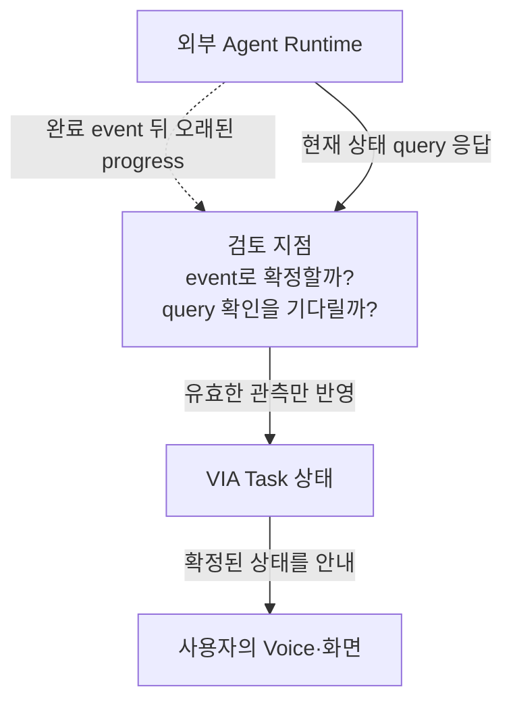
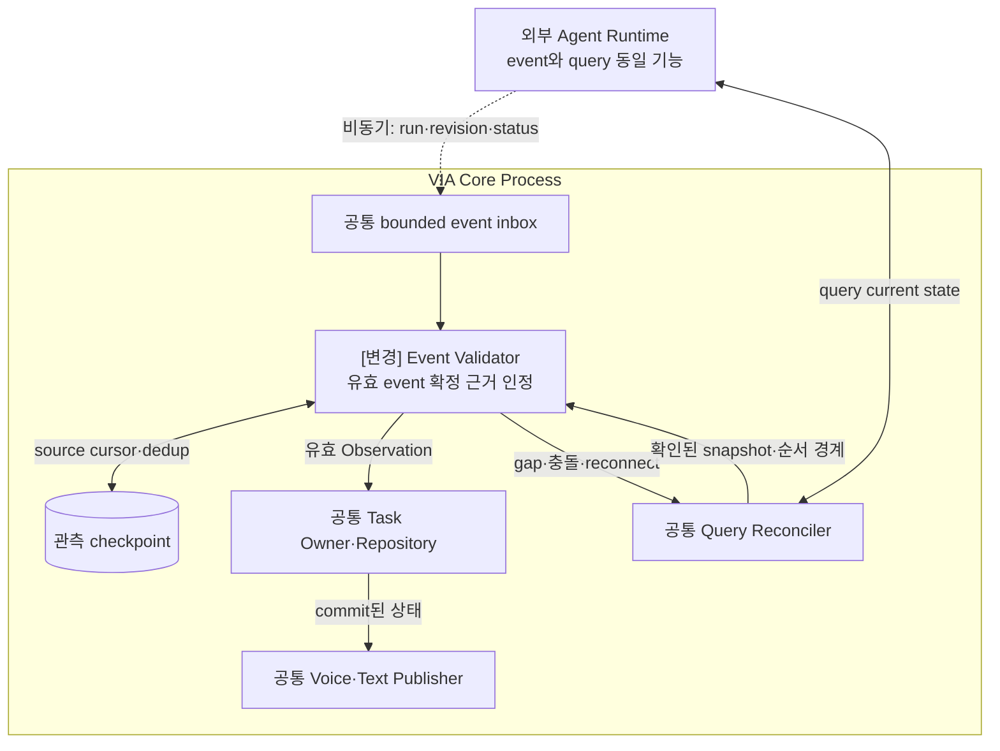
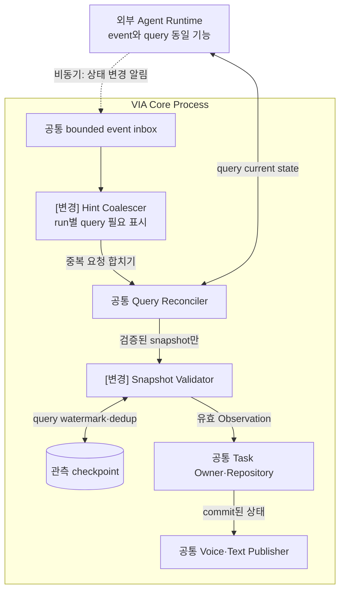

# VIA-DP-15 — Agent 상태를 확정하는 관측 경로

> **검토 초안 v1 · 2026-09-25 · 구현 구조 상세화 / 사용자 검토 전**
>
> 질문: 유효한 상태 event만으로 Task 상태를 갱신할 것인가, event를 받아도 query 확인을 거칠 것인가?
>
> 현재 판단: 이전 TASK-DP02의 남은 권한 질문을 복원한 조건부 후보다. Event와 query의 단순 사용 여부는 DP가 아니다. 후보 문서의 완성과 QA trade-off 입증은 별개다. 실제 QA 측정은 `NOT_RUN`이며 이번 작업에서 구현·측정·새 승자 선정은 하지 않았다.

## 1. 배경 — 완료 소식을 받으면 바로 완료로 알려도 될까?

Agent가 완료 event를 보냈지만 연결이 끊겼고 뒤늦게 오래된 progress가 도착한다. VIA는 빠르게 소식을 전하면서도 Task를 과거 상태로 되돌리지 않아야 한다. Event와 query를 같이 쓰는 것은 자연스럽다. 남는 선택은 유효한 event 자체가 상태 확정 근거인지, 별도 query 결과가 있어야 확정하는지다.

배경의 검토 지점은 추가 Component가 아니다. VIA는 Voice·Text·화면 interaction과 Task 연결을 소유한다. 실제 업무 계획·도구 실행은 외부 Downstream Agent의 책임이고 모델은 추론 dependency다.

## 2. 비교 범위와 공통 조건

대상은 Agent의 상태 관측이 Task Owner에게 유효한 입력이 되는 조건이다. Agent 의미 정규화는 VIA-DP-09, 실제 writer는 14다. 같은 Agent가 identity·순서/신선도 계약과 권위 있는 query를 제공하는 profile에서 비교한다. 제공하지 않는 revision·snapshot 일관성은 VIA가 만들어내지 않는다. poll 간격을 바꾸는 튜닝이나 Agent 내부 event 발생 알고리즘은 범위 밖이다.

**모델 불변식:** S2S 모델 1개 + semantic LLM 1개. Component·Task별 모델을 별도 적재하지 않는다. 프롬프트·세션·호출을 나눠도 공유 모델이며 동시 처리·취소 지원을 임의 가정하지 않는다.

**그림의 구현 수준:** VIA Core Process는 A/B 공통 비교용 배치다. Process 격리는 VIA-DP-11의 별도 축이며 외부 Agent는 양쪽 모두 별도 Runtime이다. 실선은 라벨의 호출·반환·저장, 점선은 비동기 event다. 메모리 queue 수락과 디스크 commit을 구별하며 별도 message bus 제품은 가정하지 않는다. queue 용량·포화 정책은 추후 동일 조건으로 동결한다. 이 구조도는 후보 명세이며 구현 완료 증거가 아니다.

**출처와 한계:** [시스템 경계](../01-system-mission-and-boundary.md), [UC](../05-representative-use-cases.md), [공통 조건](../06-fixed-assumptions.md), [현행 QA](../08-quality-attributes/quality-model.md)가 요구의 기준이다. 아래 구조는 그 요구를 만족시키려는 후보 설계다. 실제 지연·오류 빈도·변경 요소 ledger는 미확인이다.

## 3. 대안 A — 유효 event 확정 + query 복구

정상 상태 event가 계약 검사를 통과하면 query를 기다리지 않고 반영한다. gap·재연결·불일치 때 query로 조정하는 hybrid다. 빠른 source 반영이 이유이며 cursor·중복·순서·gap 관리가 비용이다.

**실제 호출·상태·실패 처리 순서**

1. Inbox가 event를 받고 Validator가 run identity·실제 source revision·terminal 규칙을 검사한다. 유효하면 바로 Task Owner에 Observation을 제출한다.
2. Task Owner가 commit하고 Publisher가 상태를 알린다. event 처리와 checkpoint 저장 사이의 crash에도 중복 적용되지 않게 command identity를 연결한다.
3. gap·재연결 때는 query로 현재 상태를 확인한다. query와 늦은 event의 순서는 source 계약으로 정하며 비교 불가능하면 보류·재확인한다.

## 4. 대안 B — Event 알림 + query 확인 후 확정

event를 빠른 갱신 알림으로 사용하지만 상태 전이는 query의 검증된 snapshot으로 확정한다. 알림을 합치고 query를 병렬·중복 억제할 수 있는 강한 안이다. query의 일관된 확인 경계를 택하는 대신 정상 event에도 확인 대기가 남을 수 있다.

**실제 호출·상태·실패 처리 순서**

1. 같은 event를 받지만 Hint Coalescer가 run별 확인 필요만 표시한다. payload의 완료 상태를 곧바로 사용자에게 확정 게시하지 않는다.
2. Reconciler가 query하고 Snapshot Validator가 identity·신선도·terminal 의미를 검사해 Task Owner에 제출한다. event가 없으면 같은 사전 정의된 bounded query fallback을 쓴다.
3. 동시 query를 합치고 오래된 snapshot을 거절한다. ‘query는 언제나 최신’이라고 가정하지 않는다. 필요한 source 보장이 없으면 이 후보도 부적합이다.

## 5. 구조 차이·상호 배타성·Hybrid 검토

| 항목 | A | B |
| --- | --- | --- |
| 정상 event의 효력 | 계약 충족 시 상태 전이 입력 | query를 깨우는 hint만 |
| 정상 추가 왕복 | 필수 아님 | query 확인 필요 |
| 유지 상태 | event cursor·gap·reconcile | hint 합치기·query freshness |

같은 유효 event만으로 상태 전이를 확정할 수 있으면 A, query 확인이 항상 필요하면 B다. event-first와 query 복구의 hybrid를 A에 포함했다. 이전 공통 tactic은 A의 참조 운영 방식으로 보존하되 모든 후보의 영구 정답으로 쓰지 않는다. query/event의 단순 transport 선택은 독립 DP로 만들지 않는다.

양쪽은 같은 기능·안전 조건·자원·외부 capability를 만족하는 **서로의 steelman**이어야 한다. 동일 결정 범위에서는 **mutually exclusive**해야 한다. cache·batch·공통 library·정확성 검사·로그를 한쪽에서 금지해 차이를 만들지 않는다. 같은 강한 설계로 수렴한다면 동점 또는 보조 결정으로 남긴다.

## 6. 같은 사건을 통과시키는 사고실험

### T1. 정상 흐름과 critical path

같은 시각에 source 완료가 제공된다. A는 event 검증→Task commit→Voice, B는 hint→query 왕복·검증→동일 commit·Voice를 거친다. 추가 query가 critical path에 남으면 QA-03은 A 유리 가능하다. query가 이미 진행 중이거나 음성 준비와 겹치면 차이가 작다. 유효 revision event 관리가 실제로 더 많은 계약 변경을 요구하는지 QA-21 ledger로 확인해야 반대 방향 trade-off를 말할 수 있다.

### T2. 정정·실패·재연결

event 하나 누락 뒤 오래된 event가 도착한다. A는 gap 감지와 query 조정, B는 hint 기반 query로 확인한다. 두 안 모두 stale terminal rollback을 금지한다. 재연결 query는 공통이므로 B가 항상 정확하거나 A가 항상 빠른 복구라는 결론은 안 된다. Query가 최종 상태만 제공해 중간 질문을 잃는 profile이면 B의 기능 적합성이 먼저다.

### T3. 변경·연구 기록과 반례

A-04 상태 제공·A-05 실행 identity·A-08 질문 계약 변화에서 cursor/validator와 query/coalescer의 변경 요소를 비교한다. B도 typed adapter·공통 reader를 재사용할 수 있다. A가 event 구조를 이미 공통 경계에서 흡수하면 반대 방향 변경 이점이 사라진다. QA-61에는 source event와 실제 query·commit·audible 관계를 남기며 모델 사고과정은 수집하지 않는다.

## 7. 전체 19개 QA 비교

**사고실험 예상 / 실제 측정 `NOT_RUN`.** 모든 판정은 §2의 동일 조건과 T1~T3의 가설에 한정한다. 조건부 방향은 전체 metric의 실측 우세가 아니다. 시간·변경 수·장애 단위·메모리·노출은 작을수록, 성공·완전성·재현 비율은 클수록 좋다. 일부 사례의 차이를 최악 p95·전체 change pack 평균으로 확대하지 않는다.

| QA · 단일 metric | 예상 방향·크기 | 확실성 | 구조적 이유·반례 | 역할 |
| --- | --- | --- | --- | --- |
| QA-01 위임 경로 VIA 처리시간 · 최악 case p95; Agent 실행 제외 | 조건부·크기 미정 | 낮음 | 결과 확인에 추가 query가 실제 참여할 때 A 가능 [T1](#t1) | 비교 후보 |
| QA-02 직접 Voice 응답시간 · 최악 case p95 | 비슷 | 중간 | Agent 비참여 direct 경로 [T1](#t1) | 회귀 |
| QA-03 Agent 상태 Voice 전달시간 · 최악 case p95 | 조건부 A 우세 가능·크기 미정 | 중간 | 정상 source 이후 query 대기가 남는 경우 [T1](#t1) | 비교 후보 |
| QA-04 음성 중단시간 · 최악 case p95 | 비슷 | 중간 | playback stop은 외부 상태 확인과 분리 [T1](#t1) | 회귀 |
| QA-05 Task 제어 응답시간 · 최악 control case p95 | 조건부 A 우세 가능 | 낮음 | 올바른 disposition에 추가 확인이 필요한 경우 [T2](#t2) | 비교 후보 |
| QA-11 전체 요청 처리 정확도 · case별 strict 성공률 평균 | 판단 근거 부족 | 낮음 | 동등 기능·실제 corpus 필요 [T2](#t2) | 필수 검증 |
| QA-12 의미 해석 정확도 · strict 성공 run 비율 | 비슷 | 중간 | 의미 모델·입력 해석 고정 [T1](#t1) | 회귀 |
| QA-13 Task·Interaction 연결 정확도 · strict 성공 run 비율 | 비슷 예상 | 중간 | run·question·Task mapping 공통 [T2](#t2) | 필수 검증 |
| QA-14 비동기 상태 수렴 · strict 성공 run 비율 | 비슷 예상 | 중간 | 양쪽 source freshness 검증 필수 [T2](#t2) | 필수 검증 |
| QA-15 대화·Task 연속성 · 성공 scenario 비율 | 비슷 예상 | 중간 | 같은 대화·Task identity [T2](#t2) | 회귀 |
| QA-21 Agent 변경 영향 · 9개 변화의 변경 요소 평균 | 조건부·방향 미정 | 낮음 | event 관리와 query 계약의 전체 9건 변경 [T3](#t3) | 비교 후보 |
| QA-22 Model·Context·State 변경 영향 · 15개 변화의 변경 요소 평균 | 비슷 예상·ledger 필요 | 낮음 | 관측 checkpoint의 C-06 영향만 별도 확인 [T3](#t3) | 회귀 |
| QA-23 실험·로그 변경 영향 · 5개 변화의 변경 요소 평균 | 판단 근거 부족 | 낮음 | source/query correlation 계측 변경 [T3](#t3) | ledger 확인 |
| QA-31 올바른 Task 복구시간 · 최악 fault p95 | 조건부·방향 미정 | 낮음 | 공통 재연결 query와 cursor 복구 [T2](#t2) | 비교 후보 |
| QA-32 불필요한 장애 영향 · 초과 중단 단위 최대 수 | 비슷 예상 | 중간 | 같은 Process·외부 dependency [T2](#t2) | 회귀 |
| QA-41 PC 메모리 · 최악 workload의 peak p95 | 판단 근거 부족 | 낮음 | inbox·query 동시 수명 차이 미측정 [T1](#t1) | 자원 확인 |
| QA-51 보호정보 초과 노출 · 초과 단위 수 | 비슷 | 중간 | 같은 최소 상태·수신 범위 [T3](#t3) | 필수 회귀 |
| QA-61 실행 trace 완전성 · 완전한 trace run 비율 | 비슷 예상 | 중간 | source부터 출력까지 양쪽 기록 가능 [T3](#t3) | 필수 회귀 |
| QA-62 평가 재현성 · 동일 결과 재계산 비율 | 비슷 | 중간 | 동일 evidence·분석기 보존 [T3](#t3) | 회귀 |

QA-11과 QA-12~15는 통합 결과와 원인 지표이므로 중복 합산하지 않는다. QA-41은 제품 메모리 상한·중요한 구조 차이가 미확인이라 자원 확인 대상으로 유지하며 핵심 ASR 우선 추천에서는 제외한다. 이 표의 관련성만으로 ASR을 확정하지 않는다.

## 8. 공정한 검증 계획 — 실행하지 않음

Agent event/query의 정보량·순서·snapshot 일관성을 먼저 명세한다. event 누락·중복·역순, query 지연·오래된 snapshot, 질문의 짧은 수명을 동일하게 주입한다. QA-03의 source 시점을 query 응답 시점으로 옮겨 B의 대기를 지우지 않는다.

동일 입력·외부 사건·모델 설정·총 자원을 사용하고 이 DP만 바꾼다. 실제 Voice audible endpoint, 실패·timeout 포함, 반복·집계·target·동점 기준을 결과 전에 동결한다. 잘못된 대상 Action·중복 Action·무효 승인·무단 접근은 점수로 상쇄하지 않는다. 모델 replay는 실제 의미 정확도 측정이 아니다. 근거 계약은 [공통 검토 절차](./dp-review-protocol.md), [event 경계](../11-measurement/event-boundary-contract.md), [QA catalog](../08-quality-attributes/quality-model.md)를 따른다.

## 9. 다른 DP·변경 비용·구현 근거

09의 의미 변환, 14의 writer, 08의 복구 저장, 11의 배치를 고정한다. 전환에는 cursor·query watermark·진행 질문·중복 관측을 이행한다. 기존 event-first 문서는 참조 tactic이며 이 A/B의 현행 계약과 측정 결과를 대신하지 않는다. 현재 제품용 후보와 QA 결과는 NOT_IMPLEMENTED / NOT_RUN이다.

## 10. 현재 판단과 재검토 조건

누락 방지를 위해 독립 권한 질문으로 수록한다. 동일 기능의 두 source profile이 확인되어야 비교할 수 있다. A의 빠른 상태 전달 외에 B의 실제 변경·검증 부담 이점이 남지 않으면 강한 양방향 DP로 승격하지 않는다.

## 11. 자체 검토에서 반영한 개선점

push 대 polling처럼 섞을 수 있는 기술 대비를 버리고 ‘query 없이 상태를 확정할 수 있는가’로 좁혔다. 단순 polling 주기·외부 기능 부족으로 우열을 만들지 않았다.

이 검토는 문서·사고실험이며 외부 심사나 후보 QA 검증 통과가 아니다. 옛 번호는 [이력·누락 점검](./legacy-dp-mapping.md)에만 연결하고, 현재 설명은 이 VIA-DP와 현행 QA 번호로 완결한다.
