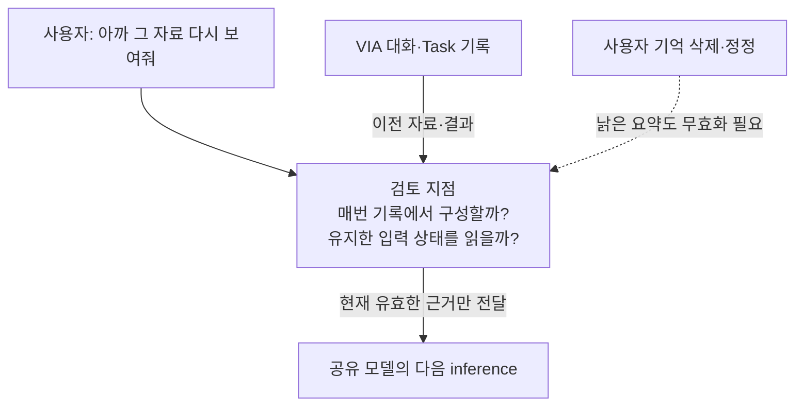
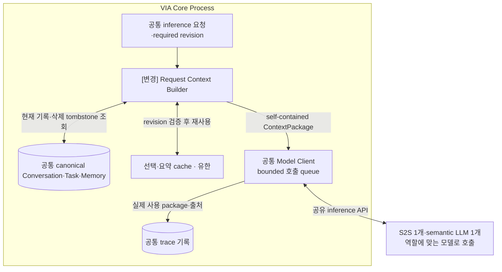
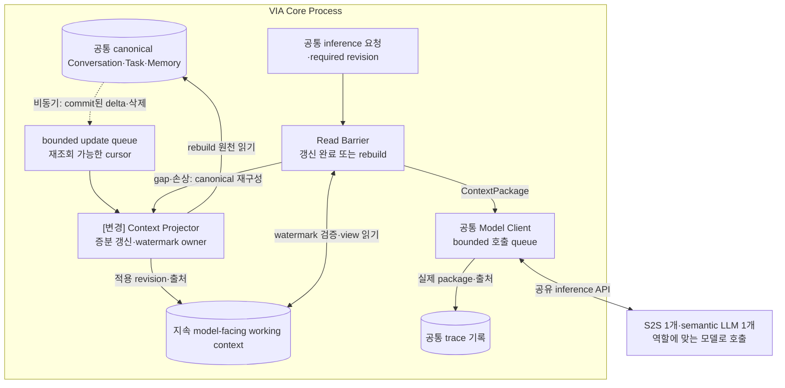

# VIA-DP-16 — 모델 입력 이력의 구성·유지 책임

> **검토 초안 v1 · 2026-09-25 · 구현 구조 상세화 / 사용자 검토 전**
>
> 질문: 매 요청 canonical 기록에서 모델 입력을 구성할 것인가, 지속 working context를 갱신해 사용할 것인가?
>
> 현재 판단: 기존 CTX-DP02의 누락 축을 현행 조건으로 재구성했다. 강한 trade-off는 조건부다. 후보 문서의 완성과 QA trade-off 입증은 별개다. 실제 QA 측정은 `NOT_RUN`이며 이번 작업에서 구현·측정·새 승자 선정은 하지 않았다.

## 1. 배경 — 대화가 길어져도 아까 그 자료를 같은 의미로 기억하려면?

사용자가 여러 Task를 오가며 ‘아까 그 자료를 다시 보여줘’라고 한다. 모델에 모든 기록을 무조건 보내거나, 모델 제공자의 세션만 믿는 것은 해결책이 아니다. 필요한 이력·결과·삭제 상태를 어떤 VIA Component가 매번 준비하고 유지하는지 정해야 한다.

배경의 검토 지점은 추가 Component가 아니다. VIA는 Voice·Text·화면 interaction과 Task 연결을 소유한다. 실제 업무 계획·도구 실행은 외부 Downstream Agent의 책임이고 모델은 추론 dependency다.

## 2. 비교 범위와 공통 조건

대상은 모델에 전달할 Conversation·Task 이력의 정상 구성 경로다. 원천 자료의 허용 read-set은 VIA-DP-05, Source 값 변환은 17, 모델 연결 수명은 10이다. 같은 canonical 기록·선택 규칙·context limit·삭제·출처 조건을 둔다. working context는 VIA가 소유하는 model-facing 파생 상태이지 모델 복제나 외부 provider의 유일한 기억이 아니다.

**모델 불변식:** S2S 모델 1개 + semantic LLM 1개. Component·Task별 모델을 별도 적재하지 않는다. 프롬프트·세션·호출을 나눠도 공유 모델이며 동시 처리·취소 지원을 임의 가정하지 않는다.

**그림의 구현 수준:** VIA Core Process는 A/B 공통 비교용 배치다. Process 격리는 VIA-DP-11의 별도 축이며 외부 Agent는 양쪽 모두 별도 Runtime이다. 실선은 라벨의 호출·반환·저장, 점선은 비동기 event다. 메모리 queue 수락과 디스크 commit을 구별하며 별도 message bus 제품은 가정하지 않는다. queue 용량·포화 정책은 추후 동일 조건으로 동결한다. 이 구조도는 후보 명세이며 구현 완료 증거가 아니다.

**출처와 한계:** [시스템 경계](../01-system-mission-and-boundary.md), [UC](../05-representative-use-cases.md), [공통 조건](../06-fixed-assumptions.md), [현행 QA](../08-quality-attributes/quality-model.md)가 요구의 기준이다. 아래 구조는 그 요구를 만족시키려는 후보 설계다. 실제 지연·오류 빈도·변경 요소 ledger는 미확인이다.

## 3. 대안 A — 요청별 재구성 + version 검증 cache

각 inference 시점에 canonical 기록의 현재 revision으로 입력 명세를 구성한다. 선택·요약 결과를 cache할 수 있지만 유효성을 요청 시 검증한다. 독립 호출을 설명하기 쉽고 상시 동기화 owner가 필요 없지만 요청 경로에 기록 조회·조합 비용이 남을 수 있다.

**실제 호출·상태·실패 처리 순서**

1. Client 호출 전에 Builder가 필요한 canonical revision과 삭제 상태를 읽는다. 같은 선택 규칙으로 이력·Task 결과·참조를 구성한다.
2. 동일 revision의 cache는 재사용하고 바뀐 부분만 재계산한다. 요약에 모델이 필요하면 기존 semantic LLM을 사용하며 그 호출도 지연에 포함한다.
3. request revision이 바뀌면 늦은 package를 버린다. provider session이 사라져도 VIA 기록에서 재구성하며 별도 지속 working-state owner에 동기화를 의존하지 않는다.

## 4. 대안 B — 증분 working context + 필요 시 재구성

VIA Context Projector가 canonical 변경을 받아 working set을 갱신한다. 호출은 필요한 watermark까지 갱신된 view를 읽으며 gap·restart는 canonical 기록으로 rebuild한다. 재사용이 잦을 때 준비 비용을 앞당길 수 있지만 갱신·삭제·watermark 수명 계약이 남는다.

**실제 호출·상태·실패 처리 순서**

1. canonical commit 뒤 delta를 Projector에 전달한다. 메모리 queue가 유실돼도 cursor 이후 기록을 다시 읽을 수 있어야 한다.
2. inference는 required revision까지 적용된 working context만 읽는다. lag가 있으면 기다리거나 rebuild하며 stale 상태로 빠르게 답하지 않는다.
3. 삭제는 tombstone과 관련 요약·참조의 무효화를 함께 반영한다. provider 연결과 무관하게 VIA가 상태를 소유한다. B도 요청별 전송 package를 만들 수 있지만 그 입력의 정상 원본은 maintained working set이다.

## 5. 구조 차이·상호 배타성·Hybrid 검토

| 항목 | A | B |
| --- | --- | --- |
| 정상 입력 구성 | 요청 시 canonical revision에서 구성 | required watermark까지 갱신된 working set 소비 |
| 지속 갱신 권한 | 필수 아님; cache는 검증·폐기 가능 | Projector가 delta·삭제·복원을 책임 |
| 장애 시 | canonical에서 재구성 | working set 검증 후 필요 시 rebuild |

같은 요청에서 canonical 입력을 재구성·검증하는 책임만으로 충분하면 A, 지속 Projector가 유지한 상태와 watermark 충족이 정상 소비 계약이면 B다. cache·부분 재구성·rebuild hybrid는 각각 허용한다. A의 cache를 영구 증분 view authority로 승격하면 B다. 둘이 동일한 materialized-view 계약으로 수렴하면 이 DP는 구현 tactic 수준으로 내려야 한다.

양쪽은 같은 기능·안전 조건·자원·외부 capability를 만족하는 **서로의 steelman**이어야 한다. 동일 결정 범위에서는 **mutually exclusive**해야 한다. cache·batch·공통 library·정확성 검사·로그를 한쪽에서 금지해 차이를 만들지 않는다. 같은 강한 설계로 수렴한다면 동점 또는 보조 결정으로 남긴다.

## 6. 같은 사건을 통과시키는 사고실험

### T1. 정상 흐름과 critical path

같은 긴 대화에서 짧은 follow-up을 반복한다. A는 revision 확인과 package 조합, B는 이미 적용한 working set 읽기를 수행한다. B 갱신이 입력 전 완료됐을 때만 critical path 감소가 가능하다. A의 revision cache가 같은 일을 하면 이점이 사라진다. 동일 근거·요약 정책을 주고 한쪽에만 긴 prompt나 추가 모델을 강제하지 않는다.

### T2. 정정·실패·재연결

모델 호출 직전에 User Memory 삭제와 Task 결과가 동시에 확정된다. A는 새 revision의 입력을 만들고 B는 삭제 delta까지 적용한 watermark를 기다린다. 과거 summary에 삭제 정보가 남으면 양쪽 모두 무효화해야 한다. crash 후 B의 rebuild가 추가될 수 있지만 A의 cold cache 비용도 있다. source canonical의 권위는 두 안에서 동일하다.

### T3. 변경·연구 기록과 반례

M-03 입력 한도·M-09 이력 전달·C-04 Memory·C-06 저장 schema 변경에서 Builder/cache와 Projector/view reader의 수정 요소를 기록한다. 15건 평균은 사례 4건만으로 대체하지 않는다. trace는 당시 실제 모델 입력·원천 version을 보존한다. B의 prompt 조립 절감이 모델 prefill 절감으로 자동 연결되지 않으며 native prefix cache는 양쪽 허용한다.

## 7. 전체 19개 QA 비교

**사고실험 예상 / 실제 측정 `NOT_RUN`.** 모든 판정은 §2의 동일 조건과 T1~T3의 가설에 한정한다. 조건부 방향은 전체 metric의 실측 우세가 아니다. 시간·변경 수·장애 단위·메모리·노출은 작을수록, 성공·완전성·재현 비율은 클수록 좋다. 일부 사례의 차이를 최악 p95·전체 change pack 평균으로 확대하지 않는다.

| QA · 단일 metric | 예상 방향·크기 | 확실성 | 구조적 이유·반례 | 역할 |
| --- | --- | --- | --- | --- |
| QA-01 위임 경로 VIA 처리시간 · 최악 case p95; Agent 실행 제외 | 조건부·방향 미정 | 낮음 | 실제 Context 경로의 준비·검사 대기 [T1](#t1) | 비교 후보 |
| QA-02 직접 Voice 응답시간 · 최악 case p95 | 조건부·방향 미정 | 낮음 | Context 사용하는 direct에 한정, S2S 일반 대화는 공통 [T1](#t1) | 비교 후보 |
| QA-03 Agent 상태 Voice 전달시간 · 최악 case p95 | 비슷 예상 | 중간 | 보유 상태만 전달하면 새 Context 경로 비참여 [T1](#t1) | 회귀 |
| QA-04 음성 중단시간 · 최악 case p95 | 비슷 | 중간 | 실제 playback 중단은 Context 처리 완료를 기다리지 않음 [T2](#t2) | 회귀 |
| QA-05 Task 제어 응답시간 · 최악 control case p95 | 조건부·방향 미정 | 낮음 | 제어 대상의 Context가 실제 필요할 때 [T2](#t2) | 비교 후보 |
| QA-11 전체 요청 처리 정확도 · case별 strict 성공률 평균 | 판단 근거 부족 | 낮음 | 입력 보존·삭제·정정의 전체 corpus 결과 필요 [T2](#t2) | 필수 검증 |
| QA-12 의미 해석 정확도 · strict 성공 run 비율 | 비슷 예상·모델 검증 필요 | 낮음 | 동일 필수 근거 보존, 표현 효과는 미측정 [T1](#t1) | 필수 검증 |
| QA-13 Task·Interaction 연결 정확도 · strict 성공 run 비율 | 비슷 예상 | 중간 | 공통 Request·Task identity와 revision [T2](#t2) | 필수 회귀 |
| QA-14 비동기 상태 수렴 · strict 성공 run 비율 | 비슷 예상 | 중간 | Agent 상태 전이 규칙은 고정 [T2](#t2) | 회귀 |
| QA-15 대화·Task 연속성 · 성공 scenario 비율 | 비슷 예상 | 중간 | 필요한 과거 근거·삭제 의미를 양쪽 보존 [T2](#t2) | 필수 검증 |
| QA-21 Agent 변경 영향 · 9개 변화의 변경 요소 평균 | 비슷 예상 | 중간 | 외부 Agent 의미·transport 경계 고정 [T3](#t3) | 전체 ledger 확인 |
| QA-22 Model·Context·State 변경 영향 · 15개 변화의 변경 요소 평균 | 조건부·방향 미정 | 낮음 | M·C 전체 15건의 실제 변경 owner·reader [T3](#t3) | 비교 후보 |
| QA-23 실험·로그 변경 영향 · 5개 변화의 변경 요소 평균 | 판단 근거 부족 | 낮음 | 공통 trace API 이후 실제 producer·reader 변경 [T3](#t3) | ledger 확인 |
| QA-31 올바른 Task 복구시간 · 최악 fault p95 | 조건부·방향 미정 | 낮음 | 영향 Task에 필요한 Context 복원만 포함 [T2](#t2) | 비교 후보 |
| QA-32 불필요한 장애 영향 · 초과 중단 단위 최대 수 | 비슷 예상 | 중간 | 논리 Component 분리는 Process containment가 아님 [T2](#t2) | 회귀 |
| QA-41 PC 메모리 · 최악 workload의 peak p95 | 판단 근거 부족 | 낮음 | 모델 복제 없음, buffer·cache 수명만으로 크기 단정 불가 [T1](#t1) | 자원 확인 |
| QA-51 보호정보 초과 노출 · 초과 단위 수 | 비슷 예상 | 중간 | 동일 목적·수신자·철회와 최소 범위 [T2](#t2) | 필수 회귀 |
| QA-61 실행 trace 완전성 · 완전한 trace run 비율 | 비슷 예상 | 중간 | 실제 소비 값·version·출처를 양쪽 기록 [T3](#t3) | 필수 회귀 |
| QA-62 평가 재현성 · 동일 결과 재계산 비율 | 비슷 예상 | 중간 | 저장된 입력·manifest·분석기 보존 [T3](#t3) | 필수 회귀 |

QA-11과 QA-12~15는 통합 결과와 원인 지표이므로 중복 합산하지 않는다. QA-41은 제품 메모리 상한·중요한 구조 차이가 미확인이라 자원 확인 대상으로 유지하며 핵심 ASR 우선 추천에서는 제외한다. 이 표의 관련성만으로 ASR을 확정하지 않는다.

## 8. 공정한 검증 계획 — 실행하지 않음

반복 follow-up·Task 전환·삭제·delta 누락·rebuild와 cold/warm cache를 같은 입력에 포함한다. required revision·projector watermark·실제 모델 package를 비교하고 원천보다 오래된 입력을 성공으로 채점하지 않는다.

동일 입력·외부 사건·모델 설정·총 자원을 사용하고 이 DP만 바꾼다. 실제 Voice audible endpoint, 실패·timeout 포함, 반복·집계·target·동점 기준을 결과 전에 동결한다. 잘못된 대상 Action·중복 Action·무효 승인·무단 접근은 점수로 상쇄하지 않는다. 모델 replay는 실제 의미 정확도 측정이 아니다. 근거 계약은 [공통 검토 절차](./dp-review-protocol.md), [event 경계](../11-measurement/event-boundary-contract.md), [QA catalog](../08-quality-attributes/quality-model.md)를 따른다.

## 9. 다른 DP·변경 비용·구현 근거

VIA-DP-05의 read-set 확장, 08의 canonical 복구, 10의 provider session과 독립이다. 전환에는 working view schema·cursor·삭제 이행과 cache 무효화가 필요하다. 구조 수준 후보이며 두 제품 경로 구현과 현행 측정은 NOT_IMPLEMENTED / NOT_RUN이다.

## 10. 현재 판단과 재검토 조건

모델 입력의 상태 수명이라는 누락 질문을 보존한다. B의 선행 갱신 이점이 A의 강한 cache와 비교해 남는지, 변경·복구 부담이 반대 방향인지 확인하기 전 최종 주요 DP로 확정하지 않는다.

## 11. 자체 검토에서 반영한 개선점

지속 Context를 Task별 모델 적재로 오해하지 않도록 했다. B에도 canonical rebuild를 허용하고 A에도 cache를 허용했다. 삭제·watermark를 빼서 B를 빠르게 만드는 비교를 금지했다.

이 검토는 문서·사고실험이며 외부 심사나 후보 QA 검증 통과가 아니다. 옛 번호는 [요약의 추적성 부록](./dp-executive-summary.md#legacy-mapping)에만 연결하고, 현재 설명은 이 VIA-DP와 현행 QA 번호로 완결한다.
