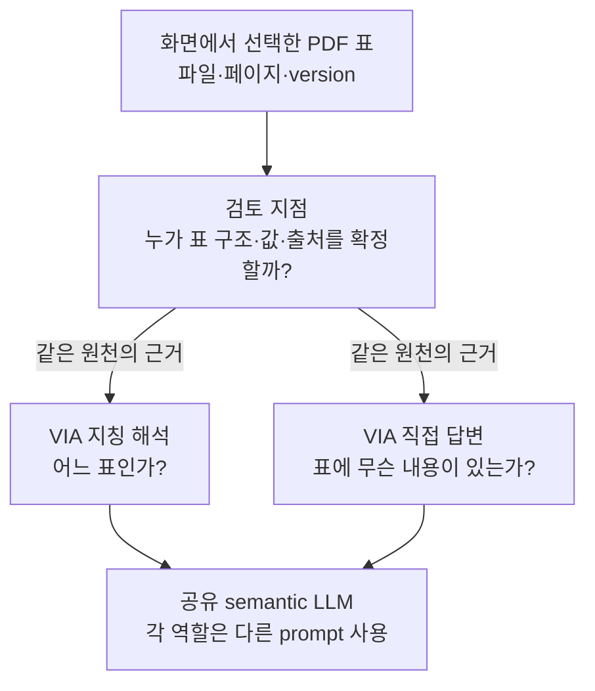
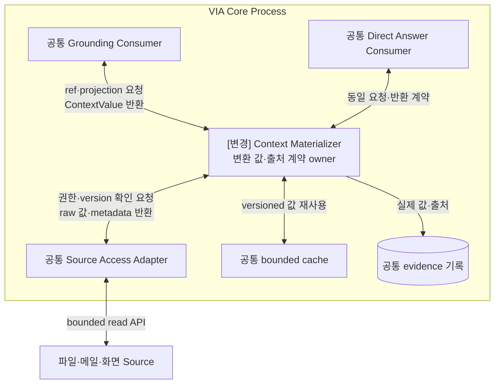
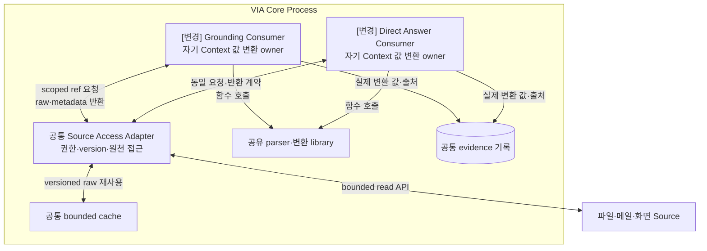

# VIA-DP-17 — Source를 소비 가능한 Context로 만드는 책임

> **검토 초안 v1 · 2026-09-25 · 구현 구조 상세화 / 사용자 검토 전**
>
> 질문: 공통 Context service가 의미 있는 값을 만들어 제공할 것인가, 소비자가 scoped reference를 해석해 자기 입력을 만들 것인가?
>
> 현재 판단: 기존 CTX-DP01의 변환 책임을 VIA-DP-05와 분리해 보완한 후보이며 양방향 trade-off는 미확인이다. 후보 문서의 완성과 QA trade-off 입증은 별개다. 실제 QA 측정은 `NOT_RUN`이며 이번 작업에서 구현·측정·새 승자 선정은 하지 않았다.

## 1. 배경 — 같은 PDF 표를 요청 이해와 답변 생성이 함께 쓰려면?

화면에서 고른 PDF 표는 곧바로 모델 입력이 아니다. 파일·구간·version을 확인하고 표의 내용·출처를 보존해 소비 가능한 값으로 만들어야 한다. 그 책임을 공통 service가 질 것인지, 지칭 해석·직접 답변 같은 소비자가 질 것인지에 따라 계약과 변경 위치가 달라진다.

배경의 검토 지점은 추가 Component가 아니다. VIA는 Voice·Text·화면 interaction과 Task 연결을 소유한다. 실제 업무 계획·도구 실행은 외부 Downstream Agent의 책임이고 모델은 추론 dependency다.

## 2. 비교 범위와 공통 조건

대상은 Source reference에서 소비 가능한 내용·구조·provenance를 만드는 최종 계약이다. 어떤 자료를 읽을지의 집합은 VIA-DP-05로 동일하게 고정한다. domain reasoning·open-ended 조사는 제외한다. 같은 parser·원천 version·권한·최소 정보·cache를 허용한다. 추가 OCR·embedding·helper 모델은 없으며 필요 기능은 두 고정 모델과 실제 source 기능으로 충족 가능한지 확인한다.

**모델 불변식:** S2S 모델 1개 + semantic LLM 1개. Component·Task별 모델을 별도 적재하지 않는다. 프롬프트·세션·호출을 나눠도 공유 모델이며 동시 처리·취소 지원을 임의 가정하지 않는다.

**그림의 구현 수준:** VIA Core Process는 A/B 공통 비교용 배치다. Process 격리는 VIA-DP-11의 별도 축이며 외부 Agent는 양쪽 모두 별도 Runtime이다. 실선은 라벨의 호출·반환·저장, 점선은 비동기 event다. 메모리 queue 수락과 디스크 commit을 구별하며 별도 message bus 제품은 가정하지 않는다. queue 용량·포화 정책은 추후 동일 조건으로 동결한다. 이 구조도는 후보 명세이며 구현 완료 증거가 아니다.

**출처와 한계:** [시스템 경계](../01-system-mission-and-boundary.md), [UC](../05-representative-use-cases.md), [공통 조건](../06-fixed-assumptions.md), [현행 QA](../08-quality-attributes/quality-model.md)가 요구의 기준이다. 아래 구조는 그 요구를 만족시키려는 후보 설계다. 실제 지연·오류 빈도·변경 요소 ledger는 미확인이다.

## 3. 대안 A — 공통 materializer + 소비자별 projection

Context Service가 Source 변환과 version·출처 검증을 소유하고 소비자별 필요한 값만 제공한다. lazy 읽기·공유 cache·projection을 허용하는 hybrid다. Source 변화의 집중 흡수가 이유이며 소비자별 형식 요구를 공통 계약에서 수용하는 비용이 있다.

**실제 호출·상태·실패 처리 순서**

1. 소비자는 ref/version과 필요한 projection을 Materializer에 요청한다. Service가 공통 Source Adapter로 자료를 읽고 parser·정규화 코드로 값을 만든다.
2. 값·원천 구간·version을 묶어 전달한다. 큰 원문을 무조건 복사하지 않고 같은 cache의 lazy slice를 허용한다. 소비자가 받은 값을 자기 prompt에 배치하는 것은 source 변환 책임과 구별한다.
3. source 소멸·권한 철회·형식 오류는 명시적 결과로 반환한다. 같은 공유 LLM을 추가로 호출한 변환이 있다면 그 호출·대기·오류도 service 책임이다.

## 4. 대안 B — 공통 접근 handle + 소비자 소유 변환

공통 계층은 안전한 source 접근·identity·version을 제공하고 각 소비자가 자기 입력 값의 변환 계약을 소유한다. parser library·cache를 공유해 코드 복제를 피한다. 소비자 특수 요구를 독립 변경할 수 있지만 여러 소비자에 source 의미 변화가 전파될 수 있다.

**실제 호출·상태·실패 처리 순서**

1. Consumer가 scoped reference로 공통 Adapter에 원천을 요청한다. 임의 OS·메일 API를 직접 우회 호출하는 안이 아니다.
2. 각 Consumer가 공유 library를 호출해 자기 입력을 만든다. 공통 library가 있어도 최종 projection 의미·출처 검사의 책임은 해당 Consumer에 있다.
3. 정정·철회 후 늦은 변환은 request/source revision으로 무효화한다. 모든 소비자가 동일한 ContextValue service 결과만 수용하도록 바꾸면 A가 된다.

## 5. 구조 차이·상호 배타성·Hybrid 검토

| 항목 | A | B |
| --- | --- | --- |
| 소비 계약 | service가 확정한 ContextValue | scoped raw reference·metadata |
| 값 의미·변환 책임 | 공통 Materializer | 소비자별 owner |
| 공통 최적화 | lazy projection·cache·library | 동일 허용 |

같은 소비 값의 source 해석·version/provenance 계약을 service가 확정하면 A, 소비자가 resolve 이후 책임지면 B다. snapshot 대 handle이라는 데이터 모양만으로 구별하지 않는다. A도 handle로 지연 전달할 수 있다. B의 shared resolver가 최종 값을 소유하는 살아 있는 service가 되면 A로 이동한다. VIA-DP-05의 닫힌/열린 read-set과는 독립 조합 가능하다.

양쪽은 같은 기능·안전 조건·자원·외부 capability를 만족하는 **서로의 steelman**이어야 한다. 동일 결정 범위에서는 **mutually exclusive**해야 한다. cache·batch·공통 library·정확성 검사·로그를 한쪽에서 금지해 차이를 만들지 않는다. 같은 강한 설계로 수렴한다면 동점 또는 보조 결정으로 남긴다.

## 6. 같은 사건을 통과시키는 사고실험

### T1. 정상 흐름과 critical path

같은 PDF 표를 Grounding과 Direct Answer가 연달아 쓴다. A는 공통 변환 값을 재사용하고 B도 공유 library·cache로 중복 parse를 피할 수 있다. A의 service 호출 비용과 B의 소비자별 계약 검사 비용만 남을 수 있어 ‘A는 복사 때문에 느림’은 근거가 없다. 모델에 전달되는 정보량과 근거 수준이 같아야 정확도를 공정하게 비교한다.

### T2. 정정·실패·재연결

문서가 갱신되고 권한이 철회된 뒤 이전 read가 완료된다. A는 Materializer에서, B는 공통 접근 검사와 소비자 final 검증에서 거절한다. 양쪽 모두 source version을 과거 값으로 보존하고 허용 범위를 검사한다. 중앙 service가 멈췄다고 필요 없는 S2S 대화까지 중단하도록 설계하면 추가 의존 문제이며 자연스러운 필수 비용이 아니다.

### T3. 변경·연구 기록과 반례

C-02 새 문서 형식과 C-03 화면 계약 변화에서 A는 Materializer·공통 값 schema, B는 library·소비자 reader를 바꾼다. A가 이미 모든 값을 표현하면 국소화되지만 새 consumer별 의미는 공통 계약 확장을 요구할 수 있다. B의 library 수정만으로 끝나면 차이가 없다. 전체 M9+C6 ledger를 작성해야 한다. 실제 소비한 최종 값과 source를 남겨 trace 누락을 막는다.

## 7. 전체 19개 QA 비교

**사고실험 예상 / 실제 측정 `NOT_RUN`.** 모든 판정은 §2의 동일 조건과 T1~T3의 가설에 한정한다. 조건부 방향은 전체 metric의 실측 우세가 아니다. 시간·변경 수·장애 단위·메모리·노출은 작을수록, 성공·완전성·재현 비율은 클수록 좋다. 일부 사례의 차이를 최악 p95·전체 change pack 평균으로 확대하지 않는다.

| QA · 단일 metric | 예상 방향·크기 | 확실성 | 구조적 이유·반례 | 역할 |
| --- | --- | --- | --- | --- |
| QA-01 위임 경로 VIA 처리시간 · 최악 case p95; Agent 실행 제외 | 조건부·방향 미정 | 낮음 | 실제 Context 경로의 준비·검사 대기 [T1](#t1) | 비교 후보 |
| QA-02 직접 Voice 응답시간 · 최악 case p95 | 조건부·방향 미정 | 낮음 | Context 사용하는 direct에 한정, S2S 일반 대화는 공통 [T1](#t1) | 비교 후보 |
| QA-03 Agent 상태 Voice 전달시간 · 최악 case p95 | 비슷 예상 | 중간 | 보유 상태만 전달하면 새 Context 경로 비참여 [T1](#t1) | 회귀 |
| QA-04 음성 중단시간 · 최악 case p95 | 비슷 | 중간 | 실제 playback 중단은 Context 처리 완료를 기다리지 않음 [T2](#t2) | 회귀 |
| QA-05 Task 제어 응답시간 · 최악 control case p95 | 조건부·방향 미정 | 낮음 | 제어 대상의 Context가 실제 필요할 때 [T2](#t2) | 비교 후보 |
| QA-11 전체 요청 처리 정확도 · case별 strict 성공률 평균 | 판단 근거 부족 | 낮음 | 입력 보존·삭제·정정의 전체 corpus 결과 필요 [T2](#t2) | 필수 검증 |
| QA-12 의미 해석 정확도 · strict 성공 run 비율 | 비슷 예상·모델 검증 필요 | 낮음 | 동일 필수 근거 보존, 표현 효과는 미측정 [T1](#t1) | 필수 검증 |
| QA-13 Task·Interaction 연결 정확도 · strict 성공 run 비율 | 비슷 예상 | 중간 | 공통 Request·Task identity와 revision [T2](#t2) | 필수 회귀 |
| QA-14 비동기 상태 수렴 · strict 성공 run 비율 | 비슷 예상 | 중간 | Agent 상태 전이 규칙은 고정 [T2](#t2) | 회귀 |
| QA-15 대화·Task 연속성 · 성공 scenario 비율 | 비슷 예상 | 중간 | 필요한 과거 근거·삭제 의미를 양쪽 보존 [T2](#t2) | 필수 검증 |
| QA-21 Agent 변경 영향 · 9개 변화의 변경 요소 평균 | 비슷 예상 | 중간 | 외부 Agent 의미·transport 경계 고정 [T3](#t3) | 전체 ledger 확인 |
| QA-22 Model·Context·State 변경 영향 · 15개 변화의 변경 요소 평균 | 조건부·방향 미정 | 낮음 | M·C 전체 15건의 실제 변경 owner·reader [T3](#t3) | 비교 후보 |
| QA-23 실험·로그 변경 영향 · 5개 변화의 변경 요소 평균 | 판단 근거 부족 | 낮음 | 공통 trace API 이후 실제 producer·reader 변경 [T3](#t3) | ledger 확인 |
| QA-31 올바른 Task 복구시간 · 최악 fault p95 | 조건부·방향 미정 | 낮음 | 영향 Task에 필요한 Context 복원만 포함 [T2](#t2) | 비교 후보 |
| QA-32 불필요한 장애 영향 · 초과 중단 단위 최대 수 | 비슷 예상 | 중간 | 논리 Component 분리는 Process containment가 아님 [T2](#t2) | 회귀 |
| QA-41 PC 메모리 · 최악 workload의 peak p95 | 판단 근거 부족 | 낮음 | 모델 복제 없음, buffer·cache 수명만으로 크기 단정 불가 [T1](#t1) | 자원 확인 |
| QA-51 보호정보 초과 노출 · 초과 단위 수 | 비슷 예상 | 중간 | 동일 목적·수신자·철회와 최소 범위 [T2](#t2) | 필수 회귀 |
| QA-61 실행 trace 완전성 · 완전한 trace run 비율 | 비슷 예상 | 중간 | 실제 소비 값·version·출처를 양쪽 기록 [T3](#t3) | 필수 회귀 |
| QA-62 평가 재현성 · 동일 결과 재계산 비율 | 비슷 예상 | 중간 | 저장된 입력·manifest·분석기 보존 [T3](#t3) | 필수 회귀 |

QA-11과 QA-12~15는 통합 결과와 원인 지표이므로 중복 합산하지 않는다. QA-41은 제품 메모리 상한·중요한 구조 차이가 미확인이라 자원 확인 대상으로 유지하며 핵심 ASR 우선 추천에서는 제외한다. 이 표의 관련성만으로 ASR을 확정하지 않는다.

## 8. 공정한 검증 계획 — 실행하지 않음

동일 source·parser 기능·read-set·권한으로 두 Consumer가 같은 값을 사용하게 한다. lazy/cached/uncached, version 변경, source 소멸, 철회, 형식 확장의 actual ledger를 결과 전에 고정한다. wire 크기나 함수 수만으로 대표 QA를 대신하지 않는다.

동일 입력·외부 사건·모델 설정·총 자원을 사용하고 이 DP만 바꾼다. 실제 Voice audible endpoint, 실패·timeout 포함, 반복·집계·target·동점 기준을 결과 전에 동결한다. 잘못된 대상 Action·중복 Action·무효 승인·무단 접근은 점수로 상쇄하지 않는다. 모델 replay는 실제 의미 정확도 측정이 아니다. 근거 계약은 [공통 검토 절차](./dp-review-protocol.md), [event 경계](../11-measurement/event-boundary-contract.md), [QA catalog](../08-quality-attributes/quality-model.md)를 따른다.

## 9. 다른 DP·변경 비용·구현 근거

VIA-DP-05는 읽기 집합, 06은 의미 판단, 16은 대화 이력 working state이며 이 문서는 source 값 변환 owner다. A↔B 이행에는 ContextValue schema·소비자 reader·provenance·cache 호환이 필요하다. 현재 양쪽 제품 경로 구현·QA 측정은 NOT_IMPLEMENTED / NOT_RUN이다.

## 10. 현재 판단과 재검토 조건

과거 CTX-DP01을 VIA-DP-05와 같다고 축약하면 owner 축이 누락되므로 따로 수록한다. 실제 차이가 전달 형식·library 배치에만 남으면 보조 계약으로 분류하며 억지 DP 승격은 하지 않는다.

## 11. 자체 검토에서 반영한 개선점

snapshot/handle 조합 가능성을 인정하고 값 변환 책임으로 대안을 다시 정의했다. privacy·정확도를 한쪽의 필연적 약점으로 만들지 않았고 추가 모델을 전제하지 않았다.

이 검토는 문서·사고실험이며 외부 심사나 후보 QA 검증 통과가 아니다. 옛 번호는 [이력·누락 점검](./legacy-dp-mapping.md)에만 연결하고, 현재 설명은 이 VIA-DP와 현행 QA 번호로 완결한다.
