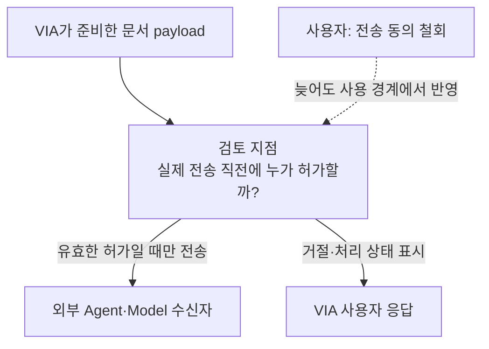
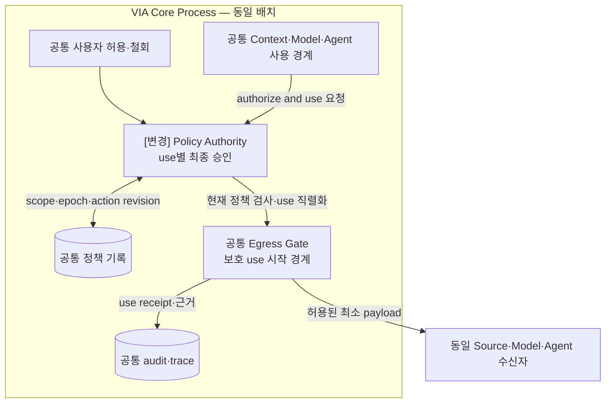
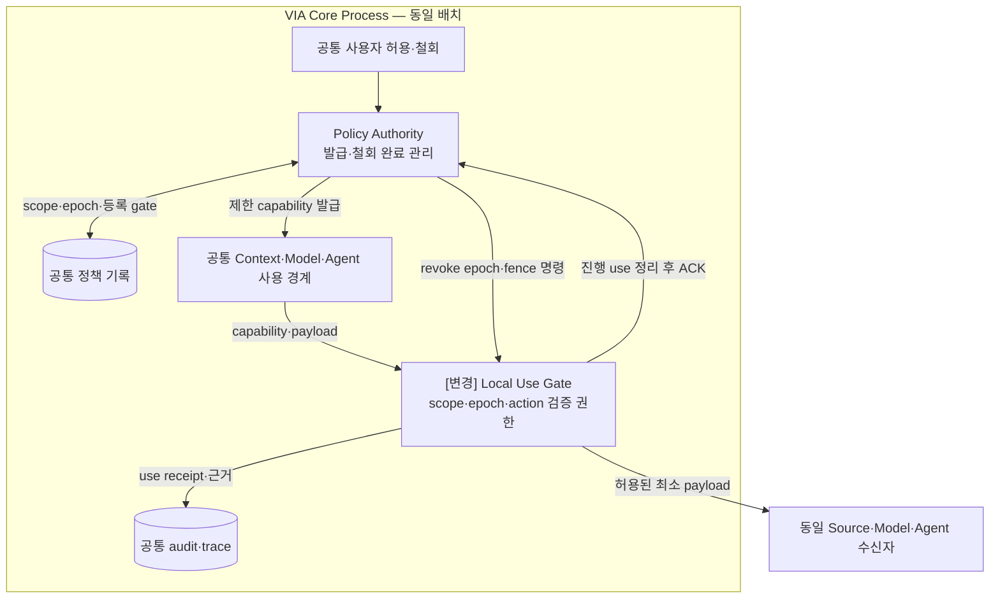

# VIA-DP-18 — 보호정보·Action 사용 시 권한을 확인하는 위치

> **검토 초안 v1 · 2026-09-25 · 구현 구조 상세화 / 사용자 검토 전**
>
> 질문: 각 protected use를 정책 authority가 승인할 것인가, 철회 가능한 제한 권한을 사용 경계가 검증할 것인가?
>
> 현재 판단: 기존 SEC-DP01 누락 방지용 후보다. Privacy 범위·QA 수를 확대하지 않으며 최종 주요 DP 채택을 미리 권하지 않는다. 후보 문서의 완성과 QA trade-off 입증은 별개다. 실제 QA 측정은 `NOT_RUN`이며 이번 작업에서 구현·측정·새 승자 선정은 하지 않았다.

## 1. 배경 — 동의를 철회한 순간 이미 준비된 요청은 누가 막을까?

사용자가 특정 문서를 Agent에 보내도록 허용했다가 전송 전에 철회한다. VIA는 이미 준비한 payload나 캐시된 허가를 이유로 전송해서는 안 된다. 동일 안전 기준 아래 실제 사용 순간의 검사를 중앙 authority가 할지, 제한 권한을 가진 경계가 할지 정해야 한다.

배경의 검토 지점은 추가 Component가 아니다. VIA는 Voice·Text·화면 interaction과 Task 연결을 소유한다. 실제 업무 계획·도구 실행은 외부 Downstream Agent의 책임이고 모델은 추론 dependency다.

## 2. 비교 범위와 공통 조건

기존 보호정보·consent·Action revision 요구만 다룬다. 새 privacy metric·새 보안 기능 요구를 만들지 않는다. QA-51과 무단 접근·무효 승인 0 위반 조건은 양쪽 동일하다. capability는 scope·destination·action revision·epoch·만료에 묶인 제한 권한이며 단순 bearer token이 아니다. 같은 PC 내부 배치에서 비교하고 중앙 승인에 원격 네트워크나 LLM을 강제하지 않는다.

**모델 불변식:** S2S 모델 1개 + semantic LLM 1개. Component·Task별 모델을 별도 적재하지 않는다. 프롬프트·세션·호출을 나눠도 공유 모델이며 동시 처리·취소 지원을 임의 가정하지 않는다.

**그림의 구현 수준:** VIA Core Process는 A/B 공통 비교용 배치다. Process 격리는 VIA-DP-11의 별도 축이며 외부 Agent는 양쪽 모두 별도 Runtime이다. 실선은 라벨의 호출·반환·저장, 점선은 비동기 event다. 메모리 queue 수락과 디스크 commit을 구별하며 별도 message bus 제품은 가정하지 않는다. queue 용량·포화 정책은 추후 동일 조건으로 동결한다. 이 구조도는 후보 명세이며 구현 완료 증거가 아니다.

**출처와 한계:** [시스템 경계](../01-system-mission-and-boundary.md), [UC](../05-representative-use-cases.md), [공통 조건](../06-fixed-assumptions.md), [현행 QA](../08-quality-attributes/quality-model.md)가 요구의 기준이다. 아래 구조는 그 요구를 만족시키려는 후보 설계다. 실제 지연·오류 빈도·변경 요소 ledger는 미확인이다.

## 3. 대안 A — 사용마다 중앙 승인 + 사전 준비 cache

payload 준비·정책 계산을 미리 할 수 있지만 실제 protected use는 중앙 authority가 current policy로 승인해야 한다. 철회 상태가 한곳에서 판단되는 이점과 실제 사용 경계의 호출·직렬화 책임이 있다.

**실제 호출·상태·실패 처리 순서**

1. 사용 경계가 payload·목적·수신자·action revision을 Authority에 제시한다. 계산 cache는 허용하지만 사용마다 현재 epoch로 최종 승인한다.
2. 승인과 실제 use 사이의 철회 경쟁을 막기 위해 같은 use gate에서 시작 순서를 직렬화한다. 단순 ‘승인=true’ 값을 오래 보관해 나중에 쓰지 않는다.
3. 철회 완료는 진행 중 use의 정의된 경계와 순서를 기록한 뒤 알린다. 이미 외부에 전송된 정보를 되돌릴 수 있다고 주장하지 않는다. authority 불가 시 protected use는 fail closed하며 무관한 일반 대화까지 차단하지 않는다.

## 4. 대안 B — 철회 가능한 capability + 로컬 use gate

중앙 authority가 제한 capability를 발급하고 각 사용 경계가 현재 로컬 epoch·scope를 검증한다. 새 발급·범위 확대는 중앙에서 처리하는 hybrid다. 반복 use의 개별 승인 호출을 줄이는 대신 capability·revocation barrier·복구 계약을 유지한다.

**실제 호출·상태·실패 처리 순서**

1. Authority가 scope·destination·action revision·epoch·만료가 있는 capability를 발급한다. Gate는 매 use마다 이 조건과 자기 최신 epoch를 로컬에서 검증한다.
2. 철회 시 Authority가 모든 관련 gate에 fence를 보내고 use 경계를 정리한 ACK를 받는다. 철회 완료 이전 진행 use와 이후 금지 use를 같은 규칙으로 양쪽 평가한다. gate 단절·epoch 불확실이면 protected use를 멈춘다.
3. 재시작 gate는 옛 capability를 바로 사용하지 않고 epoch를 동기화한다. TTL만으로 철회를 대신하지 않는다. 사용마다 중앙 승인 여부를 확인해야만 안전하다면 이 B는 A로 수렴한다.

## 5. 구조 차이·상호 배타성·Hybrid 검토

| 항목 | A | B |
| --- | --- | --- |
| protected use의 최종 승인 | 매번 중앙 authority | 유효 capability·epoch를 가진 local gate |
| 철회 처리 | 중앙 use 순서·현재 정책 | 등록 gate fence·ACK barrier |
| 공통 | 최소 scope·action binding·audit·fail closed | 동일 |

유효 capability가 있어도 같은 use마다 중앙 최종 승인이 필수면 A, 로컬 검증만으로 실행 가능하면 B다. 사전 계산·제한된 준비 권한과 마지막 중앙 승인을 결합한 hybrid를 A에 포함했다. 마지막 승인까지 없애는 대등한 B에는 중앙 발급·로컬 검증·철회 barrier를 허용한다. A가 반복 use를 포괄 권한만으로 허용하면 B로 이동한다. 같은 use의 최종 승인 권한은 둘 중 하나여야 한다.

양쪽은 같은 기능·안전 조건·자원·외부 capability를 만족하는 **서로의 steelman**이어야 한다. 동일 결정 범위에서는 **mutually exclusive**해야 한다. cache·batch·공통 library·정확성 검사·로그를 한쪽에서 금지해 차이를 만들지 않는다. 같은 강한 설계로 수렴한다면 동점 또는 보조 결정으로 남긴다.

## 6. 같은 사건을 통과시키는 사고실험

### T1. 정상 흐름과 critical path

같은 허용 문서 조각을 같은 수신자에 반복 제공한다. A는 use별 중앙 호출, B는 로컬 capability 검증이다. 같은 Process의 A가 짧은 함수 호출이면 차이는 작다. B도 서명·scope·epoch 검증 비용과 최초 발급 비용이 있다. 반복 use에서만 B가 빨라질 수 있으며 모델 응답이 지배하면 전체 QA-01/02는 비슷할 수 있다.

### T2. 정정·실패·재연결

payload가 준비된 후 철회가 시작된다. A는 중앙 use gate, B는 각 gate의 epoch fence와 ACK로 실행 순서를 확인한다. B가 ACK 없이 즉시 철회 완료를 알리고 옛 capability를 허용하면 정상 대안이 아니라 안전 위반이다. 단절 시 B는 fail closed한다. 이 조정이 성립하지 않는 deployment에서는 B를 낮은 privacy 점수로 비교하지 않고 부적합 처리한다.

### T3. 변경·연구 기록과 반례

A-07 인증·A-08 승인과 C-04 삭제·C-06 기록 변경에서 A는 중앙 정책/API, B는 capability schema·gate validator·revocation reader가 바뀔 수 있다. 공유 validator library를 허용해 B 수정 개수를 부풀리지 않는다. QA-51의 초과 노출은 양쪽 0을 지향하는 필수 검증이며 trade-off를 위해 위반을 허용하지 않는다. 실제 use와 철회 ACK를 trace로 연결한다.

## 7. 전체 19개 QA 비교

**사고실험 예상 / 실제 측정 `NOT_RUN`.** 모든 판정은 §2의 동일 조건과 T1~T3의 가설에 한정한다. 조건부 방향은 전체 metric의 실측 우세가 아니다. 시간·변경 수·장애 단위·메모리·노출은 작을수록, 성공·완전성·재현 비율은 클수록 좋다. 일부 사례의 차이를 최악 p95·전체 change pack 평균으로 확대하지 않는다.

| QA · 단일 metric | 예상 방향·크기 | 확실성 | 구조적 이유·반례 | 역할 |
| --- | --- | --- | --- | --- |
| QA-01 위임 경로 VIA 처리시간 · 최악 case p95; Agent 실행 제외 | 조건부 B 유리 가능·크기 미정 | 낮음 | 반복 protected use의 중앙 호출 회피 시 [T1](#t1) | 비교 후보 |
| QA-02 직접 Voice 응답시간 · 최악 case p95 | 조건부 B 유리 가능·크기 미정 | 낮음 | protected Context 사용 direct에 한정 [T1](#t1) | 비교 후보 |
| QA-03 Agent 상태 Voice 전달시간 · 최악 case p95 | 비슷 예상 | 중간 | 보유 상태만 전달하면 새 Context 경로 비참여 [T1](#t1) | 회귀 |
| QA-04 음성 중단시간 · 최악 case p95 | 비슷 | 중간 | 실제 playback 중단은 Context 처리 완료를 기다리지 않음 [T2](#t2) | 회귀 |
| QA-05 Task 제어 응답시간 · 최악 control case p95 | 조건부·방향 미정 | 낮음 | action binding·철회 barrier가 control에 참여할 때 [T2](#t2) | 비교 후보 |
| QA-11 전체 요청 처리 정확도 · case별 strict 성공률 평균 | 판단 근거 부족 | 낮음 | 입력 보존·삭제·정정의 전체 corpus 결과 필요 [T2](#t2) | 필수 검증 |
| QA-12 의미 해석 정확도 · strict 성공 run 비율 | 비슷 | 중간 | 의미 모델·근거는 고정 [T1](#t1) | 회귀 |
| QA-13 Task·Interaction 연결 정확도 · strict 성공 run 비율 | 비슷 예상 | 중간 | 공통 Request·Task identity와 revision [T2](#t2) | 필수 회귀 |
| QA-14 비동기 상태 수렴 · strict 성공 run 비율 | 비슷 예상 | 중간 | Agent 상태 전이 규칙은 고정 [T2](#t2) | 회귀 |
| QA-15 대화·Task 연속성 · 성공 scenario 비율 | 비슷 예상 | 중간 | 필요한 과거 근거·삭제 의미를 양쪽 보존 [T2](#t2) | 필수 검증 |
| QA-21 Agent 변경 영향 · 9개 변화의 변경 요소 평균 | 조건부·방향 미정 | 낮음 | A-07/08 포함 전체 9건의 승인 계약 변경 [T3](#t3) | 비교 후보 |
| QA-22 Model·Context·State 변경 영향 · 15개 변화의 변경 요소 평균 | 조건부·방향 미정 | 낮음 | 중앙 policy와 capability·epoch 소비자 변경 [T3](#t3) | 비교 후보 |
| QA-23 실험·로그 변경 영향 · 5개 변화의 변경 요소 평균 | 판단 근거 부족 | 낮음 | 공통 trace API 이후 실제 producer·reader 변경 [T3](#t3) | ledger 확인 |
| QA-31 올바른 Task 복구시간 · 최악 fault p95 | 조건부·방향 미정 | 낮음 | 실제 영향 Task의 epoch·허용 control 복구 [T2](#t2) | 비교 후보 |
| QA-32 불필요한 장애 영향 · 초과 중단 단위 최대 수 | 비슷 예상 | 중간 | 논리 Component 분리는 Process containment가 아님 [T2](#t2) | 회귀 |
| QA-41 PC 메모리 · 최악 workload의 peak p95 | 판단 근거 부족 | 낮음 | 모델 복제 없음, buffer·cache 수명만으로 크기 단정 불가 [T1](#t1) | 자원 확인 |
| QA-51 보호정보 초과 노출 · 초과 단위 수 | 비슷 예상·위반 허용 안 함 | 중간 | 같은 철회·scope·destination 계약 [T2](#t2) | 필수 회귀 |
| QA-61 실행 trace 완전성 · 완전한 trace run 비율 | 비슷 예상 | 중간 | 실제 소비 값·version·출처를 양쪽 기록 [T3](#t3) | 필수 회귀 |
| QA-62 평가 재현성 · 동일 결과 재계산 비율 | 비슷 예상 | 중간 | 저장된 입력·manifest·분석기 보존 [T3](#t3) | 필수 회귀 |

QA-11과 QA-12~15는 통합 결과와 원인 지표이므로 중복 합산하지 않는다. QA-41은 제품 메모리 상한·중요한 구조 차이가 미확인이라 자원 확인 대상으로 유지하며 핵심 ASR 우선 추천에서는 제외한다. 이 표의 관련성만으로 ASR을 확정하지 않는다.

## 8. 공정한 검증 계획 — 실행하지 않음

protected use 시작·철회 요청·fence 적용·ACK·사용자 완료 시점을 같은 선형화 계약으로 동결한다. scope·destination·action revision 불일치, gate 단절·재시작·늦은 capability를 확인한다. TTL 기간의 무단 사용을 정상 정확도 손실로 계산하지 않는다.

동일 입력·외부 사건·모델 설정·총 자원을 사용하고 이 DP만 바꾼다. 실제 Voice audible endpoint, 실패·timeout 포함, 반복·집계·target·동점 기준을 결과 전에 동결한다. 잘못된 대상 Action·중복 Action·무효 승인·무단 접근은 점수로 상쇄하지 않는다. 모델 replay는 실제 의미 정확도 측정이 아니다. 근거 계약은 [공통 검토 절차](./dp-review-protocol.md), [event 경계](../11-measurement/event-boundary-contract.md), [QA catalog](../08-quality-attributes/quality-model.md)를 따른다.

## 9. 다른 DP·변경 비용·구현 근거

VIA-DP-04는 응답 게시 권한이며 보호 use authorization과 다르다. 05의 Context capability도 이 정책을 소비하는 조회 권한이지 철회 정책의 최종 authority는 아니다. 09·11의 Agent 계약·Process 배치를 동일하게 고정한다. 이행에는 capability 폐기·epoch·gate 등록·audit reader의 호환이 필요하다. 제품 구현·현행 QA 측정은 NOT_IMPLEMENTED / NOT_RUN이다.

## 10. 현재 판단과 재검토 조건

기존 후보를 빠뜨리지 않기 위한 별도 보고서로 유지한다. Privacy를 확대하거나 최종 ASR에 추가하자는 제안이 아니다. 동일 철회 보장을 실현한 뒤 use latency와 변경·회복 부담의 반대 방향 효과가 남는지 확인해야 한다.

## 11. 자체 검토에서 반영한 개선점

철회 불가능한 bearer token을 B로 비교하지 않았다. 중앙 검사를 원격/LLM 호출로 부풀리지 않았고 새로운 보안 QA를 만들지 않았다.

이 검토는 문서·사고실험이며 외부 심사나 후보 QA 검증 통과가 아니다. 옛 번호는 [이력·누락 점검](./legacy-dp-mapping.md)에만 연결하고, 현재 설명은 이 VIA-DP와 현행 QA 번호로 완결한다.
