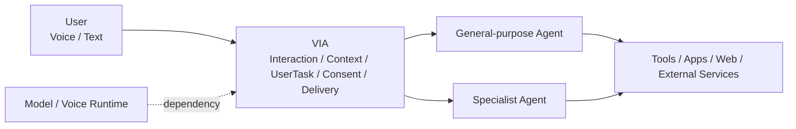
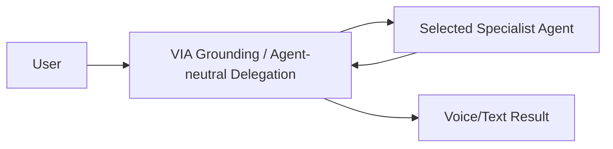
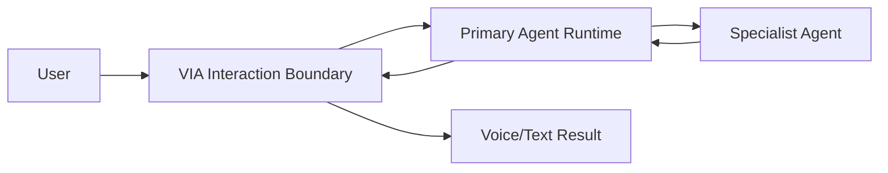
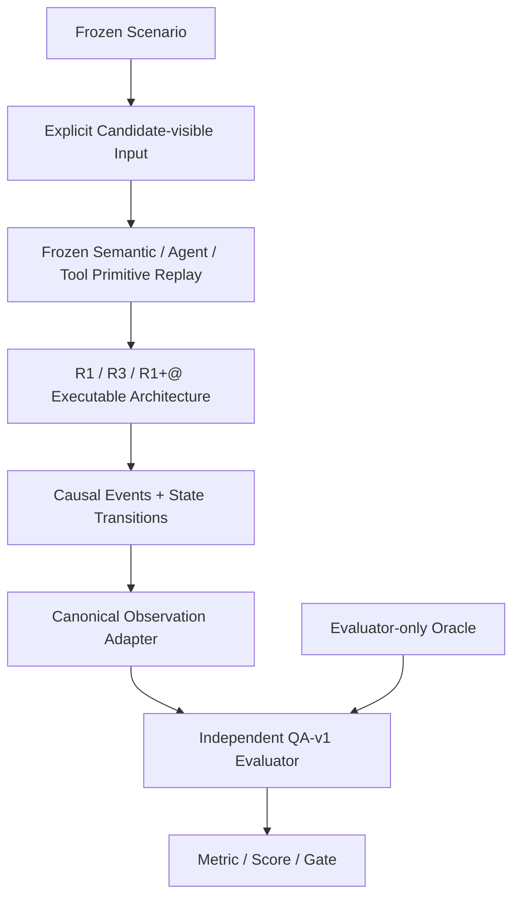
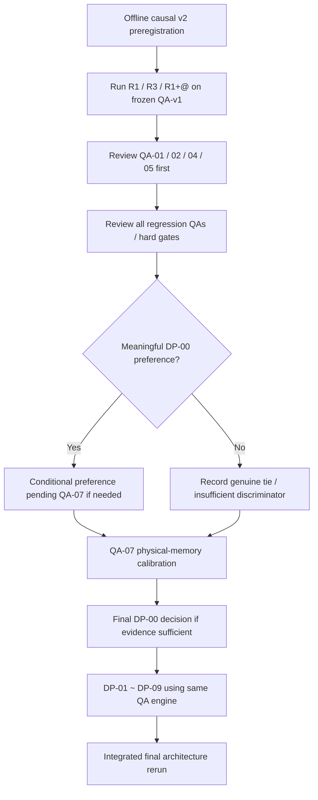

# VIA vNext Software Architecture
## Interim Architecture & Evaluation Report

> [!IMPORTANT]
> **Document Status: INTERIM / WORKING ARCHITECTURE REPORT**
>
> 이 문서는 VIA vNext의 현재 요구사항, Architecture Decision, QA 평가 체계, 측정 evidence와 open issue를 하나의 end-to-end narrative로 연결하는 **중간 Architecture Review 문서**이다. 최종 Architecture Specification이나 Accepted ADR이 아니다.
>
> **DP-00 is NOT DECIDED. Final Architecture is NOT YET SELECTED.**

| Field | Value |
| --- | --- |
| Document version | 0.4.0 |
| Status | **INTERIM / WORKING** |
| Requirements baseline | `requirements-v1.1.md` — Approved Baseline |
| vNext requirements | Working input; legacy DP/QA sections are superseded |
| Active DP catalog | vNext DP-00 ~ DP-09 |
| QA authority | QA Evaluation Contract v1 |
| Evidence cutoff | final valid v3 preregistration `1e4b868842dc5188eb9be41042364341efa44155`; campaign `dp00-executable-reference-v3-qa-v1` |
| DP-00 status | **EXECUTABLE QUALIFICATION COMPLETE EXCEPT QA-07; NO PREFERENCE** |
| Final architecture | **NOT YET SELECTED** |
| Current evaluation direction | Physical-memory calibration for QA-07, then frozen integrated rerun |
| Cloud/API use in current next phase | **Not planned** |
| Last updated | 2026-09-15 |

---

## 0. How to Read This Document

이 문서는 여러 repository artifact를 복제해서 새로운 source of truth를 만드는 것이 목적이 아니다. 기존 authoritative artifact는 그대로 유지하고, 이 문서는 **심사위원과 Architecture reviewer가 전체 설계 흐름을 한 번에 이해할 수 있도록 연결하는 통합 Review entry point** 역할을 한다.

Authority hierarchy는 다음과 같다.

```text
Approved Product / Requirement Obligations
  docs/requirements/requirements-v1.1.md
              │
              ├─ vNext working requirement inputs
              │   docs/requirements/requirements-vNext.md
              │
              ▼
Active Architecture Decisions
  docs/architecture/decision-points/catalog.md
              │
              ▼
QA Evaluation Contract v1
  docs/evaluation/qa-contracts/v1/
              │
              ▼
Frozen Corpus / Reference Environment / Evaluators
  benchmark/contracts/qa-v1/
  benchmark/analysis/qa_v1/
              │
              ▼
Measured Evidence
  results/raw/
  results/derived/
  results/reports/
              │
              ▼
Architecture Decision / ADR
  only after defensible measurement
```

문서 간 내용이 충돌할 경우 이 통합 보고서의 요약문보다 위 authoritative artifact를 우선한다. 특히 `requirements-vNext.md` 안의 historical A/B/C/D DP-00 및 pre-QA-v1 Top-QA 체계는 현재 authority가 아니다.

### Authoritative sources

- [Approved Requirements Baseline v1.1](../requirements/requirements-v1.1.md)
- [vNext Working Requirements](../requirements/requirements-vNext.md)
- [Active vNext Decision Point Catalog](decision-points/catalog.md)
- [QA-v1 ↔ DP Traceability](qa-dp-traceability.md)
- [QA Evaluation Contract v1](../evaluation/qa-contracts/v1/README.md)
- [QA-v1 Use Case Coverage](../evaluation/qa-contracts/v1/USE-CASE-COVERAGE.md)
- [Historical Evidence Audit](../evaluation/qa-contracts/v1/HISTORICAL-EVIDENCE-AUDIT.md)
- [Legacy → vNext DP Migration](decision-points/vnext/MIGRATION.md)
- [DP-00 Campaign v1 Report](../../results/reports/dp00-vnext-qa-v1/dp00-vnext-qa-v1-campaign-v1/comparative-report.md)

---

# Part I — Problem Definition & Requirements

## 1. Executive Summary

VIA(Voice Interaction Agent)는 특정 Agent 제품의 frontend가 아니라, **heterogeneous downstream Agent ecosystem을 위한 voice-first user-facing AI interaction/orchestration system**이다. 최초 target은 Samsung PC이지만 제품의 architecture scope는 PC-only로 제한되지 않으며 Mobile, TV, Robot 및 향후 Samsung device family로 확장 가능해야 한다.

VIA가 직접 소유해야 하는 핵심 관심사는 사용자 interaction, context/temporal grounding, user-facing task lifecycle, consent interaction, result correlation 및 delivery이다. 반면 domain reasoning, planning, arbitrary tool selection/execution, domain workflow를 VIA와 downstream Agent 중 어디에 둘지는 현재 top-level Architecture Decision인 **DP-00 — Primary Reasoning & Execution Boundary**에서 평가한다.

현재 active base architecture family는 두 개다.

- **R1 — Agent-neutral Control Plane**: VIA가 interaction/grounding/agent-neutral initial delegation/user-facing lifecycle을 소유하고, 선택된 downstream Agent가 domain reasoning/planning/tools/workflow를 소유한다.
- **R3 — Primary General-purpose Agent Runtime**: 하나의 vendor-neutral primary Agent Runtime이 substantive interpretation/planning/execution/workflow/specialist delegation의 구조적 중심이 된다.

`R1+@`는 세 번째 base family가 아니라 R1에 추가 가능한 **bounded deterministic read-only local tactic**이다.

Architecture 평가 체계는 QA Evaluation Contract v1로 고정되어 있다. QA-01~QA-12는 모든 DP에서 동일 metric, target, population, denominator, score band를 사용한다. DP별 Primary QA는 해당 DP의 causal discriminator일 뿐 다른 QA를 생략한다는 뜻이 아니다.

첫 QA-v1 DP-00 Campaign v1은 실행되었고, 모든 후보가 거의 동일한 scalar score를 보였다. 그러나 후속 코드 검토에서 candidate runtime이 R1/R3의 structural causal behavior를 충분히 실행하지 않고 여러 QA outcome을 직접 성공 상태로 생성했음이 확인되었다. 따라서 Campaign v1은 **pipeline/provenance/pre-registration validation 및 preliminary replay evidence**로는 유효하지만 **R1-vs-R3 comparative selection evidence로는 불충분**하다.

현재 결론은 다음과 같다.

| Item | Current status |
| --- | --- |
| Product / scope definition | Stable enough for architecture work |
| UC-01 ~ UC-16 | Approved baseline; QA-v1 coverage frozen |
| FR-01 ~ FR-44 | Approved baseline |
| CON-01 ~ CON-04 | Approved baseline |
| AP-01 ~ AP-07 | Approved baseline starting principles |
| QA Evaluation Contract v1 | **Frozen / Active normative** |
| QA-v1 corpus | **Frozen** |
| Active DP catalog | DP-00 ~ DP-09 established |
| DP-00 candidate contracts | R1 / R3 / R1+@ established |
| DP-00 Campaign v1 | **Preliminary pipeline/replay evidence** |
| DP-00 Campaign v2 | **MODEL-BASED ARCHITECTURE SIMULATION — NOT SUFFICIENT DP-00 SELECTION EVIDENCE** |
| DP-00 Campaign v3 | **Valid executable QA-v1 evidence; full qualification blocked only by QA-07** |
| QA-07 | Unevaluable; physical-memory calibration missing |
| QA-12 Campaign v3 | Shared 10 ms p95; score 5 |
| DP-00 winner | **Not selected** |
| Immediate next step | Approve physical QA-07 denominator/calibration and rerun the unchanged integrated campaign |

---

## 2. Assignment / Product Definition

### 2.1 Mission

본 과제의 설계 대상은 사용자의 Voice/Text interaction을 받아 필요한 context를 연결하고, user goal을 적절한 execution authority에 전달하며, long-running/concurrent task와 approval/result interaction을 안정적으로 관리하는 VIA SW Architecture이다.

VIA는 다음 ecosystem을 수용할 수 있어야 한다.

- OpenCode
- Claude Code
- Qoder
- Kimi
- Qwen Code
- OpenClaw
- Hermes Agent
- ARGO
- domain-specific Agents
- future Agent runtimes

특정 named Agent나 provider는 architecture definition이 아니다.

### 2.2 User-facing interaction contract

- Input: **Voice-first + Text**
- Voice output: concise key summary
- Text output: detailed result
- Voice와 Text는 표현 길이가 달라도 동일 `UserTask / ResultVersion / facts`에 근거해야 한다.

### 2.3 System boundary

Approved baseline은 VIA, downstream Agent, Model/Voice Runtime, Agent-owned tooling, Integrated Product를 구분한다. 현재 vNext에서는 baseline의 구체적 component 이름을 final architecture로 고정하지 않지만, **제품 boundary와 user-facing obligations는 유지**한다.



### 2.4 In scope

Architecture review 관점의 주요 VIA 책임은 다음이다.

- Voice/Text interaction boundary
- temporal interaction/context evidence
- grounded user-goal representation
- Agent integration and delegation boundary
- UserTask / execution / result correlation
- approval / clarification interaction
- response and delivery
- memory/personalization lifecycle
- observability/audit
- concurrency and exclusive-resource coordination
- recovery and failure-boundary interaction
- provider/device adaptation seams

### 2.5 Out of scope by default

- third-party downstream Agent 내부의 reasoning algorithm
- downstream Agent 내부 tool-selection algorithm
- Agent-owned arbitrary tool runtime의 중앙 재구현
- specific prompt/model size/timeout/retry 같은 configuration을 Architecture Decision으로 승격하는 것

다만 책임/authority/state ownership 자체가 이동한다면 해당 사항은 Architecture DP가 될 수 있다.

---

## 3. Stakeholders & Architectural Concerns

| ID | Stakeholder | Architecture concern |
| --- | --- | --- |
| STK-01 | CTO | Voice as future Samsung-device interface, cross-device strategy, long-term evolution |
| STK-02 | User | responsiveness, natural interaction, screen context, safe actions, task visibility, privacy/cost |
| STK-03 | Project owner | product value, scope, schedule, complexity trade-off |
| STK-04 | VIA developer | responsibility boundary, state/concurrency/failure design, modifiability |
| STK-05 | Agent developer | stable Agent Harness contract, progress/cancel/follow-up/approval semantics |
| STK-06 | Model developer | model/Voice latency and quality contract, replaceable deployment |
| STK-07 | Platform developer | screen/pointer/focus integration, local context and resource coexistence |
| STK-08 | Security | consent, authorization, context egress, identity, audit, trust boundary |
| STK-09 | Verification | controlled architecture comparison, failure injection, reproducible evidence |
| STK-10 | External Agent/service provider | integration contract, auth, context scope, execution lifecycle |

---

## 4. Behavioral Characteristics that Drive Architecture

VIA는 단순 request/response chatbot으로 가정하면 안 된다. 다음 behavior가 구조 설계와 corpus에 직접 영향을 준다.

1. Voice input은 streaming S2S 또는 ASR delta/revision으로 들어올 수 있다.
2. 한 발화 안에서 correction이 발생할 수 있다.
3. 한 발화 중 pointer/screen referent가 여러 번 바뀔 수 있다.
4. 따라서 grounding은 current snapshot 하나가 아니라 **temporal interaction evidence**를 필요로 한다.
5. speculative read-only preparation은 가능하지만 provisional output을 final validation 전에 commit/publication하면 안 된다.
6. `UserTask`와 Voice/media session은 별도 lifecycle이다.
7. Agent task는 media session보다 오래 살아남을 수 있다.
8. concurrent task와 late/out-of-order Agent result가 존재한다.
9. barge-in은 이전 Voice playback을 빠르게 중단하는 interaction control이며 Task cancellation과 동일하지 않다.
10. domain reasoning/planning/tool execution의 owner는 DP-00에서 구조적으로 결정해야 하며 특정 implementation 편의로 미리 고정하지 않는다.

---

## 5. Use Cases

Approved baseline은 UC-01~UC-16을 정의한다. QA-v1 corpus는 현재 모든 UC에 explicit coverage를 갖고 있으며, use case는 **product scenario/coverage input이지 architecture answer가 아니다**.

| UC | Use Case | Architectural significance |
| --- | --- | --- |
| UC-01 | Real-time Voice Interaction & Local Response | fast useful response, interaction control, optional bounded local capability |
| UC-02 | Screen-pointing Context Interaction | temporal grounding, pointer/focus/revision evidence |
| UC-03 | Personal Context-aware Request | context retrieval, privacy, egress and authorization |
| UC-04 | Downstream Agent Delegation | heterogeneous Agent integration and selection |
| UC-05 | PC/Application/Service Action Request | task/execution binding while Agent owns domain work |
| UC-06 | Sensitive Data/Action Approval | purpose/scope/principal/approval interaction |
| UC-07 | Stateful / Long-running Task | durable task lifecycle, waiting, resume, feedback |
| UC-08 | Immediate Interrupt / Cancel / Correction | semantic correction/cancel vs physical barge-in distinction |
| UC-09 | Session / Task Recovery | reconnect/restart/replay without duplicate actions |
| UC-10 | Result / Progress Delivery | Voice/Text/card/notification delivery based on task events |
| UC-11 | Compound Utterance Handling | independent/sequential/data-dependent/conditional task relationships |
| UC-12 | Underspecified / Contextual Request Resolution | context completion vs clarification |
| UC-13 | Task Continuation & Follow-up | same-task/new-task binding and native execution continuity |
| UC-14 | Personalization & Memory Control | memory lifecycle, provenance, consent and isolation |
| UC-15 | Mixed-Modality Conversation | one logical task/conversation across Voice and Text |
| UC-16 | Concurrent Task Handling | independent task state and exclusive-resource conflict |

### 5.1 UC-02 — Why temporal evidence matters

한 user turn 안에서 source pointer, destination pointer, group gesture가 시간에 따라 달라질 수 있다. 따라서 다음과 같은 구조가 필요하다.

```text
Voice / ASR revisions ─┐
Pointer trajectory ────┼─ timestamped evidence ─→ grounding / referent binding
Focus / selection ─────┤
Window state ──────────┘
```

중요한 것은 `Context Engine`이라는 historical component 이름이 아니라, **referent를 나중의 current pointer가 아닌 당시의 versioned temporal evidence에 binding할 수 있어야 한다는 product obligation**이다.

### 5.2 Architecture-neutrality reconciliation

QA-v1에서는 historical wording이 architecture를 선결정하지 않도록 정리되었다.

- UC-01의 historical `local fast path` 표현은 R1+@를 강제하지 않는다.
- UC-02의 Context Engine/Intent Refiner decomposition은 oracle requirement가 아니다.
- UC-05의 named Router/Agent placement는 제거된다.
- UC-08은 semantic correction/cancel과 physical audible stop을 분리한다.
- UC-10은 Voice concise summary + Text detail이라는 output contract로 구체화한다.

---

## 6. Functional Requirements

Approved baseline에는 FR-01~FR-44가 존재한다. 본 보고서는 individual requirement wording을 대체하지 않고 architecture review를 위해 concern별로 묶는다.

| Concern | FR IDs | Architectural meaning |
| --- | --- | --- |
| Input / interaction | FR-01, 02, 37, 39, 42 | Voice/Text turn handling, barge-in, continuation/new interaction, permitted local response |
| Temporal / personal context | FR-03, 04, 05, 09, 10 | timestamped evidence, referent binding, personal context, underspecification/clarification |
| Request structure | FR-06, 07, 08 | canonical goal representation and compound request dependencies |
| Agent selection / follow-up | FR-11, 12, 35, 43 | Agent capability/trust/health selection, multi-Agent relationship, registry, native continuation |
| UserTask / workflow / concurrency | FR-23~30, 40, 41 | durable task identity, lifecycle, recovery, concurrent task isolation/resource conflict |
| Agent execution integration | FR-13~17 | delegation, Agent event projection, context handoff, approval/clarification, truthful status |
| Identity / consent / egress | FR-18~22, 36 | principal/account state, consent, purpose/scope-bound context sharing |
| Result / memory / audit | FR-31~34, 38 | delivery, memory lifecycle, auditability/provenance |
| Model invocation governance | FR-44 | versioned model/prompt/schema/config profile and traceability |

### 6.1 High-impact P0 obligations for DP-00

DP-00 evaluation에서 특히 구조적 영향을 받는 requirement는 다음과 같다.

- FR-06: user request를 canonical user-goal/request로 구조화
- FR-11: 적절한 Agent 선택 및 위임
- FR-13/14/17: Agent execution과 task/status/result correlation
- FR-16: approval/clarification interaction을 동일 execution에 연결
- FR-20~22/36: context egress와 consent/scope
- FR-23/25/26/30/40/41: durable/concurrent/recoverable UserTask lifecycle
- FR-31: progress/completion/failure delivery
- FR-34: traceable audit events
- FR-37/43: existing task/follow-up association

이 requirement들은 candidate가 같은 final text를 반환하는지만 봐서는 검증할 수 없으며, **state ownership, event correlation, execution boundary와 recovery path**를 관찰해야 한다.

---

## 7. Constraints

Approved baseline의 외부/제품 constraint는 다음 네 가지다.

| ID | Constraint | Architecture consequence |
| --- | --- | --- |
| CON-01 | Samsung PC local application | initial deployment/runtime assumptions; future device expansion still required |
| CON-02 | Voice-first | realtime interaction and barge-in remain first-class obligations |
| CON-03 | local-first screen/pointer/personal context | external egress must pass policy/consent boundary |
| CON-04 | only registered/trusted downstream Agents | VIA does not rebuild Agent-internal credential/tool security boundary |

---

## 8. Approved Starting Architecture Principles

AP-01~07은 Approved Baseline의 출발 원칙이다. vNext DP-00은 responsibility boundary 자체를 평가하므로, 원칙을 무비판적으로 모든 후보에 강제해서 architecture alternative를 제거하면 안 된다. 동시에 decision이 나기 전까지 approved starting obligations로 추적해야 한다.

| ID | Principle summary |
| --- | --- |
| AP-01 | Model proposal is not automatically committed VIA state; validate against canonical/state/context constraints |
| AP-02 | provider-specific SDK/event/session types stay behind adapter boundary |
| AP-03 | screen referents bind to timestamped turn evidence, not later current pointer |
| AP-04 | context sharing is purpose-bound, time-bound and least-privilege |
| AP-05 | approved starting boundary assigns domain reasoning/planning/tools to downstream Agent |
| AP-06 | logical conversation/task/context state is transport/modality independent |
| AP-07 | media connection, logical conversation and durable task have different lifecycles |

`AP-05`는 R1과 구조적으로 가까운 approved starting boundary이지만 **R1을 winner로 만드는 evaluation constraint로 사용하면 안 된다**. R3가 측정 결과 선택될 경우 future requirements baseline에서 responsibility change를 명시적으로 제안하는 절차를 따른다.

---

# Part II — Architecture Drivers & Evaluation Contract

## 9. QA Evaluation Contract v1

QA Contract v1은 현재 모든 architecture comparison의 유일한 active QA authority이다.

> 동일 QA는 모든 DP에서 동일 official metric, population, denominator, measurement boundary, target, failure treatment, score band를 사용한다.

| QA | Official scalar metric | Target | Frozen population |
| --- | --- | --- | --- |
| QA-01 | Fast Useful Outcome Latency p95 | ≤ 3.0 s | `qa01-fast-v1` — 150 |
| QA-02 | Constraint-Conformant Goal Completion Rate | ≥ 95% | `qa02-goals-v1` — 600 |
| QA-03 | Continuity Episode Exact Success Rate | ≥ 99% | `qa03-continuity-v1` — 400 |
| QA-04 | Agent Evolution Containment Rate | ≥ 95% | `qa04-agent-evolution-v1` — 60 |
| QA-05 | Change Containment Rate | ≥ 90% | `qa05-product-evolution-v1` — 60 |
| QA-06 | Core-Preserving Device Adaptation Rate | ≥ 90% | `qa06-device-adaptation-v1` — 60 |
| QA-07 | Peak Memory Amplification Ratio | ≤ 1.5× | fixed workload timeline |
| QA-08 | Safe Task Recovery Time p95 | ≤ 10 s | `qa08-recovery-v1` — 200 |
| QA-09 | Least-Privilege Scope F1 | ≥ 98% + hard gate | `qa09-sensitive-scope-v1` — 300 |
| QA-10 | End-to-End Decision Trace Reconstruction Rate | ≥ 98% | `qa10-trace-v1` — 200 |
| QA-11 | Task Event-to-Useful-Feedback Latency p95 | ≤ 1.5 s | `qa11-feedback-v1` — 200 |
| QA-12 | Barge-in Audible Stop Latency p95 | ≤ 200 ms | `qa12-barge-in-v1` — 200 |

### 9.1 DP-00 Primary QAs

DP-00의 Primary QAs는 **QA-01, QA-02, QA-04, QA-05**이다.

- QA-01: execution authority placement가 user-experienced critical path를 바꾸는가?
- QA-02: authority/state/delegation topology가 goal completion을 바꾸는가?
- QA-04: heterogeneous Agent evolution이 어디까지 전파되는가?
- QA-05: 일반 product evolution이 어느 semantic concern zone까지 번지는가?

QA-03/06/07/08/09/10/11/12는 생략하지 않고 regression/trade-off/hard-gate evidence로 함께 측정한다.

---

## 10. QA-v1 Corpus & Use Case Coverage

QA-v1 corpus는 architecture answer를 포함하지 않고 product obligation과 observable outcome을 고정한다. UC-01~16 모두 explicit coverage가 있다.

특히 강화된 영역은 다음과 같다.

- UC-02: multi-pointer, movement, focus/window change, transcript revision, ambiguity/correction
- UC-05: navigation/search/file/communication/media/transaction/transformation/creative UI action diversity
- UC-11: independent/sequential/data-dependent/conditional compound utterance
- UC-12: omitted source/target/parameter/referent and clarification boundary
- UC-14: memory store/use/modify/delete/expiry/conflict/provenance/consent/isolation
- UC-15: Voice↔Text correction/follow-up/continuation
- UC-16: concurrent T1/T2 exclusive resource conflict + unblocked read-only T3

Corpus assignment count는 production-frequency estimate가 아니라 **qualification coverage**이다.

---

## 11. Evidence Model

현재 evidence는 다음 수준을 구분한다.

| Evidence | Purpose | Selection authority |
| --- | --- | --- |
| Frozen semantic replay | candidate-neutral semantic behavior | Yes, when correctly isolated from oracle |
| Deterministic Agent/tool emulator | repeatable execution behavior | Yes, when architecture causal path is executed |
| Evidence-anchored synthetic timing | architecture timing comparison | Official QA-01 Reference Environment input |
| Structural/change propagation evidence | QA-04/05/06 | Yes, if actual dependency graph is exercised |
| Fault/event injection | QA-03/08/10/11/12 | Yes, if actual state/event path is exercised |
| Historical campaigns | lessons/scenarios/calibration | **No direct QA-v1 score transfer** |
| Cloud model/API | optional future external validity | Not required in current offline causal phase |
| Target hardware | physical calibration, especially QA-07 | Required for defensible physical-memory qualification |

### 11.1 Historical evidence audit

Historical evidence audit 결과는 다음과 같다.

- E0 HISTORICAL_ONLY: 4
- E1 RAW_RECOMPUTABLE: **0**
- E2 SCENARIO_REUSABLE: 4
- E3 CALIBRATION_REFERENCE: 4
- E4 STRUCTURAL_EVIDENCE: 6
- E5 INVALID/UNVERIFIABLE: 2

즉 과거 A/B/C/D의 숫자를 현재 R1/R3 QA-v1 score로 다시 라벨링할 수 없다. 재사용 가능한 것은 scenario concept, calibration, structural topology, implementation lesson이다.

---

# Part III — Architecture Decisions

## 12. What Counts as an Architecture Decision

본 과제에서 Architecture DP는 다음과 같은 **구조적 차이**를 가져야 한다.

- component responsibility / authority
- source of truth / state ownership
- interface and dependency direction
- runtime / deployment boundary
- recovery / failure boundary
- lifecycle / publication authority

다음은 그 자체로 DP가 아니다.

- prompt
- model size
- classifier vs LLM
- retry count / timeout
- threshold
- queue priority
- cache size
- S2S vs ASR technology choice alone
- speculation on/off alone
- atomic vs incremental publication alone

두 대안을 단순 결합해도 새로운 authority/state/coordination cost가 없다면 좋은 Architecture DP가 아니다.

---

## 13. Active vNext Decision Point Catalog

| DP | Decision | Alternatives | Primary QAs |
| --- | --- | --- | --- |
| DP-00 | Primary reasoning & execution boundary | R1 / R3; R1+@ tactic | 01, 02, 04, 05 |
| DP-01 | Canonical UserTurn authority | Native/S2S / VIA canonical | 01, 02, 03, 05 |
| DP-02 | VIA semantic decision topology | separate / unified authority | 01, 02, 04, 05 |
| DP-03 | Temporal evidence retention authority | VIA materialized / source-owned history | 01, 02, 05, 07 |
| DP-04 | Agent context materialization | pre-admission package / scoped handles | 01, 02, 04, 05 |
| DP-05 | UserTask ↔ native Agent session binding | shared / task-scoped | 01, 02, 03, 04 |
| DP-06 | Task Supervisor runtime boundary | co-hosted / detached durable service | 03, 05, 08, 11 |
| DP-07 | Voice/Text semantic response authority | single author / channel authors | 01, 02, 03, 05 |
| DP-08 | On-device inference resource topology | shared / realtime-isolated | 01, 07, 11, 12 |
| DP-09 | Device capability abstraction authority | Core-neutral / device-family authority | 06, 05, 02, 03 |

DP-09는 QA-06을 억지로 DP에 포함하기 위해 만든 것이 아니다. rich device semantics의 authoritative owner와 Core/device contract direction이 달라지고, Core churn vs duplication/divergence trade-off가 존재하므로 genuine structural DP로 admitted되었다.

---

## 14. DP-00 — Primary Reasoning & Execution Boundary

### 14.1 Decision question

> **Primary substantive interpretation, planning, workflow/execution, and specialist-delegation authority를 agent-neutral VIA Control Plane에 둘 것인가, primary general-purpose Agent Runtime에 둘 것인가?**

### 14.2 R1 — Agent-neutral Control Plane

VIA owns:

- user interaction-facing handling
- context / temporal grounding
- grounded user-goal representation
- agent-neutral initial routing/delegation
- user-facing UserTask lifecycle
- consent interaction
- result and response binding

Selected downstream Agent owns:

- domain reasoning
- planning
- arbitrary tool selection/execution
- domain execution state/workflow

R1은 VIA 내부에 general-purpose Agent Runtime을 구현하지 않는다.

### 14.3 R3 — Primary General-purpose Agent Runtime

One vendor-neutral primary Agent Runtime owns:

- substantive semantic interpretation
- planning
- tool/runtime execution
- execution workflow/state
- specialist delegation

VIA retains:

- Voice/Text interaction-facing responsibility
- context/permission boundary interaction
- user-facing UserTask correlation
- result delivery

R3는 ARGO라는 product identity와 동일하지 않다. ARGO는 가능한 realization일 뿐이다.

### 14.4 R1+@ — bounded read-only tactic realization

허용:

- bounded deterministic local read
- local informational retrieval
- VIA playback stop 같은 interaction control

금지:

- state-changing user/domain action
- arbitrary tool selection
- open-ended planning
- durable workflow
- independent Agent execution state

R1+@는 base family가 아니다. 이 boundary를 넘으면 별도 Architecture Decision으로 reclassify해야 한다.

### 14.5 Responsibility comparison

| Concern | R1 | R3 |
| --- | --- | --- |
| Interaction-facing boundary | VIA | VIA |
| Temporal grounding | VIA | VIA boundary/context interaction; substantive interpretation may be primary runtime-owned |
| Grounded goal / substantive interpretation | VIA grounded goal | Primary Runtime substantive interpretation |
| Initial execution ownership | Agent-neutral VIA delegation | Primary Runtime admission |
| Domain planning | Selected Agent | Primary Runtime |
| Arbitrary tools | Selected Agent | Primary Runtime / delegated specialist |
| Workflow truth | Selected Agent | Primary Runtime |
| Specialist selection/delegation | VIA selects target Agent initially | Primary Runtime may delegate to specialist |
| UserTask identity | VIA | VIA |
| Result correlation/delivery | VIA | VIA correlation over primary-runtime result boundary |

### 14.6 Representative structural paths



**R1 specialist path**: `VIA → selected specialist → VIA result binding`.



**R3 specialist path**: `VIA → primary runtime → specialist → primary workflow/result → VIA`.

이 structural path 차이는 QA-01 latency, QA-04 Agent evolution containment, QA-05 product-change containment, QA-08 recovery, QA-10 trace 등에 실제로 반영될 수 있어야 한다. 반대로 동일 operation에 candidate-specific artificial penalty를 주어서는 안 된다.

---

# Part IV — Requirement / Use Case / QA / DP Traceability

## 15. Traceability Principle

Architecture Decision은 requirement에서 갑자기 등장하면 안 된다. 본 과제는 다음 chain을 유지한다.

```text
Stakeholder Concern
   ↓
Use Case / Functional Requirement
   ↓
Product Quality / QA-v1 Metric
   ↓
Architecture Decision Point
   ↓
Executable Candidate
   ↓
Measured Evidence
   ↓
ADR
```

### 15.1 Representative traceability matrix

| Product obligation | Related FR / UC | Primary QA impact | Relevant DP |
| --- | --- | --- | --- |
| fast useful Voice/Text outcome | UC-01, UC-10; FR-01/02/31/42 | QA-01, QA-12 | DP-00, DP-01, DP-07, DP-08 |
| temporal screen/pointer grounding | UC-02; FR-03/04/10 | QA-02, QA-03, QA-05 | DP-01, DP-03, DP-04 |
| heterogeneous Agent delegation | UC-04/05; FR-11~17/35 | QA-02, QA-04, QA-05 | DP-00, DP-02, DP-04, DP-05 |
| durable/concurrent task lifecycle | UC-07/09/13/16; FR-23~30/40/41/43 | QA-02, QA-03, QA-08, QA-11 | DP-05, DP-06 |
| least-privilege context egress | UC-03/06; FR-18~22/36 | QA-02, QA-09 | DP-00, DP-04, DP-06 |
| consistent Voice/Text result | UC-10/15; FR-31/37/39 | QA-01, QA-02, QA-03 | DP-07 |
| cross-device expansion | STK-01; device obligations | QA-06, QA-05 | DP-09 |
| realtime inference coexistence | Voice-first + concurrency | QA-01, QA-07, QA-11, QA-12 | DP-08 |
| diagnosable execution | FR-34/44 | QA-10 | DP-00, DP-06, DP-07 |

---

# Part V — DP-00 Evaluation Foundation

## 16. Frozen Evaluation Controls

DP-00 후보는 동일한 QA-v1 corpus와 Reference Environment를 사용해야 한다.

- same frozen semantic population
- same downstream capability envelope
- same Voice/Text obligations
- same event/fault schedule
- same device/resource workload
- same QA target/score band
- same timing primitive for the same logical operation

Architecture-specific 차이는 **candidate contract가 구조적으로 요구하는 component/authority/state/event path에서만** 발생해야 한다.

### 16.1 Timing policy

Official QA-01 profile:

- `QWEN3_MEDIUM_REFERENCE`

Sensitivity only:

- `QWEN3_SMALL_REFERENCE`
- `QWEN3_30B_A3B_REFERENCE`

Cloud wall-clock/provider latency는 official QA-01 architecture score에 사용하지 않는다.

### 16.2 QA-07 special status

QA-07은 fixed workload timeline이 frozen되어 있으나 현재 Reference Environment에는 defensible numeric `minimum mandatory physical AI-stack memory` calibration이 없다. 따라서 arbitrary byte denominator를 만들어서는 안 된다.

---

## 17. Legacy A/B/C/D Migration

Historical A/B/C/D는 active base architecture가 아니다.

| Historical | Current use |
| --- | --- |
| A — Thin VIA | R1을 이해하는 structural input; score transfer 금지 |
| B — ARGO-centric | R3를 이해하는 structural input; score transfer 금지 |
| C — Hybrid Fast Path | local-execution lesson; state-changing behavior 때문에 current `@`와 동일하지 않음 |
| D — Adaptive Per-turn | adaptive-routing historical evidence; active base family 아님 |

Historical result identity와 raw evidence는 삭제하지 않는다. QA-v1로 재라벨링하지 않는다.

---

# Part VI — DP-00 Campaign v1

## 18. What Was Executed

Campaign v1은 R1, R3, R1+@를 pre-register한 뒤 exact frozen QA-v1 populations에 대해 offline deterministic semantic-replay 방식으로 실행되었다.

Campaign registration commit:

- `9bb81ef3ff3831342f39437c52e039f9015a79a1`

Campaign result commit:

- `fdcbf6e3537a66a13e77496daed5b3fa1bd94020`

Cloud/model API call은 사용하지 않았다.

### 18.1 Campaign v1 scalar results

| QA | R1 | R3 | R1+@ |
| --- | --- | --- | --- |
| QA-01 | 0.907544 s / 5 | 0.907544 s / 5 | 0.907544 s / 5 |
| QA-02 | 100% / 5 | 100% / 5 | 100% / 5 |
| QA-03 | 100% / 5 | 100% / 5 | 100% / 5 |
| QA-04 | 100% / 5 | 100% / 5 | 100% / 5 |
| QA-05 | 100% / 5 | 100% / 5 | 100% / 5 |
| QA-06 | 100% / 5 | 100% / 5 | 100% / 5 |
| QA-07 | UNEVALUABLE | UNEVALUABLE | UNEVALUABLE |
| QA-08 | 1.13 s / 5 | 1.13 s / 5 | 1.13 s / 5 |
| QA-09 | 100% / 5 | 100% / 5 | 100% / 5 |
| QA-10 | 100% / 5 | 100% / 5 | 100% / 5 |
| QA-11 | 0.200 s / 5 | 0.200 s / 5 | 0.200 s / 5 |
| QA-12 | 260 ms / 2 | 260 ms / 2 | 260 ms / 2 |

R1+@는 50개 bounded read-only eligible case를 local tactic으로 실행했고 QA-01 median은 개선되었지만 official p95는 unchanged였다.

### 18.2 What Campaign v1 legitimately proved

Campaign v1에서 유효하게 확인된 것은 다음과 같다.

- QA-v1 population loading과 exact case coverage machinery
- common evaluator / contract-driven scoring integration
- result/provenance envelope generation
- candidate pre-registration workflow
- raw / derived / report evidence separation
- R1+@ eligibility/forbidden-boundary test machinery
- historical evidence immutability protection
- QA-07 missing-evidence를 fabricated score 없이 `UNEVALUABLE`로 처리하는 policy
- offline/no-Cloud campaign 실행 가능성

이것들은 향후 v2에서 재사용해야 한다.

---

## 19. Critical Measurement-Validity Review of Campaign v1

> [!WARNING]
> Campaign v1의 숫자는 보존하지만, **R1/R3 comparative architecture selection 근거로 사용하면 안 된다.**

후속 code review에서 `benchmark/dp_vnext/candidate_runtime.py`, `controls.py`, `campaign.py`, campaign tests를 확인한 결과, candidate runtime이 architecture causality를 충분히 materialize하지 못했다.

### 19.1 QA-01 — modeled equality, not measured architectural equality

Campaign v1 timing model은 non-local path에 대해 사실상 다음 input만 사용했다.

- common model reference
- bounded-read 여부
- local tactic 여부

R1인지 R3인지, R3에서 primary runtime→specialist delegation boundary가 실제로 존재하는지는 latency graph에 반영되지 않았다. 결과 test 역시 non-local R1/R3 measurement가 동일함을 assert했다.

따라서:

> `R1 = R3 = 0.907544 s`는 “실제 architecture latency가 동일함”의 evidence가 아니라 **simulator가 두 candidate를 동일 timing graph로 매핑한 결과**이다.

Fairness는 동일 operation에 동일 primitive를 적용한다는 뜻이지, 서로 다른 architecture topology의 total latency를 강제로 동일하게 만드는 것이 아니다.

### 19.2 QA-02 — candidate-visible information was too close to expected outcome

Candidate runtime이 `expected_task_semantics`, `required_result_facts` 같은 scenario field를 candidate-visible input으로 소비하고 이를 final output에 사용했다. key-name 기반 hidden-label filtering만으로는 evaluator oracle과 runtime input의 명확한 separation을 보장하지 못한다.

QA-02 100%는 현재 구현에서 “architecture가 goal/referent/constraint/result binding을 실제로 해결했다”기보다 “준비된 semantic fixture를 손실 없이 반환했다”는 의미가 강하다.

### 19.3 QA-03 — relations generated rather than emerging from lifecycle state

Required continuity relation이 실제 UserTask/Execution/Result/Response/Delivery state machine의 결과로 도출되어야 하나, v1 runtime은 여러 correlation을 직접 생성했다. late/out-of-order/concurrent event가 state owner에 어떤 영향을 주는지 causal execution이 필요하다.

### 19.4 QA-04 / QA-05 — containment outcome manufactured

Campaign v1 runtime은 여러 structural case에서 다음과 같은 성공 state를 직접 생성했다.

- requested change completed = true
- common regressions pass = true
- no dependency leaks
- no core semantic changes 또는 expected-looking change area

이 방식으로는 R1과 R3의 실제 dependency/ownership topology가 Agent evolution이나 product change에 어떻게 영향을 주는지 측정할 수 없다.

### 19.5 QA-06 — zero Core churn by construction

Device adaptation에서 `required_functionality_delivered=true`, `actual_core_semantic_changes=[]`가 candidate graph의 실제 propagation 없이 생성되었다. DP-00이 QA-06에 neutral할 수는 있지만, neutral임을 **측정**해야지 neutral output을 선언하면 안 된다.

### 19.6 QA-08 — recovery path not tied to state ownership

safe recovery와 latency가 candidate failure boundary/state ownership을 실제로 따라가지 않고 common deterministic formula에 가깝게 만들어졌다. fault는 실제 owner에 inject되고 recovery state transition으로 observation이 나와야 한다.

### 19.7 QA-09 — scope derivation must be independent

Least-privilege는 candidate가 actual task/principal/consent/capability로 scope를 derive하고 policy engine이 grant/reject한 결과를 oracle과 비교해야 한다. required scope를 사실상 그대로 결과로 만들면 F1=100%는 tautological하다.

### 19.8 QA-10 — trace must be a side effect

Trace reconstructability는 실제 execution telemetry만으로 causal graph를 재구성해야 한다. expected graph와 유사한 canonical chain을 직접 만드는 것은 diagnosability를 측정하지 못한다.

### 19.9 QA-11 — fixed feedback latency

0.2 s가 actual truthful event→VIA delivery path에서 derived되지 않고 fixed output으로 생성되었다. candidate runtime/event boundary를 실제로 통과해야 한다.

### 19.10 QA-12 — shared issue, but current measurement is also simplified

DP-00에서 playback control이 VIA-owned라면 R1/R3가 동일한 QA-12를 보이는 것은 자연스럽다. 하지만 v1은 playback buffer depth를 실제 detection/cancel/buffer-clear/audible-stop state machine 대신 직접 latency로 사용했다.

### 19.11 Hard qualification — some PASS values were declarations

`functional_obligations`와 `architecture_invariants`가 candidate event/state에서 계산되지 않고 literal PASS로 summary에 기록되었다. 이는 hard qualification evidence로 부족하다.

### 19.12 Revised evidence classification for Campaign v1

Campaign v1은 다음으로 재분류한다.

> **Pipeline / provenance / pre-registration validation + preliminary replay evidence**

다음 claim은 허용하지 않는다.

- R1과 R3가 실제로 동일 성능이다.
- QA-04/05에서 두 architecture가 실제로 동일 containment를 가진다.
- QA-02 100%가 architecture task-completion superiority를 증명한다.
- QA-07만 해결하면 Campaign v1 그대로 DP-00 winner를 결정할 수 있다.

현재 DP-00 blocker는 최소 두 개다.

1. **comparative causal validity insufficiency**
2. **QA-07 physical-memory calibration evidence gap**

---

# Part VII — Correct Evaluation Direction

## 20. Offline Causal Executable Evaluation v2

현재 다음 phase에서는 Cloud API를 사용하지 않는다. 먼저 architecture causality 자체를 검증한다.

Required pipeline:



핵심 원칙은 **candidate path와 oracle path가 evaluator 이전에 만나지 않는 것**이다.

### 20.1 Explicit artifact classes

#### CandidateVisibleInput

실제 runtime에서 candidate가 볼 수 있는 정보만 포함한다.

- committed user input
- modality
- temporal evidence/version
- pointer/screen/context evidence
- principal/consent state
- Agent capability declaration
- runtime-visible tool/environment response
- runtime-visible fault/event signal

#### FrozenPrimitiveReplay

Unavailable model/Agent/tool을 deterministic하게 대체한다.

- semantic interpretation result
- Agent reasoning/result fixture
- specialist result
- tool result
- common timing sample

동일 logical operation이면 모든 candidate가 동일 primitive capability를 사용한다.

#### EvaluatorOracle

Candidate에는 절대 노출하지 않는다.

- correct goal/referent
- required final facts
- expected lifecycle relations
- expected containment zones
- required scopes
- expected trace graph
- pass/fail truth

### 20.2 Executable architecture state

v2 candidate는 최소 다음 state를 실제로 관리해야 한다.

- interaction / committed input projection
- temporal grounding
- UserTask
- Execution
- Agent session where applicable
- Approval
- Result / ResultVersion
- Response
- Delivery

다음 interleaving을 처리해야 한다.

- concurrent UserTasks
- late/out-of-order Agent results
- correction/revision
- approval/clarification
- media session ends before UserTask
- follow-up association
- cancellation
- exclusive-resource conflict

### 20.3 Typed causal event graph

Candidate execution은 최소 다음 event를 emit한다.

- INPUT_ACCEPTED
- TEMPORAL_EVIDENCE_READ
- GROUNDED_GOAL_CREATED
- SEMANTIC_DECISION_CREATED
- AGENT_SELECTED
- PRIMARY_RUNTIME_ADMITTED
- SPECIALIST_DELEGATED
- EXECUTION_STARTED
- TOOL_REQUESTED / TOOL_COMPLETED
- APPROVAL_REQUIRED / APPROVAL_GRANTED
- PROGRESS_AVAILABLE
- RESULT_CREATED / RESULT_RECEIVED / RESULT_BOUND_TO_TASK
- RESPONSE_CREATED
- TEXT_AVAILABLE
- VOICE_PLAYBACK_STARTED / STOPPED
- BARGE_IN_DETECTED / PLAYBACK_STOP_REQUESTED
- FAULT_INJECTED / RECOVERY_STARTED / RECOVERY_COMPLETED

Event는 owner, task/execution/result identity, causal parent, crossed boundary, logical timestamp를 포함해야 한다.

---

## 21. QA-by-QA Correct Measurement Design

| QA | Campaign v1 problem | Offline causal v2 measurement |
| --- | --- | --- |
| QA-01 | R1/R3 mapped to same timing graph | derive total from actual event/operation graph; same operation gets same primitive cost |
| QA-02 | semantic/required facts too close to candidate input | candidate state machine consumes neutral replay; evaluator-only oracle checks final goal/referent/constraints/consent/binding/facts |
| QA-03 | required relations generated directly | derive relation graph from actual lifecycle store after frozen interleavings |
| QA-04 | successful containment generated | inject Agent evolution into pre-frozen candidate dependency graph and derive actual touched ownership/seams/zones |
| QA-05 | expected-looking zones/no leak generated | propagate standard change through actual dependency graph; derive Z1~Z8 impact/leaks |
| QA-06 | zero Core churn by construction | run Mobile/TV/Robot adaptation through candidate device/core dependency graph |
| QA-07 | no numeric physical-memory calibration | remain UNEVALUABLE; optional non-scoring topology diagnostic only |
| QA-08 | common recovery formula | inject frozen fault into actual state owner and execute recovery/idempotency path |
| QA-09 | required scope copied | candidate derives requested scope from actual path; policy grants/rejects; oracle compares least privilege |
| QA-10 | canonical expected-like trace constructed | trace emitted as execution side effect; separate reconstructor sees telemetry only |
| QA-11 | fixed 0.2 s | truthful runtime event traverses candidate event/delivery boundary; latency derived from actual path |
| QA-12 | buffer depth used directly | speech onset→detect→stop request→buffer clear/drain→last audible sample state machine |

### 21.1 Mutation-validity tests

정상 candidate를 일부러 실패시키는 것이 아니라, **evaluator가 실제 구조 차이를 감지할 능력이 있는지 test-only mutation으로 검증**한다.

예:

- R3 specialist result correlation 파손 → QA-02/03 하락
- unauthorized scope propagation → QA-09 hard failure
- missing trace edge → QA-10 하락
- feedback propagation delay → QA-11 악화
- duplicate recovery action → QA-08 hard failure
- semantic dependency leak → QA-05 하락
- Agent replacement이 Core까지 전파되도록 mutation → QA-04 하락
- real structural boundary 추가 → QA-01 common boundary primitive만큼 증가

정상 R1/R3가 동점이어도 mutation test가 relevant defect를 잡는다면 그 동점은 훨씬 신뢰할 수 있다.

---

## 22. Role of Cloud APIs

현재 offline causal v2에서 Cloud API를 사용하지 않는 이유는 비용 절감 때문만이 아니다.

Campaign v1의 문제 원인은 **Cloud absence가 아니라 candidate architecture behavior를 충분히 실행하지 않은 것**이다. Cloud model을 현재 simulator에 붙여도 architecture causality defect는 해결되지 않는다.

권장 sequencing은 다음과 같다.

```text
Phase A — Offline causal architecture qualification
    ↓
DP-00 causal measurement validity 확보
    ↓
Phase B — Optional Cloud semantic external validation
    ↓
Phase C — Optional Realtime Voice external validation
    ↓
Phase D — Target/reference hardware physical calibration
```

향후 Cloud API의 역할은 다음처럼 제한하는 것이 적절하다.

- semantic interpretation realism spot-check/capture
- Voice/S2S behavior external validation
- provider variability/fidelity analysis

Cloud network/provider wall-clock latency는 official on-device QA-01 score에 직접 넣지 않는다.

**QA-07은 Cloud API로 해결되지 않는다.** candidate physical required-stack memory와 frozen minimum mandatory physical memory에 대한 target/reference hardware calibration이 필요하다.

---

# Part VIII — Current Decision Status & Work Plan

## 23. What Is Decided / Frozen

### Frozen / authoritative

- Approved Requirements Baseline v1.1
- UC-01~UC-16 product obligations
- FR-01~FR-44 / CON-01~04 / approved starting AP-01~07
- QA Evaluation Contract v1
- QA-01~QA-12 metrics/targets/score bands/populations
- QA-v1 corpus identities and use-case coverage
- active vNext DP catalog DP-00~DP-09
- DP-00 R1/R3 base-family identities
- R1+@ bounded read-only tactic boundary
- historical evidence non-transfer policy

### Not decided

- DP-00 winner
- R1 vs R3 preference
- R1+@ final adoption
- DP-01~09 alternative selections
- final integrated architecture
- QA-07 official scalar until memory calibration exists

### Evidence whose claim boundary is limited

- historical A/B/C/D scores: historical only
- DP-00 Campaign v1: pipeline/pre-registration/preliminary evidence; not architecture-selection evidence

---

## 24. Immediate Work Sequence

일정이 촉박하므로 framework를 다시 만들지 않는다.



DP마다 benchmark framework를 다시 만들지 않는다. 같은 QA engine/corpus/provenance machinery를 재사용한다.

---

## 25. Risks & Threats to Validity

| Risk | Current control / next action |
| --- | --- |
| evaluator accidentally contains architecture answer | architecture-neutral corpus + explicit candidate-visible schemas |
| candidate receives oracle information | separate CandidateVisibleInput / FrozenReplay / EvaluatorOracle |
| candidate-specific latency/failure assumptions manufacture trade-off | common operation primitives keyed without candidate identity |
| all candidates score 100 because evaluator is powerless | mutation-validity tests |
| historical A/B/C/D contaminates current scores | evidence audit + no relabeling policy |
| QA-07 arbitrary denominator | remain UNEVALUABLE until defensible calibration |
| Cloud/provider noise hides architecture signal | offline causal qualification first |
| approved baseline AP-05 preselects R1 | treat as starting requirement boundary; allow measured vNext challenge and later requirement change |
| DP-01~09 choices leak into DP-00 | use common frozen fixture boundary for unresolved downstream DPs |
| post-hoc tactic tuning | pre-register R1/R3/R1+@ before comparative campaign |

---

## 26. Current Architecture Review Conclusion

현재 VIA vNext는 **requirements와 QA를 다시 설계해야 하는 상태가 아니다**. 가장 중요한 기반은 이미 확보되어 있다.

1. product scope와 heterogeneous Agent ecosystem이라는 문제 정의가 명확하다.
2. UC-01~16 및 FR-01~44가 architecture-driving behavior를 충분히 포함한다.
3. QA Contract v1은 DP별 metric shopping을 막는 공통 평가 기준을 제공한다.
4. active DP catalog는 authority/state/interface/failure/runtime boundary 중심의 genuine Architecture Decisions로 정리되었다.
5. DP-00 R1/R3 base-family identity와 R1+@ tactic boundary가 고정되었다.
6. Campaign v1을 통해 evaluation plumbing과 provenance machinery는 실제로 연결되었다.
7. 동시에 Campaign v1 code review를 통해 **measurement validity defect를 발견했고, 숫자를 억지로 Architecture Decision에 사용하지 않는 것이 현재의 올바른 engineering decision**이다.

따라서 현재 공식 Architecture status는 다음과 같다.

> **DP-00: NOT DECIDED**
>
> **Current reason:** comparative causal validity must be repaired; QA-07 physical-memory evidence is also incomplete.
>
> **Next action:** run an offline causal executable v2 without changing QA-v1 contract/corpus or preselecting a candidate.

---

# Appendix A — Complete Use Case Index

| ID | Name |
| --- | --- |
| UC-01 | Real-time Voice Interaction & Local Response |
| UC-02 | Screen-pointing Context Interaction |
| UC-03 | Personal Context-aware Request |
| UC-04 | Downstream Agent Delegation |
| UC-05 | PC/Application/Service Action Request |
| UC-06 | Sensitive Data/Action Approval |
| UC-07 | Stateful / Long-running Task |
| UC-08 | Immediate Interrupt / Cancel / Correction |
| UC-09 | Session / Task Recovery |
| UC-10 | Result / Progress Delivery |
| UC-11 | Compound Utterance Handling |
| UC-12 | Underspecified / Contextual Request Resolution |
| UC-13 | Task Continuation & Follow-up |
| UC-14 | Personalization & Memory Control |
| UC-15 | Mixed-Modality Conversation |
| UC-16 | Concurrent Task Handling |

Full approved wording: [requirements-v1.1.md](../requirements/requirements-v1.1.md).

---

# Appendix B — Functional Requirement Index

아래는 report-level condensed index다. Normative wording은 Approved Baseline을 따른다.

| FR | Condensed obligation |
| --- | --- |
| FR-01 | receive Voice input and identify/manage user turn |
| FR-02 | stop current audio output on new user speech and process new turn |
| FR-03 | collect timestamped pointer/window/focus/selection evidence across turn |
| FR-04 | bind one or more deictic expressions to temporal evidence candidates |
| FR-05 | retrieve permitted relevant personal context |
| FR-06 | structure user turn into canonical goal/action/target/parameter/capability request |
| FR-07 | decompose multiple executable requests into atomic requests |
| FR-08 | preserve independent/sequential/data-dependent/conditional/shared-context relations |
| FR-09 | fill omitted target/source/parameter from allowed context |
| FR-10 | request clarification when interpretation is insufficient and retain confirmed context |
| FR-11 | select/delegate to appropriate registered Agent by capability/permission/health/policy |
| FR-12 | represent execution relationships when multiple Agents/capabilities are needed |
| FR-13 | delegate PC/app/web/service goals and bind Agent execution to task |
| FR-14 | consume Agent progress/status/final events without orchestrating Agent-internal tools |
| FR-15 | pass required context/follow-up information through Agent Harness contract |
| FR-16 | relay Agent approval/clarification requests and user response to same execution |
| FR-17 | bind truthful Agent completed/failed/cancelled/waiting/progress status to task |
| FR-18 | identify user/device and validate connected-account authorization |
| FR-19 | manage/revoke external account access scope and reject invalid auth |
| FR-20 | identify consent need for context egress / VIA-owned policy interaction |
| FR-21 | present purpose/target/data-action summary and collect user approval |
| FR-22 | limit sensitive context to approved purpose/scope |
| FR-23 | create independently identifiable durable task and manage lifecycle |
| FR-24 | pause/resume/cancel/fail task |
| FR-25 | retain task/intermediate state while waiting on dependency/approval/task |
| FR-26 | allow permitted task to outlive current interaction session |
| FR-27 | associate natural-language reference with existing/ongoing task |
| FR-28 | expose current task state/progress/completion/failure |
| FR-29 | modify/cancel/resume existing task within allowed scope |
| FR-30 | reconnect recoverable conversation/task without duplicate side effects |
| FR-31 | deliver progress/approval/completion/failure/cancel via suitable channels |
| FR-32 | store approved long-term preference/routine/stable fact/constraint |
| FR-33 | allow user to view/modify/delete memory and use updated state |
| FR-34 | emit traceable audit events for context/consent/Agent lifecycle and observable Agent events |
| FR-35 | register/query Agent identity/capability/trust/permissions/execution/resource/availability |
| FR-36 | validate purpose/destination/trust/allowed scope before context egress |
| FR-37 | associate new turn with existing conversation/pending interaction/task or new interaction |
| FR-38 | manage memory approval/provenance/expiry/conflict and block invalid retrieval |
| FR-39 | receive Text input and process through common request-processing flow |
| FR-40 | support multiple independently managed active tasks |
| FR-41 | detect/coordinate exclusive-resource or conflicting system-state use |
| FR-42 | support policy-permitted local response when external data/action/Agent is unnecessary |
| FR-43 | continue existing task through correct downstream Agent execution/thread when required |
| FR-44 | version Model Invocation Profile and trace model/profile/schema configuration |

---

# Appendix C — DP-00 Candidate Contract Summary

| Dimension | R1 | R3 | R1+@ |
| --- | --- | --- | --- |
| Classification | base family | base family | R1 tactic realization |
| VIA general-purpose runtime | No | No; primary runtime is structurally separate execution authority | No |
| Substantive interpretation | VIA grounded goal / selected Agent domain reasoning | primary runtime | R1; local bounded read only when eligible |
| Planning | selected Agent | primary runtime | selected Agent; none in local tactic |
| Arbitrary tools | selected Agent | primary runtime / specialist | selected Agent; none in local tactic |
| Workflow state | selected Agent | primary runtime | selected Agent; none in local tactic |
| Specialist delegation | VIA initial selection | primary runtime | R1 semantics |
| State-changing local domain action | No | not VIA-owned | **Forbidden in @** |

---

# Appendix D — QA-v1 Population Summary

| QA | Population size / identity |
| --- | --- |
| QA-01 | 150 fast useful outcome instances |
| QA-02 | 600 goal instances / ≥60 semantic families |
| QA-03 | 400 continuity episodes |
| QA-04 | 60 Agent evolution cases |
| QA-05 | 60 product evolution changes |
| QA-06 | 60 device adaptation cells — Mobile 20 / TV 20 / Robot 20 |
| QA-07 | non-counted fixed workload timeline |
| QA-08 | 200 transient fault episodes |
| QA-09 | 300 sensitive-scope scenarios |
| QA-10 | 200 traces — 100 success / 100 fault-edge |
| QA-11 | 200 feedback obligation events |
| QA-12 | 200 positive barge-in episodes |

---

# Appendix E — Git / Evidence Timeline

| Commit | Meaning |
| --- | --- |
| `595327ac8e57854f34fba88d69f10d194204fdc2` | QA-v1 foundation checkpoint |
| `1ff20e3becb63405d574c0ee749bc11265b9948b` | active vNext DP catalog established |
| `9bb81ef3ff3831342f39437c52e039f9015a79a1` | DP-00 Campaign v1 pre-registration |
| `fdcbf6e3537a66a13e77496daed5b3fa1bd94020` | DP-00 Campaign v1 result commit |

Campaign v1 raw/derived/report artifacts remain immutable and should not be overwritten by v2.

---

# Appendix F — Offline Causal v2 Acceptance Checklist

Before v2 results can be treated as architecture-comparative evidence, verify all of the following.

- [ ] Candidate-visible schema is explicit allow-list, not key-name sanitization.
- [ ] Evaluator oracle never reaches candidate execution.
- [ ] Same logical primitive has same capability/timing source across candidates.
- [ ] R1/R3 actual component/authority/event graph differs exactly where contracts differ.
- [ ] R3 specialist delegation is materialized when specialist execution is required.
- [ ] R1 direct selected-Agent path does not silently acquire a primary runtime.
- [ ] QA-01 total is reproducible from per-case operation/event breakdown.
- [ ] QA-02 outcome is derived from candidate state, not copied required facts.
- [ ] QA-03 relation graph is derived from lifecycle store.
- [ ] QA-04/05 change zones are propagated from pre-frozen dependency graph.
- [ ] QA-06 device Core churn is derived, not declared.
- [ ] QA-08 recovery path follows actual state owner and detects duplicates.
- [ ] QA-09 required scope is evaluator-only.
- [ ] QA-10 expected graph is not available to telemetry producer/reconstructor.
- [ ] QA-11 feedback time is event-path derived.
- [ ] QA-12 stop latency includes detection/cancel/buffer/audible-stop path.
- [ ] Functional obligations and architecture invariants are computed, not literal PASS.
- [ ] Mutation-validity tests prove relevant failures change the expected QA.
- [ ] QA-v1 contract/corpus/Reference Environment hashes are unchanged.
- [ ] Historical A/B/C/D and Campaign v1 evidence remain byte-preserved.
- [ ] Zero Cloud/API calls are used in this offline phase.

---

# Part VII — DP-00 Executable Reference Qualification v3

## 28. Evidence classification and provenance

Campaign classifications are now fixed as follows.

| Campaign | Classification | Selection use |
| --- | --- | --- |
| v1 | **preliminary pipeline/replay evidence** | validates early plumbing only; insufficient for R1/R3 selection |
| v2 | **MODEL-BASED ARCHITECTURE SIMULATION — NOT SUFFICIENT DP-00 SELECTION EVIDENCE** | historical simulation/methodology evidence only |
| v3 attempt 1 | **INVALIDATED POST-CAMPAIGN** | retained historical output only; QA-04/05/06 did not behaviorally prove requested changes and leaked approved seam fields into observations |

v3 branch는 `exp/dp00-executable-reference-v3`이다. 첫 preregistration commit `d56c09ab29254b2e35db64188a2dbc7dca1e2223`의 campaign은 사후 validity review에서 무효화되었으며 아래 숫자는 qualification evidence가 아니다. 내부 Rust reference snapshot은 `cbyche/via-internal-rust-reference` snapshot repository commit `37b69d81162357d4291ee9d5655a57ed99cc3c53`, original internal source commit `b6032a4c472e18ec216b3e8592346ab269495342`에서 exact-copy 되었다. `reference-base/source`의 650개 파일 hash manifest identity는 `118b62c1bb6fdf50b8ad2360118dea66e830cd80f486fbc9a57bcee0a8cd5319`이다.

Reference reuse는 equal-percentage 목표가 아니다. `via-downstream` contract/event semantics는 주로 R1 Agent seam에, `via-context`, `via-store`, `via-process`, deterministic realtime/mock, audio buffer semantics는 architecture-neutral contract/pattern으로 사용했다. 기존 `via-coordinator`, `via-voice::tools`, `apps/via` composition root와 전체 `via-work` ownership은 두 후보의 identity를 왜곡할 수 있어 재사용하지 않았다. 상세 matrix는 `prototypes/dp00-executable-v3/REFERENCE-REUSE-ASSESSMENT.md`에 있다.

## 29. Executable architecture validity

R1은 별도 `r1-via` process가 Semantic Model, Policy Engine, General Agent, Specialist Agent process를 직접 소유한다. UserTask/consent/result binding은 VIA에 있고 domain workflow NDJSON state는 selected Agent PID가 기록한다. R3은 별도 `r3-shell`이 Primary Runtime process를 소유하고 Primary가 Specialist를 물리적으로 소유한다. Shell은 correlation/privacy/delivery만 유지하며 workflow truth는 `r3-primary-runtime` state file에 있다. R1+@는 별도 `r1-via-fastpath` binary로 구현되며 read-only `bounded-read`만 local/non-durable하게 실행한다.

External candidate label만 바꾸고 같은 binary를 실행했을 때 normalized behavior가 동일한 label-swap test가 통과했다. 정상 실행은 OS pipe NDJSON serialization/queueing, 실제 child PID/parent PID, state write/fsync, result binding, scope envelope, telemetry span을 남긴다. Candidate working directory에는 RuntimeInput, SemanticReplay, AgentReplay만 있었고 evaluator oracle file은 물리적으로 존재하지 않았다.

## 30. QA-v1 invalid attempt-1 results (not admissible)

The following measurements are preserved for auditability only. QA-04/05/06 appended compile markers instead of implementing and behaviorally testing each requested change, and `actual_extension_seams` was populated from evaluator-side approved fields. The entire campaign is therefore invalidated and must not support a DP-00 decision.

| QA | R1 | R3 | R1+@ | Target | Interpretation |
| --- | ---: | ---: | ---: | --- | --- |
| QA-01 | 0.101090 s / 5 | 0.106207 s / 5 | 0.101069 s / 5 | p95 ≤ 3.0 s | 모두 qualification. R3의 extra Primary boundary가 실제 overhead를 보였으나 score band 차이는 없음 |
| QA-02 | 100% / 5 | 100% / 5 | 100% / 5 | ≥95% | frozen replay로 semantic/Agent quality를 통제한 상태에서 600개 goal 모두 실제 state/result binding 성공 |
| QA-03 | 100% / 5 | 100% / 5 | 100% / 5 | ≥99% | 400 chronological interleaving에서 lifecycle/correlation exact success; owner 위치는 서로 다름 |
| QA-04 | 100% / 5 | 100% / 5 | 100% / 5 | ≥95% | 180 actual worktree changes. R1 계열은 `r1_agent_adapter.rs`, R3는 `r3_primary_extensions.rs` 변경 |
| QA-05 | 100% / 5 | 100% / 5 | 100% / 5 | ≥90% | 180 actual worktree changes; Z1~Z8 ownership manifest mapping과 no-leak build/test 통과 |
| QA-06 | 100% / 5 | 100% / 5 | 100% / 5 | ≥90% | 180 Mobile/TV/Robot adapter changes가 `device_adapters.rs`에 containment; Core semantic module 변경 없음 |
| QA-07 | UNEVALUABLE | UNEVALUABLE | UNEVALUABLE | ≤1.5× | approved physical minimum-mandatory-memory denominator 부재; scalar/score 생성 금지 |
| QA-08 | 0.007661 s / 5 | 0.012849 s / 5 | 0.007827 s / 5 | p95 ≤10 s | 실제 General/Specialist/Primary/context process restart와 delivery interruption; R3 owner topology가 더 긴 recovery path를 보였으나 동일 score |
| QA-09 | 100% / 5 | 100% / 5 | 100% / 5 | ≥98% + hard gate | 600 TP, 0 FP/FN per candidate, hard violation 0; R3는 Shell→Primary와 Primary→Specialist boundary가 관측됨 |
| QA-10 | 100% / 5 | 100% / 5 | 100% / 5 | ≥98% | normal telemetry에서 200개 causal graph/candidate reconstruct; expected graph는 실행 후 evaluator에서만 사용 |
| QA-11 | 0.09175 ms / 5 | 0.144208 ms / 5 | 0.095833 ms / 5 | p95 ≤1.5 s | accepted/progress/approval/completion/failure 모두 real IPC delivery로 측정; R3 extra boundary가 관측되나 score 차이 없음 |
| QA-12 | 10 ms / 5 | 10 ms / 5 | 10 ms / 5 | p95 ≤200 ms | common VIA 10 ms frame/ring clear path; DP-00 차이를 만들지 않음 |

### 30.1 QA-01 structural diagnostics

| Realization | bounded/read p50 / p95 | General p50 / p95 | Specialist p50 / p95 | structural p95 IPC / hops / bytes | architecture overhead p95 |
| --- | ---: | ---: | ---: | ---: | ---: |
| R1 | 99.804 / 101.143 ms | 99.577 / 101.098 ms | 99.432 / 101.063 ms | 3 / 2 / 4,435 | 21.090 ms |
| R3 | 105.495 / 106.245 ms | 104.947 / 106.149 ms | 105.024 / 106.258 ms | 4 / 3 / 7,594 | 26.207 ms |
| R1+@ | 94.714 / 95.411 ms | 99.491 / 101.119 ms | 98.724 / 101.069 ms | 3 / 2 / 4,435 | 21.069 ms |

각 stratum은 50 unique cases × 7 repetitions으로 실행되었다. R1+@의 bounded p95 개선은 5.732 ms이지만 global official p95 개선은 0.021 ms에 그쳐 frozen primary scalar 관점에서 **material improvement로 판단하지 않는다**.

### 30.2 Failure, privilege, trace, feedback, audio evidence

- QA-08 actual fault owners: R1/R1+@의 General Agent와 Specialist, R3 Primary Runtime과 Specialist, 공통 context dependency, VIA delivery/correlation. Unsafe retry, stale result, task/version mismatch는 0이었다.
- QA-09 actual boundary counts: R1 VIA→Agent 300; R1+@ VIA→Agent-or-tactic 300; R3 Shell→Primary 300 및 Primary→Specialist 60.
- QA-10은 ordinary `interaction → semantic → policy → dispatch → agent execution → result.bind → delivery` span graph만 사용했다. Actual process topology는 R1 direct Specialist와 R3 Primary-mediated Specialist로 달랐다.
- QA-11 R3 event-class p95는 accepted 0.141792 ms, progress 0.137791 ms, approval 0.151207 ms, completion 0.139709 ms, failure 0.138042 ms였다. R1 corresponding range는 0.089375~0.094417 ms였다.
- QA-12는 10 ms frame을 실제 queue에서 consume한 뒤 barge-in 시 remaining frame을 clear했고 모든 200 cases/candidate에서 last audible frame 10 ms를 기록했다.

## 31. Validity review and current decision

Preflight mutation suite는 real proxy hop insertion, result-correlation defect, missing trace span, unauthorized scope grant, cross-zone dependency leak, Agent evolution의 Core edit, 250 ms audio buffering을 모두 검출했다. Campaign 후 33개 evaluated scalar를 raw canonical observation에서 독립적으로 재계산했고 저장값과 exact match했다. Preregistration 이후 source/runtime/evaluator/protocol diff는 0이며 Cloud/API call count는 0이다.

Structural-sensitivity gate는 process topology, Specialist path, state owner, QA-01 diagnostics, QA-04 source surface, fault owner, privilege boundary, trace topology의 차이를 모두 관측했다. 따라서 scalar tie를 architecture equivalence로 해석하지 않는다. Frozen QA-v1의 현재 population/score band가 관측된 구조 차이를 preference로 변환하지 않았다는 것이 정확한 결론이다.

**Decision for attempt 1: EVALUATION STILL INVALID.**

현재 valid measured evidence만으로 R1 또는 R3를 선호하지 않는다. R1+@는 bounded-read stratum을 개선하지만 official global metric을 materially 개선하지 않았으므로 R1 tactic의 유용한 bounded diagnostic으로만 유지한다. DP-00 ADR은 작성하지 않는다.

Remaining open issue는 다음과 같다.

1. QA-07에 필요한 approved physical-memory calibration과 `minimum_mandatory_bytes` denominator를 target/reference hardware에서 freeze한다.
2. 동일 preregistered candidate identity와 QA-v1 corpus를 사용해 integrated campaign을 rerun한다.
3. QA-07까지 포함한 non-offsettable qualification을 검토한 뒤에만 DP-00 preference/ADR 여부를 결정한다.

Local non-scoring structural memory diagnostic은 R1 5 processes / 8,592 KiB RSS, R3 5 / 8,800 KiB, R1+@ 5 / 8,400 KiB였다. PSS/private/shared와 duplicated model residency는 이 host에서 제공되지 않았고 official denominator도 없으므로 이 숫자를 QA-07 score로 사용하지 않는다.

---

# Part VIII — DP-00 Executable Reference v3 Final Valid Campaign

## 32. Evidence cutoff and invalidation history

The final valid preregistration is `1e4b868842dc5188eb9be41042364341efa44155`. Two earlier v3 attempts are deliberately retained but excluded from the evidence base:

| Attempt | Preregistration | Disposition |
| --- | --- | --- |
| 1 | `d56c09ab29254b2e35db64188a2dbc7dca1e2223` | invalidated: compile-only QA-04/05/06 changes and approved-seam leakage |
| 2 | `8ce72bf0e18430bfea7d34b16c3ae7b8eccacc25` | invalidated: missing QA-01 modality probe and inadequate aggregate validity gate |
| 3 | `1e4b868842dc5188eb9be41042364341efa44155` | **valid executable QA-v1 evidence; QA-07 remains unevaluable** |

Campaign v1 remains **preliminary pipeline/replay evidence**. Campaign v2 remains **MODEL-BASED ARCHITECTURE SIMULATION — NOT SUFFICIENT DP-00 SELECTION EVIDENCE**. Only v3 attempt 3 is admissible executable DP-00 evidence.

## 33. Final measured results

| QA | R1 | R3 | R1+@ | Outcome |
| --- | ---: | ---: | ---: | --- |
| QA-01 | 0.101122 s / 5 | 0.106199 s / 5 | 0.101047 s / 5 | all meet p95 ≤3.0 s |
| QA-02 | 100% / 5 | 100% / 5 | 100% / 5 | 600/600; all 60 family IDs 10/10 |
| QA-03 | 100% / 5 | 100% / 5 | 100% / 5 | 400/400 real event interleavings |
| QA-04 | 100% / 5 | 100% / 5 | 100% / 5 | 180 behaviorally accepted source evolutions |
| QA-05 | 100% / 5 | 100% / 5 | 100% / 5 | 180 contained Z1–Z8 source changes |
| QA-06 | 100% / 5 | 100% / 5 | 100% / 5 | 180 device-adapter changes; no Core change |
| QA-07 | UNEVALUABLE | UNEVALUABLE | UNEVALUABLE | approved physical denominator absent |
| QA-08 | 0.007019 s / 5 | 0.013583 s / 5 | 0.008032 s / 5 | 200/200 safe continuations each |
| QA-09 | 100% / 5 | 100% / 5 | 100% / 5 | 0 FP/FN/hard violations |
| QA-10 | 100% / 5 | 100% / 5 | 100% / 5 | 200/200 normal traces reconstructed |
| QA-11 | 0.098166 ms / 5 | 0.139459 ms / 5 | 0.091792 ms / 5 | all event classes qualified |
| QA-12 | 10 ms / 5 | 10 ms / 5 | 10 ms / 5 | actual 10 ms frame cancellation |

QA-01 structural evidence explains why equal scores are not architecture equivalence. R1 p95 topology was 3 IPC / 2 hops / 4,435 serialized bytes; R3 was 4 / 3 / 7,594. R3’s Primary boundary also appears in QA-08 recovery and QA-11 feedback latency. R1+@ bounded-read p95 was 95.392 ms versus R1 101.163 ms, but the official global improvement was only 0.075 ms and is not material under the frozen primary metric.

QA-04 changed `r1_agent_adapter.rs` for R1/R1+@ and `r3_primary_extensions.rs` for R3. QA-05 used those different Z4 surfaces while the remaining Z1–Z8 modules followed the common ownership manifest. Every evolution patch contained a requested behavior handler and one named acceptance test; all 540 acceptance and 2,700 common regression executions passed.

QA-08 replaced real process PIDs in 100/200 cases per realization and derived safety from PID replacement, event order, Task identity, result version, single-result behavior, cancellation binding, and late-result rejection. QA-09 observed R1 VIA→Agent 300 times versus R3 Shell→Primary 300 and Primary→Specialist 60. QA-10 reconstructed ordinary telemetry with the executable graph. These satisfy the structural-sensitivity gate.

The non-scoring local structural memory diagnostic recorded five processes each and aggregate RSS of 9,680 KiB (R1), 10,064 KiB (R3), and 9,776 KiB (R1+@). It is not official QA-07 evidence because target calibration and `minimum_mandatory_bytes` are unavailable.

## 34. DP-00 status

**Decision: FULL QUALIFICATION BLOCKED ONLY BY QA-07.**

Valid measured evidence does not select R1 or R3. The frozen QAs observe genuine topology, ownership, fault, privilege, and trace differences, but those differences do not create a qualifying score separation. R1+@ is retained as a bounded R1 tactic diagnostic and not promoted to a third base architecture. No DP-00 ADR is created.

The remaining action is to approve and freeze physical-memory calibration for QA-07, then evaluate that non-offsettable gate without changing the v3 candidate identities or historical evidence.

---

## Maintenance Rule for This Report

이 파일은 living review artifact다. 다음 architecture checkpoint에서 같은 파일을 갱신하되:

1. authoritative source는 기존 requirement/DP/QA/result artifact에 남긴다.
2. accepted decision이 아닌 hypothesis를 결정처럼 쓰지 않는다.
3. measured evidence와 interpretation을 구분한다.
4. superseded evidence를 삭제하지 않고 claim boundary를 명시한다.
5. DP decision이 accepted될 때만 ADR과 final architecture view로 승격한다.

Planned document evolution:

```text
Interim Report 0.1
  → Campaign v1 preliminary pipeline/replay evidence
Interim Report 0.2
  → Campaign v2 model-based simulation (not selection evidence)
Interim Report 0.3
  → Campaign v3 attempt 1 invalidated during critical self-review
Interim Report 0.4
  → Campaign v3 valid executable qualification; blocked only by QA-07
Interim Report 0.5
  → QA-07 physical calibration and DP-00 decision review
Final Architecture Report
  → Integrated architecture re-evaluation + accepted ADR set
```
