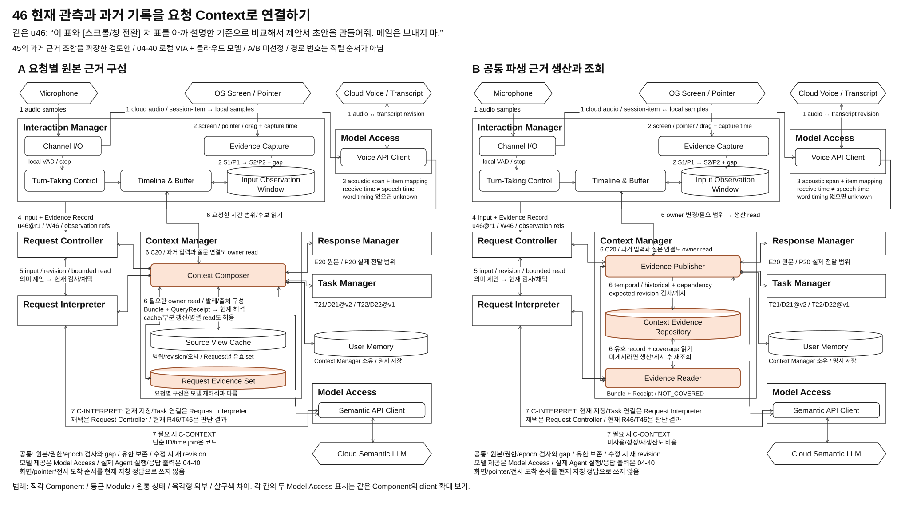
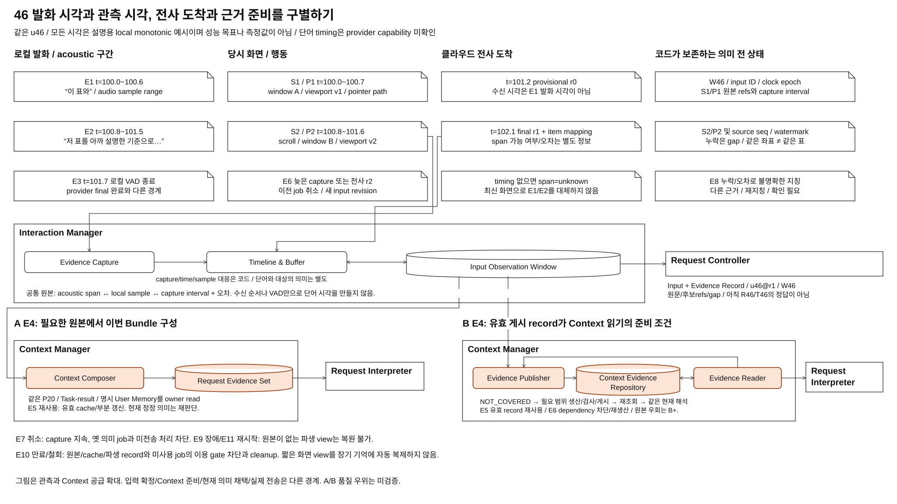

# 04-46. 현재 관측과 과거 기록을 요청 Context로 연결하기

> 상태: **45 확장 검토안 / 사용자 검토 전 / A/B 미선정 / 구현과 측정 없음** / 2026-10-09
> 사용자는 기존 [45](./04-45-memory-and-context.md)를 그대로 보존하고, 음성과 화면, 마우스 관측까지 포함한 설계를 **46**으로 별도 작성하도록 요청했다. 번호 지정은 최종 DP 선정이나 45 대체를 뜻하지 않는다.
> 적용 기준은 [04-40 공통 실행 계약](./04-40-common-execution-contract.md)이다. 로컬 VIA와 로컬 VAD, 클라우드 음성/전사와 의미 LLM을 적용한다. 45의 기존 on-device 전제와 원본/그림/생성기는 이번 작업에서 수정하지 않는다.

## 1. 무엇을 해결하며 45에서 무엇이 넓어지는가

**지금 말하며 가리킨 화면과 사용자 행동, 이전 대화와 실제 전달한 설명, 확인된 업무 결과를 현재 요청에 필요한 근거로 어떻게 구성하고 제공할 것인가?**

45는 여러 대화와 업무에 흩어진 과거 근거를 Context로 구성하는 비교였다. 46은 그 기능을 보존하면서, 발화 중 사라지는 관측의 취득과 시간 대응부터 Context 공급까지 같은 경로로 설명한다. 관측 원본의 위치를 중앙/생산자로 다시 비교하지 않는다. 공통 원본 owner와 시간 계약 위에서 **A 요청별 근거 구성**과 **B 공통 파생 근거의 생산과 조회**를 비교한다.

범위가 Interaction Manager와 Context Manager를 함께 포함한다. DP를 Component별로 하나씩 만들지 않으며, 여러 Component 사이의 데이터와 실행 의존성을 한 선택으로 다룬다. capture, VAD, 기본 clock/sample mapping은 공통 필수 기능이다. A/B 차이는 그 근거와 다른 원본을 연결하는 생산 책임, 중간 상태, 소비의 준비 조건 및 수정/폐기 계약이다.

### 1.1 같은 대표 사용자 장면

사용자는 VIA에게 평가 기준을 설명받았고, 제품 비교와 견적 확보를 별도 업무로 맡겼다. 지금 첫 문서의 표를 가리키며 **“이 표와”**, 스크롤하거나 창을 바꾼 뒤 다른 표를 가리키며 **“저 표를 아까 네가 설명한 평가 기준으로 비교해서 제안서 초안을 만들어줘. 메일은 보내지 마.”**라고 말한다.

| 표식 | 같은 입력과 원본 / 아직 판단하지 않은 것 |
| --- | --- |
| u46@r1 / W46 | 로컬 발화와 관측 구간. 전사 revision과 sample 범위, 확보된 화면 S1/S2, pointer/selection 구간 P1/P2. 요청/Task 정답은 없음 |
| S1 / P1, S2 / P2 | 관측된 화면과 행동. display/window/document/viewport와 당시 시각/오차를 구별. 어떤 표가 의도한 대상인지 의미 확정은 별도 |
| C20 / E20 / P20 | 45의 평가 기준 대화, 생성한 설명과 실제 전달한 범위. 과거 설명의 후보이며 “아까”의 정답을 미리 정하지 않음 |
| T21 / D21@v2, T22 / D22@v1 | 45의 제품 비교와 견적 Task 및 확인된 결과 참조. 화면의 표가 이 결과인지 문서 identity와 내용 근거로 확인해야 함 |
| R46 / T46 | 현재 Request와 필요 시 새 제안서 Task. 현재 해석과 코드 채택의 결과이며 Context 생산의 선행 조건이 아님 |
| u47 / R47 | “방금 두 번째 표 대신 새 견적으로 다시 만들어줘. 메일은 계속 보내지 마.”라는 후속 정정 예시 |

VIA는 당시 관측과 관련 과거 후보를 공급하고 요청을 이해해 위임한다. 평가 기준을 적용한 비교와 제안서 작성의 domain reasoning, 계획 및 실행은 Downstream Agent 책임이다. Context Manager가 표를 비교하거나 제안서 업무 단계를 계획하지 않는다.

### 1.2 지원해야 할 서로 다른 장면

| 장면 | 이 비교가 설명할 근거 |
| --- | --- |
| 화면만 지칭: “이 표와 저 표를 비교해줘” | 발화 구간별 당시 화면과 행동. 과거 기억 생산이 불필요할 수 있음 |
| 화면과 과거 설명을 함께 지칭 | 최근 관측, 실제 전달한 설명과 관련 자료 후보의 결합 |
| 과거 설명과 두 업무 결과만 재사용 | 45의 원래 R23/R24 사례. 최근 관측이 없어도 처리 |
| 직전 관측 재참조와 새 조건 | 관측 수명 안의 원본 재사용, 이번 조건은 새 의미 판단 |
| 발화 중 “아니, 여기만” / drag / 원형 지시 | 전사 대체 범위와 당시 행동 경로, 집합/단일/역할 후보. 마지막 pointer 하나로 축약하지 않음 |
| 늦은 전사, source 변경, 철회, timing 미지원 | 미확인 범위와 시각 오차, 새 revision, 만료/권한 상태. 질문/미지원은 원래 목표의 성공과 구별 |

## 2. 메인 비교: 같은 입력 원본, 다른 근거 공급 구조

[draw.io 원본](./diagrams/choice46-structure.drawio) / [PNG](./diagrams/choice46-structure.png)

각 칸은 독립 대안이다. 같은 Interaction Manager와 로컬 VAD/관측 수집, 전사 반환, 입력 확정이 위에 있다. A는 Context Composer가 최근 관측과 과거 원본을 읽어 현재 근거를 직접 반환한다. B는 Evidence Publisher가 지원하는 원본 관계를 게시하고 Evidence Reader가 그 자료를 읽어 반환한다. Model Access의 클라우드 음성/전사와 의미 LLM은 양안 동일하다. 파생 근거와 현재 요청의 의미 제안/채택을 구별한다.

그림은 입력과 근거 경로를 확대한다. 실제 Task 실행과 응답 준비/출력은 04-40을 따른다. Policy Manager와 State Store는 본문의 공통 사용/저장 계약에 남고, 별도 process나 server를 추가하지 않는다. 큰 흰색 경계는 Component, 둥근 박스는 내부 Module, 원통은 owner의 상태, 육각형은 외부 의존성이다. 차이 Module과 파생 상태만 살구색이다.

각 칸의 위/아래 Model Access는 같은 Component의 voice/semantic client를 경로 가까이에서 확대해 표시한 것이다. 두 Component나 두 모델 가중치 배치가 아니다. Voice API Client와 Semantic API Client는 이번 호출 경로를 설명하는 provider adapter Module 이름이며, 별도 서비스/모델을 추가로 선정하지 않는다. 메인 그림은 A의 선택적 cache와 B의 게시 원본을 강조하며, B에서도 허용된 원본별 Source View Cache를 사용할 수 있다.

## 3. Component와 Module의 소속

| Component | 공통 책임과 상태 | A/B 차이 |
| --- | --- | --- |
| Interaction Manager | Channel I/O: audio sample/time와 실제 장치 I/O. Turn-Taking Control: 로컬 VAD와 경계, 즉시 stop. Evidence Capture: 허용된 OS 관측. Timeline & Buffer: Input Observation Window와 전사/sample 대응, 시각별 근거와 gap | 같은 원본과 versioned read port를 양안에 제공. raw owner를 Context Manager로 이전하지 않음 |
| Context Manager | 목적별 허용 근거, 원본별 Source View Cache, 명시 User Memory, 파생 사본의 권한/수명 | A Context Composer와 Request Evidence Set. B Evidence Publisher, Context Evidence Repository, Evidence Reader |
| Request Controller | 확정 input revision, Conversation/Request/질문, 현재 의미 채택, admission/hold | 04-40과 41의 공통 owner. 저장소 게시나 InputFinal이 의미/게시 허가를 대신하지 않음 |
| Request Interpreter | 현재 지칭, 의도, Task 연결, 관계, 정정 범위와 처리 방향의 의미 제안, 잠정 job 상태 | 41 A/B와 독립. 46 A/B 어느 안도 현재 의미 정답을 미리 공급하지 않음 |
| Model Access | voice/transcription/semantic adapter, provider item과 로컬 sample mapping, timeout/cancel과 usage | 같은 cloud 배치. C-INTERPRET와 조건부 C-CONTEXT의 요청자를 구별 |
| Response Manager | 생성 원문과 실제 전달 범위, publication 원본, 현재 응답 준비/게시 | E20/P20 read port. 모델 생성 완료와 실제 전달은 다른 사실 |
| Task Manager / Agent Gateway | 로컬 Task와 확인된 결과 참조 / 외부 명령과 receipt/event | T21/D21, T22/D22 read port, 채택 후 T46 위임. domain 실행은 외부 Agent |
| Policy Manager / State Store | 실제 읽기/모델 제공/게시 권한, 철회 / owner가 검증한 저장과 복원 | 파생 저장소가 원본 권한과 Task/Publication의 권위를 대신하지 않음 |

B의 **Evidence Publisher는 45의 Memory Publisher를 최근 관측 관계까지 확장한 내부 Module**이다. 두 producer를 중복 배치하는 안이 아니다. 이름 확장과 함께 temporal dependency, 유효 범위, 게시/수정/만료 계약을 아래에 새로 설명한다. Context Evidence Repository는 최근의 유한 temporal view와 허용된 과거 관계를 타입/수명별로 구별한 공통 읽기 계약이다. 같은 물리 DB나 장기 원본 복제를 의무화하지 않는다.

## 4. 발화와 화면을 맞추는 공통 필수 설계

### 4.1 취득, 기록과 시간 대응은 서로 다른 일이다

1. Channel I/O가 로컬 sample 범위와 monotonic 시각을 기록하며 Model Access를 통해 audio를 전달한다. Model Access는 resampling 전후 sample 구간과 provider session/item을 대응시킨다.
2. Turn-Taking Control의 로컬 VAD가 input ID와 시작/종료 후보를 만든다. local stop은 원격 cancel, 근거 조회나 모델 판단을 기다리지 않는다. Request Controller의 미전송 hold는 04-40 경로다.
3. Evidence Capture는 유효 관측 범위에서 화면, window/focus, pointer/click/drag/selection을 확보한다. Timeline & Buffer가 capture 구간, sequence, screen/viewport revision과 gap을 Input Observation Window에 보존한다. 전사 token마다 capture를 다시 시작하거나 LLM을 호출하지 않는다.
4. 전사 revision은 provider 수신 시각으로 정렬하지 않는다. 확보된 acoustic span과 실제 로컬 sample mapping, 화면 capture와 행동의 유효 구간 및 오차를 이용해 **시간상 대응 가능한 관측 후보**를 제공한다.
5. 로컬 종료 확정, final 전사, source별 watermark 또는 명시적 gap을 구별해 Input + Evidence Record를 Request Controller에 전달한다. watermark는 무손실 보증이 아니다. 후속 전사/관측은 새 revision이다.

**기본 시간 대응은 Interaction Manager의 코드 책임이다.** Context Composer/Evidence Publisher는 그 대응을 다시 만들거나 공급자의 timestamp를 발명하지 않는다. 다른 원본과 결합한 근거를 구성/게시하며 실제 지칭 판단은 Request Interpreter에 남긴다.

provider가 단어/span timing을 제공하지 않으면 전체 발화 범위만으로 복수 지칭을 정확히 구분할 수 있다고 하지 않는다. timing 미제공, 큰 오차와 source gap을 결과에 남긴다. 가능한 다른 근거로도 의도가 불명확하면 재지칭/확인으로 연결한다. alignment helper의 역할과 위치, capability, 청구와 자원 비용은 미선정이며 추가한다면 양안에 동일 조건으로 적용해야 한다.

### 4.2 기록의 최소 계약과 수명

| 자료 / owner | 내용과 제한 |
| --- | --- |
| Input Observation Window / Interaction Manager | input/window ID, source generation/sequence, audio sample 범위, capture 시작/끝과 receive 시각, clock domain/epoch/mapping 오차, 화면/문서/viewport/좌표 revision, pointer/selection/drag 구간, 원본 참조와 확보 범위/gap. 유한 보존, 영구 화면/음성 기록 아님 |
| Input + Evidence Record / Interaction Manager 생산, Request Controller 확정 | input/transcript revision, provider item/sample mapping 참조, 가능한 acoustic span/method/오차, 원문과 observation refs. final은 의미 정확성 선언이 아님 |
| Temporal Evidence Result / Interaction Manager | 요청한 시간 범위와 실제 읽은 관측, 후보 중첩 구간, 각 source revision/coverage와 유효 읽기 참조. 지칭 정답/Task binding 없음 |
| EvidenceQuery / Context Manager 소비 port | Request/attempt, 목적과 권한, input revision/window, 시간/과거 대화/Task 후보 범위, 원문 조건과 예산. Task 후보는 정답이 아님 |
| EvidenceBundle / Context Manager | 당시 관측 후보와 관련 과거 발췌/locator, source dependency vector, 원문/코드 연결/모델 추출 구분, 읽은 scope/epoch, 누락/오차/freshness 및 반환 근거의 유효 범위 |
| QueryReceipt / Context Manager | 실제 읽은 source별 범위, revision과 gap, 중단/제외 조건. B는 게시 coverage와 실제 조회를 함께 기록. 글로벌 완전성/공동 snapshot으로 표현하지 않음 |
| Context Evidence Record / B Context Manager | temporal 또는 historical 타입, source dependency와 input/window/transcript revision, 관계 종류, producer/schema version, 생성 방법과 오차, 게시 revision/coverage, expires/권한. raw 창고나 현재 의미 Workspace가 아님 |
| User Memory / Context Manager | 사용자의 명시 저장/변경/삭제로 관리. 최근 관측이나 반복 지칭을 자동 선호로 승격하지 않음 |

같은 좌표라도 display/window/document/viewport가 다르면 같은 대상이 아니다. 화면 capture가 유한 시간에 걸치면 구간과 오차를 보존한다. sleep, 장치 교체와 reconnect는 새 epoch/mapping을 사용하고 확인하지 못한 연속성은 gap으로 표시한다. 이미 사라진 화면이나 허용되지 않은 발화 전 행동을 현재 화면으로 복원하지 않는다. pre-roll 범위/수집 예산은 04-40의 공통 미결 수치로 남기며 46 B를 위해 몰래 늘리지 않는다.

## 5. A: 요청별 원본 근거 구성

Context Composer는 요청에 필요한 최근 관측과 과거 근거를 원본 owner의 read port로 조회한다. u46의 시간 후보는 Interaction Manager에서, “아까 설명” 후보는 Request Controller/Response Manager에서, 관련 결과 후보는 Task Manager에서 읽는다. 원본별 요약, index, Source View Cache와 작은 관계 cache를 사용할 수 있다.

Composer가 이번 요청에 필요한 발췌/참조와 출처, 시각 오차, 실제 읽은 범위를 Request Evidence Set에 기록하고 Bundle/Receipt로 반환한다. 현재 요청의 의미 binding은 만들지 않는다. 선행 Context가 완성된 뒤에만 해석하는 직렬 pipeline을 강제하지 않으며, Request Interpreter의 bounded read 제안에 따라 추가 구성할 수 있다.

시간 대응이 있는 화면만 쓰는 요청은 그 read result를 필요한 범위로 공급하면 충분할 수 있다. 매번 과거 이력 전체를 읽거나 이미지 의미를 별도로 재추출하지 않는다. u47에서 유효한 관측/관계 cache는 재사용하되 새 조건이나 실제 source 변경은 다시 확인한다. 의미 가공이 별도로 필요할 때만 C-CONTEXT를 호출하고, 현재 C-INTERPRET에서 판단할 수 있는 부분을 중복 호출하지 않는다.

## 6. B: 최근 관측과 과거 관계의 공통 파생 근거 생산/조회

### 6.1 생산 경로

Evidence Publisher가 원본 owner의 확정 변경과 관련 ID/revision을 받아 허용 범위를 읽는다. Interaction Manager의 관측 window와 확정 전사 revision에서 제공한 시간 대응을 **출처와 유효 범위가 있는 temporal record**로 게시한다. 과거 설명의 실제 전달 순서, Task/result revision과 정정 관계는 historical record로 게시한다.

음성 단어 시각과 화면/행동 구간의 대응, 명시 ID/버전 연결은 코드로 처리할 수 있다. “아까 그 표현을 빼줘” 같은 자유문 과거 관계를 별도로 추출해야 할 때만 C-CONTEXT를 호출한다. 이미지에서 현재 요청의 지칭 대상을 확정하는 새 scene producer나 helper를 도입하지 않는다. temporal record는 당시 관측을 읽을 수 있게 하는 자료이며 “이 표는 D21”이라는 현재 referent 정답이 아니다.

관계와 coverage를 source dependency, expected input/source revision 및 policy epoch 조건으로 함께 게시한다. 생산 중 source가 바뀌면 오래된 job은 게시하지 않는다. 원본 전체를 한 transaction으로 묶지 않고, 사용 직전에 의존 원본의 유효성을 재검사한다.

### 6.2 조회 경로와 첫 요청의 비용

Evidence Reader는 현재 input ID/revision/window와 과거 후보를 이용해 Context Evidence Repository를 읽고 목적별 Bundle/Receipt를 반환한다. 같은 source raw 참조는 실제 원문/이미지 확인에 사용한다. 이것은 게시된 관계 검증/본문 읽기이며, 누락된 관계를 Reader가 원본마다 새로 구성하는 숨은 A 경로가 아니다.

**Input + Evidence Record는 B에서도 Interaction Manager → Request Controller로 직접 전달된다.** B의 repository가 capture나 입력 확정의 선행 조건이 아니다. 이 입력은 처리 ID/원문/관측 refs를 등록하는 공통 계약이다. B의 정상 Context 소비는 요청한 종류와 범위의 유효 파생 자료가 게시돼 있어야 한다. 입력이 확정됐다고 파생 근거가 자동 준비된 것은 아니다.

첫 u46에 새 temporal record가 아직 없으면 `NOT_COVERED`다. 지원 종류라면 Publisher가 필요한 범위만 읽어 생산/게시하고 Reader가 확인된 revision을 재조회한다. 이를 단순 cache hit로 세지 않으며 요청 대기에 게시 비용을 포함한다. 생산 예산을 초과하면 미준비 범위를 알리고 필요한 확인/보류로 연결한다. `UNSUPPORTED_RELATION`은 표현 밖 관계여서 backfill 반복으로 해결하지 않는다.

원본별 조합으로 즉시 우회하는 안은 **B+ 혼합**이다. 양쪽 실행/검증 계약과 비용을 별도로 기록한다. 첫 live 화면 지칭에서 B의 생산/게시가 이익 없이 대기를 추가할 수 있고, 강한 A의 유효 cache와 반복 조회가 충분하면 B의 선택 이유가 약하다. 최신 화면 입력의 공통 원본 확보를 B의 독점 이익으로 주장하지 않는다.

### 6.3 두 시간대의 보존

temporal record는 원본 window와 permission 범위에 종속된 유한 view다. historical record는 실제 확정 입력/설명/Task/result 원본과 허용된 보관 범위에 종속된다. 짧은 화면 view를 장기 기억에 자동 복제하지 않는다. 같은 repository 인터페이스를 쓴다는 이유로 보존 기간을 같게 만들지 않는다.

원본이 만료되면 temporal locator와 그 원본이 필요한 근거 사용을 차단한다. 이미 확정된 Request의 허용된 대상 참조가 남을 수는 있지만, 그 metadata가 원본 이미지나 행동 경로를 복구하는 것은 아니다. 과거 원문 snapshot을 따로 보관하려면 양안 동일한 별도 허용/예산 조건이 필요하다.

## 7. 같은 사건의 실행과 수정/실패 계약

[draw.io 원본](./diagrams/choice46-timeline.drawio) / [PNG](./diagrams/choice46-timeline.png)

E 번호는 사용자/원본 사건이며 시각 간격은 설명용이다. 구조도 1~7은 경로 번호이고 항상 직렬 실행하는 순서가 아니다. 첫 요청, 재사용과 수정은 별도로 본다.

| 사건 | 공통 원본과 입력 | A의 근거 구성 | B의 근거 생산/조회 |
| --- | --- | --- | --- |
| E1 발화 시작, S1/P1 지시 | VAD/input ID, 유한 window와 당시 관측 보존, local stop/hold | 기본 준비 가능 | source window 준비. provisional 전사/의미를 확정 historical 사실로 게시하지 않음 |
| E2 “이 표와”, scroll/창 전환, “저 표를” | acoustic 구간, S1/P1과 S2/P2의 identity/time/gap 구별 | 아직 단어 timing이나 referent가 있다고 가정하지 않음 | 같은 한계. frame마다 모델 호출하지 않음 |
| E3 로컬 종료 확정, 전사 final | provider item/sample mapping, possible span과 source watermark/gap → input revision 채택 | 요청 read에서 temporal 후보와 P20/결과 후보 조합 | 지원 temporal/과거 근거가 유효 게시되었는지 확인. 미게시라면 필요한 생산/게시 후 조회 |
| E4 Context와 현재 의미 | 후보/누락/오차가 있는 Bundle, 41의 해석과 Request Controller 채택 | 현재 필요 범위 직접 공급 | 게시 근거의 목적별 공급. P20/T21/T22를 R46의 정답으로 미리 고정하지 않음 |
| E5 같은 근거의 후속 u47 | 새 조건과 입력 revision, 살아 있는 source 재사용 | cache/부분 갱신을 허용 | 유효 record 재사용, 현재 정정 의미는 41이 판단 |
| E6 늦은 전사/관측 또는 source 수정 | 옛 input/job/admission 무효화, 새 revision. 전송 후라면 후속 수정 | 영향 read/cache/Bundle만 재구성 | 영향 dependency record/coverage 즉시 사용 차단, 재생산/게시와 재조회. 오래된 view를 최신 input에 결합하지 않음 |
| E7 새 발화/해석 취소 | capture 계속, 옛 의미 job 폐기, 관련 미전송 hold | 옛 request set/read 참조 해제, 유효 공통 cache는 유지 가능 | 옛 query/job 참조 해제, 유효 record는 허용 수명 안에서 유지. 취소된 job 결과로 게시/채택하지 않음 |
| E8 timing 없음, 원형 경로/화면 누락 | unknown/오차/gap 유지. 필요한 지칭이면 재지칭/확인 | 없는 근거를 cache로 채우지 않음 | 없는 근거를 파생 record로 채우지 않음. 질문은 원래 요청 완료가 아님 |
| E9 network/전사 또는 source 실패 | 유한 보존과 bounded 재연결, overflow gap. final 실패는 명시적 입력 실패 | source read 실패/부분 범위를 반환 | publisher/reader 실패와 실제 원본 실패 구별. 남은 record도 현재 권한/유효성 검사 |
| E10 원본 만료, 철회/삭제 | 각 사용 게이트의 epoch와 실제 제공/게시 순서 검사, 신규 사용 차단 | 해당 cache/Bundle와 대기 job 차단 후 cleanup | 원본 dependent record/coverage, query view와 대기 생산/모델 job 차단 후 cleanup |
| E11 crash/restart | RAM window 소실 가능. source/permission 상태와 실제 전달/Task 원장을 재확인 | 남은 원본과 cache만 재조회 | 살아 있는 원본에서 파생 자료 재생산. source 소실이면 재생산 불가, 옛 producer generation 사용 금지 |

원본 revision은 같지만 파생 관계가 틀린 경우도 있다. Request Interpreter → Request Controller → Context Manager의 `EvidenceDispute(record ID, revision, 근거)`로 해당 파생 버전을 조건부 사용 차단한다. A의 cache도 같은 오류 보고를 처리한다. B는 source/clock mapping과 producer를 확인해 재게시하며, current referent 값은 Request Interpreter가 다시 판단한다.

철회는 뒤늦은 publisher 알림만으로 처리하지 않는다. 원본 및 Policy Manager의 현재 권한을 읽기, cloud 제공, 의미 채택, Agent 제공과 응답 게시 게이트에서 확인한다. epoch 확인과 사용 승인/queue 등록은 같은 직렬화 경계에서 처리하고, 이전 epoch의 미실행 job/미게시 결과를 차단한다. raw/window 해제, 파생 record와 cache, 허용된 모델 context와 대기 출력의 정리는 재시도 가능한 후속 작업이다. 이미 cloud/Agent에 제공한 사본을 소급 삭제했다고 하지 않는다. 실제 provider 삭제 능력은 별도 미확인 계약이다.

## 8. 코드와 모델 호출, 비용의 실제 위치

| 04-40 역할 / owner | A | B | 공통 비용/한계 |
| --- | --- | --- | --- |
| C-VOICE-IN / Interaction Manager → Model Access | 지속 audio/설정 전사 | 동일 | 로컬 VAD와 cloud 전사 완료 구별. voice/transcriber의 실제 usage와 retry 포함 |
| capture/time mapping / Interaction Manager | OS 취득, sample/span 대응과 gap은 코드 | 동일 | CPU/RAM/IO/복사/전송 준비 비용. timing helper가 필요하면 별도 inventory, 아직 선택하지 않음 |
| source 읽기 / Context Manager | Composer의 owner read와 조합 | Publisher의 owner read/게시, Reader의 repository와 원문 확인 | ID/version/시간 join 자체는 LLM 호출이 아님. query/cache/index와 결과 사본 포함 |
| C-CONTEXT / Context Manager, 필요 시 | 별도 근거 의미 가공만. 현재 C-INTERPRET에 충분하면 생략 | 자유문 과거 관계 추출 등 의미 생산만. 단순 temporal/명시 ID 관계는 코드 | 입력 구간, role/job, source revision과 actual token/usage 구별. unused/stale 생산도 비용 |
| C-INTERPRET / Request Interpreter → Model Access | 현재 의미 제안과 조건부 추가 읽기 | 같은 역할, 게시 기억은 현재 의미 정답 아님 | 같은 41 구조/모델/현재 요청을 양안에 고정. provider session이 영속 근거의 유일 원본이 아님 |
| C-RESPONSE / Response Manager, 필요 시 | 질문/직접 답변 준비 | 같은 책임 | 정형 오류/진행은 template 가능. 추가 재지칭의 모델/사용자 비용 포함 |
| C-VOICE-OUT / Response Manager → Model Access | 준비된 응답의 음성 생성 | 같은 책임 | 실제 Interaction Manager 표시/재생 receipt와 생성 완료 구별. stale/cancel 청구도 남김 |

Model Access가 call/job/role과 input/source revision, provider/model/version, enqueue/send/first/terminal 시각, status/usage와 단가 version을 기록한다. 호출 수는 진단값이며 금액의 대체가 아니다. 실제 가격이나 현재 API의 span timing capability를 이번 문서에서 확인/선택한 것으로 표시하지 않는다.

같은 workload에서 음성 입력/전사, 현재 판단, 선택적 Context 가공, 응답 내용/음성 및 retry/stale 청구를 함께 비교한다. B의 temporal 첫 게시와 historical cold 생산, 미사용 갱신/폐기, 동기 backfill과 B+를 분리한다. A의 cache 생산/유지와 부분 갱신도 포함한다. **B가 미리 준비했다는 이유로 전체 생산 비용을 빼지 않는다.**

시간은 실제 speech end와 VAD 종료, 전사 대기, source/근거 준비, cloud upload/network/model, 추가 read, 응답 준비/음성 및 실제 출력으로 나눈다. capture 중 겹친 작업은 단순 합하지 않고 네트워크 대기를 임의로 제외하지 않는다. [기존 endpoint 계약](../../11-measurement/event-boundary-contract.md)과 QA 정의는 보존하며 새 cloud 귀속/목표/요금 freeze는 수행하지 않는다.

## 9. 같은 품질 관점에서의 구조 손익

[03-00의 V-01~13와 우선순위](./03-00-quality-scenarios.md#21-이번-비교의-우선순위)를 사용한다. 공동 1순위 V-01~03, 공동 2순위 V-04/05, 3순위 V-08, 4순위 V-06, 5순위 V-07, 공동 6순위 V-09~13이다. 모델 비용은 04-40의 추가 검토 축이며 새 QA ID/순위/가중 score를 만들지 않는다.

| 관점 | A 요청별 구성 | B 공통 파생 근거 생산/조회 |
| --- | --- | --- |
| V-01 기능 정확성 | 실제 input/source revision에서 필요한 시간/과거 근거를 조합. 요청별 연결 누락과 cache stale 위험 | 유효 관계 재사용으로 반복 누락을 줄일 여지. timing 오차는 그대로이며 잘못된 게시 관계가 여러 요청에 퍼질 위험 |
| V-02 기능 적절성 | 유효 당시 관측과 기존 Task/설명 참조로 재지칭 최소화. warm cache도 허용 | 같은 관측/과거 관계 재사용이 실제 사용자 재설명을 줄일 때 이익. 미게시/표현 밖 관계는 기다림/질문 부담 |
| V-03 기능 완전성 | UC-03/04의 변형과 자유로운 새로운 원본 관계를 현재 구성할 수 있는 범위 명시 | 게시 종류/coverage에 따른 지원. 원형/복수 지칭의 timing 미지원은 공통. 관계 표현 미지원은 B+ 또는 설계 변경이며 숨기지 않음 |
| V-04 상호작용 반응성 | 첫 일회성 화면 지칭에서 direct temporal read가 충분하면 짧은 경로 가능 | 처음 화면 구간의 게시가 추가 대기를 만들 수 있음. 유효 게시 hit는 읽기 경로를 줄일 여지. local stop은 공통 |
| V-05 VIA 귀속 요청 완료 시간 | 필요한 read/조합/현재 해석과 수정 재처리 비용 | 생산/검증/게시/조회 또는 미게시 backfill, 수정 재생산이 critical path에 붙는 비용. 전체 cloud/응답 경로에서 비교 |
| V-06 자원 활용성과 수용량 | 요청 set와 원본별/cache 자원. 반복 조합은 중복 read/모델 입력을 만들 수 있음 | temporal index와 historical 관계, dependency/coverage/producer backlog 유지. 반복 사용 이익과 미사용 생산/원본 pin 압박을 함께 봄 |
| V-07 결함 허용성과 복구성 | 원본이 살아 있으면 필요한 set를 재구성. owner 실패/부분 read 처리 | publisher/reader/repository 실패와 원본 실패를 구별. 원본이 없는 temporal view를 재생산하지 못함. process 분리 이익 자동 주장 금지 |
| V-08 변경 용이성과 모듈성 | 새 source/time 표현은 owner adapter와 Composer의 조합 경로에 영향 | source adapter와 producer/schema/coverage/의존 무효화, 소비 표현으로 전파. 공통 read 계약이 소비 변경을 줄일 때 이익 |
| V-09 분석 및 시험 용이성 | query receipt로 실제 읽은 관측/범위와 현재 결합을 재현 | 생산 오류/coverage/읽기 오류를 분리할 수 있지만 clock mapping/input/producer/게시 version 대조가 추가 |
| V-10 기밀성 | 원본별 scope와 임시 set/cache, 실제 cloud 제공 관리 | 교차원본 관계가 추가 노출면. 짧은 관측 view의 만료와 삭제 dependency 관리. 중앙 저장이 자동 보호는 아님 |
| V-11 상호운용성과 공존성 | OS/provider의 좌표/clock/resampling과 owner 의미를 보존. 요청 burst의 CPU/IO/cloud 비용 | 같은 공통 연동, producer schema의 정보 손실 위험. 배경 생산과 원본 pin이 다른 PC 앱과 경합할 수 있음 |
| V-12 조작 용이성과 사용자 오류 방지 | 당시 대상과 현재 Action 적용 가능성 구별, 모호한 지칭과 조건 확인 | 같은 의무. 익숙한 게시 관계로 새 의미를 확정하거나 최신 화면으로 과거 대체 금지 |
| V-13 설치 용이성 | 공통 로컬 VIA와 cloud client. 추가 helper는 별도 검토 | 추가 server/모델 필수 아님. 파생 schema/cursor/cleanup 관리 비용, 실제 별도 설치 차이는 미확인 |
| 모델 호출 비용 | 요청별 의미 가공/해석과 cache 유지. 필요한 현재 read로 충분하면 C-CONTEXT 생략 | 관계 의미 추출/생산과 현재 해석, unused/stale/backfill 모두 청구 포함. 코드 temporal 게시로 LLM 호출 증가를 자동 가정하지 않음 |

단순 화면 1회, 화면+과거 설명, 45의 과거만 참조, 유효 재사용, 정정 직후, 미지원 관계를 따로 본다. 화면 사례를 추가했다는 사실만으로 B의 정확성 우위나 주요 DP 자격이 강화됐다고 하지 않는다.

## 10. 구조 선택과 tactic 보완의 구별

45의 사용자 검토 원칙을 이어받는다. 기본 구조의 중요한 품질 손익을 비교한 뒤 우선순위로 선택하고, 부족한 축에 cache/index/부분 갱신 등 tactic을 적용할 수 있다. A가 B의 일부 이익을 얻는 것은 정상적인 보완이며 비교의 자동 격하 사유가 아니다.

| 보완/전환 | 얻는 효과와 실제 바뀌는 계약 |
| --- | --- |
| A에 temporal index와 관련 설명/결과 cache | 반복 read를 줄이고 요청 set를 부분 갱신. source 인수나 공통 게시를 소비의 필수 조건으로 만들지 않음 |
| B의 선택적 범위 생산과 부분 갱신 | 미사용 관측 관계/과거 관계 생산을 줄임. 요청이 소비하려는 종류/범위의 게시 의존은 남음 |
| A → B | 공통 관계의 producer, 검사와 coverage/정정/만료 권위를 추가하고 정상 Context 읽기를 게시 계약으로 옮김. 첫 관계는 작게 도입 가능 |
| B → A | 원본/공통 관측 계약은 유지. 소비 경로에 원본 후보 read와 결합/누락/receipt 처리를 복원하고 repository를 선택적 cache로 낮춤 |
| temporal은 A, 반복 historical만 B | 현실적인 혼합. 첫 화면 입력의 게시 대기를 피하고 과거 관계를 재사용. source별/종류별 정상 경로와 비용 공개 |
| B+ 원본 조합 우회 | 미지원/미게시를 보완하지만 두 경로의 검증/수명/비용을 함께 부담. 순수 B의 무료 이익으로 세지 않음 |

**A가 유리할 조건:** 새로운 화면 구간과 일회성 관계가 많고 원본별 조회/작은 cache로 충분하거나, 빠른 첫 응답과 유연한 관계 구성이 중요할 때. 감수할 비용은 요청별 연결과 검증 부담이다. B가 같은 근거/정확성을 유지하며 반복 결합 비용을 충분히 줄이고 전체 생산 비용도 감당한다는 근거가 생기면 A의 선택 근거를 재검토한다.

**B가 유리할 조건:** 최근 관측과 과거 설명/결과의 지원 관계가 반복적으로 쓰이고, 게시/coverage/수정 비용을 감당하면서 요청별 결합을 실제로 대체할 때. 감수할 비용은 첫 게시/미게시 대기, 생산 오류, 표현 한계와 추가 자원이다. 원본 우회/재생산이 지배하거나 잘못된 관계 공유가 정확성을 악화하거나 보완한 A로 동일한 품질을 더 저렴하게 얻으면 B를 지지하지 않는다.

입력 원본의 수명이나 capture 범위를 안마다 다르게 줘서 이익을 만들지 않는다. 이전 원본/파생 자료는 기존 owner에서 유효 기간까지 drain하거나 명시적으로 이행한다. 과거 화면을 재취득해 이전 자료를 메우지 않는다. 전환 비용 자체를 Architecture 자격의 증명으로 사용하지 않는다.

## 11. 다른 DP와의 연결과 미결 사항

| 문서 | 연결과 이번 변경의 한계 |
| --- | --- |
| 40 | 로컬 입력 근거/권위와 cloud 역할, raw 시각/전사 대응 유지. 단어 timing/helper, 구체 예산/provider 기능은 미결 |
| 41 | 요청별 bounded read를 제공하고 현재 의미는 41이 생산. 46 A/B와 41 A/B를 혼동하지 않음. 현재 Task 정답이나 handling을 producer가 선결정하지 않음 |
| 44 | input/revision/evidence ready/gap/실패를 현재 owner 사건으로 반환. temporal 게시 완료가 InputSettled/응답 게시 허가를 대신하지 않음 |
| 42 | read port와 원본/파생 수명은 해당 배치에서 연결. service 분리만으로 window 생존을 주장하지 않음. 42B+44의 hold/전송 미결은 그대로 |
| 43 | 지칭 후보의 근거 공급과 F2 의미 생산 구별. 43 자체의 모델 전제/내용을 이번 작업에서 개정하지 않음 |
| 45 | 원래 과거 사례와 A/B의 production/read 논리를 이어받음. 원본/그림/수치/기록은 그대로 보존하며 46은 비교해 볼 별도 확장안 |
| [초기 관측 A/B 초안](./input-evidence-timeline-review.md) | 중앙 raw 소유 대 생산자별 raw 조회를 새 DP로 추천하지 않음. 이 문서의 A/B는 45의 근거 구성/게시 선택이다. 공통 관측 계약만 재사용 |

이번 설계에 새 scene 의미 producer, 추가 ASR/embedding/reranker나 전체 화면의 지속 cloud 전송을 기본 전제로 넣지 않는다. 필요한 이미지 payload/원문과 permission은 목적별로 좁힌다. 실제 지원 미확인인 provider timing/vision/helper는 미확인으로 남긴다.

## 12. 검토 순서와 상태

사용자 리뷰는 **§2 MAIN → §4 공통 관측/시간 계약 → §5~6 A/B 생산/조회 → §7 동일 사건 → §8~10 호출/품질/선택 조건** 순서로 할 수 있다. 단순 화면 사례에서 A/B 차이가 약한지, 최근 관측+과거 맥락 사례에서 같은 비교가 실제 Context 공급 구조의 손익을 드러내는지 함께 판단한다.

46 문서와 그림의 완료는 45 대체, 최종 DP/A/B 선정, 주요 품질 우위 또는 전체 VIA Architecture 선택이 아니다. schema/adapter/실제 cloud capability와 시각 오차, 모델 호출 비용, 기기 자원과 제품 동작 검증은 수행하지 않았다. 기존 QA/ADR/참조 Architecture와 다른 세션의 41/공통 문서/통합 발표 자료는 보존한다. 검증 및 재개 기록은 [46 검수](./04-46-evidence-review.md)에 남긴다.
