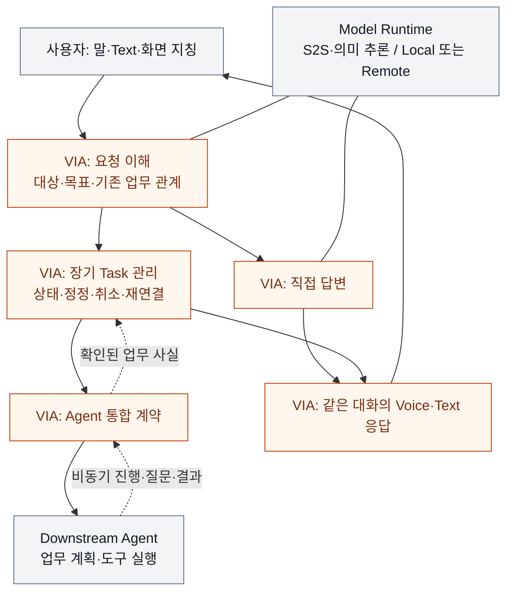

# VIA 핵심 Architecture와 ASR 재선정 — 요약 보고서

> **2026-09-25 · 문서·사고실험 재검토 완료 / 사용자 검토 제안**
>
> 대상: VIA의 전체 구조를 설명할 핵심 의사결정과 최종 보고서의 품질 지표 선정.
> 근거 기준: `7fc65131517d7c1e9dc8f1784dc5c023b4befbec`의 active baseline 및 이후 사용자 리뷰.
> 구현·QA 측정·A/B 승자 선정은 하지 않았다. 실제 결과는 `NOT_RUN`이다. 기존 QA 정의·DP ID·accepted/deferred ADR을 변경하지 않는다.

## 1. 검토 결론

**VIA의 보고서는 ‘요청 이해·Task 관리·Agent 통합·PC 실행’이라는 네 가지 핵심 구조를 중심으로 설명하는 것이 맞다.** 입력 목록 갱신, 답변 승인, 자원 예약처럼 그 안의 특정 메커니즘부터 나열하면 VIA를 어떻게 설계했는지가 보이지 않는다.

다만 **중심적인 설계 주제 네 개를 찾은 것과, 충분한 양방향 QA trade-off를 가진 DP 네 개를 확보한 것은 다르다.** 이번 재검토에서는 다음과 같이 구분한다.

| 보고서의 핵심 구조 | 현재 비교 질문 | 재검토 판정 |
| --- | --- | --- |
| 사용자 요청 이해 | 관련 의미를 함께 확정할 것인가, 의미별 소유자가 확정할 것인가? | DP-06을 우선 심화한다. 정확도·응답시간·변경 범위를 연결하는 가장 중요한 후보이나 우열은 미확인이다. |
| 장기 Task 관리 | 공유 Task 서비스가 상태 전이를 소유할 것인가, Task별 소유자가 관리할 것인가? | 필수적인 구조 설명이다. 기존 TASK 질문을 현재 QA로 재검토하되, Task 분리의 자동 성능·복구 이점을 철회한다. |
| 이기종 Agent 통합 | Agent의 의미 차이를 연동 경계에서 흡수할 것인가, Core의 유형별 처리기가 해석할 것인가? | DP-09는 중요한 계약 결정이다. 변경 영향 외에 반대 방향 QA 이점이 약하므로 독립 trade-off DP로는 보류한다. |
| PC 실행·장애 경계 | 위험 연동 실행을 Core와 같은 Process에 둘 것인가, 별도 Process에 격리할 것인가? | DP-11은 장애 영향과 메모리·통신 비용의 대립을 설명할 수 있어 우선 비교한다. |

**따라서 ‘DP 4~5개가 모두 성립했다’고 보고하지 않는다.** 현재 이 네 영역 중 구조적 맞교환 근거가 가장 명확한 것은 Process 격리이고, 제품 중심성이 가장 높아 추가 명세가 필요한 것은 요청 이해다. Task 관리와 Agent 통합은 전체 구조에서 빠질 수 없지만 평가표의 칸 수를 채우는 용도로 승격시키지 않는다.

권장 ASR 후보군은 **8개**, 그중 본문 구성의 **우선안은 6개**다. Responsiveness 2개, Accuracy 1개, Modifiability 1개, 장애 영향 1개, 메모리 1개로 구성한다. 모두 선정 제안이지 확정된 ASR은 아니다.

## 2. 왜 이 네 가지가 VIA의 중심인가

사용자는 화면을 가리키며 “이 자료를 요약해서 보고서로 만들어줘”라고 말한다. 이어 “아까 것 말고 이 자료로 바꿔줘”라고 정정하고, 다른 질문을 하면서 결과를 기다린다. VIA가 재시작되어도 진행하던 업무를 다시 찾을 수 있어야 한다.

이 상황에서 VIA가 책임지는 것은 요청의 의미, 대화와 업무의 관계, Agent 연결, 사용자에게 전달하는 상태다. 실제 보고서 작성·업무 계획·도구 실행은 Downstream Agent의 책임이다. S2S와 의미 모델은 추론을 제공하는 dependency이지 VIA의 업무 상태 소유자가 아니다.

이 보고서에서 **Task**는 여러 대화에 걸쳐 추적하는 업무, **Core**는 VIA의 요청·업무 관리 영역이다. **S2S**는 음성을 받아 음성으로 응답하는 모델이다. **adapter**는 외부 계약의 차이를 번역하는 연결부, **Process**는 독립된 메모리·종료 경계를 가진 실행 단위, **IPC**는 Process 사이의 통신을 뜻한다. 설계의 상자 수나 프로그램 파일 수를 변경 요소 수로 세지는 않는다.

주황색은 VIA 책임, 회색은 사용자·외부 dependency다. 실선 화살표는 처리 흐름, 점선은 비동기 전달, 방향 없는 선은 모델 의존이다. 논리 구조이며 Process 배치를 미리 정하지 않는다. 네 번째 결정인 실행·장애 경계는 이 책임들을 PC에서 어떻게 배치할지 다룬다.

**실시간 대화와 비동기 업무의 통합 제어는 이 전체를 관통하는 요구다.** 이를 하나의 거대한 A/B로 묶으면 의미 확정, Task 상태 소유, 응답 게시 권한이라는 독립 결정을 동시에 바꾸게 된다. 따라서 공통 interaction 계약으로 먼저 설명하고, 실제 독립 결정은 아래처럼 나눈다. 음성 연결 종료와 Conversation·Task 종료는 같지 않으며, 음성 중단이 곧 업무 취소인 것도 아니다.

## 3. ASR 후보 — 폭넓게 검토하고 본문은 줄인다

하나의 QA에는 하나의 metric을 유지한다. 아래 8개를 후보로 비교하되, **우선 6개**만 본문 평가표의 구성안으로 삼는다. 추후 차이가 작으면 동점으로 남기며, 결과를 보고 유리한 metric으로 바꾸지 않는다.

시간 지표의 **p95**는 반복 실행의 95%가 그 값 이하에서 끝났다는 뜻이다. 평균만 보아 느린 응답을 숨기지 않기 위한 집계다. QA-41은 VIA가 소유하는 모든 local Process와 dependency의 메모리를 같은 범위로 합산하며, PC 밖으로 옮긴 비용을 전체 시스템의 절약이라고 주장하지 않는다.

| 계열 | 후보 | 직관적인 단일 metric | 본문 구성안 |
| --- | --- | --- | --- |
| Responsiveness | QA-01 위임 경로 VIA 처리시간 | 가장 느린 대표 case의 p95 VIA 처리시간. Agent 실행시간 제외 | 우선 |
| Responsiveness | QA-02 직접 Voice 응답시간 | 가장 느린 대표 case의 p95 직접 음성 응답시간 | 우선 |
| Accuracy | QA-11 전체 요청 처리 정확도 | case별 올바른 요청 처리 비율의 평균 | 우선 |
| Modifiability | QA-21 Agent 변경 영향 범위 | Agent 변경 9건의 변경 Architecture Element 평균 수 | 예비: Agent 통합의 독립 비교가 성립하면 재검토 |
| Modifiability | QA-22 Model·Context·State 변경 영향 범위 | 해당 변경 15건의 변경 Architecture Element 평균 수 | 우선, 실제 차이의 근거는 아직 부족 |
| Reliability / Availability | QA-32 불필요한 장애 영향 범위 | 한 fault가 불필요하게 함께 멈춘 기능·Task의 최대 수 | 우선 |
| Resource Efficiency | QA-41 PC 메모리 사용량 | 가장 무거운 workload에서 trial별 최대 메모리 사용량의 p95 | 우선 |
| Observability | QA-61 실행 trace 완전성 | 로그로 전체 실행을 재구성할 수 있는 run 비율 | 예비: 기록 보장 자체를 주 결정으로 다룰 때 재검토 |

**앞선 제안에서 달라진 점:** 추가 품질 후보 중 QA-31 복구시간 대신 QA-32 장애 영향 범위를 우선한다. Process 격리의 직접 효과는 ‘어디까지 같이 멈추는가’다. QA-31은 가장 느린 fault의 복구시간이므로, 연동 fault가 개선되어도 다른 전체 Core fault가 대표값을 지배하면 변화가 드러나지 않을 수 있다. 단지 점수 차이를 만들려는 교체가 아니라 결정과 metric의 인과를 맞추는 제안이며, 측정 전 사용자 승인이 필요하다.

QA-31은 폐기하지 않는다. Task 관리와 Process 격리의 복구 검증에서 반드시 확인한다. QA-32도 전체 fault 집합의 최댓값이므로, 한 연동의 개선이 전체 대표값까지 바꾸는지는 별도 확인해야 한다.

QA-11의 의미 오류는 QA-12, 잘못된 연결은 QA-13, 늦은 event의 상태 오류는 QA-14, 전환 후 맥락 손실은 QA-15로 원인을 분리한다. 이들을 통합 정확도와 중복 점수로 더하지 않는다. Accuracy 두 개를 채우기 위해 같은 실패를 다시 세지 않는다.

## 4. 핵심 구조별 대안과 판단

이 절의 A/B는 해당 소절 안에서만 해석한다. 대안은 **동일 범위에서 상호 배타적(mutually exclusive)**이어야 하며, 양쪽에 합리적인 최적화를 허용한 **서로의 steelman**이어야 한다. 이 문서는 선정 요약이며, 기존 개별 보고서를 대체하거나 새로운 상세 DP 정의의 완료를 선언하지 않는다.

### 4.1 요청 이해 — 관련 의미를 함께 확정할 것인가?

**대표 문제:** “아까 그 자료에 결론 한 장만 더 넣어줘.” 자료를 알아야 Task를 고르고, Task를 알아야 자료 후보를 좁힐 수 있다. 화면 지칭 시점과 정정도 보존해야 한다. UC-03~07·09·10의 중심 문제다.

- **A — 모듈별 보조 처리 + 통합 최종 확정:** 자료 찾기와 Task 조회는 나누되 한 권한자가 대상·목표·Task 관계를 함께 수정하고 확정한다.
- **B — 의미별 확정 + 정정 계약:** 각 담당자가 자기 의미를 확정하고, 후속 정보로 앞 판단을 바꾸려면 원 담당자에게 정정을 요청한다.

**배타성:** 같은 대상·Task 충돌을 최종 권한자 한 명이 함께 수정할 수 있으면 A, 항목별 담당자만 수정할 수 있으면 B다. B 뒤에 모든 의미를 다시 판단하는 확정자를 넣으면 A가 된다. A의 내부 모듈화·부분 재사용과 B의 공유 모델·단계 생략은 모두 허용한다.

**사고실험:** 동일한 두 문서와 진행 Task를 준다. 자료 후보와 Task 판단이 충돌하면 A는 최종 의미 묶음에서 조정하고, B는 원 담당자의 새 판단과 이를 소비하는 단계의 확인을 거친다. 반대로 충돌 없는 간단한 요청에는 양쪽 모두 빠른 경로를 허용한다. 이를 ‘A는 한 번, B는 세 번 모델 호출’로 고정하지 않는다.

| 품질 | 구조에서 기대할 수 있는 차이 | 반례·현재 근거 수준 |
| --- | --- | --- |
| QA-01/02 응답시간 | 공동 판단의 비용과 단계별 정정·전달 비용이 달라진다. 정정 왕복이 지배하면 A, 재사용 가능한 부분 처리의 차이가 남으면 B가 유리할 수 있다. | A도 부분 cache를 쓸 수 있다. 실제 호출 의존관계가 없으므로 방향·크기 미정. |
| QA-11 정확도 | 관련 단서의 공동 조정과 역할별 집중 판단이 모델의 결과에 영향을 줄 수 있다. | 같은 원천 정보·기능 기준을 준다. 두 구조 모두 올바른 답을 낼 수 있지만 실제 성공률이 같다는 뜻은 아니다. 실제 모델·정답 집합 필요. |
| QA-22 변경 영향 | 변경된 의미 계약을 누가 소비하고 수정하는지 달라진다. | 제공자 API 변경을 공통 adapter가 흡수하면 양쪽이 같을 수 있다. M-01~09/C-01~06 전체 변경 목록 필요. |
| QA-41 메모리 | 공동 판단 입력과 단계별 중간 상태의 동시 수명이 달라질 수 있다. | 모델 가중치 중복을 B에 강제하지 않는다. 방향·크기 미정. |

**판정:** 가장 먼저 명세를 구체화할 핵심 후보다. 그러나 ‘A 정확도 우세, B 변경 용이성 우세’라는 익숙한 도식을 결론으로 쓰지 않는다. 유효한 구조 비교와 충분한 양방향 QA 차이는 아직 다른 상태다.

**변경 비용:** 중간 의미 계약, 정정 전달, 최종 결과 소비자를 함께 이행해야 한다. 단순 prompt 설정 변경으로 대안 전환을 설명할 수 없다.

근거: [DP-06](./via-dp-06-semantic-authority.md). 기존 [IR ADR](../../adr/ADR-004-semantic-decision-ownership.md)은 Deferred이며 그대로 유지한다.

### 4.2 장기 Task 관리 — 누가 작업의 수명을 책임질 것인가?

**대표 문제:** 보고서와 메일 작업이 진행 중이다. 사용자가 한 작업만 정정하고 Voice를 끊었다가 Text로 돌아온다. VIA 재시작 동안 Agent는 일을 계속할 수도 있다. UC-10·12~15·18의 중심 문제다.

- **A — 공유 Task 상태 서비스:** 공통 서비스가 각 Task의 전이 규칙과 상태 변경을 확정한다. Task별 잠금·분할 queue·병렬 실행을 허용한다.
- **B — Task별 상태 소유자:** 각 Task에 하나의 유효한 소유자가 있고 그 Task의 명령·상태 전이를 확정한다. 공통 저장소와 전이 규칙 library를 공유할 수 있다.

**배타성:** Task의 상태 전이를 공통 서비스가 최종 승인하면 A, 해당 Task에 배정된 소유자만 확정할 수 있으면 B다. A에 Task별 queue를 넣어도 권한이 공통 서비스에 있으면 A다. B가 공유 저장소를 쓴다고 A가 되는 것은 아니다.

**사고실험:** Task 하나의 상태 저장이 늦어진다. 약한 A라면 모든 Task가 기다리지만 정상적인 A는 Task별 분할로 이를 피할 수 있다. B도 공통 저장소가 막히면 다른 Task까지 지연될 수 있다. 재시작에서는 양쪽 모두 동일한 명령 ID·외부 상태 확인으로 중복 Action을 막는다. B의 소유자 재활성화 비용과 A의 상태 로딩 비용을 모두 포함한다.

| 품질 | 비교할 실제 차이 | 재검토 결과 |
| --- | --- | --- |
| QA-01 응답시간 | 공통 서비스의 경합 대 Task 소유자 전달·활성화 비용 | 양쪽 분할·batch를 허용하면 차이가 작아질 수 있다. B 자동 우세 주장은 기각. |
| QA-11 정확도 | 늦은 결과·재활성화·취소가 같은 Task의 유효 상태에 적용되는가 | 양쪽 필수 조건. 소유자 수만으로 오류율 우열을 추정하지 않는다. |
| QA-22 변경 영향 | 공유 전이 계약 대 소유자·이행 계약의 실제 수정 요소 | B가 규칙 library를 공유하면 여러 Task를 개별 수정하지 않는다. 전체 변경 평균의 방향 미정. |
| QA-31 복구시간 / QA-41 메모리 | 상태 재활성화·소유자 유지 비용과 전체 복원 경로 | 지연 활성화와 부분 로딩을 양쪽에 허용한다. 방향·크기 미정. |

**판정:** 시스템의 핵심 구조로 반드시 설명하되, 현재는 강한 독립 trade-off DP로 확정하지 않는다. 대안이 실제로 같은 책임·실행 경로로 수렴하면 별도 점수 대결을 중단한다. 구조적으로 중요하다는 이유만으로 재검토 결과를 우세로 바꾸지 않는다.

**변경 비용:** 진행 Task의 소유권 인계, 오래된 소유자의 쓰기 차단, 명령 대기열과 저장 상태의 이행이 필요하다. Process 배치는 별도로 고정한다.

이 질문은 기존 [TASK ADR](../../adr/ADR-002-task-state-authority.md)의 Task 소유권 축이다. **현재 VIA-DP-02의 대화·Task 공동 commit 축과 동일하지 않다.** 공동 관계 확정·복구 기록 방식을 함께 바꾸어 이점이 어느 결정에서 나왔는지 흐리지 않는다. 기존 TASK B accepted와 재검증 조건은 유지한다.

### 4.3 Agent 통합 — 제공자 차이를 어디에서 흡수할 것인가?

**대표 문제:** 한 Agent는 취소 접수만 알려주고, 다른 Agent는 실제 종료까지 확인한다. VIA는 같은 사용자에게 접수와 완료를 사실대로 구분해야 한다. Agent가 바뀌어도 기존 대화·Task ID를 유지해야 한다. UC-08·10·12~16·18과 Agent 변경 9건에 해당한다.

- **A — 연동 경계의 공통 의미 계약:** adapter가 Agent별 사건을 공통 실행·질문·취소·결과 의미로 바꾼다. 필요한 확장과 원천 근거를 잃지 않는다.
- **B — Core의 유형별 의미 처리:** 연동 경계는 전송·형식을 정리하고, Core의 제한된 유형별 처리기가 실행 수명의 의미를 결정한다. SDK를 Core 전체에 노출하지 않는다.

**배타성:** 동일 사건의 업무 의미를 최종 해석하는 책임이 경계 adapter면 A, Core 처리기면 B다. A의 확장 필드를 Core가 해석해야만 의미가 완성된다면 그 범위는 B다. 손실 없는 확장과 공통 library를 양쪽에 허용한다.

**사고실험:** 취소 접수 뒤 완료가 도착한다. A는 adapter, B는 Core 처리기에서 같은 원천 사실을 해석한다. 둘 다 같은 Task 상태로 올바르게 수렴할 수 있다. 새 Agent가 기존 공통 의미에 들어오면 A의 변경이 경계에 머물 수 있지만, 완전히 새로운 수명 의미라면 A도 계약과 소비자를 고쳐야 한다.

**QA 판단:** QA-21 변경 영향에는 직접적인 관련이 있다. 그러나 기존 공통 의미 안의 변경과 새 의미 도입을 포함한 9건 전체 평균은 아직 미정이다. 같은 검사를 다른 논리 위치에서 한다는 이유로 QA-01 응답시간이나 QA-11 정확도를 B의 이점으로 만들 수 없다. 별도 Process나 모델을 한쪽에 추가해 비용을 만들지도 않는다.

**판정:** 핵심 계약 설명에 포함하되, 독립 trade-off DP로는 보류한다. A가 변경 영향에서 유리하고 다른 QA가 비슷하게 나오는 것도 정상적인 결과다. 그 경우에는 설계 선택 근거를 남기되, 사용자가 요구한 ‘충분한 양방향 맞교환을 가진 DP’ 수에 포함하지 않는다.

**변경 비용:** 진행 중인 실행·질문 ID 연결, 의미 계약 version, 명령 변환과 결과 소비자를 함께 이행해야 한다.

근거: [DP-09](./via-dp-09-agent-semantics.md). 기존 [AGENT A accepted](../../adr/ADR-001-agent-integration-contract-boundary.md)를 변경하거나 과거 변경 수를 현재 실측으로 재사용하지 않는다.

### 4.4 PC 실행 — 연동 장애가 VIA 전체를 멈추게 해도 되는가?

**대표 문제:** 메일 Agent 연동 코드가 치명적으로 종료된다. 다른 보고서 업무와 일반 대화까지 함께 멈출 이유는 없다. 반면 Process를 나누면 PC 메모리와 통신·재연결 비용을 지불한다. UC-14·18 및 PC 실행 범위에서 나온 문제다.

- **A — 위험 연동을 별도 Process로 격리:** Core에는 상태·정책과 얇은 연결부를 남기고, 같은 연동 실행 코드를 감독 가능한 worker에 둔다. 공유 메모리·batch·미리 시작한 worker를 허용한다.
- **B — 같은 Process 안의 논리적 격리:** 별도 thread·제한된 queue·timeout·정상 예외 처리로 같은 코드를 실행한다. Core 잠금을 잡은 채 외부 응답을 기다리게 하지 않는다.

**배타성:** 사전에 고정한 동일 연동 코드가 Core와 같은 주소 공간에서 실행되면 B, 분리된 주소 공간이면 A다. 위험 코드만 격리하는 hybrid를 A에 포함한다. A/B를 비교하면서 격리 대상 집합을 바꾸지 않는다.

**사고실험:** 같은 연동 지점에서 잡을 수 없는 Process 종료가 발생한다. A는 worker만 종료될 수 있지만 B에서는 Core도 종료된다. 정상 예외만 발생한 경우에는 B도 해당 연동만 실패 처리할 수 있다. 양쪽에 동일한 정상 처리량·payload·fault를 주고, 모든 worker·buffer의 메모리를 포함한다.

| 품질 | 예상 방향 | 조건과 한계 |
| --- | --- | --- |
| QA-32 장애 영향 | A 유리 가능. 대상 fatal fault에서는 직접적인 원인이 명확함 | 같은 Process의 모든 기능을 ‘필수 의존’으로 재정의해 B의 초과 피해를 숨기지 않는다. 전체 fault 최대값은 아직 미정. |
| QA-41 PC 메모리 | B 유리 가능 | A의 추가 Runtime·IPC buffer 비용. B의 thread·queue도 포함하고 공유 메모리 보완을 허용한다. 전체 peak 차이 크기는 미정. |
| QA-01 위임 처리시간 | 정상 참여 경로에서 B 유리 가능 | 실제 Process 간 전달의 비중첩 비용만 비교. 추론이 지배하면 전체 차이는 작을 수 있다. |
| QA-02 직접 응답시간 | 일반 S2S 경로는 비슷 예상 | 실제 Context 연동이 worker를 통과하는 직접 응답만 비용 차이를 검토한다. |
| QA-11 정확도 / QA-22 변경 영향 | 필수 검증 / 방향 미정 | IPC를 이유로 기능 오류를 허용하지 않는다. IPC 계약이 실제 변경되는 항목만 전체 변경 집합에 기록한다. |

**판정:** ‘무관한 기능 보호 ↔ 정상 경로의 자원·전달 비용’이라는 구조적 맞교환이 남아 우선 비교한다. 동일 기능의 같은-Process sandbox가 같은 fatal fault까지 가둘 수 있다면 제3안으로 다시 검토한다. 어떤 QA의 실제 우열·차이 크기·목표 충족도 아직 입증하지 않았다.

**변경 비용:** 통신 계약, worker 수명, 전달 중 명령 확인과 배포·재연결 절차가 바뀐다. Process 수 설정만 바꾸는 이행이 아니다.

근거: [DP-11](./via-dp-11-process-isolation.md). 이 절의 격리 A는 기존 [EXEC ADR](../../adr/ADR-003-runtime-fault-isolation-boundary.md)의 B에 대응한다. accepted 상태와 현재 QA 재검증 조건은 유지한다.

## 5. Coverage — 연결되었다는 사실을 우열로 해석하지 않는다

**주:** 해당 QA 차이를 우선 분석할 후보. **조건:** 특정 경로·변경에서만 영향 검토. **회귀:** 품질 유지 확인이며 우열을 만들 근거는 아님. 모두 측정 전 분류다.

| 핵심 구조 | QA-01 위임 시간 | QA-02 직접 시간 | QA-11 정확도 | QA-21 Agent 변경 | QA-22 Model 등 변경 | QA-32 장애 영향 | QA-41 메모리 | QA-61 trace |
| --- | --- | --- | --- | --- | --- | --- | --- | --- |
| 요청 이해 | 주 | 주 | 주 | 조건 | 주 | 회귀 | 조건 | 회귀 |
| Task 소유권 | 조건 | 조건 | 회귀 | 회귀 | 조건 | 회귀 | 조건 | 회귀 |
| Agent 의미 계약 | 회귀 | 회귀 | 회귀 | 주 | 회귀 | 회귀 | 조건 | 회귀 |
| Process 격리 | 주 | 조건 | 회귀 | 조건 | 조건 | 주 | 주 | 회귀 |

세 가지 약점이 드러난다. **정확도 주 비교는 요청 이해에 집중되어 있고, QA-22의 실제 변경 수 차이는 미확인이며, QA-61의 주 비교 축은 이 네 영역에 아직 없다.** 따라서 ‘8개 QA를 모두 충분히 다뤘다’고 주장하지 않는다.

연구 기록 자체를 최종 보고서의 독립 핵심으로 다루기로 하면 [DP-12 실행 근거 확정](./via-dp-12-evidence-commit.md)을 별도 후보로 열 수 있다. 그때는 응답 전 최소 근거 저장 확인과 비동기 저장 사이의 QA-61↔응답시간을 비교한다. A도 출력 이후 사건을 미리 기록할 수 없고, B도 정상적인 로그를 남긴다. 단순히 다섯 번째 DP와 여섯 번째 QA의 칸을 채우기 위해 추가하지 않는다.

### 본문에서 제외하는 QA도 유지한다

| 나머지 QA | 유지할 역할 |
| --- | --- |
| QA-03 상태 전달, QA-04 음성 중단, QA-05 Task 제어 | 각각의 시간 계약으로 회귀 확인. QA-01/02에 합치거나 세 번째 responsiveness ASR로 자동 추가하지 않음 |
| QA-12 의미, QA-13 연결, QA-14 상태 수렴, QA-15 연속성 | QA-11의 원인 분석과 필수 시나리오 검증. 동일 실패를 중복 가중하지 않음 |
| QA-23 실험·로그 변경 | 연구 변경 5건의 수정 범위 보존. QA-22에 합쳐 새 합성 지표를 만들지 않음 |
| QA-31 올바른 복구시간 | 모든 영향 Task의 올바른 복원 검증. UI가 다시 뜨는 시간으로 대체하지 않음 |
| QA-51 보호정보 초과 노출 | 기존 단일 metric과 권한·정보 최소화 검증 유지. 별도 Privacy 확대 안 함 |
| QA-62 평가 재현성 | 저장 근거로 같은 평가 결과를 재계산. 모델 재실행의 같은 출력 여부와 구별 |

## 6. 기존 13개 후보를 어떻게 처리하는가

ID나 보고서 내용을 덮어쓰지 않고 선정 관점을 변경한다. 이 표는 새 검토 제안과 기존 후보의 추적 관계다.

| 기존 후보 | 이번 요약에서의 처리 |
| --- | --- |
| DP-01 직접 처리 | 구조적 책임 결정으로 보존. 직접·위임 QA 구간이 달라 공통 우열로 바로 비교할 수 없음 |
| DP-02 관계 확정 | Task 관리의 교차 관계 계약으로 보존. Task 소유권 자체와 혼동하지 않음 |
| DP-03 음성 근거 | 화면 지칭의 핵심 입력 조건. 필요한 S2S 근거 capability와 VIA 보완 책임 확인 |
| DP-04 응답 게시 | 통합 interaction의 하위 권한 결정. 거대한 ‘중앙 대 분산’ DP로 이름만 확대하지 않음 |
| DP-05 Context 읽기 | 요청 이해에 필요한 입력 계약. 새 세대·조회 방식만으로 시스템 중심 DP를 대표시키지 않음 |
| DP-06 의미 확정 | 제품 중심성이 높아 우선 심화. 충분한 정확도·변경 영향 trade-off는 미확인 |
| DP-07 복합 요청 | 업무 관계 보존의 핵심 기능. Agent의 부분 제어 capability를 가정하지 않고 책임 계약으로 명시 |
| DP-08 복구 기준 기록 | Task 복구의 별도 결정. 소유권·Process 격리와 묶어 원인을 흐리지 않음 |
| DP-09 Agent 의미 | 핵심 통합 계약으로 설명. 독립적인 양방향 QA 대결은 보류 |
| DP-10 Model 세션 | 모델 생태계 연동의 공통 계약으로 보존. 별도 세션 관리자만으로 모델 중복 적재·지연을 추정하지 않음 |
| DP-11 Process 격리 | 장애 영향과 PC 자원이라는 서로 다른 품질을 연결하는 우선 비교 후보 |
| DP-12 실행 근거 확정 | 연구 기록을 별도 핵심으로 삼는 경우의 예비 후보. 이번 4개 영역에 자동 추가하지 않음 |
| DP-13 제어 자원 예약 | 정상 과부하의 중요한 별도 결정. 전체 구조를 대신하는 중심 DP가 아니라 제어 보완·후속 비교로 유지 |

## 7. 반복 검토 기록과 완료 범위

후속 비교는 하나의 DP만 바꾸고 나머지 선택, 사용자 목표, 원천 입력·외부 기능, 자원 한도를 고정한다. QA-01과 QA-02를 서로 다른 경로의 동일 metric처럼 비교하지 않는다. 실패·timeout은 제거하지 않으며, Voice 응답은 filler가 아닌 의미 있는 실제 음성이 시작되는 시점까지 본다. 잘못된 대상 Action, 중복 Action, 무효 승인 사용과 무단 정보 접근은 빠른 응답이나 높은 다른 점수로 상쇄할 수 없다. 이 규칙은 측정 계획이지 실행 결과가 아니다.

다음은 별도 전문가나 여러 agent의 승인을 뜻하지 않는다. **동일 작성자가 다른 기준으로 재검토하고 반영한 변경 기록**이다.

| 검토 | 발견한 문제 | 반영한 수정 |
| --- | --- | --- |
| 1차: 시스템 중심성 | 입력 갱신·게시 승인·예약 메커니즘이 전체 구조를 대신함 | 사용자 요청 이해, 장기 Task, Agent 계약, PC 실행으로 보고서 논리 재구성 |
| 2차: 상호 배타성·강한 반대안 | ‘통합 제어’ 확대는 독립 축을 묶고, 공유 Task 서비스를 전역 직렬 처리로 보면 B를 부당하게 유리하게 만듦 | 통합 제어는 공통 계약으로 배치. Task별 분할·공유 library·지연 활성화를 양쪽에 허용. Task 소유권과 DP-02 구별 |
| 3차: metric 인과·대표성 | 복구시간과 장애 범위 혼동, 단계 분리의 변경 용이성 자동 우세, 중요한 계약을 억지 trade-off로 승격 | QA-32를 장애 격리의 우선 지표로 제안. QA-22 전체 15건 요구. 난Agent 통합의 독립 비교 보류 |
| 4차: 읽기·coverage·정직성 | ‘핵심 영역 4개’를 ‘검증된 DP 4개’로 오해할 수 있고, trace·정확도 coverage가 과장될 수 있음 | 결론 첫 절에 미확보 상태 명시. 8개 후보/6개 본문안 구분. 전체 19개 QA의 역할과 핵심 비교의 빈 곳 공개 |

**이번에 완료한 것:** 선정 요약 보고서, 대안·hybrid/배타성 검토, 동일 사건의 사고실험, QA 후보 축소 근거, 전체 QA 역할 점검과 기존 문서 추적.

**문서 검증:** active Markdown 링크, active 용어, QA catalog 검사 통과. 후보 8개·우선안 6개·계열별 최대 수, 전체 QA 19개와 기존 DP 13개의 추적 여부를 별도 검사했다. 위 구조 그림은 로컬 Mermaid 렌더링과 이미지 확인을 수행했으며 label 잘림이 없었다. 이 검사는 문서 정합성·가독성 검사이지 Architecture 대안의 QA 측정이 아니다.

**완료하지 않은 것:** 새 상세 DP 명세 승인, 후보 구현, 실제 모델 정확도·Windows 성능·메모리 측정, 변경 요소 15건/9건의 후보별 전체 ledger, ASR 확정, A/B 선택. 현행 계약에 맞는 강한 DP 4~5개를 확보했다는 주장도 하지 않는다.

**최종 권고:** 먼저 요청 이해의 실제 판단 계약과 전체 변경 영향, Process 격리의 동일 fault·자원 경계를 구체화한다. Task 관리와 Agent 통합은 전체 구조 설명에 포함하되, 충분한 반대 방향 품질 이익을 찾지 못하면 점수 대결에서 제외한다. 요구한 수를 맞추기보다 이 결론을 명확하게 보고하는 것이 현재 근거에 충실하다.

## 8. 근거 문서

- [시스템 책임과 경계](../01-system-mission-and-boundary.md), [대표 UC와 완료 조건](../05-representative-use-cases.md), [시스템 이해 검토](./system-understanding-review.md)
- [변경 시나리오 전체 집합](../07-intentional-variables.md), [QA 19개와 단일 metric](../08-quality-attributes/quality-model.md)
- [공통 검토 절차](./dp-review-protocol.md), [이전 세대 요약](./dp-executive-summary.md), [기존 전체 검토](./dp-review-synthesis.md)

이전 요약은 최초 13개 검토의 이력으로 보존한다. 이번 요약은 사용자 리뷰에 따른 **선정 관점의 후속 제안**이며, 예전 사고실험 표나 ADR을 새 결과로 바꾸지 않는다.
