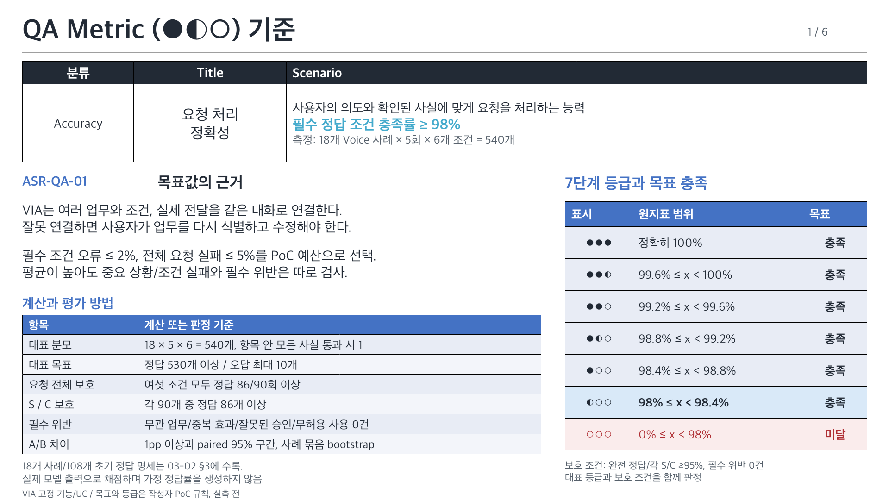
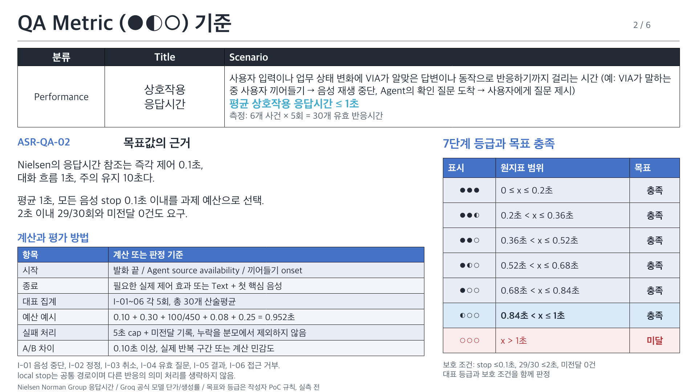
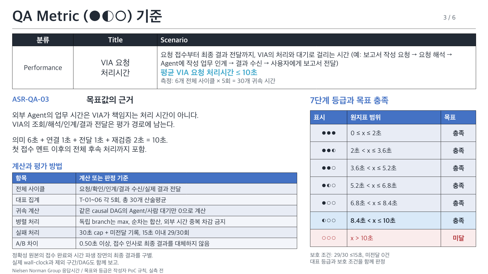
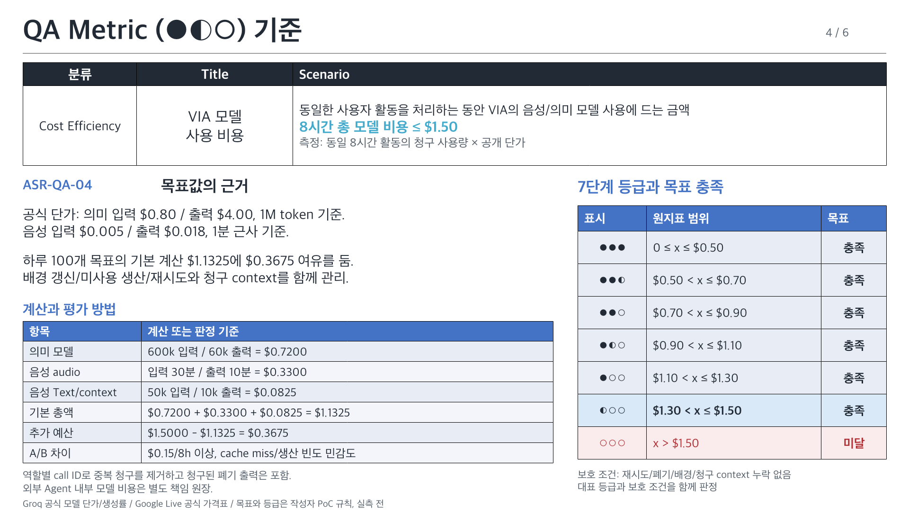
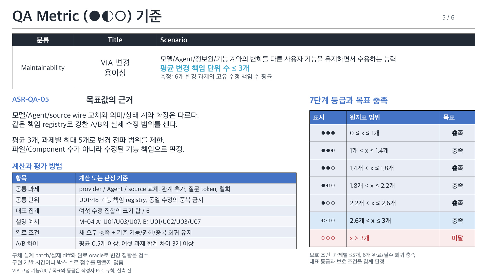
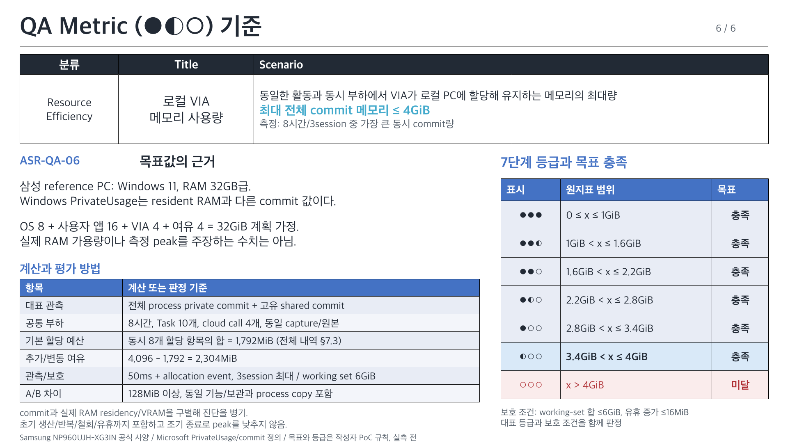

# VIA QA 목표 근거와 7단계 등급

[03-02 원본](../architecture/12-decisions/decision-packages/03-02-quality-attribute-definitions.md)을 여섯 장으로 설명한다. [편집 가능한 PPTX, 6장](quality-metrics/VIA-quality-metrics.pptx) / [PNG 미리보기](quality-metrics/index.html) / [요약표](quality-attributes.md).

제공한 레퍼런스의 상단 요약표, 목표 근거/계산과 오른쪽 등급표 구성을 따른다. 타 과제의 수치/요구사항은 가져오지 않았다. 목표와 등급 경계는 작성자의 VIA PoC 예산이며 출처의 보장 수치와 구별한다.

등급 6~0의 표시는 ●●● / ●●◐ / ●●○ / ●◐○ / ●○○ / ◐○○ / ○○○다. 원지표의 개선 여유를 나타내며 QA 간 합산하지 않는다. 1~6점은 대표 목표를 만족하지만 보호 조건 실패가 있으면 전체 목표는 미달이다. 실측 전은 0점이 아니며 현재 후보 점수는 생성하지 않았다.

## ASR-QA-01 요청 처리 정확성

**정의:** 사용자의 의도와 확인된 사실에 맞게 요청을 처리하는 능력

**대표 지표:** 필수 정답 조건 충족률(%) = 정답 항목 수 ÷ 전체 540개 항목 × 100

**목표:** 98% 이상, 보조 한도는 §3.5

**목표 근거:** 50개 필수 조건당 오류 1개 이하, 요청 전체의 사용자 수정 부담은 20회당 1회 이하로 제한하는 PoC 예산. 530/540개 정답, 완전 정답 86/90회와 각 S/C 95%, 필수 위반 0건을 함께 검사 (§3.5.1)

| 항목 | 계산/평가 규칙 |
| --- | --- |
| 대표 분모 | 18 × 5 × 6 = 540개, 항목 안 모든 사실 통과 시 1 |
| 대표 목표 | 정답 530개 이상 / 오답 최대 10개 |
| 요청 전체 보호 | 여섯 조건 모두 정답 86/90회 이상 |
| S / C 보호 | 각 90개 중 정답 86개 이상 |
| 필수 위반 | 무관 업무/중복 효과/잘못된 승인/무허용 사용 0건 |
| A/B 차이 | 1pp 이상과 paired 95% 구간, 사례 묶음 bootstrap |

**보호 조건:** 완전 정답/각 S/C ≥95%, 필수 위반 0건

18개 사례/108개 초기 정답 명세는 03-02 §3에 수록. 실제 모델 출력으로 채점하며 가정 정답률을 생성하지 않음.

| 점수/표시 | 원지표 범위 | 대표 목표 |
| --- | --- | --- |
| 6 / ●●● | x = 100% | 충족 |
| 5 / ●●◐ | 99.6% ≤ x < 100% | 충족 |
| 4 / ●●○ | 99.2% ≤ x < 99.6% | 충족 |
| 3 / ●◐○ | 98.8% ≤ x < 99.2% | 충족 |
| 2 / ●○○ | 98.4% ≤ x < 98.8% | 충족 |
| 1 / ◐○○ | 98% ≤ x < 98.4% | 충족 |
| 0 / ○○○ | 0% ≤ x < 98% | 미달 |

출처: [VIA 고정 기능/UC](../architecture/05-representative-use-cases.md), [03-02 공통 QA 계약 v4](../architecture/12-decisions/decision-packages/03-02-quality-attribute-definitions.md). 숫자/목표 선택과 상세 경계는 03-02 §3 및 §8.9.

## ASR-QA-02 상호작용 응답시간

**정의:** 사용자 입력이나 업무 상태 변화에 VIA가 알맞은 답변이나 동작으로 반응하기까지 걸리는 시간 (예: VIA가 말하는 중 사용자 끼어들기 → 음성 재생 중단, Agent의 확인 질문 도착 → 사용자에게 질문 제시)

**대표 지표:** 평균 유효 반응시간(초) = 6개 사건 × 5회, 30개 귀속 시간의 산술평균

**목표:** 1.0초 이하, 음성 stop 0.1초 이하

**목표 근거:** PC 작업 중 대화/제어 흐름 유지. Nielsen의 1초/즉각 제어 0.1초를 참고하고 모델/코드/음성 준비 예산 0.952초로 구체화. 2초 보호 한도와 미전달 0건도 검사 (§4.2)

| 항목 | 계산/평가 규칙 |
| --- | --- |
| 시작 | 발화 끝 / Agent source availability / 끼어들기 onset |
| 종료 | 필요한 실제 제어 효과 또는 Text + 첫 핵심 음성 |
| 대표 집계 | I-01~06 각 5회, 총 30개 산술평균 |
| 예산 예시 | 0.10 + 0.30 + 100/450 + 0.08 + 0.25 = 0.952초 |
| 실패 처리 | 5초 cap + 미전달 기록, 누락을 분모에서 제외하지 않음 |
| A/B 차이 | 0.10초 이상, 실제 반복 구간 또는 계산 민감도 |

**보호 조건:** stop ≤0.1초, 29/30 ≤2초, 미전달 0건

I-01 음성 중단, I-02 정정, I-03 취소, I-04 유효 질문, I-05 결과, I-06 접근 거부. local stop는 공통 경로이며 다른 반응의 의미 처리를 생략하지 않음.

| 점수/표시 | 원지표 범위 | 대표 목표 |
| --- | --- | --- |
| 6 / ●●● | 0 ≤ x ≤ .2 초 | 충족 |
| 5 / ●●◐ | .2 < x ≤ .36 초 | 충족 |
| 4 / ●●○ | .36 < x ≤ .52 초 | 충족 |
| 3 / ●◐○ | .52 < x ≤ .68 초 | 충족 |
| 2 / ●○○ | .68 < x ≤ .84 초 | 충족 |
| 1 / ◐○○ | .84 < x ≤ 1 초 | 충족 |
| 0 / ○○○ | x > 1 초 | 미달 |

출처: [Nielsen Norman Group 응답시간](https://www.nngroup.com/articles/website-response-times/), [Groq 공식 모델 단가/생성률](https://console.groq.com/docs/models), [03-02 공통 QA 계약 v4](../architecture/12-decisions/decision-packages/03-02-quality-attribute-definitions.md). 숫자/목표 선택과 상세 경계는 03-02 §4 및 §8.9.

## ASR-QA-03 VIA 요청 처리시간

**정의:** 요청 접수부터 최종 결과 전달까지, VIA의 처리와 대기로 걸리는 시간 (예: 보고서 작성 요청 → 요청 해석 → Agent에 작성 업무 인계 → 결과 수신 → 사용자에게 보고서 전달)

**대표 지표:** 평균 VIA 귀속 사이클 시간(초) = 6개 전체 사이클 × 5회, 30개 값의 산술평균

**목표:** 10초 이하

**목표 근거:** 외부 업무가 끝난 뒤에도 VIA 연결/전달 때문에 지연되지 않도록 의미 6초, 연결 1초, 전달 1초, 재검증 2초의 예산. 10초 주의 유지 참조와 연결하며 15초 보호 한도/미전달 0건 검사 (§4.3)

| 항목 | 계산/평가 규칙 |
| --- | --- |
| 전체 사이클 | 요청/확인/인계/결과 수신/실제 결과 전달 |
| 대표 집계 | T-01~06 각 5회, 총 30개 산술평균 |
| 귀속 계산 | 같은 causal DAG의 Agent/사람 대기만 0으로 계산 |
| 병렬 처리 | 독립 branch는 max, 순차는 합산, 외부 시간 중복 차감 금지 |
| 실패 처리 | 30초 cap + 미전달 기록, 15초 이내 29/30회 |
| A/B 차이 | 0.50초 이상, 접수 인사로 최종 결과를 대체하지 않음 |

**보호 조건:** 29/30 ≤15초, 미전달 0건

정확성 원본의 접수 완료와 시간 파생 장면의 최종 결과를 구별. 실제 wall-clock과 제외 구간/DAG도 함께 보고.

| 점수/표시 | 원지표 범위 | 대표 목표 |
| --- | --- | --- |
| 6 / ●●● | 0 ≤ x ≤ 2 초 | 충족 |
| 5 / ●●◐ | 2 < x ≤ 3.6 초 | 충족 |
| 4 / ●●○ | 3.6 < x ≤ 5.2 초 | 충족 |
| 3 / ●◐○ | 5.2 < x ≤ 6.8 초 | 충족 |
| 2 / ●○○ | 6.8 < x ≤ 8.4 초 | 충족 |
| 1 / ◐○○ | 8.4 < x ≤ 10 초 | 충족 |
| 0 / ○○○ | x > 10 초 | 미달 |

출처: [Nielsen Norman Group 응답시간](https://www.nngroup.com/articles/website-response-times/), [03-02 공통 QA 계약 v4](../architecture/12-decisions/decision-packages/03-02-quality-attribute-definitions.md). 숫자/목표 선택과 상세 경계는 03-02 §4 및 §8.9.

## ASR-QA-04 VIA 모델 사용 비용

**정의:** 동일한 사용자 활동을 처리하는 동안 VIA의 음성/의미 모델 사용에 드는 금액

**대표 지표:** 8시간 평균 총 모델 비용(USD). 100개 목표/배경 생산/재시도/음성과 청구 context를 모두 합산

**목표:** $1.50/8시간 이하

**목표 근거:** 하루 100개 목표와 청구 음성 입력 30분/출력 10분의 공개 단가 계산 $1.1325에 추가 생산/재시도 여유 $0.3675를 둔 작성자 예산 (§5.3)

| 항목 | 계산/평가 규칙 |
| --- | --- |
| 의미 모델 | 600k 입력 / 60k 출력 = $0.7200 |
| 음성 audio | 입력 30분 / 출력 10분 = $0.3300 |
| 음성 Text/context | 50k 입력 / 10k 출력 = $0.0825 |
| 기본 총액 | $0.7200 + $0.3300 + $0.0825 = $1.1325 |
| 추가 예산 | $1.5000 - $1.1325 = $0.3675 |
| A/B 차이 | $0.15/8h 이상, cache miss/생산 빈도 민감도 |

**보호 조건:** 재시도/폐기/배경/청구 context 누락 없음

역할별 call ID로 중복 청구를 제거하고 청구된 폐기 출력은 포함. 외부 Agent 내부 모델 비용은 별도 책임 원장.

| 점수/표시 | 원지표 범위 | 대표 목표 |
| --- | --- | --- |
| 6 / ●●● | 0 ≤ x ≤ .5 USD/8h | 충족 |
| 5 / ●●◐ | .5 < x ≤ .7 USD/8h | 충족 |
| 4 / ●●○ | .7 < x ≤ .9 USD/8h | 충족 |
| 3 / ●◐○ | .9 < x ≤ 1.1 USD/8h | 충족 |
| 2 / ●○○ | 1.1 < x ≤ 1.3 USD/8h | 충족 |
| 1 / ◐○○ | 1.3 < x ≤ 1.5 USD/8h | 충족 |
| 0 / ○○○ | x > 1.5 USD/8h | 미달 |

출처: [Groq 공식 모델 단가/생성률](https://console.groq.com/docs/models), [Google Live 공식 가격표](https://ai.google.dev/gemini-api/docs/pricing), [03-02 공통 QA 계약 v4](../architecture/12-decisions/decision-packages/03-02-quality-attribute-definitions.md). 숫자/목표 선택과 상세 경계는 03-02 §5 및 §8.9.

## ASR-QA-05 VIA 변경 용이성

**정의:** 모델/Agent/정보원/기능 계약의 변화를 다른 사용자 기능을 유지하면서 수용하는 능력

**대표 지표:** 평균 변경 책임 단위 수(개/과제) = 여섯 공통 과제의 고유 수정 단위 수 합 ÷ 6

**목표:** 3개 이하, 과제별 최대 5개

**목표 근거:** 외부/의미 계약 변경을 adapter/생산/소비의 약 3개 책임에 국소화하고 대화/업무/음성 전체 변경을 방지하는 과제 예산. 공통 18개 책임 registry와 완료 oracle로 검수 (§6.4)

| 항목 | 계산/평가 규칙 |
| --- | --- |
| 공통 과제 | provider / Agent / source 교체, 관계 추가, 질문 token, 철회 |
| 공통 단위 | U01~18 기능 책임 registry, 동일 수정의 중복 금지 |
| 대표 집계 | 여섯 수정 집합의 크기 합 / 6 |
| 설명 예시 | M-04 A: U01/U03/U07, B: U01/U02/U03/U07 |
| 완료 조건 | 새 요구 충족 + 기존 기능/권한/중복 회귀 유지 |
| A/B 차이 | 평균 0.5개 이상, 여섯 과제 합계 차이 3개 이상 |

**보호 조건:** 과제별 ≤5개, 6개 완료/필수 회귀 충족

구체 설계 patch/실제 diff와 완료 oracle로 변경 집합을 검수. 구현 개발 시간이나 박스 수로 점수를 만들지 않음.

| 점수/표시 | 원지표 범위 | 대표 목표 |
| --- | --- | --- |
| 6 / ●●● | 0 ≤ x ≤ 1 개/과제 | 충족 |
| 5 / ●●◐ | 1 < x ≤ 1.4 개/과제 | 충족 |
| 4 / ●●○ | 1.4 < x ≤ 1.8 개/과제 | 충족 |
| 3 / ●◐○ | 1.8 < x ≤ 2.2 개/과제 | 충족 |
| 2 / ●○○ | 2.2 < x ≤ 2.6 개/과제 | 충족 |
| 1 / ◐○○ | 2.6 < x ≤ 3 개/과제 | 충족 |
| 0 / ○○○ | x > 3 개/과제 | 미달 |

출처: [VIA 고정 기능/UC](../architecture/05-representative-use-cases.md), [03-02 공통 QA 계약 v4](../architecture/12-decisions/decision-packages/03-02-quality-attribute-definitions.md). 숫자/목표 선택과 상세 경계는 03-02 §6 및 §8.9.

## ASR-QA-06 로컬 VIA 메모리 사용량

**정의:** 동일한 활동과 동시 부하에서 VIA가 로컬 PC에 할당해 유지하는 메모리의 최대량

**대표 지표:** 최대 전체 commit 메모리(MiB) = 모든 VIA process의 private commit + 고유 공유 anonymous commit의 동시 합 최대

**목표:** 4,096MiB(4GiB) 이하

**목표 근거:** 32GB급 Windows PC에서 OS 8GiB/사용자 앱 16GiB/VIA 4GiB/여유 4GiB로 계획. 기본 allocation 예산 1,792MiB에 DP 추가 상태/변동 여유 2,304MiB. RAM residency와 commit 구별 (§7.3)

| 항목 | 계산/평가 규칙 |
| --- | --- |
| 대표 관측 | 전체 process private commit + 고유 shared commit |
| 공통 부하 | 8시간, Task 10개, cloud call 4개, 동일 capture/원본 |
| 기본 할당 예산 | 동시 8개 할당 항목의 합 = 1,792MiB (전체 내역 §7.3) |
| 추가/변동 여유 | 4,096 - 1,792 = 2,304MiB |
| 관측/보호 | 50ms + allocation event, 3session 최대 / working set 6GiB |
| A/B 차이 | 128MiB 이상, 동일 기능/보관과 process copy 포함 |

**보호 조건:** working-set 합 ≤6GiB, 유휴 증가 ≤16MiB

commit과 실제 RAM residency/VRAM을 구별해 진단을 병기. 초기 생산/반복/철회/유휴까지 포함하고 조기 종료로 peak를 낮추지 않음.

| 점수/표시 | 원지표 범위 | 대표 목표 |
| --- | --- | --- |
| 6 / ●●● | 0 ≤ x ≤ 1024 MiB | 충족 |
| 5 / ●●◐ | 1024 < x ≤ 1638.4 MiB | 충족 |
| 4 / ●●○ | 1638.4 < x ≤ 2252.8 MiB | 충족 |
| 3 / ●◐○ | 2252.8 < x ≤ 2867.2 MiB | 충족 |
| 2 / ●○○ | 2867.2 < x ≤ 3481.6 MiB | 충족 |
| 1 / ◐○○ | 3481.6 < x ≤ 4096 MiB | 충족 |
| 0 / ○○○ | x > 4096 MiB | 미달 |

출처: [Samsung NP960UJH-XG3IN 공식 사양](https://www.samsung.com/in/computers/galaxy-book/galaxy-book6-ultra-ultra-7-32gb-1tb-np960ujh-xg3in/), [Microsoft PrivateUsage/commit 정의](https://learn.microsoft.com/en-us/windows/win32/api/psapi/ns-psapi-process_memory_counters_ex), [03-02 공통 QA 계약 v4](../architecture/12-decisions/decision-packages/03-02-quality-attribute-definitions.md). 숫자/목표 선택과 상세 경계는 03-02 §7 및 §8.9.

## 변경과 재생성

이전 자료는 [archive](../archive/qa-presentations-before-asr-20261011/README.md)에 보존했다. [입력 원장](../architecture/12-decisions/decision-packages/03-02-poc-inputs.json), [검산 보고](../architecture/12-decisions/decision-packages/03-02-poc-calculation-report.md)와 [재생성 안내](quality-metrics/README.md)를 따른다. 상세 정의는 03-02 하나에서 유지하고 문안/JSON/PPTX의 원본 hash를 함께 갱신한다.
