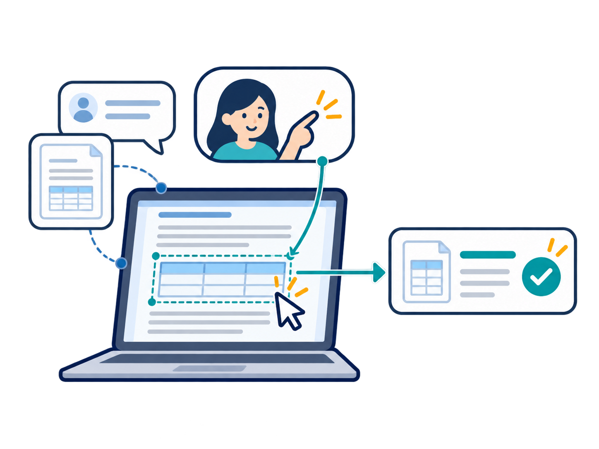
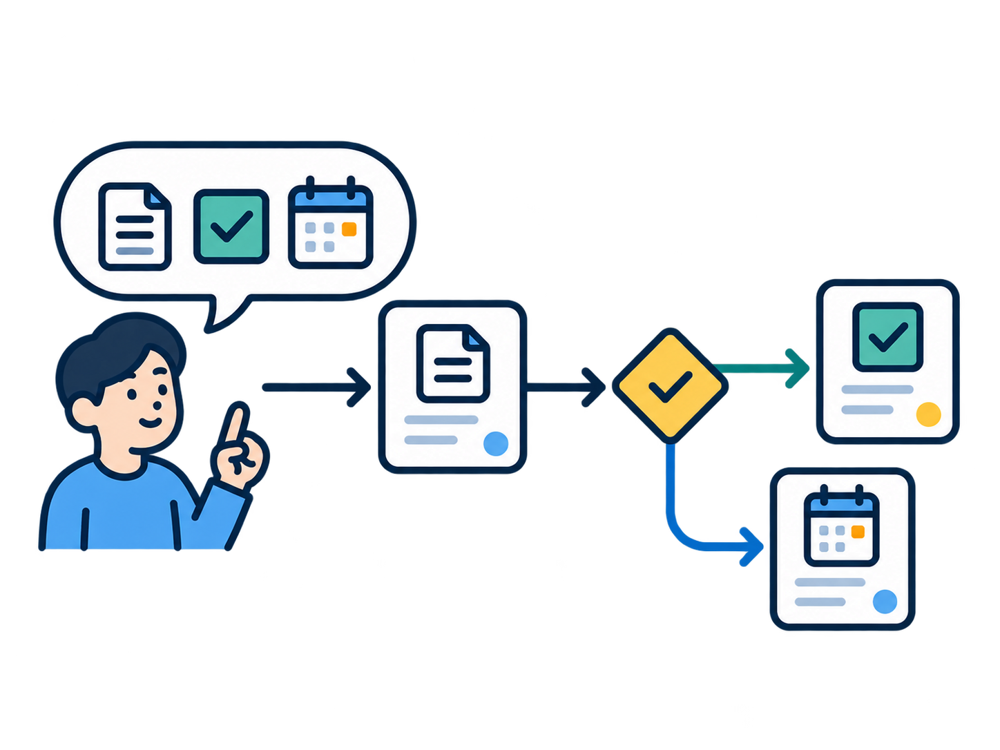
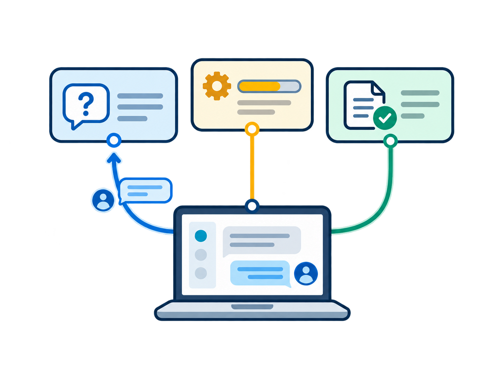
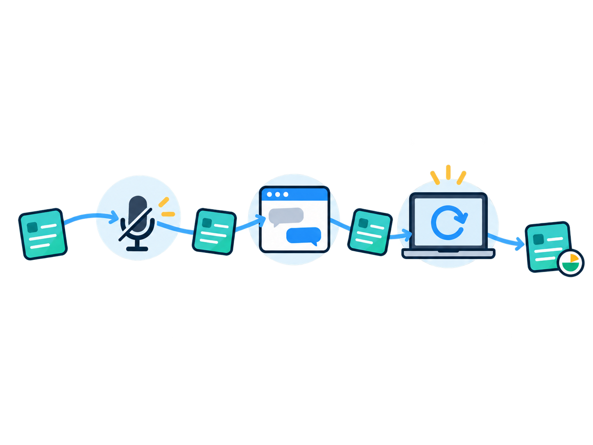
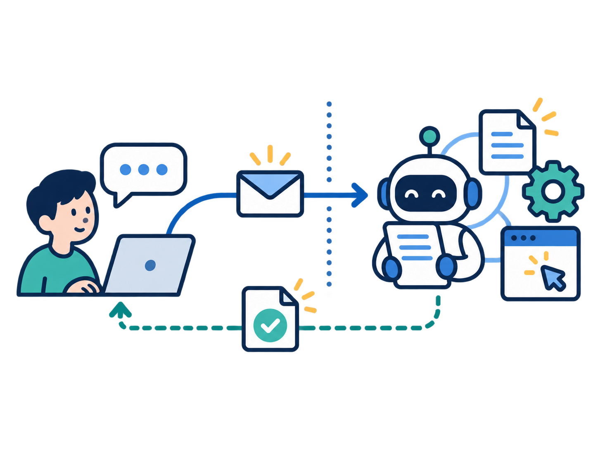

# VIA 기능 요구사항 및 제약사항

04-41~45의 주요 설계 결정과 직접 연결되는 발표용 요구사항을 정리한다.

## 기능 요구사항

| ID | 기능 요구사항명 | 설명 | 관련 DP |
|---|---|---|---|
| FR1 | 지속 대화 처리 | VIA가 요청을 처리하거나 응답하는 동안에도 사용자의 음성 또는 텍스트 입력을 받아 대화를 이어갈 수 있어야 한다. | 04-44 |
| FR2 | 맥락 기반 요청 해석 | 화면, 자료와 대화 맥락을 이용해 사용자 입력을 목표, 대상, 조건과 관련 업무가 식별된 요청으로 해석할 수 있어야 한다. | 04-41, 04-43 |
| FR3 | 복합 요청 처리 | 한 입력에 포함된 여러 요청을 사용자가 명시한 순서, 조건과 결과 의존 관계에 따라 처리할 수 있어야 한다. | 04-41, 04-43, 04-44 |
| FR4 | 다중 업무 상호작용 | 여러 업무의 질문, 진행 상황, 결과와 사용자 후속 지시를 각각 해당 업무에 연결할 수 있어야 한다. | 04-42, 04-43, 04-44 |
| FR5 | 업무 연속성 유지 | 음성 연결 종료, 대화 전환 또는 VIA 재시작 이후에도 기존 업무를 중복 실행 없이 확인 가능한 상태로 이어갈 수 있어야 한다. | 04-42 |
| FR6 | 과거 맥락 활용 | 이전 대화의 정정 내용, 업무 결과와 허용된 사용자 기억을 현재 요청에 필요한 맥락으로 활용할 수 있어야 한다. | 04-45 |

## 제약사항

| ID | 제약사항명 | 설명 | 관련 DP |
|---|---|---|---|
| C1 | 온디바이스 Omni 공유 | 음성 대화와 요청 의미 해석은 사용자 PC에 적재된 하나의 Omni 모델 가중치를 공유해야 한다. | 04-41, 04-43, 04-44, 04-45 |
| C2 | 업무 실행 위임 | 실제 업무 수행에 필요한 도메인 추론, 계획, 도구 선택과 실행은 Downstream Agent에 위임해야 한다. | 04-41, 04-42, 04-43 |

관련 DP는 직접적인 설계 영향의 연결이며 전체 준수 범위를 뜻하지 않는다. 단일 Omni 공유는 별도 입력 인식용 Streaming ASR을 금지한다는 뜻이 아니다.

## 선택 사용 가능한 발표용 그림

각 그림은 기능과 제약의 개념을 설명하는 선택 자료이며, 특정 설계 대안의 구조나 구현 결과를 나타내지 않는다. 그림의 문자 없이도 발표에서 축소해 사용할 수 있도록 제작했다.

| ID | 그림 | 시각적 의미 |
|---|---|---|
| FR1 |  | 응답 중에도 열린 음성 및 텍스트 입력 |
| FR2 |  | 화면의 지칭 대상과 사용자 요청의 연결 |
| FR3 |  | 복수 요청의 순서, 조건과 결과 의존 |
| FR4 |  | 서로 섞이지 않는 업무별 질문과 결과 |
| FR5 |  | 연결 또는 대화가 바뀌어도 이어지는 같은 업무 |
| FR6 |  | 과거 정정, 결과와 사용자 기억의 현재 활용 |
| C1 |  | PC 안의 단일 모델을 공유하는 음성 및 의미 처리 |
| C2 |  | 사용자 요청 연결과 실제 업무 실행의 책임 경계 |

[그림 모아 보기](./requirements-assets/index.html) / [이미지 생성 프롬프트](./requirements-assets/prompts.md)

## 관련 설계 문서

- [04-41 요청 의미 해결](../architecture/12-decisions/decision-packages/04-41-request-resolution-control.md)
- [04-42 대화와 업무의 수명](../architecture/12-decisions/decision-packages/04-42-lifecycle-ownership.md)
- [04-43 요청 이해의 판단 책임](../architecture/12-decisions/decision-packages/04-43-request-interpretation.md)
- [04-44 지속 대화 실행](../architecture/12-decisions/decision-packages/04-44-continuous-interaction.md)
- [04-45 기억과 Context](../architecture/12-decisions/decision-packages/04-45-memory-and-context.md)
