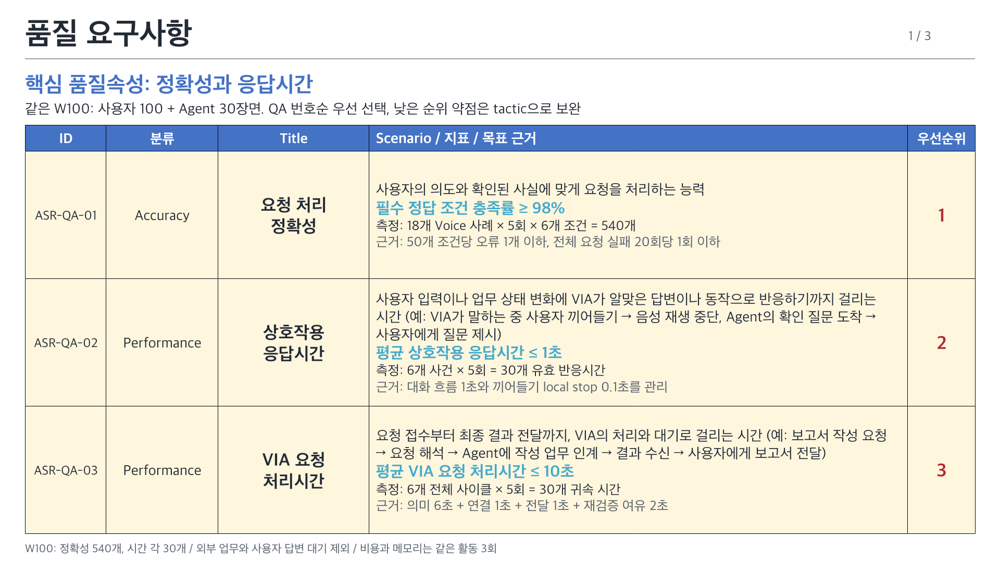
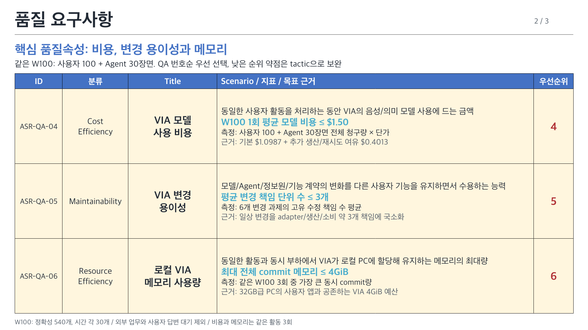
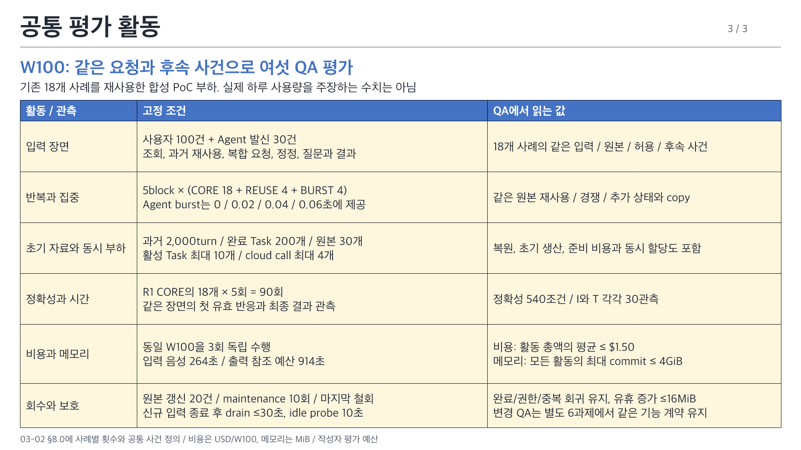

# VIA 중요 품질속성 발표 요약

[정의 원본 03-02](../architecture/12-decisions/decision-packages/03-02-quality-attribute-definitions.md)의 ASR-QA-01~06을 세 장으로 요약한다. 번호순 우선순위는 01 → 02 → 03 → 04 → 05 → 06이며 낮은 순위의 약점은 tactic으로 보완한다.

> ASR-QA-v5 / 2026-10-11 / 작성자 정의와 참조 계산. 후보 성능과 Windows 실측 결과는 아직 없다.

[편집 가능한 PPTX, 3장](quality-attributes/VIA-quality-attributes.pptx) / [PNG 미리보기](quality-attributes/index.html) / [QA별 근거와 등급, 6장](quality-metrics.md)

| ID | 이름 | 정의 | 대표 측정 지표 | 목표값 | 과제 차원의 목표 근거 |
| --- | --- | --- | --- | --- | --- |
| ASR-QA-01 | 요청 처리 정확성 | 사용자의 의도와 확인된 사실에 맞게 요청을 처리하는 능력 | 필수 정답 조건 충족률(%) = 정답 항목 수 ÷ 전체 540개 항목 × 100 | 98% 이상, 보조 한도는 §3.5 | 50개 필수 조건당 오류 1개 이하, 요청 전체의 사용자 수정 부담은 20회당 1회 이하로 제한하는 PoC 예산. 530/540개 정답, 완전 정답 86/90회와 각 S/C 95%, 필수 위반 0건을 함께 검사 (§3.5.1) |
| ASR-QA-02 | 상호작용 응답시간 | 사용자 입력이나 업무 상태 변화에 VIA가 알맞은 답변이나 동작으로 반응하기까지 걸리는 시간 (예: VIA가 말하는 중 사용자 끼어들기 → 음성 재생 중단, Agent의 확인 질문 도착 → 사용자에게 질문 제시) | 평균 유효 반응시간(초) = 6개 사건 × 5회, 30개 귀속 시간의 산술평균 | 1.0초 이하, 음성 stop 0.1초 이하 | PC 작업 중 대화/제어 흐름 유지. Nielsen의 1초/즉각 제어 0.1초를 참고하고 모델/코드/음성 준비 예산 0.952초로 구체화. 2초 보호 한도와 미전달 0건도 검사 (§4.2) |
| ASR-QA-03 | VIA 요청 처리시간 | 요청 접수부터 최종 결과 전달까지, VIA의 처리와 대기로 걸리는 시간 (예: 보고서 작성 요청 → 요청 해석 → Agent에 작성 업무 인계 → 결과 수신 → 사용자에게 보고서 전달) | 평균 VIA 귀속 사이클 시간(초) = 6개 전체 사이클 × 5회, 30개 값의 산술평균 | 10초 이하 | 외부 업무가 끝난 뒤에도 VIA 연결/전달 때문에 지연되지 않도록 의미 6초, 연결 1초, 전달 1초, 재검증 2초의 예산. 10초 주의 유지 참조와 연결하며 15초 보호 한도/미전달 0건 검사 (§4.3) |
| ASR-QA-04 | VIA 모델 사용 비용 | 동일한 사용자 활동을 처리하는 동안 VIA의 음성/의미 모델 사용에 드는 금액 | 표준 활동 W100 1회 평균 총 모델 비용(USD/묶음). 사용자 입력 100건과 Agent 발신 30건의 전체 청구를 3회 독립 수행해 평균 | $1.50/W100 이하 | 18개 대표 사례에서 구성한 동일 활동의 의미 300호출 예산/음성 입력 264초/출력 914초 참조 계산 $1.0987에 추가 생산/재시도 여유 $0.4013을 둔 작성자 예산 (§5.3, §8.0) |
| ASR-QA-05 | VIA 변경 용이성 | 모델/Agent/정보원/기능 계약의 변화를 다른 사용자 기능을 유지하면서 수용하는 능력 | 평균 변경 책임 단위 수(개/과제) = 여섯 공통 과제의 고유 수정 단위 수 합 ÷ 6 | 3개 이하, 과제별 최대 5개 | 외부/의미 계약 변경을 adapter/생산/소비의 약 3개 책임에 국소화하고 대화/업무/음성 전체 변경을 방지하는 과제 예산. 공통 18개 책임 registry와 완료 oracle로 검수 (§6.4) |
| ASR-QA-06 | 로컬 VIA 메모리 사용량 | 동일한 활동과 동시 부하에서 VIA가 로컬 PC에 할당해 유지하는 메모리의 최대량 | 최대 전체 commit 메모리(MiB) = 같은 W100 3회 중 모든 VIA process의 private commit + 고유 공유 anonymous commit의 동시 합 최대 | 4,096MiB(4GiB) 이하 | 32GB급 Windows PC에서 OS 8GiB/사용자 앱 16GiB/VIA 4GiB/여유 4GiB로 계획. 기본 allocation 예산 1,792MiB에 DP 추가 상태/변동 여유 2,304MiB. RAM residency와 commit 구별 (§7.3) |

**공통 활동 W100:** 기존 18개 사례를 CORE/REUSE/BURST로 다섯 block에 배치한 사용자 입력 100건과 Agent 발신 30건이다. 입력 음성 264초/출력 참조 914초, 과거 2,000turn/완료 Task 200개, 활성 Task 최대 10개와 cloud 호출 최대 4개를 비용/메모리에 함께 적용한다. 정확성/시간은 R1 CORE의 지정 관측, 비용은 세 활동 평균, 메모리는 세 활동 최대다. 실제 하루 사용 통계를 가정하지 않는다.

외부 Agent의 업무 수행 시간은 시간 지표에서 제외하며 VIA 모델/통신/연결/결과 전달은 남긴다. Text 입력을 추가하지 않고 공통 Voice replay를 사용한다. 정확성 18개는 각 6개 조건을 5회씩 채점하는 540개 항목이며 시간은 각각 30개 관측이다. 비용/메모리는 같은 W100의 독립 3회, 변경은 여섯 공통 과제다.

표의 대표 목표 외에도 보호 조건을 검사한다. 정확성 전체/상황별/조건별 정답과 필수 위반, 시간 미전달/음성 stop, 변경 완료/회귀, 메모리 working set/유휴 증가를 원본대로 보고한다. 목표 충족 등급만으로 보호 조건 실패를 숨기지 않는다.

## 원문과 자료 관리

[18개 상세 정답 투영](quality-attributes/functional-coverage.json), [평가 규모/목표 투영](quality-attributes/evaluation-plan.json)과 [측정 설계 연결](quality-attributes/measurement-design.md)은 03-02의 원본 hash로 추적한다. 상세 정의는 03-02에서 수정하고 투영/발표 파일을 재생성한다.

이전 V-01~10 요약/10장 부록/시험 초안/생성 코드는 [archive](../archive/qa-presentations-before-asr-20261011/README.md)에 원래 bytes와 hash로 보존했다. 기존 QA catalog/V ID/ADR/참조 설계를 이번 발표 ID로 바꾸지 않는다.

