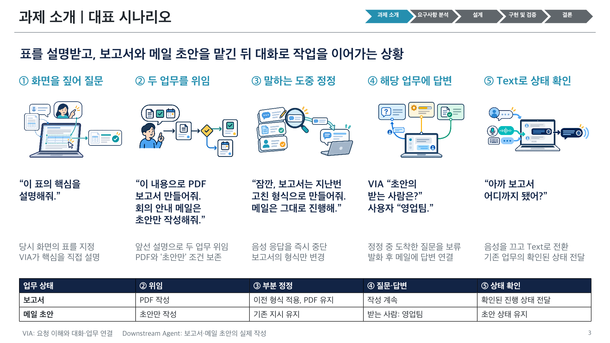

# 과제 소개: 대표 시나리오

- [편집 가능한 PPTX, 1장](../VIA-representative-scenario.pptx)
- [PNG 미리보기](./representative-scenario.png)
- [문안과 그림 목록](./scenario.json)
- [생성 스크립트](../../../scripts/presentations/generate_representative_scenario.mjs)

기존 [과제 소개 자료](../VIA_과제배경_필요성_검토반영_v3.pptx)의 ‘VIA의 역할과 범위’ 뒤에 삽입할 한 장이다. 같은 16:9 크기, Apple SD Gothic Neo 글꼴과 상단 탐색 표시를 사용한다. 페이지 번호는 삽입 위치에 맞춰 3으로 두었다. 기존 소개 PPTX는 별도로 유지한다.

다섯 사례를 하나의 연속 대화로 구성했다. 표 설명을 요청한 뒤 그 설명으로 PDF 보고서와 메일 초안을 맡긴다. 음성 응답 도중 보고서 형식만 정정하고, 메일의 수신자 질문에 답한다. 마지막에는 음성을 끄고 Text로 기존 보고서의 상태를 확인한다. 실제 보고서 및 메일 작성은 Downstream Agent가 맡고 VIA는 요청 이해, 상호작용과 업무 연결을 맡는다.

제목, 발화, 설명과 역할 문구는 텍스트 개체다. 하단 업무 흐름은 3행 5열의 PowerPoint 표다. 다섯 그림은 [기존 요구사항 일러스트](../requirements-assets/index.html)를 각각 독립 이미지 개체로 넣어 이동과 크기 조절 및 교체가 가능하다. 그림 내부의 요소는 래스터 이미지다.



## 뒤의 품질속성과 DP 연결

아래 연결은 [품질 요구사항](../quality-attributes.md), [평가 설계](../quality-attributes/evaluation-plan.json), [필수 기능 변형 목록](../quality-attributes/functional-coverage.json) 및 설계 원문에서 확인한 문서상 연결이다. 이미 구현하거나 시험을 실행했다는 뜻은 아니다. 집중 시험은 같은 논점의 유사 사례를 포함하며 이 발표 대화 전체를 동일하게 실행하는 fixture는 아직 없다.

| 장면 | 확인할 품질속성 | 관련 설계 | 기존 평가 설계의 연결과 한계 |
| --- | --- | --- | --- |
| ① 화면의 표를 짚어 설명 요청 | V-01 기능 정확성, V-04 응답 신속성, V-05 요청 완료 신속성 | [41 요청 해소 제어](../../architecture/12-decisions/decision-packages/04-41-request-resolution-control.md), [43 요청 해석](../../architecture/12-decisions/decision-packages/04-43-request-interpretation.md), [44 연속 상호작용](../../architecture/12-decisions/decision-packages/04-44-continuous-interaction.md) | DP43-S07은 명확한 화면 표 설명을, DP41-S07은 조회 후 원본 변경을 다룬다. 같은 ‘표’를 정확히 지정하는 기능과 조회 비용을 연결한다. |
| ② 앞선 설명으로 보고서와 메일 초안 위임 | V-01 기능 정확성, V-03 기능 완전성, V-05 요청 완료 신속성 | 41, [42 수명과 상태 소유](../../architecture/12-decisions/decision-packages/04-42-lifecycle-ownership.md), 43 | UC-07/09/14 관련 복합 요청, Task 연결과 위임 기능에 연결된다. 이 장면은 독립된 두 목표와 ‘초안만’ 조건을 보여준다. 순서, 결과 의존과 실행 조건의 모든 변형을 보여주지는 않는다. |
| ③ 끼어들어 보고서 형식만 정정 | V-01 기능 정확성, V-04 응답 신속성, V-05 요청 완료 신속성 | 43, 44, [45 기억과 맥락](../../architecture/12-decisions/decision-packages/04-45-memory-and-context.md) | DP43-S04 부분 정정, DP44-S01 말하는 중 정정, DP45-S01 과거 정정 참조가 각각 연결된다. PDF 및 메일 지시 보존과 음성 중단을 구분한다. 과거 정정 활용은 장기 User Memory 승격을 자동으로 뜻하지 않는다. |
| ④ 정정 중 도착한 메일 질문에 답변 | V-01 기능 정확성, V-02 기능 적절성, V-04 응답 신속성, V-05 요청 완료 신속성 | 42, 43, 44 | DP42-S01 정상 질문 답변, DP44-S02 입력과 메일 수신자 질문 중첩이 연결된다. 실제 제시한 질문에 답을 연결하고 다른 업무를 유지하는지 확인한다. |
| ⑤ Voice 종료 후 Text로 보고서 상태 확인 | V-01 기능 정확성, V-03 기능 완전성, V-05 요청 완료 신속성 | 42, 44 | UC-15 Voice 종료 후 Task 재접근을 공통 기능 회귀 모집단에서 다룬다. 정상 채널 전환이며 V-07 장애 복구 성능의 증거는 아니다. |

다섯 장면의 주요 기능은 뒤의 품질 요구사항과 41~45 설계에서 다뤄진다. **이 한 장만으로 모든 품질속성을 설명하지는 않는다.** V-08 변경 용이성, V-06 메모리 효율성, V-07 복구 용이성, V-09 분석 용이성과 V-10 기밀성은 별도의 변경, 메모리, 장애, 기록 및 권한 시험이 필요하다. 현재 평가 설계에 그 시험군을 제안해 두었으며 실행 결과는 없다. 비교안은 미선정 상태다.

V-04는 **평균 반응시간**, V-05는 **평균 VIA 처리시간**으로 발표자료의 집계를 통일한다. V-05는 외부 작업이나 사용자 답변만 기다린 구간을 제외한다. 설계 비교의 시간 수치는 작성자가 가정한 형식 예시이며 측정값을 다른 통계량으로 변환한 결과가 아니다.

## 재생성

번들 Node.js 및 Python과 `@oai/artifact-tool`을 사용한다. 새 private build 폴더에 스크립트를 복사하고 번들 `node_modules`를 연결한다. 다음 환경변수를 절대 경로로 지정한다.

- `VIA_PRESENTATION_SKILL_DIR`: Presentations skill 폴더
- `VIA_RUNTIME_PYTHON`: 번들 Python 실행 파일
- `RUNTIME_NODE_MODULES`: 번들 Node 패키지 폴더

```text
<bundled-node> <build>/generate_representative_scenario.mjs <repo> <build>
```

생성기는 한 장 PPTX를 내보내고 패키지, 크기, 글꼴과 native table을 검사한 뒤 재가져온 PPTX로 PNG를 렌더링한다. 출력은 최상위 PPTX와 이 폴더의 PNG다. 문안은 `scenario.json`에서 변경한다. 시각 검수는 별도로 수행한다.
