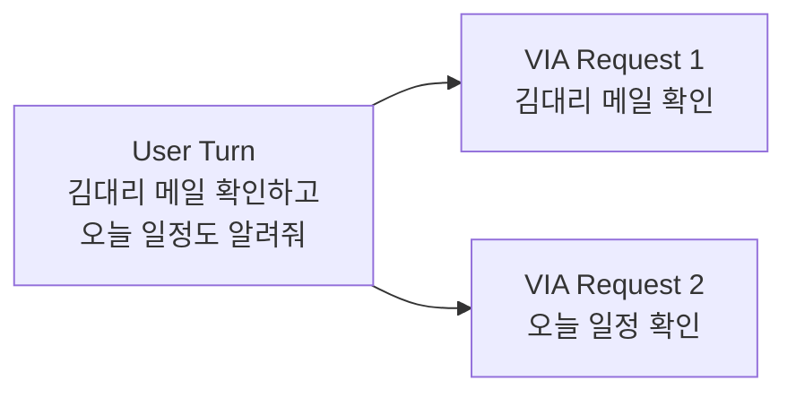
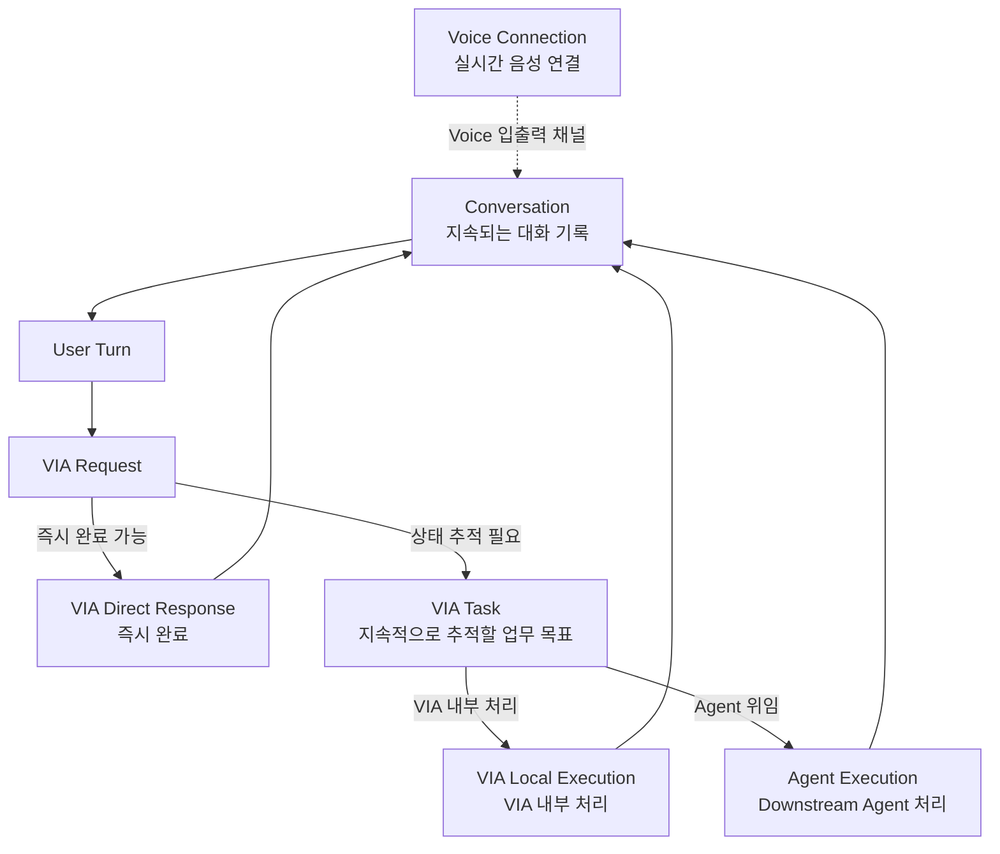
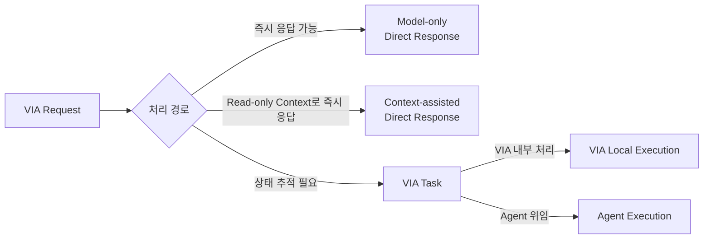
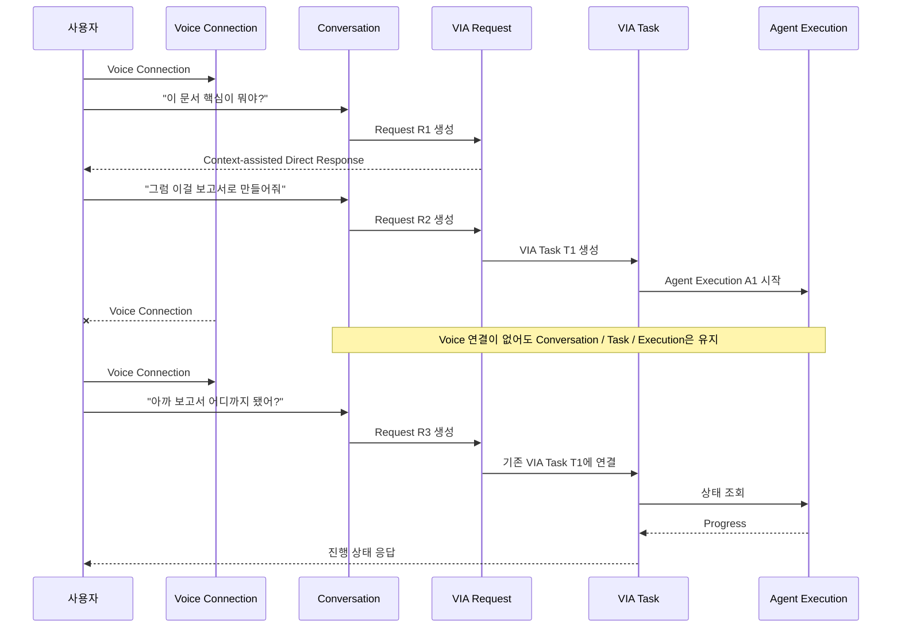
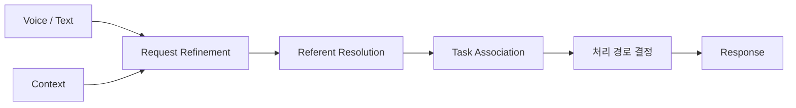
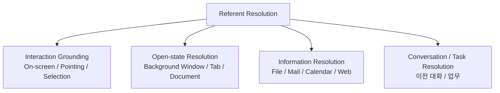

# 2. Terms

본 문서에서 사용하는 핵심 용어를 아래와 같이 정의한다.

이 정의는 이후 Use Case, Requirement, ASR, Test Case 및 Architecture Decision에서 동일하게 사용한다. 같은 개념을 서로 다른 단어로 부르거나, 하나의 단어를 여러 의미로 사용하지 않는다.

특히 본 과제에서는 혼동 가능성이 큰 `Session`이라는 용어를 핵심 lifecycle 단위로 사용하지 않는다.

---

## 2.1 핵심 Interaction 및 Lifecycle 용어

| 용어 | 정의 |
| --- | --- |
| **User Turn** | 사용자가 VIA에 한 번 입력하는 단위. Voice에서는 사용자의 한 번의 발화를 하나의 User Turn으로 보고, Text에서는 한 번의 메시지 전송을 하나의 User Turn으로 본다. |
| **User Request** | User Turn에 포함된 사용자의 질문, 지시 또는 목표. 하나의 User Turn에 서로 다른 요청이 여러 개 포함될 수 있다. |
| **VIA Request** | User Request를 VIA가 실제로 처리할 수 있도록 구분·정리한 하나의 논리적 처리 단위. 하나의 User Turn은 하나 이상의 VIA Request로 나뉠 수 있다. |
| **Conversation** | 사용자와 VIA 사이에 이어지는 논리적인 대화 기록. User Turn, VIA Request, VIA Response 및 대화 해석에 필요한 정보를 포함하며 Voice와 Text를 함께 사용할 수 있다. |
| **Voice Connection** | 사용자와 VIA Voice Runtime 사이에서 실시간 Voice 입력과 출력이 가능한 연결 구간. 연결은 끊어지고 다시 만들어질 수 있으며 Voice Connection의 종료는 Conversation이나 VIA Task의 종료를 의미하지 않는다. |
| **VIA Task** | 하나 이상의 VIA Request에 걸쳐 상태를 지속적으로 추적해야 하는 사용자의 업무 목표. 진행 상태, 관련 요청, 처리 경로 및 실행 상태를 VIA가 관리한다. |
| **VIA Local Execution** | VIA Task를 Downstream Agent에 위임하지 않고 VIA 내부에서 처리하는 실행. Read-only Context 조회와 VIA 내부 inference는 사용할 수 있지만 외부 상태를 변경하는 Action은 수행하지 않는다. |
| **Agent Execution** | VIA Task의 실제 업무를 수행하기 위해 Downstream Agent에서 시작된 하나의 실행 instance. Agent의 run, thread 또는 이에 준하는 실행 handle을 의미한다. |
| **VIA Response** | VIA가 사용자에게 전달하는 모든 사용자-facing 응답. User Request에 대한 답변뿐 아니라 Task progress, clarification, completion, failure 등도 포함한다. |

### User Turn, VIA Request, VIA Task의 관계

하나의 User Turn에는 여러 요청이 포함될 수 있다.

> "김대리 메일 확인하고, 오늘 일정도 알려줘."

위 발화는 하나의 User Turn이지만 두 개의 VIA Request로 나뉠 수 있다.



VIA Request는 처리 과정에 따라 즉시 완료될 수도 있고 VIA Task와 연결될 수도 있다.

---

## 2.2 Conversation, Request, Task, Execution의 관계

이 개념들은 서로 다른 의미와 lifecycle을 가진다.

- **Conversation**은 "지금까지 사용자와 VIA가 무슨 이야기를 했는가"를 관리한다.
- **VIA Request**는 "현재 VIA가 무엇을 처리해야 하는가"를 나타낸다.
- **VIA Task**는 "계속 상태를 추적해야 하는 사용자 업무 목표가 무엇인가"를 관리한다.
- **Execution**은 "그 업무를 실제로 어디에서 처리하고 있는가"를 나타낸다.

VIA Task의 실행은 다음 두 가지가 가능하다.

- VIA 내부에서 처리하는 **VIA Local Execution**
- Downstream Agent에서 처리하는 **Agent Execution**



핵심은 다음과 같다.

> **Conversation은 대화의 lifecycle이다.**  
> **VIA Request는 하나의 요청에 대한 lifecycle이다.**  
> **VIA Task는 지속적으로 추적해야 하는 업무의 lifecycle이다.**  
> **Execution은 Task를 실제로 처리하는 실행 lifecycle이다.**

---

## 2.3 Direct Response와 처리 경로

### VIA Direct Response

**VIA Direct Response**는 VIA Task를 생성할 필요 없이 현재 VIA Request를 즉시 완료하여 사용자에게 응답하는 처리 방식이다.

Direct Response는 다음 두 종류로 구분한다.

### Model-only Direct Response

별도의 외부 정보 조회나 Downstream Agent 실행 없이 VIA가 사용하는 Model의 지식과 현재 Conversation만으로 응답한다.

Voice 입력에서는 Voice Runtime의 S2S Model이 이 경로를 사용할 수 있다.

예:

> "TCP와 UDP의 차이가 뭐야?"

### Context-assisted Direct Response

VIA가 read-only Context를 조회한 뒤 Downstream Agent 없이 응답한다.

예:

> 현재 PDF를 보며 "이 문서 핵심이 뭐야?"

> "오늘 원달러 환율이 얼마야?"  
> → Public Web Search를 read-only Context 조회로 사용

두 경우 모두 결과는 Conversation에 기록되며 이후 요청에서 사용할 수 있다.

### VIA Task가 필요한 처리 경로

즉시 완료되지 않고 상태 추적이 필요한 사용자 목표는 VIA Task를 생성한다.

VIA Task는 실행 위치에 따라 다음 두 경로로 처리할 수 있다.

- **VIA Local Execution**: VIA 내부에서 처리
- **Agent Execution**: Downstream Agent에 위임하여 처리



Direct Response로 끝난 과거 대화도 Conversation Context에 남는다. 이후 실제 업무가 필요해지면 이 이전 Conversation Context를 사용하여 새로운 VIA Task를 만들 수 있다.

---

## 2.4 Task Association

**Task Association**은 새로운 VIA Request와 기존 VIA Task 사이의 관계를 결정하는 과정이다.

결과는 다음 세 가지 중 하나이다.

1. **No Task**
   - VIA Task 없이 Direct Response로 완료

2. **New Task**
   - 새로운 VIA Task를 생성

3. **Existing Task**
   - 기존 VIA Task에 이어지는 요청
   - 이 경우 어떤 VIA Task인지 식별해야 한다.

예:

> "아까 만들던 보고서 계속해줘."

결과:

```text
Existing Task → VIA Task T3
```

Task Association은 단순히 "새로운 요청인가?"만 판단하는 것이 아니라 **현재 VIA Request가 어떤 기존 사용자 업무와 관계가 있는가**까지 판단하는 것을 의미한다.

---

## 2.5 Lifecycle 분리 원칙

다음 lifecycle은 서로 독립적으로 관리한다.



쉽게 표현하면 다음과 같다.

> **Voice Connection = 지금 음성이 연결되어 있는가**  
> **Conversation = 지금까지 무슨 이야기를 했는가**  
> **VIA Request = 지금 무엇을 요청했는가**  
> **VIA Task = 계속 추적해야 하는 업무가 무엇인가**  
> **Execution = 그 업무를 실제로 어디에서 처리하고 있는가**

본 문서에서는 업무 lifecycle을 의미하는 용어로 `Session`을 사용하지 않는다.

또한 `Agent Task`라는 용어도 사용하지 않는다. Downstream Agent 내부에서 자체적으로 사용하는 task 개념과 혼동될 수 있기 때문이다.

---

## 2.6 Orchestration 용어

### Request Orchestration

하나의 VIA Request가 사용자 입력에서 최종 처리 경로로 연결되기까지 **VIA 내부 처리 흐름을 관리하는 책임**이다.

다음 범위를 포함한다.

- Voice/Text 입력 연결
- 필요한 Context 확보
- Request Refinement
- Referent Resolution
- Task Association
- Direct Response 여부 판단
- VIA Local Execution 또는 Agent Delegation 경로 결정
- 사용자 Response 연결



### Agent Orchestration

Downstream Agent가 필요한 VIA Task에 대해 **VIA Task와 Agent Execution 사이를 관리하는 책임**이다.

다음 범위를 포함한다.

- Downstream Agent 선택
- 요청 위임
- Agent Execution 연결
- progress
- clarification
- consent / approval interaction
- follow-up
- correction
- cancel
- result / failure

### VIA Orchestration

**Request Orchestration과 Agent Orchestration을 합친 VIA 전체 orchestration 책임**을 의미한다.

> `Orchestration`은 책임을 의미하며, 반드시 `Orchestrator`라는 하나의 Component가 존재한다는 의미는 아니다.

---

## 2.7 Context 범위

**Context**는 VIA가 현재 VIA Request를 이해하고 처리하기 위해 사용하는 사용자 주변의 상태와 정보이다.

본 과제에서 다루는 Context 범위를 다음 여섯 종류로 고정한다.

### 1. Interaction Context

사용자가 **현재 PC에서 무엇을 보고, 선택하고, 가리키고, 조작하고 있는가**를 나타낸다.

다음 정보를 범위에 포함한다.

- 현재 display에 표시되는 화면 정보
- foreground application
- active window
- focused window
- focused UI element
- 열린 application / window / document / browser tab 정보
- pointer position
- pointer trajectory
- pointer hover
- pointer button press / release
- drag 동작 및 drag 영역
- selection된 UI object
- selection된 text
- text caret 위치
- accessibility / UI object identity
- interaction event의 timestamp
- interaction event의 발생 순서

Interaction Context는 `Select then Speak`와 `Speak while Pointing`을 모두 지원하는 범위로 정의한다.

### 2. Conversation Context

현재 Conversation에서 이전에 주고받은 정보이다.

다음 정보를 포함한다.

- 이전 User Turn
- Voice transcript
- Text input
- 이전 VIA Request
- 이전 VIA Text Response
- 이전 VIA Voice Response의 의미 내용
- 이전 turn에서 확정된 Referent
- clarification 결과
- consent / approval 결과
- 입력 modality
- turn의 시간 및 순서 정보

Direct Response와 Agent-delegated interaction 모두 동일한 Conversation Context를 사용한다.

### 3. Task Context

현재 또는 이전 VIA Task의 상태와 관련된 정보이다.

다음 정보를 포함한다.

- VIA Task ID
- Task의 사용자 목표
- Task 상태
- Task와 연결된 VIA Request
- Task 생성 시간
- 최근 상태 변경 시간
- 현재 처리 경로
- 선택된 Downstream Agent
- VIA Local Execution 식별 정보
- Agent Execution 식별 정보
- progress
- result
- failure
- pending clarification
- pending consent / approval
- follow-up 상태
- correction 상태
- cancellation 상태

### 4. Personal Information Context

사용자가 소유하거나 사용자 계정과 연결된 정보를 read-only 방식으로 조회한 Context이다.

지원 범위를 다음으로 고정한다.

**Local File System**
- file / folder identity
- path
- metadata
- 정책상 허용된 file content

**Mail**
- message identity
- sender / recipient
- subject
- timestamp
- 정책상 허용된 message content

**Calendar**
- event identity
- 시간
- 참석자
- 위치
- 정책상 허용된 일정 내용

**Browser / User Data**
- browser history 중 정책상 허용된 정보
- bookmark
- 사용자 계정과 연관된 허용된 web data

### 5. Public Information Context

사용자 개인 정보가 아닌 외부 공개 정보를 read-only 방식으로 조회한 Context이다.

지원 범위를 다음으로 고정한다.

- Public Web Search
- 공개 Web Page
- 공개 Online Document 또는 정보 Source

Public Information Context 조회는 VIA가 직접 수행할 수 있으며 외부 상태를 변경하지 않는다.

### 6. User Memory Context

사용자가 장기간 유지하도록 허용한 개인화 정보이다.

다음 범위를 포함한다.

- 사용자 preference
- 반복적으로 사용하는 설정
- routine
- 사용자가 명시적으로 유지하기 원하는 stable fact
- VIA가 저장하도록 허용된 장기 기억

User Memory Context는 Conversation 종료 이후에도 유지될 수 있다는 점에서 Conversation Context와 구분한다.

### Policy State는 Context와 구분한다

다음 정보는 Context가 아니라 **VIA의 Policy State**로 취급한다.

- 접근 권한
- 사용자 consent
- Context 외부 전송 허용 범위
- Agent trust 정보
- 보안 정책
- privacy 정책

Policy State는 "사용자 요청의 의미"를 나타내는 Context가 아니라 **VIA가 무엇을 할 수 있는지를 제한하는 제어 정보**이다.

---

## 2.8 Referent와 Referent Resolution

### Referent

**Referent**는 사용자가 "이거", "여기", "그 파일", "아까 그거"와 같은 표현으로 지칭하는 실제 대상이다.

Referent는 현재 화면에 보이는 대상에 한정하지 않는다.

본 과제에서는 Referent를 다음 네 종류로 구분한다.

#### 1. On-screen Referent

현재 화면에 실제로 표시되어 있는 대상.

범위:
- UI object
- text
- image
- chart
- point
- region
- 여러 object의 group
- selection
- pointer trajectory로 표시한 영역

주로 Interaction Context를 사용하여 해결한다.

#### 2. Open-but-not-visible Referent

현재 실행 또는 열려 있지만 foreground 화면에는 보이지 않는 대상.

범위:
- background window
- 다른 browser tab
- 최소화된 application
- 다른 open document

Interaction Context의 열린 application/window/tab 상태와 Conversation Context를 함께 사용하여 해결한다.

#### 3. Information Referent

현재 열려 있지 않지만 Context Source에서 검색하여 찾을 수 있는 대상.

범위:
- file / folder
- mail
- calendar event
- public web information
- user data

Personal Information Context 또는 Public Information Context를 조회하여 해결한다.

#### 4. Conversation / Task Referent

이전 대화 또는 진행 중인 업무에서 등장한 대상을 지칭한다.

예:
- "아까 찾은 파일"
- "방금 말한 사람"
- "그 결과"
- "만들던 보고서"

Conversation Context와 Task Context를 사용하여 해결한다.

### Referent Resolution

**Referent Resolution**은 사용자 표현이 실제 어떤 Referent를 의미하는지 결정하는 전체 과정이다.



### Interaction Grounding

**Interaction Grounding**은 Referent Resolution의 하위 개념으로, 사용자의 표현과 현재 화면 및 사용자 interaction을 이용하여 Referent를 연결하는 과정이다.

즉:

> **Interaction Grounding은 화면을 보거나 가리키는 interaction에 대한 Referent Resolution이다.**

주요 대상 표현은 다음과 같다.

- "이거"
- "여기"
- "이 부분"
- "이것들"
- "여기서부터 여기까지"

---

## 2.9 Voice 및 AI 용어

| 용어 | 정의 |
| --- | --- |
| **Voice Runtime** | 사용자 PC에서 실행되는 VIA Local Software 내부의 Voice 처리 영역. S2S Model을 기본 Voice Model dependency로 사용하며 Voice Connection과 VIA의 나머지 처리 영역을 연결한다. S2S Model Runtime 자체는 local 또는 remote에 배치될 수 있다. |
| **S2S Model** | Speech input을 실시간으로 이해하고 Speech output을 생성하는 Speech-to-Speech Generative Model. Voice Runtime이 사용하는 AI dependency이며 local 또는 remote에서 실행될 수 있다. 자체 지식으로 완료할 수 있는 요청에는 Model-only Direct Response를 생성할 수 있다. |
| **VIA Semantic Inference** | Request Refinement, Referent Resolution, Task Association, 처리 경로 결정, Agent Selection, Response 구성 등 VIA 자신의 책임을 수행하기 위해 필요한 의미 기반 판단을 총칭한다. |
| **Downstream Agent Model** | Downstream Agent가 내부 reasoning, planning, tool selection 또는 tool execution에 사용하는 AI Model. VIA Architecture의 직접 평가 범위에는 포함하지 않는다. |

---

## 2.10 사용자 응답 용어

| 용어 | 정의 |
| --- | --- |
| **Voice Response** | Voice interaction이 활성화된 경우 사용자에게 음성으로 제공하는 응답. 사용자가 즉시 알아야 하는 핵심 내용을 짧게 전달한다. |
| **Text Response** | Chat UI에 표시되고 Conversation history에 보존되는 응답. Voice Response보다 자세한 결과와 추가 정보를 포함할 수 있다. |
| **Chat UI** | Text 입력, Text Response, Conversation history, VIA Task의 상태 및 결과를 사용자에게 보여주는 VIA 사용자 화면. |
| **Notification** | 사용자가 VIA 화면을 보고 있지 않을 때 장시간 Task의 완료, 실패 또는 사용자 확인 필요 상태를 알리기 위한 UI 또는 OS 알림. |

---

## 2.11 Clarification, Consent, Approval

| 용어 | 정의 |
| --- | --- |
| **Clarification** | 사용자 요청을 정확히 처리하기 위해 부족하거나 모호한 정보를 사용자에게 다시 확인하는 interaction. |
| **Consent** | VIA가 개인 Context에 접근하거나 외부 Model/Agent에 Context를 제공하기 전에 필요한 사용자 동의를 얻는 interaction. |
| **Action Approval** | Downstream Agent가 실제 상태 변경 Action을 수행하기 위해 사용자 확인이 필요할 때, 해당 요청을 VIA가 사용자에게 전달하고 응답을 다시 Agent에 전달하는 interaction. |

Action 자체의 실행 및 enforcement는 Downstream Agent 책임이며, VIA는 사용자 interaction을 담당한다.

---

## 2.12 Read-only Context Access와 Action

| 용어 | 정의 |
| --- | --- |
| **Read-only Context Access** | User Request를 이해하거나 VIA Direct Response 또는 VIA Local Execution을 수행하기 위해 정보를 읽거나 검색하는 동작. 외부 업무 상태를 변경하지 않는다. |
| **Action** | 파일 이동·삭제, 이메일 발송, 일정 생성·변경, Application 조작, Web transaction 등 외부 업무 상태를 변경하는 동작. |

본 과제의 책임 경계는 다음과 같다.

> **Read / Search / Understand → VIA에서 수행 가능**  
> **Create / Modify / Delete / Send / Execute → Downstream Agent**

---

## 2.13 핵심 용어 한눈에 보기

| 용어 | 가장 쉽게 말하면 |
| --- | --- |
| **Voice Connection** | 지금 음성이 연결되어 있는가 |
| **Conversation** | 지금까지 무슨 이야기를 했는가 |
| **User Turn** | 사용자가 한 번 말하거나 입력한 것 |
| **VIA Request** | VIA가 지금 처리해야 하는 하나의 요청 |
| **VIA Task** | 계속 상태를 추적해야 하는 사용자의 업무 |
| **VIA Local Execution** | 그 업무를 VIA 내부에서 처리하는 실행 |
| **Agent Execution** | 그 업무를 Downstream Agent가 처리하는 실행 |
| **Context** | 요청을 이해하고 처리하기 위해 참고하는 정보 |
| **Referent** | 사용자의 표현이 실제로 가리키는 대상 |
| **Referent Resolution** | 그 대상이 무엇인지 찾는 것 |
| **Interaction Grounding** | 화면 interaction을 이용해 Referent를 찾는 것 |
| **Request Orchestration** | VIA 내부에서 요청 처리 흐름을 연결하는 것 |
| **Agent Orchestration** | VIA Task와 Downstream Agent 실행을 연결하는 것 |
