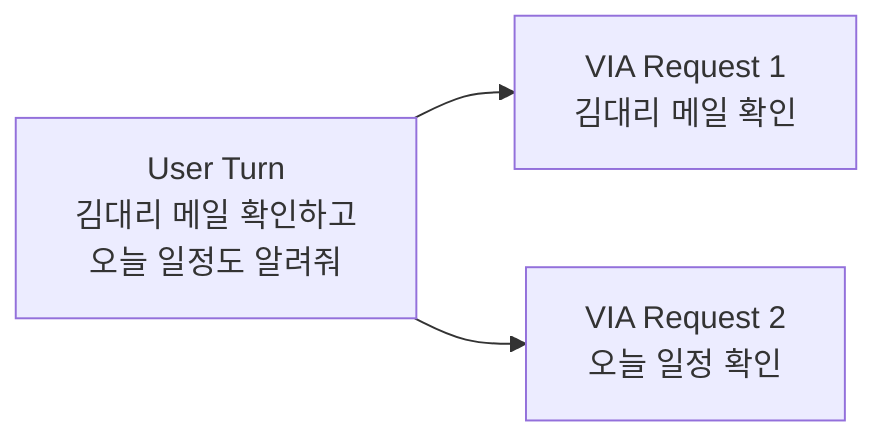
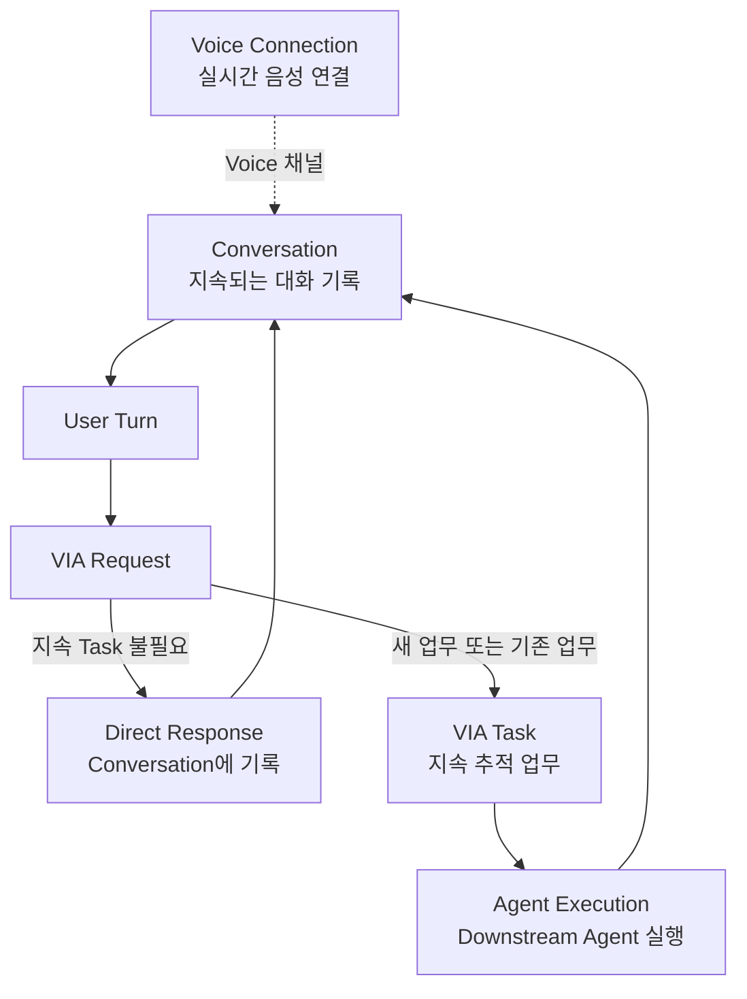
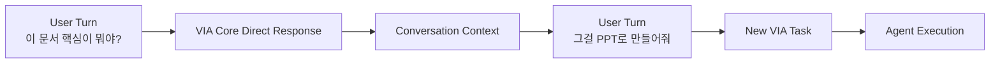
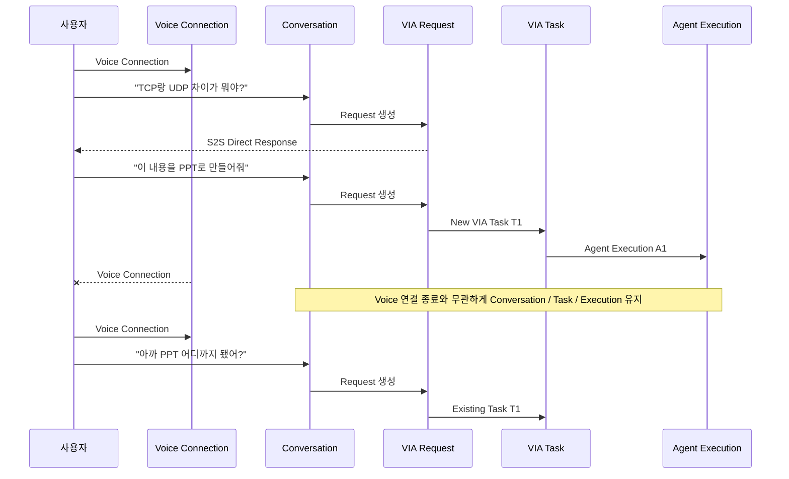
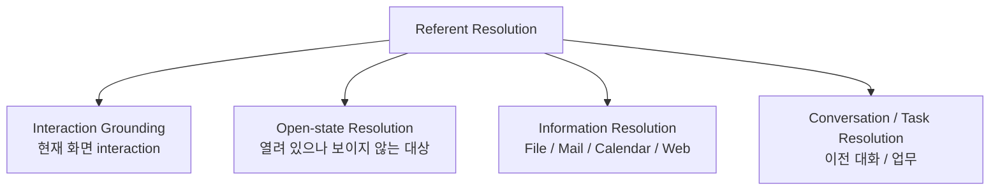

# 2. Terms

본 문서에서 사용하는 핵심 용어를 아래와 같이 정의한다.

이 정의는 이후 Use Case, Requirement, ASR, Test Case 및 Architecture Decision에서 동일하게 사용한다. 같은 개념을 서로 다른 단어로 부르거나, 하나의 단어를 여러 의미로 사용하지 않는다.

특히 본 과제에서는 혼동 가능성이 큰 `Session`이라는 용어를 핵심 lifecycle 단위로 사용하지 않는다.

---

## 2.1 핵심 Interaction 및 Lifecycle 용어

| 용어 | 정의 |
| --- | --- |
| **User Turn** | 사용자가 VIA에 한 번 입력하는 단위. Voice에서는 사용자의 한 번의 발화를 하나의 User Turn으로 보고, Text에서는 한 번의 메시지 전송을 하나의 User Turn으로 본다. |
| **User Request** | User Turn에 포함된 사용자의 질문, 지시 또는 목표. 하나의 User Turn에 서로 다른 요청이 여러 개 포함될 수 있다. |
| **VIA Request** | User Request를 VIA가 실제로 처리할 수 있도록 구분·정리한 하나의 논리적 처리 단위. 하나의 User Turn은 하나 이상의 VIA Request로 나뉠 수 있다. |
| **Conversation** | 사용자와 VIA 사이에 이어지는 논리적인 대화 기록. User Turn, VIA Request, VIA Response 및 대화 해석에 필요한 정보를 포함하며 Voice와 Text를 함께 사용할 수 있다. |
| **Voice Connection** | 사용자와 VIA Voice Runtime 사이에서 실시간 Voice 입력과 출력이 가능한 연결 구간. 연결은 끊어지고 다시 만들어질 수 있으며 Voice Connection의 종료는 Conversation이나 VIA Task의 종료를 의미하지 않는다. |
| **VIA Task** | 하나 이상의 VIA Request에 걸쳐 상태를 지속적으로 추적해야 하는 사용자의 업무 목표. VIA는 Task identity, 상태, 관련 VIA Request, 선택된 Downstream Agent 및 Agent Execution과의 관계를 관리한다. |
| **Agent Execution** | VIA Task의 실제 업무를 수행하기 위해 Downstream Agent에서 시작된 하나의 실행 instance. Agent의 run, thread 또는 이에 준하는 실행 handle을 의미한다. |
| **VIA Response** | VIA가 사용자에게 전달하는 모든 사용자-facing 응답. 질문에 대한 답변뿐 아니라 progress, clarification, approval 요청, completion, failure 등도 포함한다. |

### User Turn과 VIA Request의 관계

하나의 User Turn에는 여러 요청이 포함될 수 있다.

> "김대리 메일 확인하고, 오늘 일정도 알려줘."



여러 VIA Request 사이의 독립·순차·데이터 의존·조건 관계도 함께 보존한다.

---

## 2.2 Conversation, Request, Task, Execution의 관계

이 네 개념은 서로 다른 의미와 lifecycle을 가진다.

- **Conversation**: 지금까지 사용자와 VIA가 무슨 이야기를 했는가
- **VIA Request**: 지금 VIA가 무엇을 처리해야 하는가
- **VIA Task**: 계속 상태를 추적해야 하는 사용자 업무가 무엇인가
- **Agent Execution**: 해당 업무를 Downstream Agent에서 실제로 어떤 실행으로 처리하고 있는가



> **Task가 없다는 것은 History가 없다는 뜻이 아니다.**  
> Direct Response로 끝난 User Turn, VIA Request, Response도 Conversation에 남고 이후 follow-up의 Context로 사용한다.

---

## 2.3 Task Relation

**Task Relation**은 현재 VIA Request가 지속적으로 추적되는 VIA Task와 어떤 관계를 가지는지를 나타낸다.

결과는 다음 세 가지이다.

1. **No Tracked Task**
   - 현재 Request를 별도의 VIA Task로 추적할 필요가 없다.
   - Conversation에는 항상 기록한다.

2. **New Task**
   - 새로운 VIA Task를 생성해야 한다.

3. **Existing Task**
   - 기존 VIA Task의 상태 조회, follow-up, correction, cancel 또는 연속 요청이다.
   - 이 경우 정확한 VIA Task ID를 식별해야 한다.

예:

> "아까 만들던 보고서 계속해줘."

```text
Task Relation = Existing Task T3
```

Task Relation은 **누가 이번 Request를 처리하는가와 별개의 개념**이다.

예를 들어 Existing Task의 진행 상태를 묻는 Request는 기존 VIA Task와 연결되지만, 최신 상태를 VIA가 이미 가지고 있다면 VIA가 바로 응답할 수 있고, 최신 상태 확인이 필요하면 Downstream Agent와 interaction할 수 있다.

---

## 2.4 Request Handling

**Request Handling**은 현재 VIA Request를 실제로 어떤 처리 경로에서 완료하는지를 의미한다.

### 1. S2S Direct Response

Voice Runtime의 S2S Model이 별도의 Context 조회나 Downstream Agent 실행 없이 자체 지식과 제공된 Conversation 정보만으로 바로 응답하는 경로이다.

예:

> "TCP와 UDP 차이가 뭐야?"

S2S Direct Response도 User Turn, VIA Request, Response를 Conversation에 기록한다.

### 2. VIA Core Direct Response

VIA Core가 **범위가 명확한(bounded) Context 조회와 VIA semantic processing**만으로 Downstream Agent 없이 응답하는 경로이다.

예:

- 현재 선택된 PDF 내용을 읽고 핵심을 설명
- 특정 메일 1건을 찾아 내용 확인
- 오늘 환율과 같이 대상이 명확한 공개 정보를 조회하여 답변

### 3. Downstream Agent Handling

다음과 같은 실제 업무 수행이 필요한 경우 Downstream Agent에 요청을 전달하는 경로이다.

- open-ended research
- 여러 Source를 탐색·비교·종합하는 분석
- domain reasoning
- multi-step planning
- domain workflow
- 외부 상태 변경 Action
- 실제 업무 수행을 위한 Tool 실행

예:

> "최근 AI Agent 시장 자료를 여러 곳에서 조사해서 비교 보고서로 만들어줘."

read-only web access만 사용하더라도 open-ended research와 종합이 필요하므로 Downstream Agent Handling에 해당한다.

### Task Relation과 Request Handling은 독립된 두 축이다

| 예 | Task Relation | Request Handling |
| --- | --- | --- |
| "TCP랑 UDP 차이가 뭐야?" | No Tracked Task | S2S Direct Response |
| 현재 PDF에서 "이 문서 핵심 뭐야?" | No Tracked Task | VIA Core Direct Response |
| "이 내용으로 PPT 만들어줘." | New Task | Downstream Agent Handling |
| "아까 PPT 어디까지 됐어?" | Existing Task | VIA 상태 사용 또는 Agent status interaction |
| "PPT에 시장 전망 한 장 더 추가해줘." | Existing Task | Downstream Agent Handling |

---

## 2.5 Bounded Context Processing

**Bounded Context Processing**은 VIA가 직접 수행할 수 있는 read-only 처리의 범위를 명확하게 하기 위한 용어이다.

다음 조건을 만족하는 경우 bounded로 본다.

- 조회할 대상 또는 Source 범위를 요청 시점에 특정할 수 있다.
- open-ended 탐색 전략이나 domain planning이 필요하지 않다.
- 외부 상태를 변경하지 않는다.
- 결과를 얻기 위해 장시간 multi-step research workflow를 수행하지 않는다.

따라서:

> **Bounded Read / Search / Understand → VIA가 직접 수행 가능**  
> **Open-ended Research / Domain Reasoning / Plan / Act → Downstream Agent**

---

## 2.6 Direct Response와 Conversation Continuity

Direct Response는 "대답하고 버리는 요청"이 아니다.

S2S Direct Response와 VIA Core Direct Response 모두 다음 정보를 Conversation에 남긴다.

- User Turn
- Voice transcript 또는 Text input
- VIA Request
- 확정된 Referent
- 사용한 주요 Context
- VIA Response
- turn 순서와 시간

따라서 다음처럼 Direct Response 뒤에 새로운 실제 업무 요청이 이어질 수 있다.



---

## 2.7 Lifecycle 분리 원칙



쉽게 표현하면:

> **Voice Connection = 지금 음성이 연결되어 있는가**  
> **Conversation = 지금까지 무슨 이야기를 했는가**  
> **VIA Request = 지금 무엇을 요청했는가**  
> **VIA Task = 계속 추적해야 하는 업무가 무엇인가**  
> **Agent Execution = 그 업무가 Agent에서 어떤 실행으로 처리되고 있는가**

---

## 2.8 Orchestration 용어

### Request Orchestration

하나의 VIA Request가 입력에서 최종 처리까지 이어지는 **VIA 내부 흐름을 연결하고 관리하는 책임**이다.

다음 활동을 포함한다.

- Voice/Text 입력 연결
- Compound Request 분해 및 관계 보존
- 필요한 Context 확보
- Request Refinement
- Referent Resolution
- Task Relation 결정
- Request Handling 결정
- 사용자 Response 연결

### Agent Orchestration

Downstream Agent와 관련된 사용자 업무를 VIA가 연결하고 관리하는 책임이다.

- Agent Selection
- Delegation
- VIA Task ↔ Agent Execution 연결
- progress / status
- clarification
- consent / approval
- follow-up
- correction
- cancel
- result / failure

### VIA Orchestration

**Request Orchestration + Agent Orchestration** 전체를 의미한다.

> `Orchestration`은 책임을 의미하며 반드시 하나의 `Orchestrator` Component를 의미하지 않는다.

---

## 2.9 Context 범위

**Context**는 VIA가 현재 VIA Request를 이해하고 처리하기 위해 사용하는 사용자 주변의 상태와 정보이다.

본 과제에서 다루는 Context 범위를 다음 여섯 종류로 고정한다.

### 1. Interaction Context

현재 PC에서 사용자가 무엇을 보고, 선택하고, 가리키고, 조작하고 있는지를 나타낸다.

다음 범위를 포함한다.

- display identity 및 multi-monitor 정보
- 현재 display의 화면 정보
- foreground application
- active / focused window
- window 위치 및 크기
- focused UI element
- 열린 application / window / document / browser tab identity
- viewport 및 scroll position
- pointer position
- pointer trajectory
- pointer hover
- pointer button press / release
- drag 동작 및 drag 영역
- keyboard modifier 및 interaction 관련 input event
- selection된 UI object
- selection된 text
- text caret 위치
- accessibility / UI object identity
- UI object bounding region
- interaction event timestamp 및 발생 순서

### 2. Conversation Context

- 이전 User Turn
- Voice transcript / Text input
- 이전 VIA Request
- 이전 VIA Response
- 이전 turn에서 확정된 Referent
- clarification 결과
- consent / approval 결과
- 입력 modality
- turn 시간 및 순서

### 3. Task Context

- VIA Task ID
- 사용자 업무 목표
- Task 상태
- 관련 VIA Request
- 생성/최근 변경 시간
- 선택된 Downstream Agent
- Agent Execution ID
- progress / status
- result / failure
- pending clarification / approval
- follow-up / correction / cancellation 상태

### 4. Personal Information Context

정책상 허용된 read-only 범위에서 다음 Source를 다룬다.

- Local File System: identity, path, metadata, 허용된 content
- Mail: message identity, sender/recipient, subject, timestamp, 허용된 content
- Calendar: event identity, 시간, 참석자, 위치, 허용된 content
- Browser/User Data: browser history, bookmark, 허용된 사용자 연계 web data

### 5. Public Information Context

- Public Web Search 결과
- 공개 Web Page
- 공개 Online Document 및 공개 정보 Source

Public Information Context가 VIA Context Source라는 사실은 **모든 web research를 VIA가 직접 수행한다는 뜻이 아니다.** Bounded Context Processing 범위를 넘는 open-ended research는 Downstream Agent에 위임한다.

### 6. User Memory Context

- 사용자 preference
- 반복 설정
- routine
- stable fact
- 사용자가 유지하도록 허용한 장기 기억

### Policy State는 Context와 구분한다

- 접근 권한
- consent
- Context 외부 전송 허용 범위
- Agent trust
- security / privacy policy

Policy State는 의미 Context가 아니라 **VIA의 허용 동작을 제한하는 제어 정보**이다.

---

## 2.10 Referent와 Referent Resolution

### Referent

**Referent**는 사용자의 표현이 실제로 가리키는 대상이다.

#### On-screen Referent

현재 화면에 보이는 대상:

- UI object
- text / image / chart
- point / region
- 여러 object group
- selection
- pointer trajectory 또는 drag로 표시한 영역

#### Open-but-not-visible Referent

실행/열려 있지만 foreground에는 보이지 않는 대상:

- background window
- 다른 browser tab
- 최소화된 application
- 다른 open document

#### Information Referent

현재 열려 있지 않지만 Context Source에서 찾을 수 있는 대상:

- file / folder
- mail
- calendar event
- public web information
- user data

#### Conversation / Task Referent

이전 대화나 업무에서 등장한 대상:

- "아까 찾은 파일"
- "그 결과"
- "만들던 보고서"

### Referent Resolution

**Referent Resolution**은 사용자 표현이 실제 어떤 Referent를 뜻하는지 결정하는 전체 과정이다.



### Interaction Grounding

**Interaction Grounding**은 현재 사용자의 화면 interaction evidence를 이용하여 Referent를 연결하는 Referent Resolution이다.

Pointing에만 한정하지 않고 다음을 포함한다.

- pointer 위치/trajectory/hover
- click
- drag
- 원형 등 pointer gesture
- text/object selection
- focus
- caret
- 현재 screen / viewport / UI region

---

## 2.11 Voice 및 AI 용어

| 용어 | 정의 |
| --- | --- |
| **Voice Runtime** | 사용자 PC에서 실행되는 VIA 내부 Voice 처리 영역. S2S Model을 기본 Voice Model dependency로 사용하며 Voice Connection과 VIA Core를 연결한다. |
| **S2S Model** | Speech input을 실시간으로 이해하고 Speech output을 생성하는 Speech-to-Speech Generative Model. Voice Runtime의 dependency이며 local 또는 remote에서 실행될 수 있다. |
| **VIA Semantic Inference** | Request Refinement, Referent Resolution, Task Relation, Request Handling, Agent Selection, Response 구성 등에 필요한 의미 기반 판단. |
| **Downstream Agent Model** | Downstream Agent가 내부 reasoning, planning, tool execution 등에 사용하는 Model. VIA Architecture 평가 범위 밖이다. |

---

## 2.12 사용자 응답 및 사용자 interaction 용어

| 용어 | 정의 |
| --- | --- |
| **Voice Response** | Voice interaction이 활성화된 경우 핵심 내용을 짧게 전달하는 음성 응답. |
| **Text Response** | Chat UI에 표시되고 Conversation에 보존되는 상세 응답. |
| **Chat UI** | Text 입력, Conversation history, Response, VIA Task 상태/결과를 보여주는 VIA 사용자 화면. |
| **Notification** | 장시간 Task의 완료·실패·사용자 확인 필요 상태를 알리는 UI/OS 알림. |
| **Clarification** | 요청의 부족하거나 모호한 정보를 사용자에게 다시 확인하는 interaction. |
| **Consent** | 개인 Context 접근 또는 외부 Model/Agent 제공 전에 필요한 사용자 동의 interaction. |
| **Action Approval** | Downstream Agent가 실제 Action을 수행하기 전 사용자 확인이 필요할 때 VIA가 중계하는 interaction. |

---

## 2.13 책임 경계 한눈에 보기

> **Bounded Read / Search / Understand → VIA에서 수행 가능**  
> **Open-ended Research / Domain Reasoning / Plan / Act → Downstream Agent**

모든 사용자-facing interaction은 처리 주체와 관계없이 VIA를 통해 사용자에게 전달한다.

---

## 2.14 핵심 용어 한눈에 보기

| 용어 | 가장 쉽게 말하면 |
| --- | --- |
| **Voice Connection** | 지금 음성이 연결되어 있는가 |
| **Conversation** | 지금까지 무슨 이야기를 했는가 |
| **User Turn** | 사용자가 한 번 말하거나 입력한 것 |
| **VIA Request** | VIA가 지금 처리해야 하는 하나의 요청 |
| **Task Relation** | 이 요청이 지속 Task와 어떤 관계인가 |
| **VIA Task** | 계속 상태를 추적해야 하는 사용자의 업무 |
| **Agent Execution** | 해당 업무가 Agent에서 실제로 돌고 있는 실행 |
| **Request Handling** | 이번 요청을 어디서 어떻게 처리하는가 |
| **Referent** | 사용자 표현이 실제로 가리키는 대상 |
| **Referent Resolution** | 그 대상이 무엇인지 찾는 것 |
| **Interaction Grounding** | 현재 화면 interaction을 이용해 대상 찾기 |
| **Request Orchestration** | VIA 내부 요청 흐름을 연결하는 책임 |
| **Agent Orchestration** | VIA Task와 Agent 실행을 연결하는 책임 |
