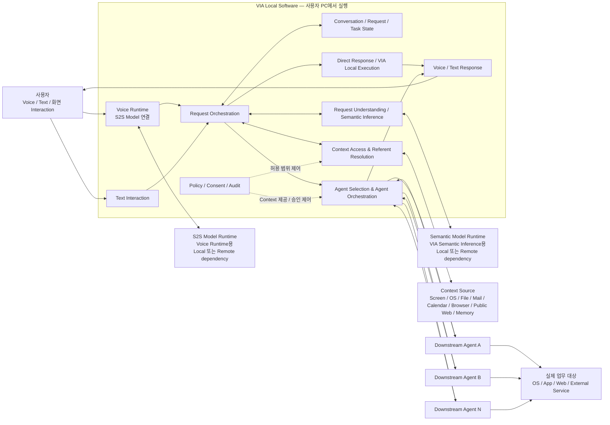
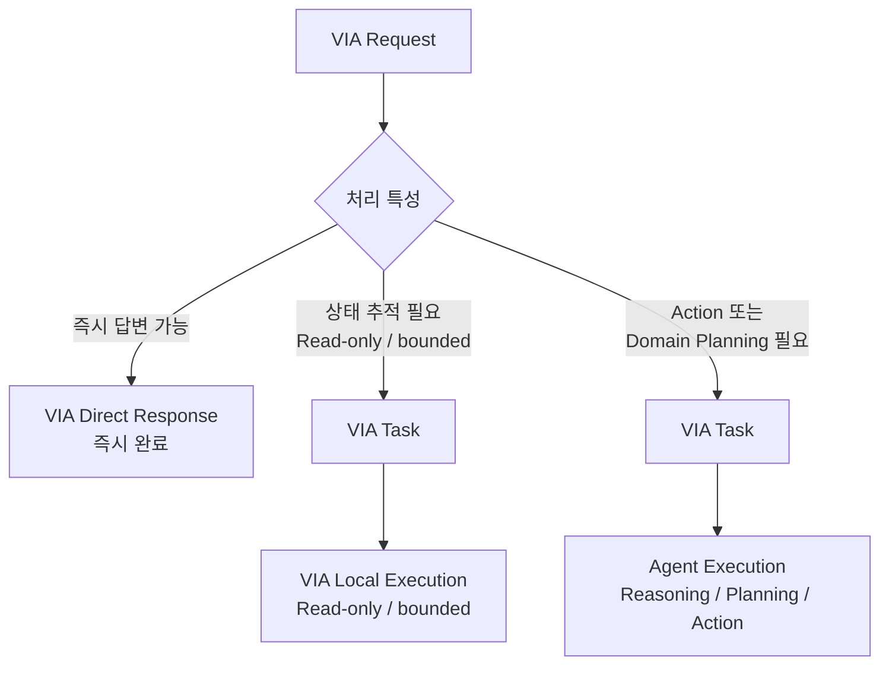

# 3. 고정 Architecture Scope — R1

## 3.1 목적

본 과제에서는 시스템의 최상위 책임 구조를 더 이상 Architecture Decision으로 비교하지 않는다.

기존에 검토하던 R1과 R3 중 **R1을 본 과제의 고정 Architecture Scope로 채택**한다.

R1은 다음과 같이 정의한다.

> **R1 — Agent-neutral Interaction & Orchestration 구조**  
> VIA가 사용자 Interaction, Context 이해, 요청 정리, Conversation/Task 상태, 처리 경로 결정, Downstream Agent 선택 및 사용자-facing orchestration을 책임지고, 실제 업무의 domain reasoning, planning, tool selection, tool execution은 선택된 Downstream Agent에 위임하는 구조.

여기서 `Agent-neutral`은 VIA가 하나의 특정 Primary Agent Runtime을 중심으로 설계되지 않는다는 뜻이다.

Downstream Agent는 여러 종류가 존재할 수 있으며, VIA는 사용자 요청과 현재 상태에 따라 적절한 Agent를 선택하여 위임한다.

---

## 3.2 R1을 과제 범위로 고정하는 이유

본 과제의 핵심 관심사는 다음과 같다.

- Voice/Text 기반의 사용자 interaction
- 화면 및 사용자 Context 이해
- 자연스럽고 불완전한 요청의 정리
- Direct Response와 Agent 위임의 연결
- 새로운 작업과 기존 작업의 연속성
- 여러 종류의 Downstream Agent와의 연결
- Agent 진행 상태와 결과를 사용자에게 일관되게 전달
- Model 및 Agent 생태계 변화에 대한 대응

이 문제를 다루기 위해서는 먼저 **VIA가 사용자와 Agent 사이의 독립적인 Interaction/Orchestration 시스템이라는 책임 경계**를 고정할 필요가 있다.

따라서 다음 질문은 더 이상 본 과제의 Architecture Decision으로 다루지 않는다.

> "VIA가 Interaction/Orchestration 시스템인가, 아니면 하나의 General-purpose Agent Runtime이 VIA의 핵심 실행 주체가 되는가?"

본 과제에서는 전자를 시스템 정의로 고정한다.

---

## 3.3 R1 Top-level Architecture

이 그림에서 **VIA Local Software 박스는 사용자 PC에서 실행되는 VIA 자체의 runtime boundary**를 의미한다. Voice Runtime은 이 박스 안에 있지만, Voice Runtime이 사용하는 **S2S Model Runtime**과 VIA semantic 판단에 사용하는 **Semantic Model Runtime**은 서로 다른 dependency로 구분하며 각각 local 또는 remote에 배치될 수 있다. 따라서 두 Model Runtime은 박스 밖에 표현한다. 다만 **Model invocation interface, streaming/event contract, deployment binding, provider 교체 구조는 VIA Architecture 설계 범위에 포함**하며 Model 내부 구현과 학습은 포함하지 않는다.

이 그림의 각 내부 박스는 최종 Component 구성을 의미하지 않는다.

현재 단계에서 고정하는 것은 **책임 영역과 책임 방향**이며, 각 책임을 하나의 Component로 둘지 여러 Component로 나눌지는 이후 Architecture Decision에서 결정한다.

---

## 3.4 VIA에 고정되는 책임

R1에서 다음 책임은 VIA에 고정한다.

### 사용자 Interaction

- Voice 입력
- Text 입력
- Voice Response
- Text Response
- Voice interruption
- Chat UI 및 notification을 통한 사용자-facing interaction

### Conversation 및 요청 상태

- Conversation 유지
- User Turn 관리
- VIA Request 생성 및 관계 관리
- VIA Task 생성 및 상태 관리
- Voice Connection과 Conversation/Task lifecycle 분리

### Context

- Interaction Context 수집
- Conversation Context 사용
- Task Context 사용
- Personal Information Context read-only 조회
- Public Information Context read-only 조회
- User Memory Context 사용
- Referent Resolution 및 Interaction Grounding에 필요한 Context 제공

### 요청 이해

- Request Refinement
- Referent Resolution
- Task Association
- Direct Response 여부 판단
- VIA Local Execution 또는 Agent 위임 경로 판단

이러한 판단에 Generative Model을 사용할지 deterministic logic을 사용할지는 R1 자체에서 고정하지 않는다. 다만 해당 판단의 **최종 책임은 VIA에 있다.**

### Direct Response

다음은 VIA가 직접 처리할 수 있다.

- Model-only Direct Response
- Context-assisted Direct Response
- bounded하고 read-only인 VIA Local Execution

Direct Response 또는 VIA Local Execution은 Downstream Agent 없이 처리할 수 있지만, 결과와 상태는 VIA Conversation 안에서 관리한다.

### Agent Selection 및 Agent Orchestration

VIA는 다음을 책임진다.

- 요청에 적절한 Downstream Agent 선택
- Agent에 전달할 요청과 Context 구성
- Agent Execution과 VIA Task 연결
- progress
- clarification
- consent / approval interaction
- follow-up
- correction
- cancel
- result / failure 전달

### Policy 및 Context 제공 통제

VIA는 다음을 통제한다.

- 어떤 Context를 읽을 수 있는지
- 어떤 Context를 외부 Model에 제공할 수 있는지
- 어떤 Context를 Downstream Agent에 제공할 수 있는지
- 사용자 consent가 필요한지
- 사용자-facing audit 및 provenance에 필요한 정보

실제 Action authorization의 최종 enforcement가 Downstream Agent 내부 security boundary에 존재할 수 있어도, 사용자와의 consent/approval interaction은 VIA가 담당한다.

---

## 3.5 Downstream Agent에 고정되는 책임

R1에서 다음 책임은 Downstream Agent에 고정한다.

- 실제 업무 수행을 위한 domain reasoning
- 업무 수행 순서와 방법의 planning
- 사용할 Tool 선택
- Tool invocation
- OS / Application / Web / External Service에서 실제 업무 수행
- 외부 상태를 변경하는 Action
- Agent 내부 workflow
- Agent 내부 sub-task
- Agent 내부 retry / planning loop
- Agent 내부 Model 사용 방식

예:

- 파일 이동/삭제
- 이메일 발송
- 일정 생성/변경
- Application UI 조작
- Web transaction
- 문서/파일 생성 및 저장
- 기타 실제 업무 상태를 변경하는 작업

VIA는 이러한 Agent 내부 동작을 다시 계획하거나 개별 Tool Call을 중앙에서 통제하지 않는다.

---

## 3.6 R1의 요청 처리 경로

R1에서는 모든 VIA Request가 다음 세 처리 유형 중 하나로 이어진다.

### Path 1. VIA Direct Response

즉시 완료 가능한 요청이다.

- Model-only Direct Response
- Context-assisted Direct Response

별도의 VIA Task를 만들 필요가 없다.

### Path 2. VIA Local Execution

Downstream Agent는 필요하지 않지만 즉시 끝나지 않아 상태 추적이 필요한 경우이다.

VIA Task를 생성하며, 다음 조건을 모두 만족해야 한다.

- 외부 상태를 변경하지 않는다.
- open-ended domain planning을 수행하지 않는다.
- Downstream Agent의 Tool Runtime을 대신하지 않는다.
- VIA가 소유한 read-only Context Access와 semantic inference 범위에서 처리한다.

즉, VIA Local Execution은 **상태를 추적해야 하는 read-only / interaction-supporting 처리**를 위한 경로이다.

### Path 3. Agent-delegated Execution

다음 중 하나라도 필요한 경우 Downstream Agent에 위임한다.

- 외부 상태 변경
- 실제 업무 수행을 위한 Tool 실행
- open-ended domain reasoning
- multi-step planning
- domain workflow 수행

이 경우 VIA Task와 Agent Execution을 연결하여 상태를 관리한다.

---

## 3.7 Agent-neutral 원칙

R1에서 `Agent-neutral`은 다음을 의미한다.

1. **특정 Downstream Agent가 VIA 전체의 Primary Runtime 역할을 하지 않는다.**
2. **VIA의 Conversation, VIA Request, VIA Task identity는 특정 Agent의 session/thread ID에 종속되지 않는다.**
3. **VIA가 Downstream Agent를 선택한다.**
4. **Agent가 바뀌어도 VIA의 사용자-facing Conversation과 Task identity는 유지된다.**
5. **Agent-specific protocol이나 SDK 차이는 VIA와 Agent 사이의 integration boundary에서 흡수한다.**
6. **Downstream Agent의 결과, progress, clarification 요청은 VIA를 통해 사용자에게 전달한다.**
7. **사용자가 특정 Agent 내부 구조를 이해하거나 직접 선택해야만 시스템을 사용할 수 있는 구조를 기본으로 하지 않는다.**

Agent가 자체 thread/session/run을 유지할 수는 있지만, 이는 VIA의 Agent Execution과 연결되는 Agent 내부 식별자이다.

---

## 3.8 R1에서 제외되는 구조

본 rebaseline에서는 다음 구조를 비교 대상으로 두지 않는다.

### Primary General-purpose Agent Runtime 구조

하나의 General-purpose Agent가 다음을 모두 소유하는 구조는 본 과제 범위에서 제외한다.

- 사용자 요청의 최상위 semantic interpretation
- 전체 routing
- VIA Task identity
- primary planning
- 모든 downstream delegation

즉 기존 R3 계열 구조는 더 이상 Architecture Candidate가 아니다.

### VIA의 State-changing Local Action Fast Path

VIA가 직접 다음을 수행하는 구조도 본 과제 범위에서 제외한다.

- 파일 이동/삭제
- 이메일 발송
- 일정 수정
- Application 조작
- Web transaction

단순하고 빠른 작업이라도 **외부 상태를 변경하는 Action이면 Downstream Agent에 위임**한다.

이를 통해 VIA와 Downstream Agent의 책임 경계를 일관되게 유지한다.

---

## 3.9 R1 안에서 Architecture가 결정해야 하는 범위

R1은 최상위 책임 경계만 고정한다.

아래 항목은 시스템 범위의 미결정 사항이 아니라, **R1 내부에서 반드시 Architecture 설계를 통해 결정해야 하는 구조적 문제**이다.

- Voice Runtime을 S2S 중심으로 어떻게 구성할 것인가
- 추가 ASR/VAD/TTS/helper model을 둘 것인가
- VIA semantic inference를 어디에서 수행할 것인가
- Context를 언제 수집하고 어디에서 보관할 것인가
- Referent Resolution을 어떤 책임 구조로 나눌 것인가
- Request Refinement를 어떤 단계와 책임으로 구성할 것인가
- Task Association의 책임과 authoritative state를 어디에 둘 것인가
- Direct Response / VIA Local Execution / Agent Delegation 경로를 어디에서 결정할 것인가
- 여러 Model provider와 local/cloud deployment를 어떤 abstraction으로 흡수할 것인가
- 서로 다른 Downstream Agent protocol을 어떤 integration boundary로 흡수할 것인가
- VIA Task와 Agent Execution 상태를 어디에서 소유하고 복구할 것인가
- progress / cancel / follow-up / failure 처리를 어떤 구조로 관리할 것인가
- Context 및 Model/Agent 접근에 대한 Policy/Consent 책임을 어떤 구조로 배치할 것인가

이 항목들은 이후 Use Case와 ASR이 정의된 뒤 Architecture Decision Point로 정리하고 최종 선택한다.

---

## 3.10 R1 한 문장 요약

> **VIA는 사용자와 여러 Agent 사이의 일관된 Interaction/Orchestration 계층으로 동작한다. 사용자 요청을 읽고 이해하고 연결하며 처리 경로를 관리하는 일은 VIA가 담당하고, 실제 업무를 계획하고 실행하여 외부 상태를 바꾸는 일은 Downstream Agent가 담당한다.**
