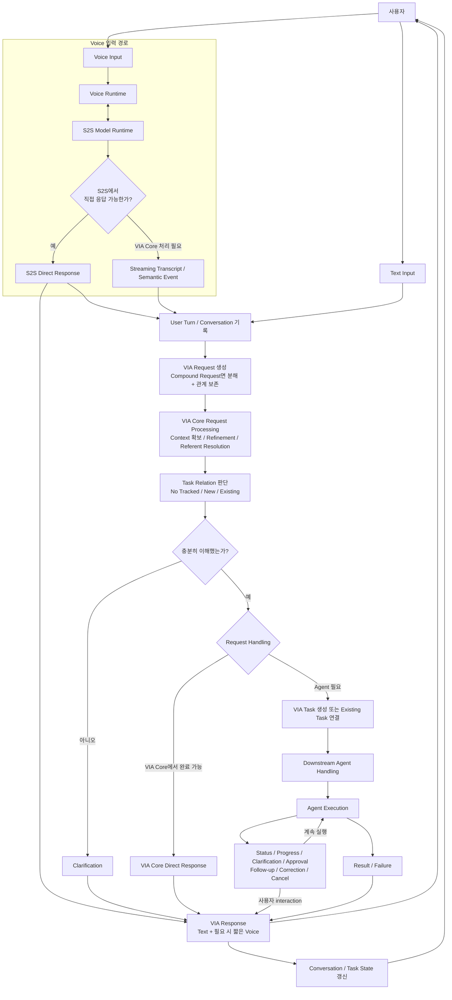
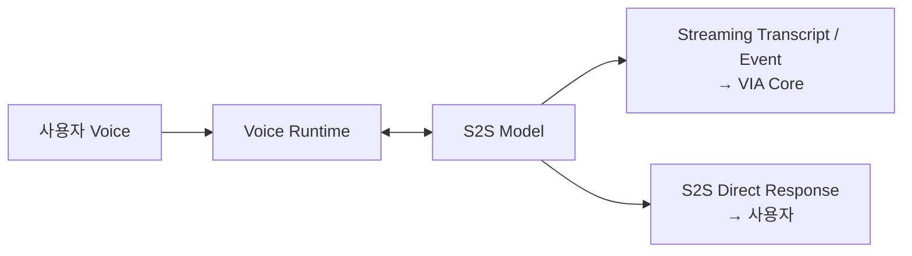
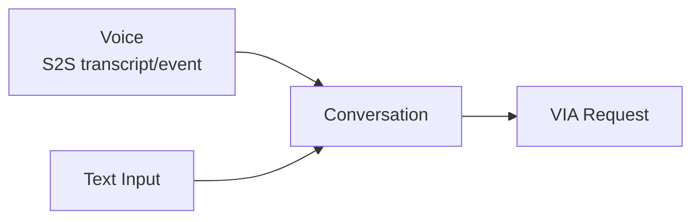
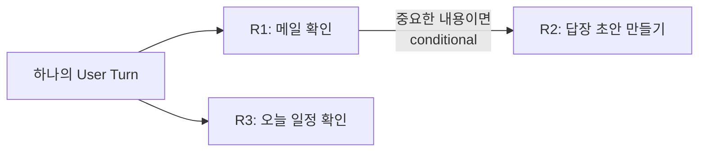
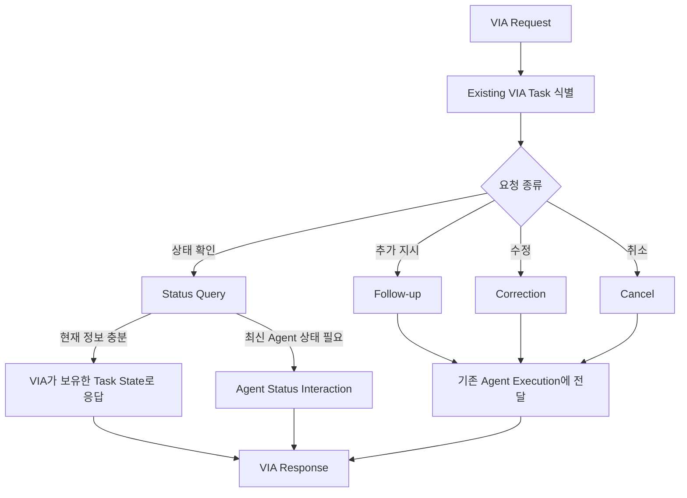

# 4. Canonical Interaction Flow

## 4.1 목적

Canonical Interaction Flow는 VIA가 어떤 세부 Architecture로 구현되더라도 **사용자 요청을 처리하기 위해 반드시 성립해야 하는 논리적 흐름**을 정의한다.

이 문서는 실제 pipeline의 고정 실행 순서를 의미하지 않는다.

다음 활동은 Architecture에 따라 순차, 병렬, 반복 또는 일부 fast path로 처리될 수 있다.

- S2S streaming 처리
- Context 확보
- Compound Request decomposition
- Request Refinement
- Referent Resolution
- Task Relation 판단
- Semantic Inference
- Request Handling 결정

따라서 본 문서는 **필수 책임과 정보 흐름**을 고정하고, 책임의 Component 배치와 실제 실행 순서는 이후 Architecture Decision에서 결정한다.

---

## 4.2 전체 Canonical Interaction Flow



### 이 그림에서 중요한 두 축

**Task Relation**과 **Request Handling**은 서로 독립된 판단이다.

Task Relation:
- No Tracked Task
- New Task
- Existing Task

Request Handling:
- S2S Direct Response
- VIA Core Direct Response
- Downstream Agent Handling

예를 들어 Existing Task에 대한 상태 질문이라도 Agent에 새 일을 위임하지 않고 VIA가 이미 보유한 상태로 응답할 수 있다. 반대로 최신 상태 확인이 필요하면 Agent와 status interaction을 수행할 수 있다.

---

## 4.3 Voice Runtime 및 S2S Flow

Voice 입력은 단순히 ASR 결과를 만드는 경로가 아니다.

Voice Runtime의 S2S Model은 동시에 다음 두 역할을 할 수 있다.

1. **VIA Core가 사용할 수 있는 streaming transcript 또는 semantic event 제공**
2. **자체 지식과 제공된 Conversation만으로 충분한 경우 S2S Direct Response 생성**



S2S Direct Response가 발생해도 VIA는 해당 interaction을 시스템 밖의 독립 대화로 취급하지 않는다.

최소한 다음 정보는 Conversation에 연결해야 한다.

- User Turn
- transcript 또는 의미상 동등한 입력 기록
- VIA Request
- S2S Response
- 시간 및 순서

따라서 S2S Direct Response 뒤에도 사용자는 자연스럽게 관련 후속 질문을 할 수 있다.

---

## 4.4 Text Flow

Text 입력은 Chat UI에서 하나의 User Turn으로 들어오며 Voice와 동일한 Conversation과 VIA Request 처리 체계에 연결한다.



Voice와 Text는 입력 방식은 다르지만 이후의 Conversation, Context, Task Relation 및 Agent interaction을 공유한다.

---

## 4.5 Compound Request Decomposition

Compound Request는 본 과제의 핵심 Use Case이며 VIA가 처리해야 한다.

예:

> "메일 확인하고, 중요한 내용이면 답장 초안을 만들고, 오늘 일정도 확인해줘."

하나의 User Turn을 단순히 여러 VIA Request로 나누는 것만으로는 충분하지 않다.

VIA는 Request 사이 관계도 함께 보존해야 한다.



지원해야 하는 관계는 다음과 같다.

- **Independent**: 서로 독립적으로 처리 가능
- **Sequential**: 순서대로 처리
- **Data-dependent**: 앞 Request 결과를 뒤 Request가 사용
- **Conditional**: 앞 결과 또는 조건에 따라 뒤 Request 수행

Compound Request decomposition은 Request Refinement의 주요 책임 중 하나이다.

---

## 4.6 Context, Request Refinement, Referent Resolution

각 VIA Request에 대해 VIA는 처리에 필요한 의미와 Context를 확보해야 한다.

사용할 수 있는 Context:

- Interaction Context
- Conversation Context
- Task Context
- Personal Information Context
- Public Information Context
- User Memory Context

논리적으로 다음 활동을 포함한다.

### Request Refinement

불완전하고 자연스러운 표현을 처리 가능한 Request 의미로 정리한다.

### Referent Resolution

"이거", "그 파일", "아까 그거" 등 사용자가 지칭한 실제 대상을 결정한다.

### Interaction Grounding

Referent Resolution 중 현재 화면 interaction evidence를 이용하는 경우이다.

- pointing
- pointer trajectory
- hover / click
- drag
- selection
- focus / caret
- screen / viewport / UI object

Context 접근은 Policy State와 Consent 조건을 따라야 한다.

---

## 4.7 Task Relation

각 VIA Request는 지속적으로 추적되는 VIA Task와의 관계를 가진다.

### No Tracked Task

별도의 지속 Task identity 없이 현재 Request를 처리할 수 있다.

중요:

> **No Tracked Task여도 Conversation history는 유지된다.**

예:

> "TCP와 UDP 차이가 뭐야?"

### New Task

새로운 지속 업무를 시작해야 한다.

예:

> "이 자료로 PPT 만들어줘."

### Existing Task

기존 VIA Task의 상태 조회, follow-up, correction, cancel 또는 연속 업무이다.

예:

> "아까 PPT 어디까지 됐어?"

> "거기에 시장 전망 한 장 더 추가해줘."

Existing Task의 경우 정확한 VIA Task ID를 식별해야 한다.

---

## 4.8 Request Handling

Task Relation을 판단한 뒤에도 **이번 Request를 실제로 어디에서 처리할 것인지**는 별도로 결정한다.

### A. S2S Direct Response

Voice 입력에서 S2S Model이 자체 지식과 Conversation만으로 바로 답할 수 있는 경우이다.

예:

> "TCP랑 UDP 차이가 뭐야?"

### B. VIA Core Direct Response

VIA Core가 bounded Context Processing과 VIA semantic processing으로 답할 수 있는 경우이다.

예:

> 현재 PDF를 보며 "이 문서 핵심이 뭐야?"

> "오늘 원달러 환율 얼마야?"

단, Public Web Search를 사용한다는 이유만으로 무조건 VIA Core Direct Response가 되는 것은 아니다.

### C. Downstream Agent Handling

다음과 같은 요청은 Downstream Agent에 위임한다.

- open-ended research
- 여러 Source 탐색·비교·종합
- domain reasoning
- multi-step planning
- domain workflow
- 외부 상태 변경 Action
- 실제 업무 수행을 위한 Tool 실행

예:

> "최근 AI Agent 시장 자료를 여러 사이트에서 조사해서 비교 보고서로 만들어줘."

이는 read-only Source를 사용하더라도 open-ended research이므로 Downstream Agent Handling이다.

---

## 4.9 Task Relation과 Request Handling 조합

두 축은 1:1로 고정되지 않는다.

| 사용자 요청 | Task Relation | 대표 Handling |
| --- | --- | --- |
| "TCP랑 UDP 차이가 뭐야?" | No Tracked Task | S2S Direct Response |
| 현재 PDF: "이 문서 핵심 뭐야?" | No Tracked Task | VIA Core Direct Response |
| "이 내용으로 PPT 만들어줘." | New Task | Downstream Agent Handling |
| "아까 PPT 어디까지 됐어?" | Existing Task | VIA 상태 조회 또는 Agent status interaction |
| "PPT에 한 장 더 추가해줘." | Existing Task | Downstream Agent Handling |

따라서 **Task Relation을 처리 위치로 해석해서는 안 된다.**

---

## 4.10 Existing Task Control Flow

기존 VIA Task에 대한 Request는 유형에 따라 처리한다.



VIA Task identity와 Agent Execution identity는 분리한다.

Agent가 교체되거나 재실행되어도 사용자가 보는 VIA Task는 동일하게 유지될 수 있다.

---

## 4.11 Clarification

현재 정보만으로 Request를 충분히 이해할 수 없으면 VIA는 Clarification을 요청한다.

Clarification Response는 새로운 User Turn이지만 다음 정보는 유지한다.

- 원래 VIA Request
- 이미 확정된 Referent
- 확보한 Context
- Conversation
- 관련 VIA Task 후보
- 부족했던 정보

따라서 사용자가 전체 요청을 처음부터 반복할 필요가 없어야 한다.

---

## 4.12 Downstream Agent Interaction

Downstream Agent Handling이 시작된 뒤에도 **모든 user-facing interaction의 창구는 VIA**이다.

Agent가 다음을 요청하거나 전달할 수 있다.

- progress / status
- clarification
- action approval
- consent가 필요한 추가 Context 요청
- completion
- failure

사용자는 VIA를 통해:

- follow-up
- correction
- cancel
- approval
- clarification response

를 전달한다.

Downstream Agent가 사용자와 별도의 독립 UI flow를 만드는 것을 기본 동작으로 하지 않는다.

---

## 4.13 Response Flow

모든 user-facing 결과는 VIA Response로 전달한다.

### Text Response

- 모든 user-visible Response를 Chat UI에 기록한다.
- 상세 결과, 근거, 상태 및 추가 정보를 포함할 수 있다.

### Voice Response

Voice interaction이 활성화된 경우:

- 즉시 알아야 하는 핵심 내용을 짧게 말한다.
- Text Response 전체를 그대로 읽는 것을 기본으로 하지 않는다.

### Notification

장시간 VIA Task의 완료, 실패 또는 사용자 확인이 필요한 경우 UI/OS Notification을 사용할 수 있다.

---

## 4.14 Conversation 및 State 갱신

### 모든 Request 공통

다음을 Conversation에 기록한다.

- User Turn
- VIA Request
- Request 간 관계
- 주요 Context / Referent
- Request Handling
- VIA Response

### VIA Task가 있는 경우

추가로 다음을 관리한다.

- VIA Task ID
- Task 상태
- 관련 VIA Request
- 선택된 Downstream Agent
- Agent Execution 관계
- progress / result / failure
- follow-up / correction / cancel 상태

즉 Direct Response가 반복되다가 이후 Agent 작업으로 이어져도 이전 대화는 유지된다.

```text
S2S Direct Response
    ↓
VIA Core Direct Response
    ↓
New VIA Task
    ↓
Agent Execution
    ↓
Existing Task Follow-up
```

---

## 4.15 비동기 Control Flow

### Voice Interrupt

VIA가 말하는 도중 사용자가 다시 말하면 현재 Voice Response를 중단하고 새로운 User Turn을 처리한다.

### Cancel

진행 중 VIA Task 취소 시:

1. 정확한 VIA Task 식별
2. Task 상태 갱신
3. 관련 Agent Execution이 있으면 cancel 전달
4. 최종 상태를 VIA Response로 사용자에게 전달

### Correction

직전 Request를 수정하는 User Turn은 기존 Conversation / VIA Request / VIA Task 관계를 유지하여 처리한다.

---

## 4.16 Canonical Flow에서 고정하는 것과 고정하지 않는 것

### 고정하는 것

- Voice Runtime과 S2S Model은 Voice 입력의 핵심 경로이다.
- S2S는 transcript/event 제공과 S2S Direct Response를 모두 수행할 수 있다.
- Voice와 Text는 동일한 Conversation에 연결된다.
- 모든 의미 있는 요청은 VIA Request로 관리한다.
- Compound Request는 decomposition하고 Request 관계를 보존한다.
- 모든 Direct Response도 Conversation history에 남는다.
- Task Relation은 No Tracked / New / Existing으로 구분한다.
- Task Relation과 Request Handling은 독립된 두 축이다.
- Request Handling은 S2S Direct / VIA Core Direct / Downstream Agent Handling으로 구분한다.
- Open-ended research / domain planning / state-changing work는 Downstream Agent에 위임한다.
- VIA Task와 Agent Execution identity는 분리한다.
- 모든 user-facing interaction은 VIA를 통해 전달한다.
- Text Response는 항상 기록하고 Voice Response는 핵심 내용을 제공한다.

### Architecture Decision에서 결정하는 것

- S2S Direct Response와 VIA Core 처리 사이의 정확한 boundary
- streaming transcript / semantic event contract
- Request Refinement, Referent Resolution, Task Relation의 실제 실행 순서
- semantic inference Model의 종류와 호출 위치
- Context capture / materialization / storage 구조
- speculative processing 여부
- **별도의 stateful VIA-local execution path를 둘 것인지**
- local/remote Model deployment 구조
- Agent protocol 및 adapter 구조
- Task/Execution state의 저장 및 recovery 구조

Canonical Interaction Flow는 **사용자가 경험해야 하는 논리적 흐름을 고정하고, 그 흐름을 어떤 SW 구조로 구현할지는 Architecture Decision에서 결정한다.**
