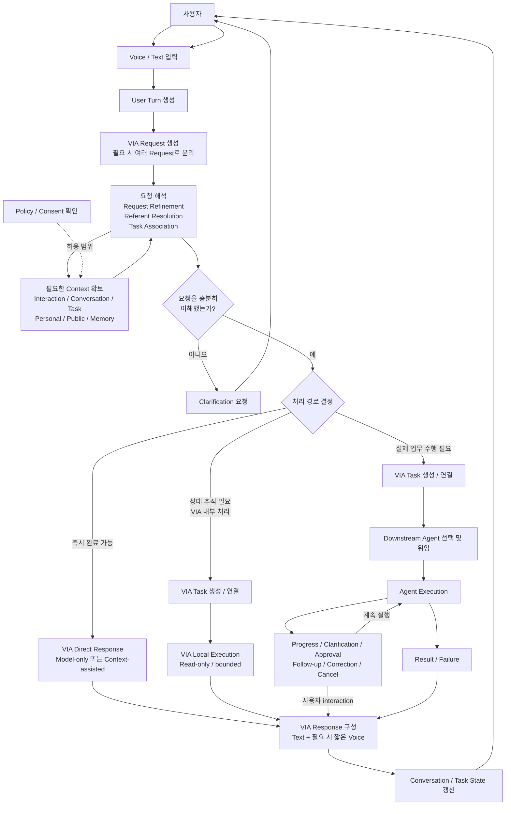
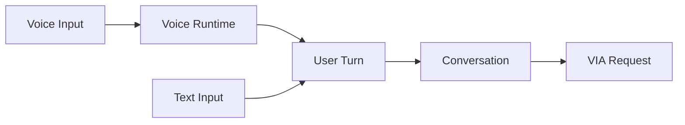
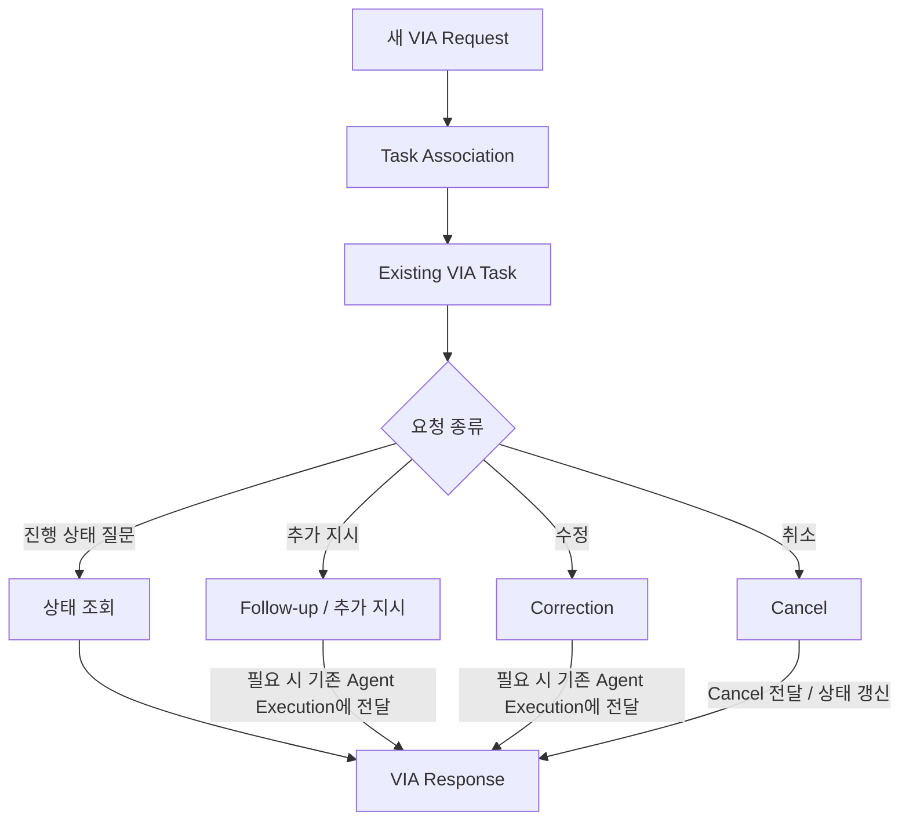

# 4. Canonical Interaction Flow

## 4.1 목적

Canonical Interaction Flow는 VIA가 어떤 Architecture로 구현되더라도 **모든 사용자 요청이 논리적으로 거쳐야 하는 공통 처리 흐름**을 정의한다.

이 문서는 구현 pipeline의 정확한 순서를 고정하지 않는다.

예를 들어 다음 활동은 Architecture에 따라 순차, 병렬, 반복 또는 일부 생략될 수 있다.

- Context 확보
- Request Refinement
- Referent Resolution
- Task Association
- Semantic Inference

따라서 아래 흐름은 **논리적 책임 관계와 필수 결과**를 나타내며, 최종 Component 구성이나 호출 순서를 의미하지 않는다.

---

## 4.2 전체 Canonical Interaction Flow



---

## 4.3 입력 처리와 User Turn

VIA는 Voice와 Text를 모두 사용자 입력으로 받는다.

### Voice 입력

- Voice Connection을 통해 실시간 입력을 받는다.
- Voice Runtime과 S2S Model을 사용한다.
- 하나의 사용자 발화를 User Turn으로 관리한다.
- 사용자가 VIA의 Voice Response 도중 다시 말하면 현재 음성 출력을 중단하고 새로운 User Turn을 처리할 수 있어야 한다.

### Text 입력

- Chat UI에서 전송된 하나의 메시지를 User Turn으로 관리한다.

Voice와 Text는 입력 방식은 다르지만 이후에는 동일한 Conversation 안에서 처리한다.



---

## 4.4 User Turn에서 VIA Request 생성

하나의 User Turn은 하나 이상의 VIA Request로 변환될 수 있다.

예:

> "김대리 메일 확인하고 오늘 일정도 알려줘."

```text
User Turn
 ├─ VIA Request 1: 김대리 메일 확인
 └─ VIA Request 2: 오늘 일정 확인
```

여러 VIA Request 사이에는 다음 관계가 있을 수 있다.

- 서로 독립적
- 순차적으로 수행
- 앞 Request의 결과가 뒤 Request의 입력이 됨
- 특정 조건에 따라 뒤 Request를 수행

이 관계는 User Turn을 VIA Request로 변환할 때 보존해야 한다.

---

## 4.5 요청 해석

각 VIA Request에 대해 VIA는 요청을 처리하는 데 필요한 의미를 확보한다.

논리적으로 다음 활동을 포함한다.

### Request Refinement

자연스럽고 불완전한 표현을 처리 가능한 요청으로 정리한다.

### Referent Resolution

"이거", "그 파일", "아까 그거"와 같은 표현이 실제 어떤 대상을 뜻하는지 결정한다.

### Task Association

현재 VIA Request가 다음 중 어디에 해당하는지 결정한다.

- No Task
- New Task
- Existing Task

Existing Task인 경우 정확한 VIA Task를 식별한다.

### Context 확보

요청 이해에 필요한 범위에서 다음 Context를 사용할 수 있다.

- Interaction Context
- Conversation Context
- Task Context
- Personal Information Context
- Public Information Context
- User Memory Context

Context 접근은 Policy State와 사용자 Consent 조건을 따라야 한다.

---

## 4.6 Clarification

현재 정보만으로 요청을 안전하고 정확하게 처리할 수 없는 경우 VIA는 사용자에게 Clarification을 요청한다.

Clarification 후의 사용자 응답은 새로운 User Turn으로 처리하지만, 이미 확보된 다음 정보는 유지한다.

- 원래 User Request
- 이미 확정된 Referent
- 확보한 Context
- 관련 Conversation
- 관련 VIA Task
- Clarification이 필요했던 항목

따라서 사용자가 전체 요청을 처음부터 다시 설명할 필요가 없어야 한다.

---

## 4.7 처리 경로 결정

요청 해석이 완료되면 VIA는 각 VIA Request의 처리 경로를 결정한다.

### Path A — VIA Direct Response

즉시 완료할 수 있고 별도의 Task 상태 추적이 필요하지 않은 경우이다.

두 종류가 있다.

- Model-only Direct Response
- Context-assisted Direct Response

결과는 Conversation에 기록한다.

### Path B — VIA Local Execution

Downstream Agent는 필요하지 않지만 상태 추적이 필요한 bounded/read-only 처리이다.

- VIA Task를 생성하거나 기존 VIA Task에 연결한다.
- 외부 상태 변경 Action은 수행하지 않는다.
- open-ended domain planning은 수행하지 않는다.

### Path C — Agent-delegated Execution

실제 업무 수행이 필요한 경우이다.

- VIA Task를 생성하거나 기존 VIA Task에 연결한다.
- 적절한 Downstream Agent를 선택한다.
- 필요한 Request와 Context를 전달한다.
- Agent Execution을 VIA Task와 연결한다.

다음 중 하나라도 필요하면 이 경로를 사용한다.

- 외부 상태 변경
- 실제 업무 수행을 위한 Tool 실행
- open-ended domain reasoning
- multi-step planning
- domain workflow

---

## 4.8 Existing Task Follow-up Flow

기존 업무에 대한 후속 요청은 새로운 Agent Execution을 무조건 생성하지 않는다.

먼저 기존 VIA Task와 현재 Agent Execution 상태를 확인한 뒤 요청 종류에 맞게 처리한다.



VIA Task identity는 Agent Execution identity와 독립적으로 유지한다.

따라서 기존 Agent Execution이 종료되거나 다른 Agent로 재위임되더라도 사용자 관점의 VIA Task는 동일하게 유지될 수 있다.

---

## 4.9 Agent Execution 중 사용자 Interaction

Agent Execution이 시작된 뒤에도 VIA는 사용자와 Agent 사이의 interaction을 계속 관리한다.

다음 event를 처리한다.

- progress
- clarification
- action approval
- consent
- follow-up
- correction
- cancel
- completion
- failure

Downstream Agent가 사용자 입력을 필요로 하는 경우 Agent가 사용자와 직접 별도 대화를 시작하는 것이 아니라, VIA를 통해 요청하고 VIA가 사용자 응답을 해당 Agent Execution에 다시 연결한다.

---

## 4.10 Response Flow

모든 사용자-facing 결과는 VIA Response로 전달한다.

### Text Response

- 모든 사용자-visible 응답을 Chat UI에 기록한다.
- 상세 결과, 근거, 상태 및 추가 정보를 포함할 수 있다.

### Voice Response

Voice interaction이 활성화되어 있는 경우:

- 사용자가 즉시 알아야 하는 핵심 내용을 짧게 전달한다.
- Text Response 전체를 그대로 읽는 것을 기본으로 하지 않는다.

### Notification

장시간 Task가 완료되거나 사용자의 확인이 필요한 경우, 사용자가 현재 VIA를 보고 있지 않다면 UI 또는 OS Notification을 사용할 수 있다.

---

## 4.11 Conversation 및 State 갱신 원칙

처리 경로와 관계없이 모든 interaction은 Conversation continuity를 유지해야 한다.

### Direct Response

다음을 Conversation에 남긴다.

- User Turn
- VIA Request
- 사용한 주요 Context / Referent
- VIA Response

### VIA Task

추가로 다음을 관리한다.

- VIA Task identity
- Task 상태
- 관련 VIA Request
- 처리 경로
- Local 또는 Agent Execution 상태
- progress / result / failure

따라서 다음과 같은 경로 변경도 하나의 사용자 interaction 흐름으로 이어질 수 있어야 한다.

```text
Direct Response
    ↓
Direct Response
    ↓
New VIA Task
    ↓
Agent Execution
    ↓
후속 User Turn
    ↓
Existing VIA Task
    ↓
다시 Direct Response
```

---

## 4.12 비동기 Control Flow

사용자의 다음 interaction은 정상 request flow와 별개로 언제든 발생할 수 있다.

### Voice Interrupt

VIA가 말하는 도중 사용자가 다시 말하면 Voice Response를 즉시 중단하고 새로운 User Turn을 처리한다.

### Cancel

사용자가 진행 중인 VIA Task 취소를 요청하면:

1. 정확한 VIA Task를 식별한다.
2. VIA Task 상태를 취소 진행 상태로 변경한다.
3. Agent Execution이 존재하면 cancel을 전달한다.
4. 최종 상태를 사용자에게 알린다.

### Correction

사용자가 방금 요청을 바로잡는 경우 새 User Turn으로 처리하되, 직전 Request/Task와의 관계를 유지하여 수정한다.

---

## 4.13 Canonical Flow에서 고정하는 것과 고정하지 않는 것

### 고정하는 것

- Voice와 Text가 동일한 Conversation으로 연결된다.
- User Turn은 하나 이상의 VIA Request가 될 수 있다.
- VIA Request는 필요한 Context와 의미를 확보해야 한다.
- Task Association 결과를 관리한다.
- 처리 경로는 Direct Response / VIA Local Execution / Agent-delegated Execution으로 구분한다.
- 상태 추적이 필요한 업무는 VIA Task를 사용한다.
- Agent Execution은 VIA Task와 분리된 identity를 가진다.
- 모든 사용자-facing interaction은 VIA를 통해 전달된다.
- Text Response는 항상 기록되며 Voice Response는 핵심 내용을 제공한다.

### 고정하지 않는 것

다음은 이후 Architecture Decision에서 결정한다.

- Request Refinement, Referent Resolution, Task Association의 정확한 실행 순서
- 각 단계의 Component 배치
- semantic inference에 사용하는 Model 종류와 호출 위치
- Context의 capture / materialization / storage 구조
- speculative processing 여부
- local/remote Model deployment
- Agent protocol 및 adapter 구조
- Task/Execution state의 실제 저장 기술

즉, Canonical Interaction Flow는 **사용자가 경험해야 하는 논리적 흐름을 고정하고, 그 흐름을 어떤 SW 구조로 구현할지는 이후 Architecture 설계에 남긴다.**
